# Information Geometry: Metric Structure of Probability

> *"Probability distributions form a manifold, Fisher information is its metric."* — Shun-ichi Amari

## 🎯 Core Idea

## 🎯 Core Idea

We usually think probability distributions are just sets of numbers.

**Information Geometry** offers a geometric perspective:

**Families of probability distributions can be viewed as differential manifolds, where the Fisher information matrix defines a Riemannian metric!**

- **Points** $\leftrightarrow$ Probability distributions
- **Distance** $\leftrightarrow$ Relative entropy (KL divergence) / Fisher-Rao distance
- **Metric** $\leftrightarrow$ Fisher information matrix
- **Geodesics** $\leftrightarrow$ Optimal inference paths or exponential families

This constitutes one of the mathematical foundations of the IGVP (Information Geometric Variational Principle).

## 🗺️ Space of Probability Distributions

### Simple Example: Coin Toss

Consider a biased coin with probability $p$ of heads:

$$
P(H) = p, \quad P(T) = 1-p, \quad p \in (0, 1)
$$

All possible probability distributions form a **one-dimensional manifold** (open interval $(0,1)$).

Question: How to naturally define the "distance" between two distributions $p_1$ and $p_2$?

## 📏 Kullback-Leibler Divergence (Relative Entropy)

### Definition

**KL divergence** (Kullback-Leibler divergence) is a standard measure of the difference between two probability distributions:

$$
\boxed{D_{KL}(p || q) = \sum_i p_i \ln \frac{p_i}{q_i}}
$$

Or continuous case:

$$
D_{KL}(p || q) = \int p(x) \ln \frac{p(x)}{q(x)} dx
$$

### Physical and Information-Theoretic Meaning

- **Information Gain**: The amount of information gained when updating a prior distribution $q$ to a posterior distribution $p$.
- **Encoding Cost**: The expected extra bits required to encode data distributed according to $p$ using a code optimized for $q$.

### Properties

1. **Non-negativity**: $D_{KL}(p || q) \ge 0$ (Gibbs' inequality).
2. **Identity**: $D_{KL}(p || q) = 0 \Leftrightarrow p = q$ (almost everywhere).
3. **Asymmetry**: Generally $D_{KL}(p || q) \neq D_{KL}(q || p)$ (thus it is not a strict metric distance!).

```mermaid
graph LR
    P["Distribution p"] --> |"D_KL(p||q)"| Q["Distribution q"]
    Q --> |"D_KL(q||p) ≠ D_KL(p||q)"| P

    style P fill:#e1f5ff
    style Q fill:#ffe1e1
```

## 🧮 Fisher Information Matrix

### From KL Divergence to Fisher Metric

Consider parameterized distribution family $p_\theta$, where $\theta = (\theta^1, \ldots, \theta^n)$.

The **Fisher information matrix** can be defined as the second-order expansion term of KL divergence near a point:

$$
D_{KL}(p_\theta || p_{\theta+d\theta}) \approx \frac{1}{2} \sum_{i,j} g_{ij}(\theta) d\theta^i d\theta^j
$$

Where:

$$
\boxed{g_{ij}(\theta) = \mathbb{E}_\theta\left[\frac{\partial \ln p_\theta}{\partial \theta^i} \frac{\partial \ln p_\theta}{\partial \theta^j}\right]}
$$

### Geometric Meaning

**The Fisher information matrix defines a Riemannian metric (Fisher-Rao metric)!**

It is not only the unique metric (in the sense of Chentsov's theorem) invariant under sufficient statistics, but also endows the probability manifold with a curved geometric structure.

Line element:

$$
ds^2 = g_{ij}(\theta) d\theta^i d\theta^j
$$

This means that in information geometry, "distance" is determined by the difficulty of distinguishing between two distributions.

```mermaid
graph TB
    M["Probability Distribution Manifold 𝓜"] --> G["Fisher Metric g_ij"]
    G --> D["Geodesics = Optimal Inference Paths"]
    G --> C["Curvature = Non-trivial Correlations"]

    style M fill:#fff4e1,stroke:#ff6b6b,stroke-width:2px
    style G fill:#e1ffe1
```

## 🌀 Simple Example: Bernoulli Distribution

### Parameterization

Bernoulli distribution:

$$
p(x | \theta) = \theta^x (1-\theta)^{1-x}, \quad x \in \{0, 1\}, \quad \theta \in (0, 1)
$$

Log-likelihood:

$$
\ln p = x \ln \theta + (1-x) \ln(1-\theta)
$$

### Fisher Information

Calculate the variance of the score function:

$$
\frac{\partial \ln p}{\partial \theta} = \frac{x}{\theta} - \frac{1-x}{1-\theta}
$$

$$
g(\theta) = \mathbb{E}\left[\left(\frac{x}{\theta} - \frac{1-x}{1-\theta}\right)^2\right] = \frac{1}{\theta(1-\theta)}
$$

### Fisher-Rao Distance

The geodesic distance between two Bernoulli distributions $p_{\theta_1}$ and $p_{\theta_2}$:

$$
d(\theta_1, \theta_2) = \int_{\theta_1}^{\theta_2} \sqrt{g(\theta)} d\theta = \int_{\theta_1}^{\theta_2} \frac{d\theta}{\sqrt{\theta(1-\theta)}}
$$

Calculating:

$$
d(\theta_1, \theta_2) = 2 \arccos\left(\sqrt{\theta_1\theta_2} + \sqrt{(1-\theta_1)(1-\theta_2)}\right)
$$

This is known as the **Bhattacharyya distance**, corresponding to the great-circle distance on a sphere.

## 🔄 Quantum Relative Entropy

### Definition

For quantum states (density operators) $\rho$ and $\sigma$, **quantum relative entropy** is defined as:

$$
\boxed{S(\rho || \sigma) = \text{tr}(\rho \ln \rho) - \text{tr}(\rho \ln \sigma)}
$$

### Properties

1. **Non-negativity**: $S(\rho || \sigma) \ge 0$ (Klein inequality).
2. **Monotonicity**: For any completely positive trace-preserving (CPTP) map $\Phi$, $S(\Phi(\rho) || \Phi(\sigma)) \le S(\rho || \sigma)$. This reflects the **Data Processing Inequality**: information processing cannot increase distinguishability.
3. **Joint Convexity**: $S(\rho || \sigma)$ is jointly convex in $(\rho, \sigma)$.

### Physical Connection

In thermodynamics, if $\rho_{\text{thermal}}$ is a Gibbs state, relative entropy is proportional to the free energy difference:

$$
S(\rho || \rho_{\text{thermal}}) = \beta(F(\rho) - F(\rho_{\text{thermal}}))
$$

This gives relative entropy a clear thermodynamic interpretation: the degree of deviation from equilibrium.

## 🎓 Application Models in IGVP

### Variation of Generalized Entropy

In the IGVP framework, we **postulate** that spacetime dynamics follow a variational principle of generalized entropy. First-order condition:

$$
\delta S_{\text{gen}} = 0
$$

Where generalized entropy $S_{\text{gen}}$ includes an area term (Bekenstein-Hawking entropy) and a matter entropy term.

### Second-Order Condition: Stability

The second-order variation involves the second derivative of relative entropy. The stability condition requires:

$$
\delta^2 S_{\text{rel}} \ge 0
$$

Physically, this corresponds to thermodynamic stability of the system; mathematically, it relates to the positive definiteness of Fisher information.

```mermaid
graph TB
    I["IGVP Framework"] --> F["First-Order: δS_gen = 0"]
    I --> S["Second-Order: δ²S_rel ≥ 0"]

    F --> E["Derives Einstein Equation<br/>(Theoretical Conjecture)"]
    S --> H["Corresponds to Hollands-Wald<br/>Stability Condition"]

    style I fill:#fff4e1,stroke:#ff6b6b,stroke-width:3px
    style E fill:#e1ffe1
    style H fill:#ffe1e1
```

### Fisher Metric and Spacetime Metric

From an information geometry perspective, there may be a deep connection between the Fisher metric $g_{ij}$ on the probability manifold and the spacetime metric $g_{\mu\nu}$. IGVP attempts to establish this **holographic correspondence**.

## 📝 Key Concepts Summary

| Concept | Definition/Formula | Meaning |
|---------|-------------------|---------|
| KL Divergence | $D_{KL}(p||q) = \sum p_i \ln(p_i/q_i)$ | Relative entropy |
| Fisher Information | $g_{ij} = \mathbb{E}[\partial_i \ln p \cdot \partial_j \ln p]$ | Probability metric |
| Fisher-Rao Metric | $ds^2 = g_{ij} d\theta^i d\theta^j$ | Metric on distribution space |
| Quantum Relative Entropy | $S(\rho||\sigma) = \text{tr}(\rho\ln\rho - \rho\ln\sigma)$ | Quantum version of KL divergence |
| Cramér-Rao Bound | $\text{Var}(\hat{\theta}) \ge \frac{1}{g(\theta)}$ | Lower bound on estimation precision |

## 🎓 Further Reading

- Classic textbook: S. Amari, *Information Geometry and Its Applications* (Springer, 2016)
- Quantum information: M. Hayashi, *Quantum Information Theory* (Springer, 2017)
- GLS application: igvp-einstein-complete.md
- Next: [06-category-theory_en.md](06-category-theory_en.md) - Category Theory Basics

## 🤔 Exercises

1. **Conceptual Understanding**:
   - Why is KL divergence asymmetric?
   - Why is Fisher information a metric?
   - What is the physical meaning of monotonicity of quantum relative entropy?

2. **Calculation Exercises**:
   - Calculate KL divergence of two normal distributions $N(\mu_1, \sigma^2)$ and $N(\mu_2, \sigma^2)$
   - Verify Fisher information formula for Bernoulli distribution
   - For $2\times 2$ density matrix, calculate quantum relative entropy

3. **Physical Applications**:
   - Application of Cramér-Rao bound in quantum measurement
   - What is the relationship between Fisher information and quantum Fisher information?
   - Role of relative entropy in black hole thermodynamics

4. **Advanced Thinking**:
   - Can we define symmetric "distance"? (Hint: Bhattacharyya distance)
   - What is the meaning of curvature of Fisher metric?
   - What is the connection between information geometry and thermodynamic geometry?

---

**Next Step**: Finally, we will learn **Category Theory Basics**—"mathematics of mathematics," key to understanding QCA universe and matrix universe!

