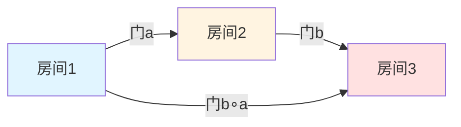
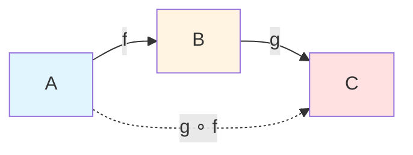
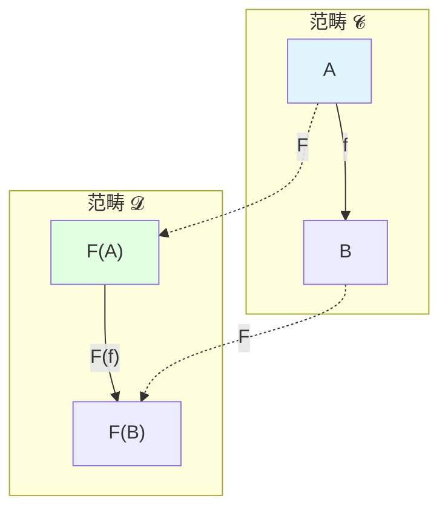
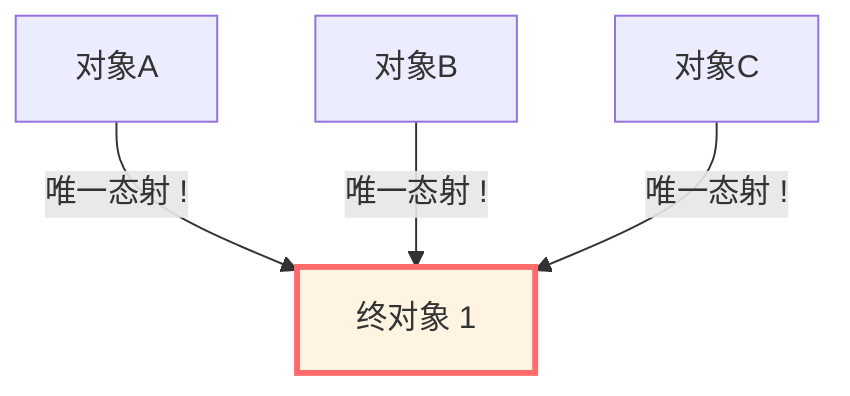
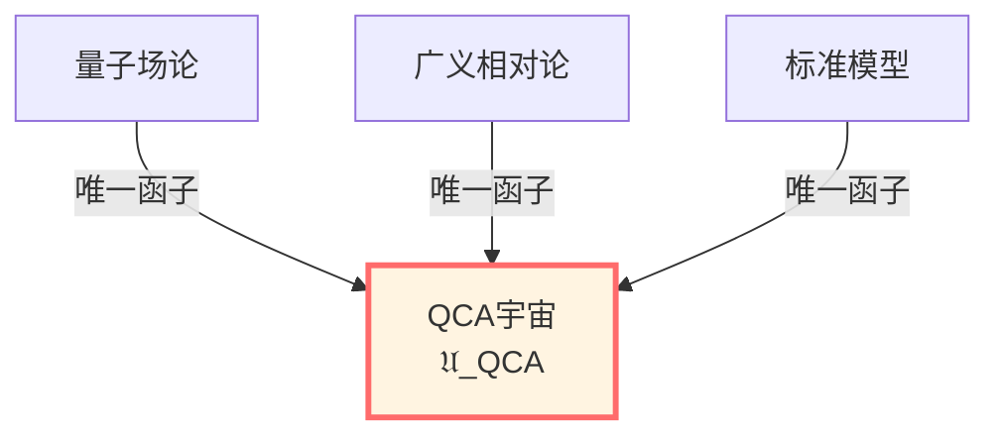
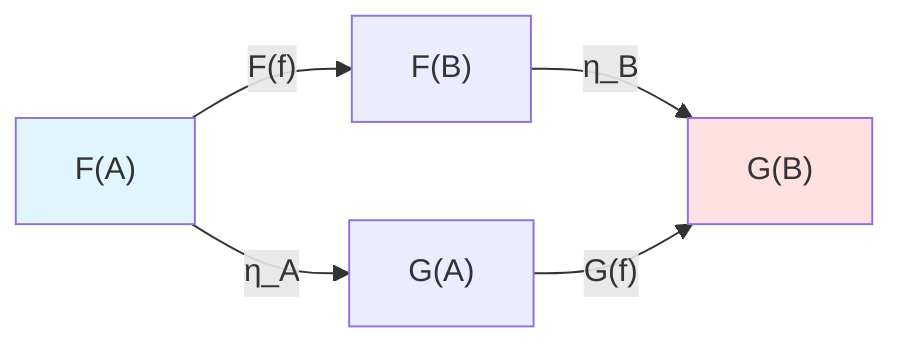

# 范畴论：数学结构的统一语言

> *"范畴论不是研究事物，而是研究事物之间的关系。"*

## 🎯 什么是范畴论？

范畴论常被称为"数学的数学"——它研究的不是具体的数学对象（集合、空间、群...），而是这些对象之间的**关系和映射**。

**核心思想**：

**结构由态射（箭头）定义，而非由内部元素定义。**

## 🏠 房间与门：直观类比

想象一栋建筑：

**传统数学**关心：
- 每个房间里有什么？（元素）
- 房间的形状？（结构）

**范畴论**关心：
- 房间之间有什么门？（态射）
- 门如何连接？（复合）
- 走遍所有房间的路径？（函子）

**关键**：房间的"本质"不是其内部，而是它与其他房间的**连接方式**！

## 📐 范畴的定义

一个**范畴** $\mathcal{C}$ 包含：

### 1. 对象（Objects）

记作 $\text{Ob}(\mathcal{C})$，例如：
- 集合范畴 **Set**：对象 = 集合
- 拓扑空间范畴 **Top**：对象 = 拓扑空间
- 群范畴 **Grp**：对象 = 群

### 2. 态射（Morphisms/Arrows）

对每对对象 $A, B$，有一个态射集合 $\text{Hom}(A, B)$。

记作 $f: A \to B$（$f$ 是从 $A$ 到 $B$ 的态射）。

### 3. 复合（Composition）

对态射 $f: A \to B$ 和 $g: B \to C$，存在复合 $g \circ f: A \to C$。

### 4. 公理

1. **结合律**：$(h \circ g) \circ f = h \circ (g \circ f)$
2. **恒等态射**：对每个对象 $A$，存在 $\text{id}_A: A \to A$，使得 $f \circ \text{id}_A = f$ 且 $\text{id}_B \circ f = f$

## 🌟 简单例子

### 例1：偏序集作为范畴

偏序集 $(P, \le)$ 可以看作范畴：
- **对象**：$P$ 的元素
- **态射**：$a \to b$ 存在 $\Leftrightarrow a \le b$
- **复合**：传递性
- **恒等**：自反性

**物理应用**：因果偏序！

$$
p \prec q \quad \Leftrightarrow \quad \exists \text{ 态射 } p \to q
$$

### 例2：单对象范畴 = 幺半群

如果范畴只有一个对象：
- **态射**：$\text{End}(X)$（自同态）
- **复合**：幺半群乘法
- **恒等**：幺元

**物理应用**：对称群、规范群！

### 例3：Hilbert空间范畴

- **对象**：Hilbert空间
- **态射**：有界线性算符
- **复合**：算符复合
- **恒等**：恒等算符

**物理应用**：量子力学！

## 🔄 函子：范畴之间的映射

### 定义

**函子** $F: \mathcal{C} \to \mathcal{D}$ 是范畴之间的映射，保持结构：

1. 对每个对象 $A \in \mathcal{C}$，给出对象 $F(A) \in \mathcal{D}$
2. 对每个态射 $f: A \to B$，给出态射 $F(f): F(A) \to F(B)$

满足：
- $F(\text{id}_A) = \text{id}_{F(A)}$
- $F(g \circ f) = F(g) \circ F(f)$

### 例子：遗忘函子

从群范畴到集合范畴的**遗忘函子**：
- $F($群$G) = $底集合
- $F($群同态$\phi) = $底函数

**物理意义**：从有结构到无结构的"粗粒化"。

## ⭐ 终对象与始对象

### 终对象（Terminal Object）

对象 $1 \in \mathcal{C}$ 是**终对象**，如果：

对任意对象 $A$，存在**唯一**态射 $! : A \to 1$。

**例子**：
- **Set** 中：单点集 $\{*\}$
- **Top** 中：单点空间
- **Grp** 中：平凡群 $\{e\}$

### 始对象（Initial Object）

对象 $0 \in \mathcal{C}$ 是**始对象**，如果：

对任意对象 $A$，存在**唯一**态射 $! : 0 \to A$。

**例子**：
- **Set** 中：空集 $\emptyset$
- **Grp** 中：平凡群（也是终对象！）

## 🌌 在GLS理论中的应用

### 1. QCA宇宙作为终对象

**定理**（QCA宇宙理论）：

QCA宇宙 $\mathfrak{U}_{\text{QCA}}$ 是物理理论范畴中的**终对象**。

$$
\forall \mathfrak{T} \in \mathcal{CAT}_{\text{phys}}, \quad \exists ! \, F: \mathfrak{T} \to \mathfrak{U}_{\text{QCA}}
$$

**物理意义**：

**任何物理理论都可以唯一地嵌入QCA宇宙！**

### 2. 矩阵宇宙的范畴等价

**定理**（矩阵宇宙理论）：

几何宇宙范畴与矩阵宇宙范畴**等价**：

$$
\mathfrak{Uni}_{\text{geo}} \simeq \mathfrak{Uni}_{\text{mat}}
$$

**物理意义**：

**Reality ≡ Causal Network ≡ THE-MATRIX**

### 3. 函子作为物理对应

物理中的很多对应关系其实是**函子**：

- **AdS/CFT**：$F: \mathcal{CAT}_{\text{AdS}} \to \mathcal{CAT}_{\text{CFT}}$
- **全息对偶**：$F: \mathcal{CAT}_{\text{bulk}} \to \mathcal{CAT}_{\text{boundary}}$
- **量子-经典对应**：$F: \mathcal{CAT}_{\text{quantum}} \to \mathcal{CAT}_{\text{classical}}$

## 🔗 自然变换

### 定义

给定两个函子 $F, G: \mathcal{C} \to \mathcal{D}$，**自然变换** $\eta: F \Rightarrow G$ 是：

对每个对象 $A \in \mathcal{C}$，给出态射 $\eta_A: F(A) \to G(A)$，

使得对任意 $f: A \to B$，下图交换：

即：$\eta_B \circ F(f) = G(f) \circ \eta_A$

### 物理意义

自然变换描述"物理过程的自然性"：

- 规范变换是自然变换
- 对偶变换是自然变换
- 量子态的演化是自然变换

## 📝 关键概念总结

| 概念 | 定义 | 例子 |
|-----|------|------|
| 范畴 | 对象+态射+复合 | Set, Top, Grp, Hilb |
| 函子 | 范畴间的映射 | 遗忘函子, 同调函子 |
| 自然变换 | 函子间的变换 | 恒等→对偶 |
| 终对象 | 唯一箭头指向它 | 单点集, QCA宇宙 |
| 始对象 | 唯一箭头从它出发 | 空集 |
| 范畴等价 | 本质等同的范畴 | 几何↔矩阵宇宙 |

## 🎓 深入阅读

- 入门教材：S. Awodey, *Category Theory* (Oxford, 2010)
- 物理应用：J. Baez, M. Stay, "Physics, Topology, Logic and Computation: A Rosetta Stone" (arXiv:0903.0340)
- GLS应用：universe-as-quantum-cellular-automaton-complete-physical-unification-theory.md
- 下一篇：[07-tools-summary.md](07-tools-summary.md) - 数学工具总结

## 🤔 练习题

1. **概念理解**：
   - 为什么说范畴论是"数学的数学"？
   - 函子与一般的映射有什么不同？
   - 终对象的唯一性如何理解？

2. **构造练习**：
   - 证明偏序集确实构成范畴
   - 验证遗忘函子保持复合
   - 构造一个自然变换的例子

3. **物理应用**：
   - 因果偏序如何用范畴论表述？
   - AdS/CFT对应如何理解为函子？
   - 为什么QCA宇宙是终对象？

4. **进阶思考**：
   - 什么是伴随函子？有什么物理意义？
   - 单子（monad）与物理中的重整化有什么关系？
   - 高阶范畴（2-category）能描述什么？

---

**最后**：让我们在总结中回顾所有数学工具，看它们如何共同支撑GLS统一理论！

