# Category Theory: Unified Language of Mathematical Structures

> *"Category theory doesn't study things, but relationships between things."*

## 🎯 What is Category Theory?

Category theory is often called "mathematics of mathematics"—it studies not specific mathematical objects (sets, spaces, groups...), but **relationships and mappings** between these objects.

**Core idea**:

**Structure is defined by morphisms (arrows), not by internal elements.**

## 🏠 Rooms and Doors: Intuitive Analogy

Imagine a building:

**Traditional mathematics** cares about:
- What's in each room? (Elements)
- Shape of rooms? (Structure)

**Category theory** cares about:
- What doors exist between rooms? (Morphisms)
- How do doors connect? (Composition)
- Paths traversing all rooms? (Functors)

```mermaid
graph LR
    R1["Room 1"] --> |"Door a"| R2["Room 2"]
    R2 --> |"Door b"| R3["Room 3"]
    R1 --> |"Door b∘a"| R3

    style R1 fill:#e1f5ff
    style R2 fill:#fff4e1
    style R3 fill:#ffe1e1
```

**Key**: The "essence" of a room is not its interior, but its **connection pattern** with other rooms!

## 📐 Definition of Category

A **category** $\mathcal{C}$ consists of:

### 1. Objects

Denoted $\text{Ob}(\mathcal{C})$, for example:
- Category of sets **Set**: Objects = Sets
- Category of topological spaces **Top**: Objects = Topological spaces
- Category of groups **Grp**: Objects = Groups

### 2. Morphisms (Arrows)

For each pair of objects $A, B$, there is a morphism set $\text{Hom}(A, B)$.

Denoted $f: A \to B$ ($f$ is a morphism from $A$ to $B$).

### 3. Composition

For morphisms $f: A \to B$ and $g: B \to C$, there exists composition $g \circ f: A \to C$.

```mermaid
graph LR
    A["A"] --> |"f"| B["B"]
    B --> |"g"| C["C"]
    A -.-> |"g ∘ f"| C

    style A fill:#e1f5ff
    style B fill:#fff4e1
    style C fill:#ffe1e1
```

### 4. Axioms

1. **Associativity**: $(h \circ g) \circ f = h \circ (g \circ f)$
2. **Identity morphism**: For each object $A$, there exists $\text{id}_A: A \to A$ such that $f \circ \text{id}_A = f$ and $\text{id}_B \circ f = f$

## 🌟 Simple Examples

### Example 1: Poset as Category

Poset $(P, \le)$ can be viewed as category:
- **Objects**: Elements of $P$
- **Morphisms**: $a \to b$ exists $\Leftrightarrow a \le b$
- **Composition**: Transitivity
- **Identity**: Reflexivity

**Physical application**: Causal partial order!

$$
p \prec q \quad \Leftrightarrow \quad \exists \text{ morphism } p \to q
$$

### Example 2: Single-Object Category = Monoid

If category has only one object:
- **Morphisms**: $\text{End}(X)$ (endomorphisms)
- **Composition**: Monoid multiplication
- **Identity**: Unit element

**Physical application**: Symmetry groups, gauge groups!

### Example 3: Hilbert Space Category

- **Objects**: Hilbert spaces
- **Morphisms**: Bounded linear operators
- **Composition**: Operator composition
- **Identity**: Identity operator

**Physical application**: Quantum mechanics!

## 🔄 Functors: Mappings Between Categories

### Definition

**Functor** $F: \mathcal{C} \to \mathcal{D}$ is a mapping between categories, preserving structure:

1. For each object $A \in \mathcal{C}$, gives object $F(A) \in \mathcal{D}$
2. For each morphism $f: A \to B$, gives morphism $F(f): F(A) \to F(B)$

Satisfying:
- $F(\text{id}_A) = \text{id}_{F(A)}$
- $F(g \circ f) = F(g) \circ F(f)$

```mermaid
graph TB
    subgraph "Category 𝓒"
        A["A"] --> |"f"| B["B"]
    end

    subgraph "Category 𝓓"
        FA["F(A)"] --> |"F(f)"| FB["F(B)"]
    end

    A -.-> |"F"| FA
    B -.-> |"F"| FB

    style A fill:#e1f5ff
    style FA fill:#e1ffe1
```

### Example: Forgetful Functor

**Forgetful functor** from category of groups to category of sets:
- $F($group $G) = $ underlying set
- $F($group homomorphism $\phi) = $ underlying function

**Physical meaning**: "Coarse-graining" from structured to unstructured.

## ⭐ Terminal and Initial Objects

### Terminal Object

Object $1 \in \mathcal{C}$ is **terminal** if:

For any object $A$, there exists **unique** morphism $! : A \to 1$.

**Examples**:
- In **Set**: Singleton $\{*\}$
- In **Top**: One-point space
- In **Grp**: Trivial group $\{e\}$

### Initial Object

Object $0 \in \mathcal{C}$ is **initial** if:

For any object $A$, there exists **unique** morphism $! : 0 \to A$.

**Examples**:
- In **Set**: Empty set $\emptyset$
- In **Grp**: Trivial group (also terminal!)

## 🌌 Application Models in GLS Theory

### 1. QCA Universe as Terminal Object

**Theoretical Conjecture** (QCA Universe Hypothesis):

In the "category of physical theories" $\mathcal{CAT}_{\text{phys}}$ defined within the GLS framework, the QCA universe $\mathfrak{U}_{\text{QCA}}$ is **proposed** as a **terminal object**.

$$
\forall \mathfrak{T} \in \mathcal{CAT}_{\text{phys}}, \quad \exists ! \, F: \mathfrak{T} \to \mathfrak{U}_{\text{QCA}}
$$

**Physical Interpretation**:

This suggests that, within this theoretical framework, **any physical theory could potentially be uniquely embedded into the QCA universe model**.

```mermaid
graph TB
    QFT["Quantum Field Theory"] --> |"Unique Functor"| QCA["QCA Universe<br/>𝔘_QCA"]
    GR["General Relativity"] --> |"Unique Functor"| QCA
    SM["Standard Model"] --> |"Unique Functor"| QCA

    style QCA fill:#fff4e1,stroke:#ff6b6b,stroke-width:3px
```

### 2. Category Equivalence of Matrix Universe

**Theoretical Proposition** (Matrix Universe Equivalence):

The geometric universe category and the matrix universe category are considered to be **categorically equivalent**:

$$
\mathfrak{Uni}_{\text{geo}} \simeq \mathfrak{Uni}_{\text{mat}}
$$

**Physical Meaning**:

This implies a deep structural isomorphism between physical reality, causal networks, and matrix models:

**Reality $\sim$ Causal Network $\sim$ Matrix Model**

### 3. Functors as Physical Correspondences

Many dualities and correspondences in physics can be precisely described using the language of **functors**:

- **AdS/CFT**: $F: \mathcal{CAT}_{\text{AdS}} \to \mathcal{CAT}_{\text{CFT}}$
- **Holographic duality**: $F: \mathcal{CAT}_{\text{bulk}} \to \mathcal{CAT}_{\text{boundary}}$
- **Quantum-classical correspondence**: $F: \mathcal{CAT}_{\text{quantum}} \to \mathcal{CAT}_{\text{classical}}$

## 🔗 Natural Transformations

### Definition

Given two functors $F, G: \mathcal{C} \to \mathcal{D}$, a **natural transformation** $\eta: F \Rightarrow G$ is:

For each object $A \in \mathcal{C}$, gives a morphism $\eta_A: F(A) \to G(A)$,

such that for any $f: A \to B$, the following diagram commutes:

```mermaid
graph LR
    FA["F(A)"] --> |"F(f)"| FB["F(B)"]
    FA --> |"η_A"| GA["G(A)"]
    FB --> |"η_B"| GB["G(B)"]
    GA --> |"G(f)"| GB

    style FA fill:#e1f5ff
    style GB fill:#ffe1e1
```

That is: $\eta_B \circ F(f) = G(f) \circ \eta_A$

### Physical Meaning

Natural transformations provide a mathematical language to describe the "naturalness of physical processes":

- Gauge transformations can be viewed as natural transformations
- Connections between duality transformations
- Covariance of quantum state evolution

## 📝 Key Concepts Summary

| Concept | Definition | Examples |
|---------|-----------|----------|
| Category | Objects + Morphisms + Composition | Set, Top, Grp, Hilb |
| Functor | Mapping between categories | Forgetful functor, Homology functor |
| Natural Transformation | Transformation between functors | Identity → Duality |
| Terminal Object | Unique arrow points to it | Singleton, QCA universe |
| Initial Object | Unique arrow from it | Empty set |
| Category Equivalence | Essentially identical categories | Geometric ↔ Matrix universe |

## 🎓 Further Reading

- Introductory textbook: S. Awodey, *Category Theory* (Oxford, 2010)
- Physical applications: J. Baez, M. Stay, "Physics, Topology, Logic and Computation: A Rosetta Stone" (arXiv:0903.0340)
- GLS application: universe-as-quantum-cellular-automaton-complete-physical-unification-theory.md
- Next: [07-tools-summary_en.md](07-tools-summary_en.md) - Mathematical Tools Summary

## 🤔 Exercises

1. **Conceptual Understanding**:
   - Why is category theory called "mathematics of mathematics"?
   - How do functors differ from general mappings?
   - How to understand uniqueness of terminal object?

2. **Construction Exercises**:
   - Prove that poset indeed forms a category
   - Verify forgetful functor preserves composition
   - Construct an example of natural transformation

3. **Physical Applications**:
   - How to express causal partial order using category theory?
   - How to understand AdS/CFT correspondence as functor?
   - Why is QCA universe terminal object?

4. **Advanced Thinking**:
   - What are adjoint functors? What is their physical meaning?
   - What is the relationship between monads and renormalization in physics?
   - What can higher categories (2-category) describe?

---

**Finally**: Let's review all mathematical tools in the summary and see how they jointly support GLS unified theory!

