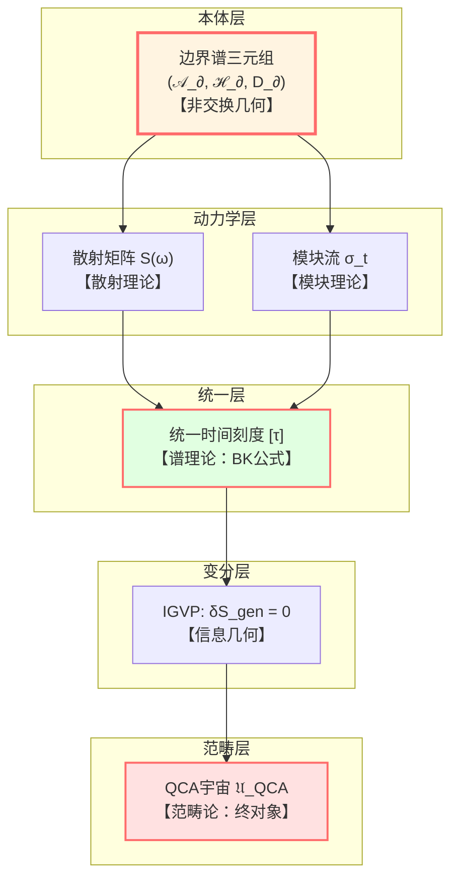
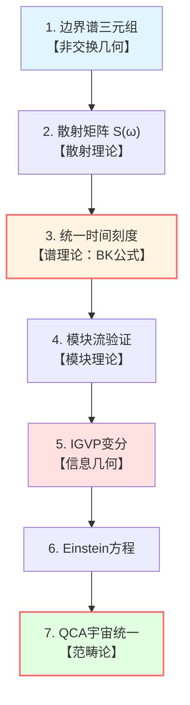
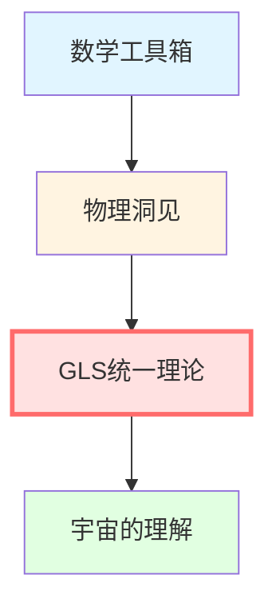

# 数学工具总结：工具箱全景

> *"理解工具，才能理解理论。"*

## 🎯 我们学到了什么？

在这一章中，我们掌握了GLS理论的六大数学工具：

1. **谱理论** - 算符的频谱分析
2. **非交换几何** - 代数定义的几何
3. **散射理论** - S-矩阵与演化
4. **模块理论** - 态决定的时间流
5. **信息几何** - 概率的度规结构
6. **范畴论** - 数学结构的统一语言

现在让我们看看它们如何**协同工作**，共同支撑GLS统一理论。

## 🧩 六大工具的协同关系

## 🔗 工具与核心洞见的对应

让我们重新审视五个核心洞见，看每个洞见用到了哪些数学工具：

### 洞见1：时间就是几何

**主要工具**：
- **谱理论**：相位 $\varphi = (mc^2/\hbar)\int d\tau$ 的谱分解
- **非交换几何**：Dirac算符 $D_\partial$ 定义几何时间
- **模块理论**：模块流 $\sigma_t$ 给出内在时间

**关键公式**：
$$
\kappa(\omega) = \frac{\varphi'(\omega)}{\pi} = \frac{1}{2\pi}\text{tr}\,Q(\omega)
$$

### 洞见2：因果就是偏序

**主要工具**：
- **范畴论**：偏序集作为范畴
- **谱理论**：谱的非负性保证时间单调
- **信息几何**：相对熵单调性

**关键关系**：
$$
p \prec q \quad \Longleftrightarrow \quad \tau(p) \le \tau(q) \quad \Longleftrightarrow \quad S_{\text{gen}}(p) \le S_{\text{gen}}(q)
$$

### 洞见3：边界就是实在

**主要工具**：
- **非交换几何**：边界谱三元组 $(\mathcal{A}_\partial, \mathcal{H}_\partial, D_\partial)$
- **模块理论**：边界代数的模块流
- **范畴论**：边界-体域的函子对应

**关键定理**：
边界度规由Connes距离公式唯一重构

### 洞见4：散射就是演化

**主要工具**：
- **散射理论**：S-矩阵，Wigner-Smith矩阵
- **谱理论**：Birman-Kreĭn公式连接谱与散射
- **范畴论**：矩阵宇宙的范畴等价

**核心对象**：
$$
S(\omega), \quad Q(\omega) = -iS^\dagger\partial_\omega S
$$

### 洞见5：熵就是箭头

**主要工具**：
- **信息几何**：相对熵，Fisher度规
- **模块理论**：KMS条件，热时间
- **谱理论**：态密度与熵的关系

**IGVP**：
$$
\delta S_{\text{gen}} = 0 \quad \Rightarrow \quad G_{ab} + \Lambda g_{ab} = 8\pi G T_{ab}
$$

## 📊 工具功能矩阵

| 工具 | 核心概念 | GLS中的作用 | 关键公式 |
|-----|---------|------------|---------|
| **谱理论** | 谱移函数 $\xi(\omega)$ | 统一时间刻度 | $\det S = e^{-2\pi i\xi}$ |
| **非交换几何** | 谱三元组 $(分析,\mathcal{H},D)$ | 边界几何定义 | Connes距离 |
| **散射理论** | S-矩阵 | 演化本体 | $Q = -iS^\dagger\partial_\omega S$ |
| **模块理论** | 模块流 $\sigma_t$ | 内在时间 | $\sigma_t(A) = \Delta^{it}A\Delta^{-it}$ |
| **信息几何** | 相对熵 | IGVP变分 | $S(\rho||\sigma)$ |
| **范畴论** | 终对象 | QCA宇宙 | 唯一函子 |

## 🌊 从边界到场方程：完整流程

让我们走一遍完整的逻辑链，看六大工具如何协作：

### 第1步：边界数据（非交换几何）

**输入**：边界谱三元组 $(\mathcal{A}_\partial, \mathcal{H}_\partial, D_\partial)$

**输出**：边界度规 $h_{ab}$，边界可观测代数

### 第2步：散射矩阵（散射理论）

**输入**：边界代数 $\mathcal{A}_\partial$

**输出**：散射矩阵 $S(\omega)$，连接过去与未来

### 第3步：时间刻度（谱理论）

**输入**：$S(\omega)$

**通过Birman-Kreĭn公式**：$\det S(\omega) = e^{-2\pi i\xi(\omega)}$

**输出**：统一时间刻度 $\tau(\omega) = \int \rho_{\text{rel}}(\omega) d\omega$

### 第4步：模块流（模块理论）

**输入**：边界态 $\omega$，代数 $\mathcal{A}_\partial$

**输出**：模块流 $\sigma_t$

**验证**：$\sigma_t$ 与 $\tau$ 仿射等价

### 第5步：IGVP变分（信息几何）

**输入**：广义熵 $S_{\text{gen}} = A/(4G\hbar) + S_{\text{out}}$

**变分条件**：
- 一阶：$\delta S_{\text{gen}} = 0$（固定体积）
- 二阶：$\delta^2 S_{\text{rel}} \ge 0$

**输出**：Einstein场方程 $G_{ab} + \Lambda g_{ab} = 8\pi G T_{ab}$

### 第6步：范畴统一（范畴论）

**输入**：所有物理理论

**构造**：范畴 $\mathcal{CAT}_{\text{phys}}$

**定理**：QCA宇宙 $\mathfrak{U}_{\text{QCA}}$ 是终对象

**含义**：所有理论唯一嵌入QCA宇宙

## 💡 重要公式速查

### 谱理论
$$
\det S(\omega) = e^{-2\pi i\xi(\omega)}, \quad \xi'(\omega) = \rho_{\text{rel}}(\omega)
$$

### 非交换几何
$$
d(x,y) = \sup\{|f(x)-f(y)|: \|[D,f]\| \le 1\}
$$

### 散射理论
$$
Q(\omega) = -iS(\omega)^\dagger\frac{\partial S(\omega)}{\partial\omega}
$$

### 模块理论
$$
\sigma_t(A) = \Delta^{it} A \Delta^{-it}
$$

### 信息几何
$$
D_{KL}(p||q) = \sum_i p_i \ln\frac{p_i}{q_i}, \quad g_{ij} = \mathbb{E}[\partial_i \ln p \cdot \partial_j \ln p]
$$

### 范畴论
$$
\forall \mathfrak{T}, \, \exists! \, F: \mathfrak{T} \to \mathfrak{U}_{\text{QCA}}
$$

## 🎓 学习建议回顾

### 最小路径（快速理解GLS）
1. **谱理论** → Birman-Kreĭn公式
2. **散射理论** → S-矩阵和Q-矩阵
3. **信息几何** → 相对熵和IGVP

### 扎实路径（深入掌握）
全部学习，包括：
- 谱理论的技术细节
- 非交换几何的Connes重构
- 模块理论的Tomita-Takesaki
- 范畴论的函子和自然变换

### 数学家路径（完全理解）
- 阅读原始论文
- 完成所有练习
- 推导所有定理

## 🚀 下一步：应用这些工具

现在你已经掌握了数学工具箱，可以深入以下专题：

1. **IGVP框架篇**（04-igvp-framework）
   - 用信息几何和谱理论推导Einstein方程

2. **统一时间篇**（05-unified-time）
   - 用谱理论和散射理论详解时间刻度同一式

3. **边界理论篇**（06-boundary-theory）
   - 用非交换几何构建边界框架

4. **QCA宇宙篇**（09-qca-universe）
   - 用范畴论证明QCA宇宙是终对象

5. **矩阵宇宙篇**（10-matrix-universe）
   - 用范畴论证明几何-矩阵等价

## 📝 自测清单

在进入下一章之前，确保你能回答：

### 谱理论
- [ ] 什么是谱移函数？
- [ ] Birman-Kreĭn公式是什么？
- [ ] 如何从散射矩阵计算态密度？

### 非交换几何
- [ ] 什么是谱三元组？
- [ ] Connes距离如何定义？
- [ ] 为什么代数可以定义几何？

### 散射理论
- [ ] S-矩阵的物理意义？
- [ ] Wigner-Smith矩阵如何定义？
- [ ] 时间延迟与相移有什么关系？

### 模块理论
- [ ] 什么是模块流？
- [ ] KMS条件的物理意义？
- [ ] 热时间假设是什么？

### 信息几何
- [ ] KL散度为什么不对称？
- [ ] Fisher信息矩阵是什么？
- [ ] 量子相对熵如何定义？

### 范畴论
- [ ] 什么是函子？
- [ ] 终对象如何定义？
- [ ] 为什么QCA宇宙是终对象？

## 🎉 结语

**恭喜！**你已经掌握了GLS理论的数学语言。

这些工具不是孤立的，而是**有机统一**的整体：

- **谱理论**提供量化
- **非交换几何**提供本体
- **散射理论**提供动力学
- **模块理论**提供时间
- **信息几何**提供变分
- **范畴论**提供统一

它们共同编织成GLS统一理论的数学骨架。

**准备好了吗？让我们继续探索GLS理论的深层结构！**

---

**下一章预告**：

在**IGVP框架篇**中，我们将详细推导如何从熵的变分原理导出Einstein场方程——这是GLS理论最辉煌的成就之一！

