# Mathematical Tools Summary: Complete Toolbox Overview

> *"Understanding tools is understanding theory."*

## 🎯 What Have We Learned?

In this chapter, we mastered six mathematical tools of GLS theory:

1. **Spectral Theory** - Spectral analysis of operators
2. **Noncommutative Geometry** - Algebra-defined geometry
3. **Scattering Theory** - S-matrix and evolution
4. **Modular Theory** - State-determined time flow
5. **Information Geometry** - Metric structure of probability
6. **Category Theory** - Unified language of mathematical structures

Now let's see how they **work together** to jointly support GLS unified theory.

## 🧩 Synergistic Relations of Six Tools

```mermaid
graph TB
    subgraph "Ontological Layer"
        B["Boundary Spectral Triple<br/>(𝒜_∂, ℋ_∂, D_∂)<br/>【Noncommutative Geometry】"]
    end

    subgraph "Dynamical Layer"
        S["Scattering Matrix S(ω)<br/>【Scattering Theory】"]
        M["Modular Flow σ_t<br/>【Modular Theory】"]
    end

    subgraph "Unification Layer"
        U["Unified Time Scale [τ]<br/>【Spectral Theory: BK Formula】"]
    end

    subgraph "Variational Layer"
        I["IGVP: δS_gen = 0<br/>【Information Geometry】"]
    end

    subgraph "Category Layer"
        C["QCA Universe 𝔘_QCA<br/>【Category Theory: Terminal Object】"]
    end

    B --> S
    B --> M
    S --> U
    M --> U
    U --> I
    I --> C

    style B fill:#fff4e1,stroke:#ff6b6b,stroke-width:3px
    style U fill:#e1ffe1,stroke:#ff6b6b,stroke-width:2px
    style C fill:#ffe1e1,stroke:#ff6b6b,stroke-width:2px
```

## 🔗 Correspondence Between Tools and Core Insights

Let's revisit the five core insights and see which mathematical tools each uses:

### Insight 1: Time is Geometry

**Main tools**:
- **Spectral Theory**: Spectral decomposition of phase $\varphi = (mc^2/\hbar)\int d\tau$
- **Noncommutative Geometry**: Dirac operator $D_\partial$ defines geometric time
- **Modular Theory**: Modular flow $\sigma_t$ gives intrinsic time

**Key formula**:
$$
\kappa(\omega) = \frac{\varphi'(\omega)}{\pi} = \frac{1}{2\pi}\text{tr}\,Q(\omega)
$$

### Insight 2: Causality is Partial Order

**Main tools**:
- **Category Theory**: Poset as category
- **Spectral Theory**: Non-negativity of spectrum ensures time monotonicity
- **Information Geometry**: Relative entropy monotonicity

**Key relation**:
$$
p \prec q \quad \Longleftrightarrow \quad \tau(p) \le \tau(q) \quad \Longleftrightarrow \quad S_{\text{gen}}(p) \le S_{\text{gen}}(q)
$$

### Insight 3: Boundary is Reality

**Main tools**:
- **Noncommutative Geometry**: Boundary spectral triple $(\mathcal{A}_\partial, \mathcal{H}_\partial, D_\partial)$
- **Modular Theory**: Modular flow of boundary algebra
- **Category Theory**: Functor correspondence between boundary and bulk

**Key theorem**:
Boundary metric uniquely reconstructed by Connes distance formula

### Insight 4: Scattering is Evolution

**Main tools**:
- **Scattering Theory**: S-matrix, Wigner-Smith matrix
- **Spectral Theory**: Birman-Kreĭn formula connects spectrum and scattering
- **Category Theory**: Category equivalence of matrix universe

**Core objects**:
$$
S(\omega), \quad Q(\omega) = -iS^\dagger\partial_\omega S
$$

### Insight 5: Entropy is Arrow

**Main tools**:
- **Information Geometry**: Relative entropy, Fisher metric
- **Modular Theory**: KMS condition, thermal time
- **Spectral Theory**: Relationship between density of states and entropy

**IGVP**:
$$
\delta S_{\text{gen}} = 0 \quad \Rightarrow \quad G_{ab} + \Lambda g_{ab} = 8\pi G T_{ab}
$$

## 📊 Tool Function Matrix

| Tool | Core Concept | Role in GLS | Key Formula |
|------|-------------|-------------|-------------|
| **Spectral Theory** | Spectral shift function $\xi(\omega)$ | Unified time scale | $\det S = e^{-2\pi i\xi}$ |
| **Noncommutative Geometry** | Spectral triple $(\mathcal{A},\mathcal{H},D)$ | Boundary geometry definition | Connes distance |
| **Scattering Theory** | S-matrix | Evolution ontology | $Q = -iS^\dagger\partial_\omega S$ |
| **Modular Theory** | Modular flow $\sigma_t$ | Intrinsic time | $\sigma_t(A) = \Delta^{it}A\Delta^{-it}$ |
| **Information Geometry** | Relative entropy | IGVP variation | $S(\rho||\sigma)$ |
| **Category Theory** | Terminal object | QCA universe | Unique functor |

## 🌊 From Boundary to Field Equation: Complete Flow

Let's walk through the complete logic chain and see how the six tools collaborate:

### Step 1: Boundary Data (Noncommutative Geometry)

**Input**: Boundary spectral triple $(\mathcal{A}_\partial, \mathcal{H}_\partial, D_\partial)$

**Output**: Boundary metric $h_{ab}$, boundary observable algebra

### Step 2: Scattering Matrix (Scattering Theory)

**Input**: Boundary algebra $\mathcal{A}_\partial$

**Output**: Scattering matrix $S(\omega)$, connecting past and future

### Step 3: Time Scale (Spectral Theory)

**Input**: $S(\omega)$

**Through Birman-Kreĭn formula**: $\det S(\omega) = e^{-2\pi i\xi(\omega)}$

**Output**: Unified time scale $\tau(\omega) = \int \rho_{\text{rel}}(\omega) d\omega$

### Step 4: Modular Flow (Modular Theory)

**Input**: Boundary state $\omega$, algebra $\mathcal{A}_\partial$

**Output**: Modular flow $\sigma_t$

**Verification**: $\sigma_t$ is affinely equivalent to $\tau$

### Step 5: IGVP Variation (Information Geometry)

**Input**: Generalized entropy $S_{\text{gen}} = A/(4G\hbar) + S_{\text{out}}$

**Variational conditions**:
- First-order: $\delta S_{\text{gen}} = 0$ (fixed volume)
- Second-order: $\delta^2 S_{\text{rel}} \ge 0$

**Output**: Einstein field equation $G_{ab} + \Lambda g_{ab} = 8\pi G T_{ab}$

### Step 6: Category Unification (Category Theory)

**Input**: All physical theories

**Construction**: Category $\mathcal{CAT}_{\text{phys}}$

**Theoretical Conjecture**: QCA universe $\mathfrak{U}_{\text{QCA}}$ is proposed as a terminal object

**Meaning**: All theories could potentially uniquely embed into QCA universe

```mermaid
graph TB
    S1["Step 1: Boundary Spectral Triple<br/>【Noncommutative Geometry】"] --> S2["Step 2: Scattering Matrix S(ω)<br/>【Scattering Theory】"]
    S2 --> S3["Step 3: Unified Time Scale<br/>【Spectral Theory: BK Formula】"]
    S3 --> S4["Step 4: Modular Flow Verification<br/>【Modular Theory】"]
    S4 --> S5["Step 5: IGVP Variation<br/>【Information Geometry】"]
    S5 --> S6["Step 6: Einstein Equation"]
    S6 --> S7["Step 7: QCA Universe Unification<br/>【Category Theory】"]

    style S1 fill:#e1f5ff
    style S3 fill:#fff4e1,stroke:#ff6b6b,stroke-width:2px
    style S5 fill:#ffe1e1
    style S7 fill:#e1ffe1,stroke:#ff6b6b,stroke-width:2px
```

## 💡 Quick Reference of Important Formulas

### Spectral Theory
$$
\det S(\omega) = e^{-2\pi i\xi(\omega)}, \quad \xi'(\omega) = \rho_{\text{rel}}(\omega)
$$

### Noncommutative Geometry
$$
d(x,y) = \sup\{|f(x)-f(y)|: \|[D,f]\| \le 1\}
$$

### Scattering Theory
$$
Q(\omega) = -iS(\omega)^\dagger\frac{\partial S(\omega)}{\partial\omega}
$$

### Modular Theory
$$
\sigma_t(A) = \Delta^{it} A \Delta^{-it}
$$

### Information Geometry
$$
D_{KL}(p||q) = \sum_i p_i \ln\frac{p_i}{q_i}, \quad g_{ij} = \mathbb{E}[\partial_i \ln p \cdot \partial_j \ln p]
$$

### Category Theory
$$
\forall \mathfrak{T}, \, \exists! \, F: \mathfrak{T} \to \mathfrak{U}_{\text{QCA}}
$$

## 🎓 Learning Suggestions Review

### Minimal Path (Quick Understanding of GLS)
1. **Spectral Theory** → Birman-Kreĭn formula
2. **Scattering Theory** → S-matrix and Q-matrix
3. **Information Geometry** → Relative entropy and IGVP

### Solid Path (Deep Mastery)
Learn everything, including:
- Technical details of spectral theory
- Connes reconstruction of noncommutative geometry
- Tomita-Takesaki of modular theory
- Functors and natural transformations of category theory

### Mathematician Path (Complete Understanding)
- Read original papers
- Complete all exercises
- Derive all theorems

## 🚀 Next: Apply These Tools

Now that you've mastered the mathematical toolbox, you can delve into:

1. **IGVP Framework** (04-igvp-framework)
   - Derive Einstein equation using information geometry and spectral theory

2. **Unified Time** (05-unified-time)
   - Detailed explanation of time scale identity using spectral theory and scattering theory

3. **Boundary Theory** (06-boundary-theory)
   - Construct boundary framework using noncommutative geometry

4. **QCA Universe** (09-qca-universe)
   - Explore the properties of QCA universe as a proposed terminal object using category theory

5. **Matrix Universe** (10-matrix-universe)
   - Study the equivalence between geometric and matrix universes using category theory

## 📝 Self-Check List

Before entering next chapter, ensure you can answer:

### Spectral Theory
- [ ] What is spectral shift function?
- [ ] What is Birman-Kreĭn formula?
- [ ] How to calculate density of states from scattering matrix?

### Noncommutative Geometry
- [ ] What is spectral triple?
- [ ] How is Connes distance defined?
- [ ] Why can algebra define geometry?

### Scattering Theory
- [ ] Physical meaning of S-matrix?
- [ ] How is Wigner-Smith matrix defined?
- [ ] What is the relationship between time delay and phase shift?

### Modular Theory
- [ ] What is modular flow?
- [ ] Physical meaning of KMS condition?
- [ ] What is thermal time hypothesis?

### Information Geometry
- [ ] Why is KL divergence asymmetric?
- [ ] What is Fisher information matrix?
- [ ] How is quantum relative entropy defined?

### Category Theory
- [ ] What is a functor?
- [ ] How is terminal object defined?
- [ ] Why is QCA universe proposed as a terminal object?

## 🎉 Conclusion

**Summary**: You have now explored the mathematical language of GLS theory.

These tools are not isolated, but an **organically unified** whole:

- **Spectral Theory** provides quantization
- **Noncommutative Geometry** provides ontology
- **Scattering Theory** provides dynamics
- **Modular Theory** provides time
- **Information Geometry** provides variation
- **Category Theory** provides unification

They jointly weave the mathematical skeleton of GLS unified theory.

**Ready? Let's continue exploring the deep structure of GLS theory!**

---

**Next Chapter Preview**:

In **IGVP Framework**, we will detail how to derive Einstein field equation from variational principle of entropy—one of the key theoretical achievements of GLS theory!

