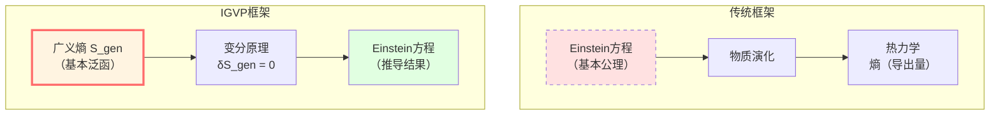
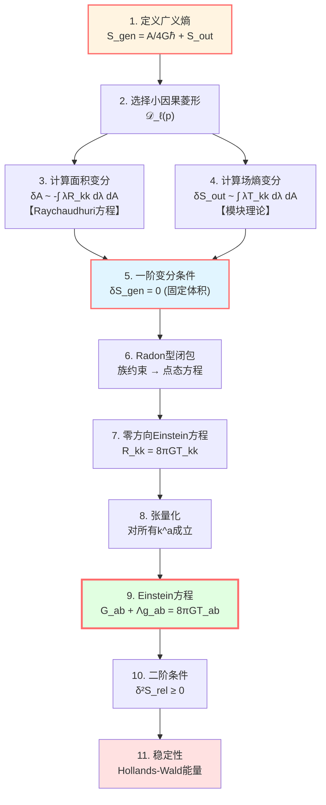
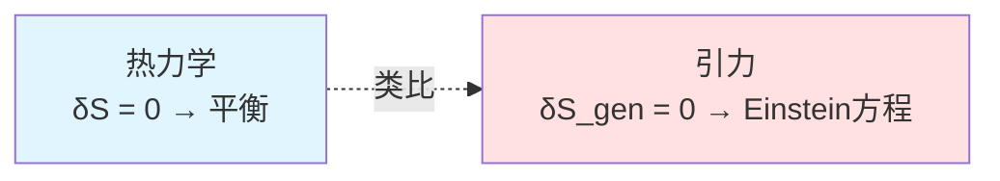

# IGVP框架篇：从熵到Einstein方程

> *"引力不是基本力，而是熵的几何表现。"* — Jacobson (1995)

## 🎯 本章目标

这一章将展示GLS理论最辉煌的成就之一：

**如何从熵的变分原理推导出Einstein场方程？**

这不是一个猜想，而是严格的数学推导！

## 🌟 核心思想

### 传统视角

在传统物理学中：

1. **Einstein方程**是基本公理：
   $$G_{ab} + \Lambda g_{ab} = 8\pi G T_{ab}$$

2. **熵**是导出的热力学量：
   $$S = k_B \ln \Omega$$

3. 两者看似独立

### IGVP视角

**信息几何变分原理（IGVP）**颠倒了这个逻辑：

1. **广义熵**是基本变分泛函：
   $$S_{\text{gen}} = \frac{A}{4G\hbar} + S_{\text{out}}$$

2. **变分条件**：
   - 一阶：$\delta S_{\text{gen}} = 0$（固定体积）
   - 二阶：$\delta^2 S_{\text{rel}} \ge 0$（稳定性）

3. **Einstein方程**是变分的结果：
   $$\boxed{\delta S_{\text{gen}} = 0 \quad \Rightarrow \quad G_{ab} + \Lambda g_{ab} = 8\pi G T_{ab}}$$

## 📚 本章内容概览

### 第1篇：广义熵的定义
**主题**：什么是广义熵？为什么它包含两项？

**关键概念**：
- Bekenstein-Hawking面积项：$A/(4G\hbar)$
- von Neumann场熵：$S_{\text{out}}$
- 为什么要"广义"？

**比喻**：气球的总"信息"=表面积+内部气体熵

### 第2篇：小因果菱形
**主题**：变分在哪里进行？

**关键概念**：
- 小因果菱形 $\mathcal{D}_\ell(p)$
- 腰面（waist）与体积
- 局域性的重要性

**比喻**：用放大镜观察时空的每一个小区域

### 第3篇：Raychaudhuri方程
**主题**：曲率如何影响面积？

**关键方程**：
$$\frac{d\theta}{d\lambda} = -\frac{1}{d-2}\theta^2 - \sigma^2 - R_{kk}$$

**物理意义**：
- $\theta$：零测地线的扩张率
- $R_{kk}$：曲率项
- 曲率导致测地线汇聚

**比喻**：光束在引力场中的聚焦

### 第4篇：一阶变分与Einstein方程
**主题**：$\delta S_{\text{gen}} = 0$ 如何导出 $R_{kk} = 8\pi G T_{kk}$？

**推导链**：
1. 计算 $\delta S_{\text{gen}} = \delta A/(4G\hbar) + \delta S_{\text{out}}$
2. 用Raychaudhuri方程：$\delta A \sim -\int R_{kk}$
3. 用模块理论：$\delta S_{\text{out}} \sim \int T_{kk}$
4. 令变分为零 → Einstein方程

**关键技术**：Radon型闭包（族约束→点态方程）

### 第5篇：二阶变分与稳定性
**主题**：$\delta^2 S_{\text{rel}} \ge 0$ 保证什么？

**物理意义**：
- 相对熵非负
- Hollands-Wald规范能量
- 量子零能量条件（QNEC）

**结果**：Einstein方程的解是稳定的

### 第6篇：IGVP总结
**主题**：回顾完整推导，讨论物理意义

## 🗺️ 推导流程图

完整的IGVP推导可以用以下流程图概括：

## 🔑 关键数学工具回顾

在推导中，我们会用到以下数学工具（在数学工具篇已学习）：

| 工具 | 在IGVP中的作用 | 关键公式 |
|-----|--------------|---------|
| **信息几何** | 定义广义熵和相对熵 | $S_{\text{gen}} = A/(4G\hbar) + S_{\text{out}}$ |
| **模块理论** | 连接场熵与应力张量 | $\delta S_{\text{out}} = \delta\langle K_\chi \rangle / T$ |
| **谱理论** | 态密度与时间延迟 | $\rho_{\text{rel}} = (2\pi)^{-1}\text{tr}\,Q$ |
| **微分几何** | Raychaudhuri方程 | $\theta' = -\theta^2/(d-2) - \sigma^2 - R_{kk}$ |

## 💡 物理直觉：为什么熵能导出引力？

### 类比1：热力学第一定律

在热力学中：

$$dE = T dS - P dV$$

**变分**：固定体积 $\delta V = 0$，则 $\delta E = T \delta S$

**极值**：平衡态满足 $\delta S = 0$（固定能量）

### IGVP的类比

在引力中：

$$\delta S_{\text{gen}} = \frac{\delta A}{4G\hbar} + \frac{\delta Q}{T}$$

**变分**：固定体积 $\delta V = 0$

**极值**：$\delta S_{\text{gen}} = 0$

**结果**：Einstein方程！

### 类比2：最小作用量原理

**传统场论**：

$$\delta S[\phi] = 0 \quad \Rightarrow \quad \text{场方程}$$

**IGVP**：

$$\delta S_{\text{gen}}[g] = 0 \quad \Rightarrow \quad \text{Einstein方程}$$

**深刻洞察**：

**引力场方程不是动力学方程，而是熵极值条件！**

## 🌊 历史背景

### Bekenstein-Hawking (1970s)
发现黑洞熵与视界面积成正比：

$$S_{\text{BH}} = \frac{A}{4G\hbar}$$

**启示**：引力与热力学深刻相关

### Jacobson (1995)
首次从热力学推导Einstein方程：

$$\delta Q = T dS \quad \Rightarrow \quad G_{ab} = 8\pi G T_{ab}$$

**突破**：引力是热力学现象

### Hollands-Wald (2013)
二阶变分与相对熵：

$$\delta^2 S_{\text{rel}} = \mathcal{E}_{\text{can}} \ge 0$$

**深化**：稳定性条件

### GLS理论 (2020s)
完整的IGVP框架：

- 显式小钻石极限
- Radon型闭包
- 边界时间几何
- 统一变分原理

**集大成**：熵-引力-时间-因果的完全统一

## 📊 学习路径建议

### 路径A：快速理解（重点概念）

1. 阅读：01-广义熵, 04-一阶变分, 06-总结
2. 跳过技术细节
3. 理解核心思想：熵→Einstein

**适合**：想快速了解IGVP框架的读者

### 路径B：扎实掌握（完整推导）

1. 按顺序阅读全部6篇
2. 理解每个推导步骤
3. 完成练习题

**适合**：想深入理解技术细节的读者

### 路径C：研究级（严格证明）

1. 阅读本章全部内容
2. 阅读原始论文：[igvp-einstein-complete.md](../../euler-gls-paper/igvp-einstein-complete.md)
3. 推导所有公式
4. 理解所有技术假设

**适合**：研究人员和博士生

## 🎨 关键术语中英对照

| 中文 | 英文 | 含义 |
|-----|------|------|
| 信息几何变分原理 | IGVP | Information-Geometric Variational Principle |
| 广义熵 | $S_{\text{gen}}$ | Generalized Entropy |
| 小因果菱形 | Causal Diamond | 局域变分区域 |
| Raychaudhuri方程 | Raychaudhuri Equation | 描述测地线汇聚 |
| 腰面 | Waist | 因果菱形的最大空间截面边界 |
| Radon型闭包 | Radon-type Closure | 族约束→点态方程 |
| 规范能量 | Canonical Energy | Hollands-Wald能量 |

## 🚀 准备好了吗？

在接下来的文章中，我们将逐步揭开IGVP的神秘面纱：

1. 从熵的定义开始
2. 通过Raychaudhuri方程理解几何
3. 用变分原理推导场方程
4. 验证稳定性条件
5. 理解深刻的物理意义

**让我们开始这段精彩的旅程！**

---

**下一篇**：[01-generalized-entropy.md](./01-generalized-entropy.md) - 广义熵：几何+量子的统一

