# IGVP Framework: From Entropy to Einstein's Equations

> *"Gravity is not a fundamental force, but a geometric manifestation of entropy."* — Jacobson (1995)

## 🎯 Chapter Goals

This chapter will demonstrate one of the most brilliant achievements of GLS theory:

**How to derive Einstein's field equations from a variational principle of entropy?**

This is not a conjecture, but a rigorous mathematical derivation!

## 🌟 Core Ideas

### Traditional Perspective

In traditional physics:

1. **Einstein's equations** are fundamental axioms:
   $$G_{ab} + \Lambda g_{ab} = 8\pi G T_{ab}$$

2. **Entropy** is a derived thermodynamic quantity:
   $$S = k_B \ln \Omega$$

3. The two appear independent

### IGVP Perspective

The **Information-Geometric Variational Principle (IGVP)** reverses this logic:

1. **Generalized entropy** is the fundamental variational functional:
   $$S_{\text{gen}} = \frac{A}{4G\hbar} + S_{\text{out}}$$

2. **Variational conditions**:
   - First order: $\delta S_{\text{gen}} = 0$ (fixed volume)
   - Second order: $\delta^2 S_{\text{rel}} \ge 0$ (stability)

3. **Einstein's equations** are the result of variation:
   $$\boxed{\delta S_{\text{gen}} = 0 \quad \Rightarrow \quad G_{ab} + \Lambda g_{ab} = 8\pi G T_{ab}}$$

```mermaid
graph TB
    subgraph "Traditional Framework"
        E1["Einstein Equations<br/>(Fundamental Axiom)"] --> H1["Matter Evolution"]
        H1 --> T1["Thermodynamics<br/>Entropy (Derived)"]
    end

    subgraph "IGVP Framework"
        S2["Generalized Entropy S_gen<br/>(Fundamental Functional)"] --> V["Variational Principle<br/>δS_gen = 0"]
        V --> E2["Einstein Equations<br/>(Derived Result)"]
    end

    style E1 fill:#ffe1e1,stroke-dasharray: 5 5
    style S2 fill:#fff4e1,stroke:#ff6b6b,stroke-width:3px
    style E2 fill:#e1ffe1
```

## 📚 Chapter Overview

### Part 1: Definition of Generalized Entropy
**Theme**: What is generalized entropy? Why does it contain two terms?

**Key concepts**:
- Bekenstein-Hawking area term: $A/(4G\hbar)$
- von Neumann field entropy: $S_{\text{out}}$
- Why "generalized"?

**Analogy**: Total "information" of a balloon = surface area + internal gas entropy

### Part 2: Small Causal Diamond
**Theme**: Where does the variation take place?

**Key concepts**:
- Small causal diamond $\mathcal{D}_\ell(p)$
- Waist and volume
- Importance of locality

**Analogy**: Observing each small region of spacetime with a magnifying glass

### Part 3: Raychaudhuri Equation
**Theme**: How does curvature affect area?

**Key equation**:
$$\frac{d\theta}{d\lambda} = -\frac{1}{d-2}\theta^2 - \sigma^2 - R_{kk}$$

**Physical meaning**:
- $\theta$: expansion rate of null geodesics
- $R_{kk}$: curvature term
- Curvature causes geodesic convergence

**Analogy**: Focusing of light beams in a gravitational field

### Part 4: First-Order Variation and Einstein's Equations
**Theme**: How does $\delta S_{\text{gen}} = 0$ lead to $R_{kk} = 8\pi G T_{kk}$?

**Derivation chain**:
1. Calculate $\delta S_{\text{gen}} = \delta A/(4G\hbar) + \delta S_{\text{out}}$
2. Use Raychaudhuri equation: $\delta A \sim -\int R_{kk}$
3. Use modular theory: $\delta S_{\text{out}} \sim \int T_{kk}$
4. Set variation to zero → Einstein's equations

**Key technique**: Radon-type closure (family constraint → pointwise equation)

### Part 5: Second-Order Variation and Stability
**Theme**: What does $\delta^2 S_{\text{rel}} \ge 0$ guarantee?

**Physical meaning**:
- Non-negativity of relative entropy
- Hollands-Wald canonical energy
- Quantum Null Energy Condition (QNEC)

**Result**: Solutions of Einstein's equations are stable

### Part 6: IGVP Summary
**Theme**: Review the complete derivation and discuss physical meaning

## 🗺️ Derivation Flowchart

The complete IGVP derivation can be summarized by the following flowchart:

```mermaid
graph TB
    S1["Step 1: Define Generalized Entropy<br/>S_gen = A/4Gℏ + S_out"] --> S2["Step 2: Choose Small Causal Diamond<br/>𝒟_ℓ(p)"]
    S2 --> S3["Step 3: Calculate Area Variation<br/>δA ~ -∫ λR_kk dλ dA<br/>[Raychaudhuri Equation]"]
    S2 --> S4["Step 4: Calculate Field Entropy Variation<br/>δS_out ~ ∫ λT_kk dλ dA<br/>[Modular Theory]"]

    S3 --> S5["Step 5: First-Order Variation Condition<br/>δS_gen = 0 (fixed volume)"]
    S4 --> S5

    S5 --> S6["Step 6: Radon-Type Closure<br/>Family Constraint → Pointwise Equation"]
    S6 --> S7["Step 7: Null-Direction Einstein Equation<br/>R_kk = 8πGT_kk"]
    S7 --> S8["Step 8: Tensorization<br/>Valid for all k^a"]
    S8 --> S9["Step 9: Einstein Equations<br/>G_ab + Λg_ab = 8πGT_ab"]

    S9 --> S10["Step 10: Second-Order Condition<br/>δ²S_rel ≥ 0"]
    S10 --> S11["Step 11: Stability<br/>Hollands-Wald Energy"]

    style S1 fill:#fff4e1,stroke:#ff6b6b,stroke-width:2px
    style S5 fill:#e1f5ff,stroke:#ff6b6b,stroke-width:2px
    style S9 fill:#e1ffe1,stroke:#ff6b6b,stroke-width:3px
    style S11 fill:#ffe1e1
```

## 🔑 Key Mathematical Tools Review

In the derivation, we will use the following mathematical tools (already learned in the Mathematical Tools chapter):

| Tool | Role in IGVP | Key Formula |
|-----|--------------|---------|
| **Information Geometry** | Define generalized entropy and relative entropy | $S_{\text{gen}} = A/(4G\hbar) + S_{\text{out}}$ |
| **Modular Theory** | Connect field entropy with stress tensor | $\delta S_{\text{out}} = \delta\langle K_\chi \rangle / T$ |
| **Spectral Theory** | State density and time delay | $\rho_{\text{rel}} = (2\pi)^{-1}\text{tr}\,Q$ |
| **Differential Geometry** | Raychaudhuri equation | $\theta' = -\theta^2/(d-2) - \sigma^2 - R_{kk}$ |

## 💡 Physical Intuition: Why Can Entropy Derive Gravity?

### Analogy 1: First Law of Thermodynamics

In thermodynamics:

$$dE = T dS - P dV$$

**Variation**: Fix volume $\delta V = 0$, then $\delta E = T \delta S$

**Extremum**: Equilibrium satisfies $\delta S = 0$ (fixed energy)

### IGVP Analogy

In gravity:

$$\delta S_{\text{gen}} = \frac{\delta A}{4G\hbar} + \frac{\delta Q}{T}$$

**Variation**: Fix volume $\delta V = 0$

**Extremum**: $\delta S_{\text{gen}} = 0$

**Result**: Einstein's equations!

```mermaid
graph LR
    T1["Thermodynamics<br/>δS = 0 → Equilibrium"] -.-> |"Analogy"| T2["Gravity<br/>δS_gen = 0 → Einstein Equations"]

    style T1 fill:#e1f5ff
    style T2 fill:#ffe1e1
```

### Analogy 2: Principle of Least Action

**Traditional field theory**:

$$\delta S[\phi] = 0 \quad \Rightarrow \quad \text{Field Equations}$$

**IGVP**:

$$\delta S_{\text{gen}}[g] = 0 \quad \Rightarrow \quad \text{Einstein Equations}$$

**Profound insight**:

**Gravitational field equations are not dynamical equations, but entropy extremum conditions!**

## 🌊 Historical Background

### Bekenstein-Hawking (1970s)
Discovered that black hole entropy is proportional to horizon area:

$$S_{\text{BH}} = \frac{A}{4G\hbar}$$

**Revelation**: Gravity and thermodynamics are deeply related

### Jacobson (1995)
First derivation of Einstein's equations from thermodynamics:

$$\delta Q = T dS \quad \Rightarrow \quad G_{ab} = 8\pi G T_{ab}$$

**Breakthrough**: Gravity is a thermodynamic phenomenon

### Hollands-Wald (2013)
Second-order variation and relative entropy:

$$\delta^2 S_{\text{rel}} = \mathcal{E}_{\text{can}} \ge 0$$

**Deepening**: Stability conditions

### GLS Theory (2020s)
Complete IGVP framework:

- Explicit small diamond limit
- Radon-type closure
- Boundary time geometry
- Unified variational principle

**Synthesis**: Complete unification of entropy-gravity-time-causality

## 📊 Learning Path Recommendations

### Path A: Quick Understanding (Key Concepts)

1. Read: 01-generalized-entropy, 04-first-order-variation, 06-summary
2. Skip technical details
3. Understand core idea: Entropy → Einstein

**Suitable for**: Readers who want to quickly understand the IGVP framework

### Path B: Solid Mastery (Complete Derivation)

1. Read all 6 parts in order
2. Understand each derivation step
3. Complete exercises

**Suitable for**: Readers who want to deeply understand technical details

### Path C: Research Level (Rigorous Proof)

1. Read all chapter content
2. Read original paper: igvp-einstein-complete.md
3. Derive all formulas
4. Understand all technical assumptions

**Suitable for**: Researchers and PhD students

## 🎨 Key Terminology: Chinese-English

| Chinese | English | Meaning |
|-----|------|------|
| 信息几何变分原理 | IGVP | Information-Geometric Variational Principle |
| 广义熵 | $S_{\text{gen}}$ | Generalized Entropy |
| 小因果菱形 | Causal Diamond | Local variation region |
| Raychaudhuri方程 | Raychaudhuri Equation | Describes geodesic convergence |
| 腰面 | Waist | Boundary of maximum spatial cross-section of causal diamond |
| Radon型闭包 | Radon-type Closure | Family constraint → pointwise equation |
| 规范能量 | Canonical Energy | Hollands-Wald energy |

## 🚀 Ready?

In the following articles, we will gradually unveil the mystery of IGVP:

1. Start with the definition of entropy
2. Understand geometry through Raychaudhuri equation
3. Derive field equations using variational principle
4. Verify stability conditions
5. Understand profound physical meaning

**Let's begin this wonderful journey!**

---

**Next**: [01-generalized-entropy_en.md](01-generalized-entropy_en.md) - Generalized Entropy: Unification of Geometry and Quantum

