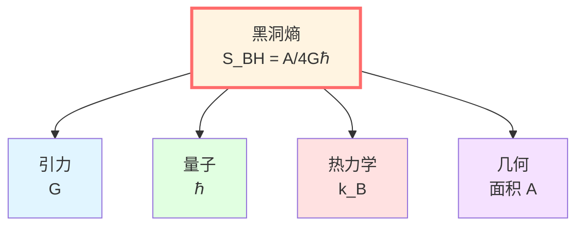
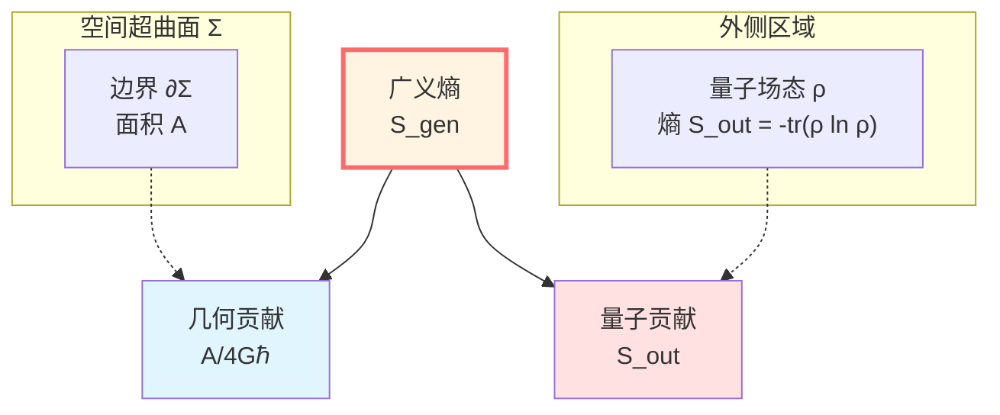
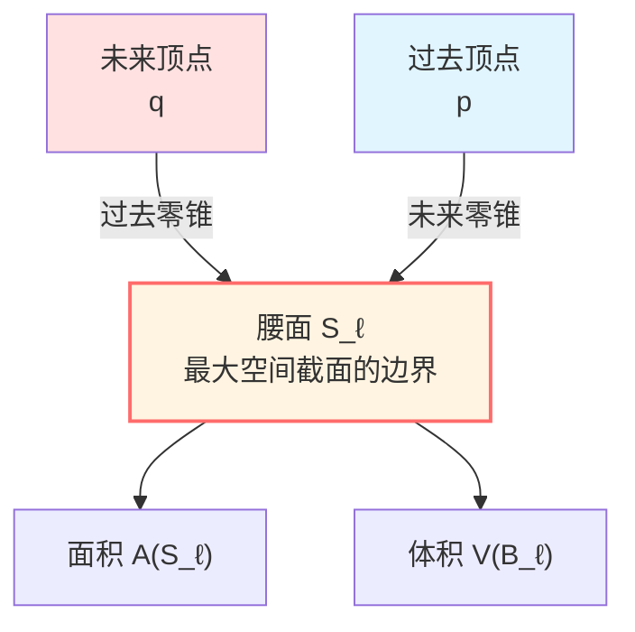
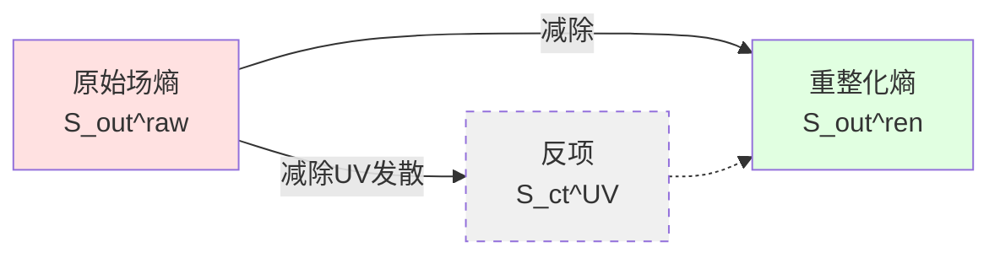

# 广义熵：几何与量子的统一

> *"熵不仅来自物质，也来自时空本身。"*

## 🎯 核心问题

在基础概念篇，我们学到Boltzmann熵：

$$S = k_B \ln \Omega$$

但在引力存在的情况下，这个定义**不完整**！

**为什么？**

因为时空本身也携带熵！

## 🌟 Bekenstein-Hawking熵的启示

### 黑洞的熵

1973年，Bekenstein提出：黑洞应该有熵。

1974年，Hawking计算得到：

$$\boxed{S_{\text{BH}} = \frac{A}{4G\hbar}}$$

其中：
- $A$：视界面积
- $G$：牛顿引力常数
- $\hbar$：Planck常数

**关键观察**：

1. 熵正比于**面积**，不是体积！
2. 熵包含引力常数 $G$
3. 熵包含量子常数 $\hbar$

**这意味着**：熵是引力、量子、热力学三者的交汇点！



## 📐 广义熵的定义

### 两项之和

在量子引力中，**广义熵**定义为：

$$\boxed{S_{\text{gen}}(\Sigma) = \underbrace{\frac{A(\Sigma)}{4G\hbar}}_{\text{几何熵}} + \underbrace{S_{\text{out}}(\Sigma)}_{\text{量子场熵}}}$$

其中：
- $\Sigma$：空间超曲面（Cauchy slice）
- $A(\Sigma)$：$\Sigma$ 边界的面积
- $S_{\text{out}}(\Sigma)$：边界外侧量子场的von Neumann熵

### 物理意义



**第一项 $A/(4G\hbar)$**（几何熵）：
- 来自时空几何的自由度
- 与黑洞熵形式相同
- 反映边界的"引力熵"

**第二项 $S_{\text{out}}$**（量子场熵）：
- 来自物质场的量子纠缠
- von Neumann熵：$S_{\text{out}} = -\text{tr}(\rho_{\text{out}} \ln \rho_{\text{out}})$
- 反映场的"信息熵"

## 💡 气球比喻

想象一个气球：

```
🎈
```

**总"信息"** = 气球表面的信息 + 内部气体的信息

| 类比 | 物理 |
|-----|------|
| 气球表面积 | 边界面积 $A$ |
| 表面褶皱、纹理 | 几何熵 $A/(4G\hbar)$ |
| 内部气体分子 | 量子场 |
| 气体的熵 | 场熵 $S_{\text{out}}$ |
| **总信息** | **广义熵 $S_{\text{gen}}$** |

**关键洞察**：

不能只看气体（物质场），也要看气球本身（时空几何）！

## 🔬 小因果菱形上的广义熵

在IGVP框架中，我们在**小因果菱形** $\mathcal{D}_\ell(p)$ 上定义广义熵。

### 小因果菱形的结构



**腰面**（waist）$S_\ell$：
- 菱形中最大空间截面的边界
- 维度：$d-2$（$d$ 是时空维度）
- 面积：$A \sim \ell^{d-2}$

**体积** $V(B_\ell)$：
- 最大空间截面的体积
- 体积：$V \sim \ell^{d-1}$

### 广义熵的显式形式

在小因果菱形上：

$$S_{\text{gen}} = \frac{A(S_\ell)}{4G\hbar} + S_{\text{out}}^{\text{ren}} + S_{\text{ct}}^{\text{UV}} - \frac{\Lambda}{8\pi G}\frac{V(B_\ell)}{T}$$

**各项含义**：

1. $A/(4G\hbar)$：腰面的几何熵
2. $S_{\text{out}}^{\text{ren}}$：重整化的场熵
3. $S_{\text{ct}}^{\text{UV}}$：UV反项（处理发散）
4. $-\Lambda V / (8\pi GT)$：体积对偶项（拉格朗日乘子）

**温度** $T$：

$$T = \frac{\hbar |\kappa_\chi|}{2\pi}$$

其中 $\kappa_\chi$ 是近似Killing场的表面引力。

## 🌊 为什么需要重整化？

### 发散问题

量子场论中，纠缠熵在短距离处发散：

$$S_{\text{out}} \sim \frac{A}{\epsilon^{d-2}} + \cdots$$

（$\epsilon$ 是UV截断）

**解决方法**：

1. **点分裂重整化**：用精细的正则化方案
2. **减除发散项**：$S_{\text{out}}^{\text{ren}} = S_{\text{out}}^{\text{raw}} - S_{\text{ct}}^{\text{UV}}$
3. **保持有限部分**：$S_{\text{gen}}$ 在 $\epsilon \to 0$ 时有限

### 重整化的物理意义



**物理解释**：

- UV发散项被几何项 $A/(4G\hbar)$ 吸收
- 有限部分 $S_{\text{out}}^{\text{ren}}$ 才是物理的
- 这类似于质量重整化

## 📊 广义熵的性质

### 性质1：单调性

在演化过程中，广义熵满足**第二定律**：

$$\frac{dS_{\text{gen}}}{d\lambda} \ge 0$$

沿零测地线的仿射参数 $\lambda$。

**这保证了热力学箭头！**

### 性质2：极值性

在Einstein方程的解上，广义熵在小因果菱形的腰面处取**极值**：

$$\delta S_{\text{gen}} = 0 \quad (\text{固定体积})$$

**这就是IGVP的一阶条件！**

### 性质3：凹性

二阶变分非负：

$$\delta^2 S_{\text{rel}} \ge 0$$

**这保证了解的稳定性！**

## 🔗 与核心洞见的联系

### 熵是箭头

广义熵的单调性 $dS_{\text{gen}}/d\lambda \ge 0$ 定义时间箭头：

$$p \prec q \quad \Longleftrightarrow \quad S_{\text{gen}}(p) \le S_{\text{gen}}(q)$$

### 边界是实在

几何熵项 $A/(4G\hbar)$ 强调边界面积的本体地位。

### 时间是几何

温度 $T = \hbar|\kappa_\chi|/(2\pi)$ 连接热时间与几何时间。

## 📝 关键公式总结

| 公式 | 名称 | 意义 |
|-----|------|------|
| $S_{\text{BH}} = A/(4G\hbar)$ | Bekenstein-Hawking熵 | 黑洞熵 |
| $S_{\text{gen}} = A/(4G\hbar) + S_{\text{out}}$ | 广义熵 | 几何+量子 |
| $S_{\text{out}} = -\text{tr}(\rho \ln \rho)$ | von Neumann熵 | 量子场熵 |
| $T = \hbar|\kappa_\chi|/(2\pi)$ | Unruh温度 | 加速观察者的温度 |

## 🎓 深入阅读

- 原始论文：J.D. Bekenstein, "Black holes and entropy" (Phys. Rev. D 7, 2333, 1973)
- Hawking辐射：S.W. Hawking, "Black hole explosions?" (Nature 248, 30, 1974)
- 广义熵：T. Faulkner et al., "Gravitation from entanglement" (JHEP 03, 051, 2014)
- GLS文档：igvp-einstein-complete.md
- 下一篇：[02-causal-diamond.md](02-causal-diamond.md) - 小因果菱形

## 🤔 练习题

1. **概念理解**：
   - 为什么黑洞熵正比于面积而不是体积？
   - 广义熵的两项分别来自什么物理自由度？
   - 为什么需要重整化？

2. **数量级估计**：
   - 太阳质量黑洞的视界面积是多少？Bekenstein-Hawking熵是多少？
   - 与太阳内部气体的热力学熵相比如何？

3. **物理应用**：
   - Hawking辐射如何保持广义熵单调？
   - Page曲线如何反映广义熵的演化？
   - 黑洞信息悖论与广义熵有什么关系？

4. **进阶思考**：
   - 如果不包含几何熵项，会有什么问题？
   - Wald熵（高阶引力理论）如何推广 $A/(4G\hbar)$？
   - 全息纠缠熵与广义熵有什么联系？

---

**下一步**：理解了广义熵后，我们将学习它在哪里变分——**小因果菱形**！
