# Generalized Entropy: Unification of Geometry and Quantum

> *"Entropy comes not only from matter, but also from spacetime itself."*

## 🎯 Core Question

In the Foundation chapter, we learned Boltzmann entropy:

$$S = k_B \ln \Omega$$

But in the presence of gravity, this definition is **incomplete**!

**Why?**

Because spacetime itself carries entropy!

## 🌟 Revelation of Bekenstein-Hawking Entropy

### Black Hole Entropy

In 1973, Bekenstein proposed: black holes should have entropy.

In 1974, Hawking calculated:

$$\boxed{S_{\text{BH}} = \frac{A}{4G\hbar}}$$

Where:
- $A$: horizon area
- $G$: Newton's gravitational constant
- $\hbar$: Planck constant

**Key observations**:

1. Entropy is proportional to **area**, not volume!
2. Entropy contains gravitational constant $G$
3. Entropy contains quantum constant $\hbar$

**This means**: Entropy is the intersection of gravity, quantum, and thermodynamics!


## 📐 Definition of Generalized Entropy

### Sum of Two Terms

In quantum gravity, **generalized entropy** is defined as:

$$\boxed{S_{\text{gen}}(\Sigma) = \underbrace{\frac{A(\Sigma)}{4G\hbar}}_{\text{Geometric Entropy}} + \underbrace{S_{\text{out}}(\Sigma)}_{\text{Quantum Field Entropy}}}$$

Where:
- $\Sigma$: spatial hypersurface (Cauchy slice)
- $A(\Sigma)$: area of boundary of $\Sigma$
- $S_{\text{out}}(\Sigma)$: von Neumann entropy of quantum fields outside the boundary

### Physical Meaning

```mermaid
graph TB
    subgraph "Spatial Hypersurface Σ"
        B["Boundary ∂Σ<br/>Area A"]
    end

    subgraph "Outside Region"
        O["Quantum Field State ρ<br/>Entropy S_out = -tr(ρ ln ρ)"]
    end

    S["Generalized Entropy<br/>S_gen"] --> G["Geometric Contribution<br/>A/4Gℏ"]
    S --> Q["Quantum Contribution<br/>S_out"]

    B -.-> G
    O -.-> Q

    style S fill:#fff4e1,stroke:#ff6b6b,stroke-width:3px
    style G fill:#e1f5ff
    style Q fill:#ffe1e1
```



**First term $A/(4G\hbar)$** (geometric entropy):
- From degrees of freedom of spacetime geometry
- Same form as black hole entropy
- Reflects "gravitational entropy" of boundary

**Second term $S_{\text{out}}$** (quantum field entropy):
- From quantum entanglement of matter fields
- von Neumann entropy: $S_{\text{out}} = -\text{tr}(\rho_{\text{out}} \ln \rho_{\text{out}})$
- Reflects "information entropy" of fields

## 💡 Balloon Analogy

Imagine a balloon:

```
🎈
```

**Total "information"** = information on balloon surface + information of internal gas

| Analogy | Physics |
|-----|------|
| Balloon surface area | Boundary area $A$ |
| Surface wrinkles, texture | Geometric entropy $A/(4G\hbar)$ |
| Internal gas molecules | Quantum fields |
| Gas entropy | Field entropy $S_{\text{out}}$ |
| **Total information** | **Generalized entropy $S_{\text{gen}}$** |

**Key insight**:

We cannot only look at the gas (matter fields), but also the balloon itself (spacetime geometry)!

## 🔬 Generalized Entropy on Small Causal Diamond

In the IGVP framework, we define generalized entropy on the **small causal diamond** $\mathcal{D}_\ell(p)$.

### Structure of Small Causal Diamond

```mermaid
graph TB
    Q["Future Vertex<br/>q"] --> |"Past Null Cone"| W["Waist S_ℓ<br/>Boundary of Maximum Spatial Cross-Section"]
    P["Past Vertex<br/>p"] --> |"Future Null Cone"| W

    W --> A["Area A(S_ℓ)"]
    W --> V["Volume V(B_ℓ)"]

    style W fill:#fff4e1,stroke:#ff6b6b,stroke-width:2px
    style Q fill:#ffe1e1
    style P fill:#e1f5ff
```



**Waist** $S_\ell$:
- Boundary of maximum spatial cross-section in the diamond
- Dimension: $d-2$ ($d$ is spacetime dimension)
- Area: $A \sim \ell^{d-2}$

**Volume** $V(B_\ell)$:
- Volume of maximum spatial cross-section
- Volume: $V \sim \ell^{d-1}$

### Explicit Form of Generalized Entropy

On the small causal diamond:

$$S_{\text{gen}} = \frac{A(S_\ell)}{4G\hbar} + S_{\text{out}}^{\text{ren}} + S_{\text{ct}}^{\text{UV}} - \frac{\Lambda}{8\pi G}\frac{V(B_\ell)}{T}$$

**Meaning of each term**:

1. $A/(4G\hbar)$: geometric entropy of waist
2. $S_{\text{out}}^{\text{ren}}$: renormalized field entropy
3. $S_{\text{ct}}^{\text{UV}}$: UV counterterm (handles divergence)
4. $-\Lambda V / (8\pi GT)$: volume dual term (Lagrange multiplier)

**Temperature** $T$:

$$T = \frac{\hbar |\kappa_\chi|}{2\pi}$$

Where $\kappa_\chi$ is the surface gravity of the approximate Killing field.

## 🌊 Why Renormalization?

### Divergence Problem

In quantum field theory, entanglement entropy diverges at short distances:

$$S_{\text{out}} \sim \frac{A}{\epsilon^{d-2}} + \cdots$$

($\epsilon$ is UV cutoff)

**Solution**:

1. **Point-splitting renormalization**: Use fine regularization scheme
2. **Subtract divergent terms**: $S_{\text{out}}^{\text{ren}} = S_{\text{out}}^{\text{raw}} - S_{\text{ct}}^{\text{UV}}$
3. **Keep finite part**: $S_{\text{gen}}$ is finite as $\epsilon \to 0$

### Physical Meaning of Renormalization


**Physical interpretation**:

- UV divergent terms are absorbed by geometric term $A/(4G\hbar)$
- Finite part $S_{\text{out}}^{\text{ren}}$ is physical
- This is similar to mass renormalization

## 📊 Properties of Generalized Entropy

### Property 1: Monotonicity

During evolution, generalized entropy is considered to satisfy the **second law**:

$$\frac{dS_{\text{gen}}}{d\lambda} \ge 0$$

Along affine parameter $\lambda$ of null geodesics.

**This suggests the existence of a thermodynamic arrow of time.**

### Property 2: Extremality

On solutions of Einstein's equations, generalized entropy takes an **extremum** at the waist of the small causal diamond:

$$\delta S_{\text{gen}} = 0 \quad (\text{fixed volume})$$

**This is the first-order variational condition of IGVP.**

### Property 3: Concavity

Second-order variation is typically non-negative:

$$\delta^2 S_{\text{rel}} \ge 0$$

**This provides a theoretical guarantee for the stability of solutions.**

## 🔗 Connection to Core Insights

### Entropy is the Arrow

Monotonicity of generalized entropy $dS_{\text{gen}}/d\lambda \ge 0$ defines the arrow of time:

$$p \prec q \quad \Longleftrightarrow \quad S_{\text{gen}}(p) \le S_{\text{gen}}(q)$$

### Boundary is Reality

Geometric entropy term $A/(4G\hbar)$ emphasizes the ontological status of boundary area.

### Time is Geometry

Temperature $T = \hbar|\kappa_\chi|/(2\pi)$ connects thermal time with geometric time.

## 📝 Key Formulas Summary

| Formula | Name | Meaning |
|-----|------|------|
| $S_{\text{BH}} = A/(4G\hbar)$ | Bekenstein-Hawking entropy | Black hole entropy |
| $S_{\text{gen}} = A/(4G\hbar) + S_{\text{out}}$ | Generalized entropy | Geometry + quantum |
| $S_{\text{out}} = -\text{tr}(\rho \ln \rho)$ | von Neumann entropy | Quantum field entropy |
| $T = \hbar|\kappa_\chi|/(2\pi)$ | Unruh temperature | Temperature of accelerated observer |

## 🎓 Further Reading

- Original paper: J.D. Bekenstein, "Black holes and entropy" (Phys. Rev. D 7, 2333, 1973)
- Hawking radiation: S.W. Hawking, "Black hole explosions?" (Nature 248, 30, 1974)
- Generalized entropy: T. Faulkner et al., "Gravitation from entanglement" (JHEP 03, 051, 2014)
- GLS documentation: igvp-einstein-complete.md
- Next: [02-causal-diamond_en.md](02-causal-diamond_en.md) - Small Causal Diamond

## 🤔 Exercises

1. **Conceptual understanding**:
   - Why is black hole entropy proportional to area rather than volume?
   - What physical degrees of freedom do the two terms of generalized entropy come from?
   - Why is renormalization needed?

2. **Order-of-magnitude estimates**:
   - What is the horizon area of a solar-mass black hole? What is the Bekenstein-Hawking entropy?
   - How does it compare with the thermodynamic entropy of gas inside the Sun?

3. **Physical applications**:
   - How does Hawking radiation maintain monotonicity of generalized entropy?
   - How does the Page curve reflect evolution of generalized entropy?
   - What is the relationship between black hole information paradox and generalized entropy?

4. **Advanced thinking**:
   - What problems would arise if the geometric entropy term is not included?
   - How does Wald entropy (higher-order gravity theories) generalize $A/(4G\hbar)$?
   - What is the connection between holographic entanglement entropy and generalized entropy?

---

**Next step**: After understanding generalized entropy, we will learn where it is varied—the **small causal diamond**!

