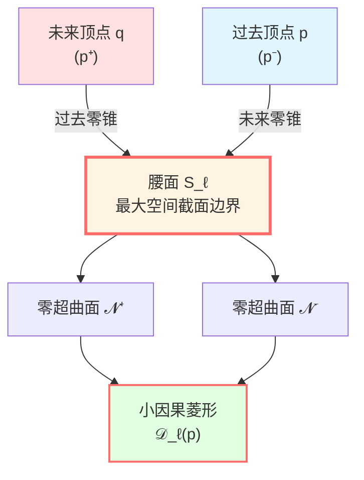
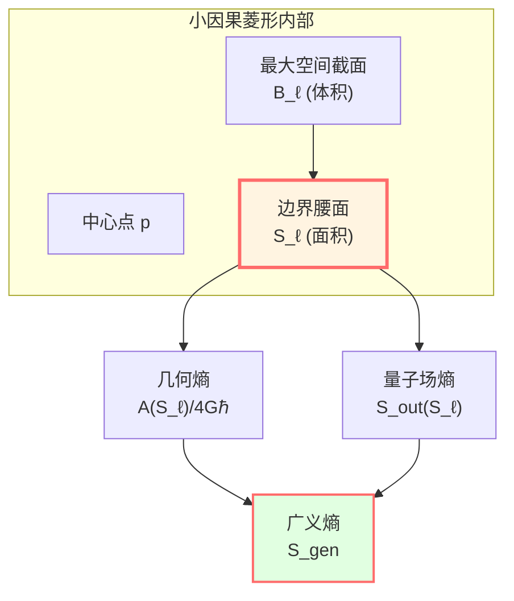
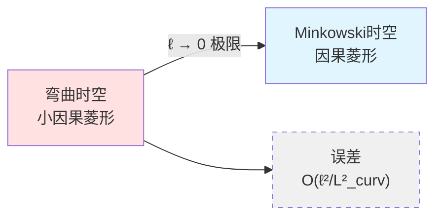
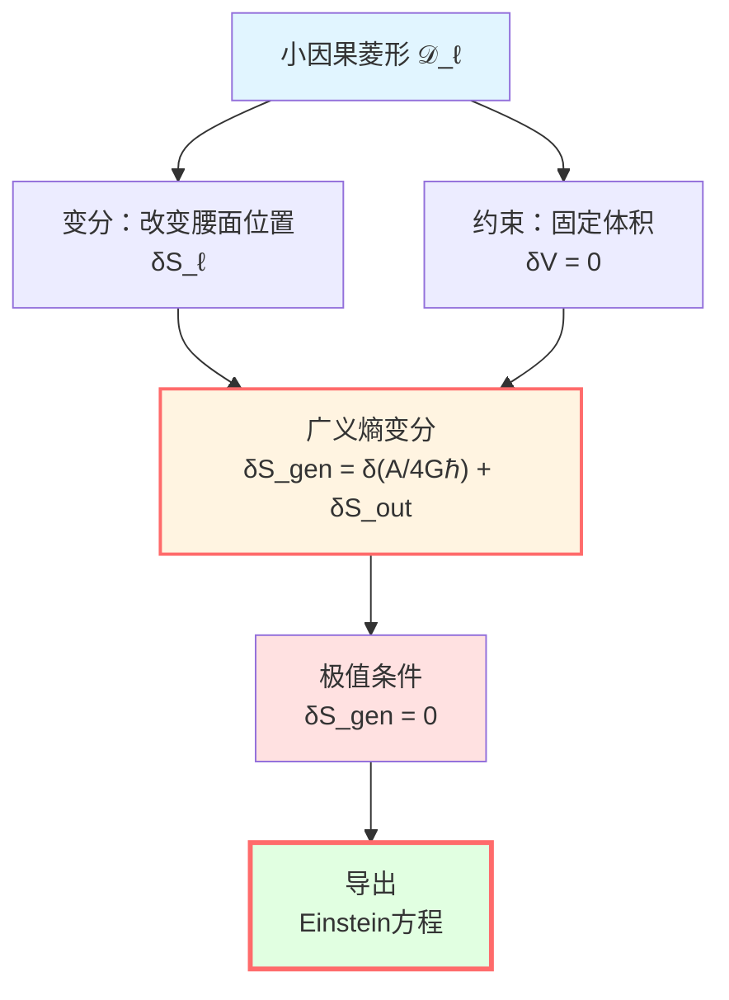

# 小因果菱形：变分的舞台

> *"引力的舞台不是宏大的宇宙，而是微小的局域因果区域。"*

## 🎯 核心问题

在上一篇中，我们定义了广义熵：

$$S_{\text{gen}} = \frac{A}{4G\hbar} + S_{\text{out}}$$

但这个熵是在**哪里**变分的？

答案：**小因果菱形**（small causal diamond）！

## 💎 什么是因果菱形？

### 直观图像

想象一个沙漏：

```
     ⋰ 未来顶点 q
    ╱ ╲
   ╱   ╲
  ╱     ╲
 ╱  腰面  ╲  ← 最粗的地方
╱    S_ℓ   ╲
╲         ╱
 ╲       ╱
  ╲     ╱
   ╲   ╱
    ╲ ╱
     ⋱ 过去顶点 p
```

这就是因果菱形的形状！

**物理意义**：
- 从过去顶点 $p$ 发出的所有未来光锥
- 与到达未来顶点 $q$ 的所有过去光锥
- 两者的**交集**

### 数学定义

在洛伦兹流形 $(M, g)$ 上，对点 $p \in M$，取足够小的尺度 $\ell \ll L_{\text{curv}}(p)$（$L_{\text{curv}}$ 是局域曲率尺度），定义**小因果菱形**：

$$\boxed{\mathcal{D}_\ell(p) = J^+(p^-) \cap J^-(p^+)}$$

其中：
- $p^-$：过去顶点，沿某参考类时方向本征时间 $-\ell$ 的点
- $p^+$：未来顶点，沿本征时间 $+\ell$ 的点
- $J^+(p^-)$：$p^-$ 的**因果未来**（所有能从 $p^-$ 因果到达的点）
- $J^-(p^+)$：$p^+$ 的**因果过去**（所有能因果到达 $p^+$ 的点）



## 🔍 小因果菱形的结构

### 边界组成

小因果菱形的边界 $\partial\mathcal{D}_\ell$ 由以下部分组成：

1. **过去零超曲面** $\mathcal{N}^+$：
   - 从过去顶点 $p^-$ 发出的未来光锥
   - 由零测地线（null geodesics）生成
   - 维度：$d-1$（$d$ 是时空维度）

2. **未来零超曲面** $\mathcal{N}^-$：
   - 到达未来顶点 $p^+$ 的过去光锥
   - 也由零测地线生成
   - 维度：$d-1$

3. **腰面**（waist）$S_\ell$：
   - 两个零锥的交线
   - 菱形内**最大空间截面**的边界
   - 维度：$d-2$
   - 这是广义熵变分的关键！

### 腰面的重要性

**为什么叫"腰面"？**

因为它是菱形中间最"粗"的地方，就像沙漏的腰部！

**物理意义**：



**腰面的几何数据**：

- **面积**：$A(S_\ell) \sim \ell^{d-2}$
- **内部最大空间截面体积**：$V(B_\ell) \sim \ell^{d-1}$
- **曲率半径**：$L_{\text{curv}} \gg \ell$

## 📏 "小"的含义

### 小钻石极限

**"小"是什么意思？**

在IGVP推导中，我们取 $\ell \to 0$ 的极限，即**小钻石极限**：

$$\ell \ll L_{\text{curv}}$$

**为什么要取小极限？**

1. **局域性**：引力是局域的物理规律，应该在每个点附近成立
2. **可控性**：在小极限下，曲率修正是高阶小量 $O(\ell^2/L_{\text{curv}}^2)$
3. **近似平直**：小钻石内部近似为Minkowski时空的因果菱形

### 几何近似

在正规坐标下，小因果菱形满足：

$$g_{\mu\nu} = \eta_{\mu\nu} + O\left(\frac{\ell^2}{L_{\text{curv}}^2}\right)$$

其中 $\eta_{\mu\nu}$ 是Minkowski度规。

**这意味着**：在足够小的尺度下，时空局域地"看起来像"平直时空！



## 🌊 为什么用小因果菱形？

### 原因1：Jacobson的启示

1995年，Jacobson首次从热力学推导Einstein方程时，就使用了**局域因果视界**（local causal horizon）。

小因果菱形是这个想法的精确数学实现：

- 腰面 $S_\ell$ 类似于局域视界
- 广义熵在这个"视界"上定义
- 变分在固定体积 $V(B_\ell)$ 下进行

### 原因2：局域性原理

物理定律应该是**局域的**：

| 理论           | 局域性表现                | 数学形式                                      |
|----------------|--------------------------|-----------------------------------------------|
| 电磁学         | Maxwell方程在每点成立     | $\nabla \cdot E = \rho$                      |
| 量子场论       | 拉格朗日密度              | $\mathcal{L}(x)$                             |
| **IGVP**       | **小因果菱形上的熵极值**  | **$\delta S_{\text{gen}}(\mathcal{D}_\ell) = 0$** |
| Einstein方程   | 每点的曲率-应力关系        | $G_{ab}(x) = 8\pi G T_{ab}(x)$               |

**关键逻辑**：

从局域熵极值 → 通过Radon型闭包 → 推导出点态Einstein方程

### 原因3：控制误差

在小极限下，所有误差项都是可控的高阶小量：

1. **几何误差**：$O(\ell^2/L_{\text{curv}}^2)$
2. **量子场论误差**：$O(\varepsilon^2)$（$\varepsilon$ 是小参数）
3. **边界效应**：$o(\ell^{d-2})$

这保证了推导的严格性！

## 🎨 平直时空中的因果菱形

### Minkowski时空的例子

在平直时空 $(\mathbb{R}^{1,d-1}, \eta)$ 中，取原点 $p = 0$，参考类时方向为 $t$ 轴，则：

**因果菱形**：

$$\mathcal{D}_\ell(0) = \{(t, \mathbf{x}) : |t| + |\mathbf{x}| \le \ell\}$$

**腰面**（$t=0$ 截面的边界）：

$$S_\ell = \{(0, \mathbf{x}) : |\mathbf{x}| = \ell\}$$

这是半径为 $\ell$ 的 $(d-2)$-维球面！

**面积**：

$$A(S_\ell) = \Omega_{d-2} \ell^{d-2}$$

其中 $\Omega_{d-2}$ 是单位 $(d-2)$-球面的体积。

**最大空间截面**（$t=0$ 的球）：

$$B_\ell = \{(0, \mathbf{x}) : |\mathbf{x}| \le \ell\}$$

**体积**：

$$V(B_\ell) = \frac{\Omega_{d-2}}{d-1} \ell^{d-1}$$

### 四维时空的具体计算

在 $d=4$ 时：

- 腰面 $S_\ell$ 是**2-球面**（普通球面）
- 面积：$A = 4\pi\ell^2$
- 体积：$V = \frac{4\pi}{3}\ell^3$

**几何熵**：

$$S_{\text{geom}} = \frac{A}{4G\hbar} = \frac{4\pi\ell^2}{4G\hbar} = \frac{\pi\ell^2}{G\hbar}$$

这与Planck面积 $\ell_P^2 = G\hbar/c^3$ 的关系：

$$S_{\text{geom}} = \frac{\pi c^3}{\hbar} \left(\frac{\ell}{\ell_P}\right)^2$$

**物理解释**：几何熵正比于面积（以Planck单位测量）！

## 🔄 近似Killing场

在小因果菱形上，存在**近似Killing场** $\chi^a$：

$$\mathcal{L}_\chi g_{ab} = O\left(\frac{\ell^2}{L_{\text{curv}}^2}\right)$$

**物理意义**：

在小尺度下，存在**近似对称性**，对应于：
- 近似的时间平移不变性
- 近似的boost对称性（沿零方向）

**表面引力**：

$$\kappa_\chi = \frac{2}{\ell} + O\left(\frac{\ell}{L_{\text{curv}}^2}\right)$$

**Unruh温度**：

$$T = \frac{\hbar |\kappa_\chi|}{2\pi} = \frac{\hbar}{\pi\ell} + O\left(\frac{\ell}{L_{\text{curv}}^2}\right)$$

**关键洞察**：小因果菱形有其**内在温度**，由几何决定！

## 📐 变分设定

在IGVP中，我们在小因果菱形上进行以下变分：

### 变分参数

1. **腰面位置**：改变 $S_\ell$ 的嵌入
2. **量子态**：改变场的量子态 $\rho$

### 约束条件

1. **固定端点**：$p^-$ 和 $p^+$ 不变
2. **固定体积**：$\delta V(B_\ell) = 0$
3. **固定温度**：$\delta T = 0$（一阶变分层面）

### 变分对象

**广义熵**：

$$S_{\text{gen}}(S_\ell) = \frac{A(S_\ell)}{4G\hbar} + S_{\text{out}}(S_\ell)$$

**一阶条件**：

$$\boxed{\delta S_{\text{gen}} = 0} \quad (\text{固定体积})$$

**这就是IGVP的核心！**



## 🌟 从局域到全局

### Radon型闭包

**核心思想**：如果对**所有**小因果菱形某个积分条件成立，能否推出**点态**方程？

答案：**可以！**（在适当条件下）

**步骤**：

1. **局域化**：对腰面 $S_\ell$ 上的任意测试函数 $\varphi \in C_c^\infty(S_\ell)$
2. **积分条件**：$\int_{S_\ell} \varphi \int_0^{\lambda_*} \lambda (R_{kk} - 8\pi G T_{kk}) d\lambda dA = o(\ell^2)$
3. **闭包**：由光线变换的局部可逆性，推出 $R_{kk} = 8\pi G T_{kk}$ 在每点成立

**这是从"族约束"到"点态方程"的桥梁！**

### 族约束的物理意义

**族约束**：对一族小因果菱形，熵极值条件成立

$$\forall p \in M, \forall \ell \ll L_{\text{curv}}(p): \quad \delta S_{\text{gen}}(\mathcal{D}_\ell(p)) = 0$$

**点态方程**：在每个点，Einstein方程成立

$$\forall p \in M: \quad G_{ab}(p) + \Lambda g_{ab}(p) = 8\pi G T_{ab}(p)$$

**逻辑链**：

```
族约束（对所有小菱形）
    ↓
积分恒等式（沿零测地）
    ↓
Radon型闭包
    ↓
点态方程（在每个点）
```

## 🎓 与其他方法的比较

| 方法 | 变分区域 | 优点 | 局限 |
|-----|---------|------|------|
| **Jacobson (1995)** | 局域视界 | 开创性 | 形式推导 |
| **Padmanabhan** | 视界附近 | 热力学视角 | 依赖视界存在 |
| **Verlinde** | 全息屏 | 涌现引力 | 非局域 |
| **IGVP（GLS）** | **小因果菱形** | **局域+严格** | 技术复杂 |

**IGVP的优势**：

1. 完全局域（不需要全局视界）
2. 数学严格（显式误差控制）
3. 推导完整（一阶+二阶）
4. 适用广泛（不限于平直背景）

## 📝 关键公式总结

| 概念 | 公式 | 意义 |
|-----|------|------|
| 小因果菱形 | $\mathcal{D}_\ell(p) = J^+(p^-) \cap J^-(p^+)$ | 基本变分区域 |
| 腰面面积 | $A(S_\ell) \sim \ell^{d-2}$ | 几何熵的来源 |
| 内部体积 | $V(B_\ell) \sim \ell^{d-1}$ | 约束条件 |
| 近似Killing | $\mathcal{L}_\chi g = O(\ell^2/L^2)$ | 局域对称性 |
| 表面引力 | $\kappa_\chi = 2/\ell + O(\ell/L^2)$ | 决定温度 |
| 广义熵 | $S_{\text{gen}} = A/(4G\hbar) + S_{\text{out}}$ | 变分泛函 |

## 🎓 深入阅读

- Jacobson原始论文：T. Jacobson, "Thermodynamics of spacetime" (Phys. Rev. Lett. 75, 1260, 1995)
- 小钻石几何：T. Jacobson, "Entanglement Equilibrium and the Einstein Equation" (Phys. Rev. Lett. 116, 201101, 2016)
- GLS完整推导：igvp-einstein-complete.md
- 上一篇：[01-generalized-entropy.md](01-generalized-entropy.md) - 广义熵定义
- 下一篇：[03-raychaudhuri-equation.md](03-raychaudhuri-equation.md) - Raychaudhuri方程

## 🤔 练习题

1. **概念理解**：
   - 为什么因果菱形叫"菱形"？在Minkowski时空中画出来
   - 什么是腰面？为什么它是"最大空间截面的边界"？
   - "小"的含义是什么？为什么要取 $\ell \to 0$ 极限？

2. **几何计算**：
   - 在三维时空 $(t, x, y)$ 中，写出 $\ell=1$ 的因果菱形的显式表达式
   - 计算腰面的面积和内部体积
   - 验证 $A \sim \ell^{d-2}$ 和 $V \sim \ell^{d-1}$

3. **物理应用**：
   - 为什么固定体积 $\delta V = 0$ 是合理的约束？
   - Unruh温度 $T = \hbar/(pi\ell)$ 如何理解？
   - 小因果菱形与Rindler楔有什么关系？

4. **进阶思考**：
   - 如果不取小极限，会有什么问题？
   - 族约束如何通过Radon型闭包变成点态方程？（提示：光线变换）
   - 小因果菱形的边界为什么是零超曲面？这有什么物理意义？

---

**下一步**：理解了变分的舞台后，我们将学习几何如何响应——**Raychaudhuri方程**！

