# Small Causal Diamond: The Stage for Variation

> *"The stage of gravity is not the grand universe, but tiny local causal regions."*

## 🎯 Core Question

In the previous article, we defined generalized entropy:

$$S_{\text{gen}} = \frac{A}{4G\hbar} + S_{\text{out}}$$

But **where** is this entropy varied?

Answer: The **small causal diamond** (small causal diamond)!

## 💎 What is a Causal Diamond?

### Intuitive Image

Imagine an hourglass:

```
     ⋰ Future vertex q
    ╱ ╲
   ╱   ╲
  ╱     ╲
 ╱  Waist  ╲  ← Thickest part
╱    S_ℓ   ╲
╲         ╱
 ╲       ╱
  ╲     ╱
   ╲   ╱
    ╲ ╱
     ⋱ Past vertex p
```

This is the shape of a causal diamond!

**Physical meaning**:
- All future light cones emitted from past vertex $p$
- Intersected with all past light cones reaching future vertex $q$
- The **intersection** of the two

### Mathematical Definition

On a Lorentzian manifold $(M, g)$, for point $p \in M$, take a sufficiently small scale $\ell \ll L_{\text{curv}}(p)$ ($L_{\text{curv}}$ is the local curvature scale), define the **small causal diamond**:

$$\boxed{\mathcal{D}_\ell(p) = J^+(p^-) \cap J^-(p^+)}$$

Where:
- $p^-$: past vertex, point at proper time $-\ell$ along some reference timelike direction
- $p^+$: future vertex, point at proper time $+\ell$
- $J^+(p^-)$: **causal future** of $p^-$ (all points causally reachable from $p^-$)
- $J^-(p^+)$: **causal past** of $p^+$ (all points that can causally reach $p^+$)

```mermaid
graph TB
    Q["Future Vertex q<br/>(p⁺)"] --> |"Past Null Cone"| W["Waist S_ℓ<br/>Boundary of Maximum Spatial Cross-Section"]
    P["Past Vertex p<br/>(p⁻)"] --> |"Future Null Cone"| W

    W --> N1["Null Hypersurface 𝓝⁺"]
    W --> N2["Null Hypersurface 𝓝⁻"]

    N1 --> D["Small Causal Diamond<br/>𝒟_ℓ(p)"]
    N2 --> D

    style W fill:#fff4e1,stroke:#ff6b6b,stroke-width:3px
    style D fill:#e1ffe1,stroke:#ff6b6b,stroke-width:2px
    style Q fill:#ffe1e1
    style P fill:#e1f5ff
```



## 🔍 Structure of Small Causal Diamond

### Boundary Components

The boundary $\partial\mathcal{D}_\ell$ of the small causal diamond consists of:

1. **Past null hypersurface** $\mathcal{N}^+$:
   - Future light cone emitted from past vertex $p^-$
   - Generated by null geodesics
   - Dimension: $d-1$ ($d$ is spacetime dimension)

2. **Future null hypersurface** $\mathcal{N}^-$:
   - Past light cone reaching future vertex $p^+$
   - Also generated by null geodesics
   - Dimension: $d-1$

3. **Waist** $S_\ell$:
   - Intersection line of the two null cones
   - Boundary of **maximum spatial cross-section** in the diamond
   - Dimension: $d-2$
   - This is the key to generalized entropy variation!

### Importance of Waist

**Why is it called "waist"?**

Because it is the thickest part in the middle of the diamond, like the waist of an hourglass!

**Physical meaning**:


**Geometric data of waist**:

- **Area**: $A(S_\ell) \sim \ell^{d-2}$
- **Volume of internal maximum spatial cross-section**: $V(B_\ell) \sim \ell^{d-1}$
- **Curvature radius**: $L_{\text{curv}} \gg \ell$

## 📏 Meaning of "Small"

### Small Diamond Limit

**What does "small" mean?**

In the IGVP derivation, we take the limit $\ell \to 0$, i.e., the **small diamond limit**:

$$\ell \ll L_{\text{curv}}$$

**Why take the small limit?**

1. **Locality**: Gravity is a local physical law, should hold near each point
2. **Controllability**: In the small limit, curvature corrections are higher-order small quantities $O(\ell^2/L_{\text{curv}}^2)$
3. **Approximate flatness**: Inside the small diamond, it approximates the causal diamond of Minkowski spacetime

### Geometric Approximation

In normal coordinates, the small causal diamond satisfies:

$$g_{\mu\nu} = \eta_{\mu\nu} + O\left(\frac{\ell^2}{L_{\text{curv}}^2}\right)$$

Where $\eta_{\mu\nu}$ is the Minkowski metric.

**This means**: At sufficiently small scales, spacetime locally "looks like" flat spacetime!

```mermaid
graph LR
    C["Curved Spacetime<br/>Small Causal Diamond"] --> |"ℓ → 0 Limit"| M["Minkowski Spacetime<br/>Causal Diamond"]

    C --> E["Error<br/>O(ℓ²/L²_curv)"]

    style C fill:#ffe1e1
    style M fill:#e1f5ff
    style E fill:#f0f0f0,stroke-dasharray: 5 5
```



## 🌊 Why Use Small Causal Diamond?

### Reason 1: Jacobson's Inspiration

In 1995, when Jacobson first derived Einstein's equations from thermodynamics, he used **local causal horizons**.

The small causal diamond is a precise mathematical realization of this idea:

- Waist $S_\ell$ is similar to a local horizon
- Generalized entropy is defined on this "horizon"
- Variation is performed with fixed volume $V(B_\ell)$

### Reason 2: Principle of Locality

Physical laws should be **local**:

| Theory | Locality Manifestation | Mathematical Form |
|----------------|--------------------------|-----------------------------------------------|
| Electromagnetism | Maxwell equations hold at each point | $\nabla \cdot E = \rho$ |
| Quantum Field Theory | Lagrangian density | $\mathcal{L}(x)$ |
| **IGVP** | **Entropy extremum on small causal diamond** | **$\delta S_{\text{gen}}(\mathcal{D}_\ell) = 0$** |
| Einstein Equations | Curvature-stress relation at each point | $G_{ab}(x) = 8\pi G T_{ab}(x)$ |

**Key logic**:

From local entropy extremum → through Radon-type closure → derive pointwise Einstein equations

### Reason 3: Error Control

In the small limit, all error terms are controllable higher-order small quantities:

1. **Geometric error**: $O(\ell^2/L_{\text{curv}}^2)$
2. **Quantum field theory error**: $O(\varepsilon^2)$ ($\varepsilon$ is a small parameter)
3. **Boundary effects**: $o(\ell^{d-2})$

This guarantees the rigor of the derivation!

## 🎨 Causal Diamond in Flat Spacetime

### Example in Minkowski Spacetime

In flat spacetime $(\mathbb{R}^{1,d-1}, \eta)$, take origin $p = 0$, reference timelike direction as $t$-axis, then:

**Causal diamond**:

$$\mathcal{D}_\ell(0) = \{(t, \mathbf{x}) : |t| + |\mathbf{x}| \le \ell\}$$

**Waist** (boundary of $t=0$ cross-section):

$$S_\ell = \{(0, \mathbf{x}) : |\mathbf{x}| = \ell\}$$

This is a $(d-2)$-dimensional sphere of radius $\ell$!

**Area**:

$$A(S_\ell) = \Omega_{d-2} \ell^{d-2}$$

Where $\Omega_{d-2}$ is the volume of a unit $(d-2)$-sphere.

**Maximum spatial cross-section** (ball at $t=0$):

$$B_\ell = \{(0, \mathbf{x}) : |\mathbf{x}| \le \ell\}$$

**Volume**:

$$V(B_\ell) = \frac{\Omega_{d-2}}{d-1} \ell^{d-1}$$

### Specific Calculation in Four-Dimensional Spacetime

When $d=4$:

- Waist $S_\ell$ is a **2-sphere** (ordinary sphere)
- Area: $A = 4\pi\ell^2$
- Volume: $V = \frac{4\pi}{3}\ell^3$

**Geometric entropy**:

$$S_{\text{geom}} = \frac{A}{4G\hbar} = \frac{4\pi\ell^2}{4G\hbar} = \frac{\pi\ell^2}{G\hbar}$$

Relationship with Planck area $\ell_P^2 = G\hbar/c^3$:

$$S_{\text{geom}} = \frac{\pi c^3}{\hbar} \left(\frac{\ell}{\ell_P}\right)^2$$

**Physical interpretation**: Geometric entropy is proportional to area (measured in Planck units)!

## 🔄 Approximate Killing Field

On the small causal diamond, there exists an **approximate Killing field** $\chi^a$:

$$\mathcal{L}_\chi g_{ab} = O\left(\frac{\ell^2}{L_{\text{curv}}^2}\right)$$

**Physical meaning**:

At small scales, there exists **approximate symmetry**, corresponding to:
- Approximate time translation invariance
- Approximate boost symmetry (along null direction)

**Surface gravity**:

$$\kappa_\chi = \frac{2}{\ell} + O\left(\frac{\ell}{L_{\text{curv}}^2}\right)$$

**Unruh temperature**:

$$T = \frac{\hbar |\kappa_\chi|}{2\pi} = \frac{\hbar}{\pi\ell} + O\left(\frac{\ell}{L_{\text{curv}}^2}\right)$$

**Key insight**: The small causal diamond possesses an **intrinsic temperature** determined by geometry.

## 📐 Variation Setup

In IGVP, we perform the following variation on the small causal diamond:

### Variation Parameters

1. **Waist position**: Change embedding of $S_\ell$
2. **Quantum state**: Change quantum state $\rho$ of fields

### Constraints

1. **Fixed endpoints**: $p^-$ and $p^+$ unchanged
2. **Fixed volume**: $\delta V(B_\ell) = 0$
3. **Fixed temperature**: $\delta T = 0$ (at first-order variation level)

### Variation Object

**Generalized entropy**:

$$S_{\text{gen}}(S_\ell) = \frac{A(S_\ell)}{4G\hbar} + S_{\text{out}}(S_\ell)$$

**First-order condition**:

$$\boxed{\delta S_{\text{gen}} = 0} \quad (\text{fixed volume})$$

**This is one of the core assumptions of IGVP.**

```mermaid
graph TB
    D["Small Causal Diamond 𝒟_ℓ"] --> V["Variation: Change Waist Position<br/>δS_ℓ"]
    D --> C["Constraint: Fixed Volume<br/>δV = 0"]

    V --> S["Generalized Entropy Variation<br/>δS_gen = δ(A/4Gℏ) + δS_out"]
    C --> S

    S --> E["Extremum Condition<br/>δS_gen = 0"]

    E --> R["Derive<br/>Einstein Equations"]

    style D fill:#e1f5ff
    style S fill:#fff4e1,stroke:#ff6b6b,stroke-width:2px
    style E fill:#ffe1e1
    style R fill:#e1ffe1,stroke:#ff6b6b,stroke-width:3px
```



## 🌟 From Local to Global

### Radon-Type Closure

**Core idea**: If an integral condition holds for **all** small causal diamonds, can we derive a **pointwise** equation?

Answer: **Yes, under appropriate conditions.**

**Steps**:

1. **Localization**: For arbitrary test function $\varphi \in C_c^\infty(S_\ell)$ on waist $S_\ell$
2. **Integral condition**: $\int_{S_\ell} \varphi \int_0^{\lambda_*} \lambda (R_{kk} - 8\pi G T_{kk}) d\lambda dA = o(\ell^2)$
3. **Closure**: By local invertibility of ray transform, derive that $R_{kk} = 8\pi G T_{kk}$ holds at each point

**This constitutes the logical bridge from "family constraint" to "pointwise equation".**

### Physical Meaning of Family Constraint

**Family constraint**: For a family of small causal diamonds, entropy extremum condition holds

$$\forall p \in M, \forall \ell \ll L_{\text{curv}}(p): \quad \delta S_{\text{gen}}(\mathcal{D}_\ell(p)) = 0$$

**Pointwise equation**: At each point, Einstein equations hold

$$\forall p \in M: \quad G_{ab}(p) + \Lambda g_{ab}(p) = 8\pi G T_{ab}(p)$$

**Logic chain**:

```
Family Constraint (for all small diamonds)
    ↓
Integral Identity (along null geodesics)
    ↓
Radon-Type Closure
    ↓
Pointwise Equation (at each point)
```

## 🎓 Comparison with Other Methods

| Method | Variation Region | Advantages | Limitations |
|-----|---------|------|------|
| **Jacobson (1995)** | Local horizon | Pioneering | Formal derivation |
| **Padmanabhan** | Near horizon | Thermodynamic perspective | Depends on horizon existence |
| **Verlinde** | Holographic screen | Emergent gravity | Non-local |
| **IGVP (GLS)** | **Small causal diamond** | **Local + rigorous** | Technically complex |

**Advantages of IGVP**:

1. Completely local (no need for global horizon)
2. Mathematically rigorous (explicit error control)
3. Complete derivation (first-order + second-order)
4. Widely applicable (not limited to flat backgrounds)

## 📝 Key Formulas Summary

| Concept | Formula | Meaning |
|-----|------|------|
| Small causal diamond | $\mathcal{D}_\ell(p) = J^+(p^-) \cap J^-(p^+)$ | Basic variation region |
| Waist area | $A(S_\ell) \sim \ell^{d-2}$ | Source of geometric entropy |
| Internal volume | $V(B_\ell) \sim \ell^{d-1}$ | Constraint condition |
| Approximate Killing | $\mathcal{L}_\chi g = O(\ell^2/L^2)$ | Local symmetry |
| Surface gravity | $\kappa_\chi = 2/\ell + O(\ell/L^2)$ | Determines temperature |
| Generalized entropy | $S_{\text{gen}} = A/(4G\hbar) + S_{\text{out}}$ | Variation functional |

## 🎓 Further Reading

- Jacobson's original paper: T. Jacobson, "Thermodynamics of spacetime" (Phys. Rev. Lett. 75, 1260, 1995)
- Small diamond geometry: T. Jacobson, "Entanglement Equilibrium and the Einstein Equation" (Phys. Rev. Lett. 116, 201101, 2016)
- GLS complete derivation: igvp-einstein-complete.md
- Previous: [01-generalized-entropy_en.md](01-generalized-entropy_en.md) - Generalized Entropy Definition
- Next: [03-raychaudhuri-equation_en.md](03-raychaudhuri-equation_en.md) - Raychaudhuri Equation

## 🤔 Exercises

1. **Conceptual understanding**:
   - Why is a causal diamond called a "diamond"? Draw it in Minkowski spacetime
   - What is the waist? Why is it the "boundary of maximum spatial cross-section"?
   - What does "small" mean? Why take the $\ell \to 0$ limit?

2. **Geometric calculations**:
   - In three-dimensional spacetime $(t, x, y)$, write the explicit expression for a causal diamond with $\ell=1$
   - Calculate the area of the waist and internal volume
   - Verify $A \sim \ell^{d-2}$ and $V \sim \ell^{d-1}$

3. **Physical applications**:
   - Why is fixed volume $\delta V = 0$ a reasonable constraint?
   - How to understand Unruh temperature $T = \hbar/(\pi\ell)$?
   - What is the relationship between small causal diamond and Rindler wedge?

4. **Advanced thinking**:
   - What problems would arise if we don't take the small limit?
   - How does family constraint become a pointwise equation through Radon-type closure? (Hint: ray transform)
   - Why is the boundary of small causal diamond a null hypersurface? What is the physical meaning?

---

**Next step**: After understanding the stage of variation, we will learn how geometry responds—the **Raychaudhuri equation**!

