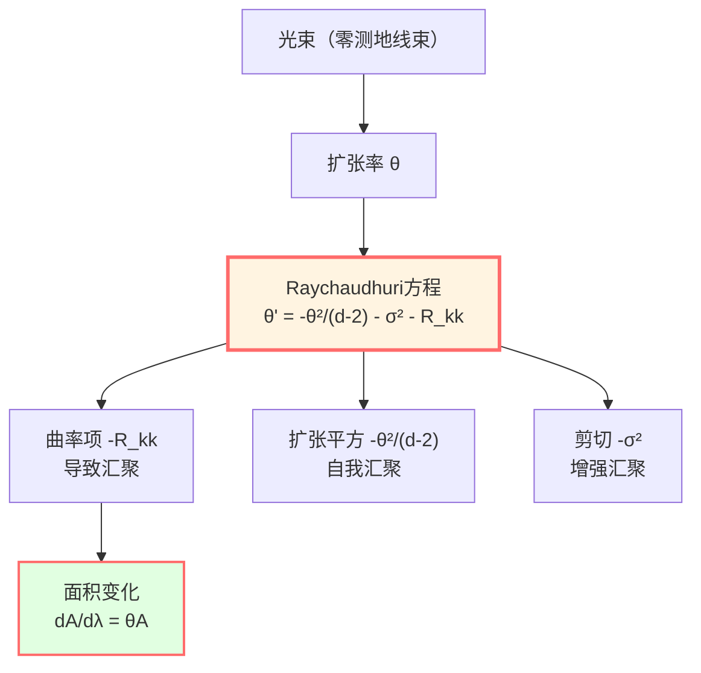
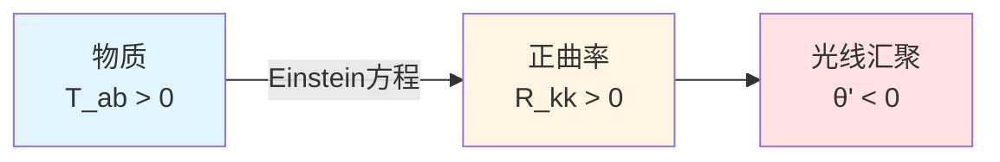
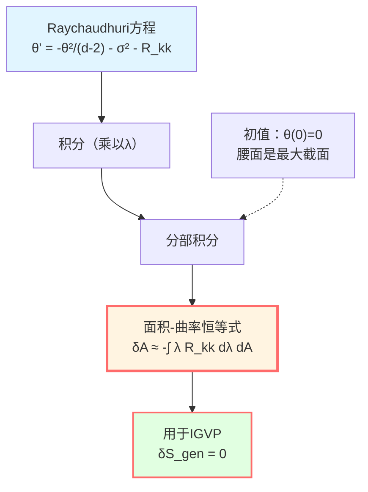

# Raychaudhuri方程：光的汇聚

> *"曲率使光线汇聚，面积随之变化——这就是Raychaudhuri方程的精髓。"*

## 🎯 核心问题

在小因果菱形上变分广义熵：

$$\delta S_{\text{gen}} = \frac{\delta A}{4G\hbar} + \delta S_{\text{out}}$$

关键问题：**面积变化** $\delta A$ 如何与时空**曲率** $R_{ab}$ 联系起来？

答案：**Raychaudhuri方程**！

## 💡 直观图像：聚焦的光束

### 日常类比

想象阳光穿过放大镜：

```
   ∥ ∥ ∥ ∥     ← 平行光束
    ∥∥ ∥∥
     ∥ ∥       ← 汇聚
      ∥
     焦点
```

**问题**：
- 为什么平行光线会汇聚?
- 汇聚速度与透镜曲率有什么关系?

**答案**：
- 光学：折射定律
- 引力：Raychaudhuri方程

### 引力透镜

在弯曲时空中，光线（零测地线）的**束**（bundle）会：

1. **扩张**（expansion）$\theta > 0$：光束散开
2. **收缩**（contraction）$\theta < 0$：光束汇聚
3. **保持**：$\theta = 0$

**Raychaudhuri方程**描述 $\theta$ 如何随时间演化，特别是**曲率如何导致汇聚**！



## 📐 零测地线的数学框架

### 零测地线束

考虑从腰面 $S_\ell$ 发出的零测地线束：

**切向量**：$k^a$，满足：
- $k^a k_a = 0$（零向量）
- $k^b \nabla_b k^a = 0$（测地线，仿射参数化）

**横截空间**：在每点 $\gamma(\lambda)$ 上，定义与 $k^a$ 正交的 $(d-2)$-维空间，记为"screen space"。

选择正交基 $\{e_A^a\}$（$A = 1, \ldots, d-2$），满足：
- $k^a e_{Aa} = 0$（正交于 $k^a$）
- $e_A^a e_{Ba} = \delta_{AB}$（归一化）

### 光束的形变张量

光束的形变由**投影导数**刻画：

$$B_{AB} := e_A^a \nabla_a k_b \cdot e_B^b$$

**分解**（无挠率情形 $\omega_{AB} = 0$）：

$$B_{AB} = \frac{1}{d-2}\theta \delta_{AB} + \sigma_{AB}$$

其中：
- **扩张率**（expansion）：$\theta := B_A{}^A = \nabla_a k^a$（迹）
- **剪切**（shear）：$\sigma_{AB} := B_{AB} - \frac{1}{d-2}\theta \delta_{AB}$（无迹部分）

**物理意义**：

| 量 | 定义 | 意义 |
|----|------|------|
| $\theta$ | $\nabla_a k^a$ | 光束的体积扩张率 |
| $\sigma_{AB}$ | $B_{AB}$ 的无迹部分 | 光束的形变（拉伸/压缩） |
| $\sigma^2$ | $\sigma_{AB}\sigma^{AB}$ | 剪切强度 |

## 🌊 Raychaudhuri方程

### 方程形式

沿零测地线，扩张率演化满足：

$$\boxed{\frac{d\theta}{d\lambda} = -\frac{1}{d-2}\theta^2 - \sigma^2 - R_{kk}}$$

其中：
- $\lambda$：仿射参数
- $R_{kk} := R_{ab} k^a k^b$：Ricci曲率沿零方向的收缩
- $d$：时空维度

**假设**：挠率 $\omega_{AB} = 0$（在零测地丛超曲面正交时成立）

### 推导草图

从Riemann曲率张量的定义：

$$[\nabla_a, \nabla_b] k^c = R_{abc}{}^d k^d$$

取 $\nabla_a k^b$ 的散度，投影到横截空间，利用测地线条件和Ricci恒等式，经过一系列计算得到Raychaudhuri方程。

**详细推导**见标准GR教材（如Wald, Carroll）。

## 📊 各项的物理意义

### 1. 曲率项：$-R_{kk}$

$$R_{kk} = R_{ab} k^a k^b$$

**正曲率 $R_{kk} > 0$**：
- 代表**引力吸引**
- 导致 $\theta' < 0$（汇聚加速）
- 光线被"拉向一起"

**例子**：地球附近的光线偏折



### 2. 扩张平方项：$-\frac{1}{d-2}\theta^2$

**自我汇聚**：
- 即使无曲率（$R_{kk} = 0$）
- 如果光束已经在收缩（$\theta < 0$）
- 收缩会**自我加速**

**例子**：惯性汇聚，类似于"雪球效应"

### 3. 剪切项：$-\sigma^2$

$$\sigma^2 = \sigma_{AB} \sigma^{AB} \ge 0$$

**总是非负**：
- 剪切总是**增强汇聚**
- 代表光束的"扭曲形变"

**例子**：潮汐力导致的形变

## 🧮 面积演化公式

### 从扩张率到面积

考虑腰面 $S_\ell$ 上一个小面积元 $dA_0$，沿零测地线传播到参数 $\lambda$ 处，面积变为 $dA(\lambda)$。

**面积演化**：

$$\frac{1}{A}\frac{dA}{d\lambda} = \theta$$

**证明**：
- 面积元 $dA$ 正比于横截方向向量的叉积
- $\theta = \nabla_a k^a$ 正是这个"横截体积"的对数导数

**微分形式**：

$$\frac{dA}{d\lambda} = \theta A$$

### 积分形式

从腰面（$\lambda = 0$，$\theta(0) = 0$）到 $\lambda = \lambda_*$：

$$A(\lambda) = A(0) \exp\left(\int_0^\lambda \theta(\lambda') d\lambda'\right)$$

在小钻石极限 $|\theta| \ll 1$，Taylor展开：

$$A(\lambda) \approx A(0) \left[1 + \int_0^\lambda \theta(\lambda') d\lambda' + O(\theta^2)\right]$$

**面积变化**：

$$\delta A = A(\lambda) - A(0) = A(0) \int_0^\lambda \theta(\lambda') d\lambda'$$

## 🔍 与曲率的联系

### 积分Raychaudhuri方程

从Raychaudhuri方程：

$$\theta' = -\frac{1}{d-2}\theta^2 - \sigma^2 - R_{kk}$$

两边乘以 $\lambda$ 并积分（**关键技巧**！）：

$$\int_0^{\lambda_*} \lambda \theta' d\lambda = -\int_0^{\lambda_*} \lambda \left[\frac{1}{d-2}\theta^2 + \sigma^2 + R_{kk}\right] d\lambda$$

**分部积分**左边：

$$\int_0^{\lambda_*} \lambda \theta' d\lambda = [\lambda \theta]_0^{\lambda_*} - \int_0^{\lambda_*} \theta d\lambda$$

在小钻石极限，$\lambda_* \sim \ell \to 0$，$\theta(\lambda_*) = O(\varepsilon)$，故 $\lambda_* \theta(\lambda_*) = o(\ell)$。

又 $\theta(0) = 0$（腰面是最大体积截面），得：

$$\int_0^{\lambda_*} \lambda \theta' d\lambda = -\int_0^{\lambda_*} \theta d\lambda + o(\ell)$$

### 面积-曲率恒等式

结合 $\delta A = A(0) \int_0^{\lambda_*} \theta d\lambda$，得：

$$\boxed{\delta A + \int_0^{\lambda_*} \lambda R_{kk} d\lambda \cdot A(0) = -\int_0^{\lambda_*} \lambda \left[\frac{1}{d-2}\theta^2 + \sigma^2\right] d\lambda \cdot A(0)}$$

**右边是高阶小量**（$O(\varepsilon^2)$ 或更高），在一阶变分中忽略！

**关键结果**：

$$\frac{\delta A}{4G\hbar} \approx -\frac{1}{4G\hbar} \int_0^{\lambda_*} \lambda R_{kk} d\lambda dA$$

这就是**面积变化与曲率的精确联系**！



## 📈 小钻石极限的精确控制

### 误差估计

在IGVP推导中，需要精确控制各项误差：

**几何常数**：
- $C_R := \sup_{\mathcal{D}_\ell} |R_{kk}|$（曲率上界）
- $C_{\nabla R} := \sup_{\mathcal{D}_\ell} |\nabla_k R_{kk}|$（曲率梯度上界）
- $C_{\mathcal{C}} := \sup_{\mathcal{D}_\ell} |\mathcal{C}_{AB}|$（Weyl曲率投影）
- $C_{\sigma, 0} := \sup_{S_\ell} |\sigma(0)|$（初始剪切）

**剪切控制**（变系数Grönwall）：

$$|\sigma(\lambda)| \le (C_{\sigma,0} + C_{\mathcal{C}}|\lambda|) \exp\left(\frac{2}{d-2}\int_0^{|\lambda|} |\theta| ds\right)$$

在小极限 $|\theta| \lambda_* \ll 1$：

$$\sup_{\lambda \in [0,\lambda_*]} |\sigma(\lambda)| \le C_\sigma := C_{\sigma,0} + C_{\mathcal{C}} \lambda_*$$

**扩张控制**：

从Raychaudhuri方程：

$$|\theta(\lambda)| \le C_R |\lambda| + \frac{1}{d-2} \int_0^{|\lambda|} \theta^2 ds + \int_0^{|\lambda|} \sigma^2 ds$$

再用Grönwall不等式，得：

$$|\theta(\lambda)| = O(\varepsilon \ell)$$

其中 $\varepsilon = \ell/L_{\text{curv}} \ll 1$。

### 主控函数

定义**主控函数**（dominating function）：

$$\widetilde{M}_{\text{dom}}(\lambda) := \frac{1}{2} C_{\nabla R}\lambda^2 + (C_{\sigma,0} + C_{\mathcal{C}}\lambda_0)^2 |\lambda| + \frac{4}{3(d-2)}C_R^2 \lambda_0^3$$

满足：

$$\left|\theta(\lambda) + \lambda R_{kk}\right| \le \widetilde{M}_{\text{dom}}(\lambda)$$

**且**：$\widetilde{M}_{\text{dom}} \in L^1([0, \lambda_0])$（可积！）

**重要性**：这保证了被控收敛定理（dominated convergence theorem）适用，从而可以交换极限与积分次序！

## 🎨 Minkowski时空的例子

### 平直时空

在平直时空 $R_{ab} = 0$，Raychaudhuri方程简化为：

$$\theta' = -\frac{1}{d-2}\theta^2 - \sigma^2$$

**初值** $\theta(0) = 0$，$\sigma(0) = 0$（对称配置）：

解：$\theta(\lambda) \equiv 0$，$\sigma(\lambda) \equiv 0$

**面积**：$A(\lambda) = A(0) = \text{常数}$

这符合预期：平直时空中，平行光束保持平行！

### 加入扰动

如果 $\sigma(0) \neq 0$（初始剪切）：

$$\theta' = -\sigma^2 < 0$$

即使 $\theta(0) = 0$，$\theta$ 会变负（汇聚），面积减小！

**物理意义**：初始的"扭曲"会导致后续的汇聚。

## 🌌 Schwarzschild时空的例子

### 径向零测地线

在Schwarzschild度规：

$$ds^2 = -\left(1 - \frac{2M}{r}\right) dt^2 + \left(1 - \frac{2M}{r}\right)^{-1} dr^2 + r^2 d\Omega^2$$

**径向向外零测地线**（$\theta = 0, \phi = \text{const}$）：

$$k^a \partial_a = \partial_t + \left(1 - \frac{2M}{r}\right) \partial_r$$

**曲率**：

$$R_{kk} = \frac{4M}{r^3}(1 - \frac{2M}{r}) > 0$$

**Raychaudhuri**：

$$\theta' = -\sigma^2 - \frac{4M}{r^3}(1 - \frac{2M}{r})$$

在 $r \gg 2M$（远离视界）：

$$\theta' \approx -\frac{4M}{r^3} < 0$$

**结论**：即使光向外传播，正曲率导致扩张率减小（汇聚趋势）！

## 📝 关键公式总结

| 公式 | 名称 | 意义 |
|-----|------|------|
| $\theta = \nabla_a k^a$ | 扩张率定义 | 光束体积变化率 |
| $\theta' = -\theta^2/(d-2) - \sigma^2 - R_{kk}$ | Raychaudhuri方程 | 扩张率演化 |
| $\frac{dA}{d\lambda} = \theta A$ | 面积演化 | 扩张率与面积关系 |
| $\delta A \approx -\int \lambda R_{kk} d\lambda dA$ | 面积-曲率恒等式 | IGVP的核心 |
| $R_{kk} := R_{ab}k^a k^b$ | 零方向曲率 | 引力"聚焦"强度 |

## 🎓 深入阅读

- 原始论文：A.K. Raychaudhuri, "Relativistic cosmology" (Phys. Rev. 98, 1123, 1955)
- 现代处理：R.M. Wald, *General Relativity* (University of Chicago Press, 1984), §9.2
- 奇点定理：S.W. Hawking, R. Penrose, "The singularities of gravitational collapse" (Proc. Roy. Soc. A 314, 529, 1970)
- GLS应用：igvp-einstein-complete.md
- 上一篇：[02-causal-diamond.md](02-causal-diamond.md) - 小因果菱形
- 下一篇：[04-first-order-variation.md](04-first-order-variation.md) - 一阶变分与Einstein方程

## 🤔 练习题

1. **概念理解**：
   - 为什么扩张率 $\theta$ 的定义是 $\nabla_a k^a$？
   - Raychaudhuri方程中为什么所有项都是负号（除了 $\omega^2$）？
   - 什么是"焦点"（focal point）？与 $\theta \to -\infty$ 有什么关系？

2. **计算练习**：
   - 在二维 $(t, x)$ 时空，Raychaudhuri方程的形式是什么？（提示：$d=2$）
   - 验证平直时空中 $\theta \equiv 0$ 是Raychaudhuri方程的解
   - 在FRW宇宙中，计算径向零测地线的 $R_{kk}$

3. **物理应用**：
   - 引力透镜如何用Raychaudhuri方程解释？
   - 为什么说"物质总是导致汇聚"？（提示：能量条件）
   - 宇宙膨胀中，光子的扩张率 $\theta$ 如何演化？

4. **进阶思考**：
   - Raychaudhuri方程如何导致Penrose-Hawking奇点定理？
   - 如果 $\omega_{AB} \neq 0$（有挠率），方程如何改变？
   - 面积-曲率恒等式中为什么要乘以权重 $\lambda$？（提示：分部积分）

---

**下一步**：掌握了Raychaudhuri方程后，我们将看到如何从 $\delta S_{\text{gen}} = 0$ 推导出Einstein方程！
