# Raychaudhuri Equation: Convergence of Light

> *"Curvature causes light rays to converge, and area changes accordingly—this is the essence of the Raychaudhuri equation."*

## 🎯 Core Question

Varying generalized entropy on the small causal diamond:

$$\delta S_{\text{gen}} = \frac{\delta A}{4G\hbar} + \delta S_{\text{out}}$$

Key question: How is **area change** $\delta A$ related to spacetime **curvature** $R_{ab}$?

Answer: The **Raychaudhuri equation**!

## 💡 Intuitive Image: Focusing Light Beam

### Everyday Analogy

Imagine sunlight passing through a magnifying glass:

```
   ∥ ∥ ∥ ∥     ← Parallel beams
    ∥∥ ∥∥
     ∥ ∥       ← Convergence
      ∥
     Focus
```

**Questions**:
- Why do parallel light rays converge?
- What is the relationship between convergence rate and lens curvature?

**Answers**:
- Optics: law of refraction
- Gravity: Raychaudhuri equation

### Gravitational Lensing

In curved spacetime, a **bundle** of light rays (null geodesics) will:

1. **Expand** (expansion) $\theta > 0$: beam spreads out
2. **Contract** (contraction) $\theta < 0$: beam converges
3. **Remain constant**: $\theta = 0$

The **Raychaudhuri equation** describes how $\theta$ evolves with time, especially how **curvature causes convergence**!

```mermaid
graph TB
    L["Light Beam (Null Geodesic Bundle)"] --> E["Expansion Rate θ"]
    E --> R["Raychaudhuri Equation<br/>θ' = -θ²/(d-2) - σ² - R_kk"]

    R --> C1["Curvature Term -R_kk<br/>Causes Convergence"]
    R --> C2["Expansion Squared -θ²/(d-2)<br/>Self-Convergence"]
    R --> C3["Shear -σ²<br/>Enhances Convergence"]

    C1 --> A["Area Change<br/>dA/dλ = θA"]

    style R fill:#fff4e1,stroke:#ff6b6b,stroke-width:3px
    style A fill:#e1ffe1,stroke:#ff6b6b,stroke-width:2px
```



## 📐 Mathematical Framework of Null Geodesics

### Null Geodesic Bundle

Consider a null geodesic bundle emitted from waist $S_\ell$:

**Tangent vector**: $k^a$, satisfying:
- $k^a k_a = 0$ (null vector)
- $k^b \nabla_b k^a = 0$ (geodesic, affinely parameterized)

**Transverse space**: At each point $\gamma(\lambda)$, define a $(d-2)$-dimensional space orthogonal to $k^a$, called "screen space".

Choose orthonormal basis $\{e_A^a\}$ ($A = 1, \ldots, d-2$), satisfying:
- $k^a e_{Aa} = 0$ (orthogonal to $k^a$)
- $e_A^a e_{Ba} = \delta_{AB}$ (normalized)

### Deformation Tensor of Light Beam

Beam deformation is characterized by **projected derivative**:

$$B_{AB} := e_A^a \nabla_a k_b \cdot e_B^b$$

**Decomposition** (no torsion case $\omega_{AB} = 0$):

$$B_{AB} = \frac{1}{d-2}\theta \delta_{AB} + \sigma_{AB}$$

Where:
- **Expansion**: $\theta := B_A{}^A = \nabla_a k^a$ (trace)
- **Shear**: $\sigma_{AB} := B_{AB} - \frac{1}{d-2}\theta \delta_{AB}$ (traceless part)

**Physical meaning**:

| Quantity | Definition | Meaning |
|----|------|------|
| $\theta$ | $\nabla_a k^a$ | Volume expansion rate of beam |
| $\sigma_{AB}$ | Traceless part of $B_{AB}$ | Beam deformation (stretch/compress) |
| $\sigma^2$ | $\sigma_{AB}\sigma^{AB}$ | Shear strength |

## 🌊 Raychaudhuri Equation

### Equation Form

Along null geodesics, expansion rate evolution satisfies:

$$\boxed{\frac{d\theta}{d\lambda} = -\frac{1}{d-2}\theta^2 - \sigma^2 - R_{kk}}$$

Where:
- $\lambda$: affine parameter
- $R_{kk} := R_{ab} k^a k^b$: contraction of Ricci curvature along null direction
- $d$: spacetime dimension

**Assumption**: Torsion $\omega_{AB} = 0$ (holds when null geodesic bundle hypersurface is orthogonal)

### Derivation Sketch

From the definition of Riemann curvature tensor:

$$[\nabla_a, \nabla_b] k^c = R_{abc}{}^d k^d$$

Take divergence of $\nabla_a k^b$, project onto transverse space, use geodesic condition and Ricci identity, and after a series of calculations obtain the Raychaudhuri equation.

**Detailed derivation** see standard GR textbooks (e.g., Wald, Carroll).

## 📊 Physical Meaning of Each Term

### 1. Curvature Term: $-R_{kk}$

$$R_{kk} = R_{ab} k^a k^b$$

**Positive curvature $R_{kk} > 0$**:
- Represents **gravitational attraction**
- Causes $\theta' < 0$ (accelerated convergence)
- Light rays are "pulled together"

**Example**: Light deflection near Earth


### 2. Expansion Squared Term: $-\frac{1}{d-2}\theta^2$

**Self-convergence**:
- Even without curvature ($R_{kk} = 0$)
- If the beam is already contracting ($\theta < 0$)
- Contraction will **self-accelerate**

**Example**: Inertial convergence, similar to "snowball effect"

### 3. Shear Term: $-\sigma^2$

$$\sigma^2 = \sigma_{AB} \sigma^{AB} \ge 0$$

**Always non-negative**:
- Shear always **enhances convergence**
- Represents "twisting deformation" of beam

**Example**: Deformation caused by tidal forces

## 🧮 Area Evolution Formula

### From Expansion Rate to Area

Consider a small area element $dA_0$ on waist $S_\ell$, propagating along null geodesic to parameter $\lambda$, area becomes $dA(\lambda)$.

**Area evolution**:

$$\frac{1}{A}\frac{dA}{d\lambda} = \theta$$

**Proof**:
- Area element $dA$ is proportional to cross product of transverse direction vectors
- $\theta = \nabla_a k^a$ is exactly the logarithmic derivative of this "transverse volume"

**Differential form**:

$$\frac{dA}{d\lambda} = \theta A$$

### Integral Form

From waist ($\lambda = 0$, $\theta(0) = 0$) to $\lambda = \lambda_*$:

$$A(\lambda) = A(0) \exp\left(\int_0^\lambda \theta(\lambda') d\lambda'\right)$$

In small diamond limit $|\theta| \ll 1$, Taylor expansion:

$$A(\lambda) \approx A(0) \left[1 + \int_0^\lambda \theta(\lambda') d\lambda' + O(\theta^2)\right]$$

**Area change**:

$$\delta A = A(\lambda) - A(0) = A(0) \int_0^\lambda \theta(\lambda') d\lambda'$$

## 🔍 Connection with Curvature

### Integrating Raychaudhuri Equation

From Raychaudhuri equation:

$$\theta' = -\frac{1}{d-2}\theta^2 - \sigma^2 - R_{kk}$$

Multiply both sides by $\lambda$ and integrate (**key trick**!):

$$\int_0^{\lambda_*} \lambda \theta' d\lambda = -\int_0^{\lambda_*} \lambda \left[\frac{1}{d-2}\theta^2 + \sigma^2 + R_{kk}\right] d\lambda$$

**Integration by parts** on left side:

$$\int_0^{\lambda_*} \lambda \theta' d\lambda = [\lambda \theta]_0^{\lambda_*} - \int_0^{\lambda_*} \theta d\lambda$$

In small diamond limit, $\lambda_* \sim \ell \to 0$, $\theta(\lambda_*) = O(\varepsilon)$, so $\lambda_* \theta(\lambda_*) = o(\ell)$.

Also $\theta(0) = 0$ (waist is maximum volume cross-section), we get:

$$\int_0^{\lambda_*} \lambda \theta' d\lambda = -\int_0^{\lambda_*} \theta d\lambda + o(\ell)$$

### Area-Curvature Identity

Combining with $\delta A = A(0) \int_0^{\lambda_*} \theta d\lambda$, we get:

$$\boxed{\delta A + \int_0^{\lambda_*} \lambda R_{kk} d\lambda \cdot A(0) = -\int_0^{\lambda_*} \lambda \left[\frac{1}{d-2}\theta^2 + \sigma^2\right] d\lambda \cdot A(0)}$$

**Right side is higher-order small quantity** ($O(\varepsilon^2)$ or higher), ignored in first-order variation!

**Key result**:

$$\frac{\delta A}{4G\hbar} \approx -\frac{1}{4G\hbar} \int_0^{\lambda_*} \lambda R_{kk} d\lambda dA$$

This is the **precise connection between area change and curvature**!

```mermaid
graph TB
    R["Raychaudhuri Equation<br/>θ' = -θ²/(d-2) - σ² - R_kk"] --> I["Integrate (multiply by λ)"]
    I --> P["Integration by Parts"]
    P --> F["Area-Curvature Identity<br/>δA ≈ -∫ λ R_kk dλ dA"]

    T["Initial: θ(0)=0<br/>Waist is Maximum Cross-Section"] -.-> P

    F --> IG["Used in IGVP<br/>δS_gen = 0"]

    style R fill:#e1f5ff
    style F fill:#fff4e1,stroke:#ff6b6b,stroke-width:3px
    style IG fill:#e1ffe1,stroke:#ff6b6b,stroke-width:2px
```



## 📈 Precise Control of Small Diamond Limit

### Error Estimation

In IGVP derivation, precise control of all error terms is needed:

**Geometric constants**:
- $C_R := \sup_{\mathcal{D}_\ell} |R_{kk}|$ (curvature upper bound)
- $C_{\nabla R} := \sup_{\mathcal{D}_\ell} |\nabla_k R_{kk}|$ (curvature gradient upper bound)
- $C_{\mathcal{C}} := \sup_{\mathcal{D}_\ell} |\mathcal{C}_{AB}|$ (Weyl curvature projection)
- $C_{\sigma, 0} := \sup_{S_\ell} |\sigma(0)|$ (initial shear)

**Shear control** (variable coefficient Grönwall):

$$|\sigma(\lambda)| \le (C_{\sigma,0} + C_{\mathcal{C}}|\lambda|) \exp\left(\frac{2}{d-2}\int_0^{|\lambda|} |\theta| ds\right)$$

In small limit $|\theta| \lambda_* \ll 1$:

$$\sup_{\lambda \in [0,\lambda_*]} |\sigma(\lambda)| \le C_\sigma := C_{\sigma,0} + C_{\mathcal{C}} \lambda_*$$

**Expansion control**:

From Raychaudhuri equation:

$$|\theta(\lambda)| \le C_R |\lambda| + \frac{1}{d-2} \int_0^{|\lambda|} \theta^2 ds + \int_0^{|\lambda|} \sigma^2 ds$$

Using Grönwall inequality again, we get:

$$|\theta(\lambda)| = O(\varepsilon \ell)$$

Where $\varepsilon = \ell/L_{\text{curv}} \ll 1$.

### Dominating Function

Define **dominating function**:

$$\widetilde{M}_{\text{dom}}(\lambda) := \frac{1}{2} C_{\nabla R}\lambda^2 + (C_{\sigma,0} + C_{\mathcal{C}}\lambda_0)^2 |\lambda| + \frac{4}{3(d-2)}C_R^2 \lambda_0^3$$

Satisfying:

$$\left|\theta(\lambda) + \lambda R_{kk}\right| \le \widetilde{M}_{\text{dom}}(\lambda)$$

**And**: $\widetilde{M}_{\text{dom}} \in L^1([0, \lambda_0])$ (integrable!)

**Importance**: This guarantees that dominated convergence theorem applies, allowing exchange of limit and integral order!

## 🎨 Example in Minkowski Spacetime

### Flat Spacetime

In flat spacetime $R_{ab} = 0$, Raychaudhuri equation simplifies to:

$$\theta' = -\frac{1}{d-2}\theta^2 - \sigma^2$$

**Initial values** $\theta(0) = 0$, $\sigma(0) = 0$ (symmetric configuration):

Solution: $\theta(\lambda) \equiv 0$, $\sigma(\lambda) \equiv 0$

**Area**: $A(\lambda) = A(0) = \text{constant}$

This is as expected: in flat spacetime, parallel beams remain parallel!

### Adding Perturbation

If $\sigma(0) \neq 0$ (initial shear):

$$\theta' = -\sigma^2 < 0$$

Even if $\theta(0) = 0$, $\theta$ becomes negative (convergence), area decreases!

**Physical meaning**: Initial "twist" leads to subsequent convergence.

## 🌌 Example in Schwarzschild Spacetime

### Radial Null Geodesics

In Schwarzschild metric:

$$ds^2 = -\left(1 - \frac{2M}{r}\right) dt^2 + \left(1 - \frac{2M}{r}\right)^{-1} dr^2 + r^2 d\Omega^2$$

**Radial outward null geodesic** ($\theta = 0, \phi = \text{const}$):

$$k^a \partial_a = \partial_t + \left(1 - \frac{2M}{r}\right) \partial_r$$

**Curvature**:

$$R_{kk} = \frac{4M}{r^3}(1 - \frac{2M}{r}) > 0$$

**Raychaudhuri**:

$$\theta' = -\sigma^2 - \frac{4M}{r^3}(1 - \frac{2M}{r})$$

At $r \gg 2M$ (far from horizon):

$$\theta' \approx -\frac{4M}{r^3} < 0$$

**Conclusion**: Even when light propagates outward, positive curvature causes expansion rate to decrease (convergence tendency)!

## 📝 Key Formulas Summary

| Formula | Name | Meaning |
|-----|------|------|
| $\theta = \nabla_a k^a$ | Expansion rate definition | Beam volume change rate |
| $\theta' = -\theta^2/(d-2) - \sigma^2 - R_{kk}$ | Raychaudhuri equation | Expansion rate evolution |
| $\frac{dA}{d\lambda} = \theta A$ | Area evolution | Relationship between expansion rate and area |
| $\delta A \approx -\int \lambda R_{kk} d\lambda dA$ | Area-curvature identity | Core of IGVP |
| $R_{kk} := R_{ab}k^a k^b$ | Null-direction curvature | Strength of gravitational "focusing" |

## 🎓 Further Reading

- Original paper: A.K. Raychaudhuri, "Relativistic cosmology" (Phys. Rev. 98, 1123, 1955)
- Modern treatment: R.M. Wald, *General Relativity* (University of Chicago Press, 1984), §9.2
- Singularity theorems: S.W. Hawking, R. Penrose, "The singularities of gravitational collapse" (Proc. Roy. Soc. A 314, 529, 1970)
- GLS application: igvp-einstein-complete.md
- Previous: [02-causal-diamond_en.md](02-causal-diamond_en.md) - Small Causal Diamond
- Next: [04-first-order-variation_en.md](04-first-order-variation_en.md) - First-Order Variation and Einstein's Equations

## 🤔 Exercises

1. **Conceptual understanding**:
   - Why is expansion rate $\theta$ defined as $\nabla_a k^a$?
   - Why are all terms in Raychaudhuri equation negative (except $\omega^2$)?
   - What is a "focal point"? What is its relationship with $\theta \to -\infty$?

2. **Calculation exercises**:
   - In two-dimensional $(t, x)$ spacetime, what is the form of Raychaudhuri equation? (Hint: $d=2$)
   - Verify that $\theta \equiv 0$ is a solution of Raychaudhuri equation in flat spacetime
   - In FRW universe, calculate $R_{kk}$ for radial null geodesics

3. **Physical applications**:
   - How to explain gravitational lensing using Raychaudhuri equation?
   - Why do we say "matter always causes convergence"? (Hint: energy conditions)
   - How does expansion rate $\theta$ of photons evolve in cosmic expansion?

4. **Advanced thinking**:
   - How does Raychaudhuri equation lead to Penrose-Hawking singularity theorems?
   - If $\omega_{AB} \neq 0$ (with torsion), how does the equation change?
   - Why multiply by weight $\lambda$ in area-curvature identity? (Hint: integration by parts)

---

**Next step**: After mastering Raychaudhuri equation, we will see how to derive Einstein's equations from $\delta S_{\text{gen}} = 0$!

