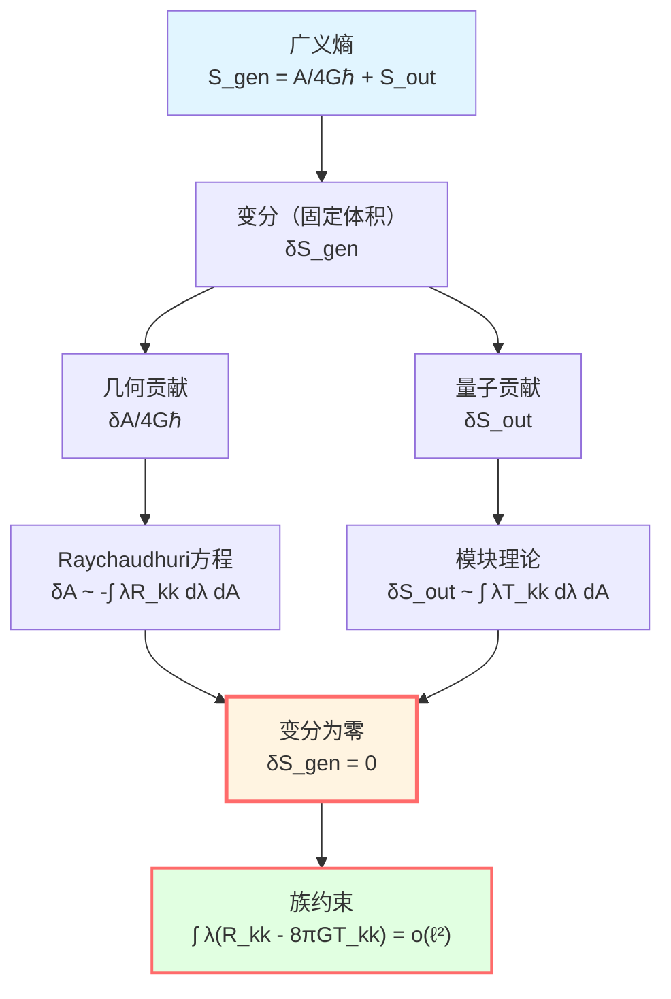
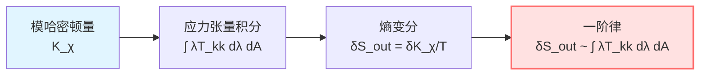
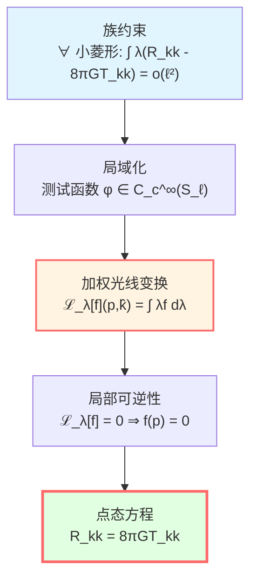
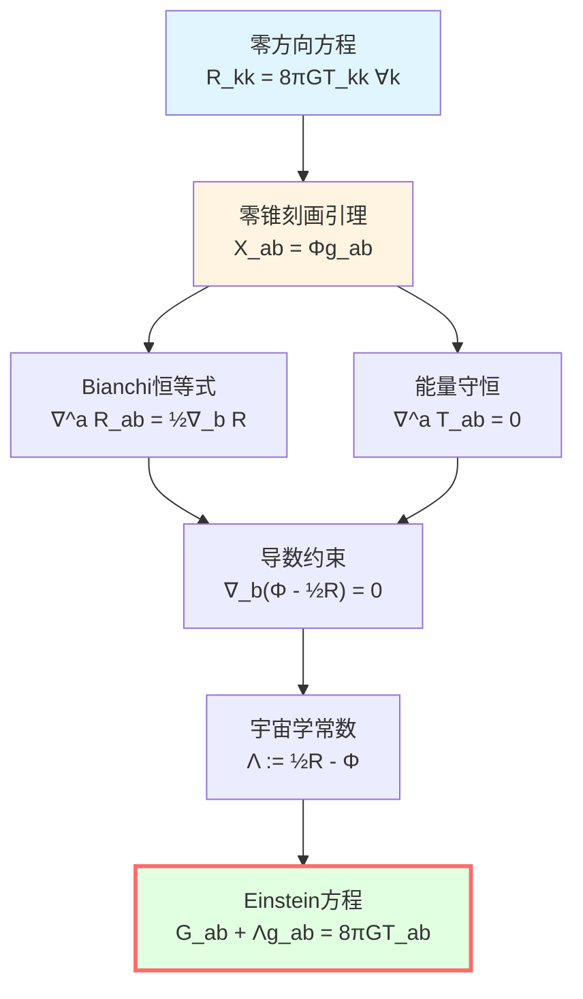
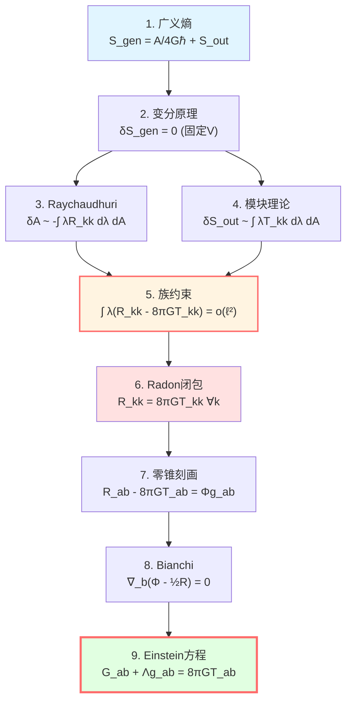

# 一阶变分：从熵到Einstein方程

> *"当熵取极值，Einstein方程自然涌现。"*

## 🎯 目标

我们已经拥有所有工具：
- **广义熵**：$S_{\text{gen}} = A/(4G\hbar) + S_{\text{out}}$
- **小因果菱形**：变分的舞台 $\mathcal{D}_\ell(p)$
- **Raychaudhuri方程**：$\delta A \approx -\int \lambda R_{kk} d\lambda dA$

现在，让我们完成IGVP的核心推导：

$$\boxed{\delta S_{\text{gen}} = 0 \quad \Rightarrow \quad G_{ab} + \Lambda g_{ab} = 8\pi G T_{ab}}$$

## 📐 变分设定

### 基本变分

在小因果菱形 $\mathcal{D}_\ell(p)$ 上，广义熵为：

$$S_{\text{gen}} = \frac{A(S_\ell)}{4G\hbar} + S_{\text{out}}^{\text{ren}} - \frac{\Lambda}{8\pi G}\frac{V(B_\ell)}{T}$$

**约束条件**：

1. **固定端点**：$p^-$ 和 $p^+$ 不变
2. **固定体积**：$\delta V(B_\ell) = 0$
3. **固定温度**：$\delta T = 0$（一阶层面）

**变分泛函**：

$$\delta S_{\text{gen}} = \frac{\delta A}{4G\hbar} + \delta S_{\text{out}}^{\text{ren}}$$

**IGVP原理**：

$$\boxed{\delta S_{\text{gen}} = 0}$$

## 🔧 面积变分的计算

### 从Raychaudhuri到面积

回顾Raychaudhuri方程的积分形式（已在上一篇推导）：

$$\frac{\delta A}{4G\hbar} = -\frac{1}{4G\hbar}\int_{\mathcal{H}} \int_0^{\lambda_*} \lambda R_{kk}(\lambda) d\lambda dA + O(\varepsilon^2)$$

其中：
- $\mathcal{H}$：腰面 $S_\ell$
- $\lambda$：沿零测地线的仿射参数
- $\lambda_* \sim \ell$：上限
- $dA$：腰面的面积元
- $O(\varepsilon^2)$：剪切和扩张的高阶贡献

**关键洞察**：面积变化直接关联曲率在零方向上的积分！

### 误差控制

在小钻石极限 $\ell \to 0$，误差项为：

$$\left|\delta A + \int_{\mathcal{H}} \int_0^{\lambda_*} \lambda R_{kk} d\lambda dA\right| \le C_d \varepsilon^3 \ell^{d-2}$$

其中 $C_d = C_d(C_R, C_{\nabla R}, C_{\mathcal{C}}; d)$ 是几何常数。

**要点**：
- 主项正比于 $\ell^{d-2}$（面积标度）
- 误差是 $O(\varepsilon^3)$（三阶小量）
- $\varepsilon = \ell/L_{\text{curv}} \ll 1$

## ⚛️ 量子场熵变分

### 模块理论的结果

在Hadamard态和近似KMS条件下，量子场熵的变分满足**一阶律**：

$$\delta S_{\text{out}}^{\text{ren}} = \frac{\delta \langle K_\chi \rangle}{T} + O(\varepsilon^2)$$

其中：
- $K_\chi$：模哈密顿量（modular Hamiltonian）
- $T = \hbar|\kappa_\chi|/(2\pi)$：Unruh温度
- $\kappa_\chi$：近似Killing场 $\chi^a$ 的表面引力

### 模哈密顿量的局域化

在小因果菱形上，模哈密顿量可以**局域化**为：

$$K_\chi = \int_{\mathcal{H}} \int_0^{\lambda_*} 2\pi \lambda T_{kk}(\lambda) d\lambda dA + O(\varepsilon^2)$$

其中：
- $T_{kk} := T_{ab} k^a k^b$：应力张量沿零方向的分量
- 权重 $2\pi\lambda$：来自Rindler几何

**物理意义**：模哈密顿量是应力张量在因果视界附近的加权积分！

### 变分公式

因此：

$$\delta S_{\text{out}}^{\text{ren}} = \frac{2\pi}{\hbar} \int_{\mathcal{H}} \int_0^{\lambda_*} \lambda T_{kk}(\lambda) d\lambda dA + O(\varepsilon^2)$$

或者简记为：

$$\delta S_{\text{out}} = \frac{\delta Q}{T}$$

其中 $\delta Q = 2\pi \int \lambda T_{kk} d\lambda dA$ 是"热量"变化。

## ⚖️ 合并变分：族约束

### 一阶极值条件

将两项合并：

$$\delta S_{\text{gen}} = \frac{\delta A}{4G\hbar} + \delta S_{\text{out}}^{\text{ren}} = 0$$

代入显式表达式：

$$-\frac{1}{4G\hbar}\int_{\mathcal{H}} \int_0^{\lambda_*} \lambda R_{kk} d\lambda dA + \frac{2\pi}{\hbar} \int_{\mathcal{H}} \int_0^{\lambda_*} \lambda T_{kk} d\lambda dA = O(\varepsilon^2)$$

**简化**（$\hbar = 1$ 单位制，$4G \cdot 2\pi = 8\pi G$）：

$$\boxed{\int_{\mathcal{H}} \int_0^{\lambda_*} \lambda (R_{kk} - 8\pi G T_{kk}) d\lambda dA = o(\ell^{d-2})}$$

**这就是族约束**（family constraint）！

### 族约束的含义

**对所有**小因果菱形 $\mathcal{D}_\ell(p)$（当 $\ell$ 足够小），上述积分为 $o(\ell^{d-2})$。

**问题**：如何从这个**积分条件**（对一族菱形成立）推出**点态方程** $R_{kk} = 8\pi G T_{kk}$ 在每个点成立？

**答案**：Radon型闭包！

## 🔬 Radon型闭包：从族到点

### 加权光线变换

对函数 $f: \mathcal{D}_\ell \to \mathbb{R}$，定义**加权光线变换**：

$$\mathcal{L}_\lambda[f](p, \hat{k}) := \int_0^{\lambda_*} \lambda f(\gamma_{p,\hat{k}}(\lambda)) d\lambda$$

其中 $\gamma_{p,\hat{k}}$ 是从 $p$ 沿方向 $\hat{k}$ 的零测地线。

**物理意义**：沿光线的加权平均，权重为 $\lambda$（与Rindler温度对偶）。

### 小域展开

在小钻石中，Taylor展开：

$$\mathcal{L}_\lambda[f](p, \hat{k}) = \frac{1}{2}\lambda_*^2 f(p) + O(\lambda_*^3 |\nabla f|_\infty)$$

**关键**：主项正比于 $f(p)$！

**逆问题**：如果 $\mathcal{L}_\lambda[f] = o(\ell^2)$ 对所有方向 $\hat{k}$ 成立，能否推出 $f(p) = 0$？

### 局部可逆性定理

**定理**（零测地一阶矩局部可逆性）：

在 $p$ 的正规邻域内，若：
1. 无共轭点（no conjugate points）
2. 零测地丛横截空间光滑

则加权光线变换 $\mathcal{L}_\lambda$ 在 $p$ 点**局部可逆**：

$$\mathcal{L}_\lambda[f](p, \hat{k}) = o(\ell^2) \quad \forall \hat{k} \quad \Rightarrow \quad f(p) = 0$$

**证明思路**：
- 利用Fubini定理分离空间和"时间"方向
- 用mollifier逼近Dirac $\delta$ 函数
- 在小尺度下，光线变换类似于Radon变换的一阶矩
- 一阶矩数据足以重建 $f$ 在 $p$ 点的值

### 应用到族约束

取 $f = R_{kk} - 8\pi G T_{kk}$，族约束告诉我们：

$$\int_{S_\ell} \varphi(x) \int_0^{\lambda_*} \lambda f(\gamma_{p,\hat{k}}(\lambda)) d\lambda dA = o(\ell^2)$$

对所有测试函数 $\varphi \in C_c^\infty(S_\ell)$ 成立。

**局域化引理**保证这等价于：

$$\mathcal{L}_\lambda[f](p, \hat{k}) = o(\ell^2) \quad \forall \hat{k}$$

由**局部可逆性**：

$$f(p) = R_{kk}(p) - 8\pi G T_{kk}(p) = 0$$

**结论**：

$$\boxed{R_{kk} = 8\pi G T_{kk} \quad \text{对所有零方向 } k^a}$$

这是**零方向Einstein方程**！

## 🎯 张量化：从零方向到完整方程

### 零锥刻画引理

**引理**（$d \ge 3$ 必要）：

设 $X_{ab}$ 是光滑对称张量。如果对**所有**零向量 $k^a$ 都有：

$$X_{ab} k^a k^b = 0$$

则必有：

$$X_{ab} = \Phi g_{ab}$$

其中 $\Phi$ 是某个标量函数。

**证明思路**：
- 在 $d \ge 3$ 维，零锥张成整个切空间
- 任何对称张量可分解为迹部分和无迹部分
- 零锥约束完全确定无迹部分为零

**注**：$d=2$ 时此引理不成立，Einstein方程退化！

### 应用Bianchi恒等式

定义：

$$X_{ab} := R_{ab} - 8\pi G T_{ab}$$

我们已经证明了 $X_{ab} k^a k^b = 0$ 对所有 $k$ 成立，故：

$$X_{ab} = \Phi g_{ab}$$

**利用Bianchi恒等式**：

$$\nabla^a R_{ab} = \frac{1}{2}\nabla_b R$$

**利用能量-动量守恒**：

$$\nabla^a T_{ab} = 0$$

因此：

$$\nabla^a X_{ab} = \nabla^a R_{ab} - 8\pi G \nabla^a T_{ab} = \frac{1}{2}\nabla_b R$$

但由 $X_{ab} = \Phi g_{ab}$：

$$\nabla^a X_{ab} = \nabla^a(\Phi g_{ab}) = \nabla_b \Phi$$

比较两式：

$$\nabla_b \Phi = \frac{1}{2}\nabla_b R$$

即：

$$\nabla_b\left(\Phi - \frac{1}{2}R\right) = 0$$

因此 $\Phi - \frac{1}{2}R$ 是常数，记为 $-\Lambda$：

$$\Phi = \frac{1}{2}R - \Lambda$$

### Einstein方程

代回 $X_{ab} = \Phi g_{ab}$：

$$R_{ab} - 8\pi G T_{ab} = \left(\frac{1}{2}R - \Lambda\right) g_{ab}$$

整理：

$$R_{ab} - \frac{1}{2}R g_{ab} + \Lambda g_{ab} = 8\pi G T_{ab}$$

**即**：

$$\boxed{G_{ab} + \Lambda g_{ab} = 8\pi G T_{ab}}$$

**这就是带宇宙学常数的Einstein场方程！**

## 🌟 完整推导链总结

让我们回顾整个推导过程：

### 第1步：定义广义熵

$$S_{\text{gen}} = \frac{A}{4G\hbar} + S_{\text{out}}$$

### 第2步：变分设定

在小因果菱形上，固定体积，令 $\delta S_{\text{gen}} = 0$。

### 第3步：计算面积变分

用Raychaudhuri方程：

$$\frac{\delta A}{4G\hbar} = -\frac{1}{4G\hbar}\int \lambda R_{kk} d\lambda dA$$

### 第4步：计算场熵变分

用模块理论：

$$\delta S_{\text{out}} = \frac{2\pi}{\hbar}\int \lambda T_{kk} d\lambda dA$$

### 第5步：族约束

合并得：

$$\int \lambda (R_{kk} - 8\pi G T_{kk}) d\lambda dA = o(\ell^{d-2})$$

### 第6步：Radon型闭包

用加权光线变换的局部可逆性：

$$R_{kk} = 8\pi G T_{kk} \quad \forall k$$

### 第7步：张量化

用零锥刻画引理 + Bianchi恒等式：

$$G_{ab} + \Lambda g_{ab} = 8\pi G T_{ab}$$

**完成！**

## 💡 物理洞察

### 熵是基本的

传统视角：Einstein方程是基本公理 → 黑洞熵是导出结果

**IGVP视角**：广义熵是基本泛函 → Einstein方程是变分结果

$$\text{熵极值} \quad \Rightarrow \quad \text{引力场方程}$$

### 引力是热力学现象

Einstein方程可以理解为：

$$\underbrace{\frac{\delta A}{4G\hbar}}_{\text{几何熵变}} + \underbrace{\frac{\delta Q}{T}}_{\text{热力学第一定律}} = 0$$

这类似于热平衡条件！

### 局域性的胜利

从**局域熵极值**（小因果菱形）→ **点态场方程**

引力是真正的**局域物理**！

### 宇宙学常数的涌现

$\Lambda$ 不是事先假设，而是从变分中**涌现**的积分常数！

它的物理意义：体积约束的对偶变量。

## 📝 关键公式速查

| 步骤 | 公式 | 工具 |
|-----|------|------|
| 面积变分 | $\delta A = -\int \lambda R_{kk} d\lambda dA$ | Raychaudhuri |
| 场熵变分 | $\delta S_{\text{out}} = \frac{2\pi}{\hbar}\int \lambda T_{kk} d\lambda dA$ | 模块理论 |
| 族约束 | $\int \lambda (R_{kk} - 8\pi G T_{kk}) = o(\ell^2)$ | IGVP |
| 点态方程 | $R_{kk} = 8\pi G T_{kk}$ | Radon闭包 |
| 张量化 | $X_{ab} = \Phi g_{ab}$ | 零锥刻画 |
| Einstein | $G_{ab} + \Lambda g_{ab} = 8\pi G T_{ab}$ | Bianchi |

## 🎓 深入阅读

- Jacobson原始推导：T. Jacobson, "Thermodynamics of spacetime" (1995)
- Radon变换：S. Helgason, *The Radon Transform* (Birkhäuser, 1999)
- GLS完整证明：igvp-einstein-complete.md
- 上一篇：[03-raychaudhuri-equation.md](03-raychaudhuri-equation.md) - Raychaudhuri方程
- 下一篇：[05-second-order-variation.md](05-second-order-variation.md) - 二阶变分与稳定性

## 🤔 练习题

1. **概念理解**：
   - 为什么族约束中的权重是 $\lambda$ 而不是常数？
   - Radon型闭包的"局部可逆性"是什么意思？
   - 零锥刻画引理为什么要求 $d \ge 3$？

2. **推导练习**：
   - 验证 $X_{ab} = \Phi g_{ab}$ 蕴含 $\nabla^a X_{ab} = \nabla_b \Phi$
   - 从Bianchi恒等式推导 $\nabla^a G_{ab} = 0$
   - 在 $d=4$ 时，检验宇宙学常数的单位

3. **物理应用**：
   - 如果 $T_{ab} = 0$（真空），Einstein方程变成什么？
   - Schwarzschild解如何满足 $\delta S_{\text{gen}} = 0$？
   - 为什么说引力是"热力学现象"？

4. **进阶思考**：
   - 如果不固定体积，变分会得到什么方程？
   - 高阶引力理论（如 $f(R)$）的IGVP推导如何修改？
   - IGVP能否推导Lovelock方程？（提示：用Wald熵）

---

**下一步**：一阶变分给出场方程，但稳定性如何保证？让我们进入**二阶变分**的世界！

