# First-Order Variation: From Entropy to Einstein's Equations

> *"When entropy takes an extremum, Einstein's equations naturally emerge."*

## 🎯 Goal

We now have all the tools:
- **Generalized entropy**: $S_{\text{gen}} = A/(4G\hbar) + S_{\text{out}}$
- **Small causal diamond**: Stage for variation $\mathcal{D}_\ell(p)$
- **Raychaudhuri equation**: $\delta A \approx -\int \lambda R_{kk} d\lambda dA$

Now, let's complete the core derivation of IGVP:

$$\boxed{\delta S_{\text{gen}} = 0 \quad \Rightarrow \quad G_{ab} + \Lambda g_{ab} = 8\pi G T_{ab}}$$

## 📐 Variation Setup

### Basic Variation

On the small causal diamond $\mathcal{D}_\ell(p)$, generalized entropy is:

$$S_{\text{gen}} = \frac{A(S_\ell)}{4G\hbar} + S_{\text{out}}^{\text{ren}} - \frac{\Lambda}{8\pi G}\frac{V(B_\ell)}{T}$$

**Constraints**:

1. **Fixed endpoints**: $p^-$ and $p^+$ unchanged
2. **Fixed volume**: $\delta V(B_\ell) = 0$
3. **Fixed temperature**: $\delta T = 0$ (at first-order level)

**Variation functional**:

$$\delta S_{\text{gen}} = \frac{\delta A}{4G\hbar} + \delta S_{\text{out}}^{\text{ren}}$$

**IGVP principle**:

$$\boxed{\delta S_{\text{gen}} = 0}$$

```mermaid
graph TB
    S["Generalized Entropy<br/>S_gen = A/4Gℏ + S_out"] --> V["Variation (Fixed Volume)<br/>δS_gen"]

    V --> G["Geometric Contribution<br/>δA/4Gℏ"]
    V --> Q["Quantum Contribution<br/>δS_out"]

    G --> R["Raychaudhuri Equation<br/>δA ~ -∫ λR_kk dλ dA"]
    Q --> M["Modular Theory<br/>δS_out ~ ∫ λT_kk dλ dA"]

    R --> E["Variation Zero<br/>δS_gen = 0"]
    M --> E

    E --> F["Family Constraint<br/>∫ λ(R_kk - 8πGT_kk) = o(ℓ²)"]

    style S fill:#e1f5ff
    style E fill:#fff4e1,stroke:#ff6b6b,stroke-width:3px
    style F fill:#e1ffe1,stroke:#ff6b6b,stroke-width:2px
```

## 🔧 Calculation of Area Variation

### From Raychaudhuri to Area

Recall the integral form of Raychaudhuri equation (derived in previous article):

$$\frac{\delta A}{4G\hbar} = -\frac{1}{4G\hbar}\int_{\mathcal{H}} \int_0^{\lambda_*} \lambda R_{kk}(\lambda) d\lambda dA + O(\varepsilon^2)$$

Where:
- $\mathcal{H}$: waist $S_\ell$
- $\lambda$: affine parameter along null geodesics
- $\lambda_* \sim \ell$: upper limit
- $dA$: area element of waist
- $O(\varepsilon^2)$: higher-order contributions from shear and expansion

**Key insight**: Area change is directly related to the integral of curvature along null direction!

### Error Control

In the small diamond limit $\ell \to 0$, error term is:

$$\left|\delta A + \int_{\mathcal{H}} \int_0^{\lambda_*} \lambda R_{kk} d\lambda dA\right| \le C_d \varepsilon^3 \ell^{d-2}$$

Where $C_d = C_d(C_R, C_{\nabla R}, C_{\mathcal{C}}; d)$ is a geometric constant.

**Key points**:
- Main term proportional to $\ell^{d-2}$ (area scale)
- Error is $O(\varepsilon^3)$ (third-order small quantity)
- $\varepsilon = \ell/L_{\text{curv}} \ll 1$

## ⚛️ Quantum Field Entropy Variation

### Result from Modular Theory

Under Hadamard state and approximate KMS conditions, quantum field entropy variation satisfies the **first law**:

$$\delta S_{\text{out}}^{\text{ren}} = \frac{\delta \langle K_\chi \rangle}{T} + O(\varepsilon^2)$$

Where:
- $K_\chi$: modular Hamiltonian
- $T = \hbar|\kappa_\chi|/(2\pi)$: Unruh temperature
- $\kappa_\chi$: surface gravity of approximate Killing field $\chi^a$

### Localization of Modular Hamiltonian

On the small causal diamond, modular Hamiltonian can be **localized** as:

$$K_\chi = \int_{\mathcal{H}} \int_0^{\lambda_*} 2\pi \lambda T_{kk}(\lambda) d\lambda dA + O(\varepsilon^2)$$

Where:
- $T_{kk} := T_{ab} k^a k^b$: component of stress tensor along null direction
- Weight $2\pi\lambda$: from Rindler geometry

**Physical meaning**: Modular Hamiltonian is a weighted integral of stress tensor near causal horizon!

```mermaid
graph LR
    K["Modular Hamiltonian<br/>K_χ"] --> T["Stress Tensor Integral<br/>∫ λT_kk dλ dA"]
    T --> S["Entropy Variation<br/>δS_out = δK_χ/T"]

    S --> F["First Law<br/>δS_out ~ ∫ λT_kk dλ dA"]

    style K fill:#e1f5ff
    style F fill:#ffe1e1,stroke:#ff6b6b,stroke-width:2px
```

### Variation Formula

Therefore:

$$\delta S_{\text{out}}^{\text{ren}} = \frac{2\pi}{\hbar} \int_{\mathcal{H}} \int_0^{\lambda_*} \lambda T_{kk}(\lambda) d\lambda dA + O(\varepsilon^2)$$

Or simply:

$$\delta S_{\text{out}} = \frac{\delta Q}{T}$$

Where $\delta Q = 2\pi \int \lambda T_{kk} d\lambda dA$ is the "heat" change.

## ⚖️ Combining Variations: Family Constraint

### First-Order Extremum Condition

Combining the two terms:

$$\delta S_{\text{gen}} = \frac{\delta A}{4G\hbar} + \delta S_{\text{out}}^{\text{ren}} = 0$$

Substituting explicit expressions:

$$-\frac{1}{4G\hbar}\int_{\mathcal{H}} \int_0^{\lambda_*} \lambda R_{kk} d\lambda dA + \frac{2\pi}{\hbar} \int_{\mathcal{H}} \int_0^{\lambda_*} \lambda T_{kk} d\lambda dA = O(\varepsilon^2)$$

**Simplification** (units $\hbar = 1$, $4G \cdot 2\pi = 8\pi G$):

$$\boxed{\int_{\mathcal{H}} \int_0^{\lambda_*} \lambda (R_{kk} - 8\pi G T_{kk}) d\lambda dA = o(\ell^{d-2})}$$

**This is the family constraint**!

### Meaning of Family Constraint

For **all** small causal diamonds $\mathcal{D}_\ell(p)$ (when $\ell$ is sufficiently small), the above integral is $o(\ell^{d-2})$.

**Question**: How to derive the **pointwise equation** $R_{kk} = 8\pi G T_{kk}$ holding at each point from this **integral condition** (holding for a family of diamonds)?

**Answer**: Radon-type closure!

```mermaid
graph TB
    F["Family Constraint<br/>∀ Small Diamonds: ∫ λ(R_kk - 8πGT_kk) = o(ℓ²)"] --> L["Localization<br/>Test Function φ ∈ C_c^∞(S_ℓ)"]

    L --> R["Weighted Ray Transform<br/>ℒ_λ[f](p,k̂) = ∫ λf dλ"]

    R --> I["Local Invertibility<br/>ℒ_λ[f] = 0 ⇒ f(p) = 0"]

    I --> P["Pointwise Equation<br/>R_kk = 8πGT_kk"]

    style F fill:#e1f5ff
    style R fill:#fff4e1,stroke:#ff6b6b,stroke-width:2px
    style P fill:#e1ffe1,stroke:#ff6b6b,stroke-width:3px
```

## 🔬 Radon-Type Closure: From Family to Point

### Weighted Ray Transform

For function $f: \mathcal{D}_\ell \to \mathbb{R}$, define **weighted ray transform**:

$$\mathcal{L}_\lambda[f](p, \hat{k}) := \int_0^{\lambda_*} \lambda f(\gamma_{p,\hat{k}}(\lambda)) d\lambda$$

Where $\gamma_{p,\hat{k}}$ is the null geodesic from $p$ along direction $\hat{k}$.

**Physical meaning**: Weighted average along light ray, weight $\lambda$ (dual to Rindler temperature).

### Small Domain Expansion

In small diamond, Taylor expansion:

$$\mathcal{L}_\lambda[f](p, \hat{k}) = \frac{1}{2}\lambda_*^2 f(p) + O(\lambda_*^3 |\nabla f|_\infty)$$

**Key**: Leading term is proportional to $f(p)$!

**Inverse problem**: If $\mathcal{L}_\lambda[f] = o(\ell^2)$ holds for all directions $\hat{k}$, can we derive $f(p) = 0$?

### Local Invertibility Theorem

**Theorem** (Local invertibility of null geodesic first moment):

In the normal neighborhood of $p$, if:
1. No conjugate points
2. Null geodesic bundle transverse space is smooth

Then weighted ray transform $\mathcal{L}_\lambda$ is **locally invertible** at point $p$:

$$\mathcal{L}_\lambda[f](p, \hat{k}) = o(\ell^2) \quad \forall \hat{k} \quad \Rightarrow \quad f(p) = 0$$

**Proof idea**:
- Use Fubini theorem to separate space and "time" directions
- Approximate Dirac $\delta$ function with mollifier
- At small scales, ray transform is similar to first moment of Radon transform
- First moment data is sufficient to reconstruct value of $f$ at point $p$

### Application to Family Constraint

Take $f = R_{kk} - 8\pi G T_{kk}$, family constraint tells us:

$$\int_{S_\ell} \varphi(x) \int_0^{\lambda_*} \lambda f(\gamma_{p,\hat{k}}(\lambda)) d\lambda dA = o(\ell^2)$$

Holds for all test functions $\varphi \in C_c^\infty(S_\ell)$.

**Localization lemma** guarantees this is equivalent to:

$$\mathcal{L}_\lambda[f](p, \hat{k}) = o(\ell^2) \quad \forall \hat{k}$$

By **local invertibility**:

$$f(p) = R_{kk}(p) - 8\pi G T_{kk}(p) = 0$$

**Conclusion**:

$$\boxed{R_{kk} = 8\pi G T_{kk} \quad \text{for all null directions } k^a}$$

This is the **null-direction Einstein equation**!

## 🎯 Tensorization: From Null Direction to Complete Equation

### Null Cone Characterization Lemma

**Lemma** (requires $d \ge 3$):

Let $X_{ab}$ be a smooth symmetric tensor. If for **all** null vectors $k^a$:

$$X_{ab} k^a k^b = 0$$

Then necessarily:

$$X_{ab} = \Phi g_{ab}$$

Where $\Phi$ is some scalar function.

**Proof idea**:
- In $d \ge 3$ dimensions, null cone spans entire tangent space
- Any symmetric tensor can be decomposed into trace and traceless parts
- Null cone constraint completely determines traceless part to be zero

**Note**: When $d=2$, this lemma does not hold, Einstein equations degenerate!

### Applying Bianchi Identity

Define:

$$X_{ab} := R_{ab} - 8\pi G T_{ab}$$

We have proven $X_{ab} k^a k^b = 0$ for all $k$, so:

$$X_{ab} = \Phi g_{ab}$$

**Using Bianchi identity**:

$$\nabla^a R_{ab} = \frac{1}{2}\nabla_b R$$

**Using energy-momentum conservation**:

$$\nabla^a T_{ab} = 0$$

Therefore:

$$\nabla^a X_{ab} = \nabla^a R_{ab} - 8\pi G \nabla^a T_{ab} = \frac{1}{2}\nabla_b R$$

But from $X_{ab} = \Phi g_{ab}$:

$$\nabla^a X_{ab} = \nabla^a(\Phi g_{ab}) = \nabla_b \Phi$$

Comparing the two:

$$\nabla_b \Phi = \frac{1}{2}\nabla_b R$$

That is:

$$\nabla_b\left(\Phi - \frac{1}{2}R\right) = 0$$

Therefore $\Phi - \frac{1}{2}R$ is constant, denoted $-\Lambda$:

$$\Phi = \frac{1}{2}R - \Lambda$$

### Einstein Equations

Substituting back $X_{ab} = \Phi g_{ab}$:

$$R_{ab} - 8\pi G T_{ab} = \left(\frac{1}{2}R - \Lambda\right) g_{ab}$$

Rearranging:

$$R_{ab} - \frac{1}{2}R g_{ab} + \Lambda g_{ab} = 8\pi G T_{ab}$$

**That is**:

$$\boxed{G_{ab} + \Lambda g_{ab} = 8\pi G T_{ab}}$$

**This is Einstein's field equations with cosmological constant!**

```mermaid
graph TB
    Z["Null-Direction Equation<br/>R_kk = 8πGT_kk ∀k"] --> L["Null Cone Characterization Lemma<br/>X_ab = Φg_ab"]

    L --> B["Bianchi Identity<br/>∇^a R_ab = ½∇_b R"]
    L --> C["Energy Conservation<br/>∇^a T_ab = 0"]

    B --> N["Derivative Constraint<br/>∇_b(Φ - ½R) = 0"]
    C --> N

    N --> LA["Cosmological Constant<br/>Λ := ½R - Φ"]

    LA --> E["Einstein Equations<br/>G_ab + Λg_ab = 8πGT_ab"]

    style Z fill:#e1f5ff
    style L fill:#fff4e1
    style E fill:#e1ffe1,stroke:#ff6b6b,stroke-width:3px
```

## 🌟 Complete Derivation Chain Summary

Let's review the entire derivation process:

### Step 1: Define Generalized Entropy

$$S_{\text{gen}} = \frac{A}{4G\hbar} + S_{\text{out}}$$

### Step 2: Variation Setup

On small causal diamond, fix volume, set $\delta S_{\text{gen}} = 0$.

### Step 3: Calculate Area Variation

Using Raychaudhuri equation:

$$\frac{\delta A}{4G\hbar} = -\frac{1}{4G\hbar}\int \lambda R_{kk} d\lambda dA$$

### Step 4: Calculate Field Entropy Variation

Using modular theory:

$$\delta S_{\text{out}} = \frac{2\pi}{\hbar}\int \lambda T_{kk} d\lambda dA$$

### Step 5: Family Constraint

Combining:

$$\int \lambda (R_{kk} - 8\pi G T_{kk}) d\lambda dA = o(\ell^{d-2})$$

### Step 6: Radon-Type Closure

Using local invertibility of weighted ray transform:

$$R_{kk} = 8\pi G T_{kk} \quad \forall k$$

### Step 7: Tensorization

Using null cone characterization lemma + Bianchi identity:

$$G_{ab} + \Lambda g_{ab} = 8\pi G T_{ab}$$

**Complete!**

```mermaid
graph TB
    S1["Step 1: Generalized Entropy<br/>S_gen = A/4Gℏ + S_out"] --> S2["Step 2: Variation Principle<br/>δS_gen = 0 (Fixed V)"]

    S2 --> S3["Step 3: Raychaudhuri<br/>δA ~ -∫ λR_kk dλ dA"]
    S2 --> S4["Step 4: Modular Theory<br/>δS_out ~ ∫ λT_kk dλ dA"]

    S3 --> S5["Step 5: Family Constraint<br/>∫ λ(R_kk - 8πGT_kk) = o(ℓ²)"]
    S4 --> S5

    S5 --> S6["Step 6: Radon Closure<br/>R_kk = 8πGT_kk ∀k"]

    S6 --> S7["Step 7: Null Cone Characterization<br/>R_ab - 8πGT_ab = Φg_ab"]

    S7 --> S8["Step 8: Bianchi<br/>∇_b(Φ - ½R) = 0"]

    S8 --> S9["Step 9: Einstein Equations<br/>G_ab + Λg_ab = 8πGT_ab"]

    style S1 fill:#e1f5ff
    style S5 fill:#fff4e1,stroke:#ff6b6b,stroke-width:2px
    style S6 fill:#ffe1e1
    style S9 fill:#e1ffe1,stroke:#ff6b6b,stroke-width:3px
```

## 💡 Physical Insights

### Entropy is Fundamental

Traditional perspective: Einstein equations are fundamental axioms → black hole entropy is derived result

**IGVP perspective**: Generalized entropy is fundamental functional → Einstein equations are variation result

$$\text{Entropy Extremum} \quad \Rightarrow \quad \text{Gravitational Field Equations}$$

### Gravity is a Thermodynamic Phenomenon

Einstein equations can be understood as:

$$\underbrace{\frac{\delta A}{4G\hbar}}_{\text{Geometric Entropy Change}} + \underbrace{\frac{\delta Q}{T}}_{\text{First Law of Thermodynamics}} = 0$$

This is similar to thermal equilibrium condition!

### Victory of Locality

From **local entropy extremum** (small causal diamond) → **pointwise field equations**

Gravity is truly **local physics**!

### Emergence of Cosmological Constant

$\Lambda$ is not assumed beforehand, but an integration constant that **emerges** from variation!

Its physical meaning: dual variable of volume constraint.

## 📝 Key Formulas Quick Reference

| Step | Formula | Tool |
|-----|------|------|
| Area variation | $\delta A = -\int \lambda R_{kk} d\lambda dA$ | Raychaudhuri |
| Field entropy variation | $\delta S_{\text{out}} = \frac{2\pi}{\hbar}\int \lambda T_{kk} d\lambda dA$ | Modular theory |
| Family constraint | $\int \lambda (R_{kk} - 8\pi G T_{kk}) = o(\ell^2)$ | IGVP |
| Pointwise equation | $R_{kk} = 8\pi G T_{kk}$ | Radon closure |
| Tensorization | $X_{ab} = \Phi g_{ab}$ | Null cone characterization |
| Einstein | $G_{ab} + \Lambda g_{ab} = 8\pi G T_{ab}$ | Bianchi |

## 🎓 Further Reading

- Jacobson's original derivation: T. Jacobson, "Thermodynamics of spacetime" (1995)
- Radon transform: S. Helgason, *The Radon Transform* (Birkhäuser, 1999)
- GLS complete proof: igvp-einstein-complete.md
- Previous: [03-raychaudhuri-equation_en.md](03-raychaudhuri-equation_en.md) - Raychaudhuri Equation
- Next: [05-second-order-variation_en.md](05-second-order-variation_en.md) - Second-Order Variation and Stability

## 🤔 Exercises

1. **Conceptual understanding**:
   - Why is the weight in family constraint $\lambda$ rather than constant?
   - What does "local invertibility" of Radon-type closure mean?
   - Why does null cone characterization lemma require $d \ge 3$?

2. **Derivation exercises**:
   - Verify that $X_{ab} = \Phi g_{ab}$ implies $\nabla^a X_{ab} = \nabla_b \Phi$
   - Derive $\nabla^a G_{ab} = 0$ from Bianchi identity
   - Check units of cosmological constant when $d=4$

3. **Physical applications**:
   - If $T_{ab} = 0$ (vacuum), what do Einstein equations become?
   - How does Schwarzschild solution satisfy $\delta S_{\text{gen}} = 0$?
   - Why do we say gravity is a "thermodynamic phenomenon"?

4. **Advanced thinking**:
   - If volume is not fixed, what equations would variation yield?
   - How to modify IGVP derivation for higher-order gravity theories (e.g., $f(R)$)?
   - Can IGVP derive Lovelock equations? (Hint: use Wald entropy)

---

**Next step**: First-order variation gives field equations, but how is stability guaranteed? Let's enter the world of **second-order variation**!

