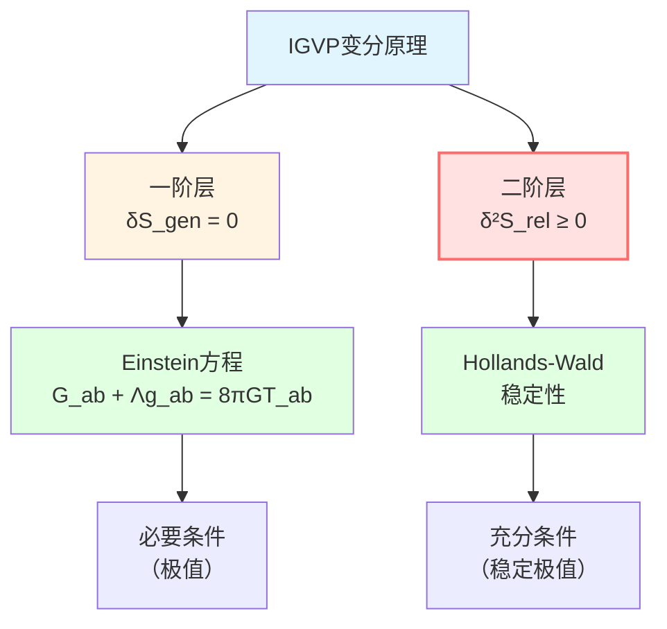
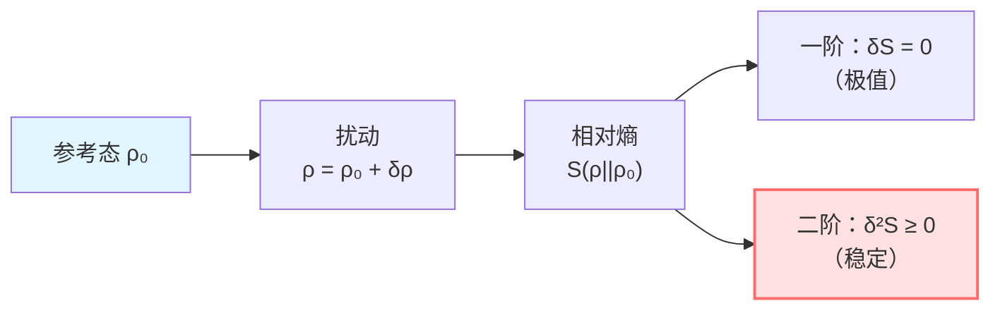
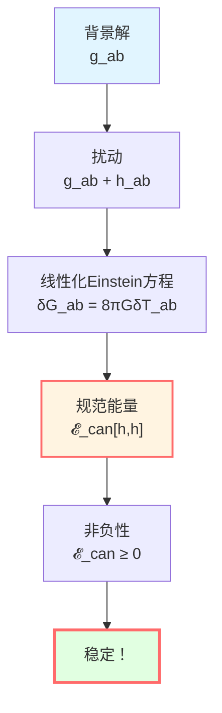
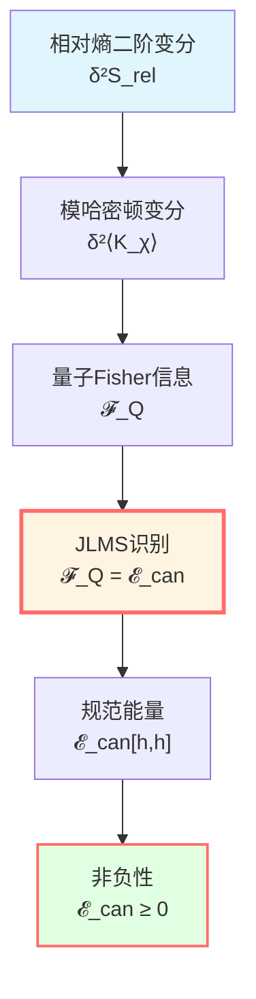
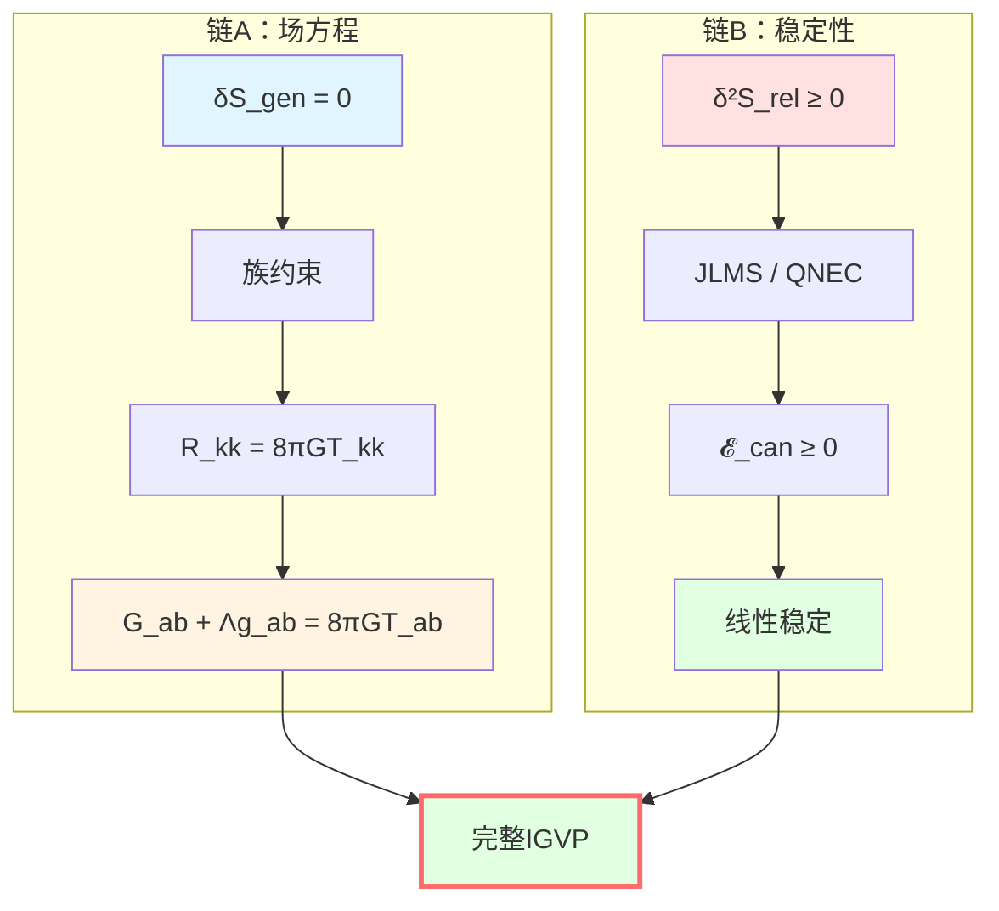

# 二阶变分：稳定性的保证

> *"极值不足以决定物理，还需要稳定性。"*

## 🎯 为什么需要二阶变分？

一阶变分 $\delta S_{\text{gen}} = 0$ 给出Einstein方程，但这只是**必要条件**。

**关键问题**：
- 这个极值是**极大**还是**极小**？
- 解是否**稳定**？
- 小扰动会不会导致发散？

**答案**：需要检查**二阶变分**！

### 经典类比：单摆

考虑单摆的势能：

$$V(\theta) = -mgl\cos\theta$$

**极值点**：
- $\theta = 0$（下垂）：$V' = 0$，且 $V'' > 0$（稳定极小值）
- $\theta = \pi$（倒立）：$V' = 0$，但 $V'' < 0$（不稳定极大值）

```
      ↑
     / \    不稳定（V'' < 0）
    /   \
   |  O  |
   |  |  |  稳定（V'' > 0）
   --------
```

**物理实在**：只有 $V'' > 0$ 的极值才是物理可实现的稳定态！

### IGVP的二阶条件

类似地，IGVP要求：

1. **一阶条件**：$\delta S_{\text{gen}} = 0$ → Einstein方程
2. **二阶条件**：$\delta^2 S_{\text{rel}} \ge 0$ → 稳定性



## 📐 相对熵

### 定义

**相对熵**（relative entropy）是信息几何中测量两个态"距离"的核心概念。

对两个量子态 $\rho$ 和 $\sigma$，定义：

$$S(\rho||\sigma) := \text{tr}(\rho \ln \rho) - \text{tr}(\rho \ln \sigma)$$

**性质**：
1. **非负性**：$S(\rho||\sigma) \ge 0$（Klein不等式）
2. **为零当且仅当**：$S(\rho||\sigma) = 0 \Leftrightarrow \rho = \sigma$
3. **单调性**：对完全正映射 $\Phi$，$S(\Phi(\rho)||\Phi(\sigma)) \le S(\rho||\sigma)$

### 几何解释

相对熵是**信息几何中的"距离平方"**：

$$S(\rho||\sigma) \approx \frac{1}{2} g_{ij} \Delta\theta^i \Delta\theta^j$$

其中 $g_{ij}$ 是Fisher信息矩阵（度规）。

**二阶展开**：

$$S(\rho_0 + \delta\rho || \rho_0) \approx \frac{1}{2}\delta^2 S_{\text{rel}}$$

其中 $\delta^2 S_{\text{rel}}$ 是相对熵的Hessian（二阶变分）。



## ⚛️ 广义相对熵

### IGVP中的相对熵

在IGVP框架中，考虑**广义相对熵**：

$$S_{\text{rel}} := S_{\text{gen}}(\text{扰动态}) - S_{\text{gen}}(\text{参考态})$$

展开：

$$S_{\text{rel}} = \left[\frac{A'}{4G\hbar} + S_{\text{out}}'(\rho')\right] - \left[\frac{A}{4G\hbar} + S_{\text{out}}(\rho)\right]$$

### 二阶展开

对小扰动 $\delta g_{ab}$ 和 $\delta \rho$：

$$S_{\text{rel}} = \underbrace{\delta S_{\text{gen}}}_{=0 \text{ （一阶极值）}} + \frac{1}{2}\delta^2 S_{\text{rel}} + O(\delta^3)$$

**稳定性要求**：

$$\boxed{\delta^2 S_{\text{rel}} \ge 0}$$

**物理意义**：扰动不能降低广义熵，这为极值是**稳定的极小值**提供了理论保障。

## 🔧 Hollands-Wald规范能量

### 定义

Hollands和Wald（2013）在研究线性化引力稳定性时，定义了**规范能量**（canonical energy）：

$$\mathcal{E}_{\text{can}}[h, h] := \int_{\Sigma} \mathcal{E}^{\mu\nu} h_{\mu\nu} \sqrt{-g} d^d x$$

其中：
- $h_{\mu\nu}$：度规扰动
- $\Sigma$：Cauchy超曲面
- $\mathcal{E}^{\mu\nu}$：规范能量密度（由引力哈密顿量变分给出）

**性质**：
1. **非负性**：在适当边界条件下，$\mathcal{E}_{\text{can}}[h, h] \ge 0$
2. **守恒性**：沿演化不变（在场方程成立时）
3. **规范不变性**：对纯规范模 $h = \mathcal{L}_\xi g$，$\mathcal{E}_{\text{can}} = 0$

### 物理意义

$\mathcal{E}_{\text{can}}$ 测量**引力扰动的能量**。

$$\mathcal{E}_{\text{can}} \ge 0 \quad \Leftrightarrow \quad \text{引力波携带正能量}$$

**稳定性判据**：如果对所有允许的扰动都有 $\mathcal{E}_{\text{can}} \ge 0$，则背景解通常被认为是**线性稳定的**。



## 🔗 JLMS等价性

### JLMS关系

Jafferis, Lewkowycz, Maldacena, Suh（2016）提出了一个深刻的等价关系：

在适当条件下（球形区域，真空态附近，固定边界条件）：

$$\boxed{\delta^2 S_{\text{rel}} = \mathcal{E}_{\text{can}}[h, h]}$$

**意义**：相对熵的二阶变分在特定条件下**等同于**Hollands-Wald规范能量。

### 证明思路

**步骤1**：模哈密顿量变分

$$\delta^2 S_{\text{out}} = \frac{\delta^2 \langle K_\chi \rangle}{T}$$

其中 $K_\chi$ 是模哈密顿量。

**步骤2**：$K_\chi$ 与哈密顿量的关系

在小因果菱形上，$K_\chi$ 可以表示为边界哈密顿量的积分。

**步骤3**：边界-体域对偶

利用AdS/CFT或全息原理，边界模哈密顿量对应于体域的规范能量。

**步骤4**：识别

$$\mathcal{F}_Q := \frac{\delta^2 \langle K_\chi \rangle}{T} = \mathcal{E}_{\text{can}}[h, h]$$

### 条件

JLMS等价成立需要：

1. **Code subspace**：扰动满足 $\delta M = \delta J = \delta P = 0$（守恒荷不变）
2. **边界条件**：Dirichlet类边界条件，固定诱导度规
3. **无外流**：辛流无外泄 $\int_{\partial\Sigma} \iota_n \omega = 0$
4. **规范固定**：采用Killing或协变谐规范

**在这些条件下**：

$$\delta^2 S_{\text{rel}} = \mathcal{F}_Q = \mathcal{E}_{\text{can}}[h, h] \ge 0$$



## 🌊 QNEC：备选判据

### 量子零能量条件

如果不使用JLMS等价（例如，在不满足其条件的情形），可以用**量子零能量条件**（Quantum Null Energy Condition, QNEC）作为备选。

**QNEC**（Bousso等，2016）：

$$\langle T_{kk}(x) \rangle_\psi \ge \frac{\hbar}{2\pi} \frac{d^2 S_{\text{out}}}{d\lambda^2}(x)$$

其中：
- $T_{kk} := T_{ab} k^a k^b$：应力张量沿零方向
- $\lambda$：零测地线的仿射参数
- $S_{\text{out}}$：边界外侧的纠缠熵

### 二阶形状导数

QNEC的二阶形状导数给出非负二次型：

$$\boxed{\mathcal{Q}_{\text{QNEC}}[h, h] := \int_{\mathcal{H}} \frac{\hbar}{2\pi} \frac{\partial^2}{\partial\lambda^2}\left(\frac{\delta^2 S_{\text{out}}}{A_\perp}\right) dA \ge 0}$$

**优点**：
- 不依赖JLMS识别
- 在更广泛的情形下成立（CFT中已严格证明）
- 与一阶链兼容

**缺点**：
- 形状导数的计算技术要求高
- 与 $\mathcal{E}_{\text{can}}$ 的一致性需要额外验证

## 📊 两条独立链

### 逻辑结构

IGVP推导分为**两条逻辑独立的链**：

**链A**（热力学-几何光学）：

```
广义熵变分 δS_gen = 0
    ↓
族约束 ∫ λ(R_kk - 8πGT_kk) = 0
    ↓
Radon闭包
    ↓
零方向方程 R_kk = 8πGT_kk
    ↓
张量化（零锥刻画 + Bianchi）
    ↓
Einstein方程 G_ab + Λg_ab = 8πGT_ab
```

**链B**（纠缠-相对熵）：

```
相对熵非负 δ²S_rel ≥ 0
    ↓
JLMS识别（或QNEC）
    ↓
规范能量非负 𝓔_can ≥ 0
    ↓
线性稳定性
```

**关键**：
- 链A给出**场方程**（一阶）
- 链B给出**稳定性**（二阶）
- 两者逻辑独立但物理统一



## 💡 物理意义

### 极值≠物理

一阶极值 $\delta S_{\text{gen}} = 0$ 只是**必要条件**。

物理实在的解通常被认为是**稳定极值**：

$$\delta S_{\text{gen}} = 0 \quad \text{且} \quad \delta^2 S_{\text{rel}} \ge 0$$

**类比**：
- 热力学：平衡态是熵的极大值（$\delta S = 0$, $\delta^2 S < 0$）
- 力学：稳定平衡是势能的极小值（$\delta V = 0$, $\delta^2 V > 0$）
- IGVP：稳定引力是广义熵的极小值（$\delta S_{\text{gen}} = 0$, $\delta^2 S_{\text{rel}} \ge 0$）

### 引力波携带正能量

$\mathcal{E}_{\text{can}}[h, h] \ge 0$ 意味着：

**引力扰动（引力波）通常携带非负能量**

这是物理一致性的基本要求。

### 量子能量条件

QNEC给出**量子修正的能量条件**：

$$T_{kk} \ge \frac{\hbar}{2\pi}\frac{d^2 S_{\text{out}}}{d\lambda^2}$$

**意义**：
- 经典能量条件（$T_{kk} \ge 0$）可以被量子效应违反
- 但违反是**有界的**，界由纠缠熵的变化给出

## 📝 关键定理总结

### 定理5.1（条件版）

**假设**：
1. 线性化Einstein方程成立（来自链A）
2. Code subspace：$\delta M = \delta J = \delta P = 0$
3. Dirichlet边界条件 + 无外流
4. 规范固定

**则**（在JLMS识别成立的前提下）：

$$\delta^2 S_{\text{rel}} = \mathcal{E}_{\text{can}}[h, h] \ge 0$$

**结论**：Einstein方程的解是线性稳定的。

### 定理5.2（无对偶版）

**假设**：
1. 线性化Einstein方程成立
2. 边界无外流

**则**（使用QNEC）：

$$\mathcal{Q}_{\text{QNEC}}[h, h] = \int_{\mathcal{H}} \frac{\hbar}{2\pi} \partial_\lambda^2\left(\frac{\delta^2 S_{\text{out}}}{A_\perp}\right) dA \ge 0$$

**结论**：提供与一阶链兼容的普适稳定性判据。

## 🎓 深入阅读

- Hollands-Wald原始论文：S. Hollands, R.M. Wald, "Stability of black holes and black branes" (CMP 321, 629, 2013)
- JLMS关系：D. Jafferis et al., "Relative entropy equals bulk relative entropy" (JHEP 06, 004, 2016)
- QNEC：R. Bousso et al., "Proof of the QNEC" (PRD 93, 024017, 2016)
- GLS完整推导：igvp-einstein-complete.md
- 上一篇：[04-first-order-variation.md](04-first-order-variation.md) - 一阶变分
- 下一篇：[06-igvp-summary.md](06-igvp-summary.md) - IGVP总结

## 🤔 练习题

1. **概念理解**：
   - 为什么一阶极值不足以保证物理稳定性？
   - 相对熵的非负性（Klein不等式）如何证明？
   - Hollands-Wald规范能量与ADM能量有什么关系？

2. **计算练习**：
   - 对Schwarzschild黑洞，计算线性化Einstein方程
   - 验证纯规范模 $h = \mathcal{L}_\xi g$ 满足 $\mathcal{E}_{\text{can}}[h, h] = 0$
   - 在平直时空中，计算QNEC右侧项

3. **物理应用**：
   - QNEC如何在CFT中验证？
   - 黑洞Hawking辐射如何满足 $\delta^2 S_{\text{rel}} \ge 0$？
   - Code subspace条件的物理意义是什么？

4. **进阶思考**：
   - 如果 $\delta^2 S_{\text{rel}} < 0$，会发生什么？
   - JLMS等价在哪些情形下可能失效？
   - 能否从二阶变分直接推导Einstein方程（不经过一阶）？

---

**下一步**：我们已经完成了IGVP的核心推导。让我们在总结中回顾完整图景！

