# Second-Order Variation: Guarantee of Stability

> *"Extremum is not enough to determine physics, stability is also needed."*

## 🎯 Why Second-Order Variation?

First-order variation $\delta S_{\text{gen}} = 0$ gives Einstein's equations, but this is only a **necessary condition**.

**Key questions**:
- Is this extremum a **maximum** or **minimum**?
- Is the solution **stable**?
- Will small perturbations cause divergence?

**Answer**: Need to check **second-order variation**!

### Classical Analogy: Pendulum

Consider the potential energy of a pendulum:

$$V(\theta) = -mgl\cos\theta$$

**Extremum points**:
- $\theta = 0$ (hanging down): $V' = 0$, and $V'' > 0$ (stable minimum)
- $\theta = \pi$ (inverted): $V' = 0$, but $V'' < 0$ (unstable maximum)

```
      ↑
     / \    Unstable (V'' < 0)
    /   \
   |  O  |
   |  |  |   Stable (V'' > 0)
   --------
```

**Physical reality**: Only extrema with $V'' > 0$ are physically realizable stable states!

### IGVP Second-Order Condition

Similarly, IGVP requires:

1. **First-order condition**: $\delta S_{\text{gen}} = 0$ → Einstein's equations
2. **Second-order condition**: $\delta^2 S_{\text{rel}} \ge 0$ → stability

```mermaid
graph TB
    I["IGVP Variational Principle"] --> F["First Order<br/>δS_gen = 0"]
    I --> S["Second Order<br/>δ²S_rel ≥ 0"]

    F --> E["Einstein Equations<br/>G_ab + Λg_ab = 8πGT_ab"]
    S --> H["Hollands-Wald<br/>Stability"]

    E --> P["Necessary Condition<br/>(Extremum)"]
    H --> C["Sufficient Condition<br/>(Stable Extremum)"]

    style I fill:#e1f5ff
    style F fill:#fff4e1
    style S fill:#ffe1e1,stroke:#ff6b6b,stroke-width:2px
    style E fill:#e1ffe1
    style H fill:#e1ffe1
```



## 📐 Relative Entropy

### Definition

**Relative entropy** is a core concept in information geometry measuring the "distance" between two states.

For two quantum states $\rho$ and $\sigma$, define:

$$S(\rho||\sigma) := \text{tr}(\rho \ln \rho) - \text{tr}(\rho \ln \sigma)$$

**Properties**:
1. **Non-negativity**: $S(\rho||\sigma) \ge 0$ (Klein inequality)
2. **Zero if and only if**: $S(\rho||\sigma) = 0 \Leftrightarrow \rho = \sigma$
3. **Monotonicity**: For completely positive map $\Phi$, $S(\Phi(\rho)||\Phi(\sigma)) \le S(\rho||\sigma)$

### Geometric Interpretation

Relative entropy is the **"distance squared"** in information geometry:

$$S(\rho||\sigma) \approx \frac{1}{2} g_{ij} \Delta\theta^i \Delta\theta^j$$

Where $g_{ij}$ is the Fisher information matrix (metric).

**Second-order expansion**:

$$S(\rho_0 + \delta\rho || \rho_0) \approx \frac{1}{2}\delta^2 S_{\text{rel}}$$

Where $\delta^2 S_{\text{rel}}$ is the Hessian of relative entropy (second-order variation).

```mermaid
graph LR
    R0["Reference State ρ₀"] --> D["Perturbation<br/>ρ = ρ₀ + δρ"]
    D --> S["Relative Entropy<br/>S(ρ||ρ₀)"]

    S --> O["First Order: δS = 0<br/>(Extremum)"]
    S --> T["Second Order: δ²S ≥ 0<br/>(Stable)"]

    style R0 fill:#e1f5ff
    style T fill:#ffe1e1,stroke:#ff6b6b,stroke-width:2px
```



## ⚛️ Generalized Relative Entropy

### Relative Entropy in IGVP

In the IGVP framework, consider **generalized relative entropy**:

$$S_{\text{rel}} := S_{\text{gen}}(\text{perturbed state}) - S_{\text{gen}}(\text{reference state})$$

Expanding:

$$S_{\text{rel}} = \left[\frac{A'}{4G\hbar} + S_{\text{out}}'(\rho')\right] - \left[\frac{A}{4G\hbar} + S_{\text{out}}(\rho)\right]$$

### Second-Order Expansion

For small perturbations $\delta g_{ab}$ and $\delta \rho$:

$$S_{\text{rel}} = \underbrace{\delta S_{\text{gen}}}_{=0 \text{ (first-order extremum)}} + \frac{1}{2}\delta^2 S_{\text{rel}} + O(\delta^3)$$

**Stability requirement**:

$$\boxed{\delta^2 S_{\text{rel}} \ge 0}$$

**Physical meaning**: Perturbations cannot lower generalized entropy, guaranteeing the extremum is a **stable minimum**!

## 🔧 Hollands-Wald Canonical Energy

### Definition

Hollands and Wald (2013), in studying linearized gravity stability, defined **canonical energy**:

$$\mathcal{E}_{\text{can}}[h, h] := \int_{\Sigma} \mathcal{E}^{\mu\nu} h_{\mu\nu} \sqrt{-g} d^d x$$

Where:
- $h_{\mu\nu}$: metric perturbation
- $\Sigma$: Cauchy hypersurface
- $\mathcal{E}^{\mu\nu}$: canonical energy density (given by variation of gravitational Hamiltonian)

**Properties**:
1. **Non-negativity**: Under appropriate boundary conditions, $\mathcal{E}_{\text{can}}[h, h] \ge 0$
2. **Conservation**: Invariant along evolution (when field equations hold)
3. **Gauge invariance**: For pure gauge modes $h = \mathcal{L}_\xi g$, $\mathcal{E}_{\text{can}} = 0$

### Physical Meaning

$\mathcal{E}_{\text{can}}$ measures the **energy of gravitational perturbations**.

$$\mathcal{E}_{\text{can}} \ge 0 \quad \Leftrightarrow \quad \text{Gravitational waves carry positive energy}$$

**Stability criterion**: If $\mathcal{E}_{\text{can}} \ge 0$ for all allowed perturbations, then the background solution is **linearly stable**.

```mermaid
graph TB
    B["Background Solution<br/>g_ab"] --> P["Perturbation<br/>g_ab + h_ab"]

    P --> L["Linearized Einstein Equations<br/>δG_ab = 8πGδT_ab"]

    L --> E["Canonical Energy<br/>𝓔_can[h,h]"]

    E --> S["Non-Negativity<br/>𝓔_can ≥ 0"]

    S --> ST["Stable!"]

    style B fill:#e1f5ff
    style E fill:#fff4e1,stroke:#ff6b6b,stroke-width:2px
    style ST fill:#e1ffe1,stroke:#ff6b6b,stroke-width:3px
```



## 🔗 JLMS Equivalence

### JLMS Relation

Jafferis, Lewkowycz, Maldacena, Suh (2016) proved a profound equivalence relation:

Under appropriate conditions (spherical region, near vacuum state, fixed boundary conditions):

$$\boxed{\delta^2 S_{\text{rel}} = \mathcal{E}_{\text{can}}[h, h]}$$

**Meaning**: Second-order variation of relative entropy **equals** Hollands-Wald canonical energy!

### Proof Idea

**Step 1**: Modular Hamiltonian variation

$$\delta^2 S_{\text{out}} = \frac{\delta^2 \langle K_\chi \rangle}{T}$$

Where $K_\chi$ is the modular Hamiltonian.

**Step 2**: Relationship between $K_\chi$ and Hamiltonian

On small causal diamond, $K_\chi$ can be expressed as integral of boundary Hamiltonian.

**Step 3**: Boundary-bulk duality

Using AdS/CFT or holographic principle, boundary modular Hamiltonian corresponds to bulk canonical energy.

**Step 4**: Identification

$$\mathcal{F}_Q := \frac{\delta^2 \langle K_\chi \rangle}{T} = \mathcal{E}_{\text{can}}[h, h]$$

### Conditions

JLMS equivalence requires:

1. **Code subspace**: Perturbations satisfy $\delta M = \delta J = \delta P = 0$ (conserved charges unchanged)
2. **Boundary conditions**: Dirichlet-type boundary conditions, fixed induced metric
3. **No outward flux**: Symplectic flux has no leakage $\int_{\partial\Sigma} \iota_n \omega = 0$
4. **Gauge fixing**: Use Killing or covariant harmonic gauge

**Under these conditions**:

$$\delta^2 S_{\text{rel}} = \mathcal{F}_Q = \mathcal{E}_{\text{can}}[h, h] \ge 0$$

```mermaid
graph TB
    S["Relative Entropy Second Variation<br/>δ²S_rel"] --> M["Modular Hamiltonian Variation<br/>δ²⟨K_χ⟩"]

    M --> F["Quantum Fisher Information<br/>𝓕_Q"]

    F --> J["JLMS Identification<br/>𝓕_Q = 𝓔_can"]

    J --> E["Canonical Energy<br/>𝓔_can[h,h]"]

    E --> N["Non-Negativity<br/>𝓔_can ≥ 0"]

    style S fill:#e1f5ff
    style J fill:#fff4e1,stroke:#ff6b6b,stroke-width:3px
    style N fill:#e1ffe1,stroke:#ff6b6b,stroke-width:2px
```



## 🌊 QNEC: Alternative Criterion

### Quantum Null Energy Condition

If JLMS equivalence is not used (e.g., when its conditions are not satisfied), **Quantum Null Energy Condition (QNEC)** can be used as an alternative.

**QNEC** (Bousso et al., 2016):

$$\langle T_{kk}(x) \rangle_\psi \ge \frac{\hbar}{2\pi} \frac{d^2 S_{\text{out}}}{d\lambda^2}(x)$$

Where:
- $T_{kk} := T_{ab} k^a k^b$: stress tensor along null direction
- $\lambda$: affine parameter of null geodesic
- $S_{\text{out}}$: entanglement entropy outside boundary

### Second-Order Shape Derivative

Second-order shape derivative of QNEC gives non-negative quadratic form:

$$\boxed{\mathcal{Q}_{\text{QNEC}}[h, h] := \int_{\mathcal{H}} \frac{\hbar}{2\pi} \frac{\partial^2}{\partial\lambda^2}\left(\frac{\delta^2 S_{\text{out}}}{A_\perp}\right) dA \ge 0}$$

**Advantages**:
- Does not depend on JLMS identification
- Holds in broader situations (strictly proven in CFT)
- Compatible with first-order chain

**Disadvantages**:
- High technical requirements for shape derivative calculation
- Consistency with $\mathcal{E}_{\text{can}}$ needs additional verification

## 📊 Two Independent Chains

### Logical Structure

IGVP derivation is divided into **two logically independent chains**:

**Chain A** (Thermodynamics-Geometric Optics):

```
Generalized Entropy Variation δS_gen = 0
    ↓
Family Constraint ∫ λ(R_kk - 8πGT_kk) = 0
    ↓
Radon Closure
    ↓
Null-Direction Equation R_kk = 8πGT_kk
    ↓
Tensorization (Null Cone Characterization + Bianchi)
    ↓
Einstein Equations G_ab + Λg_ab = 8πGT_ab
```

**Chain B** (Entanglement-Relative Entropy):

```
Relative Entropy Non-Negative δ²S_rel ≥ 0
    ↓
JLMS Identification (or QNEC)
    ↓
Canonical Energy Non-Negative 𝓔_can ≥ 0
    ↓
Linear Stability
```

**Key**:
- Chain A gives **field equations** (first order)
- Chain B gives **stability** (second order)
- The two are logically independent but physically unified

```mermaid
graph TB
    subgraph "Chain A: Field Equations"
        A1["δS_gen = 0"] --> A2["Family Constraint"]
        A2 --> A3["R_kk = 8πGT_kk"]
        A3 --> A4["G_ab + Λg_ab = 8πGT_ab"]
    end

    subgraph "Chain B: Stability"
        B1["δ²S_rel ≥ 0"] --> B2["JLMS / QNEC"]
        B2 --> B3["𝓔_can ≥ 0"]
        B3 --> B4["Linear Stability"]
    end

    A4 --> U["Complete IGVP"]
    B4 --> U

    style A1 fill:#e1f5ff
    style B1 fill:#ffe1e1
    style A4 fill:#fff4e1
    style B4 fill:#e1ffe1
    style U fill:#e1ffe1,stroke:#ff6b6b,stroke-width:3px
```



## 💡 Physical Meaning

### Extremum ≠ Physics

First-order extremum $\delta S_{\text{gen}} = 0$ is only a **necessary condition**.

Physically realizable solutions must be **stable extrema**:

$$\delta S_{\text{gen}} = 0 \quad \text{and} \quad \delta^2 S_{\text{rel}} \ge 0$$

**Analogy**:
- Thermodynamics: Equilibrium is maximum of entropy ($\delta S = 0$, $\delta^2 S < 0$)
- Mechanics: Stable equilibrium is minimum of potential ($\delta V = 0$, $\delta^2 V > 0$)
- IGVP: Stable gravity is minimum of generalized entropy ($\delta S_{\text{gen}} = 0$, $\delta^2 S_{\text{rel}} \ge 0$)

### Gravitational Waves Carry Positive Energy

$\mathcal{E}_{\text{can}}[h, h] \ge 0$ guarantees:

**Gravitational perturbations (gravitational waves) carry non-negative energy**

This is a fundamental requirement for physical consistency!

### Quantum Energy Condition

QNEC gives **quantum-corrected energy condition**:

$$T_{kk} \ge \frac{\hbar}{2\pi}\frac{d^2 S_{\text{out}}}{d\lambda^2}$$

**Meaning**:
- Classical energy condition ($T_{kk} \ge 0$) can be violated by quantum effects
- But violation is **bounded**, bound given by change in entanglement entropy

## 📝 Key Theorems Summary

### Theorem 5.1 (Conditional Version)

**Assumptions**:
1. Linearized Einstein equations hold (from Chain A)
2. Code subspace: $\delta M = \delta J = \delta P = 0$
3. Dirichlet boundary conditions + no outward flux
4. Gauge fixing

**Then** (under JLMS identification):

$$\delta^2 S_{\text{rel}} = \mathcal{E}_{\text{can}}[h, h] \ge 0$$

**Conclusion**: Solutions of Einstein's equations are linearly stable.

### Theorem 5.2 (No-Duality Version)

**Assumptions**:
1. Linearized Einstein equations hold
2. No outward flux at boundary

**Then** (using QNEC):

$$\mathcal{Q}_{\text{QNEC}}[h, h] = \int_{\mathcal{H}} \frac{\hbar}{2\pi} \partial_\lambda^2\left(\frac{\delta^2 S_{\text{out}}}{A_\perp}\right) dA \ge 0$$

**Conclusion**: Provides universal stability criterion compatible with first-order chain.

## 🎓 Further Reading

- Hollands-Wald original paper: S. Hollands, R.M. Wald, "Stability of black holes and black branes" (CMP 321, 629, 2013)
- JLMS relation: D. Jafferis et al., "Relative entropy equals bulk relative entropy" (JHEP 06, 004, 2016)
- QNEC: R. Bousso et al., "Proof of the QNEC" (PRD 93, 024017, 2016)
- GLS complete derivation: igvp-einstein-complete.md
- Previous: [04-first-order-variation_en.md](04-first-order-variation_en.md) - First-Order Variation
- Next: [06-igvp-summary_en.md](06-igvp-summary_en.md) - IGVP Summary

## 🤔 Exercises

1. **Conceptual understanding**:
   - Why is first-order extremum insufficient to guarantee physical stability?
   - How to prove non-negativity of relative entropy (Klein inequality)?
   - What is the relationship between Hollands-Wald canonical energy and ADM energy?

2. **Calculation exercises**:
   - For Schwarzschild black hole, calculate linearized Einstein equations
   - Verify pure gauge modes $h = \mathcal{L}_\xi g$ satisfy $\mathcal{E}_{\text{can}}[h, h] = 0$
   - In flat spacetime, calculate right-hand side of QNEC

3. **Physical applications**:
   - How is QNEC verified in CFT?
   - How does black hole Hawking radiation satisfy $\delta^2 S_{\text{rel}} \ge 0$?
   - What is the physical meaning of code subspace condition?

4. **Advanced thinking**:
   - What happens if $\delta^2 S_{\text{rel}} < 0$?
   - Under what circumstances might JLMS equivalence fail?
   - Can Einstein equations be derived directly from second-order variation (without first order)?

---

**Next step**: We have completed the core derivation of IGVP. Let's review the complete picture in the summary!

