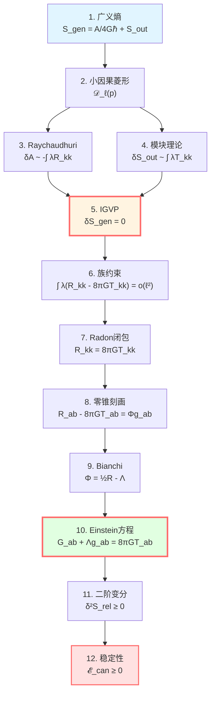
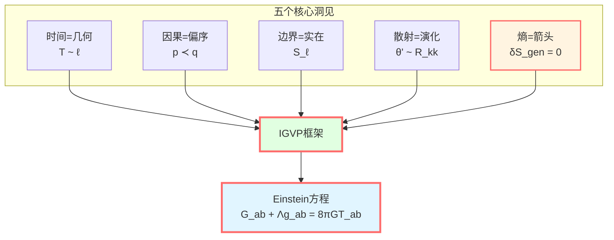
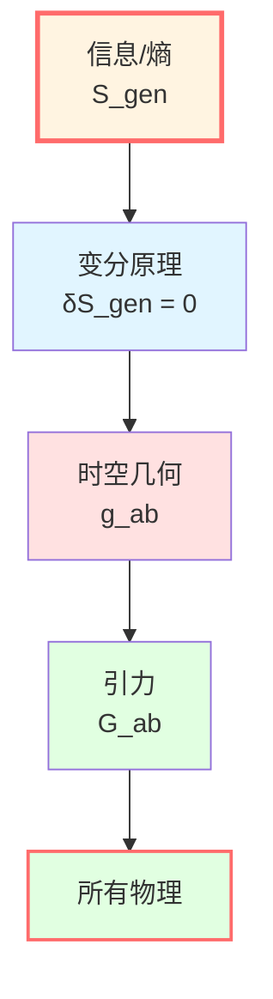

# IGVP总结：从熵到引力的完整画卷

> *"熵是基本的，时空几何是涌现的。Einstein方程不是动力学定律，而是热力学平衡条件。"*

## 🎯 我们的旅程

在这一章中，我们完成了GLS理论最辉煌的成就之一：

$$\boxed{\text{信息几何变分原理（IGVP）} \quad \Rightarrow \quad \text{Einstein场方程 + 稳定性}}$$

让我们回顾这段精彩的旅程。

## 📜 完整推导回顾

### 第1步：定义广义熵

在小因果菱形 $\mathcal{D}_\ell(p)$ 的腰面 $S_\ell$ 上：

$$S_{\text{gen}} = \underbrace{\frac{A(S_\ell)}{4G\hbar}}_{\text{几何熵}} + \underbrace{S_{\text{out}}(S_\ell)}_{\text{量子场熵}}$$

**物理意义**：
- $A/(4G\hbar)$：时空几何的自由度（Bekenstein-Hawking）
- $S_{\text{out}}$：物质场的纠缠熵（von Neumann）

**关键洞察**：熵有两个来源——几何和量子！

### 第2步：选择变分舞台

**小因果菱形**：$\mathcal{D}_\ell(p) = J^+(p^-) \cap J^-(p^+)$

- 过去顶点 $p^-$，未来顶点 $p^+$
- 腰面 $S_\ell$：最大空间截面的边界
- 尺度：$\ell \ll L_{\text{curv}}$（局域性）

**为什么小菱形？**
- 局域性：物理定律在每个点附近成立
- 可控性：小极限下误差为 $O(\varepsilon^2)$，$\varepsilon = \ell/L_{\text{curv}}$
- Jacobson的启示：局域因果视界

### 第3步：计算面积变分（Raychaudhuri方程）

$$\theta' = -\frac{1}{d-2}\theta^2 - \sigma^2 - R_{kk}$$

积分并分部积分，得：

$$\frac{\delta A}{4G\hbar} = -\frac{1}{4G\hbar}\int_{\mathcal{H}} \int_0^{\lambda_*} \lambda R_{kk} d\lambda dA + O(\varepsilon^2)$$

**物理意义**：曲率导致光线汇聚，面积随之变化。

### 第4步：计算场熵变分（模块理论）

$$\delta S_{\text{out}} = \frac{\delta \langle K_\chi \rangle}{T} = \frac{2\pi}{\hbar}\int_{\mathcal{H}} \int_0^{\lambda_*} \lambda T_{kk} d\lambda dA + O(\varepsilon^2)$$

**物理意义**：模哈密顿量变分关联应力张量。

### 第5步：IGVP——族约束

在固定体积 $\delta V = 0$ 下，令：

$$\delta S_{\text{gen}} = 0$$

合并两项：

$$\boxed{\int_{\mathcal{H}} \int_0^{\lambda_*} \lambda (R_{kk} - 8\pi G T_{kk}) d\lambda dA = o(\ell^{d-2})}$$

**这就是族约束**：对所有小因果菱形成立！

### 第6步：Radon型闭包（族→点）

**加权光线变换**：

$$\mathcal{L}_\lambda[f](p, \hat{k}) = \int_0^{\lambda_*} \lambda f(\gamma_{p,\hat{k}}(\lambda)) d\lambda$$

**局部可逆性**：

$$\mathcal{L}_\lambda[R_{kk} - 8\pi G T_{kk}] = o(\ell^2) \quad \Rightarrow \quad R_{kk} = 8\pi G T_{kk}$$

**零方向Einstein方程**！

### 第7步：张量化（零锥刻画）

**零锥刻画引理**（$d \ge 3$）：

$$X_{ab} k^a k^b = 0 \quad \forall k \quad \Rightarrow \quad X_{ab} = \Phi g_{ab}$$

对 $X_{ab} = R_{ab} - 8\pi G T_{ab}$：

$$R_{ab} - 8\pi G T_{ab} = \Phi g_{ab}$$

### 第8步：Bianchi恒等式

$$\nabla^a R_{ab} = \frac{1}{2}\nabla_b R, \quad \nabla^a T_{ab} = 0$$

因此：

$$\nabla_b\Phi = \frac{1}{2}\nabla_b R \quad \Rightarrow \quad \Phi - \frac{1}{2}R = \text{常数} := -\Lambda$$

### 第9步：Einstein场方程

$$\boxed{G_{ab} + \Lambda g_{ab} = 8\pi G T_{ab}}$$

**完成！**

### 第10步：二阶变分（稳定性）

$$\delta^2 S_{\text{rel}} \ge 0$$

**JLMS识别**（在适当条件下）：

$$\delta^2 S_{\text{rel}} = \mathcal{E}_{\text{can}}[h, h] \ge 0$$

**结论**：Einstein方程的解是线性稳定的。

## 💡 深刻的物理洞察

### 洞察1：熵是基本的

**传统视角**：
- Einstein方程是基本公理
- 黑洞熵是导出结果

**IGVP视角**：
- 广义熵是基本变分泛函
- Einstein方程是熵极值的结果

$$\text{熵} \quad \xrightarrow{\text{变分}} \quad \text{引力}$$

**哲学意义**：时空几何是**涌现的**，而非基本的！

### 洞察2：引力是热力学现象

Einstein方程可以写成热力学第一定律的形式：

$$\underbrace{\frac{\delta A}{4G\hbar}}_{\text{几何熵变}} = -\underbrace{\frac{\delta Q}{T}}_{\text{热量/温度}}$$

**类比**：

| 热力学 | 引力 |
|--------|------|
| $dS = \delta Q/T$ | $d(A/4G) = \delta Q/T$ |
| 平衡态：$\delta S = 0$ | Einstein方程：$\delta S_{\text{gen}} = 0$ |
| 稳定性：$\delta^2 S < 0$ | 稳定性：$\delta^2 S_{\text{rel}} \ge 0$ |

**Jacobson (1995)**：*"Spacetime thermodynamics"*

### 洞察3：因果结构决定度规

小因果菱形的**因果结构**（过去光锥 ∩ 未来光锥）确定了：
- 腰面的面积 $A$
- 内部的体积 $V$
- 曲率 $R_{ab}$

**因果** → **几何** → **引力**

### 洞察4：局域性的胜利

Einstein方程是**点态方程**，在每个点成立：

$$G_{ab}(x) + \Lambda g_{ab}(x) = 8\pi G T_{ab}(x)$$

IGVP通过**局域变分**（小因果菱形）+ **Radon型闭包**实现了这一点。

**这是真正的局域推导**，不依赖全局结构！

### 洞察5：宇宙学常数的自然涌现

$\Lambda$ 不是事先假设的参数，而是：

$$\Lambda = \frac{1}{2}R - \Phi$$

从变分中**涌现**的积分常数！

**物理意义**：
- 定体积约束的对偶变量
- Lagrange乘子 $\mu = \Lambda/(8\pi GT)$

**深刻问题**：为什么观测到的 $\Lambda$ 如此之小？（宇宙学常数问题）

### 洞察6：两层结构

IGVP有**两个逻辑独立的层次**：

**一阶层**：
- $\delta S_{\text{gen}} = 0$
- 导出Einstein方程
- 这是**必要条件**（极值）

**二阶层**：
- $\delta^2 S_{\text{rel}} \ge 0$
- 保证稳定性
- 这是**充分条件**（稳定极值）

**两者结合**才给出物理可实现的引力解！

## 🌌 与GLS核心洞见的联系

回顾GLS理论的五个核心洞见，IGVP如何体现它们？

### 1. 时间就是几何

**Unruh温度**：

$$T = \frac{\hbar|\kappa_\chi|}{2\pi} = \frac{\hbar}{\pi\ell}$$

连接**热时间**（$1/T$）与**几何尺度**（$\ell$）。

**模块流** $\sigma_t$ 生成时间演化，由几何决定！

### 2. 因果就是偏序

小因果菱形定义了**局域因果序**：

$$p^- \prec q \prec p^+ \quad \Leftrightarrow \quad q \in \mathcal{D}_\ell(p)$$

**广义熵单调性**：

$$p \prec q \quad \Rightarrow \quad S_{\text{gen}}(p) \le S_{\text{gen}}(q)$$

因果箭头 = 时间箭头 = 熵箭头！

### 3. 边界就是实在

**腰面** $S_\ell$ 是变分的主体：

$$S_{\text{gen}} = \frac{A(S_\ell)}{4G\hbar} + S_{\text{out}}(S_\ell)$$

**全息原理**：体域物理由边界数据决定。

### 4. 散射就是演化

**Raychaudhuri方程**描述零测地线束的演化：

$$\theta' = -R_{kk} + \cdots$$

这是**散射**（光线如何偏折）的几何表现！

**Wigner-Smith延迟**在IGVP中体现为权重 $\lambda$。

### 5. 熵就是箭头

**IGVP的核心**：

$$\delta S_{\text{gen}} = 0 \quad \text{且} \quad \delta^2 S_{\text{rel}} \ge 0$$

熵不仅定义时间方向，还**决定引力动力学**！

## 🔬 技术创新总结

IGVP推导的技术突破：

### 1. 显式可交换极限

**主控函数**：

$$\widetilde{M}_{\text{dom}}(\lambda) = \frac{1}{2}C_{\nabla R}\lambda^2 + C_\sigma^2 |\lambda| + \frac{4}{3(d-2)}C_R^2 \lambda_0^3$$

**被控收敛定理**保证可以交换 $\varepsilon \to 0$ 与积分次序。

**意义**：严格控制小极限的收敛性。

### 2. Radon型闭包

**族约束** → **点态方程**：

$$\int \varphi \int \lambda f = o(\ell^2) \quad \forall \varphi \quad \Rightarrow \quad f(p) = 0$$

**工具**：加权光线变换的局部可逆性。

**意义**：不需要全局Radon变换，只需局域数据！

### 3. 零锥刻画 + Bianchi

**从零方向到张量**：

$$R_{kk} = 8\pi G T_{kk} \quad \forall k \quad \xrightarrow{\text{零锥刻画}} \quad R_{ab} - 8\pi G T_{ab} = \Phi g_{ab}$$

**结合Bianchi**：

$$\nabla^a(R_{ab} - 8\pi G T_{ab}) = \frac{1}{2}\nabla_b R$$

**得到** $\Phi = \frac{1}{2}R - \Lambda$。

**意义**：优雅的张量化，无需逐分量验证！

### 4. JLMS等价

$$\delta^2 S_{\text{rel}} = \mathcal{E}_{\text{can}}[h, h]$$

**连接**：
- 量子信息（相对熵）
- 引力稳定性（规范能量）

**意义**：信息与引力的深刻统一！

### 5. null边界处方

**协变相空间**：包含null边界项和角点项。

**辛流无外泄**：$\int_{\partial\Sigma} \iota_n \omega = 0$

**哈密顿量可积**：$\delta H_\chi$ 良定。

**意义**：技术上完备的变分框架。

## 📊 与其他推导方法的比较

| 方法 | 作者 | 优点 | 局限 |
|------|------|------|------|
| **Sakharov (1967)** | 诱导引力 | 开创性 | 非严格，依赖真空涨落 |
| **Jacobson (1995)** | 局域视界热力学 | 简洁，物理直观 | 形式推导，未严格控制极限 |
| **Padmanabhan (2010)** | 全息熵 | 边界视角 | 依赖视界存在 |
| **Verlinde (2011)** | 涌现引力 | 统计力学类比 | 非局域，争议大 |
| **Hollands-Wald (2013)** | 规范能量 | 稳定性严格 | 未推导场方程 |
| **JLMS (2016)** | 相对熵=规范能量 | 量子信息深刻 | 局限于特定设置 |
| **GLS/IGVP** | **本框架** | **局域+严格+完整** | **技术复杂** |

**GLS/IGVP的优势**：

1. **完全局域**：不需要全局视界或渐近结构
2. **数学严格**：显式误差控制，可交换极限
3. **推导完整**：一阶（场方程）+ 二阶（稳定性）
4. **适用广泛**：不限于真空、球对称或渐近平直

## 🚀 未来方向

### 1. 推广到高阶引力

**Wald熵**：

$$S_{\text{Wald}} = -2\pi \int_{S_\ell} \frac{\partial \mathcal{L}}{\partial R_{abcd}} \epsilon_{ab} \epsilon_{cd} \sqrt{h} d^{d-2}x$$

IGVP框架可以直接推广，导出**Lovelock方程**！

### 2. 量子修正

**一圈修正**：

$$S_{\text{gen}} = \frac{A}{4G\hbar} + S_{\text{out}} + \hbar S_{\text{1-loop}}$$

能否从量子修正的IGVP推导**量子引力有效作用量**？

### 3. 时间依赖背景

**动态时空**：目前推导在准静态假设下。

能否推广到**完全动态演化**？

### 4. 拓扑效应

**非平凡拓扑**：虫洞、多重连通空间。

IGVP如何处理**拓扑改变**？

### 5. 全息对偶

**AdS/CFT**：JLMS等价是全息对偶的体现。

能否从IGVP**推导**全息原理？

## 🎓 学习建议

### 快速路径（理解核心思想）

阅读：
1. 00-igvp-overview.md（概览）
2. 01-generalized-entropy.md（广义熵）
3. 04-first-order-variation.md（一阶变分）
4. 06-igvp-summary.md（本文）

**收获**：理解"熵→Einstein"的逻辑链。

### 扎实路径（掌握推导细节）

按顺序阅读全部6篇，完成练习题。

**收获**：能够独立推导Einstein方程。

### 研究路径（深入技术细节）

1. 阅读本章全部内容
2. 阅读原始论文：igvp-einstein-complete.md
3. 推导所有公式
4. 思考推广方向

**收获**：研究级理解，能够推广IGVP框架。

## 📝 核心公式速查表

| 步骤 | 公式 | 名称 |
|------|------|------|
| 广义熵 | $S_{\text{gen}} = A/(4G\hbar) + S_{\text{out}}$ | 基本泛函 |
| Raychaudhuri | $\theta' = -\theta^2/(d-2) - \sigma^2 - R_{kk}$ | 面积演化 |
| 面积变分 | $\delta A = -\int \lambda R_{kk} d\lambda dA$ | 几何贡献 |
| 场熵变分 | $\delta S_{\text{out}} = (2\pi/\hbar)\int \lambda T_{kk} d\lambda dA$ | 量子贡献 |
| 族约束 | $\int \lambda (R_{kk} - 8\pi G T_{kk}) = o(\ell^2)$ | IGVP一阶 |
| 零方向 | $R_{kk} = 8\pi G T_{kk}$ | 局部逆 |
| 张量化 | $X_{ab} k^a k^b = 0 \Rightarrow X_{ab} = \Phi g_{ab}$ | 零锥刻画 |
| Einstein | $G_{ab} + \Lambda g_{ab} = 8\pi G T_{ab}$ | **场方程** |
| 稳定性 | $\delta^2 S_{\text{rel}} = \mathcal{E}_{\text{can}} \ge 0$ | IGVP二阶 |

## 🎉 结语

我们完成了一段史诗般的旅程：

**从抽象的熵概念** → **到具体的Einstein方程**

这不仅是数学推导，更是物理哲学的革命：

> **引力不是基本的，而是熵极值的几何表现。**

**IGVP向我们展示**：
- 时空几何是涌现的
- 引力是热力学现象
- 因果、时间、熵三位一体
- 信息是宇宙的本源

**下一步**：
- 探索**统一时间篇**（05-unified-time）：时间刻度同一式的详细推导
- 深入**边界理论篇**（06-boundary-theory）：非交换几何与谱三元组
- 最终理解**QCA宇宙篇**（09-qca-universe）：范畴论终对象

**IGVP是GLS理论的核心，但不是全部。**

**真正的统一，还在前方等待！**

---

## 🔗 相关阅读

- GLS完整论文：igvp-einstein-complete.md
- 数学工具篇：[03-mathematical-tools/00-tools-overview.md](../03-mathematical-tools/00-tools-overview.md)
- 核心思想篇：[02-core-ideas/06-unity-of-five.md](../02-core-ideas/06-unity-of-five.md)
- 下一章：[05-unified-time/00-time-overview.md](../05-unified-time/00-time-overview.md) - 统一时间篇

