# IGVP Summary: Complete Picture from Entropy to Gravity

> *"Entropy is fundamental, spacetime geometry is emergent. Einstein's equations are not dynamical laws, but thermodynamic equilibrium conditions."*

## 🎯 Our Journey

In this chapter, we completed one of the most brilliant achievements of GLS theory:

$$\boxed{\text{Information-Geometric Variational Principle (IGVP)} \quad \Rightarrow \quad \text{Einstein Field Equations + Stability}}$$

Let's review this wonderful journey.

## 📜 Complete Derivation Review

### Step 1: Define Generalized Entropy

On the waist $S_\ell$ of small causal diamond $\mathcal{D}_\ell(p)$:

$$S_{\text{gen}} = \underbrace{\frac{A(S_\ell)}{4G\hbar}}_{\text{Geometric Entropy}} + \underbrace{S_{\text{out}}(S_\ell)}_{\text{Quantum Field Entropy}}$$

**Physical meaning**:
- $A/(4G\hbar)$: degrees of freedom of spacetime geometry (Bekenstein-Hawking)
- $S_{\text{out}}$: entanglement entropy of matter fields (von Neumann)

**Key insight**: Entropy has two sources—geometry and quantum!

### Step 2: Choose Variation Stage

**Small causal diamond**: $\mathcal{D}_\ell(p) = J^+(p^-) \cap J^-(p^+)$

- Past vertex $p^-$, future vertex $p^+$
- Waist $S_\ell$: boundary of maximum spatial cross-section
- Scale: $\ell \ll L_{\text{curv}}$ (locality)

**Why small diamond?**
- Locality: physical laws hold near each point
- Controllability: error is $O(\varepsilon^2)$ in small limit, $\varepsilon = \ell/L_{\text{curv}}$
- Jacobson's inspiration: local causal horizon

### Step 3: Calculate Area Variation (Raychaudhuri Equation)

$$\theta' = -\frac{1}{d-2}\theta^2 - \sigma^2 - R_{kk}$$

Integrating and integrating by parts:

$$\frac{\delta A}{4G\hbar} = -\frac{1}{4G\hbar}\int_{\mathcal{H}} \int_0^{\lambda_*} \lambda R_{kk} d\lambda dA + O(\varepsilon^2)$$

**Physical meaning**: Curvature causes light rays to converge, area changes accordingly.

### Step 4: Calculate Field Entropy Variation (Modular Theory)

$$\delta S_{\text{out}} = \frac{\delta \langle K_\chi \rangle}{T} = \frac{2\pi}{\hbar}\int_{\mathcal{H}} \int_0^{\lambda_*} \lambda T_{kk} d\lambda dA + O(\varepsilon^2)$$

**Physical meaning**: Modular Hamiltonian variation relates to stress tensor.

### Step 5: IGVP—Family Constraint

With fixed volume $\delta V = 0$, set:

$$\delta S_{\text{gen}} = 0$$

Combining the two terms:

$$\boxed{\int_{\mathcal{H}} \int_0^{\lambda_*} \lambda (R_{kk} - 8\pi G T_{kk}) d\lambda dA = o(\ell^{d-2})}$$

**This is the family constraint**: holds for all small causal diamonds!

### Step 6: Radon-Type Closure (Family → Point)

**Weighted ray transform**:

$$\mathcal{L}_\lambda[f](p, \hat{k}) = \int_0^{\lambda_*} \lambda f(\gamma_{p,\hat{k}}(\lambda)) d\lambda$$

**Local invertibility**:

$$\mathcal{L}_\lambda[R_{kk} - 8\pi G T_{kk}] = o(\ell^2) \quad \Rightarrow \quad R_{kk} = 8\pi G T_{kk}$$

**Null-direction Einstein equation**!

### Step 7: Tensorization (Null Cone Characterization)

**Null cone characterization lemma** ($d \ge 3$):

$$X_{ab} k^a k^b = 0 \quad \forall k \quad \Rightarrow \quad X_{ab} = \Phi g_{ab}$$

For $X_{ab} = R_{ab} - 8\pi G T_{ab}$:

$$R_{ab} - 8\pi G T_{ab} = \Phi g_{ab}$$

### Step 8: Bianchi Identity

$$\nabla^a R_{ab} = \frac{1}{2}\nabla_b R, \quad \nabla^a T_{ab} = 0$$

Therefore:

$$\nabla_b\Phi = \frac{1}{2}\nabla_b R \quad \Rightarrow \quad \Phi - \frac{1}{2}R = \text{constant} := -\Lambda$$

### Step 9: Einstein Field Equations

$$\boxed{G_{ab} + \Lambda g_{ab} = 8\pi G T_{ab}}$$

**Complete!**

### Step 10: Second-Order Variation (Stability)

$$\delta^2 S_{\text{rel}} \ge 0$$

**JLMS identification** (under appropriate conditions):

$$\delta^2 S_{\text{rel}} = \mathcal{E}_{\text{can}}[h, h] \ge 0$$

**Conclusion**: Solutions of Einstein's equations are linearly stable.

```mermaid
graph TB
    S1["Step 1: Generalized Entropy<br/>S_gen = A/4Gℏ + S_out"] --> S2["Step 2: Small Causal Diamond<br/>𝒟_ℓ(p)"]

    S2 --> S3["Step 3: Raychaudhuri<br/>δA ~ -∫ λR_kk"]
    S2 --> S4["Step 4: Modular Theory<br/>δS_out ~ ∫ λT_kk"]

    S3 --> S5["Step 5: IGVP<br/>δS_gen = 0"]
    S4 --> S5

    S5 --> S6["Step 6: Family Constraint<br/>∫ λ(R_kk - 8πGT_kk) = o(ℓ²)"]

    S6 --> S7["Step 7: Radon Closure<br/>R_kk = 8πGT_kk"]

    S7 --> S8["Step 8: Null Cone Characterization<br/>R_ab - 8πGT_ab = Φg_ab"]

    S8 --> S9["Step 9: Bianchi<br/>Φ = ½R - Λ"]

    S9 --> S10["Step 10: Einstein Equations<br/>G_ab + Λg_ab = 8πGT_ab"]

    S10 --> S11["Step 11: Second-Order Variation<br/>δ²S_rel ≥ 0"]

    S11 --> S12["Step 12: Stability<br/>𝓔_can ≥ 0"]

    style S1 fill:#e1f5ff
    style S5 fill:#fff4e1,stroke:#ff6b6b,stroke-width:3px
    style S10 fill:#e1ffe1,stroke:#ff6b6b,stroke-width:3px
    style S12 fill:#ffe1e1,stroke:#ff6b6b,stroke-width:2px
```

## 💡 Profound Physical Insights

### Insight 1: Entropy is Fundamental

**Traditional perspective**:
- Einstein equations are fundamental axioms
- Black hole entropy is derived result

**IGVP perspective**:
- Generalized entropy is fundamental variational functional
- Einstein equations are result of entropy extremum

$$\text{Entropy} \quad \xrightarrow{\text{Variation}} \quad \text{Gravity}$$

**Philosophical meaning**: Spacetime geometry is **emergent**, not fundamental!

### Insight 2: Gravity is a Thermodynamic Phenomenon

Einstein equations can be written in the form of first law of thermodynamics:

$$\underbrace{\frac{\delta A}{4G\hbar}}_{\text{Geometric Entropy Change}} = -\underbrace{\frac{\delta Q}{T}}_{\text{Heat/Temperature}}$$

**Analogy**:

| Thermodynamics | Gravity |
|--------|------|
| $dS = \delta Q/T$ | $d(A/4G) = \delta Q/T$ |
| Equilibrium: $\delta S = 0$ | Einstein equations: $\delta S_{\text{gen}} = 0$ |
| Stability: $\delta^2 S < 0$ | Stability: $\delta^2 S_{\text{rel}} \ge 0$ |

**Jacobson (1995)**: *"Spacetime thermodynamics"*

### Insight 3: Causal Structure Determines Metric

The **causal structure** of small causal diamond (past light cone ∩ future light cone) determines:
- Area $A$ of waist
- Volume $V$ inside
- Curvature $R_{ab}$

**Causality** → **Geometry** → **Gravity**

### Insight 4: Victory of Locality

Einstein equations are **pointwise equations**, holding at each point:

$$G_{ab}(x) + \Lambda g_{ab}(x) = 8\pi G T_{ab}(x)$$

IGVP achieves this through **local variation** (small causal diamond) + **Radon-type closure**.

**This is true local derivation**, not depending on global structure!

### Insight 5: Natural Emergence of Cosmological Constant

$\Lambda$ is not an assumed parameter, but:

$$\Lambda = \frac{1}{2}R - \Phi$$

An integration constant that **emerges** from variation!

**Physical meaning**:
- Dual variable of fixed volume constraint
- Lagrange multiplier $\mu = \Lambda/(8\pi GT)$

**Profound question**: Why is the observed $\Lambda$ so small? (Cosmological constant problem)

### Insight 6: Two-Layer Structure

IGVP has **two logically independent layers**:

**First layer**:
- $\delta S_{\text{gen}} = 0$
- Derives Einstein equations
- This is **necessary condition** (extremum)

**Second layer**:
- $\delta^2 S_{\text{rel}} \ge 0$
- Guarantees stability
- This is **sufficient condition** (stable extremum)

**Both combined** give physically realizable gravitational solutions!

## 🌌 Connection to GLS Core Insights

Reviewing the five core insights of GLS theory, how does IGVP embody them?

### 1. Time is Geometry

**Unruh temperature**:

$$T = \frac{\hbar|\kappa_\chi|}{2\pi} = \frac{\hbar}{\pi\ell}$$

Connects **thermal time** ($1/T$) with **geometric scale** ($\ell$).

**Modular flow** $\sigma_t$ generates time evolution, determined by geometry!

### 2. Causality is Partial Order

Small causal diamond defines **local causal order**:

$$p^- \prec q \prec p^+ \quad \Leftrightarrow \quad q \in \mathcal{D}_\ell(p)$$

**Generalized entropy monotonicity**:

$$p \prec q \quad \Rightarrow \quad S_{\text{gen}}(p) \le S_{\text{gen}}(q)$$

Causal arrow = time arrow = entropy arrow!

### 3. Boundary is Reality

**Waist** $S_\ell$ is the subject of variation:

$$S_{\text{gen}} = \frac{A(S_\ell)}{4G\hbar} + S_{\text{out}}(S_\ell)$$

**Holographic principle**: Bulk physics determined by boundary data.

### 4. Scattering is Evolution

**Raychaudhuri equation** describes evolution of null geodesic bundle:

$$\theta' = -R_{kk} + \cdots$$

This is the geometric manifestation of **scattering** (how light rays deflect)!

**Wigner-Smith delay** manifests in IGVP as weight $\lambda$.

### 5. Entropy is the Arrow

**Core of IGVP**:

$$\delta S_{\text{gen}} = 0 \quad \text{and} \quad \delta^2 S_{\text{rel}} \ge 0$$

Entropy not only defines time direction, but also **determines gravitational dynamics**!

```mermaid
graph TB
    subgraph "Five Core Insights"
        I1["Time=Geometry<br/>T ~ ℓ"]
        I2["Causality=Partial Order<br/>p ≺ q"]
        I3["Boundary=Reality<br/>S_ℓ"]
        I4["Scattering=Evolution<br/>θ' ~ R_kk"]
        I5["Entropy=Arrow<br/>δS_gen = 0"]
    end

    I1 --> IGVP["IGVP Framework"]
    I2 --> IGVP
    I3 --> IGVP
    I4 --> IGVP
    I5 --> IGVP

    IGVP --> E["Einstein Equations<br/>G_ab + Λg_ab = 8πGT_ab"]

    style I5 fill:#fff4e1,stroke:#ff6b6b,stroke-width:2px
    style IGVP fill:#e1ffe1,stroke:#ff6b6b,stroke-width:3px
    style E fill:#e1f5ff,stroke:#ff6b6b,stroke-width:3px
```

## 🔬 Technical Innovation Summary

Technical breakthroughs in IGVP derivation:

### 1. Explicit Exchangeable Limit

**Dominating function**:

$$\widetilde{M}_{\text{dom}}(\lambda) = \frac{1}{2}C_{\nabla R}\lambda^2 + C_\sigma^2 |\lambda| + \frac{4}{3(d-2)}C_R^2 \lambda_0^3$$

**Dominated convergence theorem** guarantees exchange of $\varepsilon \to 0$ with integral order.

**Meaning**: Strictly controls convergence of small limit.

### 2. Radon-Type Closure

**Family constraint** → **Pointwise equation**:

$$\int \varphi \int \lambda f = o(\ell^2) \quad \forall \varphi \quad \Rightarrow \quad f(p) = 0$$

**Tool**: Local invertibility of weighted ray transform.

**Meaning**: No need for global Radon transform, only local data!

### 3. Null Cone Characterization + Bianchi

**From null direction to tensor**:

$$R_{kk} = 8\pi G T_{kk} \quad \forall k \quad \xrightarrow{\text{Null Cone Characterization}} \quad R_{ab} - 8\pi G T_{ab} = \Phi g_{ab}$$

**Combining Bianchi**:

$$\nabla^a(R_{ab} - 8\pi G T_{ab}) = \frac{1}{2}\nabla_b R$$

**Obtain** $\Phi = \frac{1}{2}R - \Lambda$.

**Meaning**: Elegant tensorization, no need for component-by-component verification!

### 4. JLMS Equivalence

$$\delta^2 S_{\text{rel}} = \mathcal{E}_{\text{can}}[h, h]$$

**Connects**:
- Quantum information (relative entropy)
- Gravitational stability (canonical energy)

**Meaning**: Profound unification of information and gravity!

### 5. Null Boundary Prescription

**Covariant phase space**: Includes null boundary terms and corner terms.

**No outward symplectic flux**: $\int_{\partial\Sigma} \iota_n \omega = 0$

**Hamiltonian integrable**: $\delta H_\chi$ well-defined.

**Meaning**: Technically complete variational framework.

## 📊 Comparison with Other Derivation Methods

| Method | Author | Advantages | Limitations |
|------|------|------|------|
| **Sakharov (1967)** | Induced gravity | Pioneering | Not rigorous, depends on vacuum fluctuations |
| **Jacobson (1995)** | Local horizon thermodynamics | Concise, physically intuitive | Formal derivation, no strict limit control |
| **Padmanabhan (2010)** | Holographic entropy | Boundary perspective | Depends on horizon existence |
| **Verlinde (2011)** | Emergent gravity | Statistical mechanics analogy | Non-local, controversial |
| **Hollands-Wald (2013)** | Canonical energy | Strict stability | Did not derive field equations |
| **JLMS (2016)** | Relative entropy = canonical energy | Profound quantum information | Limited to specific settings |
| **GLS/IGVP** | **This framework** | **Local + rigorous + complete** | **Technically complex** |

**Advantages of GLS/IGVP**:

1. **Completely local**: No need for global horizon or asymptotic structure
2. **Mathematically rigorous**: Explicit error control, exchangeable limits
3. **Complete derivation**: First order (field equations) + second order (stability)
4. **Widely applicable**: Not limited to vacuum, spherical symmetry, or asymptotically flat

## 🚀 Future Directions

### 1. Generalization to Higher-Order Gravity

**Wald entropy**:

$$S_{\text{Wald}} = -2\pi \int_{S_\ell} \frac{\partial \mathcal{L}}{\partial R_{abcd}} \epsilon_{ab} \epsilon_{cd} \sqrt{h} d^{d-2}x$$

IGVP framework can be directly generalized to derive **Lovelock equations**!

### 2. Quantum Corrections

**One-loop correction**:

$$S_{\text{gen}} = \frac{A}{4G\hbar} + S_{\text{out}} + \hbar S_{\text{1-loop}}$$

Can we derive **quantum gravity effective action** from quantum-corrected IGVP?

### 3. Time-Dependent Backgrounds

**Dynamic spacetime**: Current derivation under quasi-static assumption.

Can we generalize to **fully dynamic evolution**?

### 4. Topological Effects

**Non-trivial topology**: Wormholes, multiply connected spaces.

How does IGVP handle **topology change**?

### 5. Holographic Duality

**AdS/CFT**: JLMS equivalence is manifestation of holographic duality.

Can we **derive** holographic principle from IGVP?

## 🎓 Learning Recommendations

### Quick Path (Understand Core Ideas)

Read:
1. 00-igvp-overview_en.md (Overview)
2. 01-generalized-entropy_en.md (Generalized entropy)
3. 04-first-order-variation_en.md (First-order variation)
4. 06-igvp-summary_en.md (This article)

**Gain**: Understand the logic chain "Entropy → Einstein".

### Solid Path (Master Derivation Details)

Read all 6 parts in order, complete exercises.

**Gain**: Able to independently derive Einstein equations.

### Research Path (Deep Technical Details)

1. Read all chapter content
2. Read original paper: igvp-einstein-complete.md
3. Derive all formulas
4. Think about generalization directions

**Gain**: Research-level understanding, able to generalize IGVP framework.

## 📝 Core Formulas Quick Reference

| Step | Formula | Name |
|------|------|------|
| Generalized entropy | $S_{\text{gen}} = A/(4G\hbar) + S_{\text{out}}$ | Fundamental functional |
| Raychaudhuri | $\theta' = -\theta^2/(d-2) - \sigma^2 - R_{kk}$ | Area evolution |
| Area variation | $\delta A = -\int \lambda R_{kk} d\lambda dA$ | Geometric contribution |
| Field entropy variation | $\delta S_{\text{out}} = (2\pi/\hbar)\int \lambda T_{kk} d\lambda dA$ | Quantum contribution |
| Family constraint | $\int \lambda (R_{kk} - 8\pi G T_{kk}) = o(\ell^2)$ | IGVP first order |
| Null direction | $R_{kk} = 8\pi G T_{kk}$ | Local inverse |
| Tensorization | $X_{ab} k^a k^b = 0 \Rightarrow X_{ab} = \Phi g_{ab}$ | Null cone characterization |
| Einstein | $G_{ab} + \Lambda g_{ab} = 8\pi G T_{ab}$ | **Field equations** |
| Stability | $\delta^2 S_{\text{rel}} = \mathcal{E}_{\text{can}} \ge 0$ | IGVP second order |

## 🎉 Conclusion

We completed an epic journey:

**From abstract concept of entropy** → **to concrete Einstein equations**

This is not just mathematical derivation, but a revolution in physical philosophy:

> **Gravity is not fundamental, but a geometric manifestation of entropy extremum.**

**IGVP shows us**:
- Spacetime geometry is emergent
- Gravity is a thermodynamic phenomenon
- Causality, time, and entropy are unified
- Information is the origin of the universe

```mermaid
graph TB
    INFO["Information/Entropy<br/>S_gen"] --> VAR["Variational Principle<br/>δS_gen = 0"]
    VAR --> GEOM["Spacetime Geometry<br/>g_ab"]
    GEOM --> GRAV["Gravity<br/>G_ab"]
    GRAV --> PHYS["All Physics"]

    style INFO fill:#fff4e1,stroke:#ff6b6b,stroke-width:3px
    style VAR fill:#e1f5ff
    style GEOM fill:#ffe1e1
    style GRAV fill:#e1ffe1
    style PHYS fill:#e1ffe1,stroke:#ff6b6b,stroke-width:2px
```

**Next steps**:
- Explore **Unified Time Chapter** (05-unified-time): Detailed derivation of unified time scale identity
- Deep dive into **Boundary Theory Chapter** (06-boundary-theory): Noncommutative geometry and spectral triples
- Finally understand **QCA Universe Chapter** (09-qca-universe): Category theory terminal objects

**IGVP is the core of GLS theory, but not all of it.**

**True unification still awaits ahead!**

---

## 🔗 Related Reading

- GLS complete paper: igvp-einstein-complete.md
- Mathematical Tools Chapter: [03-mathematical-tools/00-tools-overview_en.md](../03-mathematical-tools/00-tools-overview_en.md)
- Core Ideas Chapter: [02-core-ideas/06-unity-of-five_en.md](../02-core-ideas/06-unity-of-five_en.md)
- Next Chapter: [05-unified-time/00-time-overview_en.md](../05-unified-time/00-time-overview_en.md) - Unified Time Chapter

