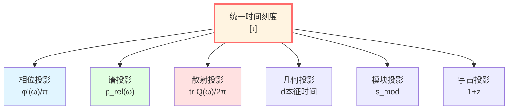
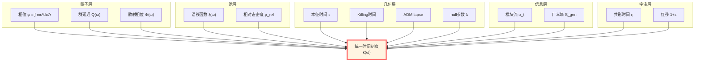
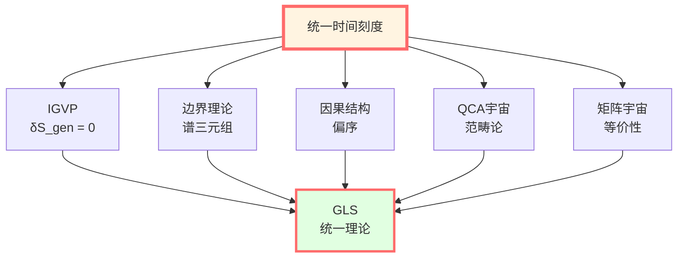

# 统一时间篇：时间的本质

> *"时间可能不是单一的实体，也不是互不相关的碎片——GLS理论提出，各种时间概念可能是同一数学对象的不同投影。"*

## 🎯 本章目标

在物理学中，"时间"以多种面貌出现：

- **相对论**：本征时间 $\tau$，Killing时间，共形时间
- **量子力学**：相位 $\phi = -Et/\hbar$，演化算符 $U(t)$
- **散射理论**：Wigner-Smith群延迟 $Q(\omega)$
- **宇宙学**：宇宙时间 $t$，红移 $z$
- **信息理论**：模块时间（Tomita-Takesaki）

**这些"时间"是不同的吗？**

**GLS理论的视角**：**它们可以被视为同一"统一时间刻度"在不同物理情境下的投影。**



## 🌟 核心公式：时间刻度同一式

$$\boxed{\kappa(\omega) = \frac{\varphi'(\omega)}{\pi} = \rho_{\text{rel}}(\omega) = \frac{1}{2\pi}\text{tr}\,Q(\omega)}$$

**这个等式表明**：
1. **相位导数** $\varphi'(\omega)/\pi$（量子）
2. **相对态密度** $\rho_{\text{rel}}(\omega)$（谱理论）
3. **群延迟迹** $\text{tr}\,Q(\omega)/(2\pi)$（散射）
4. **归一化刻度** $\kappa(\omega)$（几何）

**在数学结构上表现出深刻的统一性。**

## 🗺️ 本章路线图

### 第1站：相位与本征时间

**命题**：对质量为 $m$ 的粒子，沿世界线的相位可表示为：

$$\phi = \frac{mc^2}{\hbar}\int d\tau$$

**物理意义**：相位可视作本征时间的"量子计数器"。

### 第2站：散射相位与群延迟

**Wigner-Smith矩阵**：

$$Q(\omega) = -iS(\omega)^\dagger \frac{\partial S(\omega)}{\partial \omega}$$

**迹**：

$$\text{tr}\,Q(\omega) = \frac{\partial \Phi(\omega)}{\partial \omega}$$

其中 $\Phi = \arg\det S$ 是总散射相位。

**物理意义**：群延迟测量波包在散射过程中的时间滞后。

### 第3站：谱移函数

**Birman-Kreĭn公式**：

$$\det S(\omega) = e^{-2\pi i \xi(\omega)}$$

**相对态密度**：

$$\rho_{\text{rel}}(\omega) = -\frac{d\xi}{d\omega}$$

**物理意义**：谱移函数反映了相互作用引起的能级移动。

### 第4站：时间刻度同一式（⭐核心）

**证明思路**：

从Birman-Kreĭn公式：

$$\Phi(\omega) = \arg\det S = -2\pi\xi(\omega)$$

求导：

$$\frac{d\Phi}{d\omega} = -2\pi\frac{d\xi}{d\omega} = 2\pi\rho_{\text{rel}}(\omega)$$

又因为：

$$\text{tr}\,Q = \frac{d\Phi}{d\omega}$$

所以：

$$\frac{1}{2\pi}\text{tr}\,Q = \rho_{\text{rel}}$$

**建立了同一关系。**

### 第5站：几何时间

在弯曲时空中，存在多种"时间"定义：

| 时间类型 | 定义 | 适用场景 |
|---------|------|---------|
| **Killing时间** | $\partial/\partial t$ 是Killing向量 | 静态时空 |
| **ADM lapse** | $N$ in $ds^2 = -N^2dt^2 + \cdots$ | $(3+1)$分解 |
| **null仿射参数** | $k^a \nabla_a k^b = 0$ | 零测地线 |
| **共形时间** | $d\eta = dt/a(t)$ | FRW宇宙 |

**关键**：它们都可以被归入统一刻度的等价类中。

### 第6站：模块时间

**Tomita-Takesaki理论**：

对态 $\omega$ 和代数 $\mathcal{A}$，定义模块流：

$$\sigma_t(A) = \Delta^{it} A \Delta^{-it}$$

**Connes-Rovelli热时间假设**：模块流参数 $t$ 可能对应于物理时间。

**与几何时间的关系**：在适当条件下，模块时间被证明与Killing时间仿射等价。

### 第7站：宇宙学红移

$$1 + z = \frac{a(t_0)}{a(t_e)} = \frac{(d\phi/dt)_e}{(d\phi/dt)_0}$$

**物理意义**：红移可解释为宇宙尺度因子演化对"相位节奏"的剪切效应。

### 第8站：时间作为广义熵最优路径

**核心思想**：时间演化可被建模为系统在广义熵景观中选择的最优路径。

$$\delta S_{\text{gen}} = 0$$

**物理意义**：时间的"选择"使得因果历史的广义熵取驻值。

### 第9站：时间-几何-相互作用的统一

**核心公式**：总联络尝试统一所有的"力"

$$\Omega = \omega_{\text{LC}} \oplus A_{\text{YM}} \oplus \Gamma_{\text{res}}$$

**物理意义**：引力、规范力、分辨率力可能都是统一时间几何在不同方向的投影。

### 第10站：拓扑不变量与时间

**时间的拓扑"DNA"**：

1. 时间刻度母尺 $\kappa(\omega)$
2. $\mathbb{Z}_2$ holonomy $\nu_{\sqrt{S}}(\gamma)$
3. 相对拓扑类 $[K] \in H^2(Y,\partial Y;\mathbb{Z}_2)$

**物理意义**：费米子统计可能源自时间结构的拓扑不变量。

### 第11站：边界语言统一框架

**边界三公理**：

- A1: 守恒与通量（银行对账单）
- A2: 时间生成（旋转门）
- A3: 单调与一致性（热力学第二定律）

**物理意义**：时间动力学在边界上得到体现。

### 第12站：时间域与可解模型

**刻度同一式的三大定义域**：

1. 弹性-酉域：标准散射理论
2. 非酉-吸收域：开放系统
3. 长程势域：引力与宇宙学

**窗口化时钟**：$\Theta_\Delta(\omega) = (\rho_{\text{rel}} * P_\Delta)(\omega)$ 用于解决负延迟问题。

## 📊 统一时间刻度的物理图景



## 🎨 比喻：立方体的投影

想象一个**四维立方体**（tesseract）：

```
        * ---- *
       /|     /|
      * ---- * |
      | * ---|-*
      |/     |/
      * ---- *
```

从不同角度看，得到不同的**三维投影**：
- 从"相位方向"看 → 相位时间 $\phi$
- 从"谱方向"看 → 态密度 $\rho_{\text{rel}}$
- 从"散射方向"看 → 群延迟 $Q$
- 从"几何方向"看 → 本征时间 $\tau$

**它们可被理解为同一个高维对象（统一时间刻度）的不同投影。**

## 🔑 三条公理

GLS理论基于三条关于时间的公理假设：

### 公理I：因果排序

假设存在严格递增的时间函数，使基本方程为局域（双曲）形式。

$$p \prec q \quad \Longleftrightarrow \quad \tau(p) < \tau(q)$$

### 公理II：幺正演化

假设存在强连续幺正群 $U(t) = e^{-iHt}$，相位-时间关系由驻相近似决定。

$$\phi = \int \frac{mc^2}{\hbar} d\tau$$

### 公理III：熵的单调/极值

广义熵 $S_{\text{gen}}$ 沿时间演化满足单调性和极值条件。

$$\frac{dS_{\text{gen}}}{d\lambda} \ge 0, \quad \delta S_{\text{gen}} = 0$$

**定理**（互相蕴含）：

在半经典-全息窗口内：

$$\text{公理I + II} \quad \Leftrightarrow \quad \text{时间刻度同一式} \quad \Rightarrow \quad \text{公理III} \quad \Rightarrow \quad \text{Einstein方程}$$

## 📐 数学结构

### 等价类定义

**定义**（统一时间刻度等价类）：

$$[\tau] \sim \{\tau, t, t_K, N, \lambda_{\text{null}}, u, v, \eta, \omega^{-1}, z, s_{\text{mod}}\}$$

其成员通过**单调重标**互相转换，旨在使动力学局域化、因果有序，并使熵结构最简。

### 仿射变换

在等价类内，不同时间通过**仿射变换**相关联：

$$t_1 = \alpha t_2 + \beta$$

其中 $\alpha > 0$（保持时间箭头）。

**例子**：
- Killing时间 $\leftrightarrow$ 本征时间：$\tau = \sqrt{-g_{tt}} \cdot t$
- ADM时间 $\leftrightarrow$ 本征时间：$\tau = N \cdot t$
- 共形时间 $\leftrightarrow$ 宇宙时间：$\eta = \int dt/a(t)$

## 🌊 核心洞见：时间与几何的统一

**传统观点**：
- 时间是外在参数
- 几何是动力学
- 两者独立

**GLS观点**：
- 时间被视为几何的内禀结构
- $\phi = (mc^2/\hbar)\int d\tau$
- **时间、相位与几何具有等价性**

$$\boxed{\text{时间} \equiv \text{相位} \equiv \text{本征时间} \equiv \text{统一刻度}}$$

## 🎓 本章内容概览

### 核心文章（必读）

1. **01-phase-and-proper-time.md** - 相位与本征时间
   - 论证 $\phi = (mc^2/\hbar)\int d\tau$
   - 世界线路径积分

2. **04-time-scale-identity.md** - 时间刻度同一式（⭐⭐⭐）
   - 完整推导同一式
   - Birman-Kreĭn公式
   - 四者统一的证明

3. **08-time-summary.md** - 统一时间总结
   - 完整图景回顾

### 深入文章（推荐）

4. **02-scattering-phase.md** - 散射相位与群延迟
   - Wigner-Smith矩阵
   - 时间延迟的操作定义

5. **03-spectral-shift.md** - 谱移函数
   - Birman-Kreĭn定理
   - 相对态密度

6. **05-geometric-times.md** - 几何时间
   - Killing, ADM, null, 共形
   - 四种时间的统一

7. **06-modular-time.md** - 模块时间
   - Tomita-Takesaki理论
   - 热时间假设

8. **07-cosmological-redshift.md** - 宇宙学红移
   - 红移即相位剪切
   - FRW宇宙的时间结构

## 🚀 学习路径

### 快速路径（理解核心思想）

阅读：00-time-overview（本文）→ 01-phase-and-proper-time → 04-time-scale-identity → 08-time-summary

**收获**：理解"时间即几何"的核心思想。

### 扎实路径（掌握推导）

按顺序阅读全部文章，完成练习题。

**收获**：能够推导时间刻度同一式。

### 研究路径（深入技术）

阅读本章 + 原始论文：unified-time-scale-geometry.md

**收获**：研究级理解，能够应用到新问题。

## 📝 关键术语中英对照

| 中文 | 英文 | 含义 |
|-----|------|------|
| 统一时间刻度 | Unified Time Scale | 等价类 $[\tau]$ |
| 时间刻度同一式 | Time Scale Identity | $\kappa = \varphi'/\pi = \rho_{\text{rel}} = \text{tr}\,Q/(2\pi)$ |
| 相位 | Phase | $\phi = -S/\hbar$ |
| 本征时间 | Proper Time | $d\tau = \sqrt{-g_{\mu\nu}dx^\mu dx^\nu}$ |
| 群延迟 | Group Delay | Wigner-Smith矩阵 $Q$ |
| 谱移函数 | Spectral Shift Function | Birman-Kreĭn $\xi(\omega)$ |
| 相对态密度 | Relative Density of States | $\rho_{\text{rel}} = -\xi'$ |
| 模块时间 | Modular Time | Tomita-Takesaki $\sigma_t$ |
| 共形时间 | Conformal Time | FRW $d\eta = dt/a$ |

## 🤔 预习问题

在开始学习前，思考这些问题：

1. **概念问题**：
   - 什么是"时间"？有绝对时间吗？
   - 量子力学中的"时间"与相对论中的一样吗？
   - 散射理论中的"延迟"是什么意思？

2. **数学问题**：
   - 什么是相位？相位与频率有什么关系？
   - 什么是谱？谱移是什么意思？
   - 什么是酉矩阵？为什么 $S(\omega)$ 是酉的？

3. **物理问题**：
   - 为什么黑洞附近时间变慢？
   - 宇宙学红移的物理原因是什么？
   - 量子纠缠与时间有关系吗？

**这些问题的答案，都在统一时间刻度中！**

## 🌟 为什么这一章重要？

统一时间篇是GLS理论的**心脏**：

1. **连接量子与几何**：$\phi = (mc^2/\hbar)\int d\tau$
2. **统一所有时间概念**：时间刻度同一式
3. **为IGVP提供基础**：时间是熵演化的参数
4. **揭示时间的本质**：时间即几何，几何即相位

**统一时间刻度是GLS理论的基石。**



---

**准备好了吗？让我们开始探索时间的本质！**

**下一篇**：[01-phase-and-proper-time.md](01-phase-and-proper-time.md) - 相位与本征时间的等价

