# Unified Time Chapter: The Nature of Time

> *"Time is not one, and time is not many—time is different projections of the same object."*

## 🎯 Chapter Goals

In physics, "time" appears in many forms:

- **Relativity**: Proper time $\tau$, Killing time, conformal time
- **Quantum mechanics**: Phase $\phi = -Et/\hbar$, evolution operator $U(t)$
- **Scattering theory**: Wigner-Smith group delay $Q(\omega)$
- **Cosmology**: Cosmic time $t$, redshift $z$
- **Information theory**: Modular time (Tomita-Takesaki)

**Are these "times" different?**

**GLS theory's answer**: **No! They are different projections of the same "unified time scale"!**



```mermaid
graph TB
    UT["Unified Time Scale<br/>[τ]"] --> P["Phase Projection<br/>φ'(ω)/π"]
    UT --> R["Spectral Projection<br/>ρ_rel(ω)"]
    UT --> Q["Scattering Projection<br/>tr Q(ω)/2π"]
    UT --> G["Geometric Projection<br/>d Proper Time"]
    UT --> M["Modular Projection<br/>s_mod"]
    UT --> C["Cosmic Projection<br/>1+z"]

    style UT fill:#fff4e1,stroke:#ff6b6b,stroke-width:3px
    style P fill:#e1f5ff
    style R fill:#e1ffe1
    style Q fill:#ffe1e1
```

## 🌟 Core Formula: Time Scale Identity

$$\boxed{\kappa(\omega) = \frac{\varphi'(\omega)}{\pi} = \rho_{\text{rel}}(\omega) = \frac{1}{2\pi}\text{tr}\,Q(\omega)}$$

**This equality says**:
1. **Phase derivative** $\varphi'(\omega)/\pi$ (quantum)
2. **Relative density of states** $\rho_{\text{rel}}(\omega)$ (spectral theory)
3. **Group delay trace** $\text{tr}\,Q(\omega)/(2\pi)$ (scattering)
4. **Normalized scale** $\kappa(\omega)$ (geometry)

**Are the same thing!**

## 🗺️ Chapter Roadmap

### Station 1: Phase and Proper Time

**Proposition**: For a particle of mass $m$, phase along worldline equals:

$$\phi = \frac{mc^2}{\hbar}\int d\tau$$

**Physical meaning**: Phase is a "quantum counter" of proper time!

### Station 2: Scattering Phase and Group Delay

**Wigner-Smith matrix**:

$$Q(\omega) = -iS(\omega)^\dagger \frac{\partial S(\omega)}{\partial \omega}$$

**Trace**:

$$\text{tr}\,Q(\omega) = \frac{\partial \Phi(\omega)}{\partial \omega}$$

Where $\Phi = \arg\det S$ is the total scattering phase.

**Physical meaning**: Group delay measures time delay of wave packet in scattering!

### Station 3: Spectral Shift Function

**Birman-Kreĭn formula**:

$$\det S(\omega) = e^{-2\pi i \xi(\omega)}$$

**Relative density of states**:

$$\rho_{\text{rel}}(\omega) = -\frac{d\xi}{d\omega}$$

**Physical meaning**: Spectral shift function measures energy level shifts caused by interaction!

### Station 4: Time Scale Identity (⭐ Core)

**Proof**:

From Birman-Kreĭn formula:

$$\Phi(\omega) = \arg\det S = -2\pi\xi(\omega)$$

Differentiating:

$$\frac{d\Phi}{d\omega} = -2\pi\frac{d\xi}{d\omega} = 2\pi\rho_{\text{rel}}(\omega)$$

Also because:

$$\text{tr}\,Q = \frac{d\Phi}{d\omega}$$

Therefore:

$$\frac{1}{2\pi}\text{tr}\,Q = \rho_{\text{rel}}$$

**Identity holds!**

### Station 5: Geometric Times

In curved spacetime, there are various "times":

| Time Type | Definition | Applicable Scenario |
|---------|------|---------|
| **Killing time** | $\partial/\partial t$ is Killing vector | Static spacetime |
| **ADM lapse** | $N$ in $ds^2 = -N^2dt^2 + \cdots$ | $(3+1)$ decomposition |
| **Null affine parameter** | $k^a \nabla_a k^b = 0$ | Null geodesics |
| **Conformal time** | $d\eta = dt/a(t)$ | FRW universe |

**Key**: They are all in the equivalence class of unified scale!

### Station 6: Modular Time

**Tomita-Takesaki theory**:

For state $\omega$ and algebra $\mathcal{A}$, define modular flow:

$$\sigma_t(A) = \Delta^{it} A \Delta^{-it}$$

**Connes-Rovelli thermal time hypothesis**: Modular flow parameter $t$ is physical time!

**Relationship with geometric time**: Under appropriate conditions, modular time is affinely equivalent to Killing time.

### Station 7: Cosmological Redshift

$$1 + z = \frac{a(t_0)}{a(t_e)} = \frac{(d\phi/dt)_e}{(d\phi/dt)_0}$$

**Physical meaning**: Redshift is the shear of cosmic scale factor evolution on "phase rhythm"!

## 📊 Physical Picture of Unified Time Scale

```mermaid
graph TB
    subgraph "Quantum Layer"
        P["Phase φ = ∫ mc²dτ/ℏ"]
        Q["Group Delay Q(ω)"]
        S["Scattering Phase Φ(ω)"]
    end

    subgraph "Spectral Layer"
        X["Spectral Shift Function ξ(ω)"]
        R["Relative Density of States ρ_rel"]
    end

    subgraph "Geometric Layer"
        T["Proper Time τ"]
        K["Killing Time"]
        N["ADM Lapse"]
        L["Null Parameter λ"]
    end

    subgraph "Information Layer"
        M["Modular Flow σ_t"]
        E["Generalized Entropy S_gen"]
    end

    subgraph "Cosmic Layer"
        C["Conformal Time η"]
        Z["Redshift 1+z"]
    end

    P --> UT["Unified Time Scale<br/>κ(ω)"]
    Q --> UT
    S --> UT
    X --> UT
    R --> UT
    T --> UT
    K --> UT
    N --> UT
    L --> UT
    M --> UT
    E --> UT
    C --> UT
    Z --> UT

    style UT fill:#fff4e1,stroke:#ff6b6b,stroke-width:4px
```



## 🎨 Analogy: Projections of a Cube

Imagine a **four-dimensional cube** (tesseract):

```
        * ---- *
       /|     /|
      * ---- * |
      | * ---|-*
      |/     |/
      * ---- *
```

Viewed from different angles, we get different **three-dimensional projections**:
- From "phase direction" → phase time $\phi$
- From "spectral direction" → density of states $\rho_{\text{rel}}$
- From "scattering direction" → group delay $Q$
- From "geometric direction" → proper time $\tau$

**They are all different projections of the same high-dimensional object (unified time scale)!**

## 🔑 Three Axioms

GLS theory is based on three axioms about time:

### Axiom I: Causal Ordering

There exists a strictly increasing time function such that fundamental equations are in local (hyperbolic) form.

$$p \prec q \quad \Longleftrightarrow \quad \tau(p) < \tau(q)$$

### Axiom II: Unitary Evolution

There exists a strongly continuous unitary group $U(t) = e^{-iHt}$, phase-time relationship determined by stationary phase.

$$\phi = \int \frac{mc^2}{\hbar} d\tau$$

### Axiom III: Entropy Monotonicity/Extremum

Generalized entropy $S_{\text{gen}}$ satisfies monotonicity and extremum conditions along time evolution.

$$\frac{dS_{\text{gen}}}{d\lambda} \ge 0, \quad \delta S_{\text{gen}} = 0$$

**Theorem** (mutually imply):

In the semiclassical-holographic window:

$$\text{Axiom I + II} \quad \Leftrightarrow \quad \text{Time Scale Identity} \quad \Rightarrow \quad \text{Axiom III} \quad \Rightarrow \quad \text{Einstein Equations}$$

## 📐 Mathematical Structure

### Equivalence Class Definition

**Definition** (Unified Time Scale Equivalence Class):

$$[\tau] \sim \{\tau, t, t_K, N, \lambda_{\text{null}}, u, v, \eta, \omega^{-1}, z, s_{\text{mod}}\}$$

Members are converted to each other through **monotonic rescaling**, making dynamics local, causally ordered, and entropy structure simplest.

### Affine Transformations

Within the equivalence class, different times are related through **affine transformations**:

$$t_1 = \alpha t_2 + \beta$$

Where $\alpha > 0$ (preserves time arrow).

**Examples**:
- Killing time $\leftrightarrow$ proper time: $\tau = \sqrt{-g_{tt}} \cdot t$
- ADM time $\leftrightarrow$ proper time: $\tau = N \cdot t$
- Conformal time $\leftrightarrow$ cosmic time: $\eta = \int dt/a(t)$

## 🌊 Core Insight: Time is Geometry

**Traditional view**:
- Time is external parameter
- Geometry is dynamics
- The two are independent

**GLS view**:
- Time is intrinsic structure of geometry
- $\phi = (mc^2/\hbar)\int d\tau$
- **Time = Phase = Geometry**

$$\boxed{\text{Time} \equiv \text{Phase} \equiv \text{Proper Time} \equiv \text{Unified Scale}}$$

## 🎓 Chapter Content Overview

### Core Articles (Required Reading)

1. **01-phase-and-proper-time_en.md** - Phase and Proper Time
   - Proof that $\phi = (mc^2/\hbar)\int d\tau$
   - Worldline path integral

2. **04-time-scale-identity_en.md** - Time Scale Identity (⭐⭐⭐)
   - Complete derivation of identity
   - Birman-Kreĭn formula
   - Proof of unification of four

3. **08-time-summary_en.md** - Unified Time Summary
   - Complete picture review

### In-Depth Articles (Recommended)

4. **02-scattering-phase_en.md** - Scattering Phase and Group Delay
   - Wigner-Smith matrix
   - Operational definition of time delay

5. **03-spectral-shift_en.md** - Spectral Shift Function
   - Birman-Kreĭn theorem
   - Relative density of states

6. **05-geometric-times_en.md** - Geometric Times
   - Killing, ADM, null, conformal
   - Unification of four times

7. **06-modular-time_en.md** - Modular Time
   - Tomita-Takesaki theory
   - Thermal time hypothesis

8. **07-cosmological-redshift_en.md** - Cosmological Redshift
   - Redshift as phase shear
   - Time structure of FRW universe

## 🚀 Learning Paths

### Quick Path (Understand Core Ideas)

Read: 00-time-overview_en (this article) → 01-phase-and-proper-time_en → 04-time-scale-identity_en → 08-time-summary_en

**Gain**: Understand core idea "time is geometry".

### Solid Path (Master Derivation)

Read all articles in order, complete exercises.

**Gain**: Able to derive time scale identity.

### Research Path (Deep Technical)

Read this chapter + original paper: unified-time-scale-geometry.md

**Gain**: Research-level understanding, able to apply to new problems.

## 📝 Key Terminology: Chinese-English

| Chinese | English | Meaning |
|-----|------|------|
| 统一时间刻度 | Unified Time Scale | Equivalence class $[\tau]$ |
| 时间刻度同一式 | Time Scale Identity | $\kappa = \varphi'/\pi = \rho_{\text{rel}} = \text{tr}\,Q/(2\pi)$ |
| 相位 | Phase | $\phi = -S/\hbar$ |
| 本征时间 | Proper Time | $d\tau = \sqrt{-g_{\mu\nu}dx^\mu dx^\nu}$ |
| 群延迟 | Group Delay | Wigner-Smith matrix $Q$ |
| 谱移函数 | Spectral Shift Function | Birman-Kreĭn $\xi(\omega)$ |
| 相对态密度 | Relative Density of States | $\rho_{\text{rel}} = -\xi'$ |
| 模块时间 | Modular Time | Tomita-Takesaki $\sigma_t$ |
| 共形时间 | Conformal Time | FRW $d\eta = dt/a$ |

## 🤔 Preview Questions

Before starting to learn, think about these questions:

1. **Conceptual questions**:
   - What is "time"? Is there absolute time?
   - Is "time" in quantum mechanics the same as in relativity?
   - What does "delay" mean in scattering theory?

2. **Mathematical questions**:
   - What is phase? What is the relationship between phase and frequency?
   - What is spectrum? What does spectral shift mean?
   - What is a unitary matrix? Why is $S(\omega)$ unitary?

3. **Physical questions**:
   - Why does time slow down near black holes?
   - What is the physical cause of cosmological redshift?
   - Is there a relationship between quantum entanglement and time?

**Answers to these questions are all in the unified time scale!**

## 🌟 Why Is This Chapter Important?

The Unified Time chapter is the **heart** of GLS theory:

1. **Connects quantum and geometry**: $\phi = (mc^2/\hbar)\int d\tau$
2. **Unifies all time concepts**: Time scale identity
3. **Provides foundation for IGVP**: Time is parameter of entropy evolution
4. **Reveals nature of time**: Time is geometry, geometry is phase

**Without unified time scale, there is no GLS unified theory!**

```mermaid
graph TB
    T["Unified Time Scale"] --> I["IGVP<br/>δS_gen = 0"]
    T --> B["Boundary Theory<br/>Spectral Triples"]
    T --> C["Causal Structure<br/>Partial Order"]
    T --> Q["QCA Universe<br/>Category Theory"]
    T --> M["Matrix Universe<br/>Equivalence"]

    I --> U["GLS<br/>Unified Theory"]
    B --> U
    C --> U
    Q --> U
    M --> U

    style T fill:#fff4e1,stroke:#ff6b6b,stroke-width:4px
    style U fill:#e1ffe1,stroke:#ff6b6b,stroke-width:3px
```



---

**Ready? Let's begin exploring the nature of time!**

**Next**: [01-phase-and-proper-time_en.md](01-phase-and-proper-time_en.md) - Equivalence of Phase and Proper Time

