# Unified Time: The Essence of Time

> *"Time may not be a single entity, nor unrelated fragments—GLS theory proposes that various time concepts might be different projections of the same mathematical object."*

## 🎯 Chapter Goals

In physics, "time" appears in many forms:

- **Relativity**: Proper time $\tau$, Killing time, conformal time
- **Quantum Mechanics**: Phase $\phi = -Et/\hbar$, evolution operator $U(t)$
- **Scattering Theory**: Wigner-Smith group delay $Q(\omega)$
- **Cosmology**: Cosmic time $t$, redshift $z$
- **Information Theory**: Modular time (Tomita-Takesaki)

**Are these "times" different?**

**GLS Theory Perspective**: **They can be viewed as projections of the same "unified time scale" in different physical contexts.**

```mermaid
graph TB
    UT["Unified Time Scale<br/>[τ]"] --> P["Phase Projection<br/>φ'(ω)/π"]
    UT --> R["Spectral Projection<br/>ρ_rel(ω)"]
    UT --> Q["Scattering Projection<br/>tr Q(ω)/2π"]
    UT --> G["Geometric Projection<br/>d Proper Time"]
    UT --> M["Modular Projection<br/>s_mod"]
    UT --> C["Cosmic Projection<br/>1+z"]

    style UT fill:#fff4e1,stroke:#ff6b6b,stroke-width:3px
    style P fill:#e1f5ff
    style R fill:#e1ffe1
    style Q fill:#ffe1e1
```



## 🌟 Core Formula: Time Scale Identity

$$\boxed{\kappa(\omega) = \frac{\varphi'(\omega)}{\pi} = \rho_{\text{rel}}(\omega) = \frac{1}{2\pi}\text{tr}\,Q(\omega)}$$

**This equation indicates**:
1. **Phase derivative** $\varphi'(\omega)/\pi$ (quantum)
2. **Relative density of states** $\rho_{\text{rel}}(\omega)$ (spectral theory)
3. **Group delay trace** $\text{tr}\,Q(\omega)/(2\pi)$ (scattering)
4. **Normalized scale** $\kappa(\omega)$ (geometry)

**Exhibit profound unity in mathematical structure.**

## 🗺️ Chapter Roadmap

### Station 1: Phase and Proper Time

**Proposition**: For a particle of mass $m$, phase along worldline can be expressed as:

$$\phi = \frac{mc^2}{\hbar}\int d\tau$$

**Physical Meaning**: Phase can be viewed as the "quantum counter" of proper time.

### Station 2: Scattering Phase and Group Delay

**Wigner-Smith Matrix**:

$$Q(\omega) = -iS(\omega)^\dagger \frac{\partial S(\omega)}{\partial \omega}$$

**Trace**:

$$\text{tr}\,Q(\omega) = \frac{\partial \Phi(\omega)}{\partial \omega}$$

where $\Phi = \arg\det S$ is the total scattering phase.

**Physical Meaning**: Group delay measures time delay of wave packet in scattering process.

### Station 3: Spectral Shift Function

**Birman-Kreĭn Formula**:

$$\det S(\omega) = e^{-2\pi i \xi(\omega)}$$

**Relative Density of States**:

$$\rho_{\text{rel}}(\omega) = -\frac{d\xi}{d\omega}$$

**Physical Meaning**: Spectral shift function reflects energy level shifts caused by interactions.

### Station 4: Time Scale Identity (⭐ Core)

**Proof Outline**:

From Birman-Kreĭn formula:

$$\Phi(\omega) = \arg\det S = -2\pi\xi(\omega)$$

Taking derivative:

$$\frac{d\Phi}{d\omega} = -2\pi\frac{d\xi}{d\omega} = 2\pi\rho_{\text{rel}}(\omega)$$

Also because:

$$\text{tr}\,Q = \frac{d\Phi}{d\omega}$$

Therefore:

$$\frac{1}{2\pi}\text{tr}\,Q = \rho_{\text{rel}}$$

**Establishes an identity relation.**

### Station 5: Geometric Time

In curved spacetime, there exist various "time" definitions:

| Time Type | Definition | Applicable Scenario |
|---------|------|---------|
| **Killing Time** | $\partial/\partial t$ is Killing vector | Static spacetime |
| **ADM Lapse** | $N$ in $ds^2 = -N^2dt^2 + \cdots$ | $(3+1)$ decomposition |
| **Null Affine Parameter** | $k^a \nabla_a k^b = 0$ | Null geodesics |
| **Conformal Time** | $d\eta = dt/a(t)$ | FRW universe |

**Key**: They can all be classified into the equivalence class of unified scale.

### Station 6: Modular Time

**Tomita-Takesaki Theory**:

For state $\omega$ and algebra $\mathcal{A}$, define modular flow:

$$\sigma_t(A) = \Delta^{it} A \Delta^{-it}$$

**Connes-Rovelli Thermal Time Hypothesis**: Modular flow parameter $t$ might correspond to physical time.

**Relation to Geometric Time**: Under appropriate conditions, modular time is proven to be affinely equivalent to Killing time.

### Station 7: Cosmological Redshift

$$1 + z = \frac{a(t_0)}{a(t_e)} = \frac{(d\phi/dt)_e}{(d\phi/dt)_0}$$

**Physical Meaning**: Redshift can be interpreted as the shear effect of cosmic scale factor evolution on "phase rhythm".

### Station 8: Time as Optimal Path of Generalized Entropy

**Core Idea**: Time evolution can be modeled as the optimal path chosen by system in generalized entropy landscape.

$$\delta S_{\text{gen}} = 0$$

**Physical Meaning**: Time's "choice" makes generalized entropy of causal history stationary.

### Station 9: Unification of Time-Geometry-Interaction

**Core Formula**: Total connection attempts to unify all "forces"

$$\Omega = \omega_{\text{LC}} \oplus A_{\text{YM}} \oplus \Gamma_{\text{res}}$$

**Physical Meaning**: Gravity, gauge forces, resolution forces might all be projections of unified time geometry in different directions.

### Station 10: Topological Invariants and Time

**Topological "DNA" of Time**:

1. Time scale master $\kappa(\omega)$
2. $\mathbb{Z}_2$ holonomy $\nu_{\sqrt{S}}(\gamma)$
3. Relative topological class $[K] \in H^2(Y,\partial Y;\mathbb{Z}_2)$

**Physical Meaning**: Fermion statistics might originate from topological invariants of time structure.

### Station 11: Boundary Language Unified Framework

**Boundary Three Axioms**:

- A1: Conservation and Flux (bank statement)
- A2: Time Generation (revolving door)
- A3: Monotonicity and Consistency (second law of thermodynamics)

**Physical Meaning**: Time dynamics are manifested on the boundary.

### Station 12: Time Domains and Solvable Models

**Three Major Definition Domains of Scale Identity**:

1. Elastic-Unitary Domain: Standard scattering theory
2. Non-Unitary-Absorption Domain: Open systems
3. Long-Range Potential Domain: Gravity and cosmology

**Windowed Clock**: $\Theta_\Delta(\omega) = (\rho_{\text{rel}} * P_\Delta)(\omega)$ is used to solve negative delay problem.

## 📊 Physical Picture of Unified Time Scale

```mermaid
graph TB
    subgraph "Quantum Layer"
        P["Phase φ = ∫ mc²dτ/ℏ"]
        Q["Group Delay Q(ω)"]
        S["Scattering Phase Φ(ω)"]
    end

    subgraph "Spectral Layer"
        X["Spectral Shift Function ξ(ω)"]
        R["Relative Density of States ρ_rel"]
    end

    subgraph "Geometric Layer"
        T["Proper Time τ"]
        K["Killing Time"]
        N["ADM Lapse"]
        L["Null Parameter λ"]
    end

    subgraph "Information Layer"
        M["Modular Flow σ_t"]
        E["Generalized Entropy S_gen"]
    end

    subgraph "Cosmic Layer"
        C["Conformal Time η"]
        Z["Redshift 1+z"]
    end

    P --> UT["Unified Time Scale<br/>κ(ω)"]
    Q --> UT
    S --> UT
    X --> UT
    R --> UT
    T --> UT
    K --> UT
    N --> UT
    L --> UT
    M --> UT
    E --> UT
    C --> UT
    Z --> UT

    style UT fill:#fff4e1,stroke:#ff6b6b,stroke-width:4px
```



## 🎨 Analogy: Projection of a Cube

Imagine a **four-dimensional cube** (tesseract):

```
        * ---- *
       /|     /|
      * ---- * |
      | * ---|-*
      |/     |/
      * ---- *
```

Viewed from different angles, get different **three-dimensional projections**:
- From "phase direction" → Phase time $\phi$
- From "spectral direction" → Density of states $\rho_{\text{rel}}$
- From "scattering direction" → Group delay $Q$
- From "geometric direction" → Proper time $\tau$

**They can be understood as different projections of the same high-dimensional object (unified time scale).**

## 🔑 Three Axioms

GLS theory is based on three axiomatic assumptions about time:

### Axiom I: Causal Ordering

Assume there exists a strictly increasing time function that makes fundamental equations local (hyperbolic) form.

$$p \prec q \quad \Longleftrightarrow \quad \tau(p) < \tau(q)$$

### Axiom II: Unitary Evolution

Assume there exists a strongly continuous unitary group $U(t) = e^{-iHt}$, phase-time relation determined by stationary phase approximation.

$$\phi = \int \frac{mc^2}{\hbar} d\tau$$

### Axiom III: Entropy Monotonicity/Extremum

Generalized entropy $S_{\text{gen}}$ along time evolution satisfies monotonicity and extremum conditions.

$$\frac{dS_{\text{gen}}}{d\lambda} \ge 0, \quad \delta S_{\text{gen}} = 0$$

**Theorem** (mutually imply):

In semiclassical-holographic window:

$$\text{Axiom I + II} \quad \Leftrightarrow \quad \text{Time Scale Identity} \quad \Rightarrow \quad \text{Axiom III} \quad \Rightarrow \quad \text{Einstein Equation}$$

## 📐 Mathematical Structure

### Equivalence Class Definition

**Definition** (Unified Time Scale Equivalence Class):

$$[\tau] \sim \{\tau, t, t_K, N, \lambda_{\text{null}}, u, v, \eta, \omega^{-1}, z, s_{\text{mod}}\}$$

Members are converted to each other through **monotonic rescaling**, aiming to make dynamics local, causally ordered, and entropy structure simplest.

### Affine Transformation

Within equivalence class, different times are related by **affine transformation**:

$$t_1 = \alpha t_2 + \beta$$

where $\alpha > 0$ (preserving time arrow).

**Examples**:
- Killing time $\leftrightarrow$ Proper time: $\tau = \sqrt{-g_{tt}} \cdot t$
- ADM time $\leftrightarrow$ Proper time: $\tau = N \cdot t$
- Conformal time $\leftrightarrow$ Cosmic time: $\eta = \int dt/a(t)$

## 🌊 Core Insight: Unification of Time and Geometry

**Traditional View**:
- Time is external parameter
- Geometry is dynamics
- Two are independent

**GLS View**:
- Time is viewed as intrinsic structure of geometry
- $\phi = (mc^2/\hbar)\int d\tau$
- **Equivalence of Time, Phase, and Geometry**

$$\boxed{\text{Time} \equiv \text{Phase} \equiv \text{Proper Time} \equiv \text{Unified Scale}}$$

## 🎓 Chapter Content Overview

### Core Articles (Required Reading)

1. **01-phase-and-proper-time.md** - Phase and Proper Time
   - Argument for $\phi = (mc^2/\hbar)\int d\tau$
   - Worldline path integral

2. **04-time-scale-identity.md** - Time Scale Identity (⭐⭐⭐)
   - Complete derivation of identity
   - Birman-Kreĭn formula
   - Proof of four-way unification

3. **08-time-summary.md** - Unified Time Summary
   - Complete picture review

### In-Depth Articles (Recommended)

4. **02-scattering-phase.md** - Scattering Phase and Group Delay
   - Wigner-Smith matrix
   - Operational definition of time delay

5. **03-spectral-shift.md** - Spectral Shift Function
   - Birman-Kreĭn theorem
   - Relative density of states

6. **05-geometric-times.md** - Geometric Times
   - Killing, ADM, null, conformal
   - Unification of four times

7. **06-modular-time.md** - Modular Time
   - Tomita-Takesaki theory
   - Thermal time hypothesis

8. **07-cosmological-redshift.md** - Cosmological Redshift
   - Redshift as phase shear
   - Time structure of FRW universe

## 🚀 Learning Paths

### Quick Path (Understand Core Ideas)

Read: 00-time-overview (this article) → 01-phase-and-proper-time → 04-time-scale-identity → 08-time-summary

**Gain**: Understand core idea of "time is geometry".

### Solid Path (Master Derivation)

Read all articles in order, complete exercises.

**Gain**: Able to derive time scale identity.

### Research Path (Deep Technical)

Read this chapter + original paper: unified-time-scale-geometry.md

**Gain**: Research-level understanding, able to apply to new problems.

## 📝 Key Terms Chinese-English Glossary

| Chinese | English | Meaning |
|-----|------|------|
| 统一时间刻度 | Unified Time Scale | Equivalence class $[\tau]$ |
| 时间刻度同一式 | Time Scale Identity | $\kappa = \varphi'/\pi = \rho_{\text{rel}} = \text{tr}\,Q/(2\pi)$ |
| 相位 | Phase | $\phi = -S/\hbar$ |
| 本征时间 | Proper Time | $d\tau = \sqrt{-g_{\mu\nu}dx^\mu dx^\nu}$ |
| 群延迟 | Group Delay | Wigner-Smith matrix $Q$ |
| 谱移函数 | Spectral Shift Function | Birman-Kreĭn $\xi(\omega)$ |
| 相对态密度 | Relative Density of States | $\rho_{\text{rel}} = -\xi'$ |
| 模块时间 | Modular Time | Tomita-Takesaki $\sigma_t$ |
| 共形时间 | Conformal Time | FRW $d\eta = dt/a$ |

## 🤔 Preview Questions

Before starting, think about these questions:

1. **Conceptual Questions**:
   - What is "time"? Is there absolute time?
   - Is "time" in quantum mechanics the same as in relativity?
   - What does "delay" mean in scattering theory?

2. **Mathematical Questions**:
   - What is phase? What is the relationship between phase and frequency?
   - What is spectrum? What does spectral shift mean?
   - What is unitary matrix? Why is $S(\omega)$ unitary?

3. **Physical Questions**:
   - Why does time slow down near black holes?
   - What is the physical cause of cosmological redshift?
   - Is there a relationship between quantum entanglement and time?

**Answers to these questions are all in the unified time scale!**

## 🌟 Why Is This Chapter Important?

Unified Time is the **heart** of GLS theory:

1. **Connects Quantum and Geometry**: $\phi = (mc^2/\hbar)\int d\tau$
2. **Unifies All Time Concepts**: Time scale identity
3. **Provides Foundation for IGVP**: Time is parameter of entropy evolution
4. **Reveals Essence of Time**: Time is geometry, geometry is phase

**Unified time scale is the cornerstone of GLS theory.**


---

**Ready? Let's begin exploring the essence of time!**

**Next Article**: [01-phase-and-proper-time.md](01-phase-and-proper-time.md) - Equivalence of Phase and Proper Time
