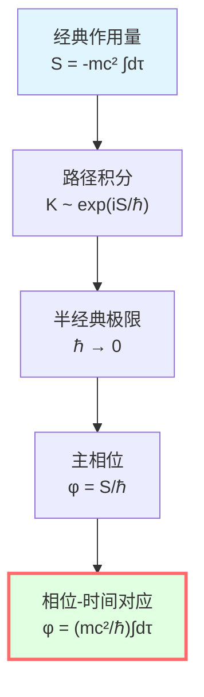
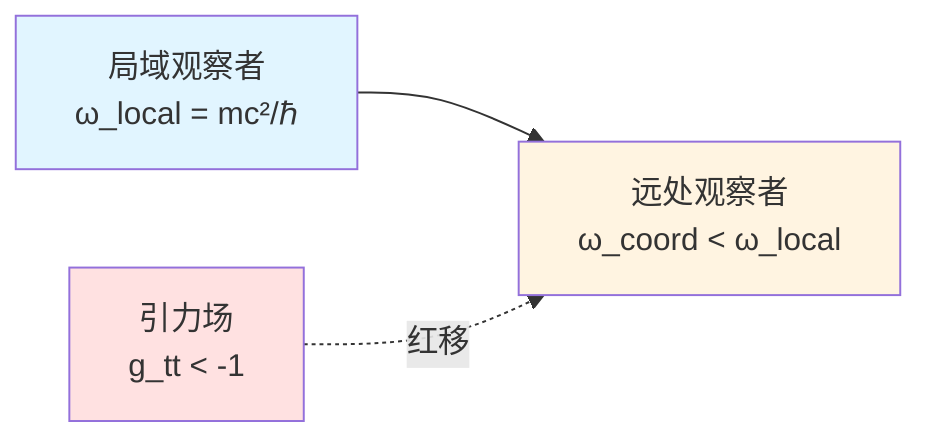
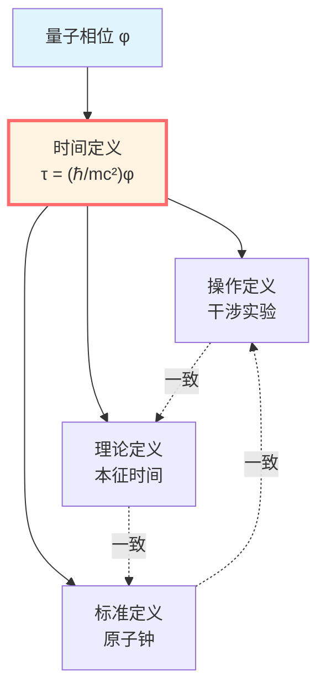

# 相位与本征时间：量子-几何桥梁

> *"相位可视作本征时间的量子计数器。"*

## 🎯 核心命题

**命题**（相位-本征时间对应关系）：

对质量为 $m$ 的粒子沿世界线 $\gamma$ 传播，其量子相位可表示为：

$$\boxed{\phi = \frac{mc^2}{\hbar}\int_\gamma d\tau}$$

其中：
- $\phi$：量子相位
- $m$：静止质量
- $c$：光速
- $\hbar$：约化Planck常数
- $\tau$：沿世界线的本征时间

**物理意义**：
- 左边（$\phi$）：量子相位，纯量子概念
- 右边（$\int d\tau$）：本征时间，纯几何概念
- **关系**：这一等式建立了量子与几何的桥梁。

## 💡 直观图像：波的振荡

### 经典类比：摆钟

想象一个摆钟：

```
    |
   \|/
    O  ← 摆
   / \
```

**摆动周期** $T$ 测量时间。

**振荡次数** $N = t/T$ 计数摆动。

**类比**：
- 本征时间 $\tau$ ↔ 时间 $t$
- 相位 $\phi$ ↔ 振荡次数 $N$
- $\phi = (mc^2/\hbar)\tau$ ↔ $N = t/T$

**物理意义**：相位 $\phi$ 可被理解为粒子内禀"振荡"的计数器。

### 量子波包

考虑自由粒子的波函数：

$$\psi(x, t) = Ae^{i(kx - \omega t)}$$

**相位**：

$$\phi(x, t) = kx - \omega t$$

**平面波频率**：

$$\omega = \frac{E}{\hbar} = \frac{mc^2}{\hbar}\gamma$$

其中 $\gamma = 1/\sqrt{1-v^2/c^2}$ 是Lorentz因子。

**本征时间**：对静止粒子，$d\tau = dt/\gamma$。

**关系**：

$$\phi = -\omega t = -\frac{mc^2}{\hbar}\gamma t = -\frac{mc^2}{\hbar}\tau$$

（负号是约定）

## 📐 路径积分推导

### 经典作用量

在相对论中，粒子沿世界线的**经典作用量**：

$$S[\gamma] = -mc^2 \int_\gamma d\tau = -mc\int_\gamma \sqrt{-g_{\mu\nu}dx^\mu dx^\nu}$$

**为什么是这个形式？**
- 作用量维度：$[S] = \text{能量} \times \text{时间}$
- $mc^2$ 是静止能量
- $\int d\tau$ 是本征时间
- 负号来自度规签名约定

### 量子路径积分

在量子力学中，从点 $A$ 到点 $B$ 的传播幅：

$$K(B, A) = \int \mathcal{D}\gamma \exp\left(\frac{i}{\hbar}S[\gamma]\right)$$

**半经典极限**：$\hbar \to 0$

驻相条件：$\delta S = 0$ → 经典测地线 $\gamma_{\text{cl}}$

**主相位**：

$$\phi = \frac{S[\gamma_{\text{cl}}]}{\hbar} = -\frac{1}{\hbar}\int_{\gamma_{\text{cl}}} mc^2 d\tau$$

**关键**：忽略负号（相位约定），得到：

$$\boxed{\phi = \frac{mc^2}{\hbar}\int d\tau}$$



## 🧮 平直时空的计算

### Minkowski时空

在平直时空 $ds^2 = -c^2dt^2 + dx^2 + dy^2 + dz^2$：

对沿 $x$ 方向运动的粒子：

$$v = \frac{dx}{dt}$$

**本征时间**：

$$d\tau = dt\sqrt{1 - \frac{v^2}{c^2}} = \frac{dt}{\gamma}$$

**相位变化率**：

$$\frac{d\phi}{dt} = \frac{mc^2}{\hbar}\frac{d\tau}{dt} = \frac{mc^2}{\hbar\gamma}$$

**能量关系**：

在相对论中，能量 $E = \gamma mc^2$，频率 $\omega = E/\hbar = \gamma mc^2/\hbar$。

对比：

$$\frac{d\phi}{dt} = \frac{mc^2}{\hbar\gamma} \neq \omega$$

**为什么不同？**

因为 $\phi$ 是沿**世界线**（本征时间）的相位，而 $\omega t$ 是沿**坐标时间**的相位。

**正确关系**：

$$\frac{d\phi}{d\tau} = \frac{mc^2}{\hbar} = \text{常数}$$

这才是Lorentz不变量。

### 静止粒子

对静止粒子（$v = 0$，$\gamma = 1$）：

$$\tau = t$$

$$\phi = \frac{mc^2}{\hbar}t$$

$$\omega = \frac{E}{\hbar} = \frac{mc^2}{\hbar}$$

**这是Compton频率**！

$$\omega_C = \frac{mc^2}{\hbar} \approx 10^{20} \text{ Hz (电子)}$$

**物理意义**：即使静止，粒子也以Compton频率"振荡"。

## 🌀 弯曲时空

### Schwarzschild时空

在Schwarzschild度规：

$$ds^2 = -\left(1 - \frac{2M}{r}\right)c^2dt^2 + \left(1 - \frac{2M}{r}\right)^{-1}dr^2 + r^2d\Omega^2$$

对径向自由落体的粒子：

$$d\tau = \sqrt{-g_{\mu\nu}\frac{dx^\mu}{ds}\frac{dx^\nu}{ds}}ds$$

**相位**：

$$\phi = \frac{mc^2}{\hbar}\int d\tau$$

**引力红移**：

在 $r = r_0$ 静止的观察者，本征时间 $d\tau = \sqrt{1 - 2M/r_0} \cdot dt$。

**Compton频率**（局域）：

$$\omega_{\text{local}} = \frac{mc^2}{\hbar}$$

**坐标频率**（远处观察者）：

$$\omega_{\text{coord}} = \sqrt{1 - \frac{2M}{r_0}}\omega_{\text{local}}$$

**红移**：引力使相位演化"变慢"。



### FRW宇宙

在膨胀宇宙 $ds^2 = -dt^2 + a(t)^2d\mathbf{x}^2$：

对共动观察者（$d\mathbf{x} = 0$）：

$$d\tau = dt$$

$$\phi = \frac{mc^2}{\hbar}t$$

**相位频率**：

$$\frac{d\phi}{dt} = \frac{mc^2}{\hbar}$$

**但**：对光子在宇宙中传播，频率会红移！

$$\omega(t) = \frac{\omega_e \cdot a(t_e)}{a(t)}$$

**解释**：光子质量为零（$m = 0$），公式 $\phi = (mc^2/\hbar)\int d\tau$ 不适用。

需要用**零质量粒子**的相位定义（下一篇讲）。

## 🔬 实验验证

### 1. Compton散射

$$\lambda' - \lambda = \frac{h}{mc}(1 - \cos\theta)$$

**Compton波长**：$\lambda_C = h/(mc) = 2\pi\hbar/(mc)$

**Compton频率**：$\omega_C = 2\pi c/\lambda_C = mc^2/\hbar$

**与理论高度一致** $\phi = (mc^2/\hbar)\tau$。

### 2. 中子干涉（COW实验）

在引力场中，上下路径的相位差：

$$\Delta\phi = \frac{m}{\hbar}\int (g \cdot h) dt = \frac{mc^2}{\hbar}\Delta\tau$$

其中 $\Delta\tau$ 是引力导致的本征时间差。

**实验结果**：有力支持了相位-时间关系。

### 3. 原子钟

GPS卫星上的原子钟，相对地面有：
- 引力红移（$g_{tt}$ 不同）
- 运动时间膨胀（速度不同）

**综合效应**：

$$\Delta\phi = \frac{mc^2}{\hbar}\Delta\tau$$

**GPS系统每天修正约38微秒**，完全符合相对论预言。

## 📊 相位作为时间标尺

### 相位是"绝对"的

**关键洞察**：

在量子力学中，相位 $\phi$ 虽然有规范自由度（可加常数），但**相位差** $\Delta\phi$ 是物理可观测量。

**相位-时间关系**：

$$\Delta\phi = \frac{mc^2}{\hbar}\Delta\tau$$

**意义**：
- 左边：量子可观测量（干涉条纹）
- 右边：几何本征时间
- **相位可以作为时间的操作定义。**

### 时间标准

**传统时间标准**：
- 天文时间（地球自转）
- 原子钟（铯原子跃迁）

**量子-几何时间标准**：
- 用相位 $\phi$ 定义时间
- $\tau = (\hbar/mc^2)\phi$

**优点**：
- 普适（所有粒子都适用）
- 量子-几何统一
- Lorentz不变



## 💡 深刻意义

### 量子与几何的统一

**传统观点**：
- 量子：波函数 $\psi$，相位 $\phi$
- 几何：度规 $g_{\mu\nu$，本征时间 $\tau$
- 两者独立

**GLS观点**：
- $\phi = (mc^2/\hbar)\int d\tau$
- **相位与几何在数学结构上具有等价性**
- 量子-几何统一

### 时间的本质

**问题**：什么是时间？

**传统答案**：
- 牛顿：绝对时间
- 爱因斯坦：相对时间（依赖于观察者）
- 量子：外部参数

**GLS答案**：
- 时间可被理解为相位的几何投影
- $\tau = (\hbar/mc^2)\phi$
- **时间与相位本质相关**

### Compton频率的意义

**为什么** Compton频率 $\omega_C = mc^2/\hbar$ 如此基本？

**答案**：它是粒子内禀的"时钟频率"。

$$\frac{d\phi}{d\tau} = \frac{mc^2}{\hbar} = \omega_C$$

**物理意义**：
- 每个粒子都携带一个"内禀钟"
- 频率由质量决定
- **质量决定了内禀时钟频率**

$$m = \frac{\hbar\omega_C}{c^2}$$

**深刻**：$E = mc^2$ 和 $E = \hbar\omega$ 统一了。

## 📝 关键公式总结

| 公式 | 名称 | 意义 |
|-----|------|------|
| $\phi = (mc^2/\hbar)\int d\tau$ | 相位-时间等价 | 核心关系 |
| $S = -mc^2\int d\tau$ | 相对论作用量 | 经典路径积分 |
| $\omega_C = mc^2/\hbar$ | Compton频率 | 内禀时钟 |
| $d\tau = dt/\gamma$ | 时间膨胀 | Minkowski时空 |
| $d\tau = \sqrt{-g_{\mu\nu}dx^\mu dx^\nu}$ | 本征时间 | 弯曲时空 |

## 🎓 深入阅读

- 路径积分：R.P. Feynman, A.R. Hibbs, *Quantum Mechanics and Path Integrals* (1965)
- 相对论作用量：L.D. Landau, E.M. Lifshitz, *The Classical Theory of Fields* (1975)
- COW实验：R. Colella, A.W. Overhauser, S.A. Werner, PRL 34, 1472 (1975)
- GLS理论：unified-time-scale-geometry.md
- 上一篇：[00-time-overview.md](00-time-overview.md) - 统一时间概览
- 下一篇：[02-scattering-phase.md](02-scattering-phase.md) - 散射相位与群延迟

## 🤔 练习题

1. **概念理解**：
   - 为什么相位与本征时间成正比，而不是坐标时间？
   - Compton频率的物理意义是什么？
   - 相位可以作为时间的操作定义吗？

2. **计算练习**：
   - 计算电子的Compton频率 $\omega_C$
   - 对速度 $v = 0.6c$ 的粒子，计算 $d\phi/dt$
   - 在Schwarzschild时空 $r = 3M$ 处，计算引力红移

3. **物理应用**：
   - GPS卫星的时间修正如何用相位-时间关系解释？
   - 中子干涉实验如何验证 $\phi \propto \tau$？
   - 宇宙学红移能否用相位解释？（提示：见第7篇）

4. **进阶思考**：
   - 零质量粒子（光子）的相位如何定义？
   - 相位-时间关系在量子引力中如何推广？
   - 能否用相位定义一个Lorentz不变的"绝对时间"？

---

**下一步**：理解了相位与本征时间的等价后，我们将探索散射理论中的时间——**Wigner-Smith群延迟**！

