# Phase and Proper Time: Quantum-Geometric Bridge

> *"Phase can be viewed as a quantum counter of proper time."*

## 🎯 Core Proposition

**Proposition** (Phase-Proper Time Correspondence):

For a particle of mass $m$ propagating along worldline $\gamma$, its quantum phase can be expressed as:

$$\boxed{\phi = \frac{mc^2}{\hbar}\int_\gamma d\tau}$$

Where:
- $\phi$: quantum phase
- $m$: rest mass
- $c$: speed of light
- $\hbar$: reduced Planck constant
- $\tau$: proper time along worldline

**Physical meaning**:
- Left side ($\phi$): quantum phase, pure quantum concept
- Right side ($\int d\tau$): proper time, pure geometric concept
- **Relationship**: This equation establishes a bridge between quantum and geometry.

## 💡 Intuitive Image: Wave Oscillation

### Classical Analogy: Pendulum Clock

Imagine a pendulum clock:

```
    |
   \|/
    O  ← Pendulum
   / \
```

**Oscillation period** $T$ measures time.

**Number of oscillations** $N = t/T$ counts swings.

**Analogy**:
- Proper time $\tau$ ↔ time $t$
- Phase $\phi$ ↔ number of oscillations $N$
- $\phi = (mc^2/\hbar)\tau$ ↔ $N = t/T$

**Physical meaning**: Phase $\phi$ can be understood as a counter of particle's intrinsic "oscillation".

### Quantum Wave Packet

Consider wave function of free particle:

$$\psi(x, t) = Ae^{i(kx - \omega t)}$$

**Phase**:

$$\phi(x, t) = kx - \omega t$$

**Plane wave frequency**:

$$\omega = \frac{E}{\hbar} = \frac{mc^2}{\hbar}\gamma$$

Where $\gamma = 1/\sqrt{1-v^2/c^2}$ is Lorentz factor.

**Proper time**: For particle at rest, $d\tau = dt/\gamma$.

**Relationship**:

$$\phi = -\omega t = -\frac{mc^2}{\hbar}\gamma t = -\frac{mc^2}{\hbar}\tau$$

(Negative sign is convention)

## 📐 Path Integral Derivation

### Classical Action

In relativity, **classical action** of particle along worldline:

$$S[\gamma] = -mc^2 \int_\gamma d\tau = -mc\int_\gamma \sqrt{-g_{\mu\nu}dx^\mu dx^\nu}$$

**Why this form?**
- Action dimension: $[S] = \text{energy} \times \text{time}$
- $mc^2$ is rest energy
- $\int d\tau$ is proper time
- Negative sign from metric signature convention

### Quantum Path Integral

In quantum mechanics, propagation amplitude from point $A$ to point $B$:

$$K(B, A) = \int \mathcal{D}\gamma \exp\left(\frac{i}{\hbar}S[\gamma]\right)$$

**Semiclassical limit**: $\hbar \to 0$

Stationary phase condition: $\delta S = 0$ → classical geodesic $\gamma_{\text{cl}}$

**Principal phase**:

$$\phi = \frac{S[\gamma_{\text{cl}}]}{\hbar} = -\frac{1}{\hbar}\int_{\gamma_{\text{cl}}} mc^2 d\tau$$

**Key**: Ignoring negative sign (phase convention), we get:

$$\boxed{\phi = \frac{mc^2}{\hbar}\int d\tau}$$

```mermaid
graph TB
    A["Classical Action<br/>S = -mc² ∫dτ"] --> P["Path Integral<br/>K ~ exp(iS/ℏ)"]
    P --> SC["Semiclassical Limit<br/>ℏ → 0"]
    SC --> PH["Principal Phase<br/>φ = S/ℏ"]
    PH --> R["Phase-Time Correspondence<br/>φ = (mc²/ℏ)∫dτ"]

    style A fill:#e1f5ff
    style R fill:#e1ffe1,stroke:#ff6b6b,stroke-width:3px
```



## 🧮 Calculation in Flat Spacetime

### Minkowski Spacetime

In flat spacetime $ds^2 = -c^2dt^2 + dx^2 + dy^2 + dz^2$:

For particle moving along $x$ direction:

$$v = \frac{dx}{dt}$$

**Proper time**:

$$d\tau = dt\sqrt{1 - \frac{v^2}{c^2}} = \frac{dt}{\gamma}$$

**Phase change rate**:

$$\frac{d\phi}{dt} = \frac{mc^2}{\hbar}\frac{d\tau}{dt} = \frac{mc^2}{\hbar\gamma}$$

**Energy relationship**:

In relativity, energy $E = \gamma mc^2$, frequency $\omega = E/\hbar = \gamma mc^2/\hbar$.

Comparison:

$$\frac{d\phi}{dt} = \frac{mc^2}{\hbar\gamma} \neq \omega$$

**Why different?**

Because $\phi$ is phase along **worldline** (proper time), while $\omega t$ is phase along **coordinate time**.

**Correct relationship**:

$$\frac{d\phi}{d\tau} = \frac{mc^2}{\hbar} = \text{constant}$$

This is Lorentz invariant.

### Particle at Rest

For particle at rest ($v = 0$, $\gamma = 1$):

$$\tau = t$$

$$\phi = \frac{mc^2}{\hbar}t$$

$$\omega = \frac{E}{\hbar} = \frac{mc^2}{\hbar}$$

**This is Compton frequency**!

$$\omega_C = \frac{mc^2}{\hbar} \approx 10^{20} \text{ Hz (electron)}$$

**Physical meaning**: Even at rest, particle "oscillates" at Compton frequency.

## 🌀 Curved Spacetime

### Schwarzschild Spacetime

In Schwarzschild metric:

$$ds^2 = -\left(1 - \frac{2M}{r}\right)c^2dt^2 + \left(1 - \frac{2M}{r}\right)^{-1}dr^2 + r^2d\Omega^2$$

For radially free-falling particle:

$$d\tau = \sqrt{-g_{\mu\nu}\frac{dx^\mu}{ds}\frac{dx^\nu}{ds}}ds$$

**Phase**:

$$\phi = \frac{mc^2}{\hbar}\int d\tau$$

**Gravitational redshift**:

For observer at rest at $r = r_0$, proper time $d\tau = \sqrt{1 - 2M/r_0} \cdot dt$.

**Compton frequency** (local):

$$\omega_{\text{local}} = \frac{mc^2}{\hbar}$$

**Coordinate frequency** (distant observer):

$$\omega_{\text{coord}} = \sqrt{1 - \frac{2M}{r_0}}\omega_{\text{local}}$$

**Redshift**: Gravity makes phase evolution "slower".

```mermaid
graph LR
    L["Local Observer<br/>ω_local = mc²/ℏ"] --> R["Distant Observer<br/>ω_coord < ω_local"]

    G["Gravitational Field<br/>g_tt < -1"] -.->|"Redshift"| R

    style G fill:#ffe1e1
    style L fill:#e1f5ff
    style R fill:#fff4e1
```



### FRW Universe

In expanding universe $ds^2 = -dt^2 + a(t)^2d\mathbf{x}^2$:

For comoving observer ($d\mathbf{x} = 0$):

$$d\tau = dt$$

$$\phi = \frac{mc^2}{\hbar}t$$

**Phase frequency**:

$$\frac{d\phi}{dt} = \frac{mc^2}{\hbar}$$

**But**: For photons propagating in universe, frequency redshifts!

$$\omega(t) = \frac{\omega_e \cdot a(t_e)}{a(t)}$$

**Explanation**: Photons have zero mass ($m = 0$), formula $\phi = (mc^2/\hbar)\int d\tau$ does not apply.

Need phase definition for **massless particles** (covered in next article).

## 🔬 Experimental Verification

### 1. Compton Scattering

$$\lambda' - \lambda = \frac{h}{mc}(1 - \cos\theta)$$

**Compton wavelength**: $\lambda_C = h/(mc) = 2\pi\hbar/(mc)$

**Compton frequency**: $\omega_C = 2\pi c/\lambda_C = mc^2/\hbar$

**Highly consistent with** $\phi = (mc^2/\hbar)\tau$.

### 2. Neutron Interference (COW Experiment)

Phase difference between upper and lower paths in gravitational field:

$$\Delta\phi = \frac{m}{\hbar}\int (g \cdot h) dt = \frac{mc^2}{\hbar}\Delta\tau$$

Where $\Delta\tau$ is proper time difference caused by gravity.

**Experimental result**: Strongly supports phase-time relationship.

### 3. Atomic Clocks

Atomic clocks on GPS satellites, relative to ground have:
- Gravitational redshift (different $g_{tt}$)
- Motion time dilation (different velocity)

**Combined effect**:

$$\Delta\phi = \frac{mc^2}{\hbar}\Delta\tau$$

**GPS system corrects about 38 microseconds per day**, completely consistent with relativity prediction.

## 📊 Phase as Time Scale

### Phase is "Absolute"

**Key insight**:

In quantum mechanics, phase $\phi$ has gauge freedom (additive constant), but **phase difference** $\Delta\phi$ is physically observable.

**Phase-time relationship**:

$$\Delta\phi = \frac{mc^2}{\hbar}\Delta\tau$$

**Meaning**:
- Left side: quantum observable (interference fringes)
- Right side: geometric proper time
- **Phase can serve as operational definition of time.**

### Time Standards

**Traditional time standards**:
- Astronomical time (Earth rotation)
- Atomic clocks (cesium atom transitions)

**Quantum-geometric time standard**:
- Define time using phase $\phi$
- $\tau = (\hbar/mc^2)\phi$

**Advantages**:
- Universal (applies to all particles)
- Quantum-geometric unified
- Lorentz invariant

```mermaid
graph TB
    P["Quantum Phase φ"] --> T["Time Definition<br/>τ = (ℏ/mc²)φ"]

    T --> O1["Operational Definition<br/>Interference Experiment"]
    T --> O2["Theoretical Definition<br/>Proper Time"]
    T --> O3["Standard Definition<br/>Atomic Clock"]

    O1 -.->|"Consistent"| O2
    O2 -.->|"Consistent"| O3
    O3 -.->|"Consistent"| O1

    style P fill:#e1f5ff
    style T fill:#fff4e1,stroke:#ff6b6b,stroke-width:3px
```



## 💡 Profound Meaning

### Unification of Quantum and Geometry

**Traditional view**:
- Quantum: wave function $\psi$, phase $\phi$
- Geometry: metric $g_{\mu\nu}$, proper time $\tau$
- The two are independent

**GLS view**:
- $\phi = (mc^2/\hbar)\int d\tau$
- **Phase and geometry are equivalent in mathematical structure**
- Quantum-geometric unification

### Nature of Time

**Question**: What is time?

**Traditional answers**:
- Newton: absolute time
- Einstein: relative time (depends on observer)
- Quantum: external parameter

**GLS answer**:
- Time can be understood as geometric projection of phase
- $\tau = (\hbar/mc^2)\phi$
- **Time is essentially related to phase**

### Meaning of Compton Frequency

**Why** is Compton frequency $\omega_C = mc^2/\hbar$ so fundamental?

**Answer**: It is particle's intrinsic "clock frequency".

$$\frac{d\phi}{d\tau} = \frac{mc^2}{\hbar} = \omega_C$$

**Physical meaning**:
- Each particle carries an "intrinsic clock"
- Frequency determined by mass
- **Mass determines intrinsic clock frequency**

$$m = \frac{\hbar\omega_C}{c^2}$$

**Profound**: $E = mc^2$ and $E = \hbar\omega$ are unified.

## 📝 Key Formulas Summary

| Formula | Name | Meaning |
|-----|------|------|
| $\phi = (mc^2/\hbar)\int d\tau$ | Phase-time equivalence | Core relationship |
| $S = -mc^2\int d\tau$ | Relativistic action | Classical path integral |
| $\omega_C = mc^2/\hbar$ | Compton frequency | Intrinsic clock |
| $d\tau = dt/\gamma$ | Time dilation | Minkowski spacetime |
| $d\tau = \sqrt{-g_{\mu\nu}dx^\mu dx^\nu}$ | Proper time | Curved spacetime |

## 🎓 Further Reading

- Path integrals: R.P. Feynman, A.R. Hibbs, *Quantum Mechanics and Path Integrals* (1965)
- Relativistic action: L.D. Landau, E.M. Lifshitz, *The Classical Theory of Fields* (1975)
- COW experiment: R. Colella, A.W. Overhauser, S.A. Werner, PRL 34, 1472 (1975)
- GLS theory: unified-time-scale-geometry.md
- Previous: [00-time-overview_en.md](00-time-overview_en.md) - Unified Time Overview
- Next: [02-scattering-phase_en.md](02-scattering-phase_en.md) - Scattering Phase and Group Delay

## 🤔 Exercises

1. **Conceptual understanding**:
   - Why is phase proportional to proper time, not coordinate time?
   - What is the physical meaning of Compton frequency?
   - Can phase serve as operational definition of time?

2. **Calculation exercises**:
   - Calculate Compton frequency $\omega_C$ of electron
   - For particle with velocity $v = 0.6c$, calculate $d\phi/dt$
   - In Schwarzschild spacetime at $r = 3M$, calculate gravitational redshift

3. **Physical applications**:
   - How to explain GPS satellite time correction using phase-time relationship?
   - How does neutron interference experiment verify $\phi \propto \tau$?
   - Can cosmological redshift be explained using phase? (Hint: see article 7)

4. **Advanced thinking**:
   - How to define phase for massless particles (photons)?
   - How to generalize phase-time relationship in quantum gravity?
   - Can we define a Lorentz-invariant "absolute time" using phase?

---

**Next step**: After understanding equivalence of phase and proper time, we will explore time in scattering theory—**Wigner-Smith group delay**!

