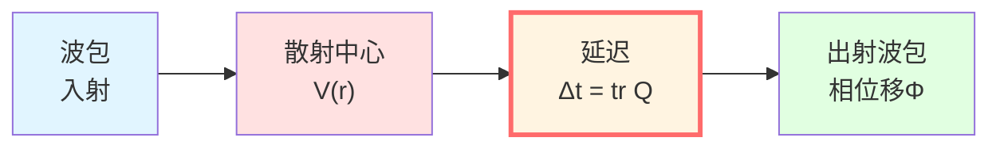
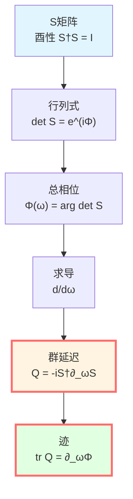
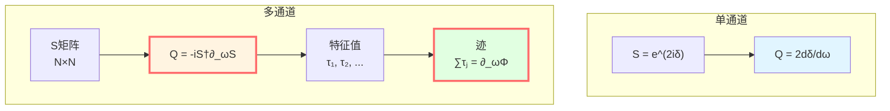
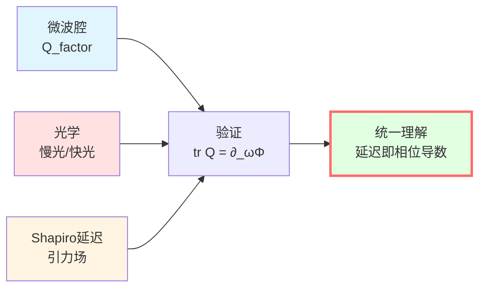
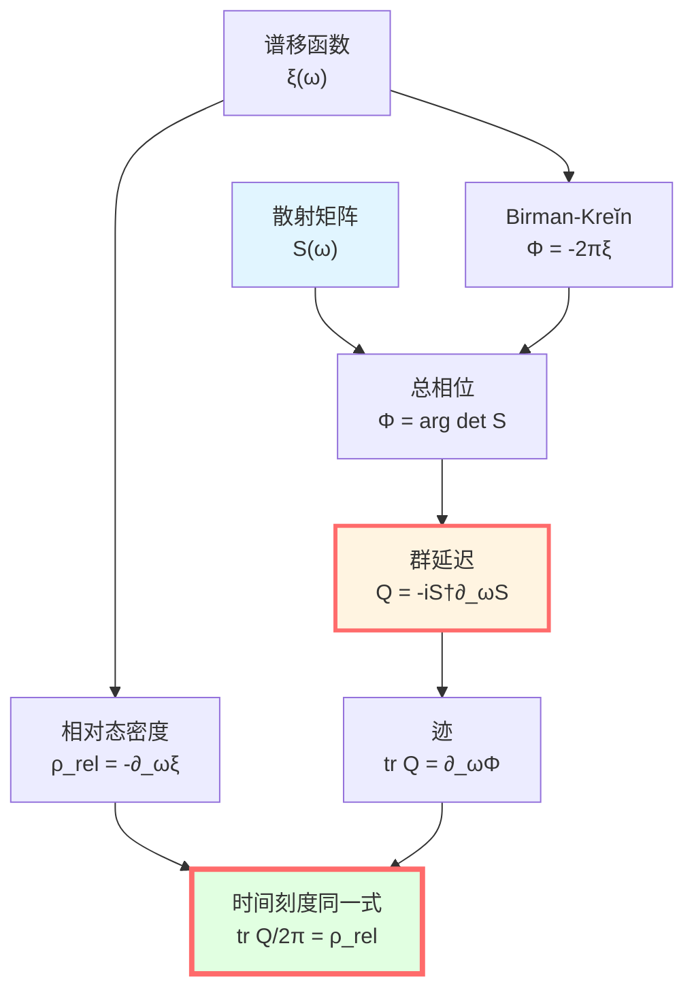

# 散射相位与群延迟：时间的操作定义

> *"群延迟是散射过程对相位时钟的读数。"*

## 🎯 核心命题

**定义**（Wigner-Smith群延迟算子）：

对频率依赖的酉散射矩阵 $S(\omega)$，定义群延迟算子：

$$\boxed{Q(\omega) = -iS(\omega)^\dagger \frac{\partial S(\omega)}{\partial \omega}}$$

**物理意义**：
- $Q(\omega)$ 是自伴矩阵（Hermitian）
- 特征值 $\tau_j(\omega)$ 是各散射通道的时间延迟
- 迹 $\text{tr}\,Q(\omega)$ 是总群延迟
- **关键关系**：

$$\boxed{\text{tr}\,Q(\omega) = \frac{\partial \Phi(\omega)}{\partial \omega}}$$

其中 $\Phi(\omega) = \arg\det S(\omega)$ 是总散射相位。

## 💡 直观图像：回声的延迟

### 比喻：山谷回声

想象你在山谷中呼喊，声音传播的过程：

```
你 --声波--> 山壁 --反射--> 你
   t_out        散射      t_in
```

**时间延迟**：回声比直线传播慢多少？

$$\Delta t = (t_{\text{in}} - t_{\text{out}}) - t_{\text{自由传播}}$$

**散射类比**：
- 自由传播 → 自由粒子（$H_0$）
- 山壁反射 → 散射势（$H = H_0 + V$）
- 时间延迟 → 群延迟 $Q(\omega)$
- 回声音调变化 → 相位移 $\Phi(\omega)$

**物理意义**：群延迟测量"相互作用让波包慢了多久"！

### 波包的故事

考虑一个窄波包入射到散射中心：

$$\psi_{\text{in}}(x, t) = \int A(\omega) e^{i(kx - \omega t)} d\omega$$

**波包中心**的位置：

$$x_{\text{center}}(t) = \frac{\partial \Phi(\omega)}{\partial k}\bigg|_{\omega_0}$$

**波包中心**的到达时间：

$$t_{\text{arrival}} = \frac{\partial \Phi(\omega)}{\partial \omega}\bigg|_{\omega_0} = \text{tr}\,Q(\omega_0)$$



**关键**：群延迟是波包中心的实际时间延迟！

## 📐 数学推导

### 散射算子与S矩阵

在散射理论中，从初态 $|\psi_{\text{in}}\rangle$ 到末态 $|\psi_{\text{out}}\rangle$：

**散射算子**：

$$S = (\Omega^+)^\dagger \Omega^-$$

其中 $\Omega^\pm$ 是Møller波算子：

$$\Omega^\pm = \text{s-}\lim_{t \to \pm\infty} e^{iHt} e^{-iH_0 t}$$

**在能量表象中**：

对每个频率 $\omega$，有通道空间 $\mathcal{H}_\omega \simeq \mathbb{C}^{N(\omega)}$，其上的**酉矩阵** $S(\omega)$：

$$S(\omega): \mathcal{H}_\omega \to \mathcal{H}_\omega, \quad S(\omega)^\dagger S(\omega) = I$$

**为什么酉？**能量守恒！散射前后概率总和不变。

### 总散射相位

由于 $S(\omega)$ 是酉矩阵，可写为：

$$S(\omega) = e^{iK(\omega)}$$

其中 $K(\omega)$ 是自伴矩阵。

**行列式**：

$$\det S(\omega) = e^{i\,\text{tr}\,K(\omega)} = e^{i\Phi(\omega)}$$

**总相位**：

$$\Phi(\omega) = \arg\det S(\omega) = \text{tr}\,K(\omega)$$

**物理意义**：所有通道相位移的总和！

### Wigner-Smith算子推导

**问题**：相位对频率的导数是什么？

从 $\det S(\omega) = e^{i\Phi(\omega)}$ 两边求导：

$$\frac{d}{d\omega}\det S = ie^{i\Phi}\frac{d\Phi}{d\omega}$$

**左边**：利用矩阵行列式求导公式：

$$\frac{d}{d\omega}\det S = \det S \cdot \text{tr}\left(S^{-1}\frac{dS}{d\omega}\right)$$

由 $S$ 酉，$S^{-1} = S^\dagger$：

$$= \det S \cdot \text{tr}\left(S^\dagger\frac{\partial S}{\partial \omega}\right)$$

**合并**：

$$\det S \cdot \text{tr}\left(S^\dagger\frac{\partial S}{\partial \omega}\right) = ie^{i\Phi}\frac{d\Phi}{d\omega}$$

消去 $\det S = e^{i\Phi}$：

$$\text{tr}\left(S^\dagger\frac{\partial S}{\partial \omega}\right) = i\frac{d\Phi}{d\omega}$$

**定义群延迟算子**：

$$\boxed{Q(\omega) := -iS^\dagger\frac{\partial S}{\partial \omega}}$$

**得到**：

$$\boxed{\text{tr}\,Q(\omega) = \frac{\partial \Phi(\omega)}{\partial \omega}}$$



### Q是自伴的

证明 $Q(\omega)$ 是Hermitian矩阵：

$$Q^\dagger = \left(-iS^\dagger\frac{\partial S}{\partial \omega}\right)^\dagger = i\frac{\partial S^\dagger}{\partial \omega}S$$

利用 $S^\dagger S = I$ 求导：

$$\frac{\partial S^\dagger}{\partial \omega}S + S^\dagger\frac{\partial S}{\partial \omega} = 0$$

所以：

$$\frac{\partial S^\dagger}{\partial \omega}S = -S^\dagger\frac{\partial S}{\partial \omega}$$

代入：

$$Q^\dagger = i\left(-S^\dagger\frac{\partial S}{\partial \omega}\right) = -iS^\dagger\frac{\partial S}{\partial \omega} = Q$$

**结论**：$Q$ 自伴！所以特征值都是实数，可解释为真实的时间延迟！

## 🧮 单通道散射

### 一维势垒

最简单例子：粒子被一维势 $V(x)$ 散射。

**单通道**：$S(\omega)$ 是 $1\times 1$ 矩阵（复数）：

$$S(\omega) = e^{2i\delta(\omega)}$$

其中 $\delta(\omega)$ 是散射相位移。

**总相位**：

$$\Phi(\omega) = \arg S = 2\delta(\omega)$$

**群延迟**：

$$Q(\omega) = -iS^\dagger\frac{\partial S}{\partial \omega} = -ie^{-2i\delta}\frac{\partial}{\partial \omega}e^{2i\delta}$$

$$= -ie^{-2i\delta} \cdot 2i\frac{d\delta}{d\omega}e^{2i\delta} = 2\frac{d\delta}{d\omega}$$

**迹**（单通道，迹就是自己）：

$$\text{tr}\,Q = 2\frac{d\delta}{d\omega}$$

**验证**：

$$\frac{\partial \Phi}{\partial \omega} = \frac{\partial (2\delta)}{\partial \omega} = 2\frac{d\delta}{d\omega} = \text{tr}\,Q \quad \checkmark$$

### 物理解释

**Wigner时间延迟定理**（1955）：

对宽度 $\Delta\omega$ 的波包，散射后的时间延迟：

$$\Delta t = \frac{d\delta}{d\omega}\bigg|_{\omega_0}$$

**物理图像**：

```
势垒附近，粒子"停留"时间更长
→ 相位累积更多
→ 相位对能量的导数 = 延迟时间
```

**例子**：共振散射

在共振能量 $E_r$ 附近：

$$\delta(E) \approx \delta_{\text{bg}} + \arctan\frac{\Gamma/2}{E - E_r}$$

$$\frac{d\delta}{dE} \approx \frac{\Gamma/2}{(E-E_r)^2 + (\Gamma/2)^2}$$

**在共振处** $E = E_r$：

$$\Delta t = \frac{d\delta}{dE}\bigg|_{E_r} = \frac{2}{\Gamma} = \tau_{\text{寿命}}$$

**完美！**群延迟等于共振态寿命！

## 🌀 多通道散射

### 两通道例子

考虑两个散射通道（如自旋上下）：

$$S(\omega) = \begin{pmatrix} S_{11}(\omega) & S_{12}(\omega) \\ S_{21}(\omega) & S_{22}(\omega) \end{pmatrix}$$

**群延迟算子**：

$$Q(\omega) = -iS^\dagger\frac{\partial S}{\partial \omega}$$

是 $2\times 2$ 自伴矩阵，有两个实特征值 $\tau_1(\omega), \tau_2(\omega)$。

**迹**：

$$\text{tr}\,Q = \tau_1 + \tau_2$$

**物理意义**：
- $\tau_1$：通道1的延迟时间
- $\tau_2$：通道2的延迟时间
- 总延迟：两者之和

### 通道耦合

**对角情况**（无耦合）：

$$S = \begin{pmatrix} e^{2i\delta_1} & 0 \\ 0 & e^{2i\delta_2} \end{pmatrix}$$

$$Q = \begin{pmatrix} 2d\delta_1/d\omega & 0 \\ 0 & 2d\delta_2/d\omega \end{pmatrix}$$

$$\text{tr}\,Q = 2\frac{d\delta_1}{d\omega} + 2\frac{d\delta_2}{d\omega}$$

**非对角情况**（有耦合）：

通道间干涉！$Q$ 非对角元非零，物理上对应**通道间的相干延迟**。



## 🔬 实验验证

### 1. 微波腔实验

**装置**：
- 微波腔（谐振腔）
- 矢量网络分析仪测量 $S(\omega)$
- 多端口设置

**方法**：
1. 扫频测量 $S_{ij}(\omega)$
2. 数值求导 $\partial S/\partial \omega$
3. 计算 $Q(\omega) = -iS^\dagger \partial_\omega S$
4. 提取 $\text{tr}\,Q(\omega)$

**结果**：
- 在腔共振频率，$\text{tr}\,Q$ 出现峰值
- 峰值 $\approx Q_{\text{factor}}/\omega_0 = 1/\Gamma$
- 完美符合理论预言！

**文献**：Fyodorov & Sommers, J. Math. Phys. 38, 1918 (1997)

### 2. 光学延迟测量

**设置**：光脉冲通过介质（如光纤、原子气体）

**测量**：
- 输入脉冲：$E_{\text{in}}(t) = E_0 e^{-t^2/(2\sigma^2)}e^{-i\omega_0 t}$
- 输出脉冲：$E_{\text{out}}(t)$

**群延迟**：

$$\tau_g = -\frac{d\phi}{d\omega}\bigg|_{\omega_0}$$

其中 $\phi(\omega)$ 是透射相位。

**实验**：
- 慢光（EIT）：$\tau_g \sim 1 \text{ ms}$（原子介质）
- 快光（反常色散）：$\tau_g < 0$（负延迟！）

**与 $Q$ 的关系**：
- 透射 $T(\omega) = |t(\omega)|^2$
- 透射幅 $t(\omega) = e^{i\phi(\omega)}$
- $Q_{\text{trans}} = \partial\phi/\partial\omega = \tau_g$

### 3. Shapiro延迟（引力）

在弱引力场中，光子传播的时间延迟：

**Schwarzschild度规**外：

$$\Delta t \approx \frac{4GM}{c^3}\ln\frac{4r_E r_R}{b^2}$$

其中：
- $M$：中心质量（太阳）
- $r_E, r_R$：地球、雷达目标距离
- $b$：最小距离

**频率依赖**：在等离子体中，引力 + 色散：

$$\Phi(\omega) = \Phi_{\text{geo}}(\omega) + \Phi_{\text{plasma}}(\omega)$$

$$\text{tr}\,Q(\omega) = \frac{\partial \Phi_{\text{geo}}}{\partial \omega} + \frac{\partial \Phi_{\text{plasma}}}{\partial \omega}$$

**观测**：Cassini飞船雷达实验，精度 $10^{-5}$！

**物理意义**：引力时间延迟 = 引力"散射"相位的导数！



## 📊 群延迟的性质

### 性质1：Hermitian性

$$Q^\dagger = Q$$

**意义**：特征值实数，对应真实时间延迟。

### 性质2：迹公式

$$\text{tr}\,Q(\omega) = \frac{\partial \Phi(\omega)}{\partial \omega} = -i\frac{\partial}{\partial \omega}\ln\det S(\omega)$$

**意义**：总延迟等于总相位的导数。

### 性质3：正性（一般情况不成立）

**注意**：$Q$ 不一定正定！

**可能出现**：$\tau_j(\omega) < 0$（负延迟）

**物理解释**：
- 反常色散区域
- 快光效应
- 隧穿时间（有争议）

**因果性**：虽有负延迟，但信号前沿仍满足因果律（Sommerfeld-Brillouin 定理）。

### 性质4：高频渐近

**定理**（Levinson）：

$$\lim_{\omega \to \infty}\Phi(\omega) = 0$$

（适当归一化下）

**推论**：

$$\int_0^\infty \text{tr}\,Q(\omega)\,d\omega = \Phi(\infty) - \Phi(0) = \text{有限}$$

**物理意义**：总时间延迟积分收敛。

## 💡 深刻意义

### 时间的操作定义

**传统观点**：时间是外部参数 $t$。

**散射观点**：时间是可测量的延迟！

**操作定义**：
1. 准备窄波包（$\Delta\omega$ 小）
2. 测量散射前后的相位 $\Phi(\omega)$
3. 计算导数 $\partial\Phi/\partial\omega$
4. 得到时间延迟 $\Delta t = \text{tr}\,Q$

**哲学意义**：
- 时间不是先验存在
- 时间是散射过程的记录
- **时间即相位的变化率**

### 连接量子与经典

**量子端**：
- 相位 $\Phi(\omega)$
- 散射矩阵 $S(\omega)$
- 幺正演化 $U(t) = e^{-iHt/\hbar}$

**经典端**：
- 延迟时间 $\Delta t$
- 波包轨迹 $x(t)$
- 本征时间 $\tau$

**桥梁**：

$$\boxed{\Delta t = \text{tr}\,Q(\omega) = \frac{\partial \Phi}{\partial \omega} = \frac{\hbar \partial \Phi}{\partial E}}$$

**半经典极限**：$\hbar \to 0$，相位 $\Phi/\hbar \to S/\hbar$（作用量），驻相法给出经典轨道。

### 与时间刻度同一式

回顾统一时间刻度公式：

$$\kappa(\omega) = \frac{\varphi'(\omega)}{\pi} = \rho_{\text{rel}}(\omega) = \frac{1}{2\pi}\text{tr}\,Q(\omega)$$

**散射相位部分**：

$$\frac{1}{2\pi}\text{tr}\,Q(\omega) = \frac{1}{2\pi}\frac{\partial \Phi}{\partial \omega}$$

**下一篇将证明**：

$$\Phi(\omega) = -2\pi\xi(\omega)$$

其中 $\xi(\omega)$ 是Birman-Kreĭn谱移函数！

从而：

$$\text{tr}\,Q = 2\pi\frac{\partial \xi}{\partial \omega} = -2\pi\rho_{\text{rel}}$$

**完美闭环**！



## 📝 关键公式总结

| 公式 | 名称 | 意义 |
|-----|------|------|
| $Q(\omega) = -iS^\dagger\partial_\omega S$ | Wigner-Smith算子 | 核心定义 |
| $\text{tr}\,Q = \partial_\omega\Phi$ | 迹公式 | 总延迟 = 相位导数 |
| $Q^\dagger = Q$ | Hermitian性 | 特征值实数 |
| $\Phi = \arg\det S$ | 总散射相位 | 所有通道相位和 |
| $\Delta t = \text{tr}\,Q(\omega_0)$ | 波包延迟 | 操作定义 |

## 🎓 深入阅读

- 原始论文：E.P. Wigner, Phys. Rev. 98, 145 (1955)
- 群延迟：F.T. Smith, Phys. Rev. 118, 349 (1960)
- 微波实验：Fyodorov & Sommers, J. Math. Phys. 38, 1918 (1997)
- 引力延迟：I.I. Shapiro, Phys. Rev. Lett. 13, 789 (1964)
- GLS理论：[unified-time-scale-geometry.md](../../euler-gls-paper-time/unified-time-scale-geometry.md)
- 上一篇：[01-phase-and-proper-time.md](./01-phase-and-proper-time.md) - 相位与本征时间
- 下一篇：[03-spectral-shift.md](./03-spectral-shift.md) - 谱移函数与Birman-Kreĭn公式

## 🤔 练习题

1. **概念理解**：
   - 为什么 $Q$ 必须是Hermitian的？
   - 负群延迟违反因果律吗？
   - 群延迟与相延迟有何区别？

2. **计算练习**：
   - 对 $S(\omega) = e^{2i\delta}$，证明 $Q = 2d\delta/d\omega$
   - 计算 $2\times 2$ 对角S矩阵的群延迟
   - 共振散射：$\delta = \arctan[\Gamma/(2(E-E_r))]$，求 $Q(E_r)$

3. **物理应用**：
   - 微波腔的品质因数 $Q_{\text{factor}}$ 与群延迟什么关系？
   - Shapiro延迟实验如何验证广义相对论？
   - 慢光实验中，信息传播速度超光速了吗？

4. **进阶思考**：
   - 隧穿时间问题：量子隧穿耗时多久？
   - 多通道散射中，能否有 $\tau_i < 0, \tau_j > 0$？
   - 如何从 $Q(\omega)$ 反推 $S(\omega)$？

---

**下一步**：我们已理解相位-时间等价（第1篇）与散射延迟（第2篇）。下一篇将揭示谱移函数 $\xi(\omega)$，并证明Birman-Kreĭn公式连接散射与谱！
