# Scattering Phase and Group Delay: Operational Definition of Time

> *"Group delay is the reading of phase clock by scattering process."*

## 🎯 Core Proposition

**Definition** (Wigner-Smith Group Delay Operator):

For frequency-dependent unitary scattering matrix $S(\omega)$, define group delay operator:

$$\boxed{Q(\omega) = -iS(\omega)^\dagger \frac{\partial S(\omega)}{\partial \omega}}$$

**Physical meaning**:
- $Q(\omega)$ is self-adjoint matrix (Hermitian)
- Eigenvalues $\tau_j(\omega)$ are time delays of each scattering channel
- Trace $\text{tr}\,Q(\omega)$ is total group delay
- **Key relationship**:

$$\boxed{\text{tr}\,Q(\omega) = \frac{\partial \Phi(\omega)}{\partial \omega}}$$

Where $\Phi(\omega) = \arg\det S(\omega)$ is total scattering phase.

## 💡 Intuitive Image: Echo Delay

### Analogy: Valley Echo

Imagine you shout in a valley, sound propagation process:

```
You --Sound Wave--> Cliff --Reflection--> You
   t_out         Scattering      t_in
```

**Time delay**: How much slower is echo than direct propagation?

$$\Delta t = (t_{\text{in}} - t_{\text{out}}) - t_{\text{free propagation}}$$

**Scattering analogy**:
- Free propagation → free particle ($H_0$)
- Cliff reflection → scattering potential ($H = H_0 + V$)
- Time delay → group delay $Q(\omega)$
- Echo pitch change → phase shift $\Phi(\omega)$

**Physical meaning**: Group delay measures "how much slower interaction makes wave packet"!

### Wave Packet Story

Consider a narrow wave packet incident on scattering center:

$$\psi_{\text{in}}(x, t) = \int A(\omega) e^{i(kx - \omega t)} d\omega$$

**Wave packet center** position:

$$x_{\text{center}}(t) = \frac{\partial \Phi(\omega)}{\partial k}\bigg|_{\omega_0}$$

**Wave packet center** arrival time:

$$t_{\text{arrival}} = \frac{\partial \Phi(\omega)}{\partial \omega}\bigg|_{\omega_0} = \text{tr}\,Q(\omega_0)$$

```mermaid
graph LR
    W["Wave Packet<br/>Incident"] --> S["Scattering Center<br/>V(r)"]
    S --> D["Delay<br/>Δt = tr Q"]
    D --> O["Outgoing Wave Packet<br/>Phase Shift Φ"]

    style W fill:#e1f5ff
    style S fill:#ffe1e1
    style D fill:#fff4e1,stroke:#ff6b6b,stroke-width:3px
    style O fill:#e1ffe1
```



**Key**: Group delay is actual time delay of wave packet center!

## 📐 Mathematical Derivation

### Scattering Operator and S Matrix

In scattering theory, from initial state $|\psi_{\text{in}}\rangle$ to final state $|\psi_{\text{out}}\rangle$:

**Scattering operator**:

$$S = (\Omega^+)^\dagger \Omega^-$$

Where $\Omega^\pm$ are Møller wave operators:

$$\Omega^\pm = \text{s-}\lim_{t \to \pm\infty} e^{iHt} e^{-iH_0 t}$$

**In energy representation**:

For each frequency $\omega$, there is channel space $\mathcal{H}_\omega \simeq \mathbb{C}^{N(\omega)}$, on which **unitary matrix** $S(\omega)$:

$$S(\omega): \mathcal{H}_\omega \to \mathcal{H}_\omega, \quad S(\omega)^\dagger S(\omega) = I$$

**Why unitary?** Energy conservation! Total probability unchanged before and after scattering.

### Total Scattering Phase

Since $S(\omega)$ is unitary, can be written as:

$$S(\omega) = e^{iK(\omega)}$$

Where $K(\omega)$ is self-adjoint matrix.

**Determinant**:

$$\det S(\omega) = e^{i\,\text{tr}\,K(\omega)} = e^{i\Phi(\omega)}$$

**Total phase**:

$$\Phi(\omega) = \arg\det S(\omega) = \text{tr}\,K(\omega)$$

**Physical meaning**: Sum of phase shifts of all channels!

### Wigner-Smith Operator Derivation

**Question**: What is derivative of phase with respect to frequency?

From $\det S(\omega) = e^{i\Phi(\omega)}$, differentiate both sides:

$$\frac{d}{d\omega}\det S = ie^{i\Phi}\frac{d\Phi}{d\omega}$$

**Left side**: Using matrix determinant derivative formula:

$$\frac{d}{d\omega}\det S = \det S \cdot \text{tr}\left(S^{-1}\frac{dS}{d\omega}\right)$$

Since $S$ is unitary, $S^{-1} = S^\dagger$:

$$= \det S \cdot \text{tr}\left(S^\dagger\frac{\partial S}{\partial \omega}\right)$$

**Combining**:

$$\det S \cdot \text{tr}\left(S^\dagger\frac{\partial S}{\partial \omega}\right) = ie^{i\Phi}\frac{d\Phi}{d\omega}$$

Canceling $\det S = e^{i\Phi}$:

$$\text{tr}\left(S^\dagger\frac{\partial S}{\partial \omega}\right) = i\frac{d\Phi}{d\omega}$$

**Define group delay operator**:

$$\boxed{Q(\omega) := -iS^\dagger\frac{\partial S}{\partial \omega}}$$

**Obtain**:

$$\boxed{\text{tr}\,Q(\omega) = \frac{\partial \Phi(\omega)}{\partial \omega}}$$



```mermaid
graph TB
    S["S Matrix<br/>Unitary S†S = I"] --> D["Determinant<br/>det S = e^(iΦ)"]
    D --> P["Total Phase<br/>Φ(ω) = arg det S"]
    P --> DER["Differentiate<br/>d/dω"]
    DER --> Q["Group Delay<br/>Q = -iS†∂_ωS"]
    Q --> T["Trace<br/>tr Q = ∂_ωΦ"]

    style S fill:#e1f5ff
    style Q fill:#fff4e1,stroke:#ff6b6b,stroke-width:3px
    style T fill:#e1ffe1,stroke:#ff6b6b,stroke-width:3px
```

### Q is Self-Adjoint

Prove $Q(\omega)$ is Hermitian matrix:

$$Q^\dagger = \left(-iS^\dagger\frac{\partial S}{\partial \omega}\right)^\dagger = i\frac{\partial S^\dagger}{\partial \omega}S$$

Using $S^\dagger S = I$ and differentiating:

$$\frac{\partial S^\dagger}{\partial \omega}S + S^\dagger\frac{\partial S}{\partial \omega} = 0$$

Therefore:

$$\frac{\partial S^\dagger}{\partial \omega}S = -S^\dagger\frac{\partial S}{\partial \omega}$$

Substituting:

$$Q^\dagger = i\left(-S^\dagger\frac{\partial S}{\partial \omega}\right) = -iS^\dagger\frac{\partial S}{\partial \omega} = Q$$

**Conclusion**: $Q$ is self-adjoint! So eigenvalues are all real, can be interpreted as real time delays!

## 🧮 Single-Channel Scattering

### One-Dimensional Potential Barrier

Simplest example: particle scattered by one-dimensional potential $V(x)$.

**Single channel**: $S(\omega)$ is $1\times 1$ matrix (complex number):

$$S(\omega) = e^{2i\delta(\omega)}$$

Where $\delta(\omega)$ is scattering phase shift.

**Total phase**:

$$\Phi(\omega) = \arg S = 2\delta(\omega)$$

**Group delay**:

$$Q(\omega) = -iS^\dagger\frac{\partial S}{\partial \omega} = -ie^{-2i\delta}\frac{\partial}{\partial \omega}e^{2i\delta}$$

$$= -ie^{-2i\delta} \cdot 2i\frac{d\delta}{d\omega}e^{2i\delta} = 2\frac{d\delta}{d\omega}$$

**Trace** (single channel, trace is itself):

$$\text{tr}\,Q = 2\frac{d\delta}{d\omega}$$

**Verification**:

$$\frac{\partial \Phi}{\partial \omega} = \frac{\partial (2\delta)}{\partial \omega} = 2\frac{d\delta}{d\omega} = \text{tr}\,Q \quad \checkmark$$

### Physical Interpretation

**Wigner time delay theorem** (1955):

For wave packet of width $\Delta\omega$, time delay after scattering:

$$\Delta t = \frac{d\delta}{d\omega}\bigg|_{\omega_0}$$

**Physical image**:

```
Near potential barrier, particle "stays" longer
→ More phase accumulation
→ Derivative of phase with respect to energy = delay time
```

**Example**: Resonance scattering

Near resonance energy $E_r$:

$$\delta(E) \approx \delta_{\text{bg}} + \arctan\frac{\Gamma/2}{E - E_r}$$

$$\frac{d\delta}{dE} \approx \frac{\Gamma/2}{(E-E_r)^2 + (\Gamma/2)^2}$$

**At resonance** $E = E_r$:

$$\Delta t = \frac{d\delta}{dE}\bigg|_{E_r} = \frac{2}{\Gamma} = \tau_{\text{lifetime}}$$

**Perfect!** Group delay equals resonance lifetime!

## 🌀 Multi-Channel Scattering

### Two-Channel Example

Consider two scattering channels (e.g., spin up/down):

$$S(\omega) = \begin{pmatrix} S_{11}(\omega) & S_{12}(\omega) \\ S_{21}(\omega) & S_{22}(\omega) \end{pmatrix}$$

**Group delay operator**:

$$Q(\omega) = -iS^\dagger\frac{\partial S}{\partial \omega}$$

Is $2\times 2$ self-adjoint matrix with two real eigenvalues $\tau_1(\omega), \tau_2(\omega)$.

**Trace**:

$$\text{tr}\,Q = \tau_1 + \tau_2$$

**Physical meaning**:
- $\tau_1$: delay time of channel 1
- $\tau_2$: delay time of channel 2
- Total delay: sum of both

### Channel Coupling

**Diagonal case** (no coupling):

$$S = \begin{pmatrix} e^{2i\delta_1} & 0 \\ 0 & e^{2i\delta_2} \end{pmatrix}$$

$$Q = \begin{pmatrix} 2d\delta_1/d\omega & 0 \\ 0 & 2d\delta_2/d\omega \end{pmatrix}$$

$$\text{tr}\,Q = 2\frac{d\delta_1}{d\omega} + 2\frac{d\delta_2}{d\omega}$$

**Off-diagonal case** (with coupling):

Channel interference! Off-diagonal elements of $Q$ nonzero, physically corresponding to **coherent delay between channels**.

```mermaid
graph TB
    subgraph "Single Channel"
        S1["S = e^(2iδ)"] --> Q1["Q = 2dδ/dω"]
    end

    subgraph "Multi-Channel"
        S2["S Matrix<br/>N×N"] --> Q2["Q = -iS†∂_ωS"]
        Q2 --> E["Eigenvalues<br/>τ₁, τ₂, ..."]
        E --> TR["Trace<br/>∑τⱼ = ∂_ωΦ"]
    end

    style Q1 fill:#e1f5ff
    style Q2 fill:#fff4e1,stroke:#ff6b6b,stroke-width:3px
    style TR fill:#e1ffe1,stroke:#ff6b6b,stroke-width:3px
```



## 🔬 Experimental Verification

### 1. Microwave Cavity Experiment

**Setup**:
- Microwave cavity (resonant cavity)
- Vector network analyzer measures $S(\omega)$
- Multi-port configuration

**Method**:
1. Sweep frequency to measure $S_{ij}(\omega)$
2. Numerically differentiate $\partial S/\partial \omega$
3. Calculate $Q(\omega) = -iS^\dagger \partial_\omega S$
4. Extract $\text{tr}\,Q(\omega)$

**Results**:
- At cavity resonance frequency, $\text{tr}\,Q$ shows peak
- Peak $\approx Q_{\text{factor}}/\omega_0 = 1/\Gamma$
- Perfect agreement with theoretical prediction!

**Reference**: Fyodorov & Sommers, J. Math. Phys. 38, 1918 (1997)

### 2. Optical Delay Measurement

**Setup**: Light pulse through medium (e.g., optical fiber, atomic gas)

**Measurement**:
- Input pulse: $E_{\text{in}}(t) = E_0 e^{-t^2/(2\sigma^2)}e^{-i\omega_0 t}$
- Output pulse: $E_{\text{out}}(t)$

**Group delay**:

$$\tau_g = -\frac{d\phi}{d\omega}\bigg|_{\omega_0}$$

Where $\phi(\omega)$ is transmission phase.

**Experiments**:
- Slow light (EIT): $\tau_g \sim 1 \text{ ms}$ (atomic medium)
- Fast light (anomalous dispersion): $\tau_g < 0$ (negative delay!)

**Relationship with $Q$**:
- Transmission $T(\omega) = |t(\omega)|^2$
- Transmission amplitude $t(\omega) = e^{i\phi(\omega)}$
- $Q_{\text{trans}} = \partial\phi/\partial\omega = \tau_g$

### 3. Shapiro Delay (Gravitational)

In weak gravitational field, time delay of photon propagation:

**Outside Schwarzschild metric**:

$$\Delta t \approx \frac{4GM}{c^3}\ln\frac{4r_E r_R}{b^2}$$

Where:
- $M$: central mass (Sun)
- $r_E, r_R$: Earth, radar target distances
- $b$: minimum distance

**Frequency dependence**: In plasma, gravity + dispersion:

$$\Phi(\omega) = \Phi_{\text{geo}}(\omega) + \Phi_{\text{plasma}}(\omega)$$

$$\text{tr}\,Q(\omega) = \frac{\partial \Phi_{\text{geo}}}{\partial \omega} + \frac{\partial \Phi_{\text{plasma}}}{\partial \omega}$$

**Observation**: Cassini spacecraft radar experiment, precision $10^{-5}$!

**Physical meaning**: Gravitational time delay = derivative of gravitational "scattering" phase!

```mermaid
graph LR
    MW["Microwave Cavity<br/>Q_factor"] --> V["Verification<br/>tr Q = ∂_ωΦ"]
    OPT["Optics<br/>Slow/Fast Light"] --> V
    GR["Shapiro Delay<br/>Gravitational Field"] --> V
    V --> U["Unified Understanding<br/>Delay = Phase Derivative"]

    style MW fill:#e1f5ff
    style OPT fill:#ffe1e1
    style GR fill:#fff4e1
    style U fill:#e1ffe1,stroke:#ff6b6b,stroke-width:3px
```



## 📊 Properties of Group Delay

### Property 1: Hermitianity

$$Q^\dagger = Q$$

**Meaning**: Eigenvalues real, correspond to real time delays.

### Property 2: Trace Formula

$$\text{tr}\,Q(\omega) = \frac{\partial \Phi(\omega)}{\partial \omega} = -i\frac{\partial}{\partial \omega}\ln\det S(\omega)$$

**Meaning**: Total delay equals derivative of total phase.

### Property 3: Positivity (Generally Not True)

**Note**: $Q$ is not necessarily positive definite!

**Possible**: $\tau_j(\omega) < 0$ (negative delay)

**Physical interpretation**:
- Anomalous dispersion region
- Fast light effect
- Tunneling time (controversial)

**Causality**: Although negative delay exists, signal front still satisfies causality (Sommerfeld-Brillouin theorem).

### Property 4: High-Frequency Asymptotic

**Theorem** (Levinson):

$$\lim_{\omega \to \infty}\Phi(\omega) = 0$$

(Under appropriate normalization)

**Corollary**:

$$\int_0^\infty \text{tr}\,Q(\omega)\,d\omega = \Phi(\infty) - \Phi(0) = \text{finite}$$

**Physical meaning**: Total time delay integral converges.

## 💡 Profound Meaning

### Operational Definition of Time

**Traditional view**: Time is external parameter $t$.

**Scattering view**: Time is measurable delay!

**Operational definition**:
1. Prepare narrow wave packet ($\Delta\omega$ small)
2. Measure phase $\Phi(\omega)$ before and after scattering
3. Calculate derivative $\partial\Phi/\partial\omega$
4. Obtain time delay $\Delta t = \text{tr}\,Q$

**Philosophical meaning**:
- Time is not a priori existence
- Time is record of scattering process
- **Time is rate of phase change**

### Connecting Quantum and Classical

**Quantum side**:
- Phase $\Phi(\omega)$
- Scattering matrix $S(\omega)$
- Unitary evolution $U(t) = e^{-iHt/\hbar}$

**Classical side**:
- Delay time $\Delta t$
- Wave packet trajectory $x(t)$
- Proper time $\tau$

**Bridge**:

$$\boxed{\Delta t = \text{tr}\,Q(\omega) = \frac{\partial \Phi}{\partial \omega} = \frac{\hbar \partial \Phi}{\partial E}}$$

**Semiclassical limit**: $\hbar \to 0$, phase $\Phi/\hbar \to S/\hbar$ (action), stationary phase method gives classical orbit.

### Connection with Time Scale Identity

Recall unified time scale formula:

$$\kappa(\omega) = \frac{\varphi'(\omega)}{\pi} = \rho_{\text{rel}}(\omega) = \frac{1}{2\pi}\text{tr}\,Q(\omega)$$

**Scattering phase part**:

$$\frac{1}{2\pi}\text{tr}\,Q(\omega) = \frac{1}{2\pi}\frac{\partial \Phi}{\partial \omega}$$

**Next article will prove**:

$$\Phi(\omega) = -2\pi\xi(\omega)$$

Where $\xi(\omega)$ is Birman-Kreĭn spectral shift function!

Therefore:

$$\text{tr}\,Q = 2\pi\frac{\partial \xi}{\partial \omega} = -2\pi\rho_{\text{rel}}$$

**Perfect closure**!

```mermaid
graph TB
    S["Scattering Matrix<br/>S(ω)"] --> PH["Total Phase<br/>Φ = arg det S"]
    PH --> Q["Group Delay<br/>Q = -iS†∂_ωS"]
    Q --> TR["Trace<br/>tr Q = ∂_ωΦ"]

    XI["Spectral Shift Function<br/>ξ(ω)"] --> BK["Birman-Kreĭn<br/>Φ = -2πξ"]
    BK --> PH

    XI --> RHO["Relative Density of States<br/>ρ_rel = -∂_ωξ"]
    RHO --> ID["Time Scale Identity<br/>tr Q/2π = ρ_rel"]
    TR --> ID

    style S fill:#e1f5ff
    style Q fill:#fff4e1,stroke:#ff6b6b,stroke-width:3px
    style ID fill:#e1ffe1,stroke:#ff6b6b,stroke-width:4px
```



## 📝 Key Formulas Summary

| Formula | Name | Meaning |
|-----|------|------|
| $Q(\omega) = -iS^\dagger\partial_\omega S$ | Wigner-Smith operator | Core definition |
| $\text{tr}\,Q = \partial_\omega\Phi$ | Trace formula | Total delay = phase derivative |
| $Q^\dagger = Q$ | Hermitianity | Eigenvalues real |
| $\Phi = \arg\det S$ | Total scattering phase | Sum of all channel phases |
| $\Delta t = \text{tr}\,Q(\omega_0)$ | Wave packet delay | Operational definition |

## 🎓 Further Reading

- Original paper: E.P. Wigner, Phys. Rev. 98, 145 (1955)
- Group delay: F.T. Smith, Phys. Rev. 118, 349 (1960)
- Microwave experiment: Fyodorov & Sommers, J. Math. Phys. 38, 1918 (1997)
- Gravitational delay: I.I. Shapiro, Phys. Rev. Lett. 13, 789 (1964)
- GLS theory: unified-time-scale-geometry.md
- Previous: [01-phase-and-proper-time_en.md](01-phase-and-proper-time_en.md) - Phase and Proper Time
- Next: [03-spectral-shift_en.md](03-spectral-shift_en.md) - Spectral Shift Function and Birman-Kreĭn Formula

## 🤔 Exercises

1. **Conceptual understanding**:
   - Why must $Q$ be Hermitian?
   - Does negative group delay violate causality?
   - What is the difference between group delay and phase delay?

2. **Calculation exercises**:
   - For $S(\omega) = e^{2i\delta}$, prove $Q = 2d\delta/d\omega$
   - Calculate group delay for $2\times 2$ diagonal S matrix
   - Resonance scattering: $\delta = \arctan[\Gamma/(2(E-E_r))]$, find $Q(E_r)$

3. **Physical applications**:
   - What is the relationship between quality factor $Q_{\text{factor}}$ of microwave cavity and group delay?
   - How does Shapiro delay experiment verify general relativity?
   - In slow light experiments, does information propagate faster than light?

4. **Advanced thinking**:
   - Tunneling time problem: How long does quantum tunneling take?
   - In multi-channel scattering, can we have $\tau_i < 0, \tau_j > 0$?
   - How to reconstruct $S(\omega)$ from $Q(\omega)$?

---

**Next step**: We have understood phase-time equivalence (Article 1) and scattering delay (Article 2). Next article will reveal spectral shift function $\xi(\omega)$ and prove Birman-Kreĭn formula connecting scattering and spectrum!

