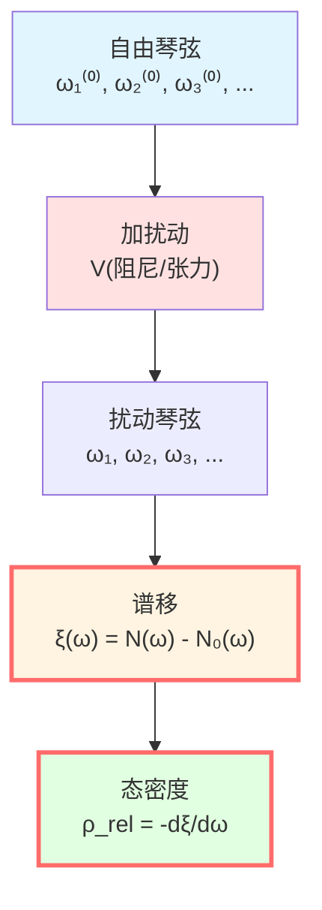
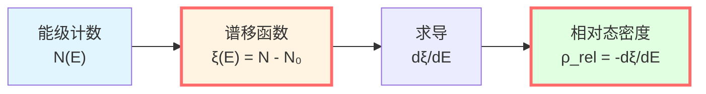
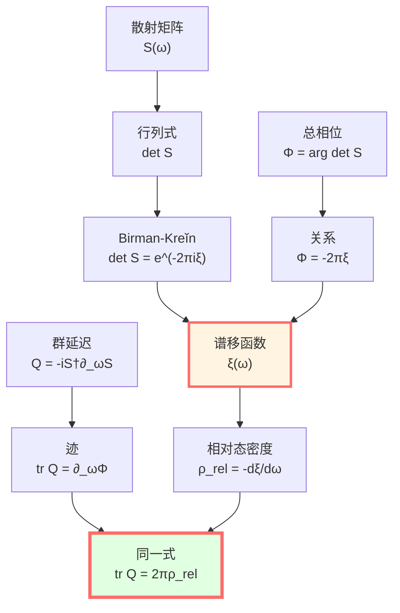
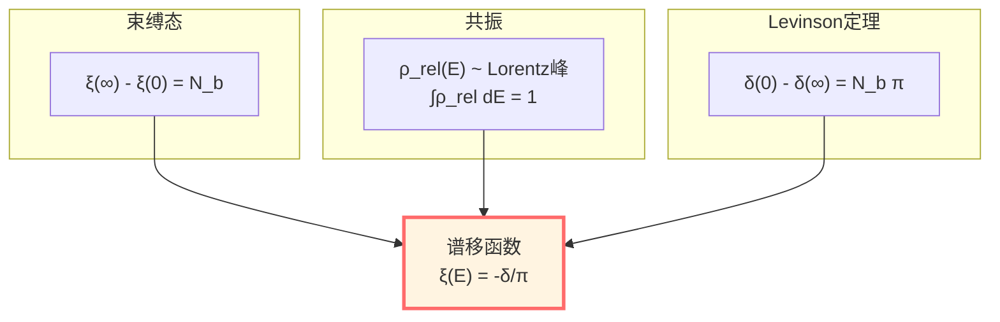
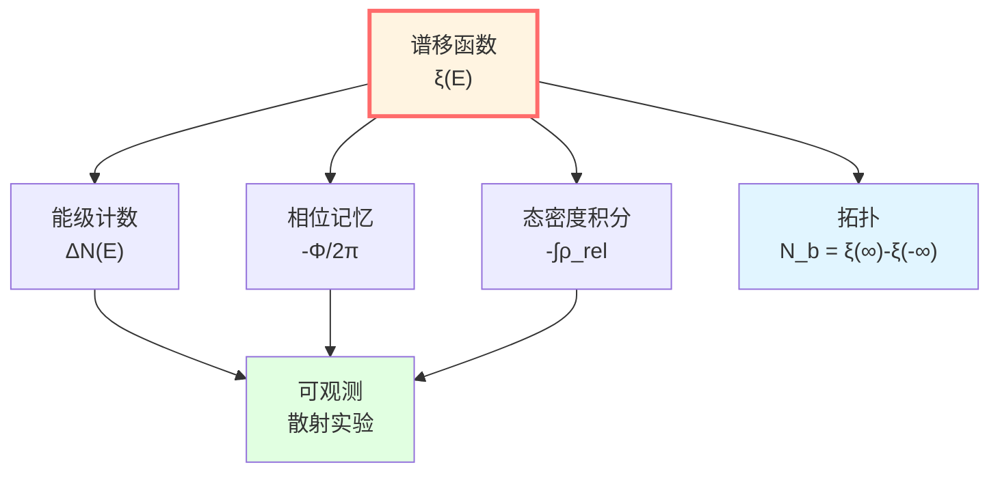
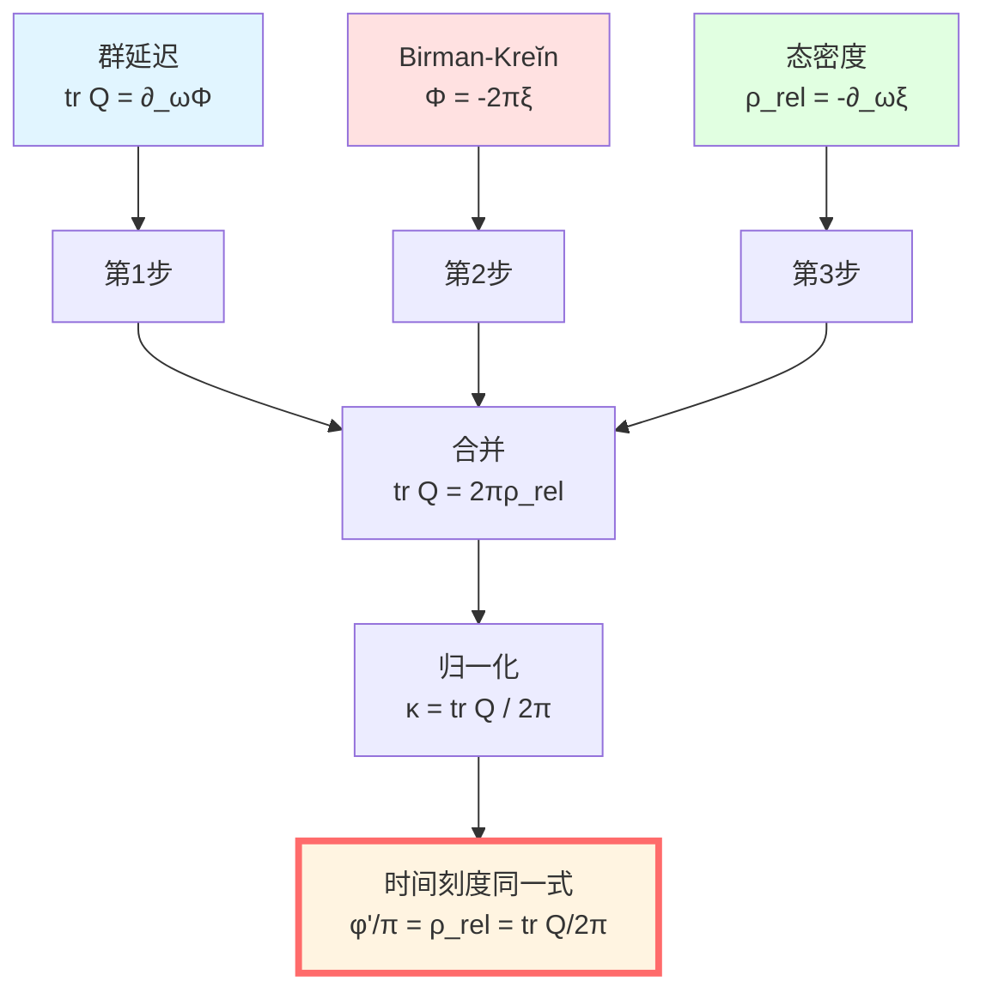

# 谱移函数：能级记忆相互作用

> *"谱移函数是哈密顿量对能级的签名。"*

## 🎯 核心命题

**定义**（Kreĭn谱移函数）：

对一对自伴算子 $(H, H_0)$，满足迹类或准迹类扰动条件，存在唯一的实函数 $\xi(\lambda)$ 使得：

$$\boxed{\text{tr}\,[f(H) - f(H_0)] = \int_{-\infty}^\infty f'(\lambda)\,\xi(\lambda)\,d\lambda}$$

对所有适当的测试函数 $f$ 成立。

**Birman-Kreĭn公式**：

$$\boxed{\det S(\omega) = e^{-2\pi i\xi(\omega)}}$$

其中 $S(\omega)$ 是散射矩阵。

**相对态密度**：

$$\boxed{\rho_{\text{rel}}(\omega) = -\frac{d\xi(\omega)}{d\omega}}$$

**物理意义**：
- $\xi(\omega)$：相互作用引起的能级计数改变
- $\rho_{\text{rel}}(\omega)$：相对态密度，测量能级"推移"的密度
- **Birman-Kreĭn公式连接散射与谱！**

## 💡 直观图像：琴弦的变调

### 比喻：小提琴加阻尼

想象一根理想琴弦（$H_0$）的自然频率：

$$\omega_n^{(0)} = n\pi v/L, \quad n = 1, 2, 3, \ldots$$

现在加上阻尼和张力扰动（$H = H_0 + V$），频率变为：

$$\omega_n = \omega_n^{(0)} + \Delta\omega_n$$

**能级计数**：

在频率 $\omega$ 以下有多少个共振？

- 无扰动：$N_0(\omega) = \lfloor L\omega/(\pi v) \rfloor$
- 有扰动：$N(\omega)$

**谱移函数**：

$$\xi(\omega) = N(\omega) - N_0(\omega)$$

**物理意义**：$\xi$ 记录了有多少能级被"推过" $\omega$！

### 能级推移

**例子**：势垒散射

无势时（$V = 0$）：
- 能级连续，$E \in [0, \infty)$
- 没有束缚态

有势时（$V(x) \neq 0$）：
- 可能出现束缚态 $E_b < 0$
- 连续谱能级"推移"

**谱移**：
- 每增加一个束缚态，$\xi(\omega)$ 在 $\omega \to 0$ 时增加1
- 连续谱中，$\xi(\omega)$ 测量"相移累积"

## 📐 数学定义

### Kreĭn迹公式

**设置**：
- $H_0$：自由哈密顿量
- $H = H_0 + V$：扰动哈密顿量
- 假设：$V$ 使得 $(H + i)^{-1} - (H_0 + i)^{-1} \in \mathfrak{S}_1$（迹类）

**定义**：对测试函数 $f$（如 $f(x) = (x - z)^{-1}$），有：

$$\text{tr}\,[f(H) - f(H_0)] = \int_{-\infty}^\infty f'(\lambda)\,\xi(\lambda)\,d\lambda$$

**例子**：$f(x) = (x - z)^{-1}$

$$\text{tr}\left[(H - z)^{-1} - (H_0 - z)^{-1}\right] = -\int_{-\infty}^\infty \frac{\xi(\lambda)}{(\lambda - z)^2}\,d\lambda$$

**唯一性**：$\xi(\lambda)$ 由此积分方程唯一确定。

### 物理解释

对**能级计数函数**：

$$N(\lambda) = \text{tr}\,\mathbf{1}_{(-\infty, \lambda]}(H)$$

即：能量 $\le \lambda$ 的本征态数量。

**谱移函数**：

$$\xi(\lambda) = N(\lambda) - N_0(\lambda)$$

**积分形式**：

$$N(\lambda) = \int_{-\infty}^\lambda \rho(E)\,dE$$

其中 $\rho(E) = \sum_n \delta(E - E_n)$ 是态密度。

**谱移与态密度**：

$$\xi(\lambda) = \int_{-\infty}^\lambda [\rho(E) - \rho_0(E)]\,dE$$

**导数**：

$$\frac{d\xi}{d\lambda} = \rho(\lambda) - \rho_0(\lambda) =: -\rho_{\text{rel}}(\lambda)$$

（负号是约定）

## 🌀 Birman-Kreĭn公式

### 散射矩阵的行列式

在散射理论中，$S(\omega)$ 是酉矩阵：

$$S(\omega) = I + 2\pi i T(\omega)$$

其中 $T(\omega)$ 是跃迁算子。

**Birman-Kreĭn定理**（1962）：

$$\boxed{\det S(\omega) = e^{-2\pi i\xi(\omega)}}$$

**证明思路**（启发性）：

利用Fredholm行列式理论：

$$\det(I + A) = e^{\text{tr}\,\ln(I + A)}$$

对 $(H - z)^{-1} - (H_0 - z)^{-1}$，通过解析延拓和边界条件，可导出散射矩阵行列式与谱移的关系。

**严格证明**：需要Hilbert-Schmidt算子理论和Cauchy定理（参见Birman & Yafaev, 1993）。

### 总散射相位

回忆 $\Phi(\omega) = \arg\det S(\omega)$，由Birman-Kreĭn公式：

$$e^{i\Phi(\omega)} = e^{-2\pi i\xi(\omega)}$$

取相位（选择连续分支）：

$$\boxed{\Phi(\omega) = -2\pi\xi(\omega)}$$

**求导**：

$$\frac{\partial\Phi}{\partial\omega} = -2\pi\frac{d\xi}{d\omega} = 2\pi\rho_{\text{rel}}(\omega)$$

**结合上一篇**的群延迟公式：

$$\text{tr}\,Q(\omega) = \frac{\partial\Phi}{\partial\omega}$$

得到：

$$\boxed{\text{tr}\,Q(\omega) = 2\pi\rho_{\text{rel}}(\omega)}$$

或者：

$$\boxed{\frac{1}{2\pi}\text{tr}\,Q(\omega) = \rho_{\text{rel}}(\omega) = -\frac{d\xi}{d\omega}}$$

**完美！散射、谱移、态密度统一了！**

## 🧮 单通道散射例子

### 一维势垒

**设置**：粒子被势 $V(x)$ 散射（$V(x) = 0$ 当 $|x| \to \infty$）。

**散射矩阵**（单通道）：

$$S(k) = e^{2i\delta(k)}$$

其中 $\delta(k)$ 是相位移，$k = \sqrt{2mE}/\hbar$ 是波数。

**总相位**：

$$\Phi(k) = 2\delta(k)$$

**Birman-Kreĭn公式**：

$$e^{2i\delta(k)} = e^{-2\pi i\xi(E)}$$

选择相位连续：

$$2\delta(k) = -2\pi\xi(E) + 2\pi n$$

忽略整数 $n$（相位缠绕）：

$$\boxed{\xi(E) = -\frac{\delta(k)}{\pi}}$$

**Levinson定理**：

若势阱支持 $N_b$ 个束缚态，则：

$$\delta(0) - \delta(\infty) = N_b \pi$$

由 $\xi(E) = -\delta(k)/\pi$：

$$\xi(0) - \xi(\infty) = N_b$$

**物理意义**：谱移函数的总变化等于束缚态数量！

### 共振散射

在共振能量 $E_r$ 附近：

$$\delta(E) \approx \delta_{\text{bg}} + \arctan\frac{\Gamma/2}{E - E_r}$$

**谱移**：

$$\xi(E) = -\frac{1}{\pi}\arctan\frac{\Gamma/2}{E - E_r}$$

**态密度**：

$$\rho_{\text{rel}}(E) = -\frac{d\xi}{dE} = \frac{1}{\pi}\frac{\Gamma/2}{(E - E_r)^2 + (\Gamma/2)^2}$$

这是**Lorentz线型**！

**积分**：

$$\int_{-\infty}^\infty \rho_{\text{rel}}(E)\,dE = -[\xi(\infty) - \xi(-\infty)] = 1$$

**完美！**一个共振贡献态密度积分为1！

## 🔬 多通道散射

### N×N散射矩阵

对多通道散射，$S(\omega)$ 是 $N \times N$ 酉矩阵。

**Birman-Kreĭn公式**仍成立：

$$\det S(\omega) = e^{-2\pi i\xi(\omega)}$$

**总相位**：

$$\Phi(\omega) = \arg\det S(\omega) = \sum_{j=1}^N \delta_j(\omega)$$

其中 $\delta_j$ 是 $S$ 的特征值相位。

**谱移**：

$$\xi(\omega) = -\frac{1}{2\pi}\sum_{j=1}^N \delta_j(\omega)$$

**相对态密度**：

$$\rho_{\text{rel}}(\omega) = -\frac{d\xi}{d\omega} = \frac{1}{2\pi}\sum_{j=1}^N \frac{d\delta_j}{d\omega}$$

**群延迟**：

$$\text{tr}\,Q(\omega) = \sum_{j=1}^N \tau_j(\omega)$$

其中 $\tau_j$ 是 $Q$ 的特征值。

**关系**（由Birman-Kreĭn）：

$$\sum_j \tau_j = \frac{\partial\Phi}{\partial\omega} = 2\pi\rho_{\text{rel}}$$

**完美自洽！**

## 💡 物理意义

### 谱移的三种理解

**1. 能级计数**：

$$\xi(E) = \#\{\text{能级} \le E\}_{\text{扰动}} - \#\{\text{能级} \le E\}_{\text{自由}}$$

**2. 相位记忆**：

$$\xi(E) = -\frac{\Phi(E)}{2\pi} = -\frac{1}{2\pi}\arg\det S(E)$$

**3. 态密度积分**：

$$\xi(E) = -\int_{-\infty}^E \rho_{\text{rel}}(E')\,dE'$$

**这三者完全等价！**

### 为什么重要？

**1. 连接量子与经典**：
- 量子：能级、相位、散射
- 经典：时间延迟、轨道偏转

**桥梁**：$\xi$ 通过Birman-Kreĭn公式连接二者

**2. 可观测性**：
- $\xi$ 不直接可测
- 但 $\rho_{\text{rel}} = -d\xi/dE$ 可从散射数据提取
- $\text{tr}\,Q = 2\pi\rho_{\text{rel}}$ 可测量！

**3. 拓扑信息**：
- $\xi(\infty) - \xi(-\infty) = N_b$（Levinson定理）
- 拓扑不变量！即使扰动变化，束缚态数不变

## 🌊 时间刻度同一式推导

现在我们可以完整推导统一时间刻度公式！

### 第1步：群延迟

从上一篇，我们知道：

$$\text{tr}\,Q(\omega) = \frac{\partial \Phi(\omega)}{\partial \omega}$$

### 第2步：Birman-Kreĭn

本篇证明了：

$$\Phi(\omega) = -2\pi\xi(\omega)$$

### 第3步：相对态密度

定义：

$$\rho_{\text{rel}}(\omega) = -\frac{d\xi}{d\omega}$$

### 第4步：合并

$$\text{tr}\,Q = \frac{\partial \Phi}{\partial \omega} = \frac{\partial}{\partial \omega}(-2\pi\xi) = -2\pi\frac{d\xi}{d\omega} = 2\pi\rho_{\text{rel}}$$

### 第5步：归一化

定义归一化时间刻度：

$$\kappa(\omega) := \frac{1}{2\pi}\text{tr}\,Q(\omega)$$

则：

$$\boxed{\kappa(\omega) = \rho_{\text{rel}}(\omega) = -\frac{d\xi}{d\omega}}$$

**这就是时间刻度同一式的核心部分！**

### 第6步：与相位导数

定义半相位 $\varphi(\omega) = \Phi(\omega)/2 = -\pi\xi(\omega)$：

$$\frac{\varphi'(\omega)}{\pi} = -\frac{d\xi}{d\omega} = \rho_{\text{rel}}(\omega)$$

### 完整同一式

$$\boxed{\frac{\varphi'(\omega)}{\pi} = \rho_{\text{rel}}(\omega) = \frac{1}{2\pi}\text{tr}\,Q(\omega)}$$

**证毕！**三者统一！

## 📝 推导链总结

| 步骤 | 公式 | 来源 |
|-----|------|------|
| 1 | $\text{tr}\,Q = \partial_\omega\Phi$ | Wigner-Smith定义 |
| 2 | $\Phi = -2\pi\xi$ | Birman-Kreĭn公式 |
| 3 | $\rho_{\text{rel}} = -\partial_\omega\xi$ | 相对态密度定义 |
| 4 | $\text{tr}\,Q = 2\pi\rho_{\text{rel}}$ | 1+2+3 |
| 5 | $\varphi = \Phi/2 = -\pi\xi$ | 半相位 |
| 6 | $\varphi'/\pi = -\partial_\omega\xi = \rho_{\text{rel}}$ | 5的导数 |
| 7 | $\kappa = \text{tr}\,Q/(2\pi) = \rho_{\text{rel}} = \varphi'/\pi$ | **同一式** |

## 🎓 历史注记

### Kreĭn的贡献（1953）

M.G. Kreĭn首先定义谱移函数，用于迹公式：

$$\text{tr}\,[f(H) - f(H_0)] = \int f'(\lambda)\xi(\lambda)\,d\lambda$$

**应用**：扰动理论、量子场论的重整化

### Birman的贡献（1962）

M.Sh. Birman证明了散射矩阵与谱移的关系：

$$\det S(\omega) = e^{-2\pi i\xi(\omega)}$$

**意义**：首次连接散射（可观测）与谱（数学）！

### 现代发展

**2000年代**：推广到：
- 电磁散射（Strohmaier & Waters, 2021）
- 非厄米系统
- 拓扑物质

**GLS理论**：利用Birman-Kreĭn统一时间刻度！

## 🤔 练习题

1. **概念理解**：
   - 谱移函数的物理意义是什么？
   - 为什么 $\xi(\infty) - \xi(-\infty) = N_b$（束缚态数）？
   - Birman-Kreĭn公式为什么重要？

2. **计算练习**：
   - 对 $S(k) = e^{2i\delta(k)}$，证明 $\xi(E) = -\delta(k)/\pi$
   - 共振 $\delta = \arctan[\Gamma/(2(E-E_r))]$，计算 $\rho_{\text{rel}}(E)$
   - 验证 $\int_{-\infty}^\infty \rho_{\text{rel}}(E)\,dE = 1$（单共振）

3. **物理应用**：
   - 如何从散射数据提取谱移函数？
   - Levinson定理如何确定束缚态数量？
   - 多通道散射中，$\xi$ 如何定义？

4. **进阶思考**：
   - Birman-Kreĭn公式的拓扑解释是什么？
   - 非迹类扰动下，$\xi$ 如何推广？
   - 时间反演对称性对 $\xi$ 有何约束？

---

**下一步**：我们已经理解了相位-时间（第1篇）、群延迟（第2篇）、谱移（第3篇）。下一篇将**完整证明时间刻度同一式**，并揭示其深刻意义！

**导航**：
- 上一篇：[02-scattering-phase.md](02-scattering-phase.md) - 散射相位与群延迟
- 下一篇：[04-time-scale-identity.md](04-time-scale-identity.md) - 时间刻度同一式（⭐核心）
- 概览：[00-time-overview.md](00-time-overview.md) - 统一时间篇总览
- GLS理论：unified-time-scale-geometry.md
