# Spectral Shift Function: Energy Levels Remember Interaction

> *"Spectral shift function can be viewed as the signature of Hamiltonian on energy levels."*

## 🎯 Core Proposition

**Definition** (Kreĭn Spectral Shift Function):

For a pair of self-adjoint operators $(H, H_0)$, satisfying trace-class or quasi-trace-class perturbation conditions, there exists unique real function $\xi(\lambda)$ such that:

$$\boxed{\text{tr}\,[f(H) - f(H_0)] = \int_{-\infty}^\infty f'(\lambda)\,\xi(\lambda)\,d\lambda}$$

Holds for all appropriate test functions $f$.

**Birman-Kreĭn formula**:

$$\boxed{\det S(\omega) = e^{-2\pi i\xi(\omega)}}$$

Where $S(\omega)$ is scattering matrix.

**Relative density of states**:

$$\boxed{\rho_{\text{rel}}(\omega) = -\frac{d\xi(\omega)}{d\omega}}$$

**Physical meaning**:
- $\xi(\omega)$: reflects change in energy level count caused by interaction
- $\rho_{\text{rel}}(\omega)$: relative density of states, describes density of energy level "shifts"
- **Relationship**: Birman-Kreĭn formula establishes a connection between scattering and spectral properties.

## 💡 Intuitive Image: String Tuning

### Analogy: Violin with Damping

Imagine an ideal string ($H_0$) with natural frequencies:

$$\omega_n^{(0)} = n\pi v/L, \quad n = 1, 2, 3, \ldots$$

Now add damping and tension perturbation ($H = H_0 + V$), frequencies become:

$$\omega_n = \omega_n^{(0)} + \Delta\omega_n$$

**Energy level counting**:

How many resonances below frequency $\omega$?

- No perturbation: $N_0(\omega) = \lfloor L\omega/(\pi v) \rfloor$
- With perturbation: $N(\omega)$

**Spectral shift function**:

$$\xi(\omega) = N(\omega) - N_0(\omega)$$

**Physical meaning**: $\xi$ records how many energy levels are "pushed past" $\omega$.

```mermaid
graph TB
    H0["Free String<br/>ω₁⁽⁰⁾, ω₂⁽⁰⁾, ω₃⁽⁰⁾, ..."] --> V["Add Perturbation<br/>V (Damping/Tension)"]
    V --> H["Perturbed String<br/>ω₁, ω₂, ω₃, ..."]
    H --> XI["Spectral Shift<br/>ξ(ω) = N(ω) - N₀(ω)"]
    XI --> RHO["Density of States<br/>ρ_rel = -dξ/dω"]

    style H0 fill:#e1f5ff
    style V fill:#ffe1e1
    style XI fill:#fff4e1,stroke:#ff6b6b,stroke-width:3px
    style RHO fill:#e1ffe1,stroke:#ff6b6b,stroke-width:3px
```

### Energy Level Shifts

**Example**: Potential barrier scattering

Without potential ($V = 0$):
- Energy levels continuous, $E \in [0, \infty)$
- No bound states

With potential ($V(x) \neq 0$):
- Bound states $E_b < 0$ may appear
- Continuous spectrum energy levels undergo "shift"

**Spectral shift**:
- Each added bound state increases $\xi(\omega)$ by 1 as $\omega \to 0$
- In continuous spectrum, $\xi(\omega)$ measures "phase shift accumulation"

## 📐 Mathematical Definition

### Kreĭn Trace Formula

**Setup**:
- $H_0$: free Hamiltonian
- $H = H_0 + V$: perturbed Hamiltonian
- Assumption: $V$ such that $(H + i)^{-1} - (H_0 + i)^{-1} \in \mathfrak{S}_1$ (trace class)

**Definition**: For test function $f$ (e.g., $f(x) = (x - z)^{-1}$), we have:

$$\text{tr}\,[f(H) - f(H_0)] = \int_{-\infty}^\infty f'(\lambda)\,\xi(\lambda)\,d\lambda$$

**Example**: $f(x) = (x - z)^{-1}$

$$\text{tr}\left[(H - z)^{-1} - (H_0 - z)^{-1}\right] = -\int_{-\infty}^\infty \frac{\xi(\lambda)}{(\lambda - z)^2}\,d\lambda$$

**Uniqueness**: $\xi(\lambda)$ is uniquely determined by this integral equation.

### Physical Interpretation

For **energy level counting function**:

$$N(\lambda) = \text{tr}\,\mathbf{1}_{(-\infty, \lambda]}(H)$$

That is: number of eigenstates with energy $\le \lambda$.

**Spectral shift function**:

$$\xi(\lambda) = N(\lambda) - N_0(\lambda)$$

**Integral form**:

$$N(\lambda) = \int_{-\infty}^\lambda \rho(E)\,dE$$

Where $\rho(E) = \sum_n \delta(E - E_n)$ is density of states.

**Spectral shift and density of states**:

$$\xi(\lambda) = \int_{-\infty}^\lambda [\rho(E) - \rho_0(E)]\,dE$$

**Derivative**:

$$\frac{d\xi}{d\lambda} = \rho(\lambda) - \rho_0(\lambda) =: -\rho_{\text{rel}}(\lambda)$$

(Negative sign is convention)

```mermaid
graph LR
    N["Energy Level Count<br/>N(E)"] --> XI["Spectral Shift Function<br/>ξ(E) = N - N₀"]
    XI --> D["Differentiate<br/>dξ/dE"]
    D --> RHO["Relative Density of States<br/>ρ_rel = -dξ/dE"]

    style N fill:#e1f5ff
    style XI fill:#fff4e1,stroke:#ff6b6b,stroke-width:3px
    style RHO fill:#e1ffe1,stroke:#ff6b6b,stroke-width:3px
```

## 🌀 Birman-Kreĭn Formula

### Determinant of Scattering Matrix

In scattering theory, $S(\omega)$ is unitary matrix:

$$S(\omega) = I + 2\pi i T(\omega)$$

Where $T(\omega)$ is transition operator.

**Birman-Kreĭn theorem** (1962):

$$\boxed{\det S(\omega) = e^{-2\pi i\xi(\omega)}}$$

**Proof idea** (heuristic):

Using Fredholm determinant theory:

$$\det(I + A) = e^{\text{tr}\,\ln(I + A)}$$

For $(H - z)^{-1} - (H_0 - z)^{-1}$, through analytic continuation and boundary conditions, can derive relationship between scattering matrix determinant and spectral shift.

**Rigorous proof**: Requires Hilbert-Schmidt operator theory and Cauchy theorem (see Birman & Yafaev, 1993).

### Total Scattering Phase

Recall $\Phi(\omega) = \arg\det S(\omega)$, from Birman-Kreĭn formula:

$$e^{i\Phi(\omega)} = e^{-2\pi i\xi(\omega)}$$

Taking phase (choosing continuous branch):

$$\boxed{\Phi(\omega) = -2\pi\xi(\omega)}$$

**Differentiating**:

$$\frac{\partial\Phi}{\partial\omega} = -2\pi\frac{d\xi}{d\omega} = 2\pi\rho_{\text{rel}}(\omega)$$

**Combining with previous article's** group delay formula:

$$\text{tr}\,Q(\omega) = \frac{\partial\Phi}{\partial\omega}$$

We get:

$$\boxed{\text{tr}\,Q(\omega) = 2\pi\rho_{\text{rel}}(\omega)}$$

Or:

$$\boxed{\frac{1}{2\pi}\text{tr}\,Q(\omega) = \rho_{\text{rel}}(\omega) = -\frac{d\xi}{d\omega}}$$

**Conclusion**: Scattering, spectral shift, and density of states show unity in this framework.

```mermaid
graph TB
    S["Scattering Matrix<br/>S(ω)"] --> D["Determinant<br/>det S"]
    D --> BK["Birman-Kreĭn<br/>det S = e^(-2πiξ)"]
    BK --> XI["Spectral Shift Function<br/>ξ(ω)"]
    XI --> RHO["Relative Density of States<br/>ρ_rel = -dξ/dω"]

    PH["Total Phase<br/>Φ = arg det S"] --> REL["Relationship<br/>Φ = -2πξ"]
    REL --> XI

    Q["Group Delay<br/>Q = -iS†∂_ωS"] --> TR["Trace<br/>tr Q = ∂_ωΦ"]
    TR --> ID["Identity<br/>tr Q = 2πρ_rel"]
    RHO --> ID

    style XI fill:#fff4e1,stroke:#ff6b6b,stroke-width:3px
    style ID fill:#e1ffe1,stroke:#ff6b6b,stroke-width:4px
```

## 🧮 Single-Channel Scattering Example

### One-Dimensional Potential Barrier

**Setup**: Particle scattered by potential $V(x)$ ($V(x) = 0$ as $|x| \to \infty$).

**Scattering matrix** (single channel):

$$S(k) = e^{2i\delta(k)}$$

Where $\delta(k)$ is phase shift, $k = \sqrt{2mE}/\hbar$ is wavenumber.

**Total phase**:

$$\Phi(k) = 2\delta(k)$$

**Birman-Kreĭn formula**:

$$e^{2i\delta(k)} = e^{-2\pi i\xi(E)}$$

Choosing continuous phase:

$$2\delta(k) = -2\pi\xi(E) + 2\pi n$$

Ignoring integer $n$ (phase winding):

$$\boxed{\xi(E) = -\frac{\delta(k)}{\pi}}$$

**Levinson theorem**:

If potential well supports $N_b$ bound states, then:

$$\delta(0) - \delta(\infty) = N_b \pi$$

From $\xi(E) = -\delta(k)/\pi$:

$$\xi(0) - \xi(\infty) = N_b$$

**Physical meaning**: Total change of spectral shift function equals number of bound states.

### Resonance Scattering

Near resonance energy $E_r$:

$$\delta(E) \approx \delta_{\text{bg}} + \arctan\frac{\Gamma/2}{E - E_r}$$

**Spectral shift**:

$$\xi(E) = -\frac{1}{\pi}\arctan\frac{\Gamma/2}{E - E_r}$$

**Density of states**:

$$\rho_{\text{rel}}(E) = -\frac{d\xi}{dE} = \frac{1}{\pi}\frac{\Gamma/2}{(E - E_r)^2 + (\Gamma/2)^2}$$

This is **Lorentzian line shape**.

**Integral**:

$$\int_{-\infty}^\infty \rho_{\text{rel}}(E)\,dE = -[\xi(\infty) - \xi(-\infty)] = 1$$

**Result**: One resonance contributes density of states integral of 1.

```mermaid
graph TB
    subgraph "Bound States"
        B["ξ(∞) - ξ(0) = N_b"]
    end

    subgraph "Resonance"
        R["ρ_rel(E) ~ Lorentz Peak<br/>∫ρ_rel dE = 1"]
    end

    subgraph "Levinson Theorem"
        L["δ(0) - δ(∞) = N_b π"]
    end

    B --> XI["Spectral Shift Function<br/>ξ(E) = -δ/π"]
    R --> XI
    L --> XI

    style XI fill:#fff4e1,stroke:#ff6b6b,stroke-width:3px
```

## 🔬 Multi-Channel Scattering

### N×N Scattering Matrix

For multi-channel scattering, $S(\omega)$ is $N \times N$ unitary matrix.

**Birman-Kreĭn formula** still holds:

$$\det S(\omega) = e^{-2\pi i\xi(\omega)}$$

**Total phase**:

$$\Phi(\omega) = \arg\det S(\omega) = \sum_{j=1}^N \delta_j(\omega)$$

Where $\delta_j$ are eigenvalues phases of $S$.

**Spectral shift**:

$$\xi(\omega) = -\frac{1}{2\pi}\sum_{j=1}^N \delta_j(\omega)$$

**Relative density of states**:

$$\rho_{\text{rel}}(\omega) = -\frac{d\xi}{d\omega} = \frac{1}{2\pi}\sum_{j=1}^N \frac{d\delta_j}{d\omega}$$

**Group delay**:

$$\text{tr}\,Q(\omega) = \sum_{j=1}^N \tau_j(\omega)$$

Where $\tau_j$ are eigenvalues of $Q$.

**Relationship** (from Birman-Kreĭn):

$$\sum_j \tau_j = \frac{\partial\Phi}{\partial\omega} = 2\pi\rho_{\text{rel}}$$

**Theoretical framework is self-consistent.**

## 💡 Physical Meaning

### Three Understandings of Spectral Shift

**1. Energy level counting**:

$$\xi(E) = \#\{\text{energy levels} \le E\}_{\text{perturbed}} - \#\{\text{energy levels} \le E\}_{\text{free}}$$

**2. Phase memory**:

$$\xi(E) = -\frac{\Phi(E)}{2\pi} = -\frac{1}{2\pi}\arg\det S(E)$$

**3. Density of states integral**:

$$\xi(E) = -\int_{-\infty}^E \rho_{\text{rel}}(E')\,dE'$$

**These three are mathematically equivalent.**

### Why Important?

**1. Connects quantum and classical**:
- Quantum: energy levels, phase, scattering
- Classical: time delay, orbit deflection

**Bridge**: $\xi$ connects both through Birman-Kreĭn formula

**2. Observability**:
- $\xi$ not directly measurable
- But $\rho_{\text{rel}} = -d\xi/dE$ can be extracted from scattering data
- $\text{tr}\,Q = 2\pi\rho_{\text{rel}}$ is measurable

**3. Topological information**:
- $\xi(\infty) - \xi(-\infty) = N_b$ (Levinson theorem)
- Topological invariant: Even if perturbation changes, bound state number unchanged

```mermaid
graph TB
    XI["Spectral Shift Function<br/>ξ(E)"] --> C["Energy Level Count<br/>ΔN(E)"]
    XI --> P["Phase Memory<br/>-Φ/2π"]
    XI --> D["Density of States Integral<br/>-∫ρ_rel"]

    C --> O["Observable<br/>Scattering Experiment"]
    P --> O
    D --> O

    XI --> T["Topology<br/>N_b = ξ(∞)-ξ(-∞)"]

    style XI fill:#fff4e1,stroke:#ff6b6b,stroke-width:3px
    style O fill:#e1ffe1
    style T fill:#e1f5ff
```

## 🌊 Time Scale Identity Derivation

Now we can completely derive unified time scale formula.

### Step 1: Group Delay

From previous article, we know:

$$\text{tr}\,Q(\omega) = \frac{\partial \Phi(\omega)}{\partial \omega}$$

### Step 2: Birman-Kreĭn

This article proved:

$$\Phi(\omega) = -2\pi\xi(\omega)$$

### Step 3: Relative Density of States

Definition:

$$\rho_{\text{rel}}(\omega) = -\frac{d\xi}{d\omega}$$

### Step 4: Combine

$$\text{tr}\,Q = \frac{\partial \Phi}{\partial \omega} = \frac{\partial}{\partial \omega}(-2\pi\xi) = -2\pi\frac{d\xi}{d\omega} = 2\pi\rho_{\text{rel}}$$

### Step 5: Normalize

Define normalized time scale:

$$\kappa(\omega) := \frac{1}{2\pi}\text{tr}\,Q(\omega)$$

Then:

$$\boxed{\kappa(\omega) = \rho_{\text{rel}}(\omega) = -\frac{d\xi}{d\omega}}$$

**This is the core part of time scale identity.**

### Step 6: With Phase Derivative

Define half-phase $\varphi(\omega) = \Phi(\omega)/2 = -\pi\xi(\omega)$:

$$\frac{\varphi'(\omega)}{\pi} = -\frac{d\xi}{d\omega} = \rho_{\text{rel}}(\omega)$$

### Complete Identity

$$\boxed{\frac{\varphi'(\omega)}{\pi} = \rho_{\text{rel}}(\omega) = \frac{1}{2\pi}\text{tr}\,Q(\omega)}$$

**QED**: The three are unified.

```mermaid
graph TB
    Q["Group Delay<br/>tr Q = ∂_ωΦ"] --> STEP1["Step 1"]
    BK["Birman-Kreĭn<br/>Φ = -2πξ"] --> STEP2["Step 2"]
    RHO["Density of States<br/>ρ_rel = -∂_ωξ"] --> STEP3["Step 3"]

    STEP1 --> MERGE["Combine<br/>tr Q = 2πρ_rel"]
    STEP2 --> MERGE
    STEP3 --> MERGE

    MERGE --> NORM["Normalize<br/>κ = tr Q / 2π"]
    NORM --> ID["Time Scale Identity<br/>φ'/π = ρ_rel = tr Q/2π"]

    style Q fill:#e1f5ff
    style BK fill:#ffe1e1
    style RHO fill:#e1ffe1
    style ID fill:#fff4e1,stroke:#ff6b6b,stroke-width:4px
```

## 📝 Derivation Chain Summary

| Step | Formula | Source |
|-----|------|------|
| 1 | $\text{tr}\,Q = \partial_\omega\Phi$ | Wigner-Smith definition |
| 2 | $\Phi = -2\pi\xi$ | Birman-Kreĭn formula |
| 3 | $\rho_{\text{rel}} = -\partial_\omega\xi$ | Relative density of states definition |
| 4 | $\text{tr}\,Q = 2\pi\rho_{\text{rel}}$ | 1+2+3 |
| 5 | $\varphi = \Phi/2 = -\pi\xi$ | Half-phase |
| 6 | $\varphi'/\pi = -\partial_\omega\xi = \rho_{\text{rel}}$ | Derivative of 5 |
| 7 | $\kappa = \text{tr}\,Q/(2\pi) = \rho_{\text{rel}} = \varphi'/\pi$ | **Identity** |

## 🎓 Historical Notes

### Kreĭn's Contribution (1953)

M.G. Kreĭn first defined spectral shift function for trace formula:

$$\text{tr}\,[f(H) - f(H_0)] = \int f'(\lambda)\xi(\lambda)\,d\lambda$$

**Application**: Perturbation theory, renormalization in quantum field theory

### Birman's Contribution (1962)

M.Sh. Birman proved relationship between scattering matrix and spectral shift:

$$\det S(\omega) = e^{-2\pi i\xi(\omega)}$$

**Meaning**: First connection between scattering (observable) and spectrum (mathematical).

### Modern Developments

**2000s**: Generalizations to:
- Electromagnetic scattering (Strohmaier & Waters, 2021)
- Non-Hermitian systems
- Topological matter

**GLS theory**: Uses Birman-Kreĭn to unify time scale.

## 🤔 Exercises

1. **Conceptual understanding**:
   - What is the physical meaning of spectral shift function?
   - Why $\xi(\infty) - \xi(-\infty) = N_b$ (number of bound states)?
   - Why is Birman-Kreĭn formula important?

2. **Calculation exercises**:
   - For $S(k) = e^{2i\delta(k)}$, prove $\xi(E) = -\delta(k)/\pi$
   - Resonance $\delta = \arctan[\Gamma/(2(E-E_r))]$, calculate $\rho_{\text{rel}}(E)$
   - Verify $\int_{-\infty}^\infty \rho_{\text{rel}}(E)\,dE = 1$ (single resonance)

3. **Physical applications**:
   - How to extract spectral shift function from scattering data?
   - How does Levinson theorem determine number of bound states?
   - In multi-channel scattering, how is $\xi$ defined?

4. **Advanced thinking**:
   - What is topological interpretation of Birman-Kreĭn formula?
   - How to generalize $\xi$ under non-trace-class perturbations?
   - What constraints does time-reversal symmetry impose on $\xi$?

---

**Next step**: We have understood phase-time (Article 1), group delay (Article 2), spectral shift (Article 3). Next article will **completely prove time scale identity** and reveal its profound meaning.

**Navigation**:
- Previous: [02-scattering-phase_en.md](02-scattering-phase_en.md) - Scattering Phase and Group Delay
- Next: [04-time-scale-identity_en.md](04-time-scale-identity_en.md) - Time Scale Identity (⭐ Core)
- Overview: [00-time-overview_en.md](00-time-overview_en.md) - Unified Time Chapter Overview
- GLS theory: unified-time-scale-geometry.md

