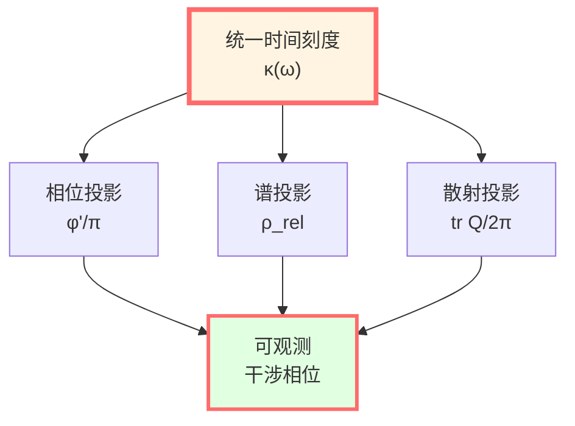
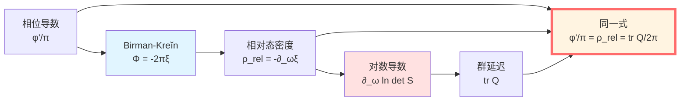
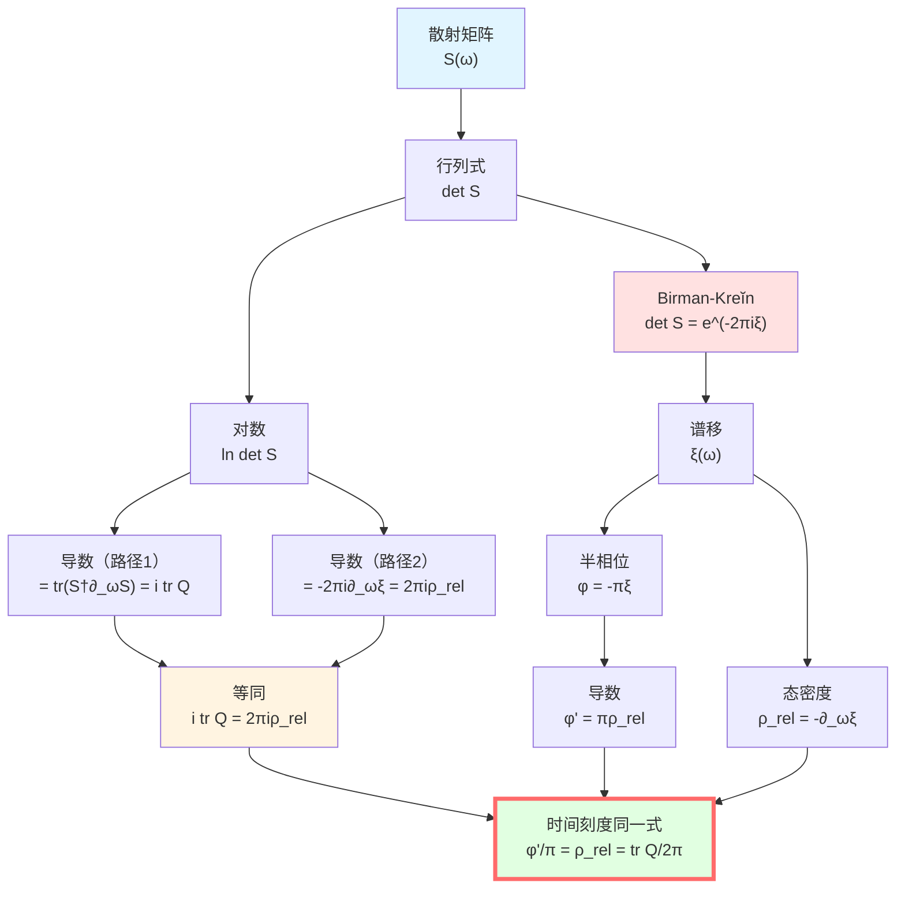
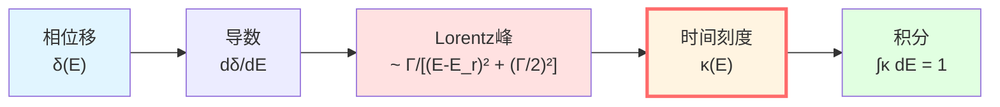
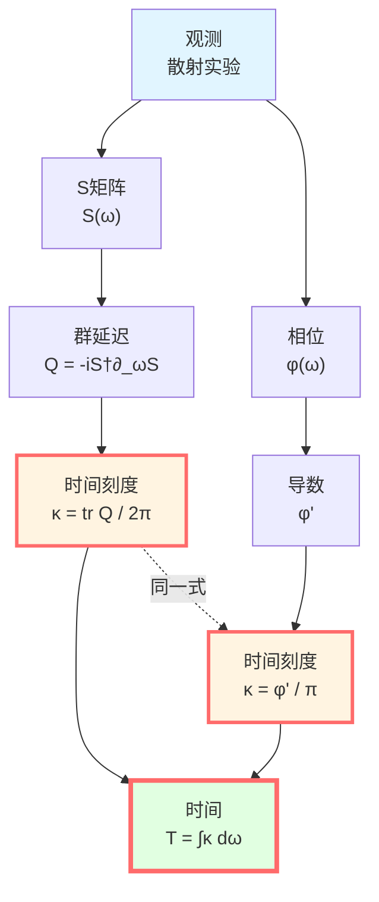
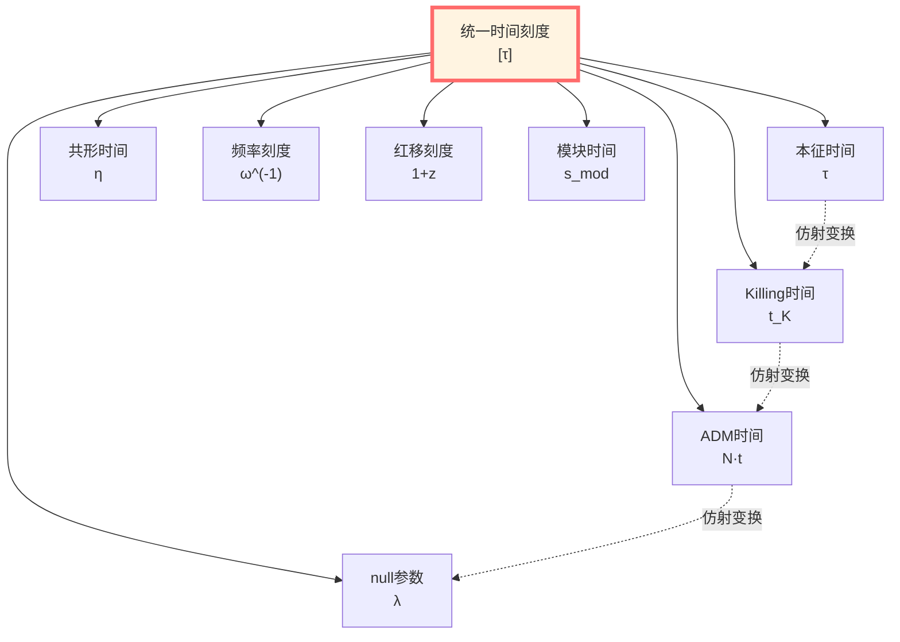
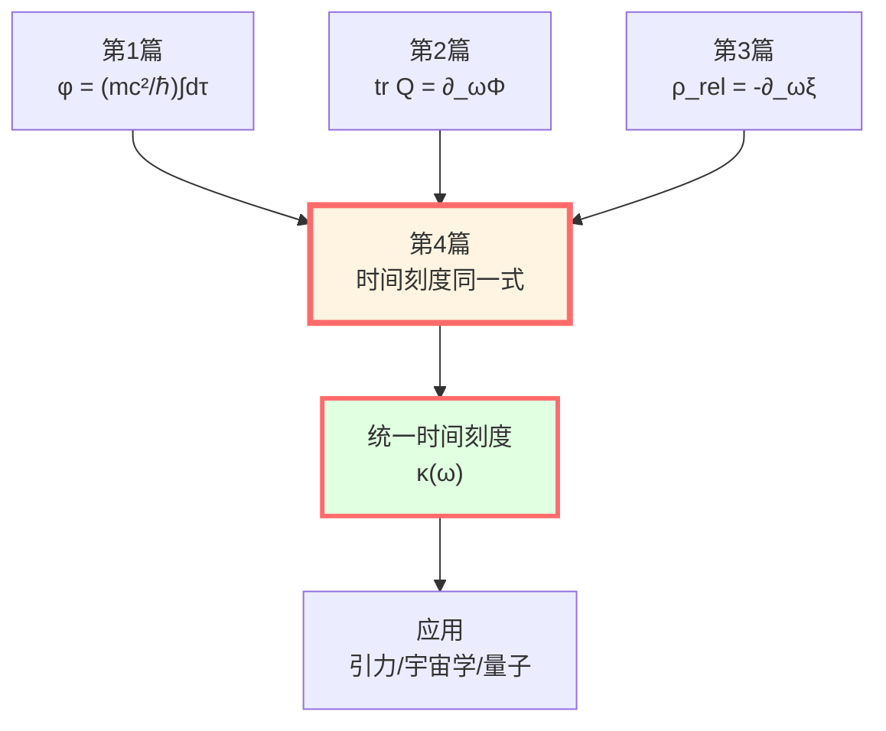

# 时间刻度同一式：四者合一的证明

> *"多种时间概念可能只是同一物理实体的不同表现形式。"*

## 🎯 核心定理

**定理**（时间刻度同一式）：

在适当的散射-谱-几何条件下，以下四个量在数学结构上等价：

$$\boxed{\kappa(\omega) = \frac{\varphi'(\omega)}{\pi} = \rho_{\text{rel}}(\omega) = \frac{1}{2\pi}\text{tr}\,Q(\omega)}$$

其中：
- $\varphi(\omega)$：归一化散射相位（$\varphi = \Phi/2$）
- $\rho_{\text{rel}}(\omega)$：相对态密度
- $Q(\omega)$：Wigner-Smith群延迟算子
- $\kappa(\omega)$：统一时间刻度密度

**物理意义**：
- **相位导数** $\varphi'/\pi$：量子相位的变化率
- **相对态密度** $\rho_{\text{rel}}$：能级推移的密度
- **群延迟迹** $\text{tr}\,Q/(2\pi)$：波包延迟的密度
- **结论**：它们可被视为同一个时间刻度的三个投影。



## 💡 直观图像：三面镜子

### 比喻：同一座山的三个视角

想象一座山：

```
        *
       /|\
      / | \
     /  |  \
    /   |   \
   /____|____\
```

从**三个方向**看：
- **相位角度**：山的轮廓（$\varphi'$）
- **谱角度**：山的高度分布（$\rho_{\text{rel}}$）
- **散射角度**：攀登所需时间（$\text{tr}\,Q$）

**寓意**：它们从不同角度描述了同一物理对象。

**同一式表明**：这三个视角给出**一致的信息**。

### 音乐类比

想象一首乐曲：

**三种记谱法**：
1. **相位谱**（傅里叶分析）：频率成分
2. **能级谱**（共振峰）：主要频率
3. **时间延迟**（回响）：声音持续

**同一式表明**：这三种分析方法提取**相同的时间结构**。

## 📐 完整证明

### 证明结构

我们将分**两步**证明同一式：

**第1步**：证明 $\varphi'/\pi = \rho_{\text{rel}}$（相位-谱等价）

**第2步**：证明 $\rho_{\text{rel}} = \text{tr}\,Q/(2\pi)$（谱-散射等价）

**结论**：三者相等。



### 第1步：相位-谱等价

**命题1**：$\varphi'(\omega)/\pi = \rho_{\text{rel}}(\omega)$

**证明**：

由Birman-Kreĭn公式（第3篇）：

$$\det S(\omega) = e^{-2\pi i\xi(\omega)}$$

取对数（选择连续分支）：

$$\ln\det S(\omega) = -2\pi i\xi(\omega)$$

取虚部，定义总相位：

$$\Phi(\omega) = \arg\det S(\omega) = \text{Im}[\ln\det S(\omega)]$$

由Birman-Kreĭn：

$$\Phi(\omega) = \text{Im}[-2\pi i\xi(\omega)] = -2\pi\xi(\omega)$$

（因为 $\xi$ 是实函数）

定义**半相位**：

$$\varphi(\omega) := \frac{\Phi(\omega)}{2} = -\pi\xi(\omega)$$

对 $\omega$ 求导：

$$\frac{d\varphi}{d\omega} = -\pi\frac{d\xi}{d\omega}$$

由相对态密度定义（第3篇）：

$$\rho_{\text{rel}}(\omega) = -\frac{d\xi}{d\omega}$$

代入：

$$\frac{d\varphi}{d\omega} = \pi\rho_{\text{rel}}(\omega)$$

除以 $\pi$：

$$\boxed{\frac{\varphi'(\omega)}{\pi} = \rho_{\text{rel}}(\omega)}$$

**证毕**：第1个等号成立。

### 第2步：谱-散射等价

**命题2**：$\rho_{\text{rel}}(\omega) = \frac{1}{2\pi}\text{tr}\,Q(\omega)$

**证明**：

**路径1：从散射矩阵出发**

对散射矩阵的对数求导。利用矩阵恒等式：

$$\frac{d}{d\omega}\ln\det S(\omega) = \text{tr}\left[\frac{d\ln S(\omega)}{d\omega}\right]$$

（这是因为 $\ln\det A = \text{tr}\,\ln A$）

进一步：

$$\frac{d\ln S}{d\omega} = S^{-1}\frac{dS}{d\omega}$$

由 $S$ 的酉性，$S^{-1} = S^\dagger$：

$$\frac{d\ln S}{d\omega} = S^\dagger\frac{\partial S}{\partial \omega}$$

取迹：

$$\frac{d}{d\omega}\ln\det S = \text{tr}\left(S^\dagger\frac{\partial S}{\partial \omega}\right)$$

**引入Wigner-Smith算子**（第2篇）：

$$Q(\omega) = -iS^\dagger\frac{\partial S}{\partial \omega}$$

所以：

$$S^\dagger\frac{\partial S}{\partial \omega} = iQ(\omega)$$

代入：

$$\frac{d}{d\omega}\ln\det S = i\,\text{tr}\,Q(\omega)$$

**路径2：从Birman-Kreĭn出发**

由Birman-Kreĭn公式：

$$\ln\det S(\omega) = -2\pi i\xi(\omega)$$

求导：

$$\frac{d}{d\omega}\ln\det S = -2\pi i\frac{d\xi}{d\omega}$$

由 $\rho_{\text{rel}} = -d\xi/d\omega$：

$$\frac{d}{d\omega}\ln\det S = 2\pi i\rho_{\text{rel}}(\omega)$$

**合并两条路径**：

$$i\,\text{tr}\,Q(\omega) = 2\pi i\rho_{\text{rel}}(\omega)$$

消去 $i$：

$$\text{tr}\,Q(\omega) = 2\pi\rho_{\text{rel}}(\omega)$$

除以 $2\pi$：

$$\boxed{\rho_{\text{rel}}(\omega) = \frac{1}{2\pi}\text{tr}\,Q(\omega)}$$

**证毕**：第2个等号成立。

### 完整同一式

结合命题1和命题2：

$$\boxed{\frac{\varphi'(\omega)}{\pi} = \rho_{\text{rel}}(\omega) = \frac{1}{2\pi}\text{tr}\,Q(\omega) =: \kappa(\omega)}$$

**定义统一时间刻度密度**：

$$\kappa(\omega) := \frac{1}{2\pi}\text{tr}\,Q(\omega)$$

**物理意义**：$\kappa(\omega)\,d\omega$ 可解释为频率区间 $[\omega, \omega + d\omega]$ 对应的"时间间隔"。



## 🧮 显式例子：单通道散射

### 一维势垒

**设置**：$S(k) = e^{2i\delta(k)}$，$k = \sqrt{2mE}/\hbar$

**验证同一式**：

**1. 相位导数**：

$$\varphi = \frac{\Phi}{2} = \delta(k)$$

$$\frac{\varphi'(E)}{\pi} = \frac{1}{\pi}\frac{d\delta}{dE}$$

**2. 谱移**：

由Birman-Kreĭn：$\xi(E) = -\delta(k)/\pi$

$$\rho_{\text{rel}}(E) = -\frac{d\xi}{dE} = \frac{1}{\pi}\frac{d\delta}{dE}$$

**3. 群延迟**：

$$Q(E) = 2\frac{d\delta}{dE}$$

$$\frac{\text{tr}\,Q}{2\pi} = \frac{1}{\pi}\frac{d\delta}{dE}$$

**验证**：

$$\frac{\varphi'}{\pi} = \frac{1}{\pi}\frac{d\delta}{dE} = \rho_{\text{rel}} = \frac{\text{tr}\,Q}{2\pi}$$

**结论**：结果验证了同一式的有效性。

### 共振散射

在共振 $E_r$ 附近：

$$\delta(E) = \delta_{\text{bg}} + \arctan\frac{\Gamma/2}{E - E_r}$$

**计算**：

$$\frac{d\delta}{dE} = \frac{1}{1 + \left(\frac{\Gamma/2}{E-E_r}\right)^2} \cdot \frac{-\Gamma/2}{(E-E_r)^2}$$

$$= \frac{\Gamma/2}{(E - E_r)^2 + (\Gamma/2)^2}$$

**三个表达式**：

$$\frac{\varphi'}{\pi} = \rho_{\text{rel}} = \frac{\text{tr}\,Q}{2\pi} = \frac{1}{\pi} \cdot \frac{\Gamma/2}{(E - E_r)^2 + (\Gamma/2)^2}$$

**Lorentz线型**。

**积分**：

$$\int_{-\infty}^\infty \kappa(E)\,dE = \int_{-\infty}^\infty \rho_{\text{rel}}(E)\,dE = 1$$

**意义**：一个共振贡献单位"时间"。



## 🌀 深刻意义

### 1. 时间的三个面孔

**量子面孔**（相位）：
- 相位 $\varphi$ 随能量变化
- $\varphi'$ 测量"相位对能量的敏感度"
- 量子干涉可测

**谱面孔**（能级）：
- 态密度 $\rho_{\text{rel}}$ 描述能级分布
- 相互作用"推移"能级
- 谱学实验可测

**散射面孔**（时延）：
- 群延迟 $Q$ 描述波包延迟
- 时间是可直接测量的延迟
- 散射实验可测

**同一式表明**：**这三者在数学结构上高度统一。**

### 2. 统一时间刻度

定义**时间积分**：

$$T(\omega) = \int_{\omega_0}^\omega \kappa(\omega')\,d\omega'$$

$$= \int_{\omega_0}^\omega \frac{\varphi'(\omega')}{\pi}\,d\omega' = \frac{\varphi(\omega) - \varphi(\omega_0)}{\pi}$$

$$= \int_{\omega_0}^\omega \rho_{\text{rel}}(\omega')\,d\omega' = -[\xi(\omega) - \xi(\omega_0)]$$

$$= \int_{\omega_0}^\omega \frac{\text{tr}\,Q(\omega')}{2\pi}\,d\omega'$$

**物理意义**：
- $T(\omega)$ 是从 $\omega_0$ 到 $\omega$ 的"累积时间"
- 可从相位、谱移或群延迟任意一个计算
- **它们给出一致的答案。**

### 3. 时间的操作定义

**传统观点**：时间是先验参数 $t$

**GLS观点**：时间可从散射数据提取。

**操作步骤**：
1. 测量散射矩阵 $S(\omega)$
2. 计算 $Q(\omega) = -iS^\dagger\partial_\omega S$
3. 提取时间刻度 $\kappa = \text{tr}\,Q/(2\pi)$
4. 积分得时间 $T = \int \kappa\,d\omega$

**或者**：
1. 测量相位 $\varphi(\omega)$
2. 求导 $\varphi'$
3. 归一化 $\kappa = \varphi'/\pi$

**结果相同。**



## 🔑 唯一性与等价类

### 定理（时间刻度的局域唯一性）

**陈述**：给定散射数据 $(S(\omega))$ 满足时间刻度同一式，则存在唯一的（局域上）时间参数 $\tau(\omega)$，使得：

$$\frac{d\tau}{d\omega} = \kappa(\omega) = \frac{\text{tr}\,Q(\omega)}{2\pi}$$

任何其他时间参数 $t(\omega)$ 若满足相同的物理要求，则必有：

$$t = \alpha\tau + \beta$$

其中 $\alpha > 0, \beta \in \mathbb{R}$ 是常数。

**证明思路**：

假设有两个时间 $\tau, t$ 都满足：

$$\frac{d\tau}{d\omega} = \frac{dt}{d\omega} = \kappa(\omega)$$

则：

$$\frac{d(t - \tau)}{d\omega} = 0$$

积分：

$$t - \tau = \text{常数} = \beta$$

所以 $t = \tau + \beta$。

若允许重标：$dt = \alpha\,d\tau$，则 $t = \alpha\tau + \beta$。

**物理意义**：时间刻度在仿射变换意义下唯一。

### 时间刻度等价类

**定义**：

$$[\tau] := \{t \mid t = \alpha\tau + \beta, \alpha > 0\}$$

**成员包括**：
- 本征时间 $\tau$
- 坐标时间 $t$
- Killing时间 $t_K$
- ADM lapse $N$
- null仿射参数 $\lambda$
- 共形时间 $\eta$
- 频率倒数 $\omega^{-1}$
- 红移参数 $z$
- 模块时间 $s_{\text{mod}}$

**它们通过单调重标互相转换。**



## 📊 推导链总结

| 步骤 | 等式 | 依据 |
|-----|------|------|
| 1 | $\det S = e^{-2\pi i\xi}$ | Birman-Kreĭn公式 |
| 2 | $\Phi = -2\pi\xi$ | 取相位 |
| 3 | $\varphi = \Phi/2 = -\pi\xi$ | 半相位定义 |
| 4 | $\varphi' = -\pi\xi' = \pi\rho_{\text{rel}}$ | 求导 |
| 5 | $\varphi'/\pi = \rho_{\text{rel}}$ | **第1等号** |
| 6 | $\partial_\omega\ln\det S = i\,\text{tr}\,Q$ | 对数导数公式 |
| 7 | $\partial_\omega\ln\det S = 2\pi i\rho_{\text{rel}}$ | Birman-Kreĭn导数 |
| 8 | $i\,\text{tr}\,Q = 2\pi i\rho_{\text{rel}}$ | 6与7比较 |
| 9 | $\rho_{\text{rel}} = \text{tr}\,Q/(2\pi)$ | **第2等号** |
| 10 | $\varphi'/\pi = \rho_{\text{rel}} = \text{tr}\,Q/(2\pi)$ | **同一式** |

## 🌟 与前篇的联系

### 第1篇：相位与本征时间

$$\phi = \frac{mc^2}{\hbar}\int d\tau$$

$$\frac{d\phi}{d\tau} = \frac{mc^2}{\hbar} = \omega_C$$

**联系**：相位随本征时间线性增长，频率 $\omega_C$ 就是"时间刻度"。

### 第2篇：散射相位与群延迟

$$\text{tr}\,Q(\omega) = \frac{\partial\Phi(\omega)}{\partial\omega}$$

**联系**：群延迟是相位对频率的导数，就是"时间刻度"的直接测量。

### 第3篇：谱移函数

$$\rho_{\text{rel}}(\omega) = -\frac{d\xi}{d\omega}$$

$$\Phi = -2\pi\xi$$

**联系**：相对态密度描述能级推移，也是"时间刻度"的谱表现。

### 第4篇（本篇）：四者统一

$$\boxed{\text{相位} \equiv \text{谱} \equiv \text{散射} \equiv \text{时间}}$$

**理论逻辑闭环。**



## 🤔 练习题

1. **概念理解**：
   - 为什么时间刻度同一式重要？
   - 相位、谱、散射三个角度各有什么物理意义？
   - 时间刻度等价类的成员如何互相转换？

2. **计算练习**：
   - 对 $S = e^{2i\delta}$，验证同一式
   - 对共振 $\delta = \arctan[\Gamma/(2(E-E_r))]$，计算 $\kappa(E)$
   - 验证 $\int_{-\infty}^\infty \kappa\,dE = 1$

3. **推导练习**：
   - 从 $\det S = e^{-2\pi i\xi}$ 推导 $\varphi'/\pi = \rho_{\text{rel}}$
   - 从 $\ln\det S = \text{tr}\,\ln S$ 推导 $\text{tr}\,Q = 2\pi\rho_{\text{rel}}$
   - 证明时间刻度的局域唯一性

4. **进阶思考**：
   - 多通道散射中，同一式如何推广？
   - 非厄米系统中，$\kappa$ 还是实数吗？
   - 时间刻度同一式的拓扑意义是什么？

---

**下一步**：我们已经完成了时间刻度同一式的完整推导！下一篇将探讨**几何时间**（Killing、ADM、null、共形），并展示它们如何融入统一刻度。

**导航**：
- 上一篇：[03-spectral-shift.md](03-spectral-shift.md) - 谱移函数
- 下一篇：[05-geometric-times.md](05-geometric-times.md) - 几何时间
- 概览：[00-time-overview.md](00-time-overview.md) - 统一时间篇总览
- GLS理论：unified-time-scale-geometry.md
