# Time Scale Identity: Proof of Four-in-One

> *"All times are different faces of the same time."*

## 🎯 Core Theorem

**Theorem** (Time Scale Identity):

Under appropriate scattering-spectral-geometric conditions, the following four quantities are essentially the same:

$$\boxed{\kappa(\omega) = \frac{\varphi'(\omega)}{\pi} = \rho_{\text{rel}}(\omega) = \frac{1}{2\pi}\text{tr}\,Q(\omega)}$$

Where:
- $\varphi(\omega)$: normalized scattering phase ($\varphi = \Phi/2$)
- $\rho_{\text{rel}}(\omega)$: relative density of states
- $Q(\omega)$: Wigner-Smith group delay operator
- $\kappa(\omega)$: unified time scale density

**Physical meaning**:
- **Phase derivative** $\varphi'/\pi$: rate of change of quantum phase
- **Relative density of states** $\rho_{\text{rel}}$: density of energy level shifts
- **Group delay trace** $\text{tr}\,Q/(2\pi)$: density of wave packet delay
- **They are three projections of the same time scale!**

```mermaid
graph TB
    K["Unified Time Scale<br/>κ(ω)"] --> P["Phase Projection<br/>φ'/π"]
    K --> R["Spectral Projection<br/>ρ_rel"]
    K --> Q["Scattering Projection<br/>tr Q/2π"]

    P --> V["Observable<br/>Interference Phase"]
    R --> V
    Q --> V

    style K fill:#fff4e1,stroke:#ff6b6b,stroke-width:4px
    style V fill:#e1ffe1,stroke:#ff6b6b,stroke-width:3px
```



## 💡 Intuitive Image: Three Mirrors

### Analogy: Three Views of the Same Mountain

Imagine a mountain:

```
        *
       /|\
      / | \
     /  |  \
    /   |   \
   /____|____\
```

Viewed from **three directions**:
- **Phase angle**: mountain's outline ($\varphi'$)
- **Spectral angle**: mountain's height distribution ($\rho_{\text{rel}}$)
- **Scattering angle**: time needed to climb ($\text{tr}\,Q$)

**They describe the same mountain!**

**Identity says**: These three views give **the same information**!

### Music Analogy

Imagine a musical piece:

**Three notation methods**:
1. **Phase spectrum** (Fourier analysis): frequency components
2. **Energy level spectrum** (resonance peaks): main frequencies
3. **Time delay** (reverberation): sound duration

**Identity says**: These three analysis methods extract **the same time structure**!

## 📐 Complete Proof

### Proof Structure

We will prove the identity in **two steps**:

**Step 1**: Prove $\varphi'/\pi = \rho_{\text{rel}}$ (phase-spectral equivalence)

**Step 2**: Prove $\rho_{\text{rel}} = \text{tr}\,Q/(2\pi)$ (spectral-scattering equivalence)

**Conclusion**: The three are equal!

```mermaid
graph LR
    PH["Phase Derivative<br/>φ'/π"] --> BK["Birman-Kreĭn<br/>Φ = -2πξ"]
    BK --> RHO["Relative Density of States<br/>ρ_rel = -∂_ωξ"]

    RHO --> LOG["Logarithmic Derivative<br/>∂_ω ln det S"]
    LOG --> Q["Group Delay<br/>tr Q"]

    PH --> ID["Identity<br/>φ'/π = ρ_rel = tr Q/2π"]
    RHO --> ID
    Q --> ID

    style BK fill:#e1f5ff
    style LOG fill:#ffe1e1
    style ID fill:#fff4e1,stroke:#ff6b6b,stroke-width:4px
```



### Step 1: Phase-Spectral Equivalence

**Proposition 1**: $\varphi'(\omega)/\pi = \rho_{\text{rel}}(\omega)$

**Proof**:

From Birman-Kreĭn formula (Article 3):

$$\det S(\omega) = e^{-2\pi i\xi(\omega)}$$

Taking logarithm (choosing continuous branch):

$$\ln\det S(\omega) = -2\pi i\xi(\omega)$$

Taking imaginary part, define total phase:

$$\Phi(\omega) = \arg\det S(\omega) = \text{Im}[\ln\det S(\omega)]$$

From Birman-Kreĭn:

$$\Phi(\omega) = \text{Im}[-2\pi i\xi(\omega)] = -2\pi\xi(\omega)$$

(Because $\xi$ is real function)

Define **half-phase**:

$$\varphi(\omega) := \frac{\Phi(\omega)}{2} = -\pi\xi(\omega)$$

Differentiating with respect to $\omega$:

$$\frac{d\varphi}{d\omega} = -\pi\frac{d\xi}{d\omega}$$

From relative density of states definition (Article 3):

$$\rho_{\text{rel}}(\omega) = -\frac{d\xi}{d\omega}$$

Substituting:

$$\frac{d\varphi}{d\omega} = \pi\rho_{\text{rel}}(\omega)$$

Dividing by $\pi$:

$$\boxed{\frac{\varphi'(\omega)}{\pi} = \rho_{\text{rel}}(\omega)}$$

**QED! First equality holds!**

### Step 2: Spectral-Scattering Equivalence

**Proposition 2**: $\rho_{\text{rel}}(\omega) = \frac{1}{2\pi}\text{tr}\,Q(\omega)$

**Proof**:

**Path 1: Starting from scattering matrix**

Differentiate logarithm of scattering matrix. Using matrix identity:

$$\frac{d}{d\omega}\ln\det S(\omega) = \text{tr}\left[\frac{d\ln S(\omega)}{d\omega}\right]$$

(This is because $\ln\det A = \text{tr}\,\ln A$)

Further:

$$\frac{d\ln S}{d\omega} = S^{-1}\frac{dS}{d\omega}$$

From unitarity of $S$, $S^{-1} = S^\dagger$:

$$\frac{d\ln S}{d\omega} = S^\dagger\frac{\partial S}{\partial \omega}$$

Taking trace:

$$\frac{d}{d\omega}\ln\det S = \text{tr}\left(S^\dagger\frac{\partial S}{\partial \omega}\right)$$

**Introducing Wigner-Smith operator** (Article 2):

$$Q(\omega) = -iS^\dagger\frac{\partial S}{\partial \omega}$$

Therefore:

$$S^\dagger\frac{\partial S}{\partial \omega} = iQ(\omega)$$

Substituting:

$$\frac{d}{d\omega}\ln\det S = i\,\text{tr}\,Q(\omega)$$

**Path 2: Starting from Birman-Kreĭn**

From Birman-Kreĭn formula:

$$\ln\det S(\omega) = -2\pi i\xi(\omega)$$

Differentiating:

$$\frac{d}{d\omega}\ln\det S = -2\pi i\frac{d\xi}{d\omega}$$

From $\rho_{\text{rel}} = -d\xi/d\omega$:

$$\frac{d}{d\omega}\ln\det S = 2\pi i\rho_{\text{rel}}(\omega)$$

**Combining the two paths**:

$$i\,\text{tr}\,Q(\omega) = 2\pi i\rho_{\text{rel}}(\omega)$$

Canceling $i$:

$$\text{tr}\,Q(\omega) = 2\pi\rho_{\text{rel}}(\omega)$$

Dividing by $2\pi$:

$$\boxed{\rho_{\text{rel}}(\omega) = \frac{1}{2\pi}\text{tr}\,Q(\omega)}$$

**QED! Second equality holds!**

### Complete Identity

Combining Proposition 1 and Proposition 2:

$$\boxed{\frac{\varphi'(\omega)}{\pi} = \rho_{\text{rel}}(\omega) = \frac{1}{2\pi}\text{tr}\,Q(\omega) =: \kappa(\omega)}$$

**Define unified time scale density**:

$$\kappa(\omega) := \frac{1}{2\pi}\text{tr}\,Q(\omega)$$

**Physical meaning**: $\kappa(\omega)\,d\omega$ is the "time interval" corresponding to frequency range $[\omega, \omega + d\omega]$!

```mermaid
graph TB
    S["Scattering Matrix<br/>S(ω)"] --> DET["Determinant<br/>det S"]
    DET --> BK["Birman-Kreĭn<br/>det S = e^(-2πiξ)"]
    BK --> XI["Spectral Shift<br/>ξ(ω)"]

    DET --> LOG["Logarithm<br/>ln det S"]
    LOG --> DIFF1["Derivative (Path 1)<br/>= tr(S†∂_ωS) = i tr Q"]
    LOG --> DIFF2["Derivative (Path 2)<br/>= -2πi∂_ωξ = 2πiρ_rel"]

    DIFF1 --> EQ["Equate<br/>i tr Q = 2πiρ_rel"]
    DIFF2 --> EQ

    XI --> RHO["Density of States<br/>ρ_rel = -∂_ωξ"]
    XI --> PH["Half-Phase<br/>φ = -πξ"]
    PH --> PHD["Derivative<br/>φ' = πρ_rel"]

    EQ --> ID["Time Scale Identity<br/>φ'/π = ρ_rel = tr Q/2π"]
    PHD --> ID
    RHO --> ID

    style S fill:#e1f5ff
    style BK fill:#ffe1e1
    style EQ fill:#fff4e1
    style ID fill:#e1ffe1,stroke:#ff6b6b,stroke-width:4px
```



## 🧮 Explicit Example: Single-Channel Scattering

### One-Dimensional Potential Barrier

**Setup**: $S(k) = e^{2i\delta(k)}$, $k = \sqrt{2mE}/\hbar$

**Verify identity**:

**1. Phase derivative**:

$$\varphi = \frac{\Phi}{2} = \delta(k)$$

$$\frac{\varphi'(E)}{\pi} = \frac{1}{\pi}\frac{d\delta}{dE}$$

**2. Spectral shift**:

From Birman-Kreĭn: $\xi(E) = -\delta(k)/\pi$

$$\rho_{\text{rel}}(E) = -\frac{d\xi}{dE} = \frac{1}{\pi}\frac{d\delta}{dE}$$

**3. Group delay**:

$$Q(E) = 2\frac{d\delta}{dE}$$

$$\frac{\text{tr}\,Q}{2\pi} = \frac{1}{\pi}\frac{d\delta}{dE}$$

**Verification**:

$$\frac{\varphi'}{\pi} = \frac{1}{\pi}\frac{d\delta}{dE} = \rho_{\text{rel}} = \frac{\text{tr}\,Q}{2\pi}$$

**Perfect! Identity holds!**

### Resonance Scattering

Near resonance $E_r$:

$$\delta(E) = \delta_{\text{bg}} + \arctan\frac{\Gamma/2}{E - E_r}$$

**Calculation**:

$$\frac{d\delta}{dE} = \frac{1}{1 + \left(\frac{\Gamma/2}{E-E_r}\right)^2} \cdot \frac{-\Gamma/2}{(E-E_r)^2}$$

$$= \frac{\Gamma/2}{(E - E_r)^2 + (\Gamma/2)^2}$$

**Three expressions**:

$$\frac{\varphi'}{\pi} = \rho_{\text{rel}} = \frac{\text{tr}\,Q}{2\pi} = \frac{1}{\pi} \cdot \frac{\Gamma/2}{(E - E_r)^2 + (\Gamma/2)^2}$$

**Lorentzian line shape!**

**Integral**:

$$\int_{-\infty}^\infty \kappa(E)\,dE = \int_{-\infty}^\infty \rho_{\text{rel}}(E)\,dE = 1$$

**Meaning**: One resonance contributes unit "time"!

```mermaid
graph LR
    DELTA["Phase Shift<br/>δ(E)"] --> D1["Derivative<br/>dδ/dE"]
    D1 --> L["Lorentz Peak<br/>~ Γ/[(E-E_r)² + (Γ/2)²]"]
    L --> K["Time Scale<br/>κ(E)"]
    K --> INT["Integral<br/>∫κ dE = 1"]

    style DELTA fill:#e1f5ff
    style L fill:#ffe1e1
    style K fill:#fff4e1,stroke:#ff6b6b,stroke-width:3px
    style INT fill:#e1ffe1
```



## 🌀 Profound Meaning

### 1. Three Faces of Time

**Quantum face** (phase):
- Phase $\varphi$ changes with energy
- $\varphi'$ measures "sensitivity of phase to energy"
- Measurable via quantum interference

**Spectral face** (energy levels):
- Density of states $\rho_{\text{rel}}$ describes energy level distribution
- Interaction "shifts" energy levels
- Measurable via spectroscopy experiments

**Scattering face** (time delay):
- Group delay $Q$ describes wave packet delay
- Time is directly measurable delay
- Measurable via scattering experiments

**Identity says**: **These three are the same time!**

### 2. Unified Time Scale

Define **time integral**:

$$T(\omega) = \int_{\omega_0}^\omega \kappa(\omega')\,d\omega'$$

$$= \int_{\omega_0}^\omega \frac{\varphi'(\omega')}{\pi}\,d\omega' = \frac{\varphi(\omega) - \varphi(\omega_0)}{\pi}$$

$$= \int_{\omega_0}^\omega \rho_{\text{rel}}(\omega')\,d\omega' = -[\xi(\omega) - \xi(\omega_0)]$$

$$= \int_{\omega_0}^\omega \frac{\text{tr}\,Q(\omega')}{2\pi}\,d\omega'$$

**Physical meaning**:
- $T(\omega)$ is "accumulated time" from $\omega_0$ to $\omega$
- Can be calculated from phase, spectral shift, or group delay
- **They give the same answer!**

### 3. Operational Definition of Time

**Traditional view**: Time is a priori parameter $t$

**GLS view**: Time is extracted from scattering data!

**Operational steps**:
1. Measure scattering matrix $S(\omega)$
2. Calculate $Q(\omega) = -iS^\dagger\partial_\omega S$
3. Extract time scale $\kappa = \text{tr}\,Q/(2\pi)$
4. Integrate to get time $T = \int \kappa\,d\omega$

**Or**:
1. Measure phase $\varphi(\omega)$
2. Differentiate $\varphi'$
3. Normalize $\kappa = \varphi'/\pi$

**Same result!**

```mermaid
graph TB
    OBS["Observation<br/>Scattering Experiment"] --> S["S Matrix<br/>S(ω)"]
    OBS --> PHI["Phase<br/>φ(ω)"]

    S --> Q["Group Delay<br/>Q = -iS†∂_ωS"]
    Q --> K1["Time Scale<br/>κ = tr Q / 2π"]

    PHI --> D["Derivative<br/>φ'"]
    D --> K2["Time Scale<br/>κ = φ' / π"]

    K1 --> T["Time<br/>T = ∫κ dω"]
    K2 --> T

    K1 -.->|"Identity"| K2

    style OBS fill:#e1f5ff
    style K1 fill:#fff4e1,stroke:#ff6b6b,stroke-width:3px
    style K2 fill:#fff4e1,stroke:#ff6b6b,stroke-width:3px
    style T fill:#e1ffe1,stroke:#ff6b6b,stroke-width:4px
```



## 🔑 Uniqueness and Equivalence Class

### Theorem (Local Uniqueness of Time Scale)

**Statement**: Given scattering data $(S(\omega))$ satisfying time scale identity, there exists unique (locally) time parameter $\tau(\omega)$ such that:

$$\frac{d\tau}{d\omega} = \kappa(\omega) = \frac{\text{tr}\,Q(\omega)}{2\pi}$$

Any other time parameter $t(\omega)$ satisfying same physical requirements must have:

$$t = \alpha\tau + \beta$$

Where $\alpha > 0, \beta \in \mathbb{R}$ are constants.

**Proof idea**:

Assume two times $\tau, t$ both satisfy:

$$\frac{d\tau}{d\omega} = \frac{dt}{d\omega} = \kappa(\omega)$$

Then:

$$\frac{d(t - \tau)}{d\omega} = 0$$

Integrating:

$$t - \tau = \text{constant} = \beta$$

So $t = \tau + \beta$.

If rescaling allowed: $dt = \alpha\,d\tau$, then $t = \alpha\tau + \beta$.

**Physical meaning**: Time scale is unique up to affine transformation!

### Time Scale Equivalence Class

**Definition**:

$$[\tau] := \{t \mid t = \alpha\tau + \beta, \alpha > 0\}$$

**Members include**:
- Proper time $\tau$
- Coordinate time $t$
- Killing time $t_K$
- ADM lapse $N$
- Null affine parameter $\lambda$
- Conformal time $\eta$
- Frequency inverse $\omega^{-1}$
- Redshift parameter $z$
- Modular time $s_{\text{mod}}$

**They are converted to each other through monotonic rescaling!**

```mermaid
graph TB
    TAU["Unified Time Scale<br/>[τ]"] --> T1["Proper Time<br/>τ"]
    TAU --> T2["Killing Time<br/>t_K"]
    TAU --> T3["ADM Time<br/>N·t"]
    TAU --> T4["Null Parameter<br/>λ"]
    TAU --> T5["Conformal Time<br/>η"]
    TAU --> T6["Frequency Scale<br/>ω^(-1)"]
    TAU --> T7["Redshift Scale<br/>1+z"]
    TAU --> T8["Modular Time<br/>s_mod"]

    T1 -.->|"Affine Transformation"| T2
    T2 -.->|"Affine Transformation"| T3
    T3 -.->|"Affine Transformation"| T4

    style TAU fill:#fff4e1,stroke:#ff6b6b,stroke-width:4px
```



## 📊 Derivation Chain Summary

| Step | Equality | Basis |
|-----|------|------|
| 1 | $\det S = e^{-2\pi i\xi}$ | Birman-Kreĭn formula |
| 2 | $\Phi = -2\pi\xi$ | Taking phase |
| 3 | $\varphi = \Phi/2 = -\pi\xi$ | Half-phase definition |
| 4 | $\varphi' = -\pi\xi' = \pi\rho_{\text{rel}}$ | Differentiation |
| 5 | $\varphi'/\pi = \rho_{\text{rel}}$ | **First equality** |
| 6 | $\partial_\omega\ln\det S = i\,\text{tr}\,Q$ | Logarithmic derivative formula |
| 7 | $\partial_\omega\ln\det S = 2\pi i\rho_{\text{rel}}$ | Birman-Kreĭn derivative |
| 8 | $i\,\text{tr}\,Q = 2\pi i\rho_{\text{rel}}$ | Comparing 6 and 7 |
| 9 | $\rho_{\text{rel}} = \text{tr}\,Q/(2\pi)$ | **Second equality** |
| 10 | $\varphi'/\pi = \rho_{\text{rel}} = \text{tr}\,Q/(2\pi)$ | **Identity** |

## 🌟 Connection with Previous Articles

### Article 1: Phase and Proper Time

$$\phi = \frac{mc^2}{\hbar}\int d\tau$$

$$\frac{d\phi}{d\tau} = \frac{mc^2}{\hbar} = \omega_C$$

**Connection**: Phase grows linearly with proper time, frequency $\omega_C$ is the "time scale"!

### Article 2: Scattering Phase and Group Delay

$$\text{tr}\,Q(\omega) = \frac{\partial\Phi(\omega)}{\partial\omega}$$

**Connection**: Group delay is derivative of phase with respect to frequency, direct measurement of "time scale"!

### Article 3: Spectral Shift Function

$$\rho_{\text{rel}}(\omega) = -\frac{d\xi}{d\omega}$$

$$\Phi = -2\pi\xi$$

**Connection**: Relative density of states describes energy level shifts, also spectral manifestation of "time scale"!

### Article 4 (This Article): Four-in-One Unification

$$\boxed{\text{Phase} \equiv \text{Spectrum} \equiv \text{Scattering} \equiv \text{Time}}$$

**Complete closure!**

```mermaid
graph TB
    P1["Article 1<br/>φ = (mc²/ℏ)∫dτ"] --> ID["Article 4<br/>Time Scale Identity"]
    P2["Article 2<br/>tr Q = ∂_ωΦ"] --> ID
    P3["Article 3<br/>ρ_rel = -∂_ωξ"] --> ID

    ID --> U["Unified Time Scale<br/>κ(ω)"]
    U --> APP["Applications<br/>Gravity/Cosmology/Quantum"]

    style ID fill:#fff4e1,stroke:#ff6b6b,stroke-width:4px
    style U fill:#e1ffe1,stroke:#ff6b6b,stroke-width:3px
```



## 🤔 Exercises

1. **Conceptual understanding**:
   - Why is time scale identity important?
   - What are the physical meanings of phase, spectral, and scattering perspectives?
   - How do members of time scale equivalence class convert to each other?

2. **Calculation exercises**:
   - For $S = e^{2i\delta}$, verify identity
   - For resonance $\delta = \arctan[\Gamma/(2(E-E_r))]$, calculate $\kappa(E)$
   - Verify $\int_{-\infty}^\infty \kappa\,dE = 1$

3. **Derivation exercises**:
   - From $\det S = e^{-2\pi i\xi}$ derive $\varphi'/\pi = \rho_{\text{rel}}$
   - From $\ln\det S = \text{tr}\,\ln S$ derive $\text{tr}\,Q = 2\pi\rho_{\text{rel}}$
   - Prove local uniqueness of time scale

4. **Advanced thinking**:
   - How to generalize identity in multi-channel scattering?
   - In non-Hermitian systems, is $\kappa$ still real?
   - What is topological meaning of time scale identity?

---

**Next step**: We have completed complete derivation of time scale identity! Next article will explore **geometric times** (Killing, ADM, null, conformal) and show how they fit into unified scale!

**Navigation**:
- Previous: [03-spectral-shift_en.md](03-spectral-shift_en.md) - Spectral Shift Function
- Next: [05-geometric-times_en.md](05-geometric-times_en.md) - Geometric Times
- Overview: [00-time-overview_en.md](00-time-overview_en.md) - Unified Time Chapter Overview
- GLS theory: unified-time-scale-geometry.md

