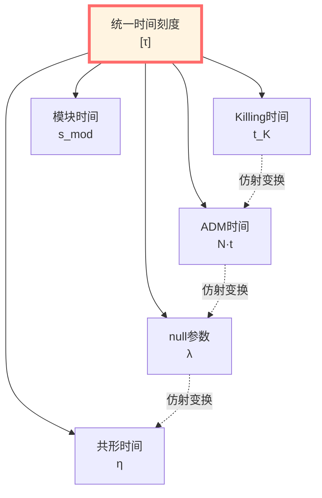
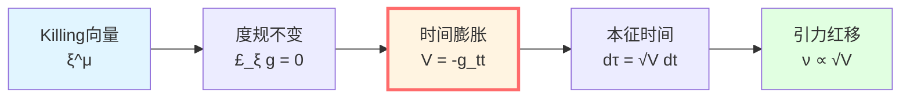
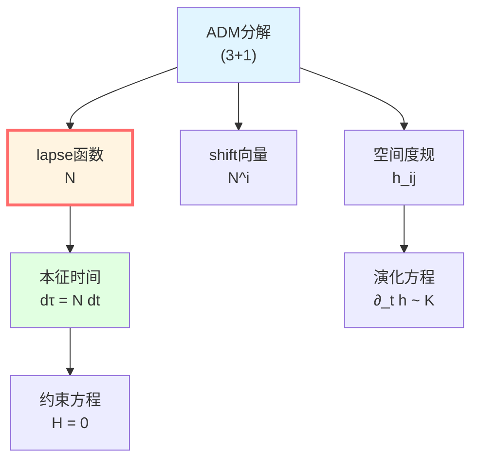
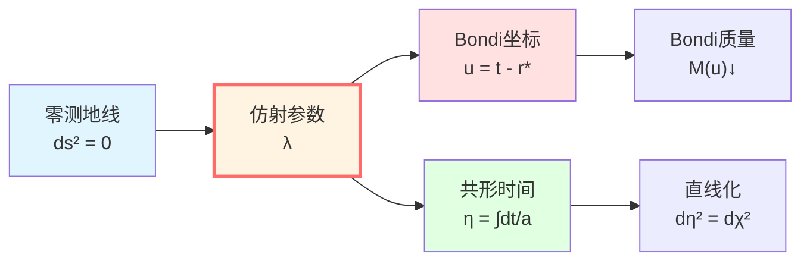
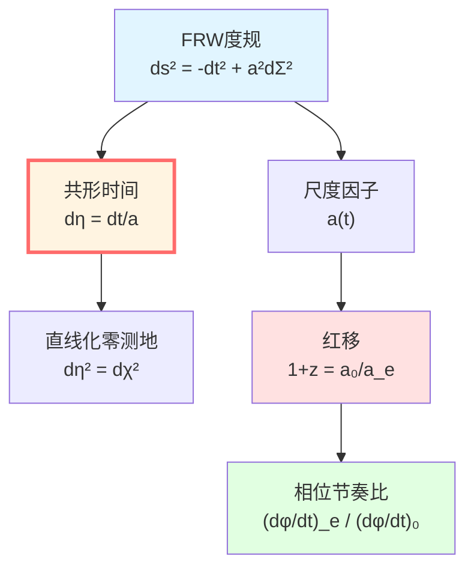
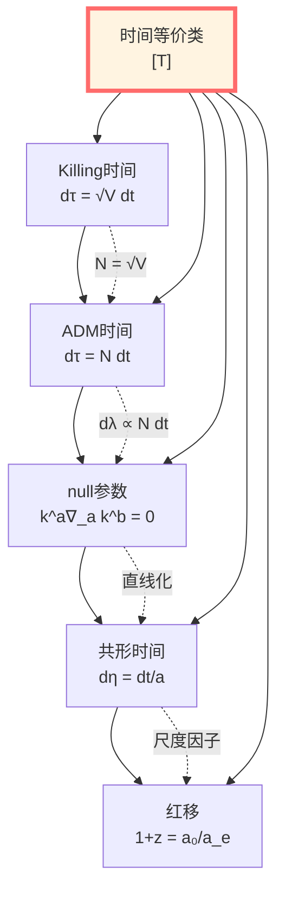

# 几何时间：时空度规的时钟

> *"几何时间是度规对观察者的投影。"*

## 🎯 核心命题

在广义相对论中，"时间"有多种几何实现，它们都属于统一时间刻度等价类 $[\tau]$：

| 时间类型 | 定义 | 适用场景 |
|---------|------|----------|
| **Killing时间** $t_K$ | $\partial/\partial t$ 是Killing向量 | 静态时空 |
| **ADM lapse** $N$ | $ds^2 = -N^2 dt^2 + \cdots$ | $(3+1)$分解 |
| **Null仿射参数** $\lambda$ | $k^a \nabla_a k^b = 0$ | 零测地线 |
| **共形时间** $\eta$ | $d\eta = dt/a(t)$ | FRW宇宙 |

**核心定理**：在适当条件下，这些时间通过**仿射变换**互相联系：

$$t_1 = \alpha t_2 + \beta, \quad \alpha > 0$$

从而属于同一等价类 $[T]$。

## 💡 直观图像：不同时钟的节奏

### 比喻：多个时钟

想象一个场景：
- **地面钟**：秒针均匀转动（Killing时间）
- **登山钟**：海拔越高走得越快（ADM lapse）
- **光子钟**：零质量，走无限快（null参数）
- **宇宙钟**：随宇宙膨胀变慢（共形时间）

**它们都测量"时间"，但节奏不同！**

**GLS理论说**：这些钟通过简单的重标联系，**本质上是同一个时间**！

## 📐 四种几何时间详解

### 1. Killing时间（静态时空）

**定义**：

在静态时空中，存在**Killing向量** $\xi^\mu$：

$$\mathcal{L}_\xi g_{\mu\nu} = 0$$

即度规沿 $\xi$ 不变。

**时间坐标**：选择坐标系使 $\xi = \partial/\partial t$，则：

$$ds^2 = -V(\mathbf{x})dt^2 + h_{ij}dx^i dx^j$$

其中 $V = -g_{tt} > 0$（类时）。

**本征时间关系**：

静止观察者（$dx^i = 0$）的本征时间：

$$d\tau = \sqrt{-g_{\mu\nu}dx^\mu dx^\nu} = \sqrt{V}\,dt$$

**物理意义**：
- $V$ 描述"时间膨胀因子"
- 引力场强处（$V$ 小），时间走得慢
- **红移公式**：$\nu_{\infty}/\nu_0 = \sqrt{V(0)}$

**例子：Schwarzschild度规**

$$ds^2 = -\left(1 - \frac{2M}{r}\right)dt^2 + \left(1 - \frac{2M}{r}\right)^{-1}dr^2 + r^2 d\Omega^2$$

$V(r) = 1 - 2M/r$，静止观察者：

$$d\tau = \sqrt{1 - \frac{2M}{r}}\,dt$$

**在视界** $r = 2M$：$d\tau = 0$（时间冻结！）

### 2. ADM lapse（$(3+1)$分解）

**ADM分解**：

将4维时空分解为3维空间 + 1维时间：

$$ds^2 = -N^2 dt^2 + h_{ij}(dx^i + N^i dt)(dx^j + N^j dt)$$

其中：
- $N$：**lapse函数**（坐标时间与本征时间之比）
- $N^i$：**shift向量**（坐标系漂移）
- $h_{ij}$：空间3-度规

**正交观察者**：

沿切片法向（$dx^i + N^i dt = 0$）的观察者：

$$d\tau = N\,dt$$

**物理意义**：
- $N$ 控制"时间流速"
- $N > 1$：坐标时间比本征时间快
- $N < 1$：坐标时间比本征时间慢

**ADM方程**：

Einstein方程可写成约束方程 + 演化方程：

**约束**（Hamiltonian + Momentum）：

$$\mathcal{H} = 0, \quad \mathcal{H}_i = 0$$

**演化**：

$$\frac{\partial h_{ij}}{\partial t} = \cdots, \quad \frac{\partial K_{ij}}{\partial t} = \cdots$$

其中 $K_{ij}$ 是外曲率。

**与Killing时间的关系**：

在静态时空，$N = \sqrt{V}$，两者等价！

### 3. Null仿射参数（零测地线）

**零测地线**：

光线或无质量粒子的世界线，满足 $ds^2 = 0$。

**测地线方程**：

$$k^a \nabla_a k^b = 0$$

其中 $k^a = dx^a/d\lambda$ 是切向量，$\lambda$ 是**仿射参数**。

**为什么需要仿射参数？**

对零测地线，$ds = 0$，不能用 $s$ 参数化！必须引入 $\lambda$。

**Bondi坐标**（Schwarzschild外区）：

**Tortoise坐标**：

$$r^* = r + 2M\ln\left|\frac{r}{2M} - 1\right|$$

**迟滞时间**：$u = t - r^*$

**超前时间**：$v = t + r^*$

**出射零面**：$u = \text{常数}$

**入射零面**：$v = \text{常数}$

**物理意义**：
- $u, v$ 是自然的"边界时间"
- 引力散射中，$u$ 对应渐近出态时间
- Bondi质量 $M(u)$ 沿 $u$ 单调不增（能量辐射！）

**FRW中的共形时间**：

$$d\eta = \frac{dt}{a(t)}$$

**零测地线**：$ds^2 = 0 \Rightarrow -dt^2 + a^2 d\chi^2 = 0$

用 $\eta$ 坐标：$d\eta^2 = d\chi^2$

**直线！**零测地线在共形时间中是直线！

### 4. 共形时间（FRW宇宙）

**FRW度规**：

$$ds^2 = -dt^2 + a(t)^2 \gamma_{ij}dx^i dx^j$$

其中 $a(t)$ 是尺度因子，$\gamma_{ij}$ 是单位3-球/平面/双曲面度规。

**共形时间定义**：

$$d\eta = \frac{dt}{a(t)}$$

积分：

$$\eta(t) = \int_0^t \frac{dt'}{a(t')}$$

**度规重写**：

$$ds^2 = a(\eta)^2\left[-d\eta^2 + \gamma_{ij}dx^i dx^j\right]$$

**物理意义**：
- 零测地线在 $(\eta, x^i)$ 坐标中是直线
- 共动观察者：$\tau = t$（本征时间 = 宇宙时间）
- 粒子视界：$\eta = \infty$ 对应可见宇宙边界

**红移-时间关系**：

对光子，$\nu \propto 1/a$：

$$1 + z = \frac{a(t_0)}{a(t_e)}$$

**相位节奏比**（第1篇）：

$$1 + z = \frac{(d\phi/dt)_e}{(d\phi/dt)_0}$$

**宇宙学红移是时间刻度的全局重标！**

## 🔑 时间等价类的统一

**定理**：在适当条件下，以下时间参数属于同一等价类：

$$[T] \sim \{\tau, t_K, N, \lambda, u, v, \eta, \omega^{-1}, z, s_{\text{mod}}\}$$

通过**仿射变换** $t_1 = \alpha t_2 + \beta$ 互相联系。

**证明思路**：

1. **Killing ↔ ADM**：静态时空中，$N = \sqrt{V}$，$d\tau = N\,dt = \sqrt{V}\,dt$

2. **ADM ↔ null**：ADM叶片的法向定义 $\lambda$，$d\lambda \propto N\,dt$

3. **null ↔ 共形**：FRW中，$\eta$ 直线化零测地线，$d\eta = d\lambda/a$

4. **共形 ↔ 红移**：$1+z = a_0/a_e = \eta_e/\eta_0$（适当归一化）

**所有这些转换都是仿射的！**

## 📊 与统一时间刻度的联系

**核心联系**：几何时间通过**本征时间-相位关系**（第1篇）接入统一刻度：

$$\phi = \frac{mc^2}{\hbar}\int d\tau$$

**各种几何时间**：

1. **Killing时间**：$d\tau = \sqrt{V}\,dt$
   $$\phi = \frac{mc^2}{\hbar}\int \sqrt{V}\,dt$$

2. **ADM时间**：$d\tau = N\,dt$
   $$\phi = \frac{mc^2}{\hbar}\int N\,dt$$

3. **共形时间**：$d\tau = a\,d\eta$（共动观察者）
   $$\phi = \frac{mc^2}{\hbar}\int a\,d\eta$$

**它们都给出相同的相位（沿同一世界线）！**

**与时间刻度同一式**：

$$\kappa(\omega) = \frac{\varphi'(\omega)}{\pi} = \frac{1}{2\pi}\text{tr}\,Q(\omega)$$

**几何解释**：$\kappa$ 是"局域时间密度"，积分后给出任何几何时间！

## 🤔 练习题

1. **概念理解**：
   - Killing时间与ADM时间有何区别？
   - null仿射参数为什么必要？
   - 共形时间如何直线化零测地线？

2. **计算练习**：
   - Schwarzschild度规：在 $r = 3M$ 处，计算 $d\tau/dt$
   - ADM分解：证明 $N = \sqrt{V}$（静态情况）
   - FRW宇宙：计算物质主导期的 $\eta(t)$

3. **物理应用**：
   - GPS卫星的时间修正涉及哪些几何时间？
   - Bondi质量如何随 $u$ 演化？
   - 宇宙学视界与 $\eta$ 的关系？

4. **进阶思考**：
   - 非静态时空中，能否定义全局Killing时间？
   - ADM能量守恒与时间平移不变性的关系？
   - 共形时间奇点对应什么物理过程？

---

**导航**：
- 上一篇：[04-time-scale-identity.md](./04-time-scale-identity.md) - 时间刻度同一式
- 下一篇：[06-modular-time.md](./06-modular-time.md) - 模块时间
- 概览：[00-time-overview.md](./00-time-overview.md) - 统一时间篇总览
