# Geometric Times: Clocks of Spacetime Metric

> *"Geometric time can be understood as the metric's projection onto the observer."*

## 🎯 Core Proposition

In general relativity, "time" has multiple geometric realizations. In the GLS theoretical framework, they are classified as the unified time scale equivalence class $[\tau]$:

| Time Type | Definition | Applicable Scenarios |
|-----------|-----------|---------------------|
| **Killing Time** $t_K$ | $\partial/\partial t$ is a Killing vector | Static spacetimes |
| **ADM Lapse** $N$ | $ds^2 = -N^2 dt^2 + \cdots$ | $(3+1)$ decomposition |
| **Null Affine Parameter** $\lambda$ | $k^a \nabla_a k^b = 0$ | Null geodesics |
| **Conformal Time** $\eta$ | $d\eta = dt/a(t)$ | FRW universe |

**Theoretical Proposition**: Under appropriate conditions, these times are related to each other through **affine transformations**:

$$t_1 = \alpha t_2 + \beta, \quad \alpha > 0$$

Thus mathematically belonging to the same equivalence class $[T]$.

## 💡 Intuitive Image: Rhythms of Different Clocks

### Analogy: Multiple Clocks

Imagine a scenario:
- **Ground Clock**: Second hand rotates uniformly (Killing time)
- **Mountain Clock**: Faster at higher altitudes (ADM lapse)
- **Photon Clock**: Massless, moves infinitely fast (null parameter)
- **Cosmic Clock**: Slows down with cosmic expansion (conformal time)

**They all serve as measures of time, but with different rhythms.**

**GLS Theory proposes**: These clocks are related by simple rescaling, **potentially pointing to the same underlying time concept**.

## 📐 Four Geometric Times Explained

### 1. Killing Time (Static Spacetimes)

**Definition**:

In static spacetimes, there exists a **Killing vector** $\xi^\mu$:

$$\mathcal{L}_\xi g_{\mu\nu} = 0$$

That is, the metric is invariant along $\xi$.

**Time Coordinate**: Choose a coordinate system such that $\xi = \partial/\partial t$, then:

$$ds^2 = -V(\mathbf{x})dt^2 + h_{ij}dx^i dx^j$$

where $V = -g_{tt} > 0$ (timelike).

**Proper Time Relation**:

For a stationary observer ($dx^i = 0$), the proper time:

$$d\tau = \sqrt{-g_{\mu\nu}dx^\mu dx^\nu} = \sqrt{V}\,dt$$

**Physical Meaning**:
- $V$ describes the "time dilation factor"
- Where the gravitational field is strong ($V$ small), time runs slow
- **Redshift Formula**: $\nu_{\infty}/\nu_0 = \sqrt{V(0)}$

**Example: Schwarzschild Metric**

$$ds^2 = -\left(1 - \frac{2M}{r}\right)dt^2 + \left(1 - \frac{2M}{r}\right)^{-1}dr^2 + r^2 d\Omega^2$$

$V(r) = 1 - 2M/r$, for a stationary observer:

$$d\tau = \sqrt{1 - \frac{2M}{r}}\,dt$$

**At the horizon** $r = 2M$: $d\tau = 0$ (time freezes)

```mermaid
graph LR
    K["Killing Vector<br/>ξ^μ"] --> G["Metric Invariant<br/>£_ξ g = 0"]
    G --> V["Time Dilation<br/>V = -g_tt"]
    V --> TAU["Proper Time<br/>dτ = √V dt"]
    TAU --> RED["Gravitational Redshift<br/>ν ∝ √V"]

    style K fill:#e1f5ff
    style V fill:#fff4e1,stroke:#ff6b6b,stroke-width:3px
    style RED fill:#e1ffe1
```

### 2. ADM Lapse ($(3+1)$ Decomposition)

**ADM Decomposition**:

Decompose 4-dimensional spacetime into 3-dimensional space + 1-dimensional time:

$$ds^2 = -N^2 dt^2 + h_{ij}(dx^i + N^i dt)(dx^j + N^j dt)$$

where:
- $N$: **lapse function** (ratio of coordinate time to proper time)
- $N^i$: **shift vector** (coordinate system drift)
- $h_{ij}$: spatial 3-metric

**Orthogonal Observer**:

For an observer along the slice normal ($dx^i + N^i dt = 0$):

$$d\tau = N\,dt$$

**Physical Meaning**:
- $N$ controls the "time flow rate"
- $N > 1$: coordinate time faster than proper time
- $N < 1$: coordinate time slower than proper time

**ADM Equations**:

Einstein's equations can be written as constraint equations + evolution equations:

**Constraints** (Hamiltonian + Momentum):

$$\mathcal{H} = 0, \quad \mathcal{H}_i = 0$$

**Evolution**:

$$\frac{\partial h_{ij}}{\partial t} = \cdots, \quad \frac{\partial K_{ij}}{\partial t} = \cdots$$

where $K_{ij}$ is the extrinsic curvature.

**Relation to Killing Time**:

In static spacetimes, $N = \sqrt{V}$, they are equivalent.

### 3. Null Affine Parameter (Null Geodesics)

**Null Geodesics**:

Worldlines of light rays or massless particles, satisfying $ds^2 = 0$.

**Geodesic Equation**:

$$k^a \nabla_a k^b = 0$$

where $k^a = dx^a/d\lambda$ is the tangent vector, $\lambda$ is the **affine parameter**.

**Why is an Affine Parameter Needed?**

For null geodesics, $ds = 0$, so we cannot parameterize with $s$, must introduce $\lambda$.

**Bondi Coordinates** (Schwarzschild exterior):

**Tortoise Coordinate**:

$$r^* = r + 2M\ln\left|\frac{r}{2M} - 1\right|$$

**Retarded Time**: $u = t - r^*$

**Advanced Time**: $v = t + r^*$

**Outgoing Null Surface**: $u = \text{constant}$

**Incoming Null Surface**: $v = \text{constant}$

**Physical Meaning**:
- $u, v$ are natural "boundary times"
- In gravitational scattering, $u$ corresponds to asymptotic outgoing state time
- Bondi mass $M(u)$ is monotonically non-increasing along $u$ (energy radiation)

**Conformal Time in FRW**:

$$d\eta = \frac{dt}{a(t)}$$

**Null Geodesics**: $ds^2 = 0 \Rightarrow -dt^2 + a^2 d\chi^2 = 0$

In $\eta$ coordinates: $d\eta^2 = d\chi^2$

**Straightening**: Null geodesics appear as straight lines in conformal time.

```mermaid
graph LR
    NULL["Null Geodesics<br/>ds² = 0"] --> AFF["Affine Parameter<br/>λ"]
    AFF --> BONDI["Bondi Coordinates<br/>u = t - r*"]
    AFF --> CONF["Conformal Time<br/>η = ∫dt/a"]

    BONDI --> MASS["Bondi Mass<br/>M(u)↓"]
    CONF --> STRAIGHT["Straightening<br/>dη² = dχ²"]

    style NULL fill:#e1f5ff
    style AFF fill:#fff4e1,stroke:#ff6b6b,stroke-width:3px
    style BONDI fill:#ffe1e1
    style CONF fill:#e1ffe1
```

### 4. Conformal Time (FRW Universe)

**FRW Metric**:

$$ds^2 = -dt^2 + a(t)^2 \gamma_{ij}dx^i dx^j$$

where $a(t)$ is the scale factor, $\gamma_{ij}$ is the unit 3-sphere/plane/hyperboloid metric.

**Conformal Time Definition**:

$$d\eta = \frac{dt}{a(t)}$$

Integrating:

$$\eta(t) = \int_0^t \frac{dt'}{a(t')}$$

**Metric Rewritten**:

$$ds^2 = a(\eta)^2\left[-d\eta^2 + \gamma_{ij}dx^i dx^j\right]$$

**Physical Meaning**:
- Null geodesics are straight lines in $(\eta, x^i)$ coordinates
- Comoving observer: $\tau = t$ (proper time = cosmic time)
- Particle horizon: $\eta = \infty$ corresponds to the visible universe boundary

**Redshift-Time Relation**:

For photons, $\nu \propto 1/a$:

$$1 + z = \frac{a(t_0)}{a(t_e)}$$

**Phase Rhythm Ratio** (Chapter 1):

$$1 + z = \frac{(d\phi/dt)_e}{(d\phi/dt)_0}$$

**Cosmological redshift can be viewed as a global rescaling of the time scale.**

```mermaid
graph TB
    FRW["FRW Metric<br/>ds² = -dt² + a²dΣ²"] --> A["Scale Factor<br/>a(t)"]
    FRW --> ETA["Conformal Time<br/>dη = dt/a"]

    ETA --> STRAIGHT["Straighten Null Geodesics<br/>dη² = dχ²"]
    A --> Z["Redshift<br/>1+z = a₀/a_e"]
    Z --> PHASE["Phase Rhythm Ratio<br/>(dφ/dt)_e / (dφ/dt)₀"]

    style FRW fill:#e1f5ff
    style ETA fill:#fff4e1,stroke:#ff6b6b,stroke-width:3px
    style Z fill:#ffe1e1
    style PHASE fill:#e1ffe1
```

## 🔑 Unification of Time Equivalence Classes

**Theoretical Proposition**: Under appropriate conditions, the following time parameters belong to the same equivalence class:

$$[T] \sim \{\tau, t_K, N, \lambda, u, v, \eta, \omega^{-1}, z, s_{\text{mod}}\}$$

Related to each other through **affine transformations** $t_1 = \alpha t_2 + \beta$.

**Proof Outline**:

1.  **Killing ↔ ADM**: In static spacetimes, $N = \sqrt{V}$, $d\tau = N\,dt = \sqrt{V}\,dt$

2.  **ADM ↔ null**: The normal to ADM slices defines $\lambda$, $d\lambda \propto N\,dt$

3.  **null ↔ conformal**: In FRW, $\eta$ straightens null geodesics, $d\eta = d\lambda/a$

4.  **conformal ↔ redshift**: $1+z = a_0/a_e = \eta_e/\eta_0$ (with appropriate normalization)

**All these transformations are affine.**

```mermaid
graph TB
    KILLING["Killing Time<br/>dτ = √V dt"] --> ADM["ADM Time<br/>dτ = N dt"]
    ADM --> NULL["null parameter<br/>k^a∇_a k^b = 0"]
    NULL --> CONF["Conformal Time<br/>dη = dt/a"]
    CONF --> Z["Redshift<br/>1+z = a₀/a_e"]

    KILLING -.->|"N = √V"| ADM
    ADM -.->|"dλ ∝ N dt"| NULL
    NULL -.->|"straightening"| CONF
    CONF -.->|"scale factor"| Z

    ALL["Time Equivalence Class<br/>[T]"] --> KILLING
    ALL --> ADM
    ALL --> NULL
    ALL --> CONF
    ALL --> Z

    style ALL fill:#fff4e1,stroke:#ff6b6b,stroke-width:4px
```

## 📊 Connection to Unified Time Scale

**Core Connection**: Geometric times connect to the unified scale through the **proper time-phase relation** (Chapter 1):

$$\phi = \frac{mc^2}{\hbar}\int d\tau$$

**Various Geometric Times**:

1.  **Killing Time**: $d\tau = \sqrt{V}\,dt$
    $$\phi = \frac{mc^2}{\hbar}\int \sqrt{V}\,dt$$

2.  **ADM Time**: $d\tau = N\,dt$
    $$\phi = \frac{mc^2}{\hbar}\int N\,dt$$

3.  **Conformal Time**: $d\tau = a\,d\eta$ (comoving observer)
    $$\phi = \frac{mc^2}{\hbar}\int a\,d\eta$$

**Theoretically, they should give the same phase (along the same worldline).**

**Connection to Time Scale Identity**:

$$\kappa(\omega) = \frac{\varphi'(\omega)}{\pi} = \frac{1}{2\pi}\text{tr}\,Q(\omega)$$

**Geometric Interpretation**: $\kappa$ is the "local time density," integrating it gives any geometric time.

## 🤔 Exercises

1.  **Conceptual Understanding**:
    - What is the difference between Killing time and ADM time?
    - Why is a null affine parameter necessary?
    - How does conformal time straighten null geodesics?

2.  **Calculation Exercises**:
    - Schwarzschild metric: Calculate $d\tau/dt$ at $r = 3M$
    - ADM decomposition: Prove $N = \sqrt{V}$ (static case)
    - FRW universe: Calculate $\eta(t)$ for matter-dominated era

3.  **Physical Applications**:
    - Which geometric times are involved in GPS satellite time corrections?
    - How does Bondi mass evolve with $u$?
    - What is the relationship between cosmological horizon and $\eta$?

4.  **Advanced Thinking**:
    - Can we define a global Killing time in non-static spacetimes?
    - What is the relationship between ADM energy conservation and time translation invariance?
    - What physical process corresponds to conformal time singularities?

---

**Navigation**:
- Previous: [04-time-scale-identity_en.md](04-time-scale-identity_en.md) - Time Scale Identity
- Next: [06-modular-time_en.md](06-modular-time_en.md) - Modular Time
- Overview: [00-time-overview_en.md](00-time-overview_en.md) - Unified Time Overview
- GLS theory: unified-time-scale-geometry.md
