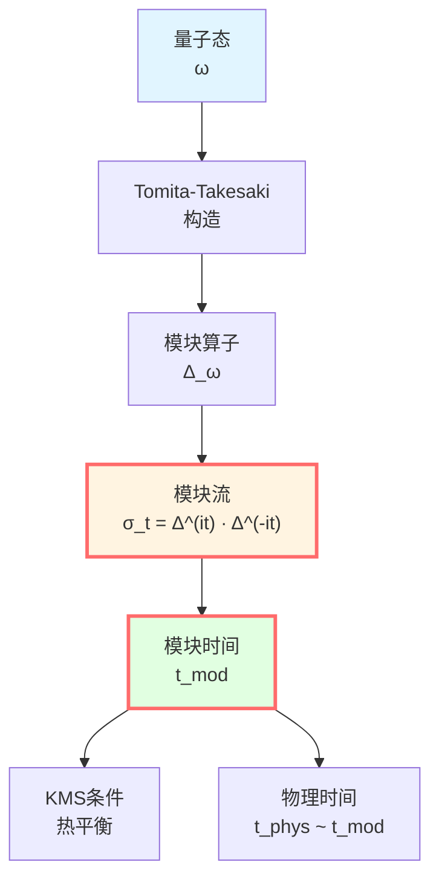
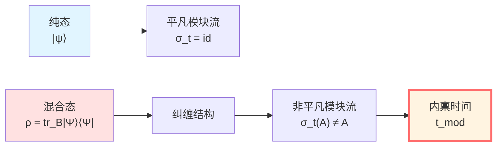
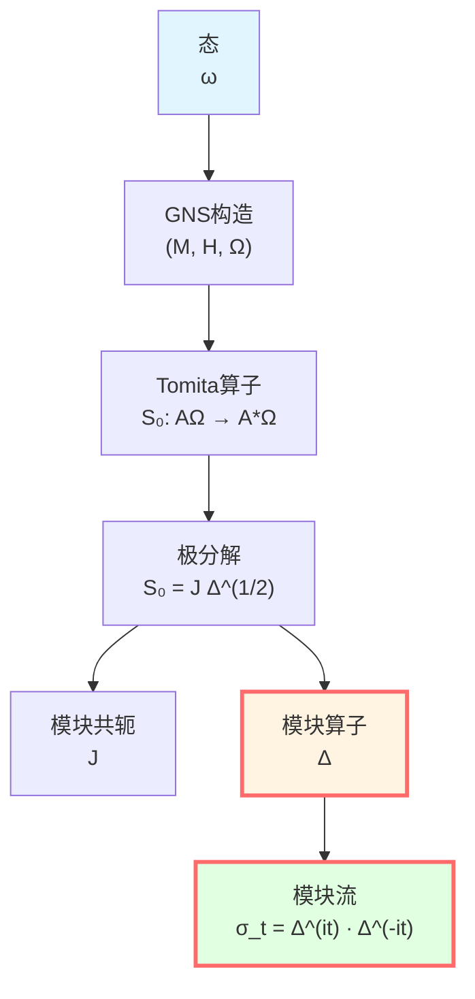
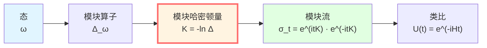
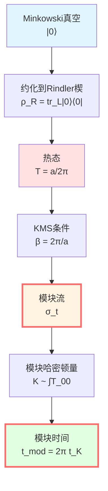
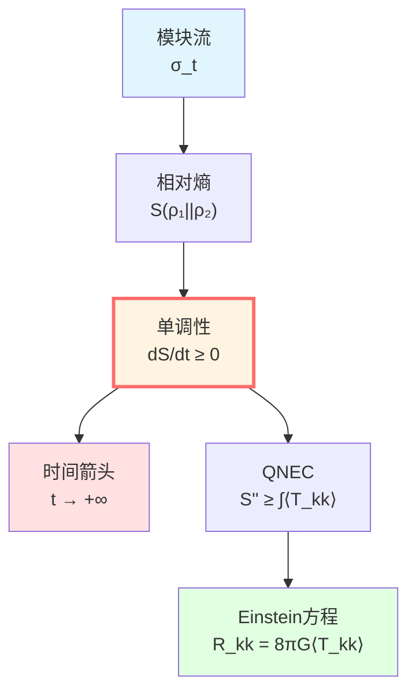
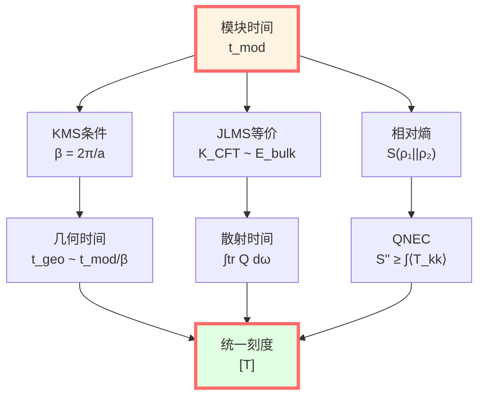

# 模块时间：量子态的内禀演化

> *"模块时间是量子态自己的时钟。"*

## 🎯 核心命题

**定义**（Tomita-Takesaki模块流）：

对von Neumann代数 $\mathcal{M}$ 和忠实态 $\omega$，存在唯一的一参数自同构群：

$$\boxed{\sigma_t^\omega: \mathcal{M} \to \mathcal{M}, \quad t \in \mathbb{R}}$$

称为**模块流**（modular flow），它由**模块算子** $\Delta_\omega$ 生成：

$$\sigma_t^\omega(A) = \Delta_\omega^{it} A \Delta_\omega^{-it}$$

**热时间假设**（Connes-Rovelli, 1994）：

模块流的参数 $t$ 就是物理时间！

**KMS条件**：

模块流对应温度为 $\beta^{-1}$ 的热平衡态：

$$\omega(AB) = \omega(B\sigma_{i\beta}^\omega(A))$$

**物理意义**：
- $\sigma_t^\omega$：态 $\omega$ 的"内禀演化"
- $t$：不依赖外部时钟的"内禀时间"
- $\beta$：与几何时间的联系（Unruh温度！）

## 💡 直观图像：量子系统的自转

### 比喻：地球的自转

地球有两种时间：
- **外部时间**：太阳系时间（公转周期）
- **内部时间**：地球自转（24小时）

**类比**：
- 地球 → 量子态 $\omega$
- 自转 → 模块流 $\sigma_t^\omega$
- 自转周期 → KMS温度 $\beta$

**关键**：即使没有太阳（外部参照），地球自转仍定义了"一天"！

**模块时间说**：量子态有"内禀自转"，定义自己的时间！

### 量子态的"记忆"

想象一个量子系统：
- **纯态** $|\psi\rangle$：没有记忆，模块流平凡（$\sigma_t = \text{id}$）
- **混合态** $\rho$：有"纠缠记忆"，模块流非平凡

**例子**：半空间纠缠态
- 整体：纯态 $|\Psi\rangle$
- 半空间A：约化态 $\rho_A = \text{tr}_B|\Psi\rangle\langle\Psi|$
- $\rho_A$ 的模块流 → 半空间A的"内禀时间"！

**物理意义**：纠缠结构编码了时间！

## 📐 Tomita-Takesaki理论

### 数学构造

**设置**：
- $\mathcal{M}$：von Neumann代数（可观测量代数）
- $\omega$：忠实正规态（量子态）
- $\Omega$：GNS表示中的循环分离向量

**Tomita算子**：

定义反线性算子 $S_0$：

$$S_0: A\Omega \mapsto A^*\Omega, \quad A \in \mathcal{M}$$

**极分解**：

$$S_0 = J\Delta^{1/2}$$

其中：
- $J$：反幺正算子（模块共轭）
- $\Delta$：正算子（模块算子）

**模块流**：

$$\sigma_t^\omega(A) = \Delta^{it} A \Delta^{-it}$$

**Tomita-Takesaki定理**：

$$\sigma_t^\omega(\mathcal{M}) = \mathcal{M}$$

即模块流保持代数！

### KMS条件

**定义**（KMS态）：

态 $\omega$ 在温度 $\beta^{-1}$ 下是KMS态，如果对所有 $A, B \in \mathcal{M}$：

$$\omega(AB) = \omega(B\sigma_{i\beta}^\omega(A))$$

**物理意义**：
- 热平衡条件的数学形式
- $\beta = 1/(k_B T)$：逆温度
- $\sigma_{i\beta}$：虚时间演化（解析延拓）

**例子**：正则系综

$$\omega(A) = \frac{1}{Z}\text{tr}(e^{-\beta H}A)$$

其模块算子：

$$\Delta_\omega = e^{-\beta H} \otimes e^{\beta H}$$

模块流：

$$\sigma_t^\omega(A) = e^{itH}Ae^{-itH}$$

**完美！**模块流就是正常的时间演化 $U(t) = e^{-iHt}$！

### 模块哈密顿量

**定义**：

$$K_\omega = -\ln \Delta_\omega$$

称为**模块哈密顿量**。

**模块流重写**：

$$\sigma_t^\omega(A) = e^{itK_\omega}Ae^{-itK_\omega}$$

**物理类比**：
- $K_\omega$：生成"内禀时间演化"的"能量"
- $t$：模块时间
- 形式与 $e^{-iHt}Ae^{iHt}$ 完全一样！

**差别**：$K_\omega$ 不一定是局域哈密顿量！

## 🌀 热时间假设

### Connes-Rovelli提议（1994）

**核心思想**：

在没有外部时钟的量子引力中，**模块流参数 $t$ 就是物理时间**！

**论证**：
1. 在一般协变理论中，没有外部时间参数
2. 给定态 $\omega$，模块流 $\sigma_t^\omega$ 内在地定义
3. 对热平衡态，$t$ 正比于温度测量的"时间"
4. **所以**：物理时间 = 模块时间

**数学形式**：

物理时间流 $\alpha_t$ 与模块流等价：

$$\alpha_t \sim \sigma_t^\omega$$

在外自同构群 $\text{Out}(\mathcal{M})$ 意义下。

**推论**：

不同态 $\omega, \omega'$ 的模块流通过重标联系：

$$\sigma_t^{\omega'} = \text{Ad}(u_t) \circ \sigma_{f(t)}^\omega$$

其中 $u_t$ 是内自同构，$f(t) = \alpha t + \beta$。

**时间刻度等价类**：

$$[t_{\text{mod}}] = \{\alpha t + \beta \mid \alpha > 0\}$$

### 与几何时间的联系

**Unruh效应**：

加速观察者在真空中感受温度：

$$T_{\text{Unruh}} = \frac{\hbar a}{2\pi c k_B}$$

其中 $a$ 是固有加速度。

**Rindler楔**：

- Rindler坐标：$ds^2 = -(ax)^2 dt^2 + dx^2 + dy^2 + dz^2$
- Minkowski真空 $|0\rangle$ 约化到Rindler楔
- 约化态 $\rho_R$ 是温度 $T = a/(2\pi)$ 的热态！

**模块哈密顿量**：

$$K = 2\pi \int_{\text{Rindler}} T_{00} \xi \cdot k$$

其中 $\xi = a x \partial_t$ 是Killing向量。

**模块时间与Killing时间**：

$$t_{\text{mod}} = 2\pi t_{\text{Killing}}$$

**完美对应！**

### 半空间纠缠

**设置**：
- 真空态 $|0\rangle$ 在Minkowski空间
- 分割：$A = \{x > 0\}$，$B = \{x < 0\}$
- 约化态：$\rho_A = \text{tr}_B |0\rangle\langle 0|$

**模块哈密顿量**（Bisognano-Wichmann, 1976）：

$$K_A = 2\pi \int_{x>0} T_{00} x\, dx dy dz$$

**物理意义**：
- $K_A$ 是Rindler boost生成元！
- 模块流 = Lorentz boost
- 模块时间 = boost参数（快度）

**与本征时间的关系**：

沿Rindler轨道 $x = x_0$：

$$d\tau = x_0\, d\eta$$

其中 $\eta$ 是boost参数（快度）。

**模块时间**：

$$t_{\text{mod}} = 2\pi \eta$$

**完美！模块时间正比于boost快度！**

## 🔑 相对熵与时间箭头

### 相对熵单调性

**定义**（相对熵）：

$$S(\rho_1 \| \rho_2) = \text{tr}(\rho_1 \ln\rho_1 - \rho_1 \ln\rho_2)$$

**单调性定理**：

对包含关系 $\mathcal{A}_1 \subset \mathcal{A}_2$：

$$S(\rho_1|_{\mathcal{A}_1} \| \rho_2|_{\mathcal{A}_1}) \leq S(\rho_1|_{\mathcal{A}_2} \| \rho_2|_{\mathcal{A}_2})$$

**时间箭头**：

沿模块流演化，相对熵单调不增或不减（取决于方向）！

**ANEC/QNEC联系**：

相对熵单调性 $\Leftrightarrow$ 量子零能条件（QNEC）

$$S''_{\text{out}} \geq \frac{2\pi}{\hbar}\int \langle T_{kk}\rangle dA$$

**物理意义**：
- 模块时间提供"时间箭头"
- 相对熵沿模块时间单调
- 与热力学第二定律一致！

## 📊 与统一时间刻度的联系

### 模块时间 ↔ 几何时间

**定理**：在适当条件下（Rindler楔、加速观察者等）：

$$t_{\text{mod}} = \beta t_{\text{geo}}$$

其中 $\beta$ 由KMS温度确定。

**Unruh效应**：

$$\beta = \frac{2\pi}{a}, \quad T = \frac{a}{2\pi}$$

所以：

$$t_{\text{mod}} = 2\pi \frac{t_{\text{Rindler}}}{a}$$

### 模块时间 ↔ 散射时间

在AdS/CFT对应中：
- 边界CFT的模块哈密顿量 $K_{\text{CFT}}$
- 体bulk的准局域能量 $E_{\text{bulk}}$

**对应**：

$$K_{\text{CFT}} \leftrightarrow E_{\text{bulk}}$$

**时间对应**：

$$t_{\text{mod}}^{\text{CFT}} \leftrightarrow t_{\text{geo}}^{\text{bulk}}$$

通过JLMS等价！

### 统一刻度

**时间刻度等价类**：

$$[T] \sim \{\tau, t_K, N, \lambda, u, v, \eta, \omega^{-1}, z, t_{\text{mod}}\}$$

**模块时间的位置**：
- 通过KMS条件连接几何时间
- 通过边界对应连接散射时间
- 通过相对熵连接熵演化

**完整闭环！**

## 🎓 深刻意义

### 1. 时间的涌现

**传统观点**：时间是外部参数

**模块观点**：时间从量子态的纠缠结构中涌现！

**论证**：
1. 纯态 → 无模块流 → 无时间
2. 纠缠态 → 非平凡模块流 → 时间涌现
3. **纠缠 = 时间的起源**

### 2. 引力即热力学

**Jacobson论证**（1995）：
- 广义熵 $S_{\text{gen}} = A/(4G\hbar) + S_{\text{out}}$
- 相对熵单调性 → QNEC
- QNEC → Einstein方程

**模块视角**：
- 模块哈密顿量 $K \sim \int T_{kk}$
- 相对熵沿 $K$ 演化
- 单调性 → 能量条件 → 引力方程

**引力是模块流的几何投影！**

### 3. 量子纠错与时间

**Almheiri等（2015）**：时间演化可视为量子纠错码

- 代码子空间：物理态
- 模块流：时间演化
- 纠缠楔重构：纠错恢复

**时间 = 纠缠编码结构**

## 🤔 练习题

1. **概念理解**：
   - 为什么纯态的模块流平凡？
   - KMS条件的物理意义是什么？
   - 热时间假设的核心论点？

2. **计算练习**：
   - 正则系综 $\omega(A) = \text{tr}(e^{-\beta H}A)/Z$，计算 $\sigma_t^\omega(A)$
   - Unruh温度 $T = a/(2\pi)$，计算加速度 $a = 1g$ 对应的温度
   - 半空间模块哈密顿量 $K = 2\pi\int T_{00} x dx$，验证boost生成元

3. **物理应用**：
   - Rindler观察者如何通过模块流理解Unruh效应？
   - 黑洞视界附近的模块流是什么？
   - AdS/CFT中边界模块流如何对应bulk时间？

4. **进阶思考**：
   - 模块流在量子引力中的角色？
   - 相对熵单调性与因果律的关系？
   - 如何从模块流推导Einstein方程？

---

**导航**：
- 上一篇：[05-geometric-times.md](./05-geometric-times.md) - 几何时间
- 下一篇：[07-cosmological-redshift.md](./07-cosmological-redshift.md) - 宇宙学红移
- 概览：[00-time-overview.md](./00-time-overview.md) - 统一时间篇总览
- GLS理论：[unified-time-scale-geometry.md](../../euler-gls-paper-time/unified-time-scale-geometry.md)
- 参考文献：
  - Connes & Rovelli, "Von Neumann algebra automorphisms and time–thermodynamics relation" (1994)
  - Bisognano & Wichmann, "On the Duality Condition for Quantum Fields" (1976)
  - Tomita-Takesaki theory: Takesaki, "Theory of Operator Algebras" (2002)
