# Modular Time: Intrinsic Evolution of Quantum States

> *"Modular time is the quantum state's own clock."*

## 🎯 Core Proposition

**Definition** (Tomita-Takesaki Modular Flow):

For a von Neumann algebra $\mathcal{M}$ and a faithful state $\omega$, there exists a unique one-parameter automorphism group:

$$\boxed{\sigma_t^\omega: \mathcal{M} \to \mathcal{M}, \quad t \in \mathbb{R}}$$

called the **modular flow**, generated by the **modular operator** $\Delta_\omega$:

$$\sigma_t^\omega(A) = \Delta_\omega^{it} A \Delta_\omega^{-it}$$

**Thermal Time Hypothesis** (Connes-Rovelli, 1994):

The parameter $t$ of the modular flow is physical time!

**KMS Condition**:

The modular flow corresponds to a thermal equilibrium state at temperature $\beta^{-1}$:

$$\omega(AB) = \omega(B\sigma_{i\beta}^\omega(A))$$

**Physical Meaning**:
- $\sigma_t^\omega$: "intrinsic evolution" of state $\omega$
- $t$: "intrinsic time" independent of external clocks
- $\beta$: connection to geometric time (Unruh temperature!)

```mermaid
graph TB
    OMEGA["Quantum State<br/>ω"] --> TT["Tomita-Takesaki<br/>Construction"]
    TT --> DELTA["Modular Operator<br/>Δ_ω"]
    DELTA --> FLOW["Modular Flow<br/>σ_t = Δ^(it) · Δ^(-it)"]
    FLOW --> TIME["Modular Time<br/>t_mod"]

    TIME --> KMS["KMS Condition<br/>Thermal Equilibrium"]
    TIME --> PHY["Physical Time<br/>t_phys ~ t_mod"]

    style OMEGA fill:#e1f5ff
    style FLOW fill:#fff4e1,stroke:#ff6b6b,stroke-width:3px
    style TIME fill:#e1ffe1,stroke:#ff6b6b,stroke-width:3px
```

## 💡 Intuitive Image: Self-Rotation of Quantum Systems

### Analogy: Earth's Rotation

Earth has two types of time:
- **External Time**: Solar system time (orbital period)
- **Internal Time**: Earth's rotation (24 hours)

**Analogy**:
- Earth → quantum state $\omega$
- Rotation → modular flow $\sigma_t^\omega$
- Rotation period → KMS temperature $\beta$

**Key Point**: Even without the Sun (external reference), Earth's rotation still defines a "day"!

**Modular Time says**: Quantum states have "intrinsic rotation," defining their own time!

### "Memory" of Quantum States

Imagine a quantum system:
- **Pure State** $|\psi\rangle$: no memory, trivial modular flow ($\sigma_t = \text{id}$)
- **Mixed State** $\rho$: has "entanglement memory," non-trivial modular flow

**Example**: Half-Space Entangled State
- Global: pure state $|\Psi\rangle$
- Half-space A: reduced state $\rho_A = \text{tr}_B|\Psi\rangle\langle\Psi|$
- Modular flow of $\rho_A$ → "intrinsic time" of half-space A!

**Physical Meaning**: Entanglement structure encodes time!

```mermaid
graph LR
    PURE["Pure State<br/>|ψ⟩"] --> TRIV["Trivial Modular Flow<br/>σ_t = id"]
    MIX["Mixed State<br/>ρ = tr_B|Ψ⟩⟨Ψ|"] --> ENT["Entanglement Structure"]
    ENT --> MOD["Non-Trivial Modular Flow<br/>σ_t(A) ≠ A"]
    MOD --> TIME["Intrinsic Time<br/>t_mod"]

    style PURE fill:#e1f5ff
    style MIX fill:#ffe1e1
    style TIME fill:#fff4e1,stroke:#ff6b6b,stroke-width:3px
```

## 📐 Tomita-Takesaki Theory

### Mathematical Construction

**Setup**:
- $\mathcal{M}$: von Neumann algebra (observable algebra)
- $\omega$: faithful normal state (quantum state)
- $\Omega$: cyclic separating vector in GNS representation

**Tomita Operator**:

Define an anti-linear operator $S_0$:

$$S_0: A\Omega \mapsto A^*\Omega, \quad A \in \mathcal{M}$$

**Polar Decomposition**:

$$S_0 = J\Delta^{1/2}$$

where:
- $J$: anti-unitary operator (modular conjugation)
- $\Delta$: positive operator (modular operator)

**Modular Flow**:

$$\sigma_t^\omega(A) = \Delta^{it} A \Delta^{-it}$$

**Tomita-Takesaki Theorem**:

$$\sigma_t^\omega(\mathcal{M}) = \mathcal{M}$$

That is, the modular flow preserves the algebra!

```mermaid
graph TB
    STATE["State<br/>ω"] --> GNS["GNS Construction<br/>(M, H, Ω)"]
    GNS --> S["Tomita Operator<br/>S₀: AΩ → A*Ω"]
    S --> POLAR["Polar Decomposition<br/>S₀ = J Δ^(1/2)"]
    POLAR --> J["Modular Conjugation<br/>J"]
    POLAR --> DELTA["Modular Operator<br/>Δ"]
    DELTA --> FLOW["Modular Flow<br/>σ_t = Δ^(it) · Δ^(-it)"]

    style STATE fill:#e1f5ff
    style DELTA fill:#fff4e1,stroke:#ff6b6b,stroke-width:3px
    style FLOW fill:#e1ffe1,stroke:#ff6b6b,stroke-width:3px
```

### KMS Condition

**Definition** (KMS State):

A state $\omega$ is a KMS state at temperature $\beta^{-1}$ if for all $A, B \in \mathcal{M}$:

$$\omega(AB) = \omega(B\sigma_{i\beta}^\omega(A))$$

**Physical Meaning**:
- Mathematical form of thermal equilibrium condition
- $\beta = 1/(k_B T)$: inverse temperature
- $\sigma_{i\beta}$: imaginary time evolution (analytic continuation)

**Example**: Canonical Ensemble

$$\omega(A) = \frac{1}{Z}\text{tr}(e^{-\beta H}A)$$

Its modular operator:

$$\Delta_\omega = e^{-\beta H} \otimes e^{\beta H}$$

Modular flow:

$$\sigma_t^\omega(A) = e^{itH}Ae^{-itH}$$

**Perfect!** The modular flow is exactly the normal time evolution $U(t) = e^{-iHt}$!

### Modular Hamiltonian

**Definition**:

$$K_\omega = -\ln \Delta_\omega$$

called the **modular Hamiltonian**.

**Modular Flow Rewritten**:

$$\sigma_t^\omega(A) = e^{itK_\omega}Ae^{-itK_\omega}$$

**Physical Analogy**:
- $K_\omega$: "energy" generating "intrinsic time evolution"
- $t$: modular time
- Form identical to $e^{-iHt}Ae^{iHt}$!

**Difference**: $K_\omega$ is not necessarily a local Hamiltonian!

```mermaid
graph LR
    OMEGA["State<br/>ω"] --> DELTA["Modular Operator<br/>Δ_ω"]
    DELTA --> K["Modular Hamiltonian<br/>K = -ln Δ"]
    K --> FLOW["Modular Flow<br/>σ_t = e^(itK) · e^(-itK)"]
    FLOW --> ANALOGY["Analogy<br/>U(t) = e^(-iHt)"]

    style OMEGA fill:#e1f5ff
    style K fill:#fff4e1,stroke:#ff6b6b,stroke-width:3px
    style FLOW fill:#e1ffe1
```

## 🌀 Thermal Time Hypothesis

### Connes-Rovelli Proposal (1994)

**Core Idea**:

In quantum gravity without external clocks, **the modular flow parameter $t$ is physical time**!

**Argument**:
1. In generally covariant theories, there is no external time parameter
2. Given state $\omega$, modular flow $\sigma_t^\omega$ is intrinsically defined
3. For thermal equilibrium states, $t$ is proportional to the "time" measured by temperature
4. **Therefore**: physical time = modular time

**Mathematical Form**:

Physical time flow $\alpha_t$ is equivalent to modular flow:

$$\alpha_t \sim \sigma_t^\omega$$

in the sense of the outer automorphism group $\text{Out}(\mathcal{M})$.

**Corollary**:

Modular flows of different states $\omega, \omega'$ are related by rescaling:

$$\sigma_t^{\omega'} = \text{Ad}(u_t) \circ \sigma_{f(t)}^\omega$$

where $u_t$ is an inner automorphism, $f(t) = \alpha t + \beta$.

**Time Scale Equivalence Class**:

$$[t_{\text{mod}}] = \{\alpha t + \beta \mid \alpha > 0\}$$

### Connection to Geometric Time

**Unruh Effect**:

An accelerating observer experiences temperature in vacuum:

$$T_{\text{Unruh}} = \frac{\hbar a}{2\pi c k_B}$$

where $a$ is the proper acceleration.

**Rindler Wedge**:

- Rindler coordinates: $ds^2 = -(ax)^2 dt^2 + dx^2 + dy^2 + dz^2$
- Minkowski vacuum $|0\rangle$ reduced to Rindler wedge
- Reduced state $\rho_R$ is a thermal state at temperature $T = a/(2\pi)$!

**Modular Hamiltonian**:

$$K = 2\pi \int_{\text{Rindler}} T_{00} \xi \cdot k$$

where $\xi = a x \partial_t$ is the Killing vector.

**Modular Time and Killing Time**:

$$t_{\text{mod}} = 2\pi t_{\text{Killing}}$$

**Perfect correspondence!**

```mermaid
graph TB
    MINK["Minkowski Vacuum<br/>|0⟩"] --> RIND["Reduce to Rindler Wedge<br/>ρ_R = tr_L|0⟩⟨0|"]
    RIND --> TEMP["Thermal State<br/>T = a/2π"]
    TEMP --> KMS["KMS Condition<br/>β = 2π/a"]
    KMS --> MOD["Modular Flow<br/>σ_t"]
    MOD --> K["Modular Hamiltonian<br/>K ~ ∫T_00"]
    K --> TIME["Modular Time<br/>t_mod = 2π t_K"]

    style MINK fill:#e1f5ff
    style TEMP fill:#ffe1e1
    style MOD fill:#fff4e1,stroke:#ff6b6b,stroke-width:3px
    style TIME fill:#e1ffe1,stroke:#ff6b6b,stroke-width:3px
```

### Half-Space Entanglement

**Setup**:
- Vacuum state $|0\rangle$ in Minkowski space
- Partition: $A = \{x > 0\}$, $B = \{x < 0\}$
- Reduced state: $\rho_A = \text{tr}_B |0\rangle\langle 0|$

**Modular Hamiltonian** (Bisognano-Wichmann, 1976):

$$K_A = 2\pi \int_{x>0} T_{00} x\, dx dy dz$$

**Physical Meaning**:
- $K_A$ is the Rindler boost generator!
- Modular flow = Lorentz boost
- Modular time = boost parameter (rapidity)

**Relation to Proper Time**:

Along Rindler orbit $x = x_0$:

$$d\tau = x_0\, d\eta$$

where $\eta$ is the boost parameter (rapidity).

**Modular Time**:

$$t_{\text{mod}} = 2\pi \eta$$

**Perfect! Modular time is proportional to boost rapidity!**

## 🔑 Relative Entropy and Time Arrow

### Relative Entropy Monotonicity

**Definition** (Relative Entropy):

$$S(\rho_1 \| \rho_2) = \text{tr}(\rho_1 \ln\rho_1 - \rho_1 \ln\rho_2)$$

**Monotonicity Theorem**:

For inclusion relation $\mathcal{A}_1 \subset \mathcal{A}_2$:

$$S(\rho_1|_{\mathcal{A}_1} \| \rho_2|_{\mathcal{A}_1}) \leq S(\rho_1|_{\mathcal{A}_2} \| \rho_2|_{\mathcal{A}_2})$$

**Time Arrow**:

Under modular flow evolution, relative entropy is monotonically non-increasing or non-decreasing (depending on direction)!

**ANEC/QNEC Connection**:

Relative entropy monotonicity $\Leftrightarrow$ Quantum Null Energy Condition (QNEC)

$$S''_{\text{out}} \geq \frac{2\pi}{\hbar}\int \langle T_{kk}\rangle dA$$

**Physical Meaning**:
- Modular time provides "time arrow"
- Relative entropy is monotonic along modular time
- Consistent with the second law of thermodynamics!

```mermaid
graph TB
    MOD["Modular Flow<br/>σ_t"] --> REL["Relative Entropy<br/>S(ρ₁||ρ₂)"]
    REL --> MONO["Monotonicity<br/>dS/dt ≥ 0"]
    MONO --> ARROW["Time Arrow<br/>t → +∞"]

    MONO --> QNEC["QNEC<br/>S'' ≥ ∫⟨T_kk⟩"]
    QNEC --> EIN["Einstein Equations<br/>R_kk = 8πG⟨T_kk⟩"]

    style MOD fill:#e1f5ff
    style MONO fill:#fff4e1,stroke:#ff6b6b,stroke-width:3px
    style ARROW fill:#ffe1e1
    style EIN fill:#e1ffe1
```

## 📊 Connection to Unified Time Scale

### Modular Time ↔ Geometric Time

**Theorem**: Under appropriate conditions (Rindler wedge, accelerating observer, etc.):

$$t_{\text{mod}} = \beta t_{\text{geo}}$$

where $\beta$ is determined by KMS temperature.

**Unruh Effect**:

$$\beta = \frac{2\pi}{a}, \quad T = \frac{a}{2\pi}$$

Therefore:

$$t_{\text{mod}} = 2\pi \frac{t_{\text{Rindler}}}{a}$$

### Modular Time ↔ Scattering Time

In AdS/CFT correspondence:
- Modular Hamiltonian $K_{\text{CFT}}$ of boundary CFT
- Quasi-local energy $E_{\text{bulk}}$ of bulk

**Correspondence**:

$$K_{\text{CFT}} \leftrightarrow E_{\text{bulk}}$$

**Time Correspondence**:

$$t_{\text{mod}}^{\text{CFT}} \leftrightarrow t_{\text{geo}}^{\text{bulk}}$$

Through JLMS equivalence!

### Unified Scale

**Time Scale Equivalence Class**:

$$[T] \sim \{\tau, t_K, N, \lambda, u, v, \eta, \omega^{-1}, z, t_{\text{mod}}\}$$

**Position of Modular Time**:
- Connected to geometric time through KMS condition
- Connected to scattering time through boundary correspondence
- Connected to entropy evolution through relative entropy

**Complete closed loop!**

```mermaid
graph TB
    MOD["Modular Time<br/>t_mod"] --> KMS["KMS Condition<br/>β = 2π/a"]
    KMS --> GEO["Geometric Time<br/>t_geo ~ t_mod/β"]

    MOD --> JLMS["JLMS Equivalence<br/>K_CFT ~ E_bulk"]
    JLMS --> SCAT["Scattering Time<br/>∫tr Q dω"]

    MOD --> ENTROPY["Relative Entropy<br/>S(ρ₁||ρ₂)"]
    ENTROPY --> QNEC["QNEC<br/>S'' ≥ ∫⟨T_kk⟩"]

    GEO --> UNIFIED["Unified Scale<br/>[T]"]
    SCAT --> UNIFIED
    QNEC --> UNIFIED

    style MOD fill:#fff4e1,stroke:#ff6b6b,stroke-width:4px
    style UNIFIED fill:#e1ffe1,stroke:#ff6b6b,stroke-width:4px
```

## 🎓 Profound Significance

### 1. Emergence of Time

**Traditional View**: Time is an external parameter

**Modular View**: Time emerges from the entanglement structure of quantum states!

**Argument**:
1. Pure state → no modular flow → no time
2. Entangled state → non-trivial modular flow → time emerges
3. **Entanglement = origin of time**

### 2. Gravity as Thermodynamics

**Jacobson's Argument** (1995):
- Generalized entropy $S_{\text{gen}} = A/(4G\hbar) + S_{\text{out}}$
- Relative entropy monotonicity → QNEC
- QNEC → Einstein equations

**Modular Perspective**:
- Modular Hamiltonian $K \sim \int T_{kk}$
- Relative entropy evolves along $K$
- Monotonicity → energy conditions → gravitational equations

**Gravity is the geometric projection of modular flow!**

### 3. Quantum Error Correction and Time

**Almheiri et al. (2015)**: Time evolution can be viewed as quantum error correction code

- Code subspace: physical states
- Modular flow: time evolution
- Entanglement wedge reconstruction: error correction recovery

**Time = entanglement encoding structure**

## 🤔 Exercises

1. **Conceptual Understanding**:
   - Why is the modular flow of pure states trivial?
   - What is the physical meaning of the KMS condition?
   - What is the core argument of the thermal time hypothesis?

2. **Calculation Exercises**:
   - Canonical ensemble $\omega(A) = \text{tr}(e^{-\beta H}A)/Z$, calculate $\sigma_t^\omega(A)$
   - Unruh temperature $T = a/(2\pi)$, calculate the temperature for acceleration $a = 1g$
   - Half-space modular Hamiltonian $K = 2\pi\int T_{00} x dx$, verify boost generator

3. **Physical Applications**:
   - How does a Rindler observer understand the Unruh effect through modular flow?
   - What is the modular flow near a black hole horizon?
   - How does boundary modular flow correspond to bulk time in AdS/CFT?

4. **Advanced Thinking**:
   - What is the role of modular flow in quantum gravity?
   - What is the relationship between relative entropy monotonicity and causality?
   - How to derive Einstein equations from modular flow?

---

**Navigation**:
- Previous: [05-geometric-times_en.md](05-geometric-times_en.md) - Geometric Times
- Next: [07-cosmological-redshift_en.md](07-cosmological-redshift_en.md) - Cosmological Redshift
- Overview: [00-time-overview_en.md](00-time-overview_en.md) - Unified Time Overview
- GLS Theory: unified-time-scale-geometry.md
- References:
  - Connes & Rovelli, "Von Neumann algebra automorphisms and time–thermodynamics relation" (1994)
  - Bisognano & Wichmann, "On the Duality Condition for Quantum Fields" (1976)
  - Tomita-Takesaki theory: Takesaki, "Theory of Operator Algebras" (2002)

