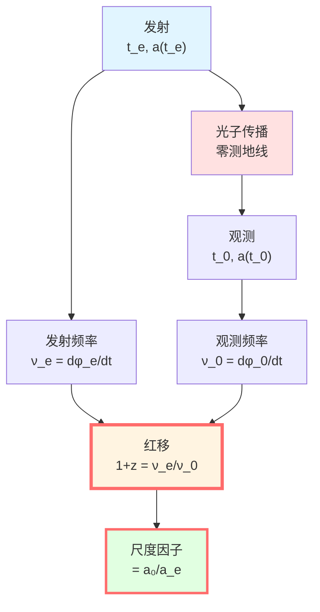
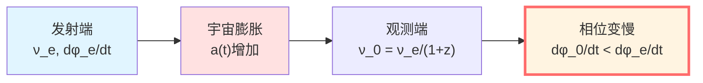
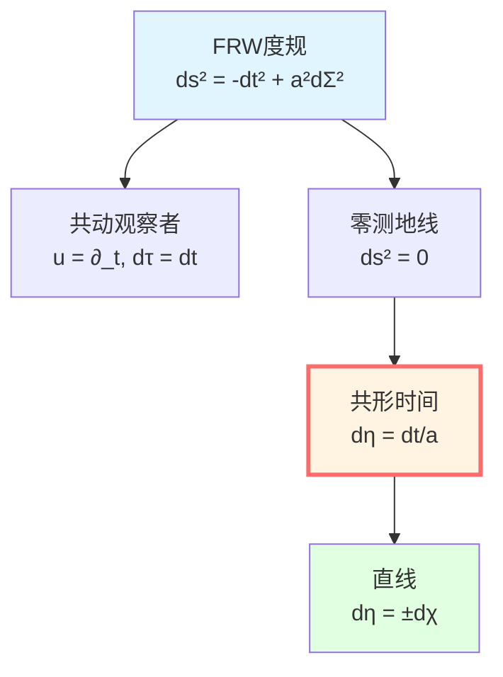
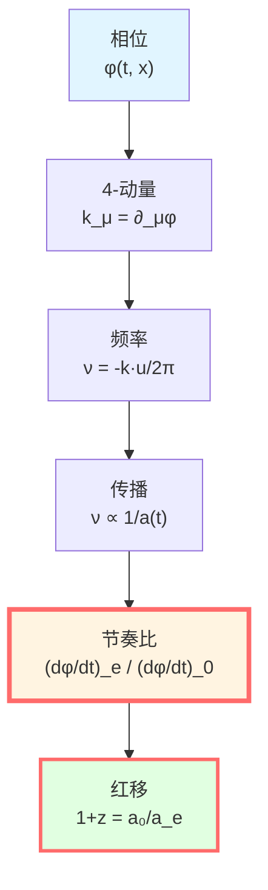
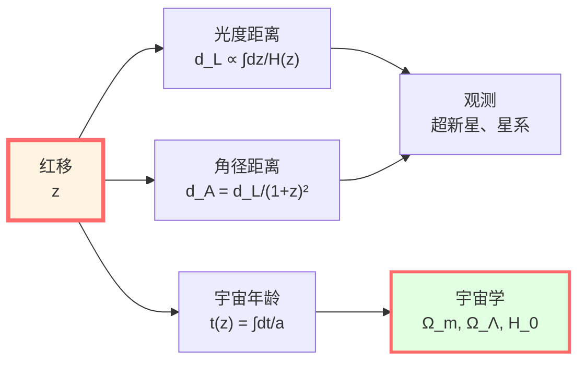
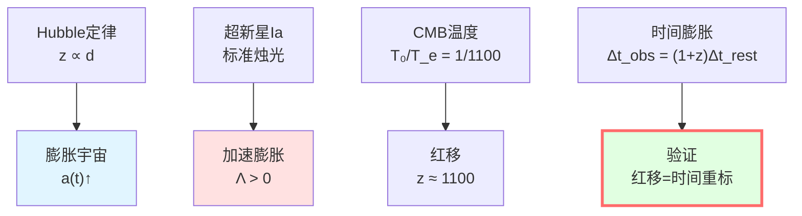
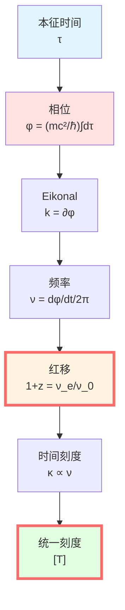

# 宇宙学红移：时间的宇宙剪切

> *"红移是宇宙尺度因子对相位节奏的拉伸。"*

## 🎯 核心命题

**定理**（红移作为相位节奏比）：

在FRW宇宙中，宇宙学红移可表达为：

$$\boxed{1 + z = \frac{a(t_0)}{a(t_e)} = \frac{(d\phi/dt)_e}{(d\phi/dt)_0}}$$

其中：
- $a(t)$：宇宙尺度因子
- $t_0$：观测时刻
- $t_e$：发射时刻
- $\phi$：光子eikonal相位

**物理意义**：
- 左边：观测到的红移
- 中间：尺度因子比（标准公式）
- 右边：相位"节奏"比（GLS表述）
- **红移 = 时间刻度的全局重标！**



## 💡 直观图像：宇宙的膨胀橡皮筋

### 比喻：拉伸的波

想象在橡皮筋上画一个正弦波：

```
原始: ∿∿∿∿∿∿∿  (波长 λ_e)
拉伸: ∿  ∿  ∿  (波长 λ_0 = (1+z)λ_e)
```

**拉伸过程**：
- 橡皮筋长度 $L(t) = a(t) L_0$
- 波长随之拉伸 $\lambda(t) = a(t) \lambda_0$
- 频率降低 $\nu(t) = c/\lambda(t) \propto 1/a(t)$

**红移**：

$$1 + z = \frac{\lambda_0}{\lambda_e} = \frac{a(t_0)}{a(t_e)}$$

**物理意义**：红移测量宇宙膨胀的"拉伸因子"！

### 时钟的变慢

**另一个视角**：发射端的"时钟"在观测时变慢了

**原子跃迁**：
- 发射：频率 $\nu_e$
- 观测：频率 $\nu_0 = \nu_e/(1+z)$

**相位累积率**：

发射：$d\phi_e/dt = 2\pi\nu_e$

观测：$d\phi_0/dt = 2\pi\nu_0 = 2\pi\nu_e/(1+z)$

**比值**：

$$\frac{(d\phi/dt)_e}{(d\phi/dt)_0} = 1 + z$$

**物理意义**：红移是"相位节奏"的全局缩放！



## 📐 FRW宇宙学

### FRW度规

**度规**：

$$ds^2 = -dt^2 + a(t)^2 \gamma_{ij} dx^i dx^j$$

其中 $\gamma_{ij}$ 是常曲率3维空间度规：
- $k = +1$：3-球（闭宇宙）
- $k = 0$：平直（平坦宇宙）
- $k = -1$：双曲（开宇宙）

**Friedmann方程**：

$$\left(\frac{\dot{a}}{a}\right)^2 = \frac{8\pi G}{3}\rho - \frac{k}{a^2} + \frac{\Lambda}{3}$$

**加速方程**：

$$\frac{\ddot{a}}{a} = -\frac{4\pi G}{3}(\rho + 3p) + \frac{\Lambda}{3}$$

### 共动观察者

**定义**：随宇宙膨胀的观察者，坐标 $(t, \mathbf{x})$ 固定。

**4-速度**：

$$u^\mu = (1, 0, 0, 0)$$

**本征时间**：

$$d\tau = dt$$

**物理意义**：共动观察者的时钟测量宇宙时间 $t$！

### 光子零测地线

**零测地线方程**：$ds^2 = 0$

$$-dt^2 + a(t)^2 \gamma_{ij} dx^i dx^j = 0$$

**径向传播**（$d\theta = d\phi = 0$）：

$$\frac{dt}{a(t)} = \pm d\chi$$

其中 $\chi$ 是共动径向坐标。

**共形时间**：

$$d\eta = \frac{dt}{a(t)}$$

**零测地线**：$d\eta = \pm d\chi$（直线！）



## 🌀 红移公式推导

### 标准推导

**光子4-动量**：

$$k^\mu = \frac{dx^\mu}{d\lambda}$$

其中 $\lambda$ 是仿射参数。

**零测地线**：$k_\mu k^\mu = 0$

**沿测地线**：$k^\nu \nabla_\nu k^\mu = 0$

对共动观察者，定义频率：

$$\nu = -k_\mu u^\mu = k_0 = \frac{dt}{d\lambda}$$

**导数**：

$$\frac{d\nu}{d\lambda} = k^\alpha \nabla_\alpha k_0$$

利用Christoffel符号计算（略），得：

$$\frac{d\nu}{\nu} = -\frac{da}{a}$$

积分：

$$\ln\frac{\nu_0}{\nu_e} = -\ln\frac{a(t_0)}{a(t_e)}$$

所以：

$$\boxed{\frac{\nu_0}{\nu_e} = \frac{a(t_e)}{a(t_0)}}$$

**红移定义**：

$$1 + z := \frac{\nu_e}{\nu_0} = \frac{a(t_0)}{a(t_e)}$$

### 相位节奏推导

**Eikonal近似**：

光子波函数 $\psi \sim e^{i\phi/\hbar}$，其中 $\phi$ 是相位。

**4-动量**：

$$k_\mu = \partial_\mu \phi$$

**频率**：

$$\nu = -\frac{1}{2\pi}k_\mu u^\mu = \frac{1}{2\pi}\frac{\partial \phi}{\partial t}$$

对共动观察者：

$$\nu = \frac{1}{2\pi}\frac{d\phi}{dt}$$

由 $\nu \propto 1/a$：

$$\frac{d\phi}{dt} \propto \frac{1}{a(t)}$$

**发射与观测**：

$$\frac{(d\phi/dt)_e}{(d\phi/dt)_0} = \frac{a(t_0)}{a(t_e)} = 1 + z$$

**完美！相位节奏比等于红移！**



## 🔑 红移作为时间重标

### 宇宙时间的重标

**局域时间刻度**：

在发射点 $(t_e, \mathbf{x}_e)$：

$$\kappa_e = \frac{1}{2\pi}\frac{d\phi}{dt}\bigg|_e$$

在观测点 $(t_0, \mathbf{x}_0)$：

$$\kappa_0 = \frac{1}{2\pi}\frac{d\phi}{dt}\bigg|_0$$

**比值**：

$$\frac{\kappa_e}{\kappa_0} = 1 + z$$

**物理意义**：

红移 = 局域时间刻度的**全局重标因子**！

**时间膨胀**：

对同一物理过程（如超新星爆发），观测持续时间：

$$\Delta t_{\text{obs}} = (1 + z)\Delta t_{\text{proper}}$$

这正是"宇宙学时间膨胀"！

### 距离-红移关系

**光度距离**：

$$d_L = (1 + z)\int_0^z \frac{c\,dz'}{H(z')}$$

其中 $H(z) = H_0\sqrt{\Omega_m(1+z)^3 + \Omega_\Lambda}$。

**角径距离**：

$$d_A = \frac{d_L}{(1+z)^2}$$

**Hubble定律**（低红移）：

$$z \approx \frac{H_0 d}{c}$$

**物理意义**：通过测量红移，可推断距离和宇宙演化！



## 📊 实验验证

### 1. Hubble定律（1929）

**观测**：星系光谱红移 $z \propto$ 距离 $d$

$$cz \approx H_0 d$$

**Hubble常数**（当前）：$H_0 \approx 70\text{ km/s/Mpc}$

**物理意义**：宇宙在膨胀！

### 2. 超新星Ia型

**标准烛光**：绝对光度已知

**观测**：
- 测量红移 $z$
- 测量视亮度
- 推断光度距离 $d_L(z)$

**结果**（1998）：宇宙加速膨胀！

**诺贝尔奖**（2011）：Perlmutter, Schmidt, Riess

### 3. 宇宙微波背景（CMB）

**原始温度**：$T_e \approx 3000\text{ K}$（复合时期）

**当前温度**：$T_0 = 2.725\text{ K}$

**红移**：

$$1 + z = \frac{T_e}{T_0} \approx 1100$$

**完美符合**：$a(t_0)/a(t_e) \approx 1100$

### 4. 时间膨胀

**超新星光变曲线**：

$$\Delta t_{\text{obs}} = (1 + z)\Delta t_{\text{rest}}$$

**观测**（Goldhaber等, 2001）：

对 $z \sim 0.5$ 的超新星，光变曲线确实"拉长"了 $1.5$ 倍！

**完美验证**：红移即时间重标！



## 🌟 与统一时间刻度的联系

### 红移 ∈ 时间等价类

**时间刻度等价类**：

$$[T] \sim \{\tau, t_K, N, \lambda, u, v, \eta, \omega^{-1}, z, t_{\text{mod}}\}$$

**红移的位置**：

$$1 + z \sim \frac{a_0}{a_e} \sim \frac{\kappa_e}{\kappa_0} \sim \frac{(d\phi/dt)_e}{(d\phi/dt)_0}$$

**仿射变换**：

$$t_{\text{cosmo}} = (1 + z)t_{\text{local}}$$

**物理意义**：红移是时间刻度的全局缩放因子！

### 与相位的联系（第1篇）

回顾：

$$\phi = \frac{mc^2}{\hbar}\int d\tau$$

对光子（$m = 0$），需要用Eikonal相位：

$$k_\mu = \partial_\mu \phi$$

**频率**：

$$\nu = \frac{1}{2\pi}\frac{d\phi}{dt}$$

**红移公式**：

$$1 + z = \frac{\nu_e}{\nu_0} = \frac{(d\phi/dt)_e}{(d\phi/dt)_0}$$

**完整闭环！**



## 🎓 深刻意义

### 1. 时间的相对性

**狭义相对论**：运动观察者的时间膨胀 $\Delta t = \gamma \Delta t_0$

**广义相对论**：引力场中的时间膨胀 $d\tau = \sqrt{-g_{tt}}dt$

**宇宙学**：宇宙膨胀的时间膨胀 $\Delta t_{\text{obs}} = (1+z)\Delta t_{\text{rest}}$

**统一观点**：都是时间刻度的重标！

### 2. 宇宙的历史

**红移 → 回溯时间**：

- $z = 0$：现在
- $z \sim 0.1$：10亿年前
- $z \sim 1$：80亿年前
- $z \sim 1100$：38万年后（CMB）
- $z \to \infty$：大爆炸

**红移是宇宙的时间戳！**

### 3. 暗能量之谜

**观测**：$z \sim 0.5$ 时，宇宙从减速转为加速

**暗能量**：$\Omega_\Lambda \approx 0.7$

**宇宙学常数**：$\Lambda \approx 10^{-52}\text{ m}^{-2}$

**GLS视角**：$\Lambda$ 是时间刻度的全局积分常数（见IGVP篇）

## 🤔 练习题

1. **概念理解**：
   - 为什么红移是"相位节奏比"？
   - 宇宙学时间膨胀与狭义相对论时间膨胀有何不同？
   - 共形时间如何直线化零测地线？

2. **计算练习**：
   - 对 $z = 1$，计算光度距离（物质主导宇宙）
   - CMB温度 $T = 2.725\text{ K}$，推算复合时温度
   - 超新星 $z = 0.5$，计算时间膨胀因子

3. **观测应用**：
   - Hubble常数的不同测量为何不一致？
   - 如何从超新星数据推断暗能量？
   - CMB功率谱如何约束宇宙学参数？

4. **进阶思考**：
   - 红移漂移：$\dot{z} \neq 0$，能否观测？
   - 宇宙学红移能否用散射理论描述？
   - 红移与熵的关系？

---

**导航**：
- 上一篇：[06-modular-time.md](./06-modular-time.md) - 模块时间
- 下一篇：[08-time-summary.md](./08-time-summary.md) - 统一时间总结
- 概览：[00-time-overview.md](./00-time-overview.md) - 统一时间篇总览
- GLS理论：[unified-time-scale-geometry.md](../../euler-gls-paper-time/unified-time-scale-geometry.md)
- 参考文献：
  - Hogg, "Distance measures in cosmology" (2000)
  - Perlmutter et al., "Measurements of Ω and Λ from 42 High-Redshift Supernovae" (1999)
  - Planck Collaboration, "Planck 2018 results" (2020)
