# Cosmological Redshift: Cosmic Shear of Time

> *"Redshift can be understood as the stretching of phase rhythm by the cosmic scale factor."*

## 🎯 Core Proposition

**Theoretical Proposition** (Redshift as Phase Rhythm Ratio):

In FRW cosmology, cosmological redshift can be expressed within the GLS framework as:

$$\boxed{1 + z = \frac{a(t_0)}{a(t_e)} = \frac{(d\phi/dt)_e}{(d\phi/dt)_0}}$$

where:
- $a(t)$: cosmic scale factor
- $t_0$: observation time
- $t_e$: emission time
- $\phi$: photon eikonal phase

**Physical Interpretation**:
- Left side: observed redshift
- Middle: scale factor ratio (standard formula)
- Right side: phase "rhythm" ratio (GLS formulation)
- **Inference**: Redshift can be viewed as a global rescaling of the time scale.

```mermaid
graph TB
    EM["Emission<br/>t_e, a(t_e)"] --> PHOTON["Photon Propagation<br/>Null Geodesic"]
    PHOTON --> OBS["Observation<br/>t_0, a(t_0)"]

    EM --> PE["Emission Frequency<br/>ν_e = dφ_e/dt"]
    OBS --> PO["Observation Frequency<br/>ν_0 = dφ_0/dt"]

    PE --> Z["Redshift<br/>1+z = ν_e/ν_0"]
    PO --> Z
    Z --> A["Scale Factor<br/>= a₀/a_e"]

    style EM fill:#e1f5ff
    style PHOTON fill:#ffe1e1
    style Z fill:#fff4e1,stroke:#ff6b6b,stroke-width:4px
    style A fill:#e1ffe1,stroke:#ff6b6b,stroke-width:3px
```



## 💡 Intuitive Image: Expanding Rubber Band of the Universe

### Analogy: Stretched Wave

Imagine drawing a sine wave on a rubber band:

```
Original: ∿∿∿∿∿∿∿  (wavelength λ_e)
Stretched: ∿  ∿  ∿  (wavelength λ_0 = (1+z)λ_e)
```

**Stretching Process**:
- Rubber band length $L(t) = a(t) L_0$
- Wavelength stretches accordingly $\lambda(t) = a(t) \lambda_0$
- Frequency decreases $\nu(t) = c/\lambda(t) \propto 1/a(t)$

**Redshift**:

$$1 + z = \frac{\lambda_0}{\lambda_e} = \frac{a(t_0)}{a(t_e)}$$

**Physical Meaning**: Redshift measures the "stretching factor" of cosmic expansion.

### Slowing of Clocks

**Another Perspective**: The "clock" at the emission end slows down when observed

**Atomic Transition**:
- Emission: frequency $\nu_e$
- Observation: frequency $\nu_0 = \nu_e/(1+z)$

**Phase Accumulation Rate**:

Emission: $d\phi_e/dt = 2\pi\nu_e$

Observation: $d\phi_0/dt = 2\pi\nu_0 = 2\pi\nu_e/(1+z)$

**Ratio**:

$$\frac{(d\phi/dt)_e}{(d\phi/dt)_0} = 1 + z$$

**Physical Interpretation**: Redshift manifests as a global scaling of "phase rhythm".

```mermaid
graph LR
    EMIT["Emission End<br/>ν_e, dφ_e/dt"] --> SPACE["Cosmic Expansion<br/>a(t) increases"]
    SPACE --> OBS["Observation End<br/>ν_0 = ν_e/(1+z)"]
    OBS --> SLOW["Phase Slows<br/>dφ_0/dt < dφ_e/dt"]

    style EMIT fill:#e1f5ff
    style SPACE fill:#ffe1e1
    style SLOW fill:#fff4e1,stroke:#ff6b6b,stroke-width:3px
```



## 📐 FRW Cosmology

### FRW Metric

**Metric**:

$$ds^2 = -dt^2 + a(t)^2 \gamma_{ij} dx^i dx^j$$

where $\gamma_{ij}$ is the constant curvature 3-dimensional spatial metric:
- $k = +1$: 3-sphere (closed universe)
- $k = 0$: flat (flat universe)
- $k = -1$: hyperbolic (open universe)

**Friedmann Equation**:

$$\left(\frac{\dot{a}}{a}\right)^2 = \frac{8\pi G}{3}\rho - \frac{k}{a^2} + \frac{\Lambda}{3}$$

**Acceleration Equation**:

$$\frac{\ddot{a}}{a} = -\frac{4\pi G}{3}(\rho + 3p) + \frac{\Lambda}{3}$$

### Comoving Observer

**Definition**: Observer moving with cosmic expansion, coordinates $(t, \mathbf{x})$ fixed.

**4-Velocity**:

$$u^\mu = (1, 0, 0, 0)$$

**Proper Time**:

$$d\tau = dt$$

**Physical Meaning**: Comoving observer's clock measures cosmic time $t$.

### Photon Null Geodesics

**Null Geodesic Equation**: $ds^2 = 0$

$$-dt^2 + a(t)^2 \gamma_{ij} dx^i dx^j = 0$$

**Radial Propagation** ($d\theta = d\phi = 0$):

$$\frac{dt}{a(t)} = \pm d\chi$$

where $\chi$ is the comoving radial coordinate.

**Conformal Time**:

$$d\eta = \frac{dt}{a(t)}$$

**Null Geodesics**: $d\eta = \pm d\chi$ (straight lines).

```mermaid
graph TB
    FRW["FRW Metric<br/>ds² = -dt² + a²dΣ²"] --> COMOVING["Comoving Observer<br/>u = ∂_t, dτ = dt"]
    FRW --> NULL["Null Geodesics<br/>ds² = 0"]
    NULL --> ETA["Conformal Time<br/>dη = dt/a"]
    ETA --> STRAIGHT["Straight Lines<br/>dη = ±dχ"]

    style FRW fill:#e1f5ff
    style ETA fill:#fff4e1,stroke:#ff6b6b,stroke-width:3px
    style STRAIGHT fill:#e1ffe1
```



## 🌀 Redshift Formula Derivation

### Standard Derivation

**Photon 4-Momentum**:

$$k^\mu = \frac{dx^\mu}{d\lambda}$$

where $\lambda$ is the affine parameter.

**Null Geodesic**: $k_\mu k^\mu = 0$

**Along Geodesic**: $k^\nu \nabla_\nu k^\mu = 0$

For a comoving observer, define frequency:

$$\nu = -k_\mu u^\mu = k_0 = \frac{dt}{d\lambda}$$

**Derivative**:

$$\frac{d\nu}{d\lambda} = k^\alpha \nabla_\alpha k_0$$

Using Christoffel symbols (omitted), we get:

$$\frac{d\nu}{\nu} = -\frac{da}{a}$$

Integrating:

$$\ln\frac{\nu_0}{\nu_e} = -\ln\frac{a(t_0)}{a(t_e)}$$

Therefore:

$$\boxed{\frac{\nu_0}{\nu_e} = \frac{a(t_e)}{a(t_0)}}$$

**Redshift Definition**:

$$1 + z := \frac{\nu_e}{\nu_0} = \frac{a(t_0)}{a(t_e)}$$

### Phase Rhythm Derivation

**Eikonal Approximation**:

Photon wavefunction $\psi \sim e^{i\phi/\hbar}$, where $\phi$ is the phase.

**4-Momentum**:

$$k_\mu = \partial_\mu \phi$$

**Frequency**:

$$\nu = -\frac{1}{2\pi}k_\mu u^\mu = \frac{1}{2\pi}\frac{\partial \phi}{\partial t}$$

For a comoving observer:

$$\nu = \frac{1}{2\pi}\frac{d\phi}{dt}$$

From $\nu \propto 1/a$:

$$\frac{d\phi}{dt} \propto \frac{1}{a(t)}$$

**Emission and Observation**:

$$\frac{(d\phi/dt)_e}{(d\phi/dt)_0} = \frac{a(t_0)}{a(t_e)} = 1 + z$$

**Conclusion**: Phase rhythm ratio is numerically equal to redshift.

```mermaid
graph TB
    PHI["Phase<br/>φ(t, x)"] --> K["4-Momentum<br/>k_μ = ∂_μφ"]
    K --> NU["Frequency<br/>ν = -k·u/2π"]
    NU --> PROP["Propagation<br/>ν ∝ 1/a(t)"]
    PROP --> RATIO["Rhythm Ratio<br/>(dφ/dt)_e / (dφ/dt)_0"]
    RATIO --> Z["Redshift<br/>1+z = a₀/a_e"]

    style PHI fill:#e1f5ff
    style RATIO fill:#fff4e1,stroke:#ff6b6b,stroke-width:4px
    style Z fill:#e1ffe1,stroke:#ff6b6b,stroke-width:3px
```



## 🔑 Redshift as Time Rescaling

### Rescaling of Cosmic Time

**Local Time Scale**:

At emission point $(t_e, \mathbf{x}_e)$:

$$\kappa_e = \frac{1}{2\pi}\frac{d\phi}{dt}\bigg|_e$$

At observation point $(t_0, \mathbf{x}_0)$:

$$\kappa_0 = \frac{1}{2\pi}\frac{d\phi}{dt}\bigg|_0$$

**Ratio**:

$$\frac{\kappa_e}{\kappa_0} = 1 + z$$

**Physical Interpretation**:

Redshift can be viewed as a **global rescaling factor** of the local time scale.

**Time Dilation**:

For the same physical process (e.g., supernova explosion), observed duration:

$$\Delta t_{\text{obs}} = (1 + z)\Delta t_{\text{proper}}$$

This is exactly "cosmological time dilation".

### Distance-Redshift Relation

**Luminosity Distance**:

$$d_L = (1 + z)\int_0^z \frac{c\,dz'}{H(z')}$$

where $H(z) = H_0\sqrt{\Omega_m(1+z)^3 + \Omega_\Lambda}$.

**Angular Diameter Distance**:

$$d_A = \frac{d_L}{(1+z)^2}$$

**Hubble's Law** (low redshift):

$$z \approx \frac{H_0 d}{c}$$

**Physical Meaning**: By measuring redshift, we can infer distance and cosmic evolution.


## 📊 Experimental Verification

### 1. Hubble's Law (1929)

**Observation**: Galaxy spectral redshift $z \propto$ distance $d$

$$cz \approx H_0 d$$

**Hubble Constant** (current): $H_0 \approx 70\text{ km/s/Mpc}$

**Physical Meaning**: The universe is expanding.

### 2. Type Ia Supernovae

**Standard Candle**: Known absolute luminosity

**Observation**:
- Measure redshift $z$
- Measure apparent brightness
- Infer luminosity distance $d_L(z)$

**Result** (1998): Cosmic acceleration.

**Nobel Prize** (2011): Perlmutter, Schmidt, Riess

### 3. Cosmic Microwave Background (CMB)

**Primordial Temperature**: $T_e \approx 3000\text{ K}$ (recombination epoch)

**Current Temperature**: $T_0 = 2.725\text{ K}$

**Redshift**:

$$1 + z = \frac{T_e}{T_0} \approx 1100$$

**Agreement**: $a(t_0)/a(t_e) \approx 1100$

### 4. Time Dilation

**Supernova Light Curves**:

$$\Delta t_{\text{obs}} = (1 + z)\Delta t_{\text{rest}}$$

**Observation** (Goldhaber et al., 2001):

For supernovae at $z \sim 0.5$, light curves are indeed "stretched" by a factor of $1.5$.

**Verification**: Redshift is time rescaling.

```mermaid
graph TB
    HUBBLE["Hubble's Law<br/>z ∝ d"] --> EXP["Expanding Universe<br/>a(t)↑"]
    SN["Type Ia Supernovae<br/>Standard Candle"] --> ACC["Accelerated Expansion<br/>Λ > 0"]
    CMB["CMB Temperature<br/>T₀/T_e = 1/1100"] --> Z["Redshift<br/>z ≈ 1100"]
    TIME["Time Dilation<br/>Δt_obs = (1+z)Δt_rest"] --> VERIFY["Verification<br/>Redshift=Time Rescaling"]

    style EXP fill:#e1f5ff
    style ACC fill:#ffe1e1
    style VERIFY fill:#e1ffe1,stroke:#ff6b6b,stroke-width:3px
```



## 🌟 Connection to Unified Time Scale

### Redshift ∈ Time Equivalence Class

**Time Scale Equivalence Class**:

$$[T] \sim \{\tau, t_K, N, \lambda, u, v, \eta, \omega^{-1}, z, t_{\text{mod}}\}$$

**Position of Redshift**:

$$1 + z \sim \frac{a_0}{a_e} \sim \frac{\kappa_e}{\kappa_0} \sim \frac{(d\phi/dt)_e}{(d\phi/dt)_0}$$

**Affine Transformation**:

$$t_{\text{cosmo}} = (1 + z)t_{\text{local}}$$

**Physical Meaning**: Redshift is a global scaling factor of the time scale.

### Connection to Phase (Chapter 1)

Recall:

$$\phi = \frac{mc^2}{\hbar}\int d\tau$$

For photons ($m = 0$), need to use Eikonal phase:

$$k_\mu = \partial_\mu \phi$$

**Frequency**:

$$\nu = \frac{1}{2\pi}\frac{d\phi}{dt}$$

**Redshift Formula**:

$$1 + z = \frac{\nu_e}{\nu_0} = \frac{(d\phi/dt)_e}{(d\phi/dt)_0}$$

**Theoretical Consistency**: Logic of each part is mutually closed.

```mermaid
graph TB
    TAU["Proper Time<br/>τ"] --> PHI["Phase<br/>φ = (mc²/ℏ)∫dτ"]
    PHI --> EIKONAL["Eikonal<br/>k = ∂φ"]
    EIKONAL --> NU["Frequency<br/>ν = dφ/dt/2π"]
    NU --> Z["Redshift<br/>1+z = ν_e/ν_0"]

    Z --> KAPPA["Time Scale<br/>κ ∝ ν"]
    KAPPA --> UNIFIED["Unified Scale<br/>[T]"]

    style TAU fill:#e1f5ff
    style PHI fill:#ffe1e1
    style Z fill:#fff4e1,stroke:#ff6b6b,stroke-width:4px
    style UNIFIED fill:#e1ffe1,stroke:#ff6b6b,stroke-width:4px
```



## 🎓 Profound Significance

### 1. Relativity of Time

**Special Relativity**: Time dilation of moving observer $\Delta t = \gamma \Delta t_0$

**General Relativity**: Time dilation in gravitational field $d\tau = \sqrt{-g_{tt}}dt$

**Cosmology**: Time dilation from cosmic expansion $\Delta t_{\text{obs}} = (1+z)\Delta t_{\text{rest}}$

**Unified View**: All can be viewed as rescalings of the time scale.

### 2. History of the Universe

**Redshift → Lookback Time**:

- $z = 0$: now
- $z \sim 0.1$: 1 billion years ago
- $z \sim 1$: 8 billion years ago
- $z \sim 1100$: 380,000 years after (CMB)
- $z \to \infty$: Big Bang

**Redshift is the timestamp of the universe.**

### 3. Dark Energy Mystery

**Observation**: At $z \sim 0.5$, universe transitions from deceleration to acceleration

**Dark Energy**: $\Omega_\Lambda \approx 0.7$

**Cosmological Constant**: $\Lambda \approx 10^{-52}\text{ m}^{-2}$

**GLS Perspective**: $\Lambda$ may be a global integration constant of the time scale (see IGVP chapter).

## 🤔 Exercises

1. **Conceptual Understanding**:
   - Why is redshift a "phase rhythm ratio"?
   - How does cosmological time dilation differ from special relativistic time dilation?
   - How does conformal time straighten null geodesics?

2. **Calculation Exercises**:
   - For $z = 1$, calculate luminosity distance (matter-dominated universe)
   - CMB temperature $T = 2.725\text{ K}$, calculate recombination temperature
   - Supernova at $z = 0.5$, calculate time dilation factor

3. **Observational Applications**:
   - Why do different measurements of Hubble constant disagree?
   - How to infer dark energy from supernova data?
   - How does CMB power spectrum constrain cosmological parameters?

4. **Advanced Thinking**:
   - Redshift drift: $\dot{z} \neq 0$, can it be observed?
   - Can cosmological redshift be described using scattering theory?
   - Relationship between redshift and entropy?

---

**Navigation**:
- Previous: [06-modular-time_en.md](06-modular-time_en.md) - Modular Time
- Next: [08-time-summary_en.md](08-time-summary_en.md) - Unified Time Summary
- Overview: [00-time-overview_en.md](00-time-overview_en.md) - Unified Time Overview
- GLS Theory: unified-time-scale-geometry.md
- References:
  - Hogg, "Distance measures in cosmology" (2000)
  - Perlmutter et al., "Measurements of Ω and Λ from 42 High-Redshift Supernovae" (1999)
  - Planck Collaboration, "Planck 2018 results" (2020)

