# 第5.8节 时间作为广义熵的最优路径

> "时间不是先验存在的参数，而是宇宙在所有可能历史中选择的最优路径。"

[← 上一节：宇宙学红移](07-cosmological-redshift.md) | [返回目录](00-time-overview.md) | [下一节：时间-几何-相互作用统一 →](09-time-geometry-interaction.md)

---

## 核心思想一句话

**时间不是外加的"钟表参数"，而是在所有满足因果一致性的历史路径中，使广义熵泛函达到极值的那条路径及其参数化。**

---

## 日常类比：最省力的登山路线

想象你要爬一座山：

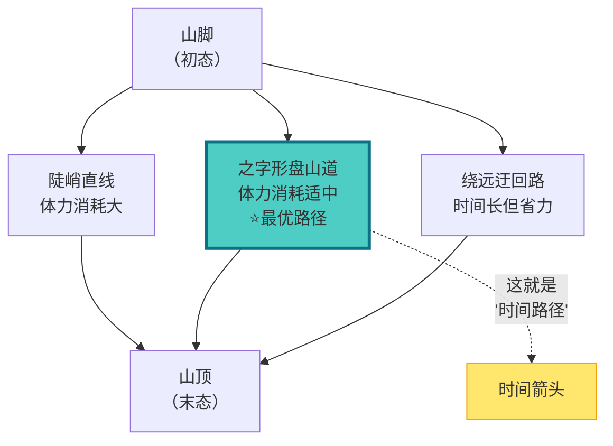

**类比解释**：
- **山脚→山顶**：宇宙从初态到末态的演化
- **多条路径**：理论上有无数种演化历史
- **体力消耗**：对应"广义熵代价"
- **之字形最优路径**：自然选择的那条路径，这就是**时间**！

**深刻之处**：时间不是预先画好的路线图，而是宇宙"计算"出的最优解。

---

## 传统观念 vs GLS观念

### 传统时间观

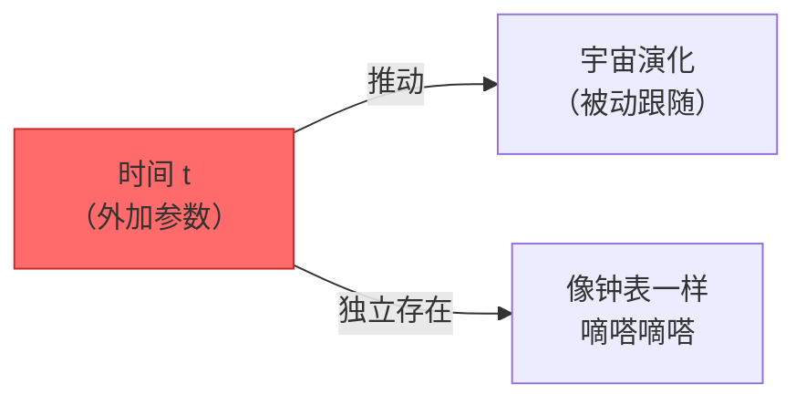

**传统观念**：时间像一条轨道，宇宙沿着轨道前进。时间是"先验"的，独立于宇宙内容。

### GLS时间观

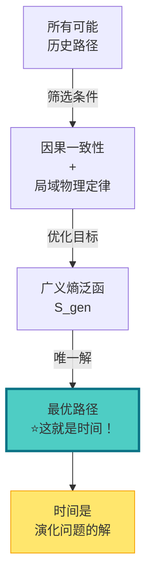

**GLS观念**：时间是宇宙在满足因果一致性约束下，使广义熵达到极值的那条历史路径。

---

## 三个关键概念

### 1. 历史路径空间

想象宇宙的所有可能"剧本"：

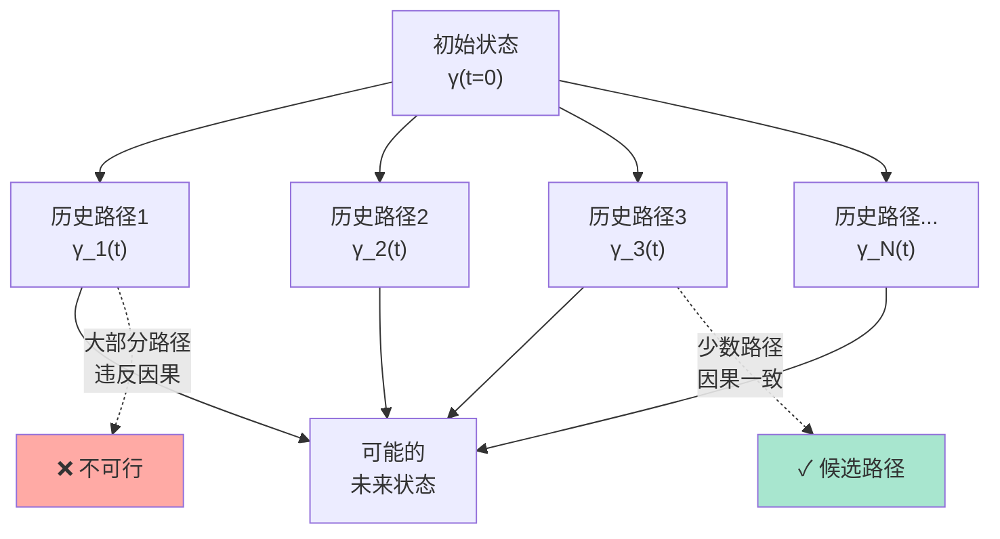

**历史路径**：宇宙从t=0到t=T的演化，像一条曲线 γ(t)。

**关键约束**：不是所有路径都被允许！必须满足：
1. **因果一致性**：后面的事件不能影响前面的事件
2. **局域物理定律**：每个时刻都遵守物理规则
3. **记录可延拓**：过去的"记录"不能被抹除

### 2. 广义熵泛函

什么是"广义熵"？不仅仅是热力学熵！

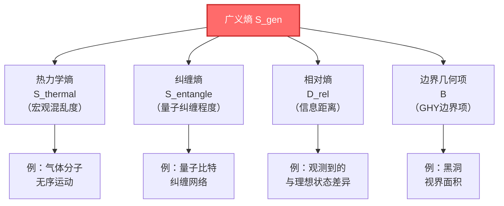

**数学形式**（概念性）：
$$
\mathcal{S}_{\text{gen}}[\gamma] = \alpha S_{\text{thermal}} + \beta S_{\text{entangle}} + \gamma D_{\text{rel}} + \lambda \mathcal{B}
$$

**通俗理解**：广义熵衡量了沿历史路径 γ 累积的"代价"：
- 热力学熵增→能量耗散的代价
- 纠缠熵增→量子信息丢失的代价
- 相对熵→偏离理想状态的代价
- 边界项→边界约束的代价

### 3. 变分原理：时间是极值解

**核心定理**（通俗版）：

> 在所有因果一致的历史路径中，真实宇宙选择的是使广义熵泛函达到**极小值**的那条路径。所谓"时间"，就是这条极值路径的参数化。

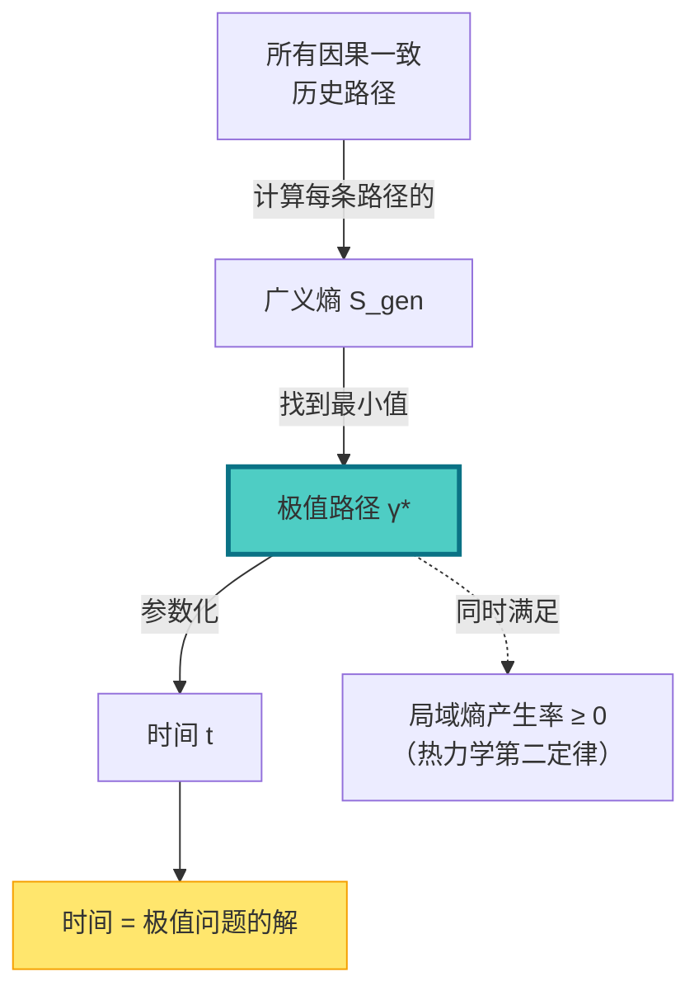

**比喻**：
- 就像肥皂泡自动形成球形（表面积最小）
- 光线在介质中走最短光程路径（费马原理）
- 宇宙选择"最省广义熵成本"的历史路径

**这就是时间的本质**！

---

## 时间箭头的起源

### 为什么时间只能向前？

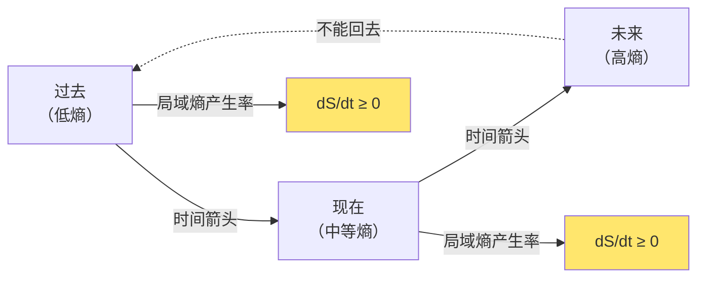

**答案**：因为极值路径必须满足**局域熵产生率非负**（热力学第二定律）：

$$
\frac{dS_{\text{local}}}{dt} \geq 0
$$

**通俗解释**：
- **沙漏类比再现**：沙子只能从上往下流，不能自发倒流
- **打破的玻璃杯**：碎片不会自动组装回完整杯子
- **记忆形成**：你只能记住过去，不能记住未来

**本质**：时间箭头 = 熵增方向 = 极值路径的单向性

---

## 与统一时间刻度的联系

### 散射相位的时间刻度

还记得统一时间刻度母式吗？

$$
\kappa(\omega) = \frac{\varphi'(\omega)}{\pi} = \rho_{\text{rel}}(\omega) = \frac{1}{2\pi}\text{tr}\,Q(\omega)
$$

**它在广义熵框架中的角色**：

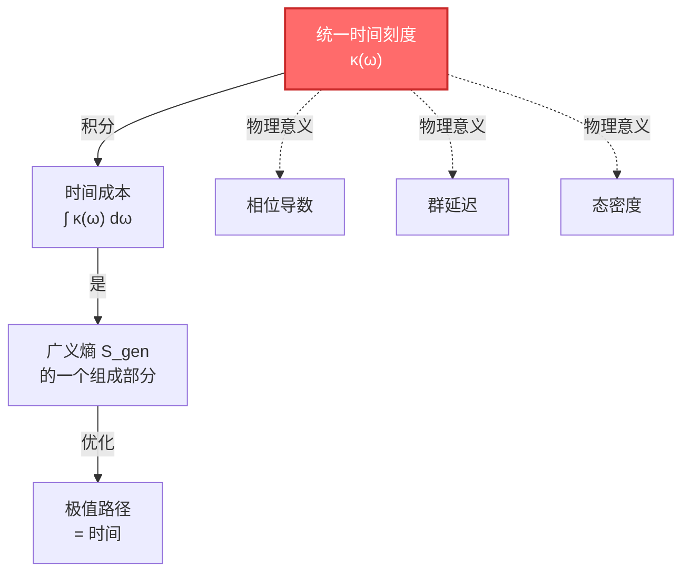

**一句话**：统一时间刻度 κ(ω) 提供了"每单位频率的时间成本"，积分后成为广义熵泛函的一部分。

**深刻联系**：
- **散射时间延迟** = 量子粒子在散射区的"逗留时间"
- **相位梯度** = 时间成本的累积速率
- **极值原理** = 选择相位梯度积分最小的路径

---

## 具体例子：宇宙的膨胀历史

### 宇宙为何选择当前的膨胀速率？

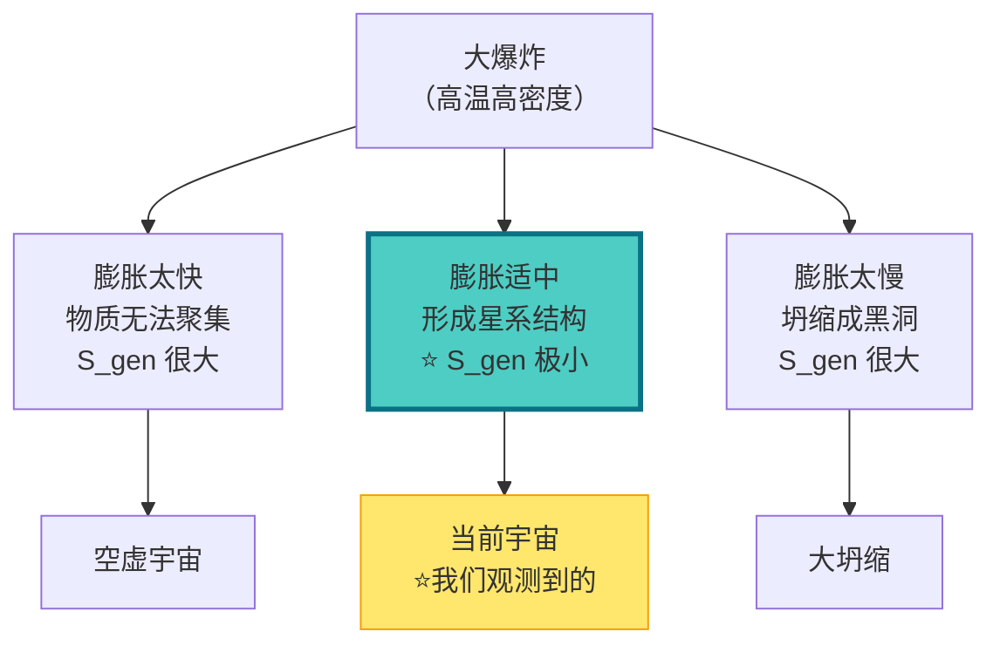

**GLS解释**：
- 宇宙不是"随机"选择膨胀速率
- 而是选择了使广义熵泛函极小的那个速率
- **当前膨胀历史 = 广义熵的极值解**

**观测证据**：
- 宇宙微波背景辐射的温度涨落谱
- 大尺度结构形成的模式
- 都符合"极值历史"的预言

---

## 实验可检验吗？

### 三个可测量的预言

#### 1. 黑洞蒸发的时间尺度

**预言**：黑洞蒸发时间应使 (视界面积+外部熵) 的广义熵达到极值。

#### 2. 量子纠缠的增长速率

**预言**：量子多体系统的纠缠熵增长速率应使总广义熵最优。

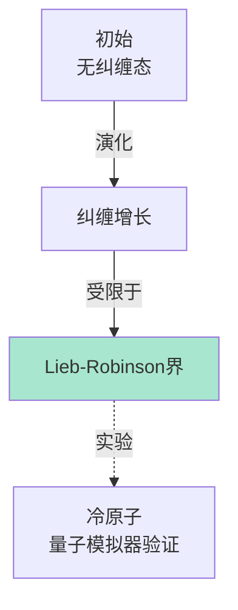

#### 3. 宇宙学常数的大小

**预言**：真空能密度（宇宙学常数Λ）应使宇宙历史的广义熵极小。

**观测**：
- 当前测量值：Λ ≈ 10⁻¹²⁰（普朗克单位）
- GLS预言：这个值应是广义熵极值解
- 未来观测：更精确的暗能量状态方程测量

---

## 哲学意涵

### 时间不再神秘

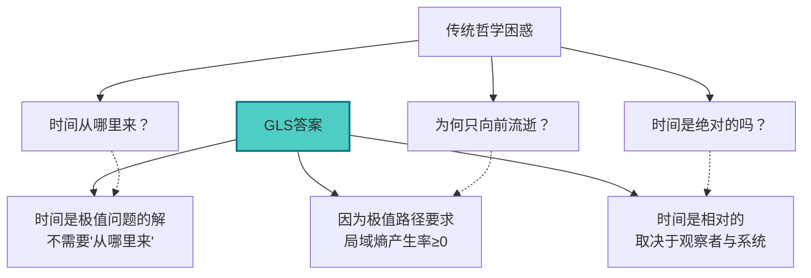

**深刻启示**：
1. **时间不是容器**：不存在一个空洞的"时间容器"等着被填充
2. **时间不是幻觉**：时间是真实的，但它是**涌现的结构**
3. **时间不是唯一的**：不同观察者、不同系统可以有不同的"最优路径"

---

## 小结：时间的新画像

### 五个关键点

1. **时间 = 优化问题的解**
   - 在所有因果一致历史中选出广义熵极值路径

2. **广义熵包含多个成分**
   - 热熵、纠缠熵、相对熵、边界项

3. **时间箭头来自极值条件**
   - 局域熵产生率非负保证了单向性

4. **与统一时间刻度一致**
   - κ(ω) 提供了时间成本的微观刻度

5. **可实验检验**
   - 黑洞蒸发、纠缠增长、宇宙学常数

### 概念地图

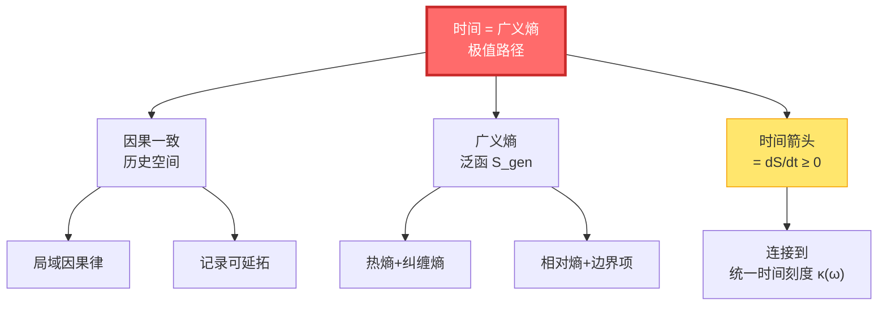

---

## 扩展思考

### 讨论题

1. **最优路径唯一吗？**
   - 提示：在什么条件下唯一？退化情况怎么办？

2. **观察者能改变时间吗？**
   - 提示：测量是否算作"改变历史"？

3. **初始条件从哪里来？**
   - 提示：宇宙的初始状态也是极值问题的一部分吗？

### 相关阅读

- **前置知识**：[因果结构](../07-causal-structure/00-causal-overview.md) - 理解因果一致性
- **数学细节**：[IGVP原理](../04-igvp-framework/00-igvp-overview.md) - 变分原理的数学
- **应用**：[黑洞熵](../12-applications/03-black-holes.md) - 看广义熵如何工作

---

## 本章总结

时间不是先验的背景参数，而是宇宙在满足因果一致性约束下，使广义熵泛函达到极值的那条历史路径。

**一句话精髓**：
> 时间是宇宙的"最优解"，而非预设的"舞台"。

**下一步**：我们将在下一节看到，时间不仅是最优路径，还与几何、相互作用力统一在同一个框架中。

---

**本章基于以下源理论**：
- `/docs/euler-gls-paper-time/time-as-generalized-entropy-optimal-path.md`
- `/docs/euler-gls-info/05-time-information-complexity-variational-principle.md`

[← 上一节：宇宙学红移](07-cosmological-redshift.md) | [返回目录](00-time-overview.md) | [下一节：时间-几何-相互作用统一 →](09-time-geometry-interaction.md)
