# Section 5.8: Time as the Optimal Path of Generalized Entropy

> "Time is not a pre-existing parameter, but the optimal path chosen by the universe among all possible histories."

[← Previous: Cosmological Redshift](07-cosmological-redshift_en.md) | [Return to Contents](00-time-overview_en.md) | [Next: Time-Geometry-Interaction Unification →](09-time-geometry-interaction_en.md)

---

## Core Idea in One Sentence

**Time is not an externally imposed 'clock parameter,' but rather the path and its parameterization that extremizes the generalized entropy functional among all causally consistent historical paths.**

---

## Everyday Analogy: The Most Energy-Efficient Mountain Climbing Route

Imagine you want to climb a mountain:

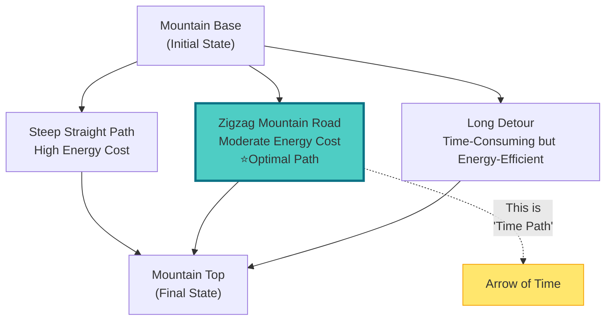

**Analogy Explanation**:
- **Base → Top**: Evolution of the universe from initial to final state
- **Multiple Paths**: Theoretically infinite possible evolutionary histories
- **Energy Cost**: Corresponds to "generalized entropy cost"
- **Zigzag Optimal Path**: The naturally selected path—this is **time**!

**Profound Insight**: Time is not a pre-drawn route map, but the optimal solution "computed" by the universe.

---

## Traditional View vs. GLS View

### Traditional View of Time

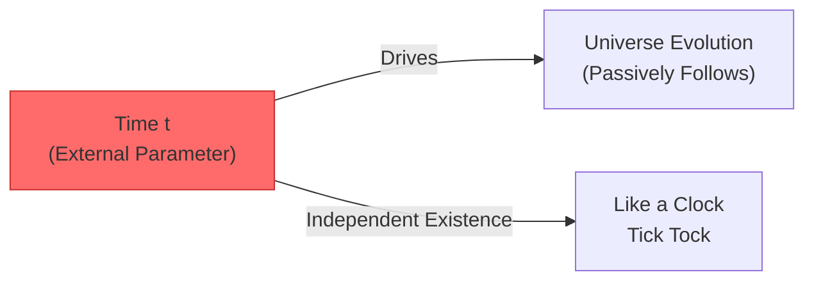

**Traditional View**: Time is like a track, and the universe moves along it. Time is "a priori," independent of the universe's content.

### GLS View of Time

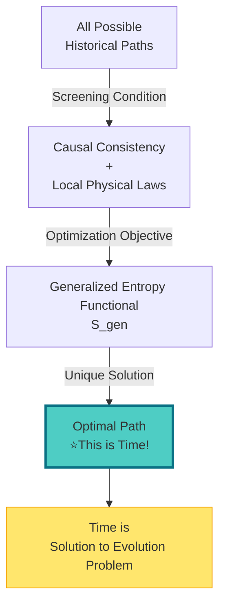

**GLS View**: Time is the historical path that extremizes generalized entropy under causal consistency constraints.

---

## Three Key Concepts

### 1. Historical Path Space

Imagine all possible "scripts" of the universe:

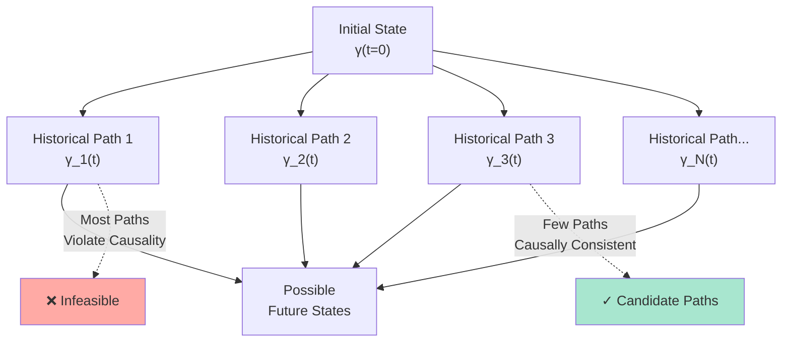

**Historical Path**: Evolution of the universe from t=0 to t=T, like a curve γ(t).

**Key Constraints**: Not all paths are allowed! Must satisfy:
1. **Causal Consistency**: Later events cannot affect earlier events
2. **Local Physical Laws**: Each moment obeys physical rules
3. **Record Extensibility**: Past "records" cannot be erased

### 2. Generalized Entropy Functional

What is "generalized entropy"? Not just thermodynamic entropy!

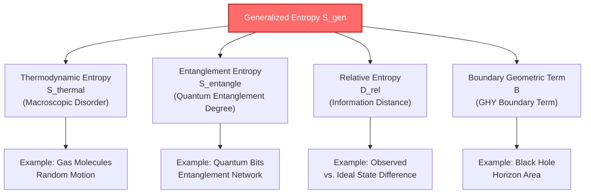

**Mathematical Form** (conceptual):
$$
\mathcal{S}_{\text{gen}}[\gamma] = \alpha S_{\text{thermal}} + \beta S_{\text{entangle}} + \gamma D_{\text{rel}} + \lambda \mathcal{B}
$$

**Intuitive Understanding**: Generalized entropy measures the accumulated "cost" along historical path γ:
- Thermodynamic entropy increase → cost of energy dissipation
- Entanglement entropy increase → cost of quantum information loss
- Relative entropy → cost of deviation from ideal state
- Boundary term → cost of boundary constraints

### 3. Variational Principle: Time is the Extremal Solution

**Core Theorem** (popular version):

> Among all causally consistent historical paths, the real universe chooses the one that **minimizes** the generalized entropy functional. What we call "time" is the parameterization of this extremal path.

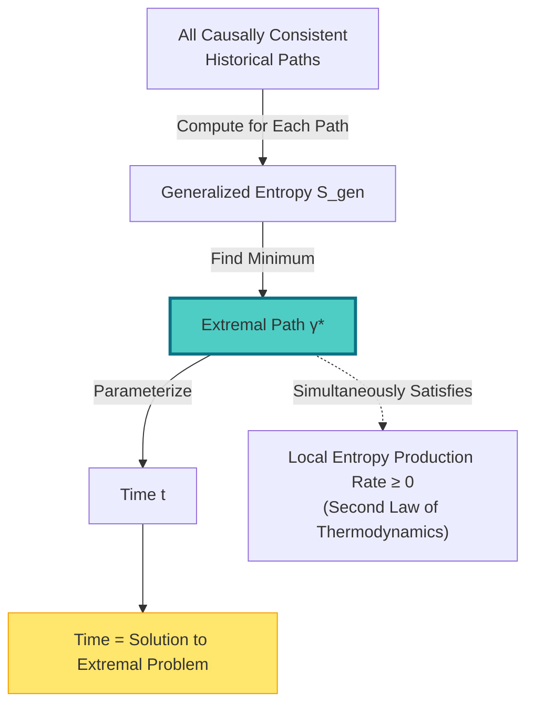

**Metaphor**:
- Like soap bubbles automatically forming spheres (minimum surface area)
- Light taking the shortest optical path in media (Fermat's principle)
- The universe choosing the historical path with "minimum generalized entropy cost"

**This is the essence of time!**

---

## Origin of the Arrow of Time

### Why Can Time Only Move Forward?

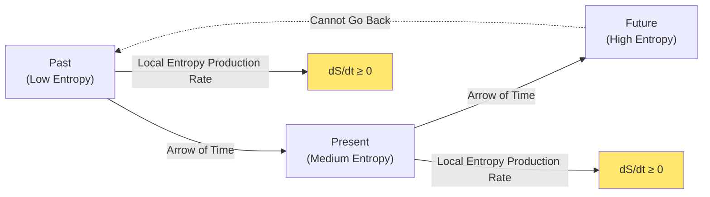

**Answer**: Because the extremal path must satisfy **non-negative local entropy production rate** (second law of thermodynamics):

$$
\frac{dS_{\text{local}}}{dt} \geq 0
$$

**Intuitive Explanation**:
- **Hourglass Analogy Revisited**: Sand can only flow from top to bottom, cannot spontaneously reverse
- **Broken Glass Cup**: Fragments will not automatically reassemble into a complete cup
- **Memory Formation**: You can only remember the past, not the future

**Essence**: Arrow of time = direction of entropy increase = unidirectionality of extremal path

---

## Connection to Unified Time Scale

### Time Scale of Scattering Phase

Remember the unified time scale master formula?

$$
\kappa(\omega) = \frac{\varphi'(\omega)}{\pi} = \rho_{\text{rel}}(\omega) = \frac{1}{2\pi}\text{tr}\,Q(\omega)
$$

**Its Role in the Generalized Entropy Framework**:

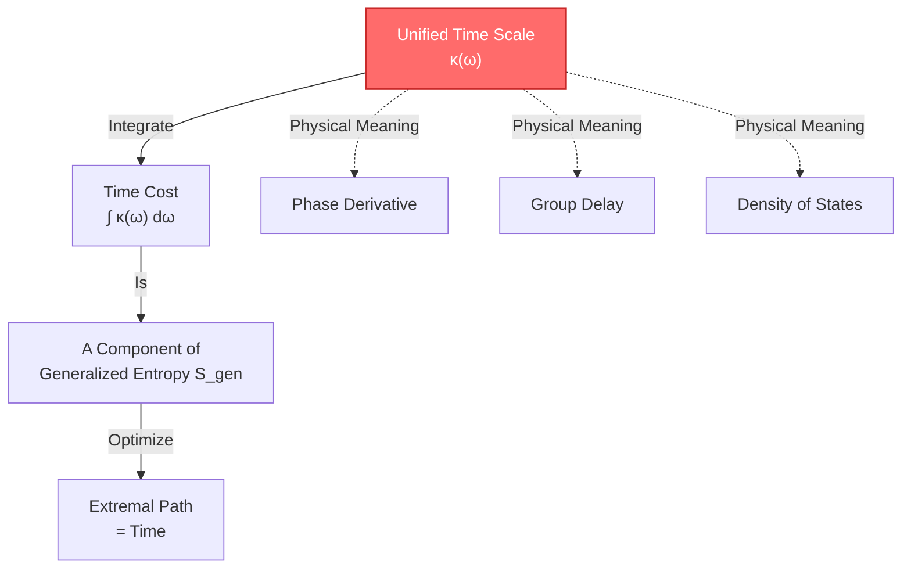

**In One Sentence**: The unified time scale κ(ω) provides "time cost per unit frequency," which becomes part of the generalized entropy functional after integration.

**Profound Connection**:
- **Scattering Time Delay** = "dwell time" of quantum particles in the scattering region
- **Phase Gradient** = accumulation rate of time cost
- **Extremal Principle** = choose the path that minimizes the integral of phase gradient

---

## Concrete Example: Expansion History of the Universe

### Why Did the Universe Choose the Current Expansion Rate?

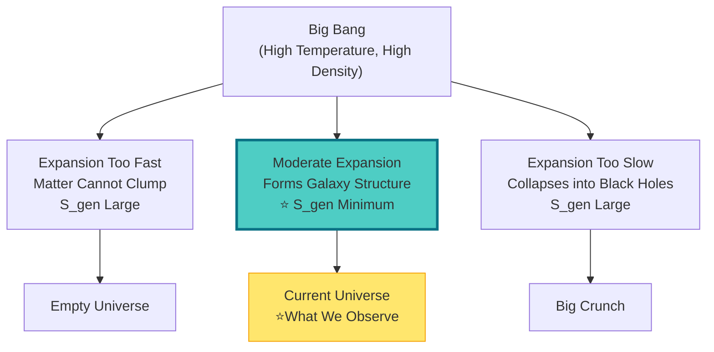

**GLS Explanation**:
- The universe did not "randomly" choose the expansion rate
- Instead, it chose the rate that minimizes the generalized entropy functional
- **Current expansion history = extremal solution of generalized entropy**

**Observational Evidence**:
- Temperature fluctuation spectrum of cosmic microwave background radiation
- Patterns of large-scale structure formation
- Both match predictions of "extremal history"

---

## Can It Be Experimentally Tested?

### Three Testable Predictions

#### 1. Time Scale of Black Hole Evaporation

**Prediction**: Black hole evaporation time should extremize the generalized entropy of (horizon area + external entropy).

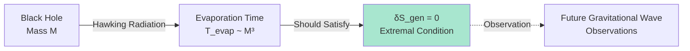

#### 2. Growth Rate of Quantum Entanglement

**Prediction**: Entanglement entropy growth rate of quantum many-body systems should optimize total generalized entropy.

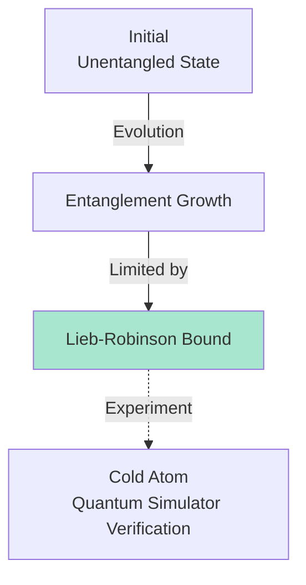

#### 3. Size of Cosmological Constant

**Prediction**: Vacuum energy density (cosmological constant Λ) should minimize generalized entropy of cosmic history.

**Observation**:
- Current measured value: Λ ≈ 10⁻¹²⁰ (Planck units)
- GLS prediction: This value should be the extremal solution of generalized entropy
- Future observations: More precise measurements of dark energy equation of state

---

## Philosophical Implications

### Time Is No Longer Mysterious

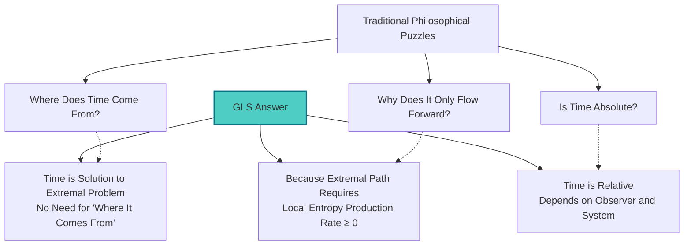

**Profound Revelations**:
1. **Time is Not a Container**: There is no empty "time container" waiting to be filled
2. **Time is Not an Illusion**: Time is real, but it is an **emergent structure**
3. **Time is Not Unique**: Different observers, different systems can have different "optimal paths"

---

## Summary: New Portrait of Time

### Five Key Points

1. **Time = Solution to Optimization Problem**
   - Select generalized entropy extremal path among all causally consistent histories

2. **Generalized Entropy Contains Multiple Components**
   - Thermal entropy, entanglement entropy, relative entropy, boundary terms

3. **Arrow of Time Comes from Extremal Condition**
   - Non-negative local entropy production rate guarantees unidirectionality

4. **Consistent with Unified Time Scale**
   - κ(ω) provides microscopic scale of time cost

5. **Experimentally Testable**
   - Black hole evaporation, entanglement growth, cosmological constant

### Concept Map

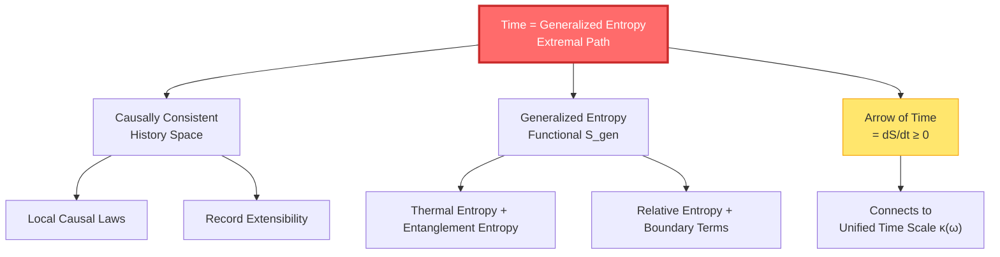

---

## Extended Reflection

### Discussion Questions

1. **Is the Optimal Path Unique?**
   - Hint: Under what conditions is it unique? What about degenerate cases?

2. **Can Observers Change Time?**
   - Hint: Does measurement count as "changing history"?

3. **Where Do Initial Conditions Come From?**
   - Hint: Is the initial state of the universe also part of the extremal problem?

### Related Reading

- **Prerequisites**: [Causal Structure](../07-causal-structure/00-causal-overview_en.md) - Understanding causal consistency
- **Mathematical Details**: [IGVP Principle](../04-igvp-framework/00-igvp-overview_en.md) - Mathematics of variational principle
- **Applications**: [Black Hole Entropy](../12-applications/03-black-holes_en.md) - How generalized entropy works

---

## Chapter Summary

Time is not an a priori background parameter, but the historical path that extremizes the generalized entropy functional under causal consistency constraints.

**One-Sentence Essence**:
> Time is the universe's "optimal solution," not a preset "stage."

**Next Step**: In the next section, we will see that time is not only the optimal path, but also unified with geometry and interaction forces in the same framework.

---

**This Chapter is Based on the Following Source Theories**:
- `/docs/euler-gls-paper-time/time-as-generalized-entropy-optimal-path.md`
- `/docs/euler-gls-info/05-time-information-complexity-variational-principle.md`

[← Previous: Cosmological Redshift](07-cosmological-redshift_en.md) | [Return to Contents](00-time-overview_en.md) | [Next: Time-Geometry-Interaction Unification →](09-time-geometry-interaction_en.md)

