# Unified Time Summary: All Times Are One

> *"All times are different projections of one time."*

## 🎯 Complete Picture

After exploring 8 articles, we have finally revealed the most central insight of GLS theory:

$$\boxed{\text{Time} \equiv \text{Phase} \equiv \text{Proper Time} \equiv \text{Scattering Delay} \equiv \text{Spectral Shift} \equiv \text{Geometry} \equiv \text{Modular Flow} \equiv \text{Redshift}}$$

**Core Formula** (Time Scale Identity):

$$\boxed{\kappa(\omega) = \frac{\varphi'(\omega)}{\pi} = \rho_{\text{rel}}(\omega) = \frac{1}{2\pi}\text{tr}\,Q(\omega)}$$

**Time Equivalence Class**:

$$\boxed{[T] \sim \{\tau, t_K, N, \lambda, u, v, \eta, \omega^{-1}, z, t_{\text{mod}}\}}$$

**Physical Meaning**:
- Time is not multiple concepts, but **different projections of the same object**
- "Time" in quantum mechanics, geometry, scattering, spectroscopy, and information theory are **essentially the same**
- They are related through **affine transformations** $t_1 = \alpha t_2 + \beta$

```mermaid
graph TB
    UT["Unified Time Scale<br/>[τ]"] --> P["Phase Projection<br/>φ = (mc²/ℏ)∫dτ"]
    UT --> Q["Scattering Projection<br/>tr Q = ∂_ωΦ"]
    UT --> R["Spectral Projection<br/>ρ_rel = -∂_ωξ"]
    UT --> G["Geometric Projection<br/>Killing/ADM/null"]
    UT --> M["Modular Projection<br/>σ_t"]
    UT --> Z["Cosmic Projection<br/>1+z = a₀/a_e"]

    P --> ID["Time Scale Identity<br/>φ'/π = ρ_rel = tr Q/2π"]
    Q --> ID
    R --> ID

    G --> EQ["Equivalence Class<br/>t₁ = αt₂ + β"]
    M --> EQ
    Z --> EQ

    ID --> UNIFIED["Unified Time"]
    EQ --> UNIFIED

    style UT fill:#fff4e1,stroke:#ff6b6b,stroke-width:5px
    style ID fill:#e1ffe1,stroke:#ff6b6b,stroke-width:4px
    style UNIFIED fill:#ffe1e1,stroke:#ff6b6b,stroke-width:4px
```

## 📚 Review of Eight Articles

### Article 0: Overview (Navigation Map)

**Theme**: Introduction to the overall framework of unified time scale

**Core Ideas**:
- "Time" appears in multiple forms in physics
- They are not different times, but different faces of the same time
- Time Scale Identity is the core formula

**Key Formula**:

$$\kappa(\omega) = \frac{\varphi'(\omega)}{\pi} = \rho_{\text{rel}}(\omega) = \frac{1}{2\pi}\text{tr}\,Q(\omega)$$

**Three Axioms**:
1. Causal Ordering: Time localizes dynamics
2. Unitary Evolution: Phase-time determined by stationary phase
3. Entropy Monotonicity: Generalized entropy monotonic/extremal along time

### Article 1: Phase and Proper Time

**Theme**: Quantum phase = linear function of proper time

**Core Theorem**:

$$\boxed{\phi = \frac{mc^2}{\hbar}\int_\gamma d\tau}$$

**Physical Meaning**:
- Left side: quantum phase (pure quantum concept)
- Right side: proper time integral (pure geometric concept)
- **Equality**: Bridge between quantum and geometry!

**Compton Frequency**:

$$\omega_C = \frac{mc^2}{\hbar} = \frac{d\phi}{d\tau}$$

**Derivation**: Worldline path integral, stationary phase method

**Experiments**: COW experiment, GPS clocks, Compton scattering

**Insight**: Each particle is an "intrinsic clock," frequency determined by mass!

### Article 2: Scattering Phase and Group Delay

**Theme**: Group delay = derivative of scattering phase with respect to frequency

**Core Definition** (Wigner-Smith Operator):

$$\boxed{Q(\omega) = -iS(\omega)^\dagger \frac{\partial S(\omega)}{\partial \omega}}$$

**Trace Formula**:

$$\boxed{\text{tr}\,Q(\omega) = \frac{\partial \Phi(\omega)}{\partial \omega}}$$

**Physical Meaning**:
- $Q$ is self-adjoint matrix, eigenvalues = delay times of each channel
- Trace = total group delay
- Can be directly measured from scattering experiments!

**Operational Definition**: Time = actual delay of wave packet center

**Experiments**: Microwave cavities, slow/fast light, Shapiro delay

**Insight**: Time is an observable of scattering processes!

### Article 3: Spectral Shift Function

**Theme**: Spectral shift = change in energy level counting due to interaction

**Core Formula** (Birman-Kreĭn):

$$\boxed{\det S(\omega) = e^{-2\pi i\xi(\omega)}}$$

**Relative Density of States**:

$$\boxed{\rho_{\text{rel}}(\omega) = -\frac{d\xi(\omega)}{d\omega}}$$

**Physical Meaning**:
- $\xi(\omega)$: how many energy levels are "pushed past" $\omega$
- $\rho_{\text{rel}}$: density of energy level shifts
- Levinson's theorem: $\xi(\infty) - \xi(-\infty) = N_b$ (number of bound states)

**Connection**: $\Phi = -2\pi\xi$ (total phase = $-2\pi$ × spectral shift)

**Insight**: Scattering phase records spectral changes!

### Article 4: Time Scale Identity (⭐ Core)

**Theme**: Complete proof of unification of four quantities

**Theorem**:

$$\boxed{\frac{\varphi'(\omega)}{\pi} = \rho_{\text{rel}}(\omega) = \frac{1}{2\pi}\text{tr}\,Q(\omega) =: \kappa(\omega)}$$

**Proof Chain**:
1. Birman-Kreĭn: $\Phi = -2\pi\xi$
2. Differentiation: $\Phi' = -2\pi\xi' = 2\pi\rho_{\text{rel}}$
3. Half-phase: $\varphi = \Phi/2$, so $\varphi' = \pi\rho_{\text{rel}}$
4. Logarithmic derivative: $\partial_\omega\ln\det S = i\,\text{tr}\,Q = 2\pi i\rho_{\text{rel}}$
5. Combine: $\varphi'/\pi = \rho_{\text{rel}} = \text{tr}\,Q/(2\pi)$

**Uniqueness**: Time scale is unique up to affine transformation

**Insight**: Time is not a priori, but extracted from scattering data!

### Article 5: Geometric Times

**Theme**: Multiple times defined by metric

**Four Geometric Times**:

| Type | Definition | Relation |
|------|-----------|----------|
| Killing | $\mathcal{L}_\xi g = 0$ | $d\tau = \sqrt{V}\,dt$ |
| ADM | $ds^2 = -N^2dt^2 + \cdots$ | $d\tau = N\,dt$ |
| null | $k^a\nabla_a k^b = 0$ | affine parameter $\lambda$ |
| conformal | $d\eta = dt/a(t)$ | straightens null geodesics |

**Equivalence**: Connected through affine transformations $t_1 = \alpha t_2 + \beta$

**Connection to Proper Time**:
- $\phi = (mc^2/\hbar)\int d\tau$
- Geometric times connect to unified scale through $d\tau$

**Insight**: All geometric times are rescalings of proper time!

### Article 6: Modular Time

**Theme**: Intrinsic time of quantum states

**Core Structure** (Tomita-Takesaki):

$$\boxed{\sigma_t^\omega(A) = \Delta_\omega^{it} A \Delta_\omega^{-it}}$$

**Thermal Time Hypothesis** (Connes-Rovelli):
The parameter $t$ of modular flow is physical time!

**KMS Condition**:

$$\omega(AB) = \omega(B\sigma_{i\beta}^\omega(A))$$

Corresponds to temperature $T = \beta^{-1}$.

**Unruh Effect**:
- Accelerating observer: $T = a/(2\pi)$
- Modular time = $2\pi \times$ Killing time

**Relative Entropy Monotonicity** → QNEC → Einstein Equations

**Insight**: Time emerges from entanglement structure!

### Article 7: Cosmological Redshift

**Theme**: Redshift = global rescaling of time scale

**Core Formula**:

$$\boxed{1 + z = \frac{a(t_0)}{a(t_e)} = \frac{(d\phi/dt)_e}{(d\phi/dt)_0}}$$

**Physical Meaning**:
- Standard: scale factor ratio
- GLS: phase rhythm ratio
- **They are equivalent!**

**Time Dilation**:

$$\Delta t_{\text{obs}} = (1 + z)\Delta t_{\text{rest}}$$

**Experimental Verification**:
- Hubble's law
- Type Ia supernovae
- CMB temperature redshift
- Supernova light curve stretching

**Insight**: Redshift is cosmic expansion's shear on time scale!

### Article 8 (This Article): Summary

**Theme**: Complete unified picture

**Unification of All Times**:

```mermaid
graph TB
    subgraph "Quantum Layer"
        P1["Phase<br/>φ = (mc²/ℏ)∫dτ"]
        P2["Group Delay<br/>Q = -iS†∂_ωS"]
        P3["Scattering Phase<br/>Φ = arg det S"]
    end

    subgraph "Spectral Layer"
        S1["Spectral Shift<br/>ξ(ω)"]
        S2["Relative Density<br/>ρ_rel = -∂_ωξ"]
    end

    subgraph "Geometric Layer"
        G1["Proper Time<br/>τ"]
        G2["Killing Time<br/>t_K"]
        G3["ADM Lapse<br/>N"]
        G4["null parameter<br/>λ"]
        G5["Conformal Time<br/>η"]
    end

    subgraph "Information Layer"
        M1["Modular Flow<br/>σ_t"]
        M2["Relative Entropy<br/>S(ρ₁||ρ₂)"]
    end

    subgraph "Cosmic Layer"
        C1["Redshift<br/>1+z"]
        C2["Scale Factor<br/>a(t)"]
    end

    P1 --> UT["Unified Time Scale<br/>[τ]"]
    P2 --> UT
    P3 --> UT
    S1 --> UT
    S2 --> UT
    G1 --> UT
    G2 --> UT
    G3 --> UT
    G4 --> UT
    G5 --> UT
    M1 --> UT
    M2 --> UT
    C1 --> UT
    C2 --> UT

    style UT fill:#fff4e1,stroke:#ff6b6b,stroke-width:6px
```

## 🔑 Core Insights

### 1. Time is Emergent

**Traditional View**: Time is an a priori external parameter

**GLS View**: Time emerges from physical structures:
- From entanglement → modular flow → time
- From scattering → phase → time
- From metric → proper time → time

**Evidence**:
- Pure states have no modular flow → no time
- No scattering no phase → no time delay
- Flat spacetime proper time simple → Minkowski time

### 2. Time is Geometry

$$\boxed{\text{Time} = \text{Phase} = \text{Proper Time Integral}}$$

$$\phi = \frac{mc^2}{\hbar}\int d\tau$$

**Meaning**:
- Geometry ($\tau$) determines quantum ($\phi$)
- Quantum measures geometry
- **They are the same thing!**

### 3. Time is Scattering

$$\boxed{\text{Time Delay} = \text{Group Delay} = \frac{\partial \text{Phase}}{\partial \text{Frequency}}}$$

$$\Delta t = \text{tr}\,Q = \frac{\partial \Phi}{\partial \omega}$$

**Meaning**:
- Time is observable delay
- Scattering experiments measure time
- **Operational definition succeeds!**

### 4. Time is Entropy

$$\boxed{\text{Time Arrow} = \text{Entropy Increase Direction}}$$

- Relative entropy monotonic along modular flow
- QNEC: $S''_{\text{gen}} \geq 0$
- Gravitational equations derived from entropy extremum

**Meaning**:
- Second law of thermodynamics defines time direction
- Gravity is geometry of entropy
- **Time = parameter of entropy evolution**

### 5. Cosmology is Time Rescaling

$$\boxed{1 + z = \frac{a_0}{a_e} = \frac{\kappa_e}{\kappa_0}}$$

**Meaning**:
- Redshift = global scaling of time scale
- Cosmic expansion = stretching of time
- **Cosmology = geometry of time**

## 📊 Complete Derivation Chain

```mermaid
graph TB
    START["Start: Worldline Integral"] --> P["Phase<br/>φ = (mc²/ℏ)∫dτ"]
    P --> COMP["Compton Frequency<br/>ω_C = dφ/dτ"]

    S["Scattering Matrix<br/>S(ω)"] --> DET["Determinant<br/>det S"]
    DET --> PHI["Total Phase<br/>Φ = arg det S"]
    DET --> BK["Birman-Kreĭn<br/>det S = e^(-2πiξ)"]

    BK --> XI["Spectral Shift<br/>ξ(ω)"]
    XI --> RHO["Density of States<br/>ρ_rel = -∂_ωξ"]

    S --> Q["Group Delay<br/>Q = -iS†∂_ωS"]
    Q --> TRQ["Trace<br/>tr Q = ∂_ωΦ"]

    PHI --> HALF["Half-Phase<br/>φ = Φ/2"]
    HALF --> DERIV["Derivative<br/>φ' = πρ_rel"]

    RHO --> ID["Time Scale Identity<br/>φ'/π = ρ_rel = tr Q/2π"]
    TRQ --> ID
    DERIV --> ID

    ID --> KAPPA["Unified Scale<br/>κ(ω)"]
    KAPPA --> INT["Integral<br/>T = ∫κ dω"]

    INT --> EQ["Equivalence Class<br/>[T] ~ {τ, t_K, ...}"]

    P --> EQ
    COMP --> EQ

    EQ --> FINAL["Unified Time"]

    style START fill:#e1f5ff
    style ID fill:#fff4e1,stroke:#ff6b6b,stroke-width:5px
    style KAPPA fill:#e1ffe1,stroke:#ff6b6b,stroke-width:4px
    style FINAL fill:#ffe1e1,stroke:#ff6b6b,stroke-width:5px
```

## 🌟 Connections to Other Parts of GLS

### Connection to IGVP

**IGVP**: Generalized entropy extremum → Einstein equations

**Role of Time**:
- Entropy evolves along time: $\partial_t S_{\text{gen}}$
- Extremum condition: $\delta S_{\text{gen}} = 0$
- **Time provides evolution parameter!**

**Modular Time Perspective**:
- Modular Hamiltonian $K \sim \int T_{kk}$
- Relative entropy monotonicity → QNEC
- **Time = entropy-driven evolution**

### Connection to Boundary Theory

**Boundary Language**: Physics defined on boundary

**Time Boundary Realization**:
- Scattering: $\text{tr}\,Q$ measured on boundary
- Geometry: GHY boundary term defines time
- Modular: modular flow of boundary algebra

**Unification**: Time is a boundary observable!

### Connection to Causal Structure

**Causal Partial Order**: $p \prec q$

**Time Function**: $\tau(p) < \tau(q)$ if and only if $p \prec q$

**Bernal-Sánchez Theorem**: Globally hyperbolic spacetimes have smooth time functions

**Meaning**: Causal structure determines time!

### Connection to QCA Universe (Preview)

**Category Theory Perspective**: Time = morphism in category

**Terminal Object**: Time scale equivalence class $[T]$ is terminal object

**Naturality**: Affine transformation of time = natural isomorphism

## 🎓 Profound Philosophical Significance

### The Nature of Time Problem

**Question**: What is time?

**Traditional Answers**:
- Newton: absolute time
- Einstein: relative time
- Quantum mechanics: external parameter

**GLS Answer**:
Time is the equivalence class that makes the following three consistent:
1. Quantum unitary evolution
2. Geometric causal ordering
3. Entropy monotonicity/extremum

$$\boxed{\text{Time} = \{\text{parameter } t \mid \text{localizes dynamics, clarifies causality, simplifies entropy structure}\}}$$

### Wheeler-DeWitt Problem

**Problem**: Quantum gravity has no external time

**GLS Solution**:
- Time emerges from physical states
- Modular flow provides intrinsic time
- Entropy provides time arrow

**Key**: Time is not input, but output!

### Block Universe vs Emergent Time

**Block Universe**: Spacetime is 4D block, time is illusion

**Emergent Time**: Time emerges from physical processes, is real

**GLS Reconciliation**:
- Spacetime block exists (geometry)
- Time emerges from entanglement, scattering, entropy (physics)
- **They are consistent!**

## 📝 Key Formulas Summary

| Formula | Name | Meaning |
|---------|------|---------|
| $\phi = (mc^2/\hbar)\int d\tau$ | Phase-Time Equivalence | Quantum-Geometry Bridge |
| $Q = -iS^\dagger\partial_\omega S$ | Wigner-Smith Operator | Group Delay Definition |
| $\text{tr}\,Q = \partial_\omega\Phi$ | Trace Formula | Total Delay |
| $\det S = e^{-2\pi i\xi}$ | Birman-Kreĭn Formula | Scattering-Spectral Bridge |
| $\rho_{\text{rel}} = -\partial_\omega\xi$ | Relative Density | Spectral Shift Density |
| $\varphi'/\pi = \rho_{\text{rel}} = \text{tr}\,Q/(2\pi)$ | Time Scale Identity | **Core Formula** |
| $d\tau = \sqrt{V}\,dt$ | Killing Time | Static Spacetime |
| $d\tau = N\,dt$ | ADM Time | $(3+1)$ Decomposition |
| $\sigma_t^\omega = \Delta^{it}\cdot\Delta^{-it}$ | Modular Flow | Intrinsic Time |
| $1+z = a_0/a_e = \nu_e/\nu_0$ | Cosmological Redshift | Time Rescaling |

## 🚀 Next Steps

After completing the Unified Time chapter, we have understood the "time pillar" of GLS theory. Next we will explore:

**06-Boundary Theory Chapter**:
- Spectral triples
- Dirac operator
- Noncommutative geometry

**07-Causal Structure Chapter**:
- Causal partial order
- Global hyperbolicity
- Penrose-Hawking singularity theorems

**08-Topological Constraints Chapter**:
- Euler characteristic
- Topological invariants
- Topological phase transitions

**09-QCA Universe Chapter** (⭐ Core):
- Category theory terminal objects
- Natural transformations
- Yoneda lemma

**10-Matrix Universe Chapter** (⭐ Core):
- Heart-Universe equivalence
- von Neumann algebras
- Holographic principle

**11-Final Unification Chapter** (⭐ Core):
- Single variational principle
- Five-in-one unification
- Complete GLS theory

**These will reveal deeper unifications!**

---

## 🎉 Conclusion

**We have completed the full journey of the Unified Time chapter!**

From quantum phase to proper time, from scattering delay to spectral shift function, from geometric time to modular flow, from cosmic redshift to time scale identity, we have seen:

$$\boxed{\text{All times are one time}}$$

This is not philosophical speculation, but a **mathematical theorem**!

The Time Scale Identity:

$$\boxed{\frac{\varphi'(\omega)}{\pi} = \rho_{\text{rel}}(\omega) = \frac{1}{2\pi}\text{tr}\,Q(\omega)}$$

is the heart of GLS theory, the core bridge connecting quantum mechanics, geometry, scattering, spectroscopy, and information theory.

**Time is not a priori, but emerges from physical structures.**

**Next Chapter**: Boundary Theory chapter, where we will see how physics is completely defined on the boundary!

---

**Navigation**:
- Previous: [07-cosmological-redshift_en.md](07-cosmological-redshift_en.md) - Cosmological Redshift
- Overview: [00-time-overview_en.md](00-time-overview_en.md) - Unified Time Overview
- Next Chapter: [06-boundary-theory/00-boundary-overview_en.md](../06-boundary-theory/00-boundary-overview_en.md) - Boundary Theory Chapter
- Home: [index_en.md](../index_en.md) - Complete GLS Theory Tutorial

