# 09 时间–几何–相互作用的统一：没有"力",只有时间的弯曲

## 核心思想

在我们的日常经验中，存在着各种各样的"力"：

- **引力**让苹果掉落
- **电磁力**让磁铁相吸
- **摩擦力**让车轮减速

但GLS理论告诉我们一个惊人的真相：**这些"力"其实不存在！** 它们都是同一个更深层结构——**统一时间几何**——在不同方向上的投影。

就像一座山从不同角度看有不同的轮廓，时间的几何弯曲在不同观察者、不同能量尺度下表现为不同的"力"。

---

## 日常类比：盲人摸象与多面投影

想象以下场景：

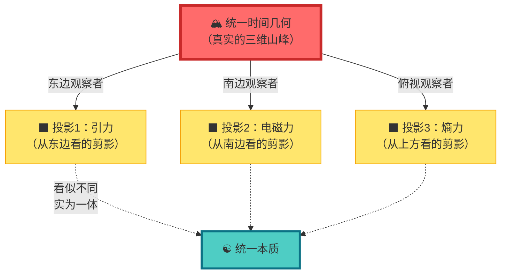

**关键洞察**：

- 三个观察者各自看到不同的"力"（剪影）
- 但这些力都来自同一座山（统一时间几何）
- 山本身没有"东边的力"和"南边的力"的区别，只有一个完整的形状
- "力"是我们**受限的观察方式**造成的假象

---

## 传统物理 vs GLS统一框架

### 传统观点：四种基本力

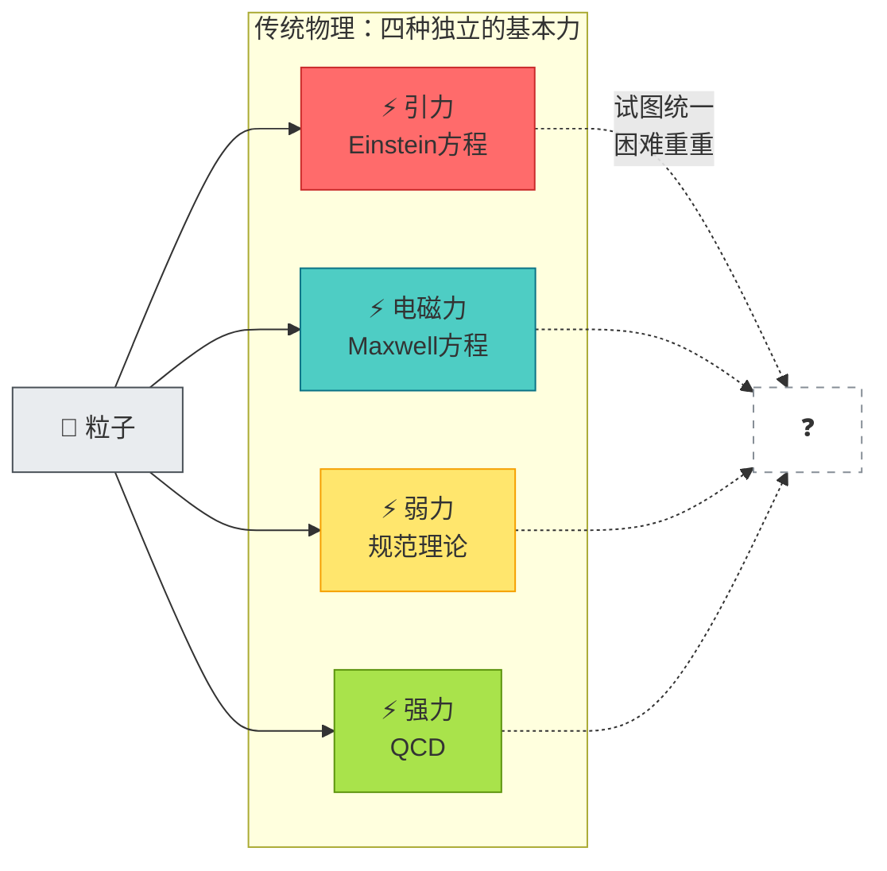

### GLS观点：统一时间几何

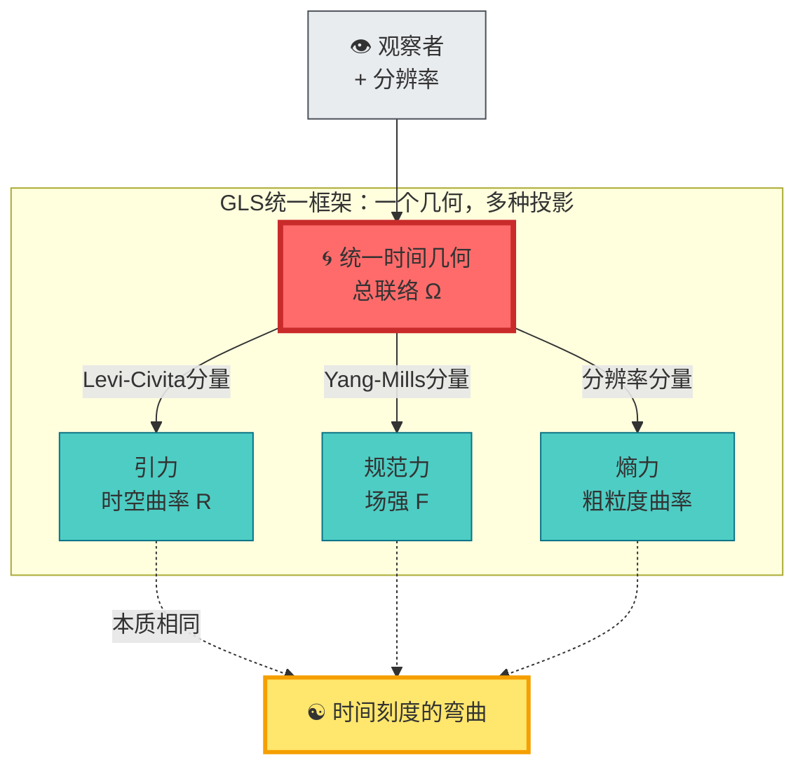

**关键差异**：

1. **传统物理**：四种独立的力 → 统一困难
2. **GLS框架**：一个时间几何 → 自然统一

---

## 三个关键概念

### 1. 总丛与总联络：统一的舞台

想象你在一个**三层楼的建筑**中：

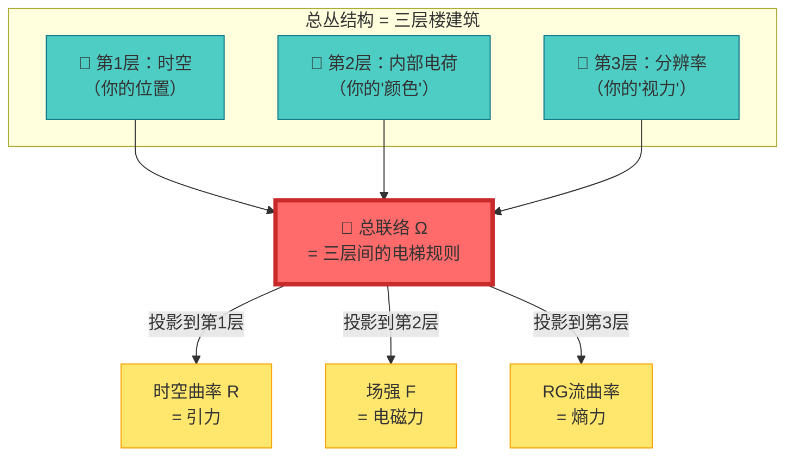

**数学表达**：

总联络：
$$
\boldsymbol{\Omega} = \omega_{\mathrm{LC}} \oplus A_{\mathrm{YM}} \oplus \Gamma_{\mathrm{res}}
$$

其中：
- $\omega_{\mathrm{LC}}$ = Levi-Civita自旋联络（第1层）
- $A_{\mathrm{YM}}$ = Yang-Mills规范场（第2层）
- $\Gamma_{\mathrm{res}}$ = 分辨率流联络（第3层）

总曲率：
$$
\boldsymbol{\mathcal{R}} = \mathrm{d}\boldsymbol{\Omega} + \boldsymbol{\Omega} \wedge \boldsymbol{\Omega} = R \oplus F \oplus \mathcal{R}_{\mathrm{res}}
$$

**日常理解**：

- 你在三层楼之间移动，每一层都有自己的"规则"（联络）
- 如果你**只看第1层**，你会觉得有"引力"
- 如果你**只看第2层**，你会觉得有"电磁力"
- 如果你**只看第3层**，你会觉得有"熵力"
- 但实际上，**只有一套电梯规则**（总联络），在不同楼层的表现不同

---

### 2. 无基本力定理：力是曲率的投影

想象你驾驶一辆车在**弯曲的道路**上：

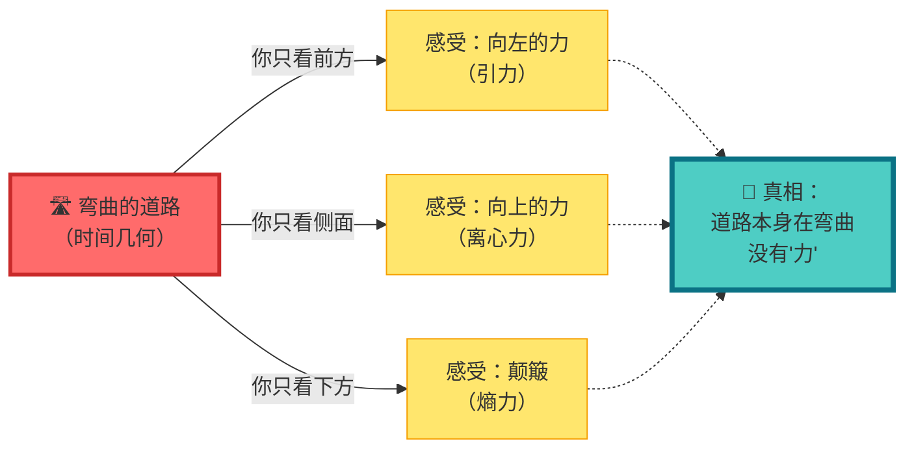

**数学定理（无基本力命题）**：

在半经典极限下，粒子质心轨迹满足：

$$
m\frac{D^{2}x^{\mu}}{D\tau^{2}} = qF^{\mu}{}_{\nu}\frac{\mathrm{d}x^{\nu}}{\mathrm{d}\tau} + f^{\mu}_{\mathrm{res}}
$$

其中：
- $F^{\mu}{}_{\nu}$ = Yang-Mills场强（看似"电磁力"）
- $f^{\mu}_{\mathrm{res}}$ = 分辨率流曲率（看似"熵力"）
- $D/D\tau$ = Levi-Civita协变导数（包含"引力"）

**关键洞察**：

- **引力** = 沿时空方向的曲率
- **电磁力** = 沿电荷方向的曲率
- **熵力** = 沿分辨率方向的曲率

**它们都是同一个总曲率** $\boldsymbol{\mathcal{R}}$ **在不同方向的分量！**

---

### 3. 引力红移 = 时间刻度重标

回到第8节的沙漏比喻，现在加入引力：

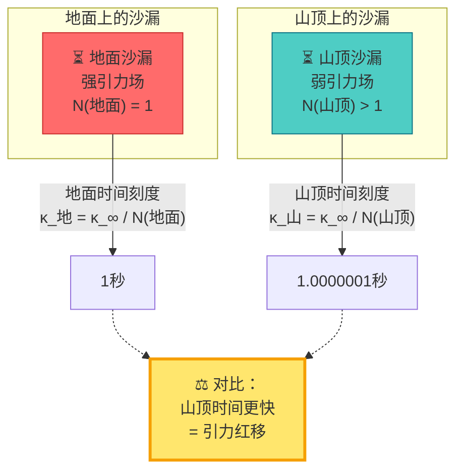

**数学关系**：

静态引力场中的刻度密度：
$$
\kappa(\omega; \mathbf{x}) = N^{-1}(\mathbf{x}) \kappa_{\infty}(\omega)
$$

其中 $N(\mathbf{x})$ 是引力红移因子（远处 $N(\infty) = 1$）。

**日常理解**：

- **引力强** → **时间慢** → **沙漏漏得慢** → **时间刻度密度大**
- **引力弱** → **时间快** → **沙漏漏得快** → **时间刻度密度小**

引力不是一种"力"，而是**时间刻度的空间依赖重标**！

---

## 具体例子：从微观到宏观

### 例1：杂质散射中的"库仑力"

**传统图像**：

- 电子接近杂质
- 受到"库仑斥力" $F = kq_{1}q_{2}/r^{2}$
- 轨道偏转

**GLS图像**：

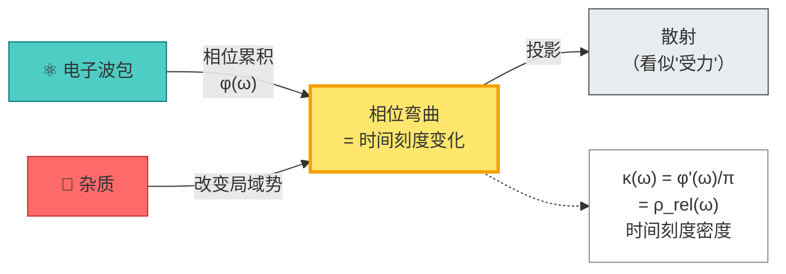

**关键**：没有"力"，只有电子波函数的相位（= 时间刻度）在杂质附近发生弯曲。

---

### 例2：地球轨道中的"万有引力"

**传统图像**：

- 地球受到太阳的"引力" $F = GMm/r^{2}$
- 向心加速度 $a = v^{2}/r$

**GLS图像**：

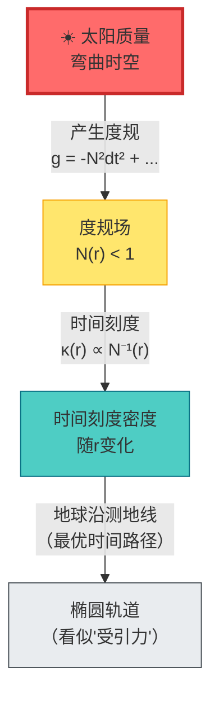

**关键**：地球**不是被"拉"向太阳**，而是在弯曲的时间几何中沿着**时间刻度最优的路径**（测地线）运动。

---

### 例3：橡皮筋中的"弹性力"

**传统图像**：

- 拉伸橡皮筋
- 分子受到"恢复力" $F = -kx$

**GLS图像**：

**关键**：弹性力是**熵的空间梯度**在宏观分辨率下的投影，本质是**分辨率方向的时间几何曲率**。

---

## 时间刻度同一式的三重统一

回顾第8节的核心公式，现在我们看到它的更深层意义：

$$
\kappa(\omega) = \frac{\varphi'(\omega)}{\pi} = \rho_{\mathrm{rel}}(\omega) = \frac{1}{2\pi}\mathrm{tr}\,Q(\omega)
$$

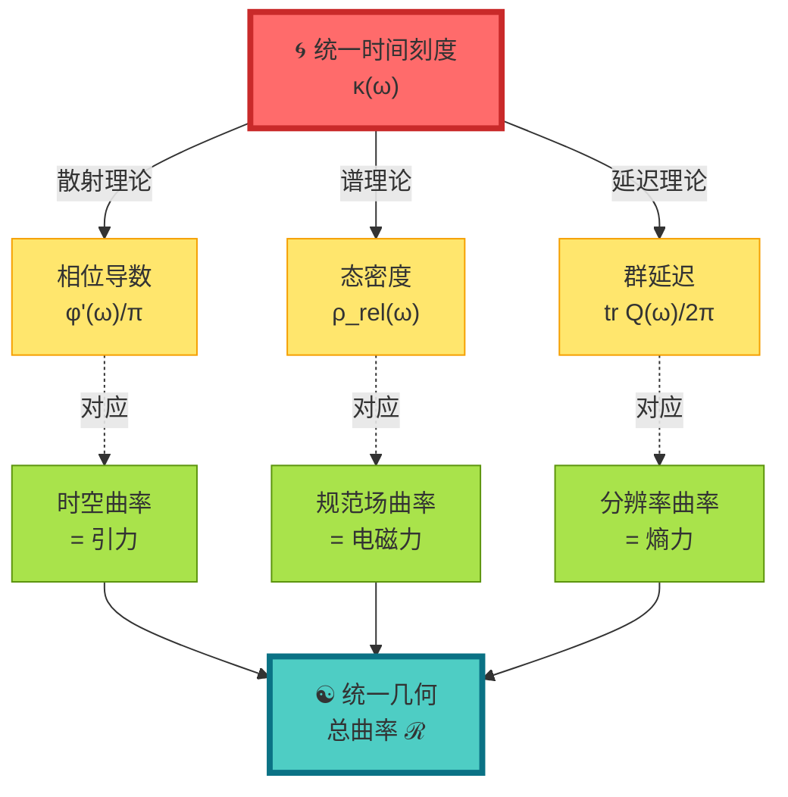

**三重统一**：

1. **散射–谱–延迟**统一为时间刻度 $\kappa(\omega)$（第8节）
2. **引力–电磁–熵力**统一为总曲率 $\boldsymbol{\mathcal{R}}$（本节）
3. **时间刻度 = 几何曲率**（最深层统一）

---

## 实验可验证性

### 验证1：微波网络测量

---

### 验证2：原子钟引力红移

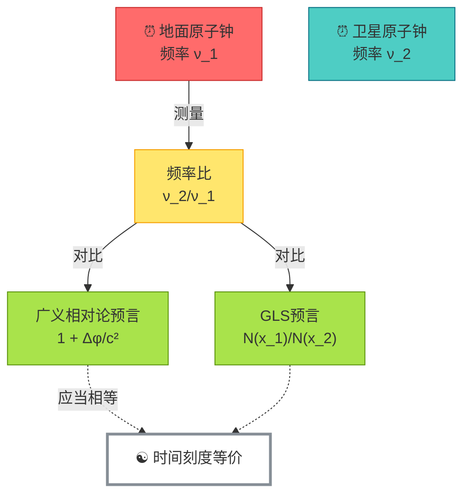

---

## 哲学意义：重新理解"力"

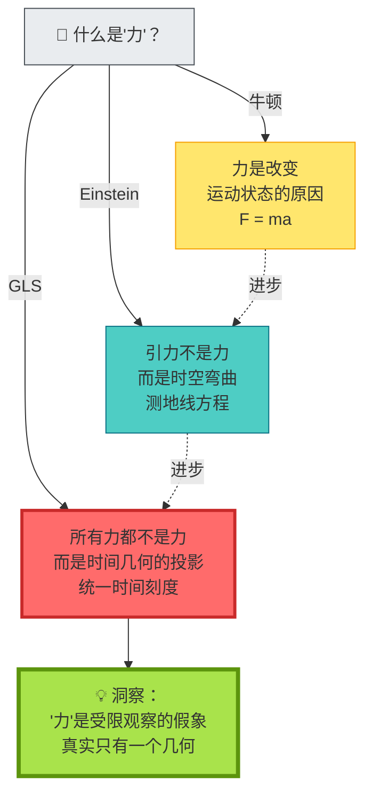

**深层启示**：

1. **牛顿时代**："力"是基本的
2. **Einstein时代**："引力"不是力，是几何
3. **GLS时代**：**所有"力"都不是力，都是同一时间几何的不同面**

这彻底改变了我们对宇宙的理解：

- 不是"四种基本力"，而是**一个统一几何**
- 不是"粒子受力运动"，而是**沿最优时间路径演化**
- 不是"时空 + 力 + 物质"，而是**时间几何本身**

---

## 与其他章节的联系

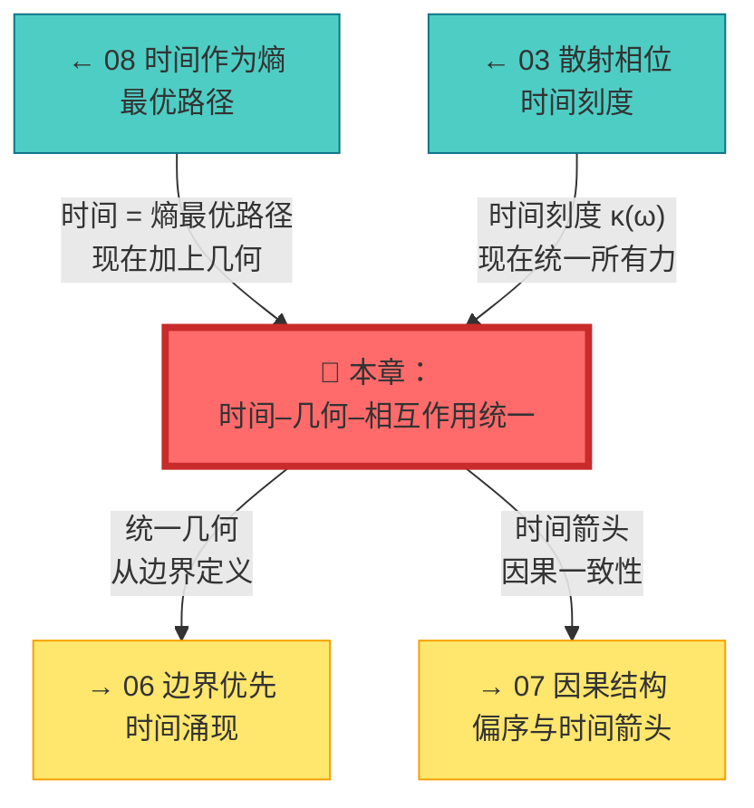

---

## 本章小结

**核心洞见**：

> **"力"不存在，只有时间几何的弯曲。引力、电磁力、熵力都是统一时间刻度在不同方向（时空、内部空间、分辨率）的投影。**

**关键公式**：

总联络与总曲率：
$$
\boldsymbol{\Omega} = \omega_{\mathrm{LC}} \oplus A_{\mathrm{YM}} \oplus \Gamma_{\mathrm{res}}
$$
$$
\boldsymbol{\mathcal{R}} = R \oplus F \oplus \mathcal{R}_{\mathrm{res}}
$$

无基本力定理：
$$
m\frac{D^{2}x^{\mu}}{D\tau^{2}} = qF^{\mu}{}_{\nu}\frac{\mathrm{d}x^{\nu}}{\mathrm{d}\tau} + f^{\mu}_{\mathrm{res}}
$$

引力红移 = 时间刻度重标：
$$
\kappa(\omega; \mathbf{x}) = N^{-1}(\mathbf{x}) \kappa_{\infty}(\omega)
$$

**日常比喻**：

- **盲人摸象**：不同的"力"是同一只象的不同部位
- **山的剪影**：从不同角度看到不同的轮廓，但只有一座山
- **弯曲道路**：你感受到"侧向力"，但实际只是道路在弯曲

**哲学启示**：

宇宙的统一性比我们想象的更深：不仅物质与能量统一（$E=mc^{2}$），不仅时空与引力统一（Einstein），**现在时间、几何与所有相互作用都统一为一个结构**。

---

## 延伸阅读

**源理论文献**：
- `docs/euler-gls-paper-time/time-geometry-interaction-unified-framework.md` - 时间–几何–相互作用统一框架的完整数学推导
- `docs/euler-gls-union/time-geometry-unified-framework.md` - 统一框架的进一步展开

**相关章节**：
- [03 散射相位与时间刻度](../02-scattering-time/03-scattering-phase-time-scale.md) - 时间刻度的散射理论基础
- [08 时间作为广义熵最优路径](./08-time-as-entropy.md) - 时间的变分原理
- [06 边界优先与时间涌现](../06-boundary-theory/01-boundary-priority.md) - 统一几何的边界定义
- [10 矩阵宇宙](../10-matrix-universe/01-reality-matrix.md) - 统一框架在宇宙学中的应用

---

*下一章，我们将探讨**拓扑不变量与时间**，看看时间几何的拓扑结构如何约束物理规律。*
