# 09 Unification of Time–Geometry–Interaction: No "Force," Only the Curvature of Time

## Core Idea

In our everyday experience, there exist various "forces":

- **Gravity** makes apples fall
- **Electromagnetic force** makes magnets attract
- **Friction** slows down wheels

But GLS theory tells us a stunning truth: **These "forces" do not actually exist!** They are all projections of the same deeper structure—**unified time geometry**—in different directions.

Just as a mountain has different silhouettes from different viewing angles, the geometric curvature of time manifests as different "forces" for different observers and at different energy scales.

---

## Everyday Analogy: Blind Men and the Elephant, Multiple Projections

Imagine the following scenario:

```mermaid
graph TB
    Mountain["🏔️ Unified Time Geometry<br/>(Real Three-Dimensional Mountain)"]

    Shadow1["⬛ Projection 1: Gravity<br/>(Silhouette from East)"]
    Shadow2["⬛ Projection 2: Electromagnetic Force<br/>(Silhouette from South)"]
    Shadow3["⬛ Projection 3: Entropic Force<br/>(Silhouette from Above)"]

    Mountain -->|Eastern Observer| Shadow1
    Mountain -->|Southern Observer| Shadow2
    Mountain -->|Overhead Observer| Shadow3

    Shadow1 -.->|"Seem Different<br/>Actually One"| Unity["☯️ Unified Essence"]
    Shadow2 -.-> Unity
    Shadow3 -.-> Unity

    style Mountain fill:#ff6b6b,stroke:#c92a2a,stroke-width:4px
    style Unity fill:#4ecdc4,stroke:#0b7285,stroke-width:3px
    style Shadow1 fill:#ffe66d,stroke:#f59f00
    style Shadow2 fill:#ffe66d,stroke:#f59f00
    style Shadow3 fill:#ffe66d,stroke:#f59f00
```

**Key Insight**:

- Three observers each see different "forces" (silhouettes)
- But these forces all come from the same mountain (unified time geometry)
- The mountain itself has no distinction between "eastern force" and "southern force"—there is only one complete shape
- "Force" is an illusion caused by our **limited way of observation**

---

## Traditional Physics vs. GLS Unified Framework

### Traditional View: Four Fundamental Forces

```mermaid
graph LR
    subgraph "Traditional Physics: Four Independent Fundamental Forces"
        Gravity["⚡ Gravity<br/>Einstein Equations"]
        EM["⚡ Electromagnetic Force<br/>Maxwell Equations"]
        Weak["⚡ Weak Force<br/>Gauge Theory"]
        Strong["⚡ Strong Force<br/>QCD"]
    end

    Particle["🎯 Particle"] --> Gravity
    Particle --> EM
    Particle --> Weak
    Particle --> Strong

    Gravity -.->|"Attempting Unification<br/>Great Difficulties"| Question["❓"]
    EM -.-> Question
    Weak -.-> Question
    Strong -.-> Question

    style Particle fill:#e9ecef,stroke:#495057
    style Gravity fill:#ff6b6b,stroke:#c92a2a
    style EM fill:#4ecdc4,stroke:#0b7285
    style Weak fill:#ffe66d,stroke:#f59f00
    style Strong fill:#a9e34b,stroke:#5c940d
    style Question fill:#fff,stroke:#868e96,stroke-dasharray: 5 5
```

### GLS View: Unified Time Geometry

```mermaid
graph TB
    subgraph "GLS Unified Framework: One Geometry, Multiple Projections"
        Core["🌀 Unified Time Geometry<br/>Total Connection Ω"]

        Core -->|Levi-Civita Component| Gravity2["Gravity<br/>Spacetime Curvature R"]
        Core -->|Yang-Mills Component| EM2["Gauge Force<br/>Field Strength F"]
        Core -->|Resolution Component| Entropy["Entropic Force<br/>Coarse-Grained Curvature"]
    end

    Observer["👁️ Observer<br/>+ Resolution"] --> Core

    Gravity2 -.->|Same Essence| Unity2["☯️ Curvature of Time Scale"]
    EM2 -.-> Unity2
    Entropy -.-> Unity2

    style Core fill:#ff6b6b,stroke:#c92a2a,stroke-width:4px
    style Observer fill:#e9ecef,stroke:#495057
    style Gravity2 fill:#4ecdc4,stroke:#0b7285
    style EM2 fill:#4ecdc4,stroke:#0b7285
    style Entropy fill:#4ecdc4,stroke:#0b7285
    style Unity2 fill:#ffe66d,stroke:#f59f00,stroke-width:3px
```

**Key Difference**:

1. **Traditional Physics**: Four independent forces → unification difficult
2. **GLS Framework**: One time geometry → natural unification

---

## Three Key Concepts

### 1. Total Bundle and Total Connection: The Unified Stage

Imagine you are in a **three-story building**:

```mermaid
graph TB
    subgraph "Total Bundle Structure = Three-Story Building"
        Floor1["🏢 Floor 1: Spacetime<br/>(Your Position)"]
        Floor2["🏢 Floor 2: Internal Charge<br/>(Your 'Color')"]
        Floor3["🏢 Floor 3: Resolution<br/>(Your 'Vision')"]
    end

    Connection["🔗 Total Connection Ω<br/>= Elevator Rules Between Floors"]

    Floor1 --> Connection
    Floor2 --> Connection
    Floor3 --> Connection

    Connection -->|Project to Floor 1| Curvature1["Spacetime Curvature R<br/>= Gravity"]
    Connection -->|Project to Floor 2| Curvature2["Field Strength F<br/>= Electromagnetic Force"]
    Connection -->|Project to Floor 3| Curvature3["RG Flow Curvature<br/>= Entropic Force"]

    style Connection fill:#ff6b6b,stroke:#c92a2a,stroke-width:4px
    style Floor1 fill:#4ecdc4,stroke:#0b7285
    style Floor2 fill:#4ecdc4,stroke:#0b7285
    style Floor3 fill:#4ecdc4,stroke:#0b7285
    style Curvature1 fill:#ffe66d,stroke:#f59f00
    style Curvature2 fill:#ffe66d,stroke:#f59f00
    style Curvature3 fill:#ffe66d,stroke:#f59f00
```

**Mathematical Expression**:

Total connection:
$$
\boldsymbol{\Omega} = \omega_{\mathrm{LC}} \oplus A_{\mathrm{YM}} \oplus \Gamma_{\mathrm{res}}
$$

Where:
- $\omega_{\mathrm{LC}}$ = Levi-Civita spin connection (Floor 1)
- $A_{\mathrm{YM}}$ = Yang-Mills gauge field (Floor 2)
- $\Gamma_{\mathrm{res}}$ = Resolution flow connection (Floor 3)

Total curvature:
$$
\boldsymbol{\mathcal{R}} = \mathrm{d}\boldsymbol{\Omega} + \boldsymbol{\Omega} \wedge \boldsymbol{\Omega} = R \oplus F \oplus \mathcal{R}_{\mathrm{res}}
$$

**Intuitive Understanding**:

- You move between three floors, each with its own "rules" (connection)
- If you **only look at Floor 1**, you feel "gravity"
- If you **only look at Floor 2**, you feel "electromagnetic force"
- If you **only look at Floor 3**, you feel "entropic force"
- But actually, **there is only one set of elevator rules** (total connection), manifesting differently on different floors

---

### 2. No Fundamental Force Theorem: Force is Projection of Curvature

Imagine you drive a car on a **curved road**:

```mermaid
graph LR
    Road["🛣️ Curved Road<br/>(Time Geometry)"]

    Road -->|You Only Look Ahead| Feel1["Feel: Force to Left<br/>(Gravity)"]
    Road -->|You Only Look Sideways| Feel2["Feel: Force Upward<br/>(Centrifugal Force)"]
    Road -->|You Only Look Down| Feel3["Feel: Bumps<br/>(Entropic Force)"]

    Reality["🌟 Truth:<br/>Road Itself is Curved<br/>No 'Force'"]

    Feel1 -.-> Reality
    Feel2 -.-> Reality
    Feel3 -.-> Reality

    style Road fill:#ff6b6b,stroke:#c92a2a,stroke-width:3px
    style Reality fill:#4ecdc4,stroke:#0b7285,stroke-width:4px
    style Feel1 fill:#ffe66d,stroke:#f59f00
    style Feel2 fill:#ffe66d,stroke:#f59f00
    style Feel3 fill:#ffe66d,stroke:#f59f00
```

**Mathematical Theorem (No Fundamental Force Proposition)**:

In the semiclassical limit, particle center-of-mass trajectory satisfies:

$$
m\frac{D^{2}x^{\mu}}{D\tau^{2}} = qF^{\mu}{}_{\nu}\frac{\mathrm{d}x^{\nu}}{\mathrm{d}\tau} + f^{\mu}_{\mathrm{res}}
$$

Where:
- $F^{\mu}{}_{\nu}$ = Yang-Mills field strength (appears as "electromagnetic force")
- $f^{\mu}_{\mathrm{res}}$ = Resolution flow curvature (appears as "entropic force")
- $D/D\tau$ = Levi-Civita covariant derivative (contains "gravity")

**Key Insight**:

- **Gravity** = curvature along spacetime direction
- **Electromagnetic Force** = curvature along charge direction
- **Entropic Force** = curvature along resolution direction

**They are all components of the same total curvature** $\boldsymbol{\mathcal{R}}$ **in different directions!**

---

### 3. Gravitational Redshift = Time Scale Rescaling

Returning to the hourglass analogy from Section 8, now adding gravity:

```mermaid
graph TB
    subgraph "Hourglass on Ground"
        Ground["⏳ Ground Hourglass<br/>Strong Gravitational Field<br/>N(ground) = 1"]
    end

    subgraph "Hourglass on Mountain Top"
        Mountain["⏳ Mountain Top Hourglass<br/>Weak Gravitational Field<br/>N(mountain) > 1"]
    end

    Ground -->|"Ground Time Scale<br/>κ_ground = κ_∞ / N(ground)"| Time1["1 second"]
    Mountain -->|"Mountain Time Scale<br/>κ_mountain = κ_∞ / N(mountain)"| Time2["1.0000001 seconds"]

    Compare["⚖️ Comparison:<br/>Mountain Time Faster<br/>= Gravitational Redshift"]

    Time1 -.-> Compare
    Time2 -.-> Compare

    style Ground fill:#ff6b6b,stroke:#c92a2a
    style Mountain fill:#4ecdc4,stroke:#0b7285
    style Compare fill:#ffe66d,stroke:#f59f00,stroke-width:3px
```

**Mathematical Relation**:

Scale density in static gravitational field:
$$
\kappa(\omega; \mathbf{x}) = N^{-1}(\mathbf{x}) \kappa_{\infty}(\omega)
$$

Where $N(\mathbf{x})$ is the gravitational redshift factor (at infinity $N(\infty) = 1$).

**Intuitive Understanding**:

- **Strong Gravity** → **Slow Time** → **Hourglass Drips Slowly** → **High Time Scale Density**
- **Weak Gravity** → **Fast Time** → **Hourglass Drips Quickly** → **Low Time Scale Density**

Gravity is not a "force," but **spatially dependent rescaling of time scale**!

---

## Concrete Examples: From Microscopic to Macroscopic

### Example 1: "Coulomb Force" in Impurity Scattering

**Traditional Image**:

- Electron approaches impurity
- Experiences "Coulomb repulsion" $F = kq_{1}q_{2}/r^{2}$
- Orbit deflects

**GLS Image**:

```mermaid
graph LR
    Electron["⚛️ Electron Wave Packet"]
    Impurity["💎 Impurity"]

    Electron -->|"Phase Accumulation<br/>φ(ω)"| Phase["Phase Curvature<br/>= Time Scale Change"]
    Impurity -->|"Changes Local Potential"| Phase

    Phase -->|"Projection"| Scattering["Scattering<br/>(Appears as 'Force')"]

    Formula["κ(ω) = φ'(ω)/π<br/>= ρ_rel(ω)<br/>Time Scale Density"]

    Phase -.-> Formula

    style Electron fill:#4ecdc4,stroke:#0b7285
    style Impurity fill:#ff6b6b,stroke:#c92a2a
    style Phase fill:#ffe66d,stroke:#f59f00,stroke-width:3px
    style Scattering fill:#e9ecef,stroke:#495057
    style Formula fill:#fff,stroke:#868e96
```

**Key**: There is no "force," only the phase of the electron wave function (= time scale) curving near the impurity.

---

### Example 2: "Universal Gravitation" in Earth's Orbit

**Traditional Image**:

- Earth experiences "gravitational force" from Sun $F = GMm/r^{2}$
- Centripetal acceleration $a = v^{2}/r$

**GLS Image**:

```mermaid
graph TB
    Sun["☀️ Solar Mass<br/>Curves Spacetime"]

    Sun -->|"Produces Metric<br/>g = -N²dt² + ..."| Metric["Metric Field<br/>N(r) < 1"]

    Metric -->|"Time Scale<br/>κ(r) ∝ N⁻¹(r)"| TimeScale["Time Scale Density<br/>Varies with r"]

    TimeScale -->|"Earth Follows Geodesic<br/>(Optimal Time Path)"| Orbit["Elliptical Orbit<br/>(Appears as 'Gravitational Force')"]

    style Sun fill:#ff6b6b,stroke:#c92a2a,stroke-width:3px
    style Metric fill:#ffe66d,stroke:#f59f00
    style TimeScale fill:#4ecdc4,stroke:#0b7285
    style Orbit fill:#e9ecef,stroke:#495057
```

**Key**: Earth is **not "pulled" toward the Sun**, but moves along the **time-scale-optimal path** (geodesic) in curved time geometry.

---

### Example 3: "Elastic Force" in Rubber Band

**Traditional Image**:

- Stretch rubber band
- Molecules experience "restoring force" $F = -kx$

**GLS Image**:

**Key**: Elastic force is the **spatial gradient of entropy** projected at macroscopic resolution, essentially **time geometric curvature in the resolution direction**.

---

## Triple Unification of Time Scale Identity

Recalling the core formula from Section 8, we now see its deeper meaning:

$$
\kappa(\omega) = \frac{\varphi'(\omega)}{\pi} = \rho_{\mathrm{rel}}(\omega) = \frac{1}{2\pi}\mathrm{tr}\,Q(\omega)
$$

```mermaid
graph TB
    Core["🌀 Unified Time Scale<br/>κ(ω)"]

    Core -->|Scattering Theory| Phase["Phase Derivative<br/>φ'(ω)/π"]
    Core -->|Spectral Theory| Density["Density of States<br/>ρ_rel(ω)"]
    Core -->|Delay Theory| Delay["Group Delay<br/>tr Q(ω)/2π"]

    Phase -.->|Corresponds to| Geometry1["Spacetime Curvature<br/>= Gravity"]
    Density -.->|Corresponds to| Geometry2["Gauge Field Curvature<br/>= Electromagnetic Force"]
    Delay -.->|Corresponds to| Geometry3["Resolution Curvature<br/>= Entropic Force"]

    Geometry1 --> Unity["☯️ Unified Geometry<br/>Total Curvature ℛ"]
    Geometry2 --> Unity
    Geometry3 --> Unity

    style Core fill:#ff6b6b,stroke:#c92a2a,stroke-width:4px
    style Unity fill:#4ecdc4,stroke:#0b7285,stroke-width:4px
    style Phase fill:#ffe66d,stroke:#f59f00
    style Density fill:#ffe66d,stroke:#f59f00
    style Delay fill:#ffe66d,stroke:#f59f00
    style Geometry1 fill:#a9e34b,stroke:#5c940d
    style Geometry2 fill:#a9e34b,stroke:#5c940d
    style Geometry3 fill:#a9e34b,stroke:#5c940d
```

**Triple Unification**:

1. **Scattering–Spectral–Delay** unified as time scale $\kappa(\omega)$ (Section 8)
2. **Gravity–Electromagnetic–Entropic Force** unified as total curvature $\boldsymbol{\mathcal{R}}$ (this section)
3. **Time Scale = Geometric Curvature** (deepest unification)

---

## Experimental Verifiability

### Verification 1: Microwave Network Measurement

---

### Verification 2: Atomic Clock Gravitational Redshift

```mermaid
graph TB
    Clock1["⏰ Ground Atomic Clock<br/>Frequency ν_1"]
    Clock2["⏰ Satellite Atomic Clock<br/>Frequency ν_2"]

    Clock1 -->|Measure| Ratio["Frequency Ratio<br/>ν_2/ν_1"]

    Ratio -->|Compare| GR["General Relativity Prediction<br/>1 + Δφ/c²"]
    Ratio -->|Compare| GLS["GLS Prediction<br/>N(x_1)/N(x_2)"]

    GR -.->|Should Be Equal| Unity["☯️ Time Scale Equivalence"]
    GLS -.-> Unity

    style Clock1 fill:#ff6b6b,stroke:#c92a2a
    style Clock2 fill:#4ecdc4,stroke:#0b7285
    style Ratio fill:#ffe66d,stroke:#f59f00
    style GR fill:#a9e34b,stroke:#5c940d
    style GLS fill:#a9e34b,stroke:#5c940d
    style Unity fill:#fff,stroke:#868e96,stroke-width:3px
```

---

## Philosophical Meaning: Reunderstanding "Force"

```mermaid
graph TB
    Question["🤔 What is 'Force'?"]

    Question -->|Newton| Newton["Force is Cause of<br/>Changing Motion State<br/>F = ma"]
    Question -->|Einstein| Einstein["Gravity is Not Force<br/>But Spacetime Curvature<br/>Geodesic Equation"]
    Question -->|GLS| GLS["All Forces are Not Forces<br/>But Projections of Time Geometry<br/>Unified Time Scale"]

    Newton -.->|Progress| Einstein
    Einstein -.->|Progress| GLS

    GLS --> Insight["💡 Insight:<br/>'Force' is Illusion of Limited Observation<br/>Reality is Only One Geometry"]

    style Question fill:#e9ecef,stroke:#495057
    style Newton fill:#ffe66d,stroke:#f59f00
    style Einstein fill:#4ecdc4,stroke:#0b7285
    style GLS fill:#ff6b6b,stroke:#c92a2a,stroke-width:3px
    style Insight fill:#a9e34b,stroke:#5c940d,stroke-width:4px
```

**Deep Revelations**:

1. **Newton Era**: "Force" is fundamental
2. **Einstein Era**: "Gravity" is not force, but geometry
3. **GLS Era**: **All "forces" are not forces, but different faces of the same time geometry**

This fundamentally changes our understanding of the universe:

- Not "four fundamental forces," but **one unified geometry**
- Not "particles moving under force," but **evolution along optimal time paths**
- Not "spacetime + force + matter," but **time geometry itself**

---

## Connections to Other Chapters

```mermaid
graph TB
    Current["📍 This Chapter:<br/>Time–Geometry–Interaction Unification"]

    Prev1["← 08 Time as Entropy<br/>Optimal Path"]
    Prev2["← 03 Scattering Phase<br/>Time Scale"]

    Next1["→ 06 Boundary Priority<br/>Time Emergence"]
    Next2["→ 07 Causal Structure<br/>Partial Order and Arrow of Time"]

    Prev1 -->|"Time = Entropy Optimal Path<br/>Now Add Geometry"| Current
    Prev2 -->|"Time Scale κ(ω)<br/>Now Unify All Forces"| Current

    Current -->|"Unified Geometry<br/>Defined from Boundary"| Next1
    Current -->|"Arrow of Time<br/>Causal Consistency"| Next2

    style Current fill:#ff6b6b,stroke:#c92a2a,stroke-width:4px
    style Prev1 fill:#4ecdc4,stroke:#0b7285
    style Prev2 fill:#4ecdc4,stroke:#0b7285
    style Next1 fill:#ffe66d,stroke:#f59f00
    style Next2 fill:#ffe66d,stroke:#f59f00
```

---

## Chapter Summary

**Core Insight**:

> **"Force" does not exist, only the curvature of time geometry. Gravity, electromagnetic force, and entropic force are all projections of unified time scale in different directions (spacetime, internal space, resolution).**

**Key Formulas**:

Total connection and total curvature:
$$
\boldsymbol{\Omega} = \omega_{\mathrm{LC}} \oplus A_{\mathrm{YM}} \oplus \Gamma_{\mathrm{res}}
$$
$$
\boldsymbol{\mathcal{R}} = R \oplus F \oplus \mathcal{R}_{\mathrm{res}}
$$

No fundamental force theorem:
$$
m\frac{D^{2}x^{\mu}}{D\tau^{2}} = qF^{\mu}{}_{\nu}\frac{\mathrm{d}x^{\nu}}{\mathrm{d}\tau} + f^{\mu}_{\mathrm{res}}
$$

Gravitational redshift = time scale rescaling:
$$
\kappa(\omega; \mathbf{x}) = N^{-1}(\mathbf{x}) \kappa_{\infty}(\omega)
$$

**Everyday Metaphors**:

- **Blind Men and the Elephant**: Different "forces" are different parts of the same elephant
- **Mountain Silhouette**: Different silhouettes from different angles, but only one mountain
- **Curved Road**: You feel "lateral force," but actually the road is just curved

**Philosophical Revelation**:

The unity of the universe is deeper than we imagined: not only matter and energy unified ($E=mc^{2}$), not only spacetime and gravity unified (Einstein), **now time, geometry, and all interactions are unified into one structure**.

---

## Extended Reading

**Source Theoretical Literature**:
- `docs/euler-gls-paper-time/time-geometry-interaction-unified-framework.md` - Complete mathematical derivation of time–geometry–interaction unified framework
- `docs/euler-gls-union/time-geometry-unified-framework.md` - Further development of unified framework

**Related Chapters**:
- [03 Scattering Phase and Time Scale](../02-scattering-time/03-scattering-phase-time-scale_en.md) - Scattering theoretical foundation of time scale
- [08 Time as Generalized Entropy Optimal Path](./08-time-as-entropy_en.md) - Variational principle of time
- [06 Boundary Priority and Time Emergence](../06-boundary-theory/01-boundary-priority_en.md) - Boundary definition of unified geometry
- [10 Matrix Universe](../10-matrix-universe/01-reality-matrix_en.md) - Application of unified framework in cosmology

---

*In the next chapter, we will explore **topological invariants and time**, seeing how the topological structure of time geometry constrains physical laws.*

