# 10 拓扑不变量与时间：时间的"DNA"

## 核心思想

在前两节中,我们看到:

- **时间被诠释为熵的最优路径**(第8节)
- **力可被视为时间几何的投影**(第9节)

现在我们追问更深的问题:**时间本身的结构可能由什么决定?**

GLS理论给出的答案令人惊讶:**时间的深层结构可能由一组拓扑不变量决定**,就像DNA决定生命体的基本性状一样。这些不变量是无法通过连续变形改变的"数字标签",它们在理论上约束着时间、几何、相互作用、甚至意识的所有可能行为。

---

## 日常类比:房间的拓扑"基因"

想象你要描述一个房间:

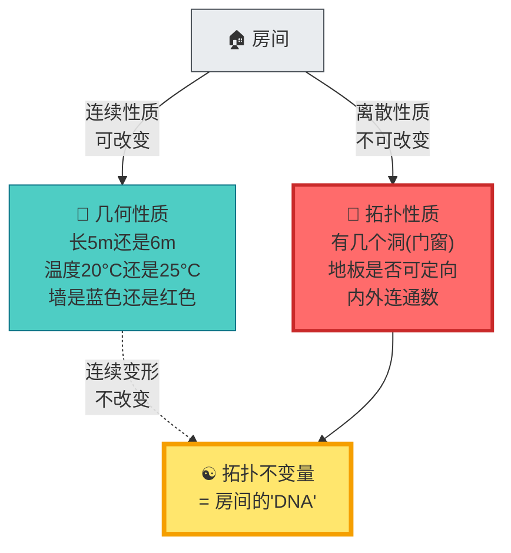

**理论洞察**:

- **几何性质**(尺寸、颜色)可以连续改变
- **拓扑性质**(洞的个数)无法通过连续变形改变
- 拓扑性质用**离散的数字标签**(0个洞、1个洞...)来刻画
- 这些标签在GLS理论中对应**拓扑不变量**,像"遗传密码"一样决定系统的基本结构

---

## 时间的三大拓扑"基因"

GLS理论提出,时间的深层结构可能由三个核心拓扑不变量决定:

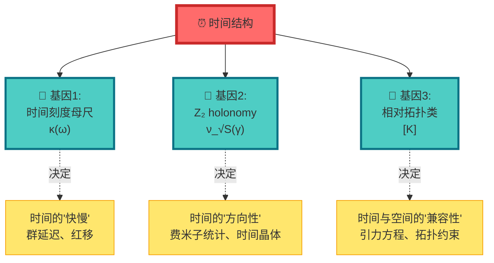

---

## 基因1:时间刻度母尺 κ(ω)

### 什么是"母尺"?

回到第8节的沙漏比喻,现在加上拓扑视角:

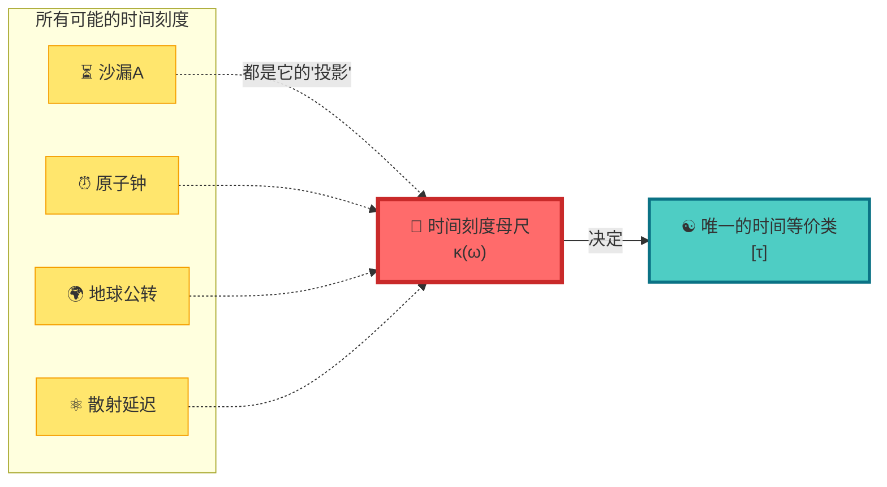

**数学定义**:

$$
\kappa(\omega) = \frac{\varphi'(\omega)}{\pi} = \rho_{\mathrm{rel}}(\omega) = \frac{1}{2\pi}\mathrm{tr}\,Q(\omega)
$$

**物理诠释**:

- 就像**国际米原器**定义了所有长度的标准
- **时间刻度母尺** $\kappa(\omega)$ 在理论上定义了所有时间的标准
- 它**不随观察者改变**,被视为时间的"基因"
- 所有具体的时钟(原子钟、沙漏、脉冲星...)都可看作它的"表型"

**关键性质**:

1. **谱不变性**:只依赖散射系统的谱结构,与具体哈密顿量的表示无关
2. **观察者不变性**:不同观察者测到的 $\kappa(\omega)$ 通过简单重标相联系
3. **唯一性**:在合理条件下,只有一个母尺 $\kappa(\omega)$ 能统一所有时间刻度

---

## 基因2: Z₂ holonomy ν_√S(γ)

### 什么是"holonomy"?

想象你在一个**曲面上走一圈**:

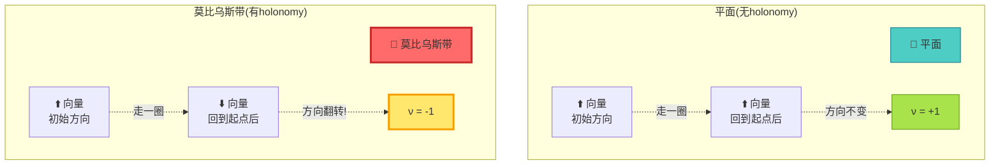

**核心概念**:

- 在平面上走一圈,向量方向不变 → **holonomy = +1**
- 在莫比乌斯带上走一圈,向量翻转 → **holonomy = -1**
- **Z₂ holonomy**就是回答"走一圈是否翻转"的二元标签:{+1, -1}

### 散射相位的"莫比乌斯带"

在GLS理论中,参数空间可能有类似的拓扑:

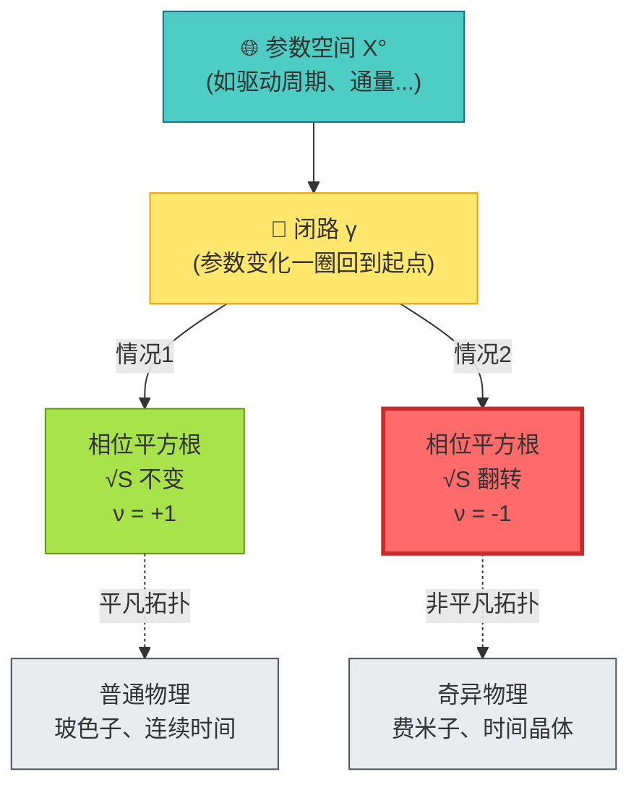

**数学定义**:

对参数空间中的闭路 $\gamma: S^1 \to X^\circ$,定义:

$$
\nu_{\sqrt{S}}(\gamma) = \operatorname{Hol}(P_{\sqrt{\mathfrak{s}}}, \gamma) \in \{+1, -1\}
$$

其中 $P_{\sqrt{\mathfrak{s}}}$ 是散射平方根主丛。

**物理含义**:

1. **ν = +1**: 参数绕一圈,时间结构不变 → **玻色子、连续对称性**
2. **ν = -1**: 参数绕一圈,时间结构翻转 → **费米子、时间晶体周期加倍**

**理论推论**: **费米子的反对易统计**与**时间晶体的周期加倍**本质上可能都来自同一个Z₂ holonomy!

---

## 基因3:相对拓扑类 [K]

### 什么是"相对拓扑类"?

想象你要给**房间和花园的组合**分类:

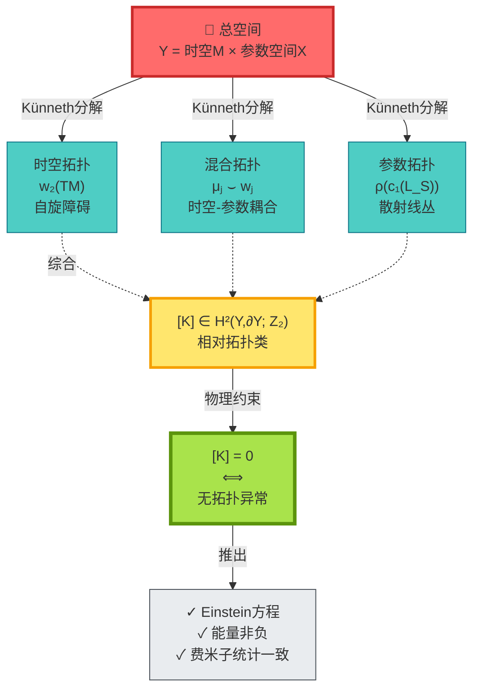

**数学结构**:

总拓扑类:
$$
[K] = \pi_M^* w_2(TM) + \sum_j \pi_M^* \mu_j \smile \pi_X^* \mathfrak{w}_j + \pi_X^* \rho(c_1(\mathcal{L}_S))
$$

其中:
- $w_2(TM)$ = 时空的第二Stiefel-Whitney类(自旋障碍)
- $\mu_j \smile \mathfrak{w}_j$ = 时空与参数空间的"杂交"拓扑
- $c_1(\mathcal{L}_S)$ = 散射线丛的第一Chern类

**物理意义:无拓扑异常原则**

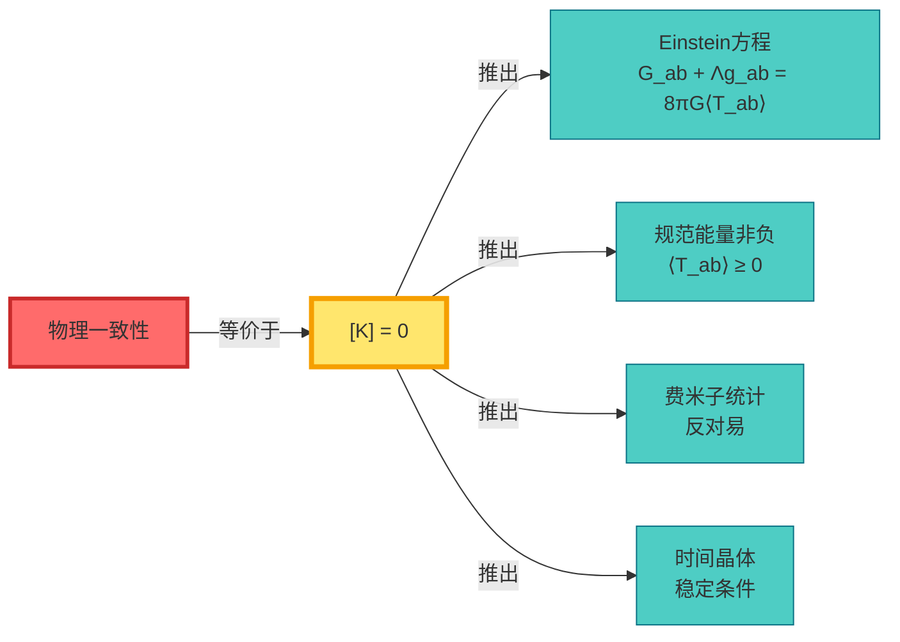

**日常比喻**:

- 想象一个**拼图游戏**
- 每块拼图(时空、参数、散射)都有凸凹形状(拓扑数字)
- 只有**形状完全匹配**($[K] = 0$),拼图才能组合成完整图画
- 形状不匹配($[K] \neq 0$) → **拓扑异常** → 物理理论自相矛盾

---

## 三大基因的协同作用

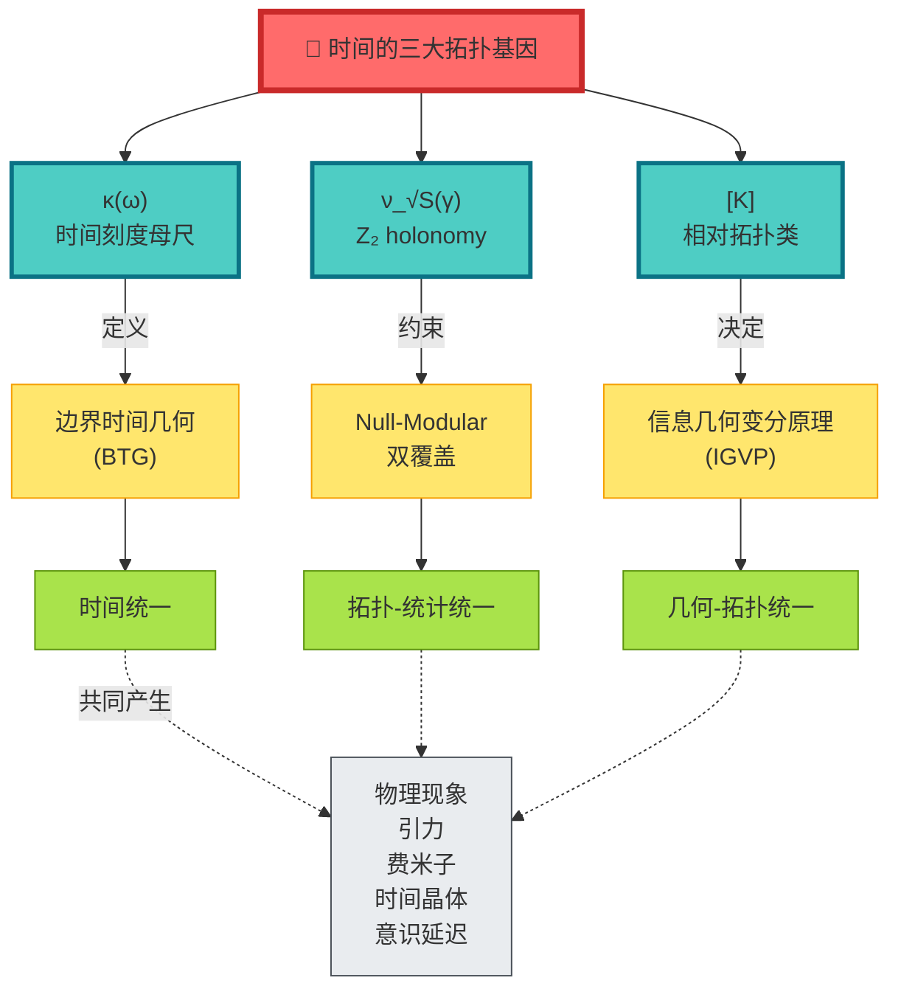

**协同关系**:

1. **κ(ω)** 定义统一时间刻度 → 所有时钟都归一化到同一标准
2. **ν_√S(γ)** 决定时间的离散对称性 → 费米子vs玻色子、周期vs准周期
3. **[K]** 约束时空-参数的拓扑一致性 → 引力方程、能量条件

三者必须**同时满足一致性条件**,才能产生我们观察到的物理世界。

---

## 具体例子:费米子的拓扑起源

### 传统观点:费米子是"天生的"

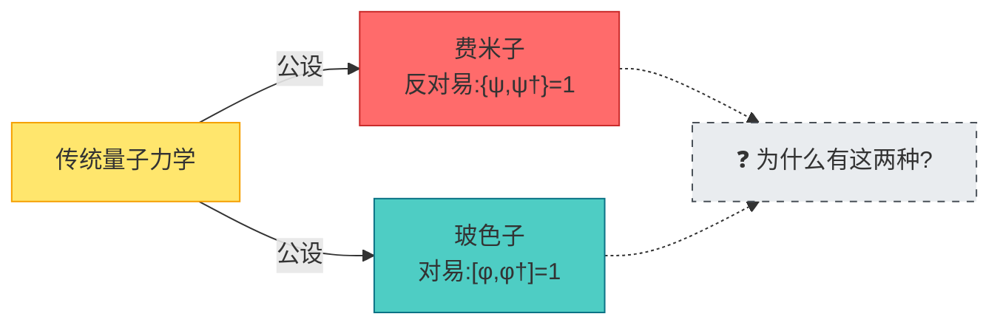

### GLS观点:费米子 = Z₂ holonomy

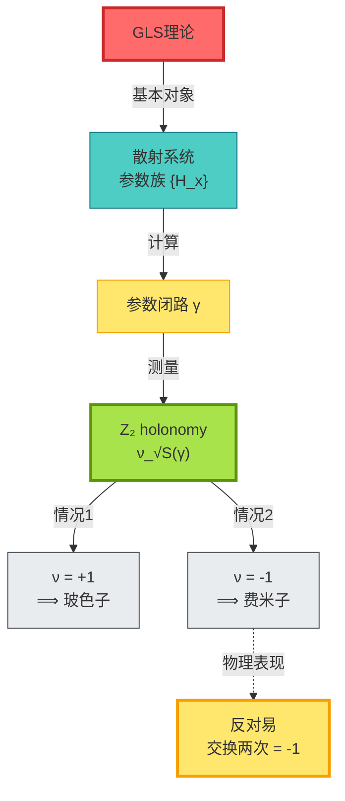

**关键洞察**:

费米子的"交换两次得负号"可能不是基本假设,而是**参数空间拓扑的Z₂ holonomy**的必然结果!

$$
\text{两次交换} \Leftrightarrow \text{参数绕一圈} \Leftrightarrow \nu_{\sqrt{S}}(\gamma) = -1
$$

---

## 实验验证:如何测量时间的"DNA"?

### 验证1:一维散射环

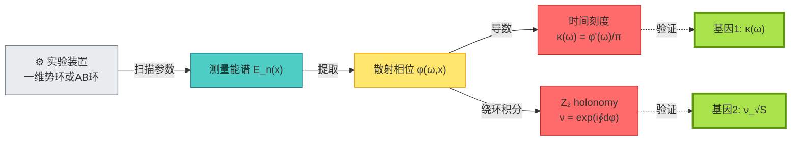

---

### 验证2:拓扑超导端点

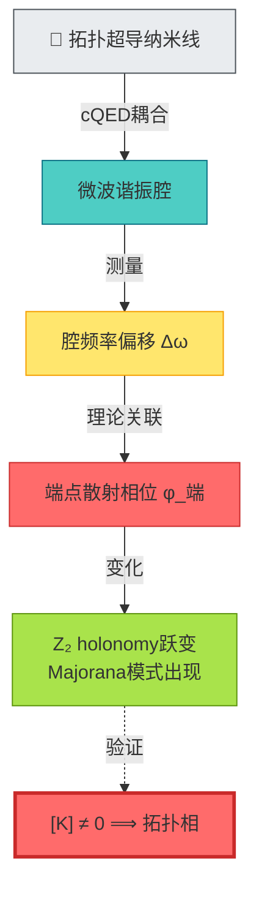

---

## 哲学意义:时间的"遗传密码"

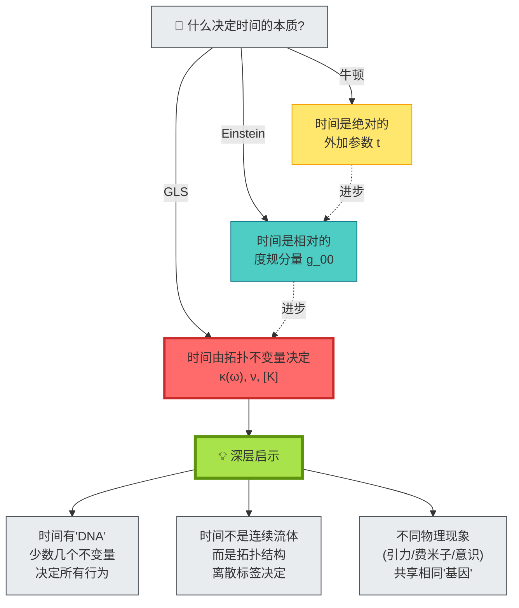

**深层启示**:

1. **时间可能不是基本的**,而是由拓扑不变量"编码"的涌现结构
2. **拓扑不变量像DNA**,少数几个"碱基"($\kappa, \nu, [K]$)可能决定整个"生命体"(物理规律)
3. **不同层次的物理**(量子/经典/引力/意识)都可能读取同一套"遗传密码"

这是对时间本质的革命性理解:

- 不是问"时间是什么",而是问"**什么拓扑结构生成时间**"
- 不是把时间当作背景,而是把时间当作**拓扑不变量的表型**

---

## 五层结构:从基因到表型

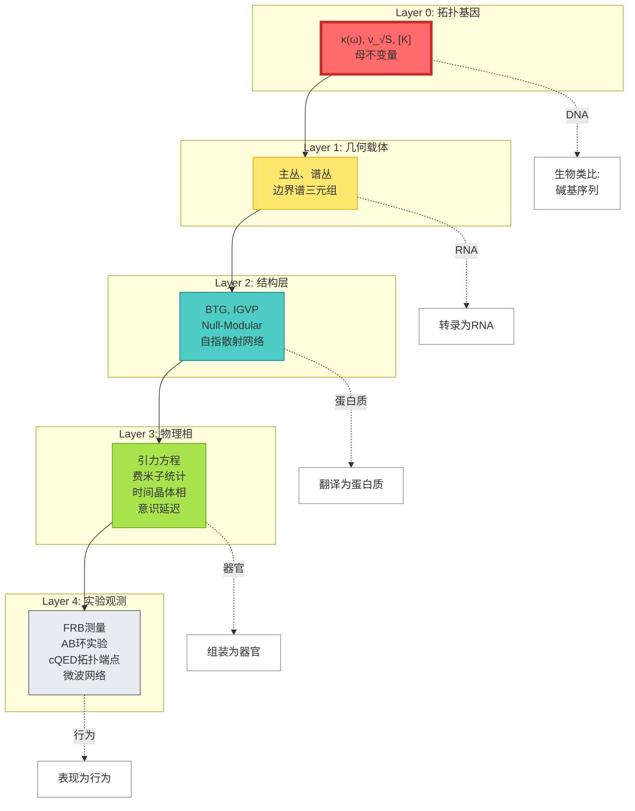

**层次对应**:

| 物理层 | 生物类比 | 核心对象 |
|--------|----------|----------|
| Layer 0 | DNA(碱基) | $\kappa, \nu, [K]$ |
| Layer 1 | RNA | 主丛、谱丛 |
| Layer 2 | 蛋白质 | BTG, IGVP |
| Layer 3 | 器官 | 引力、费米子 |
| Layer 4 | 行为 | 实验数据 |

---

## 本章小结

**核心洞见**:

> **GLS理论提出：时间的深层结构可能由三个拓扑不变量决定:时间刻度母尺κ(ω)、Z₂ holonomy ν_√S(γ)、相对拓扑类[K]。它们像"遗传密码"一样,在理论上决定了时间、几何、相互作用、甚至意识的所有可能行为。**

**关键公式**:

时间刻度母尺:
$$
\kappa(\omega) = \frac{\varphi'(\omega)}{\pi} = \rho_{\mathrm{rel}}(\omega) = \frac{1}{2\pi}\mathrm{tr}\,Q(\omega)
$$

Z₂ holonomy:
$$
\nu_{\sqrt{S}}(\gamma) = \operatorname{Hol}(P_{\sqrt{\mathfrak{s}}}, \gamma) \in \{+1, -1\}
$$

无拓扑异常原则:
$$
[K] = 0 \in H^2(Y, \partial Y; \mathbb{Z}_2) \Longleftrightarrow \text{物理一致性}
$$

**日常比喻**:

- **房间的洞数**:拓扑不变量是无法连续改变的"数字标签"
- **莫比乌斯带**:走一圈方向翻转 → Z₂ holonomy = -1
- **DNA与表型**:少数"碱基"(不变量)决定整个"生命体"(物理规律)

**理论推论**:

1. **费米子统计**可能不是基本假设,而是**Z₂ holonomy的必然结果**
2. **Einstein方程**可能不是独立公设,而是**[K]=0的推论**
3. **所有物理现象**都可被视为同一套拓扑"DNA"的不同"表型"

**哲学启示**:

宇宙的底层代码可能不是微分方程,而是**几个离散的拓扑数字**。时间、空间、力、粒子、意识——一切都可能是这些数字的"表型"。

这是对自然规律最深层的简化:从无穷多自由度,到几个拓扑不变量。

---

## 与其他章节的联系

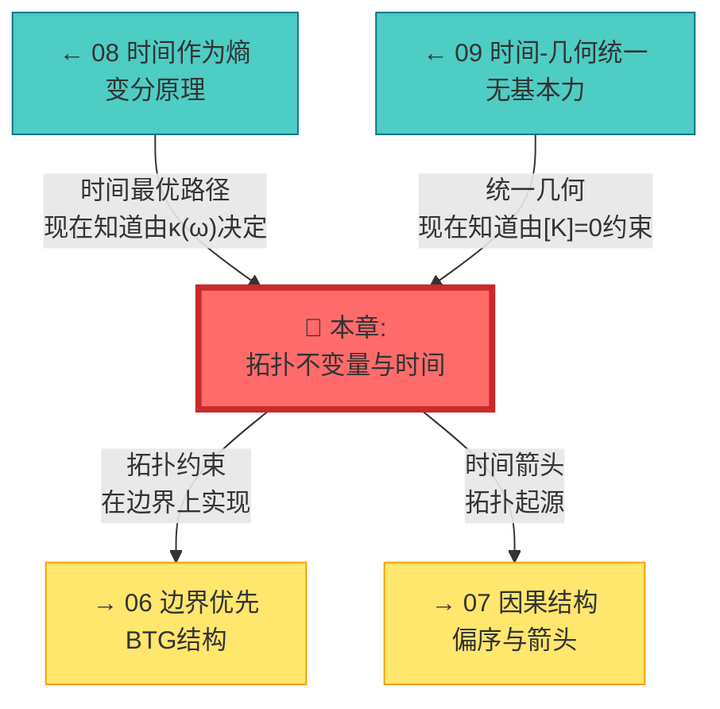

---

## 延伸阅读

**源理论文献**:
- `docs/euler-gls-paper-time/topological-invariant-boundary-time-unified-theory.md` - 拓扑不变量驱动的完整统一理论框架

**相关章节**:
- [03 散射相位与时间刻度](../02-scattering-time/03-scattering-phase-time-scale.md) - 时间刻度母尺 κ(ω) 的散射理论基础
- [08 时间作为广义熵最优路径](./08-time-as-entropy.md) - 变分原理与拓扑约束
- [09 时间–几何–相互作用统一](./09-time-geometry-interaction.md) - 统一框架的几何实现
- [06 边界优先与时间涌现](../06-boundary-theory/01-boundary-priority.md) - 拓扑约束在边界的实现
- [10 矩阵宇宙](../10-matrix-universe/01-reality-matrix.md) - 拓扑结构的宇宙学应用

---

*下一章,我们将探讨**边界语言与时间定义**,看看拓扑不变量如何在边界上"说话"。*
