# 10 Topological Invariants and Time: The "DNA" of Time

## Core Idea

In the previous two sections, we saw:

- **Time is the optimal path of entropy** (Section 8)
- **Force is the projection of time geometry** (Section 9)

Now we ask a deeper question: **What determines the structure of time itself?**

The answer is surprising: **The deep structure of time is determined by a set of topological invariants**, just as DNA determines the basic traits of living organisms. These invariants are "digital labels" that cannot be changed by continuous deformation, constraining all possible behaviors of time, geometry, interactions, and even consciousness.

---

## Everyday Analogy: Topological "Genes" of a Room

Imagine you want to describe a room:

```mermaid
graph TB
    Room["🏠 Room"]

    Room -->|Continuous Properties<br/>Can Change| Geo["📐 Geometric Properties<br/>Length 5m or 6m<br/>Temperature 20°C or 25°C<br/>Wall Color Blue or Red"]

    Room -->|Discrete Properties<br/>Cannot Change| Topo["🔢 Topological Properties<br/>Number of Holes (Doors/Windows)<br/>Floor Orientability<br/>Inside-Outside Connectivity"]

    Geo -.->|"Continuous Deformation<br/>Doesn't Change"| Invariant["☯️ Topological Invariant<br/>= Room's 'DNA'"]
    Topo --> Invariant

    style Room fill:#e9ecef,stroke:#495057
    style Geo fill:#4ecdc4,stroke:#0b7285
    style Topo fill:#ff6b6b,stroke:#c92a2a,stroke-width:3px
    style Invariant fill:#ffe66d,stroke:#f59f00,stroke-width:4px
```

**Key Insight**:

- **Geometric properties** (size, color) can change continuously
- **Topological properties** (number of holes) cannot be changed by continuous deformation
- Topological properties are characterized by **discrete digital labels** (0 holes, 1 hole...)
- These labels are **topological invariants**, determining the basic structure like "genetic code"

---

## Three Topological "Genes" of Time

GLS theory discovers that the deep structure of time is determined by three core topological invariants:

```mermaid
graph TB
    Time["⏰ Time Structure"]

    Time --> DNA1["🧬 Gene 1:<br/>Time Scale Master Scale<br/>κ(ω)"]
    Time --> DNA2["🧬 Gene 2:<br/>Z₂ Holonomy<br/>ν_√S(γ)"]
    Time --> DNA3["🧬 Gene 3:<br/>Relative Topology Class<br/>[K]"]

    DNA1 -.->|Determines| Pheno1["Time's 'Speed'<br/>Group Delay, Redshift"]
    DNA2 -.->|Determines| Pheno2["Time's 'Directionality'<br/>Fermion Statistics, Time Crystals"]
    DNA3 -.->|Determines| Pheno3["Time-Space 'Compatibility'<br/>Gravity Equations, Topological Constraints"]

    style Time fill:#ff6b6b,stroke:#c92a2a,stroke-width:4px
    style DNA1 fill:#4ecdc4,stroke:#0b7285,stroke-width:3px
    style DNA2 fill:#4ecdc4,stroke:#0b7285,stroke-width:3px
    style DNA3 fill:#4ecdc4,stroke:#0b7285,stroke-width:3px
    style Pheno1 fill:#ffe66d,stroke:#f59f00
    style Pheno2 fill:#ffe66d,stroke:#f59f00
    style Pheno3 fill:#ffe66d,stroke:#f59f00
```

---

## Gene 1: Time Scale Master Scale κ(ω)

### What is a "Master Scale"?

Returning to the hourglass analogy from Section 8, now adding a topological perspective:

```mermaid
graph LR
    subgraph "All Possible Time Scales"
        T1["⏳ Hourglass A"]
        T2["⏰ Atomic Clock"]
        T3["🌍 Earth's Revolution"]
        T4["⚛️ Scattering Delay"]
    end

    Master["📏 Time Scale Master Scale<br/>κ(ω)"]

    T1 -.->|"All are its 'projections'"| Master
    T2 -.-> Master
    T3 -.-> Master
    T4 -.-> Master

    Master -->|Determines| Universal["☯️ Unique Time Equivalence Class<br/>[τ]"]

    style Master fill:#ff6b6b,stroke:#c92a2a,stroke-width:4px
    style Universal fill:#4ecdc4,stroke:#0b7285,stroke-width:3px
    style T1 fill:#ffe66d,stroke:#f59f00
    style T2 fill:#ffe66d,stroke:#f59f00
    style T3 fill:#ffe66d,stroke:#f59f00
    style T4 fill:#ffe66d,stroke:#f59f00
```

**Mathematical Definition**:

$$
\kappa(\omega) = \frac{\varphi'(\omega)}{\pi} = \rho_{\mathrm{rel}}(\omega) = \frac{1}{2\pi}\mathrm{tr}\,Q(\omega)
$$

**Intuitive Understanding**:

- Like the **International Prototype Meter** defines the standard for all lengths
- **Time scale master scale** $\kappa(\omega)$ defines the standard for all times
- It **does not change with observer**, it is the "gene" of time
- All specific clocks (atomic clocks, hourglasses, pulsars...) are its "phenotypes"

**Key Properties**:

1. **Spectral Invariance**: Depends only on the spectral structure of the scattering system, independent of the specific representation of the Hamiltonian
2. **Observer Invariance**: Different observers measure $\kappa(\omega)$ related by simple rescaling
3. **Uniqueness**: Under reasonable conditions, there is only one master scale $\kappa(\omega)$ that unifies all time scales

---

## Gene 2: Z₂ Holonomy ν_√S(γ)

### What is "Holonomy"?

Imagine you walk **once around a surface**:

```mermaid
graph TB
    subgraph "Plane (No Holonomy)"
        Plane["📄 Plane"]
        Arrow1["⬆️ Vector<br/>Initial Direction"]
        Arrow2["⬆️ Vector<br/>After Returning to Start"]

        Arrow1 -.->|Walk Once Around| Arrow2
        Arrow2 -.->|Direction Unchanged| Same1["ν = +1"]
    end

    subgraph "Möbius Strip (Has Holonomy)"
        Mobius["🔄 Möbius Strip"]
        Arrow3["⬆️ Vector<br/>Initial Direction"]
        Arrow4["⬇️ Vector<br/>After Returning to Start"]

        Arrow3 -.->|Walk Once Around| Arrow4
        Arrow4 -.->|Direction Flipped!| Flip["ν = -1"]
    end

    style Plane fill:#4ecdc4,stroke:#0b7285
    style Mobius fill:#ff6b6b,stroke:#c92a2a,stroke-width:3px
    style Same1 fill:#a9e34b,stroke:#5c940d
    style Flip fill:#ffe66d,stroke:#f59f00,stroke-width:3px
```

**Core Concept**:

- Walk once around on a plane, vector direction unchanged → **holonomy = +1**
- Walk once around on a Möbius strip, vector flips → **holonomy = -1**
- **Z₂ holonomy** is the binary label answering "does walking once around flip?": {+1, -1}

### The "Möbius Strip" of Scattering Phase

In GLS theory, parameter space may have similar topology:

```mermaid
graph TB
    Parameter["🌐 Parameter Space X°<br/>(e.g., Drive Period, Flux...)"]

    Loop["🔁 Closed Loop γ<br/>(Parameters Change Once Around Back to Start)"]

    Parameter --> Loop

    Loop -->|Case 1| Phase1["Phase Square Root<br/>√S Unchanged<br/>ν = +1"]
    Loop -->|Case 2| Phase2["Phase Square Root<br/>√S Flipped<br/>ν = -1"]

    Phase1 -.->|Trivial Topology| Trivial["Ordinary Physics<br/>Bosons, Continuous Time"]
    Phase2 -.->|Non-Trivial Topology| NonTrivial["Exotic Physics<br/>Fermions, Time Crystals"]

    style Parameter fill:#4ecdc4,stroke:#0b7285
    style Loop fill:#ffe66d,stroke:#f59f00
    style Phase1 fill:#a9e34b,stroke:#5c940d
    style Phase2 fill:#ff6b6b,stroke:#c92a2a,stroke-width:3px
    style Trivial fill:#e9ecef,stroke:#495057
    style NonTrivial fill:#e9ecef,stroke:#495057
```

**Mathematical Definition**:

For a closed loop $\gamma: S^1 \to X^\circ$ in parameter space, define:

$$
\nu_{\sqrt{S}}(\gamma) = \operatorname{Hol}(P_{\sqrt{\mathfrak{s}}}, \gamma) \in \{+1, -1\}
$$

Where $P_{\sqrt{\mathfrak{s}}}$ is the scattering square root principal bundle.

**Physical Meaning**:

1. **ν = +1**: Parameters go once around, time structure unchanged → **Bosons, continuous symmetry**
2. **ν = -1**: Parameters go once around, time structure flips → **Fermions, time crystal period doubling**

**Amazing Fact**: **Fermion anticommutation statistics** and **time crystal period doubling** essentially come from the same Z₂ holonomy!

---

## Gene 3: Relative Topology Class [K]

### What is "Relative Topology Class"?

Imagine you want to classify a **room-garden combination**:

```mermaid
graph TB
    Total["🏡 Total Space<br/>Y = Spacetime M × Parameter Space X"]

    Total -->|Künneth Decomposition| K1["Spacetime Topology<br/>w₂(TM)<br/>Spin Obstruction"]
    Total -->|Künneth Decomposition| K2["Mixed Topology<br/>μⱼ ⌣ wⱼ<br/>Spacetime-Parameter Coupling"]
    Total -->|Künneth Decomposition| K3["Parameter Topology<br/>ρ(c₁(L_S))<br/>Scattering Line Bundle"]

    K1 -.->|Synthesize| Class["[K] ∈ H²(Y,∂Y; Z₂)<br/>Relative Topology Class"]
    K2 -.-> Class
    K3 -.-> Class

    Class -->|Physical Constraint| Constraint["[K] = 0<br/>⟺<br/>No Topological Anomaly"]

    Constraint -->|Implies| Physics["✓ Einstein Equations<br/>✓ Energy Non-Negative<br/>✓ Fermion Statistics Consistent"]

    style Total fill:#ff6b6b,stroke:#c92a2a,stroke-width:3px
    style K1 fill:#4ecdc4,stroke:#0b7285
    style K2 fill:#4ecdc4,stroke:#0b7285
    style K3 fill:#4ecdc4,stroke:#0b7285
    style Class fill:#ffe66d,stroke:#f59f00,stroke-width:3px
    style Constraint fill:#a9e34b,stroke:#5c940d,stroke-width:4px
    style Physics fill:#e9ecef,stroke:#495057
```

**Mathematical Structure**:

Total topology class:
$$
[K] = \pi_M^* w_2(TM) + \sum_j \pi_M^* \mu_j \smile \pi_X^* \mathfrak{w}_j + \pi_X^* \rho(c_1(\mathcal{L}_S))
$$

Where:
- $w_2(TM)$ = Second Stiefel-Whitney class of spacetime (spin obstruction)
- $\mu_j \smile \mathfrak{w}_j$ = "Hybrid" topology of spacetime and parameter space
- $c_1(\mathcal{L}_S)$ = First Chern class of scattering line bundle

**Physical Meaning: No Topological Anomaly Principle**

**Everyday Analogy**:

- Imagine a **jigsaw puzzle**
- Each piece (spacetime, parameters, scattering) has convex-concave shapes (topological numbers)
- Only when **shapes perfectly match** ($[K] = 0$) can pieces combine into a complete picture
- Shape mismatch ($[K] \neq 0$) → **Topological anomaly** → Physical theory self-contradictory

---

## Synergistic Action of Three Genes

**Synergistic Relationship**:

1. **κ(ω)** defines unified time scale → All clocks normalized to the same standard
2. **ν_√S(γ)** determines discrete symmetry of time → Fermions vs bosons, periodic vs quasiperiodic
3. **[K]** constrains topological consistency of spacetime-parameters → Gravity equations, energy conditions

All three must **simultaneously satisfy consistency conditions** to produce the physical world we observe.

---

## Concrete Example: Topological Origin of Fermions

### Traditional View: Fermions are "Innate"

```mermaid
graph LR
    Traditional["Traditional Quantum Mechanics"]

    Traditional -->|Postulate| Fermion["Fermions<br/>Anticommutation: {ψ,ψ†}=1"]
    Traditional -->|Postulate| Boson["Bosons<br/>Commutation: [φ,φ†]=1"]

    Question["❓ Why Are There These Two?"]

    Fermion -.-> Question
    Boson -.-> Question

    style Traditional fill:#ffe66d,stroke:#f59f00
    style Fermion fill:#ff6b6b,stroke:#c92a2a
    style Boson fill:#4ecdc4,stroke:#0b7285
    style Question fill:#e9ecef,stroke:#495057,stroke-dasharray: 5 5
```

### GLS View: Fermions = Z₂ Holonomy

```mermaid
graph TB
    GLS["GLS Theory"]

    GLS -->|Fundamental Object| Scattering["Scattering System<br/>Parameter Family {H_x}"]

    Scattering -->|Compute| Loop["Parameter Closed Loop γ"]

    Loop -->|Measure| Hol["Z₂ Holonomy<br/>ν_√S(γ)"]

    Hol -->|Case 1| Hol1["ν = +1<br/>⟹ Bosons"]
    Hol -->|Case 2| Hol2["ν = -1<br/>⟹ Fermions"]

    Hol2 -.->|Physical Manifestation| Anti["Anticommutation<br/>Exchange Twice = -1"]

    style GLS fill:#ff6b6b,stroke:#c92a2a,stroke-width:3px
    style Scattering fill:#4ecdc4,stroke:#0b7285
    style Loop fill:#ffe66d,stroke:#f59f00
    style Hol fill:#a9e34b,stroke:#5c940d,stroke-width:3px
    style Hol1 fill:#e9ecef,stroke:#495057
    style Hol2 fill:#e9ecef,stroke:#495057
    style Anti fill:#ffe66d,stroke:#f59f00,stroke-width:3px
```

**Key Insight**:

Fermions' "exchange twice gives minus sign" is not a basic assumption, but the inevitable result of **Z₂ holonomy of parameter space topology**!

$$
\text{Exchange Twice} \Leftrightarrow \text{Parameters Go Once Around} \Leftrightarrow \nu_{\sqrt{S}}(\gamma) = -1
$$

---

## Experimental Verification: How to Measure the "DNA" of Time?

### Verification 1: One-Dimensional Scattering Ring

```mermaid
graph LR
    Setup["⚙️ Experimental Setup<br/>1D Potential Ring or AB Ring"]

    Setup -->|Scan Parameters| Measure["Measure Energy Spectrum E_n(x)"]

    Measure -->|Extract| Phase["Scattering Phase φ(ω,x)"]

    Phase -->|Derivative| Kappa["Time Scale<br/>κ(ω) = φ'(ω)/π"]

    Phase -->|Loop Integral| Nu["Z₂ Holonomy<br/>ν = exp(i∮dφ)"]

    Kappa -.->|Verify| DNA1["Gene 1: κ(ω)"]
    Nu -.->|Verify| DNA2["Gene 2: ν_√S"]

    style Setup fill:#e9ecef,stroke:#495057
    style Measure fill:#4ecdc4,stroke:#0b7285
    style Phase fill:#ffe66d,stroke:#f59f00
    style Kappa fill:#ff6b6b,stroke:#c92a2a
    style Nu fill:#ff6b6b,stroke:#c92a2a
    style DNA1 fill:#a9e34b,stroke:#5c940d,stroke-width:3px
    style DNA2 fill:#a9e34b,stroke:#5c940d,stroke-width:3px
```

---

### Verification 2: Topological Superconductor Endpoint

```mermaid
graph TB
    Wire["🔬 Topological Superconductor Nanowire"]

    Wire -->|cQED Coupling| Cavity["Microwave Cavity"]

    Cavity -->|Measure| Freq["Cavity Frequency Shift Δω"]

    Freq -->|Theoretical Relation| Endpoint["Endpoint Scattering Phase φ_end"]

    Endpoint -->|Change| Hol["Z₂ Holonomy Jump<br/>Majorana Mode Appears"]

    Hol -.->|Verify| Topo["[K] ≠ 0 ⟹ Topological Phase"]

    style Wire fill:#e9ecef,stroke:#495057
    style Cavity fill:#4ecdc4,stroke:#0b7285
    style Freq fill:#ffe66d,stroke:#f59f00
    style Endpoint fill:#ff6b6b,stroke:#c92a2a
    style Hol fill:#a9e34b,stroke:#5c940d
    style Topo fill:#ff6b6b,stroke:#c92a2a,stroke-width:3px
```

---

## Philosophical Meaning: "Genetic Code" of Time

```mermaid
graph TB
    Question["🤔 What Determines the Nature of Time?"]

    Question -->|Newton| Newton["Time is Absolute<br/>External Parameter t"]
    Question -->|Einstein| Einstein["Time is Relative<br/>Metric Component g_00"]
    Question -->|GLS| GLS["Time Determined by Topological Invariants<br/>κ(ω), ν, [K]"]

    Newton -.->|Progress| Einstein
    Einstein -.->|Progress| GLS

    GLS --> Insight["💡 Deep Revelations"]

    Insight --> I1["Time Has 'DNA'<br/>Few Invariants<br/>Determine All Behavior"]
    Insight --> I2["Time is Not Continuous Fluid<br/>But Topological Structure<br/>Discrete Labels Determine"]
    Insight --> I3["Different Physical Phenomena<br/>(Gravity/Fermions/Consciousness)<br/>Share Same 'Genes'"]

    style Question fill:#e9ecef,stroke:#495057
    style Newton fill:#ffe66d,stroke:#f59f00
    style Einstein fill:#4ecdc4,stroke:#0b7285
    style GLS fill:#ff6b6b,stroke:#c92a2a,stroke-width:3px
    style Insight fill:#a9e34b,stroke:#5c940d,stroke-width:4px
    style I1 fill:#e9ecef,stroke:#495057
    style I2 fill:#e9ecef,stroke:#495057
    style I3 fill:#e9ecef,stroke:#495057
```

**Deep Revelations**:

1. **Time is not fundamental**, but an emergent structure "encoded" by topological invariants
2. **Topological invariants are like DNA**, a few "bases" ($\kappa, \nu, [K]$) determine the entire "organism" (physical laws)
3. **Different levels of physics** (quantum/classical/gravity/consciousness) all read the same "genetic code"

This is a revolutionary understanding of the nature of time:

- Not asking "what is time," but asking "**what topological structure generates time**"
- Not treating time as background, but treating time as **phenotype of topological invariants**

---

## Five-Layer Structure: From Genes to Phenotypes

```mermaid
graph TB
    subgraph "Layer 0: Topological Genes"
        L0["κ(ω), ν_√S, [K]<br/>Master Invariants"]
    end

    subgraph "Layer 1: Geometric Carriers"
        L1["Principal Bundles, Spectral Bundles<br/>Boundary Spectral Triple"]
    end

    subgraph "Layer 2: Structure Layer"
        L2["BTG, IGVP<br/>Null-Modular<br/>Self-Referential Scattering Network"]
    end

    subgraph "Layer 3: Physical Phases"
        L3["Gravity Equations<br/>Fermion Statistics<br/>Time Crystal Phase<br/>Consciousness Delay"]
    end

    subgraph "Layer 4: Experimental Observations"
        L4["FRB Measurements<br/>AB Ring Experiments<br/>cQED Topological Endpoints<br/>Microwave Networks"]
    end

    L0 --> L1
    L1 --> L2
    L2 --> L3
    L3 --> L4

    L0 -.->|"DNA"| Analogy1["Biological Analogy:<br/>Base Sequence"]
    L1 -.->|"RNA"| Analogy2["Transcribed to RNA"]
    L2 -.->|"Protein"| Analogy3["Translated to Protein"]
    L3 -.->|"Organ"| Analogy4["Assembled into Organ"]
    L4 -.->|"Behavior"| Analogy5["Manifested as Behavior"]

    style L0 fill:#ff6b6b,stroke:#c92a2a,stroke-width:4px
    style L1 fill:#ffe66d,stroke:#f59f00
    style L2 fill:#4ecdc4,stroke:#0b7285
    style L3 fill:#a9e34b,stroke:#5c940d
    style L4 fill:#e9ecef,stroke:#495057
    style Analogy1 fill:#fff,stroke:#868e96
    style Analogy2 fill:#fff,stroke:#868e96
    style Analogy3 fill:#fff,stroke:#868e96
    style Analogy4 fill:#fff,stroke:#868e96
    style Analogy5 fill:#fff,stroke:#868e96
```

**Layer Correspondence**:

| Physical Layer | Biological Analogy | Core Object |
|---------------|-------------------|-------------|
| Layer 0 | DNA (Bases) | $\kappa, \nu, [K]$ |
| Layer 1 | RNA | Principal Bundles, Spectral Bundles |
| Layer 2 | Protein | BTG, IGVP |
| Layer 3 | Organ | Gravity, Fermions |
| Layer 4 | Behavior | Experimental Data |

---

## Chapter Summary

**Core Insight**:

> **The deep structure of time is determined by three topological invariants: time scale master scale κ(ω), Z₂ holonomy ν_√S(γ), and relative topology class [K]. They act like "genetic code," determining all possible behaviors of time, geometry, interactions, and even consciousness.**

**Key Formulas**:

Time scale master scale:
$$
\kappa(\omega) = \frac{\varphi'(\omega)}{\pi} = \rho_{\mathrm{rel}}(\omega) = \frac{1}{2\pi}\mathrm{tr}\,Q(\omega)
$$

Z₂ holonomy:
$$
\nu_{\sqrt{S}}(\gamma) = \operatorname{Hol}(P_{\sqrt{\mathfrak{s}}}, \gamma) \in \{+1, -1\}
$$

No topological anomaly principle:
$$
[K] = 0 \in H^2(Y, \partial Y; \mathbb{Z}_2) \Longleftrightarrow \text{Physical Consistency}
$$

**Everyday Analogies**:

- **Number of holes in a room**: Topological invariants are "digital labels" that cannot be changed continuously
- **Möbius strip**: Walking once around flips direction → Z₂ holonomy = -1
- **DNA and phenotype**: Few "bases" (invariants) determine the entire "organism" (physical laws)

**Amazing Discoveries**:

1. **Fermion statistics** is not a basic assumption, but the **inevitable result of Z₂ holonomy**
2. **Einstein equations** are not independent postulates, but **corollaries of [K]=0**
3. **All physical phenomena** are different "phenotypes" of the same topological "DNA"

**Philosophical Revelation**:

The underlying code of the universe is not differential equations, but **a few discrete topological numbers**. Time, space, force, particles, consciousness—everything is a "phenotype" of these numbers.

This is the deepest simplification of natural laws: from infinitely many degrees of freedom, to a few topological invariants.

---

## Connections to Other Chapters

```mermaid
graph TB
    Current["📍 This Chapter:<br/>Topological Invariants and Time"]

    Prev1["← 08 Time as Entropy<br/>Variational Principle"]
    Prev2["← 09 Time-Geometry Unification<br/>No Fundamental Force"]

    Next1["→ 06 Boundary Priority<br/>BTG Structure"]
    Next2["→ 07 Causal Structure<br/>Partial Order and Arrow"]

    Prev1 -->|"Time Optimal Path<br/>Now Known to be Determined by κ(ω)"| Current
    Prev2 -->|"Unified Geometry<br/>Now Known to be Constrained by [K]=0"| Current

    Current -->|"Topological Constraints<br/>Realized on Boundary"| Next1
    Current -->|"Arrow of Time<br/>Topological Origin"| Next2

    style Current fill:#ff6b6b,stroke:#c92a2a,stroke-width:4px
    style Prev1 fill:#4ecdc4,stroke:#0b7285
    style Prev2 fill:#4ecdc4,stroke:#0b7285
    style Next1 fill:#ffe66d,stroke:#f59f00
    style Next2 fill:#ffe66d,stroke:#f59f00
```

---

## Extended Reading

**Source Theoretical Literature**:
- `docs/euler-gls-paper-time/topological-invariant-boundary-time-unified-theory.md` - Complete unified theoretical framework driven by topological invariants

**Related Chapters**:
- [03 Scattering Phase and Time Scale](../02-scattering-time/03-scattering-phase-time-scale_en.md) - Scattering theoretical foundation of time scale master scale κ(ω)
- [08 Time as Generalized Entropy Optimal Path](./08-time-as-entropy_en.md) - Variational principle and topological constraints
- [09 Time–Geometry–Interaction Unification](./09-time-geometry-interaction_en.md) - Geometric realization of unified framework
- [06 Boundary Priority and Time Emergence](../06-boundary-theory/01-boundary-priority_en.md) - Realization of topological constraints on boundary
- [10 Matrix Universe](../10-matrix-universe/01-reality-matrix_en.md) - Cosmological applications of topological structure

---

*In the next chapter, we will explore **boundary language and time definition**, seeing how topological invariants "speak" on the boundary.*

