# 11 边界语言:时间在哪里"说话"

## 核心思想

在前面的章节中,我们看到:

- **时间被诠释为熵的最优路径**(第8节)
- **力可被视为时间几何的投影**(第9节)
- **时间结构可能由拓扑不变量决定**(第10节)

现在我们追问一个更根本的问题:**时间可能在哪里被定义?**

传统物理认为时间定义在**空间内部**。但GLS理论给出一个独特的理论视角:

> **GLS理论提出：时间可能定义在边界上。所有关于时间的信息,在理论上都由边界"说"出来。**

就像一本书的内容可以由封面的条形码读出,宇宙的时间结构在理论上可能由其边界完全决定。这就是**边界语言**(Boundary Language)的核心思想。

---

## 日常类比:房间的门框

想象你要理解一个房间里发生的事:

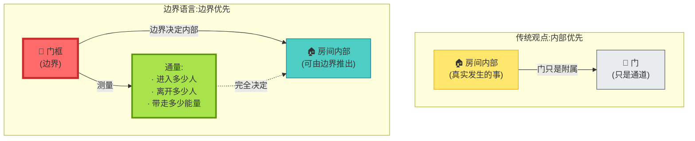

**理论洞察**:

- **传统观点**:房间内部是基本的,门只是"出入口"
- **边界语言**:理论上只要在门框上测量**谁进谁出、带走什么**,就能推断出房间内部的状态
- 房间内部的"时间流逝" = 门框上测量的"通量变化"

---

## 边界语言三公理

GLS理论尝试用三条公理定义什么是"边界语言":

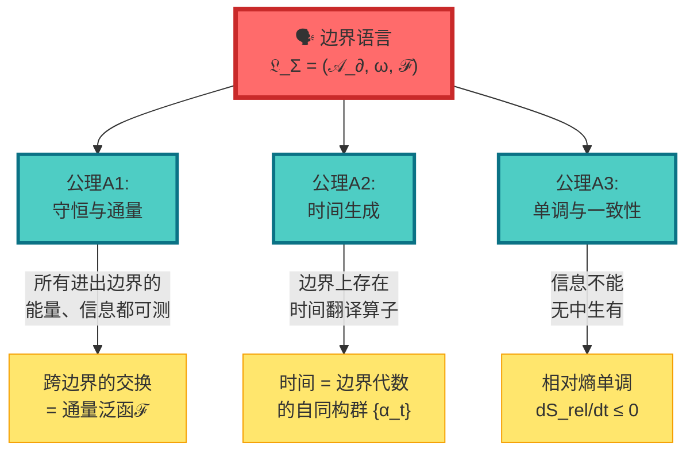

### 公理A1:守恒与通量

**日常类比**:银行账户

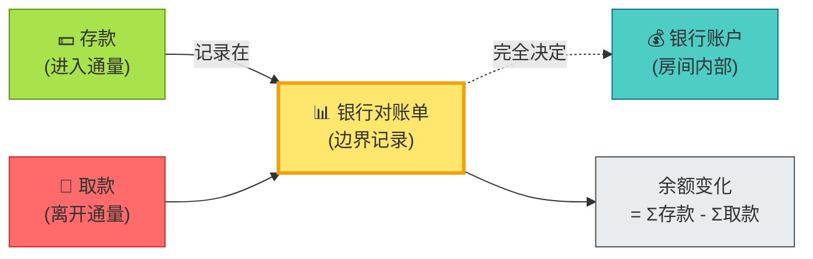

**数学表达**:

$$
\delta(S_{\mathrm{bulk}} + S_{\mathrm{bdry}}) = \text{(体积分)} + F(\delta X_\Sigma)
$$

其中:
- $S_{\mathrm{bulk}}$ = 内部作用量
- $S_{\mathrm{bdry}}$ = 边界作用量
- $F$ = 通量泛函(记录跨边界的交换)
- $\delta X_\Sigma$ = 边界源变分

**物理意义**:账户余额(内部状态)完全由对账单(边界通量)决定(在理想情况下)!

---

### 公理A2:时间生成

**日常类比**:旋转门

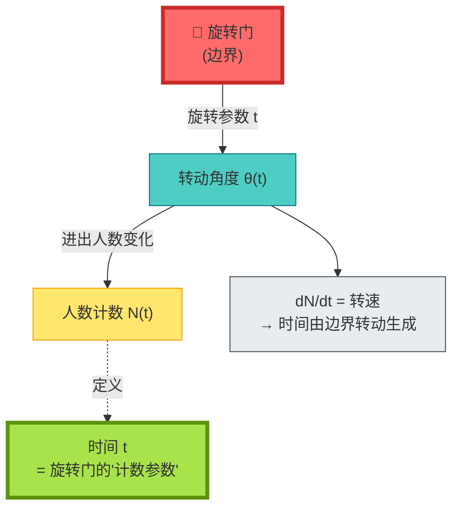

**数学表达**:

在边界可观测代数 $\mathcal{A}_\partial$ 上存在一参数自同构群:

$$
\{\alpha_t\}_{t \in \mathbb{R}} \subset \mathrm{Aut}(\mathcal{A}_\partial)
$$

其生成元为边界哈密顿量 $H_\partial$:

$$
\frac{\mathrm{d}}{\mathrm{d}t}\omega(\alpha_t(A)) = i\omega([H_\partial, \alpha_t(A)])
$$

**物理意义**:

- **时间可能不是外加的**,而是由边界上的翻译算子 $\alpha_t$ 生成
- 就像旋转门的"时间" = 门转动的圈数
- **边界可被视为时钟**。

---

### 公理A3:单调与一致性

**日常类比**:热力学第二定律

**数学表达**:

相对熵沿时间单调递减:

$$
\frac{\mathrm{d}}{\mathrm{d}t}S_{\mathrm{rel}}(\omega_t' \| \omega_t) \leq 0
$$

**物理意义**:

- 边界上的信息**只能减少,不能增加**
- 这在理论上定义了**时间箭头**
- 就像打碎的鸡蛋无法自动复原

---

## 三位一体:边界语言的三种实现

边界语言在三个不同的物理理论中有具体实现:

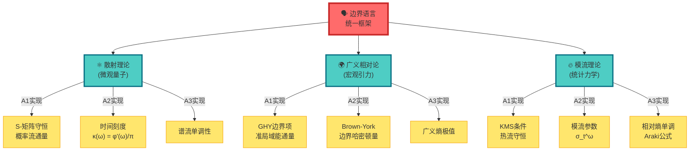

### 实现1:散射理论

**边界** = 无穷远处(入射/出射粒子)

**时间刻度同一式**(回到第8节):

$$
\kappa(\omega) = \frac{\varphi'(\omega)}{\pi} = \rho_{\mathrm{rel}}(\omega) = \frac{1}{2\pi}\mathrm{tr}\,Q(\omega)
$$

**边界语言解读**:

- **通量** = 散射概率流
- **时间** = 群延迟 $\mathrm{tr}\,Q(\omega)$
- **单调性** = 谱流非负

---

### 实现2:广义相对论

**边界** = 时空的边界(如黑洞视界、宇宙学视界)

**GHY边界项**:

$$
S_{\mathrm{GHY}} = \frac{1}{8\pi G}\int_{\partial M}\sqrt{|h|}\,K\,\mathrm{d}^3x
$$

其中 $K$ 是外在曲率。

**边界语言解读**:

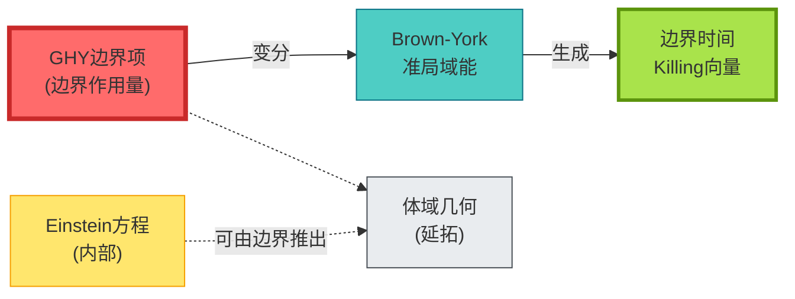

**理论推论**: 如果不加GHY边界项,Einstein-Hilbert作用量的变分就**不完备**! 这暗示引力可能具有**边界理论**的特征。

---

### 实现3:模流理论

**边界** = 观察者可访问的代数

**Tomita-Takesaki模流**:

$$
\sigma_t^\omega(A) = \Delta_\omega^{it} A \Delta_\omega^{-it}
$$

其中 $\Delta_\omega$ 是模算子。

**边界语言解读**:

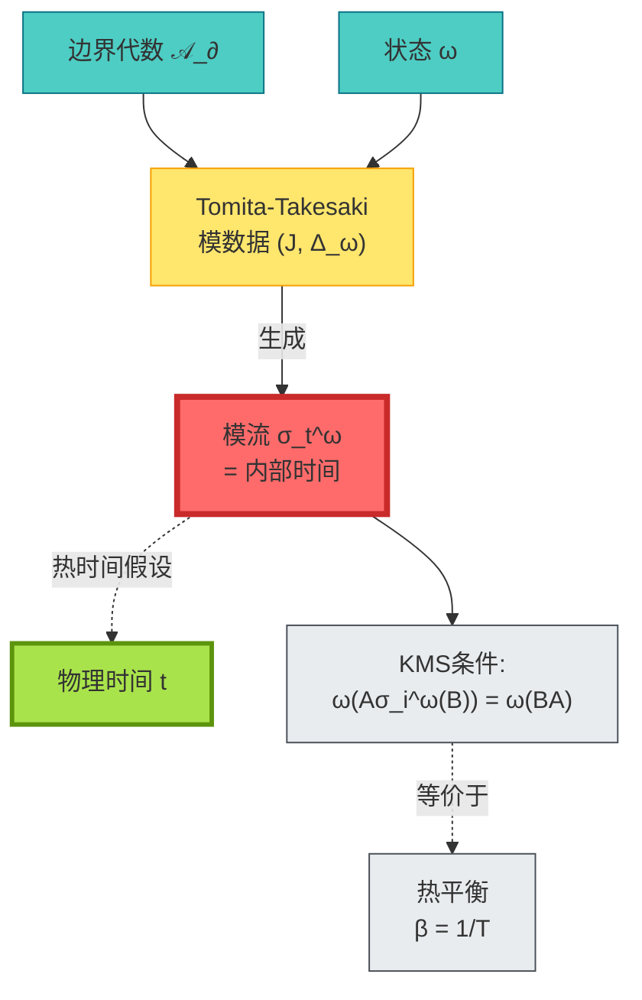

**Connes-Rovelli热时间假设**:物理时间被假设为模流参数。

---

## 时间刻度统一定理

现在我们可以陈述边界语言的核心命题:

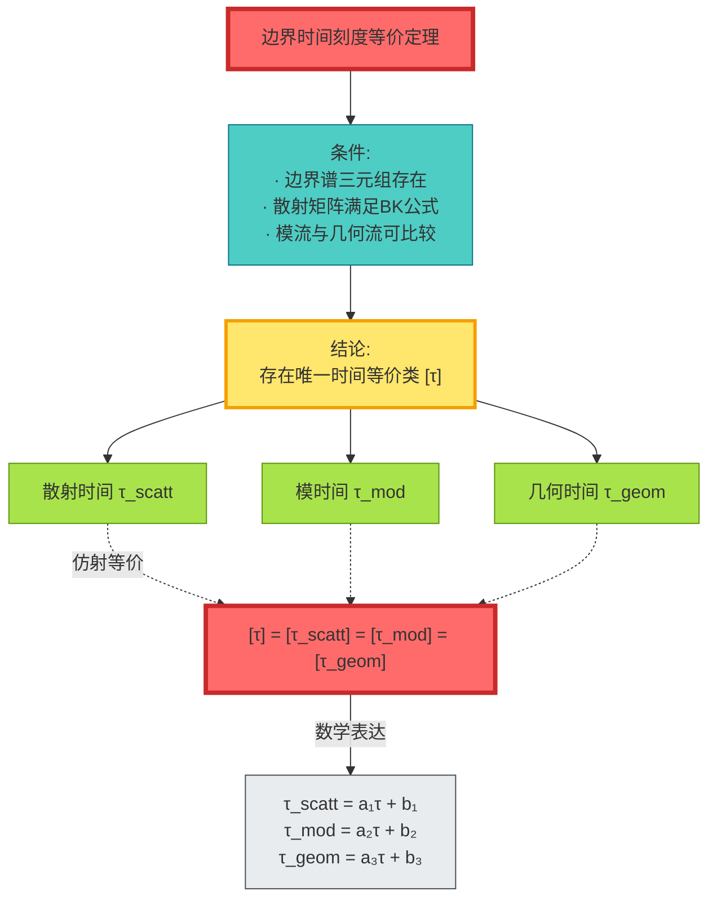

**命题内容**:

在满足边界语言三公理的前提下,**三种时间可能只是同一边界时间的不同归一化**!

**日常比喻**:

- 散射时间 = 用秒表测量
- 模时间 = 用沙漏测量
- 几何时间 = 用日晷测量
- 它们测量的是**同一个时间**,只是单位不同!

---

## 具体例子:黑洞视界

### 传统观点:视界是奇点

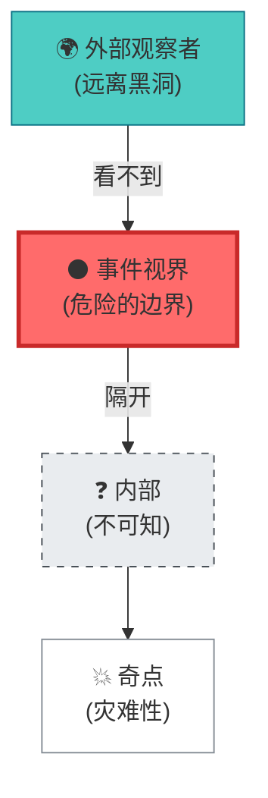

### 边界语言:视界"说话"

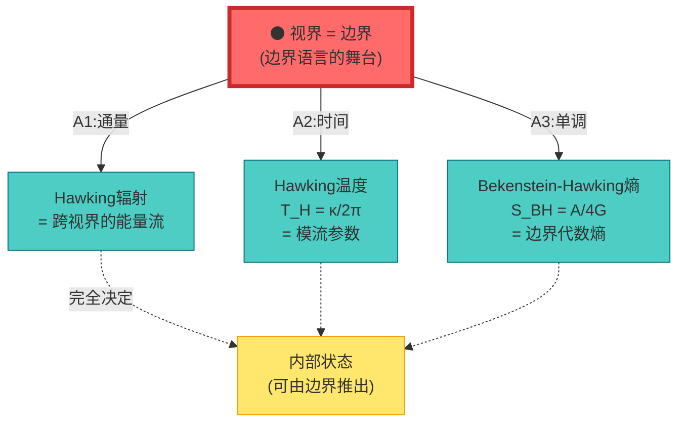

**边界语言解读**:

1. **Hawking温度** = 视界模流的周期 $T_H = \kappa/2\pi$
2. **黑洞熵** = 视界代数的von Neumann熵 $S_{\mathrm{BH}} = A/4G$
3. **Hawking辐射** = 视界通量的热力学涨落

**关键**:理论上不需要知道黑洞内部发生了什么,视界边界可能已经包含全部信息!

---

## 哲学意义:全息原理的数学实现

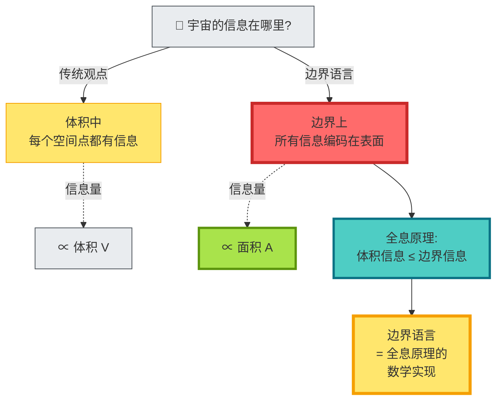

**深层启示**:

1. **全息原理**:'t Hooft和Susskind的猜想——三维体积的信息可编码在二维表面
2. **AdS/CFT对应**:引力理论(体) ↔ 共形场论(边界)
3. **边界语言**:试图将全息原理形式化为数学框架

**日常比喻**:

- 就像全息照片,看起来是三维的,但信息全在二维胶片上
- 宇宙就像一张全息照片,所有信息都在边界上

---

## 实验可验证性

### 验证1:微波网络散射

---

### 验证2:原子钟引力红移

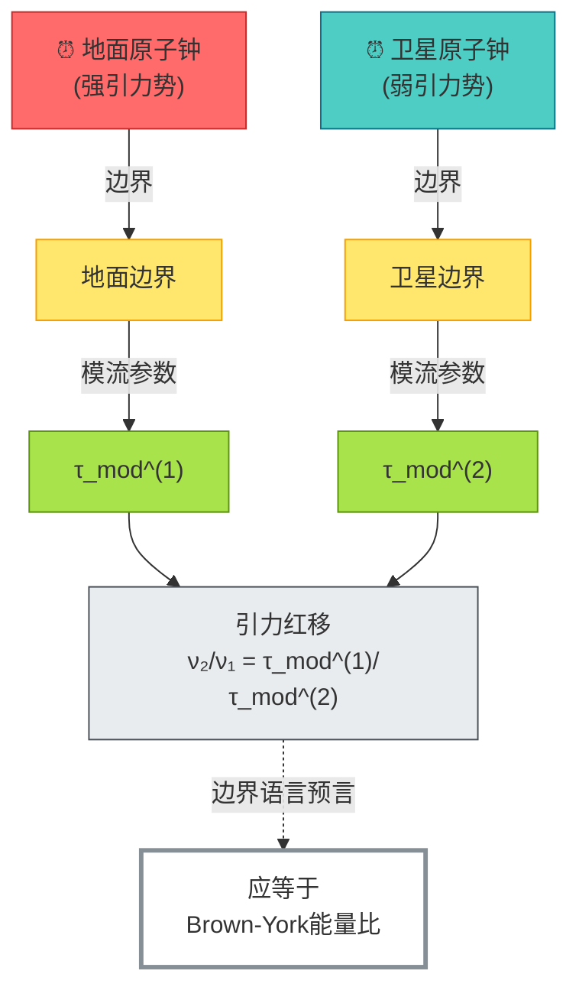

---

## 本章小结

**核心洞见**:

> **GLS理论提出：时间可能不定义在空间内部,而定义在边界上。边界通过"通量、翻译、单调"三公理,在理论上决定了内部的时间结构。这就是边界语言。**

**关键公式**:

边界语言三元组:
$$
\mathfrak{L}_\Sigma = (\mathcal{A}_\partial, \omega, \mathcal{F})
$$

时间刻度同一式:
$$
\kappa(\omega) = \frac{\varphi'(\omega)}{\pi} = \rho_{\mathrm{rel}}(\omega) = \frac{1}{2\pi}\mathrm{tr}\,Q(\omega)
$$

时间刻度等价:
$$
[\tau_{\mathrm{scatt}}] = [\tau_{\mathrm{mod}}] = [\tau_{\mathrm{geom}}] = [\tau]
$$

**日常比喻**:

- **门框决定房间**:测量门框的通量,就能推断房间内部
- **银行对账单**:账户余额由对账单(边界记录)完全决定
- **旋转门**:时间 = 门转动的参数,边界即时钟
- **全息照片**:三维信息编码在二维表面

**三种实现**:

1. **散射理论**:边界 = 无穷远,时间 = 群延迟
2. **广义相对论**:边界 = 时空边界,时间 = Brown-York生成元
3. **模流理论**:边界 = 可观测代数,时间 = 模流参数

**理论推论**:

- **Einstein方程需要GHY边界项** → 引力可能本质上是边界理论
- **黑洞视界完全决定内部** → 信息可能不在体积中,而在表面上
- **时间由边界生成** → "时间流逝"可能是边界翻译算子的表现

**哲学启示**:

宇宙就像一张全息照片:看起来是三维的时空,但所有信息都编码在边界上。边界"说"出了时间。

---

## 与其他章节的联系

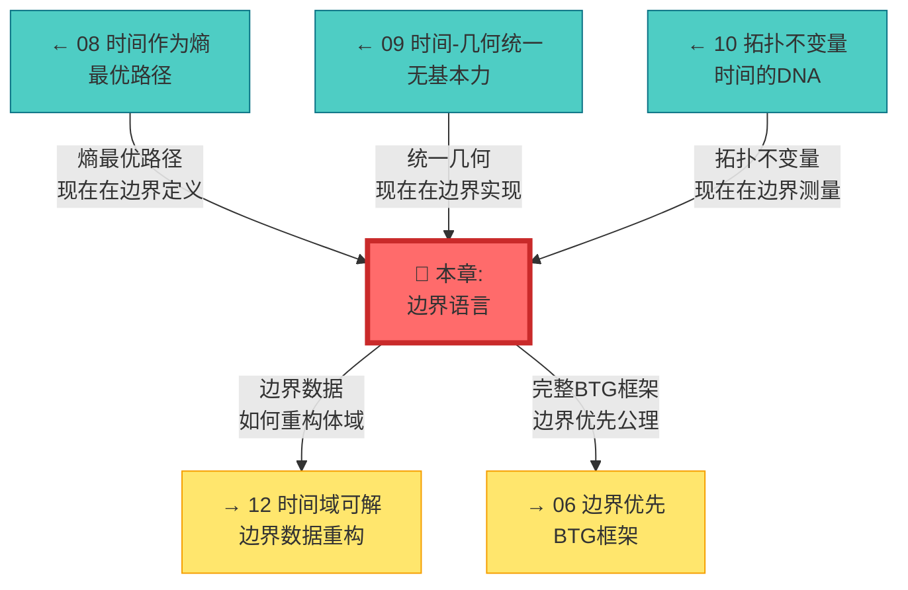

---

## 延伸阅读

**源理论文献**:
- `docs/euler-gls-paper-time/boundary-language-unified-framework.md` - 边界语言统一框架的完整推导
- `docs/euler-gls-paper-bondary/boundary-time-geometry-unified-framework.md` - 边界时间几何(BTG)理论

**相关章节**:
- [03 散射相位与时间刻度](../02-scattering-time/03-scattering-phase-time-scale.md) - 散射边界实现
- [08 时间作为广义熵最优路径](./08-time-as-entropy.md) - 熵的边界表达
- [09 时间–几何–相互作用统一](./09-time-geometry-interaction.md) - 几何边界实现
- [10 拓扑不变量与时间](./10-topological-invariants-time.md) - 拓扑的边界测量
- [06 边界优先与时间涌现](../06-boundary-theory/01-boundary-priority.md) - BTG完整框架

---

*下一章,我们将探讨**时间域的可解性**,看看如何从边界数据完全重构体域结构。*
