# 11 Boundary Language: Where Time "Speaks"

## Core Idea

In previous chapters, we saw:

- **Time is the optimal path of entropy** (Section 8)
- **Force is the projection of time geometry** (Section 9)
- **Time is determined by topological invariants** (Section 10)

Now we ask a more fundamental question: **Where is time defined?**

Traditional physics believes time is defined in **spatial interior**. But GLS theory gives a stunning answer:

> **Time is defined on the boundary. All information about time is "spoken" by the boundary.**

Just as a book's content can be read from the barcode on its cover, the time structure of the universe can be completely determined by its boundary. This is the core idea of **Boundary Language**.

---

## Everyday Analogy: Door Frame of a Room

Imagine you want to understand what happens in a room:

```mermaid
graph TB
    subgraph "Traditional View: Interior Priority"
        Interior["🏠 Room Interior<br/>(What Really Happens)"]
        Door1["🚪 Door<br/>(Just a Passage)"]

        Interior -->|"Door is Just Accessory"| Door1
    end

    subgraph "Boundary Language: Boundary Priority"
        Door2["🚪 Door Frame<br/>(Boundary)"]
        Interior2["🏠 Room Interior<br/>(Can be Derived from Boundary)"]

        Door2 -->|"Boundary Determines Interior"| Interior2

        Door2 -->|"Measure"| Flow["Flux:<br/>· How Many Enter<br/>· How Many Leave<br/>· How Much Energy Carried Away"]

        Flow -.->|"Completely Determines"| Interior2
    end

    style Interior fill:#ffe66d,stroke:#f59f00
    style Door1 fill:#e9ecef,stroke:#495057
    style Door2 fill:#ff6b6b,stroke:#c92a2a,stroke-width:4px
    style Interior2 fill:#4ecdc4,stroke:#0b7285
    style Flow fill:#a9e34b,stroke:#5c940d,stroke-width:3px
```

**Key Insight**:

- **Traditional View**: Room interior is fundamental, door is just "entrance/exit"
- **Boundary Language**: By measuring **who enters/exits, what they carry** at the door frame, we can completely infer the state of the room interior
- "Time passage" in room interior = "flux change" measured at door frame

---

## Three Axioms of Boundary Language

GLS theory defines "boundary language" with three axioms:

```mermaid
graph TB
    BL["🗣️ Boundary Language<br/>𝔏_Σ = (𝒜_∂, ω, ℱ)"]

    BL --> A1["Axiom A1:<br/>Conservation and Flux"]
    BL --> A2["Axiom A2:<br/>Time Generation"]
    BL --> A3["Axiom A3:<br/>Monotonicity and Consistency"]

    A1 -->|"All Energy, Information<br/>Crossing Boundary Measurable"| C1["Exchange Across Boundary<br/>= Flux Functional ℱ"]

    A2 -->|"Time Translation Operator<br/>Exists on Boundary"| C2["Time = Automorphism Group<br/>of Boundary Algebra {α_t}"]

    A3 -->|"Information Cannot<br/>Come from Nothing"| C3["Relative Entropy Monotonic<br/>dS_rel/dt ≤ 0"]

    style BL fill:#ff6b6b,stroke:#c92a2a,stroke-width:4px
    style A1 fill:#4ecdc4,stroke:#0b7285,stroke-width:3px
    style A2 fill:#4ecdc4,stroke:#0b7285,stroke-width:3px
    style A3 fill:#4ecdc4,stroke:#0b7285,stroke-width:3px
    style C1 fill:#ffe66d,stroke:#f59f00
    style C2 fill:#ffe66d,stroke:#f59f00
    style C3 fill:#ffe66d,stroke:#f59f00
```

### Axiom A1: Conservation and Flux

**Everyday Analogy**: Bank Account

```mermaid
graph LR
    Account["💰 Bank Account<br/>(Room Interior)"]

    In["💵 Deposit<br/>(Incoming Flux)"]
    Out["💸 Withdrawal<br/>(Outgoing Flux)"]

    In -->|"Recorded On"| Statement["📊 Bank Statement<br/>(Boundary Record)"]
    Out --> Statement

    Statement -.->|"Completely Determines"| Account

    Balance["Balance Change<br/>= Σ Deposits - Σ Withdrawals"]

    Statement --> Balance

    style Account fill:#4ecdc4,stroke:#0b7285
    style In fill:#a9e34b,stroke:#5c940d
    style Out fill:#ff6b6b,stroke:#c92a2a
    style Statement fill:#ffe66d,stroke:#f59f00,stroke-width:3px
    style Balance fill:#e9ecef,stroke:#495057
```

**Mathematical Expression**:

$$
\delta(S_{\mathrm{bulk}} + S_{\mathrm{bdry}}) = \text{(Volume Integral)} + F(\delta X_\Sigma)
$$

Where:
- $S_{\mathrm{bulk}}$ = Interior action
- $S_{\mathrm{bdry}}$ = Boundary action
- $F$ = Flux functional (records exchange across boundary)
- $\delta X_\Sigma$ = Boundary source variation

**Physical Meaning**: Account balance (interior state) is completely determined by statement (boundary flux)!

---

### Axiom A2: Time Generation

**Everyday Analogy**: Revolving Door

```mermaid
graph TB
    Door["🚪 Revolving Door<br/>(Boundary)"]

    Door -->|"Rotation Parameter t"| Rotation["Rotation Angle θ(t)"]

    Rotation -->|"Change in People Entering/Leaving"| Count["People Count N(t)"]

    Count -.->|"Defines"| Time["Time t<br/>= Revolving Door's 'Count Parameter'"]

    Formula["dN/dt = Rotation Speed<br/>→ Time Generated by Boundary Rotation"]

    Rotation --> Formula

    style Door fill:#ff6b6b,stroke:#c92a2a,stroke-width:4px
    style Rotation fill:#4ecdc4,stroke:#0b7285
    style Count fill:#ffe66d,stroke:#f59f00
    style Time fill:#a9e34b,stroke:#5c940d,stroke-width:4px
    style Formula fill:#e9ecef,stroke:#495057
```

**Mathematical Expression**:

On boundary observable algebra $\mathcal{A}_\partial$, there exists a one-parameter automorphism group:

$$
\{\alpha_t\}_{t \in \mathbb{R}} \subset \mathrm{Aut}(\mathcal{A}_\partial)
$$

Its generator is the boundary Hamiltonian $H_\partial$:

$$
\frac{\mathrm{d}}{\mathrm{d}t}\omega(\alpha_t(A)) = i\omega([H_\partial, \alpha_t(A)])
$$

**Physical Meaning**:

- **Time is not externally imposed**, but generated by translation operator $\alpha_t$ on boundary
- Like revolving door's "time" = number of door rotations
- **Boundary is the clock**!

---

### Axiom A3: Monotonicity and Consistency

**Everyday Analogy**: Second Law of Thermodynamics

```mermaid
graph LR
    Order["🧊 Ordered State<br/>(Low Entropy)"]
    Disorder["💨 Disordered State<br/>(High Entropy)"]

    Order -->|"Time Passage"| Disorder

    Arrow["⏰ Arrow of Time<br/>= Direction of Entropy Increase"]

    Disorder -.-> Arrow

    Irreversible["Irreversibility:<br/>Cannot Create Information<br/>from Boundary"]

    Arrow --> Irreversible

    style Order fill:#4ecdc4,stroke:#0b7285
    style Disorder fill:#ff6b6b,stroke:#c92a2a
    style Arrow fill:#ffe66d,stroke:#f59f00,stroke-width:4px
    style Irreversible fill:#e9ecef,stroke:#495057
```

**Mathematical Expression**:

Relative entropy decreases monotonically along time:

$$
\frac{\mathrm{d}}{\mathrm{d}t}S_{\mathrm{rel}}(\omega_t' \| \omega_t) \leq 0
$$

**Physical Meaning**:

- Information on boundary **can only decrease, not increase**
- This defines the **arrow of time**
- Like a broken egg cannot automatically restore itself

---

## Trinity: Three Realizations of Boundary Language

Boundary language has concrete realizations in three different physical theories:

```mermaid
graph TB
    BL["🗣️ Boundary Language<br/>Unified Framework"]

    BL --> Scatt["⚛️ Scattering Theory<br/>(Microscopic Quantum)"]
    BL --> Grav["🌍 General Relativity<br/>(Macroscopic Gravity)"]
    BL --> Mod["🔥 Modular Flow Theory<br/>(Statistical Mechanics)"]

    Scatt -->|"A1 Realization"| S1["S-Matrix Conservation<br/>Probability Current Flux"]
    Scatt -->|"A2 Realization"| S2["Time Scale<br/>κ(ω) = φ'(ω)/π"]
    Scatt -->|"A3 Realization"| S3["Spectral Flow Monotonicity"]

    Grav -->|"A1 Realization"| G1["GHY Boundary Term<br/>Quasi-Local Energy Flux"]
    Grav -->|"A2 Realization"| G2["Brown-York<br/>Boundary Hamiltonian"]
    Grav -->|"A3 Realization"| G3["Generalized Entropy Extremum"]

    Mod -->|"A1 Realization"| M1["KMS Condition<br/>Heat Flow Conservation"]
    Mod -->|"A2 Realization"| M2["Modular Flow Parameter<br/>σ_t^ω"]
    Mod -->|"A3 Realization"| M3["Relative Entropy Monotonic<br/>Araki Formula"]

    style BL fill:#ff6b6b,stroke:#c92a2a,stroke-width:4px
    style Scatt fill:#4ecdc4,stroke:#0b7285,stroke-width:3px
    style Grav fill:#4ecdc4,stroke:#0b7285,stroke-width:3px
    style Mod fill:#4ecdc4,stroke:#0b7285,stroke-width:3px
    style S1 fill:#ffe66d,stroke:#f59f00
    style S2 fill:#ffe66d,stroke:#f59f00
    style S3 fill:#ffe66d,stroke:#f59f00
    style G1 fill:#ffe66d,stroke:#f59f00
    style G2 fill:#ffe66d,stroke:#f59f00
    style G3 fill:#ffe66d,stroke:#f59f00
    style M1 fill:#ffe66d,stroke:#f59f00
    style M2 fill:#ffe66d,stroke:#f59f00
    style M3 fill:#ffe66d,stroke:#f59f00
```

### Realization 1: Scattering Theory

**Boundary** = Infinity (incoming/outgoing particles)

**Time Scale Identity** (returning to Section 8):

$$
\kappa(\omega) = \frac{\varphi'(\omega)}{\pi} = \rho_{\mathrm{rel}}(\omega) = \frac{1}{2\pi}\mathrm{tr}\,Q(\omega)
$$

**Boundary Language Interpretation**:

- **Flux** = Scattering probability current
- **Time** = Group delay $\mathrm{tr}\,Q(\omega)$
- **Monotonicity** = Non-negative spectral flow

---

### Realization 2: General Relativity

**Boundary** = Spacetime boundary (e.g., black hole horizon, cosmological horizon)

**GHY Boundary Term**:

$$
S_{\mathrm{GHY}} = \frac{1}{8\pi G}\int_{\partial M}\sqrt{|h|}\,K\,\mathrm{d}^3x
$$

Where $K$ is the extrinsic curvature.

**Boundary Language Interpretation**:

**Amazing Fact**: Without the GHY boundary term, the variation of Einstein-Hilbert action is **incomplete**! This shows gravity is fundamentally a **boundary theory**.

---

### Realization 3: Modular Flow Theory

**Boundary** = Observable algebra accessible to observer

**Tomita-Takesaki Modular Flow**:

$$
\sigma_t^\omega(A) = \Delta_\omega^{it} A \Delta_\omega^{-it}
$$

Where $\Delta_\omega$ is the modular operator.

**Boundary Language Interpretation**:

```mermaid
graph TB
    Algebra["Boundary Algebra 𝒜_∂"]
    State["State ω"]

    Algebra --> TT["Tomita-Takesaki<br/>Modular Data (J, Δ_ω)"]
    State --> TT

    TT -->|"Generates"| Flow["Modular Flow σ_t^ω<br/>= Interior Time"]

    Flow -.->|"Thermal Time Hypothesis"| Physical["Physical Time t"]

    KMS["KMS Condition:<br/>ω(Aσ_i^ω(B)) = ω(BA)"]

    Flow --> KMS

    KMS -.->|"Equivalent to"| Thermal["Thermal Equilibrium<br/>β = 1/T"]

    style Algebra fill:#4ecdc4,stroke:#0b7285
    style State fill:#4ecdc4,stroke:#0b7285
    style TT fill:#ffe66d,stroke:#f59f00
    style Flow fill:#ff6b6b,stroke:#c92a2a,stroke-width:4px
    style Physical fill:#a9e34b,stroke:#5c940d,stroke-width:3px
    style KMS fill:#e9ecef,stroke:#495057
    style Thermal fill:#e9ecef,stroke:#495057
```

**Connes-Rovelli Thermal Time Hypothesis**: Physical time = modular flow parameter!

---

## Time Scale Unification Theorem

Now we can state the core theorem of boundary language:

```mermaid
graph TB
    Theorem["Boundary Time Scale Equivalence Theorem"]

    Theorem --> Condition["Conditions:<br/>· Boundary Spectral Triple Exists<br/>· Scattering Matrix Satisfies BK Formula<br/>· Modular Flow Comparable with Geometric Flow"]

    Condition --> Result["Conclusion:<br/>Unique Time Equivalence Class [τ] Exists"]

    Result --> R1["Scattering Time τ_scatt"]
    Result --> R2["Modular Time τ_mod"]
    Result --> R3["Geometric Time τ_geom"]

    R1 -.->|"Affine Equivalent"| Unity["[τ] = [τ_scatt] = [τ_mod] = [τ_geom]"]
    R2 -.-> Unity
    R3 -.-> Unity

    Unity -->|"Mathematical Expression"| Formula["τ_scatt = a₁τ + b₁<br/>τ_mod = a₂τ + b₂<br/>τ_geom = a₃τ + b₃"]

    style Theorem fill:#ff6b6b,stroke:#c92a2a,stroke-width:4px
    style Condition fill:#4ecdc4,stroke:#0b7285
    style Result fill:#ffe66d,stroke:#f59f00,stroke-width:3px
    style R1 fill:#a9e34b,stroke:#5c940d
    style R2 fill:#a9e34b,stroke:#5c940d
    style R3 fill:#a9e34b,stroke:#5c940d
    style Unity fill:#ff6b6b,stroke:#c92a2a,stroke-width:4px
    style Formula fill:#e9ecef,stroke:#495057
```

**Theorem Content**:

Under the premise of satisfying the three axioms of boundary language, **the three times are just different normalizations of the same boundary time**!

**Everyday Analogy**:

- Scattering time = measured with stopwatch
- Modular time = measured with hourglass
- Geometric time = measured with sundial
- They measure **the same time**, just different units!

---

## Concrete Example: Black Hole Horizon

### Traditional View: Horizon is Singularity

```mermaid
graph TB
    Outside["🌍 External Observer<br/>(Far from Black Hole)"]
    Horizon["⚫ Event Horizon<br/>(Dangerous Boundary)"]
    Inside["❓ Interior<br/>(Unknown)"]

    Outside -->|"Cannot See"| Horizon
    Horizon -->|"Separates"| Inside

    Singularity["💥 Singularity<br/>(Catastrophic)"]

    Inside --> Singularity

    style Outside fill:#4ecdc4,stroke:#0b7285
    style Horizon fill:#ff6b6b,stroke:#c92a2a,stroke-width:3px
    style Inside fill:#e9ecef,stroke:#495057,stroke-dasharray: 5 5
    style Singularity fill:#fff,stroke:#868e96
```

### Boundary Language: Horizon "Speaks"

**Boundary Language Interpretation**:

1. **Hawking Temperature** = Period of horizon modular flow $T_H = \kappa/2\pi$
2. **Black Hole Entropy** = von Neumann entropy of horizon algebra $S_{\mathrm{BH}} = A/4G$
3. **Hawking Radiation** = Thermodynamic fluctuations of horizon flux

**Key**: No need to know what happens inside the black hole, the horizon boundary has already "spoken" all the information!

---

## Philosophical Meaning: Mathematical Realization of Holographic Principle

```mermaid
graph TB
    Question["🤔 Where is the Information of the Universe?"]

    Question -->|"Traditional View"| Volume["In Volume<br/>Each Spatial Point Has Information"]

    Question -->|"Boundary Language"| Surface["On Boundary<br/>All Information Encoded on Surface"]

    Volume -.->|"Information Amount"| V["∝ Volume V"]
    Surface -.->|"Information Amount"| A["∝ Area A"]

    Holography["Holographic Principle:<br/>Volume Information ≤ Boundary Information"]

    Surface --> Holography

    BL["Boundary Language<br/>= Mathematical Realization<br/>of Holographic Principle"]

    Holography --> BL

    style Question fill:#e9ecef,stroke:#495057
    style Volume fill:#ffe66d,stroke:#f59f00
    style Surface fill:#ff6b6b,stroke:#c92a2a,stroke-width:4px
    style V fill:#e9ecef,stroke:#495057
    style A fill:#a9e34b,stroke:#5c940d,stroke-width:3px
    style Holography fill:#4ecdc4,stroke:#0b7285,stroke-width:3px
    style BL fill:#ffe66d,stroke:#f59f00,stroke-width:4px
```

**Deep Revelations**:

1. **Holographic Principle**: 't Hooft and Susskind's conjecture—three-dimensional volume information can be encoded on two-dimensional surface
2. **AdS/CFT Correspondence**: Gravity theory (bulk) ↔ Conformal field theory (boundary)
3. **Boundary Language**: Formalizes holographic principle as a rigorous mathematical framework

**Everyday Analogy**:

- Like a hologram, appears three-dimensional, but all information is on two-dimensional film
- The universe is like a hologram, all information is on the boundary

---

## Experimental Verifiability

### Verification 1: Microwave Network Scattering

---

### Verification 2: Atomic Clock Gravitational Redshift

---

## Chapter Summary

**Core Insight**:

> **Time is not defined in spatial interior, but on the boundary. Through three axioms of "flux, translation, monotonicity," the boundary completely determines the time structure of the interior. This is boundary language.**

**Key Formulas**:

Boundary language triple:
$$
\mathfrak{L}_\Sigma = (\mathcal{A}_\partial, \omega, \mathcal{F})
$$

Time scale identity:
$$
\kappa(\omega) = \frac{\varphi'(\omega)}{\pi} = \rho_{\mathrm{rel}}(\omega) = \frac{1}{2\pi}\mathrm{tr}\,Q(\omega)
$$

Time scale equivalence:
$$
[\tau_{\mathrm{scatt}}] = [\tau_{\mathrm{mod}}] = [\tau_{\mathrm{geom}}] = [\tau]
$$

**Everyday Analogies**:

- **Door frame determines room**: Measuring flux at door frame can infer room interior
- **Bank statement**: Account balance completely determined by statement (boundary record)
- **Revolving door**: Time = parameter of door rotation, boundary is the clock
- **Hologram**: Three-dimensional information encoded on two-dimensional surface

**Three Realizations**:

1. **Scattering Theory**: Boundary = infinity, time = group delay
2. **General Relativity**: Boundary = spacetime boundary, time = Brown-York generator
3. **Modular Flow Theory**: Boundary = observable algebra, time = modular flow parameter

**Amazing Discoveries**:

- **Einstein equations need GHY boundary term** → Gravity is fundamentally a boundary theory
- **Black hole horizon completely determines interior** → Information is not in volume, but on surface
- **Time generated by boundary** → "Time passage" is manifestation of boundary translation operator

**Philosophical Revelation**:

The universe is like a hologram: appears to be three-dimensional spacetime, but all information is encoded on the boundary. The boundary "speaks" time.

---

## Connections to Other Chapters

```mermaid
graph TB
    Current["📍 This Chapter:<br/>Boundary Language"]

    Prev1["← 08 Time as Entropy<br/>Optimal Path"]
    Prev2["← 09 Time-Geometry Unification<br/>No Fundamental Force"]
    Prev3["← 10 Topological Invariants<br/>DNA of Time"]

    Next1["→ 12 Time Domain Solvable<br/>Boundary Data Reconstruction"]
    Next2["→ 06 Boundary Priority<br/>BTG Framework"]

    Prev1 -->|"Entropy Optimal Path<br/>Now Defined on Boundary"| Current
    Prev2 -->|"Unified Geometry<br/>Now Realized on Boundary"| Current
    Prev3 -->|"Topological Invariants<br/>Now Measured on Boundary"| Current

    Current -->|"Boundary Data<br/>How to Reconstruct Bulk"| Next1
    Current -->|"Complete BTG Framework<br/>Boundary Priority Axiom"| Next2

    style Current fill:#ff6b6b,stroke:#c92a2a,stroke-width:4px
    style Prev1 fill:#4ecdc4,stroke:#0b7285
    style Prev2 fill:#4ecdc4,stroke:#0b7285
    style Prev3 fill:#4ecdc4,stroke:#0b7285
    style Next1 fill:#ffe66d,stroke:#f59f00
    style Next2 fill:#ffe66d,stroke:#f59f00
```

---

## Extended Reading

**Source Theoretical Literature**:
- `docs/euler-gls-paper-time/boundary-language-unified-framework.md` - Complete derivation of boundary language unified framework
- `docs/euler-gls-paper-bondary/boundary-time-geometry-unified-framework.md` - Boundary Time Geometry (BTG) theory

**Related Chapters**:
- [03 Scattering Phase and Time Scale](../02-scattering-time/03-scattering-phase-time-scale_en.md) - Scattering boundary realization
- [08 Time as Generalized Entropy Optimal Path](./08-time-as-entropy_en.md) - Boundary expression of entropy
- [09 Time–Geometry–Interaction Unification](./09-time-geometry-interaction_en.md) - Geometric boundary realization
- [10 Topological Invariants and Time](./10-topological-invariants-time_en.md) - Boundary measurement of topology
- [06 Boundary Priority and Time Emergence](../06-boundary-theory/01-boundary-priority_en.md) - Complete BTG framework

---

*In the next chapter, we will explore **solvability of time domains**, seeing how to completely reconstruct bulk structure from boundary data.*

