# 12 时间域与可解模型:从边界数据重构时间

## 核心思想

在前面的章节中,我们构建了时间的理论框架:

- **时间被诠释为熵的最优路径**(第8节)
- **力可被视为时间几何的投影**(第9节)
- **时间结构可能由拓扑不变量决定**(第10节)
- **时间可能定义在边界上**(第11节)

现在我们面临最后一个关键问题:**在什么条件下,我们能在理论上从边界数据重构出时间?**

GLS理论提出:**定义域**(Domain)可能决定一切。就像数学函数需要定义域才有意义,时间刻度也需要明确的**定义域条件**才能从边界数据唯一确定。

---

## 日常类比:电影的放映

想象你要从胶片重构电影:

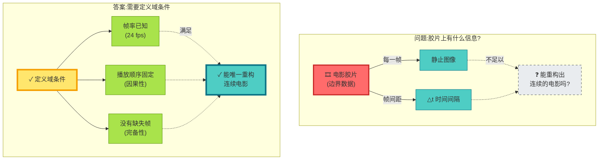

**理论洞察**:

- 胶片(边界数据)本身不够
- 需要**定义域条件**(帧率、顺序、完备性)
- 满足条件→理论上唯一重构电影(时间)

---

## 刻度同一式的定义域

回到第8节的核心公式,现在我们明确其**定义域**:

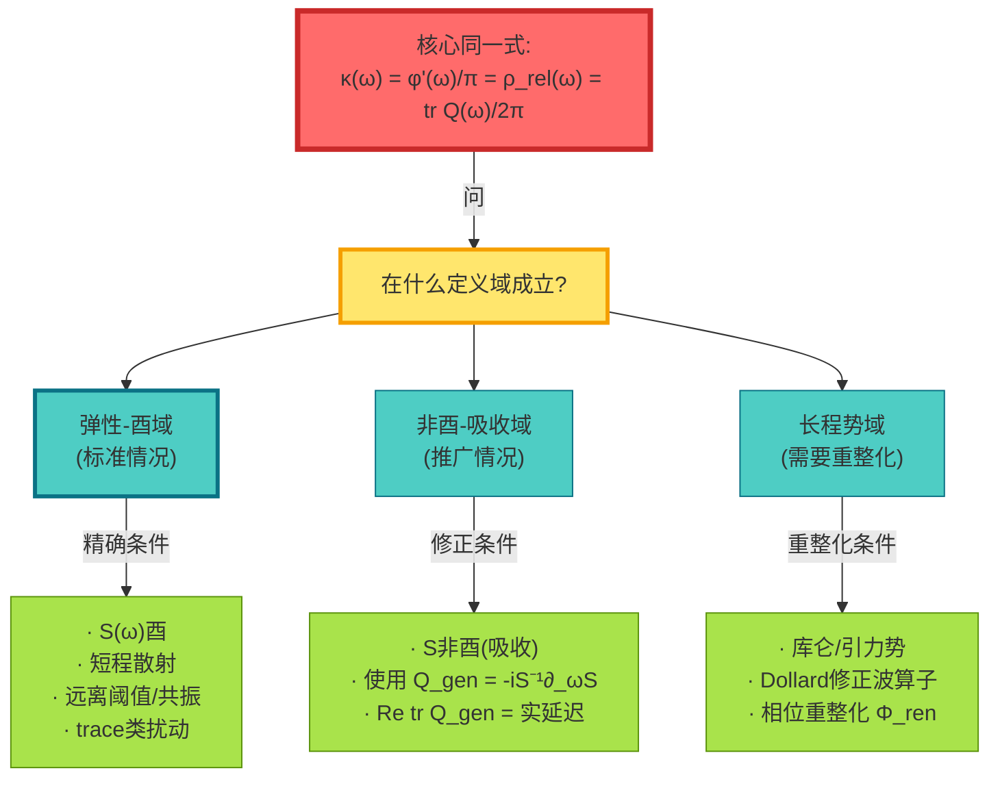

### 域1:弹性-酉域(理想情况)

**定义域条件**:

$$
\begin{cases}
S(\omega) \in C^1(I; U(N)) & \text{(酉性)} \\
H - H_0 \in \mathfrak{S}_1 & \text{(trace类)} \\
\omega \in I \setminus \Sigma & \text{(远离阈值/共振)}
\end{cases}
$$

**同一式**:在此域内,刻度同一式**在数学上精确成立**:

$$
\frac{\varphi'(\omega)}{\pi} = \rho_{\mathrm{rel}}(\omega) = \frac{1}{2\pi}\mathrm{tr}\,Q(\omega) \quad \text{(Lebesgue-a.e.)}
$$

---

### 域2:非酉-吸收域(推广情况)

想象一个**有损耗的微波腔**:

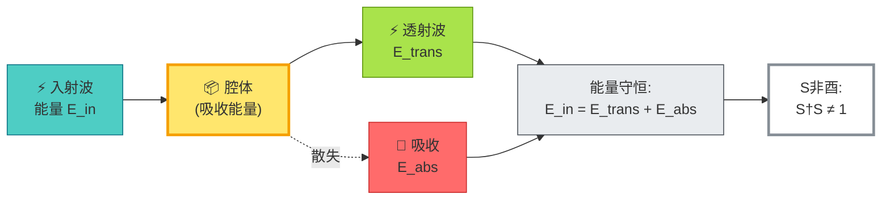

**修正定义**:

广义群延迟:
$$
Q_{\mathrm{gen}}(\omega) = -iS(\omega)^{-1}\partial_\omega S(\omega)
$$

相位关系:
$$
\partial_\omega \arg\det S = \Re\,\mathrm{tr}\,Q_{\mathrm{gen}}
$$

**物理意义**:

- $\Re\,\mathrm{tr}\,Q_{\mathrm{gen}}$ = 实际时间延迟
- $\Im\,\mathrm{tr}\,Q_{\mathrm{gen}}$ = 吸收率

小吸收极限:
$$
\mathrm{tr}\,Q_{\mathrm{gen}} = \mathrm{tr}\,Q + O(|S^\dagger S - 1|)
$$

---

### 域3:长程势域(重整化情况)

**问题**:库仑/引力势 $V \sim 1/r$

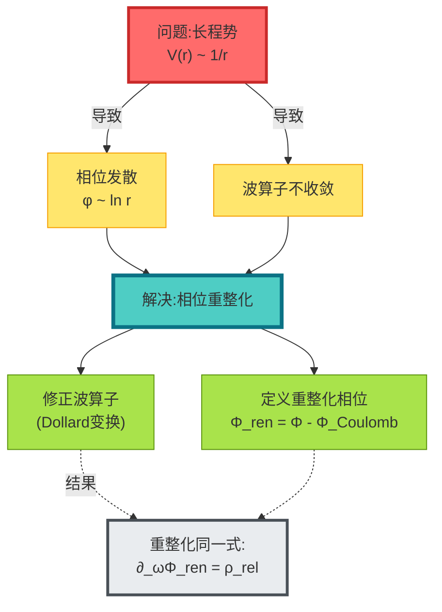

---

## 窗口化时钟:解决负延迟问题

### 问题:群延迟可以为负

**异常延迟现象**:

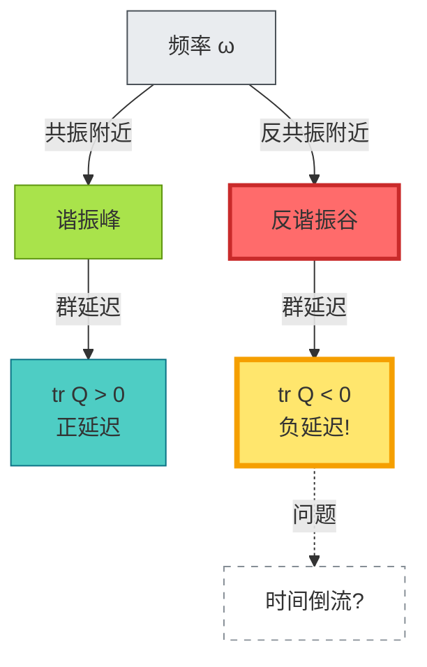

**经典例子**:Hartman效应——量子隧穿中的超光速群速度

---

### 解决:Poisson窗口化

**思路**:不要在单个频率点定义时间,而是用**窗口平均**

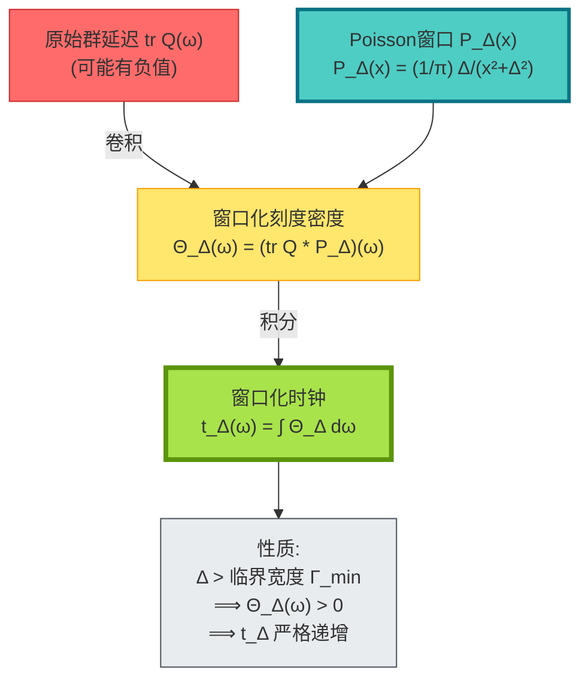

**数学定义**:

Poisson核:
$$
P_\Delta(x) = \frac{1}{\pi}\frac{\Delta}{x^2 + \Delta^2}
$$

窗口化刻度密度:
$$
\Theta_\Delta(\omega) = (\rho_{\mathrm{rel}} * P_\Delta)(\omega) = \frac{1}{2\pi}(\mathrm{tr}\,Q * P_\Delta)(\omega)
$$

窗口化时钟:
$$
t_\Delta(\omega) = \int_{\omega_0}^\omega \Theta_\Delta(\tilde{\omega})\,\mathrm{d}\tilde{\omega}
$$

**核心命题**:

若 $\Delta > \Gamma_{\min}$ (最小共振宽度),则:

1. **弱单调性**: $\Theta_\Delta(\omega) > 0$ 几乎处处
2. **仿射唯一性**: 任何满足条件的窗口化时钟都仅相差仿射变换 $\tilde{t}_\Delta = at_\Delta + b$

---

## 可解模型:Schwarzschild黑洞

### 问题:相位导数 = 几何时延?

在Schwarzschild黑洞外区,我们能验证**散射时间 = 几何时间**吗?

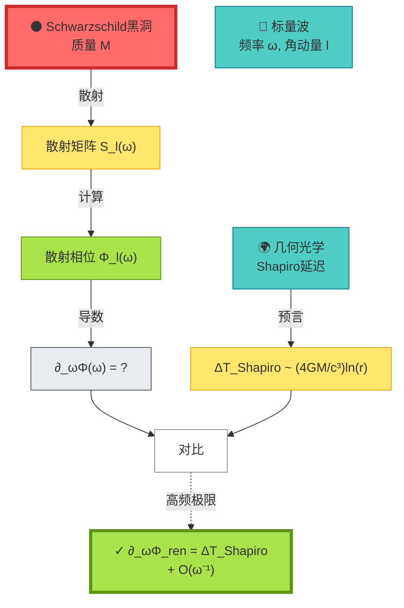

### Regge-Wheeler方程

Schwarzschild外区的标量波满足:

$$
\frac{\mathrm{d}^2 u}{\mathrm{d}r_*^2} + \left[\omega^2 - V_{\mathrm{eff}}(r)\right]u = 0
$$

其中:
- $r_* = r + 2M\ln(r/2M - 1)$ (tortoise坐标)
- $V_{\mathrm{eff}} = \left(1 - \frac{2M}{r}\right)\left(\frac{l(l+1)}{r^2} + \frac{2M}{r^3}\right)$ (有效势)

### Eikonal近似

高频/高角动量极限 $(ω \gg M^{-1}, l \gg 1)$:

WKB相位:
$$
\phi_{\mathrm{WKB}} = \int \sqrt{\omega^2 - V_{\mathrm{eff}}(r)}\,\mathrm{d}r_*
$$

相位导数:
$$
\partial_\omega\phi_{\mathrm{WKB}} = \int \frac{\omega}{\sqrt{\omega^2 - V_{\mathrm{eff}}}}\,\mathrm{d}r_*
$$

**几何对应**:

$$
\partial_\omega\phi_{\mathrm{WKB}} \approx \Delta T_{\mathrm{Shapiro}} = \frac{4GM}{c^3}\ln\frac{4r_E r_R}{b^2} + O(\omega^{-1})
$$

其中 $b$ 是冲击参数,$r_E, r_R$ 是发射/接收半径。

---

## 可解模型:引力透镜

### 多像时间延迟

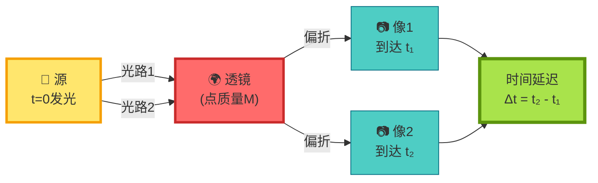

**Fermat原理**: 光沿时间极值路径传播

时间延迟:
$$
\Delta t_{ij} = \frac{1+z_d}{c}\frac{D_d D_s}{D_{ds}}\left[\frac{(\boldsymbol{\theta}_i - \boldsymbol{\beta})^2}{2} - \psi(\boldsymbol{\theta}_i)\right] - \text{(像j)}
$$

其中:
- $\boldsymbol{\theta}_i$ = 像i的角位置
- $\boldsymbol{\beta}$ = 源的真实位置
- $\psi$ = 透镜势
- $D_{d,s,ds}$ = 角直径距离

**边界语言表述**:

频域放大因子 $F(\omega)$ 的相位:
$$
\partial_\omega[\Phi_i(\omega) - \Phi_j(\omega)] = \Delta t_{ij}
$$

时间延迟 = 相位差的频率导数(理论推论)!

---

## 可解模型:宇宙学红移

### 红移 = 相位节奏比

FRW宇宙中,光子相位:

$$
\phi = \int \omega\,\mathrm{d}t
$$

相位节奏:
$$
\frac{\mathrm{d}\phi}{\mathrm{d}t} = \omega = \omega_0 a(t_0)/a(t)
$$

红移:
$$
1 + z = \frac{\omega_e}{\omega_0} = \frac{(d\phi/dt)_e}{(d\phi/dt)_0} = \frac{a(t_0)}{a(t_e)}
$$

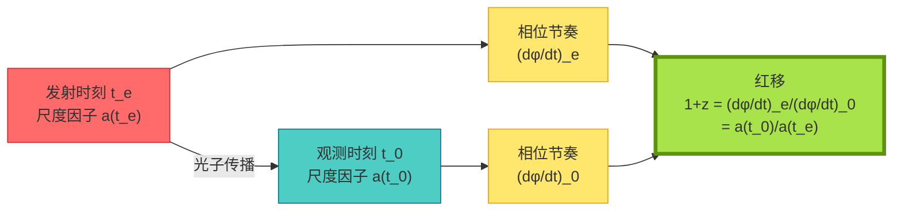

**边界语言解读**:

- 宇宙学红移不是"多普勒效应"
- 而是**边界相位节奏的比值**
- 理论上完全由边界数据(相位演化)决定!

---

## 实验验证方案

### 方案1:多频Shapiro延迟测量

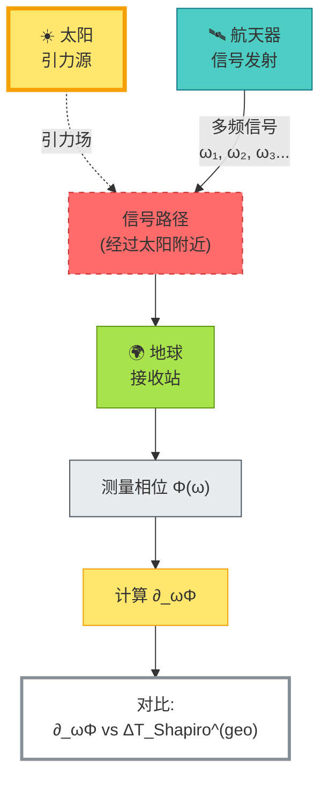

**关键**:

- 在多个频率测量相位 $\Phi(\omega)$
- 数值求导得到 $\partial_\omega\Phi$
- 与几何预言的Shapiro延迟对比
- 验证刻度同一式!

---

### 方案2:微波网络S参数测量

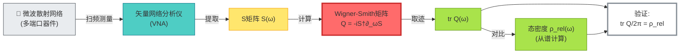

---

### 方案3:引力透镜时延宇宙学

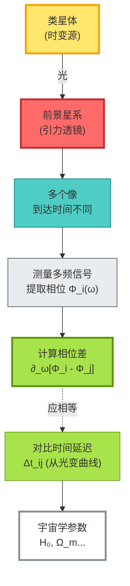

**H0LiCOW项目**:利用透镜时延测量哈勃常数

---

## 定义域的哲学意义

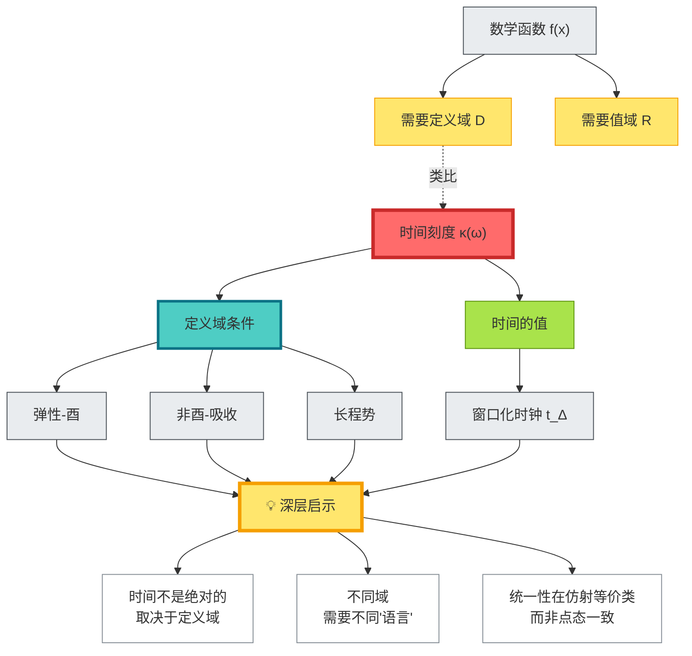

**深层启示**:

1. **时间像数学函数**:必须指定定义域才有意义
2. **不同物理情境 = 不同定义域**:弹性散射、吸收腔体、引力场各有其域
3. **统一性在等价类层面**:不同域的时间刻度通过仿射变换统一
4. **可解模型是桥梁**:连接抽象理论与具体实验

---

## 本章小结

**核心观点**:

> **GLS理论认为,时间刻度的重构需要明确的定义域条件。在弹性-酉域,刻度同一式精确成立;在非酉/长程域,需要修正或重整化。窗口化时钟解决负延迟问题,提供弱单调与仿射唯一性。可解模型(Schwarzschild、透镜、宇宙学)验证了散射时间=几何时间。**

**关键公式**:

刻度同一式(弹性-酉域):
$$
\frac{\varphi'(\omega)}{\pi} = \rho_{\mathrm{rel}}(\omega) = \frac{1}{2\pi}\mathrm{tr}\,Q(\omega) \quad (\omega \in I \setminus \Sigma)
$$

窗口化时钟:
$$
\Theta_\Delta(\omega) = (\rho_{\mathrm{rel}} * P_\Delta)(\omega), \quad t_\Delta(\omega) = \int_{\omega_0}^\omega \Theta_\Delta\,\mathrm{d}\omega
$$

eikonal对应:
$$
\partial_\omega\Phi_{\mathrm{ren}}(\omega) = \Delta T_{\mathrm{Shapiro}} + O(\omega^{-1})
$$

红移-相位关系:
$$
1 + z = \frac{(d\phi/dt)_e}{(d\phi/dt)_0} = \frac{a(t_0)}{a(t_e)}
$$

**三大定义域**:

| 定义域 | 条件 | 刻度公式 |
|--------|------|----------|
| 弹性-酉 | $S$酉,短程,trace类 | 标准同一式 |
| 非酉-吸收 | $S$非酉,吸收 | $\Re\,\mathrm{tr}\,Q_{\mathrm{gen}}$ |
| 长程势 | 库仑/引力势 | $\partial_\omega\Phi_{\mathrm{ren}}$ |

**可解模型验证**:

1. **Schwarzschild**: $\partial_\omega\Phi \approx \Delta T_{\mathrm{Shapiro}}$ (高频极限)
2. **引力透镜**: $\partial_\omega(\Phi_i - \Phi_j) = \Delta t_{ij}$
3. **宇宙学**: $1+z = (d\phi/dt)_e / (d\phi/dt)_0$

**实验可验证**:

- 多频Shapiro延迟(行星掩日)
- 微波网络S参数(片上器件)
- 引力透镜时延(H0LiCOW)

**哲学意义**:

时间的重构不是自动的,而是**条件化的**:

- 必须指定定义域(物理情境)
- 必须选择窗口(测量分辨率)
- 统一性在仿射等价类,而非点态值

这构成了GLS统一时间理论的**重要一环**:从边界数据到时间重构的严格条件。

---

## 与其他章节的联系

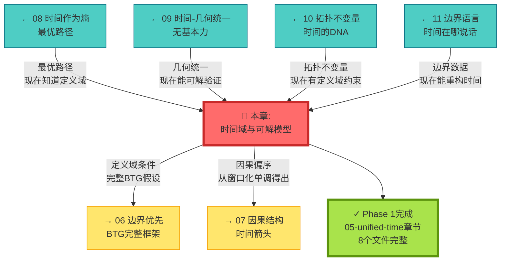

---

## 延伸阅读

**源理论文献**:
- `docs/euler-gls-paper-time/unified-time-scale-geometry-domains-solvable-models.md` - 时间刻度、定义域与可解模型的完整推导

**相关章节**:
- [03 散射相位与时间刻度](../02-scattering-time/03-scattering-phase-time-scale.md) - 散射理论基础
- [08 时间作为广义熵最优路径](./08-time-as-entropy.md) - 变分原理
- [09 时间–几何–相互作用统一](./09-time-geometry-interaction.md) - 几何实现
- [10 拓扑不变量与时间](./10-topological-invariants-time.md) - 拓扑约束
- [11 边界语言](./11-boundary-language.md) - 边界框架
- [06 边界优先与时间涌现](../06-boundary-theory/01-boundary-priority.md) - BTG完整理论

---

*至此,我们完成了统一时间理论的全部基础章节。下一步将探索边界理论、因果结构与矩阵宇宙的应用。*
