# 12 Time Domains and Solvable Models: Reconstructing Time from Boundary Data

## Core Idea

In previous chapters, we established the complete theoretical framework of time:

- **Time is the optimal path of entropy** (Section 8)
- **Force is the projection of time geometry** (Section 9)
- **Time is determined by topological invariants** (Section 10)
- **Time is defined on the boundary** (Section 11)

Now we face the final key question: **Under what conditions can we completely reconstruct time from boundary data?**

The answer of GLS theory is: **Domain** determines everything. Just as mathematical functions need a domain to be meaningful, time scales also need clear **domain conditions** to be uniquely determined from boundary data.

---

## Everyday Analogy: Film Projection

Imagine you want to reconstruct a movie from film:

```mermaid
graph TB
    subgraph "Problem: What Information is on the Film?"
        Film["🎞️ Movie Film<br/>(Boundary Data)"]

        Film -->|"Each Frame"| Frame["Still Image"]
        Film -->|"Frame Spacing"| Spacing["△t Time Interval"]

        Frame -.->|"Insufficient"| Question["❓ Can We Reconstruct<br/>Continuous Movie?"]
        Spacing -.-> Question
    end

    subgraph "Answer: Need Domain Conditions"
        Condition["✓ Domain Conditions"]

        Condition --> C1["Frame Rate Known<br/>(24 fps)"]
        Condition --> C2["Playback Order Fixed<br/>(Causality)"]
        Condition --> C3["No Missing Frames<br/>(Completeness)"]

        C1 -.->|"Satisfy"| Reconstruct["✓ Can Uniquely Reconstruct<br/>Continuous Movie"]
        C2 -.-> Reconstruct
        C3 -.-> Reconstruct
    end

    style Film fill:#ff6b6b,stroke:#c92a2a,stroke-width:3px
    style Frame fill:#4ecdc4,stroke:#0b7285
    style Spacing fill:#4ecdc4,stroke:#0b7285
    style Question fill:#e9ecef,stroke:#495057,stroke-dasharray: 5 5
    style Condition fill:#ffe66d,stroke:#f59f00,stroke-width:4px
    style C1 fill:#a9e34b,stroke:#5c940d
    style C2 fill:#a9e34b,stroke:#5c940d
    style C3 fill:#a9e34b,stroke:#5c940d
    style Reconstruct fill:#4ecdc4,stroke:#0b7285,stroke-width:4px
```

**Key Insight**:

- Film (boundary data) alone is insufficient
- Need **domain conditions** (frame rate, order, completeness)
- Satisfy conditions → uniquely reconstruct movie (time)

---

## Domain of Scale Identity

Returning to the core formula from Section 8, we now clarify its **domain**:

```mermaid
graph TB
    Identity["Core Identity:<br/>κ(ω) = φ'(ω)/π = ρ_rel(ω) = tr Q(ω)/2π"]

    Identity -->|"Ask"| Domain["In What Domain Does It Hold?"]

    Domain --> D1["Elastic-Unitary Domain<br/>(Standard Case)"]
    Domain --> D2["Non-Unitary-Absorption Domain<br/>(Generalized Case)"]
    Domain --> D3["Long-Range Potential Domain<br/>(Needs Renormalization)"]

    D1 -->|"Exact Conditions"| C1["· S(ω) Unitary<br/>· Short-Range Scattering<br/>· Away from Thresholds/Resonances<br/>· Trace-Class Perturbation"]

    D2 -->|"Modified Conditions"| C2["· S Non-Unitary (Absorption)<br/>· Use Q_gen = -iS⁻¹∂_ωS<br/>· Re tr Q_gen = Real Delay"]

    D3 -->|"Renormalization Conditions"| C3["· Coulomb/Gravitational Potential<br/>· Dollard Modified Wave Operator<br/>· Phase Renormalization Φ_ren"]

    style Identity fill:#ff6b6b,stroke:#c92a2a,stroke-width:4px
    style Domain fill:#ffe66d,stroke:#f59f00,stroke-width:3px
    style D1 fill:#4ecdc4,stroke:#0b7285,stroke-width:3px
    style D2 fill:#4ecdc4,stroke:#0b7285
    style D3 fill:#4ecdc4,stroke:#0b7285
    style C1 fill:#a9e34b,stroke:#5c940d
    style C2 fill:#a9e34b,stroke:#5c940d
    style C3 fill:#a9e34b,stroke:#5c940d
```

### Domain 1: Elastic-Unitary Domain (Ideal Case)

**Domain Conditions**:

$$
\begin{cases}
S(\omega) \in C^1(I; U(N)) & \text{(Unitarity)} \\
H - H_0 \in \mathfrak{S}_1 & \text{(Trace Class)} \\
\omega \in I \setminus \Sigma & \text{(Away from Thresholds/Resonances)}
\end{cases}
$$

**Identity**: In this domain, the scale identity **holds exactly**:

$$
\frac{\varphi'(\omega)}{\pi} = \rho_{\mathrm{rel}}(\omega) = \frac{1}{2\pi}\mathrm{tr}\,Q(\omega) \quad \text{(Lebesgue-a.e.)}
$$

---

### Domain 2: Non-Unitary-Absorption Domain (Generalized Case)

Imagine a **lossy microwave cavity**:

```mermaid
graph LR
    In["⚡ Incoming Wave<br/>Energy E_in"]

    Cavity["📦 Cavity<br/>(Absorbs Energy)"]

    Out1["⚡ Transmitted Wave<br/>E_trans"]
    Out2["💨 Absorption<br/>E_abs"]

    In --> Cavity
    Cavity --> Out1
    Cavity -.->|"Lost"| Out2

    Conservation["Energy Conservation:<br/>E_in = E_trans + E_abs"]

    Out1 --> Conservation
    Out2 --> Conservation

    NonUnitary["S Non-Unitary:<br/>S†S ≠ 1"]

    Conservation --> NonUnitary

    style In fill:#4ecdc4,stroke:#0b7285
    style Cavity fill:#ffe66d,stroke:#f59f00,stroke-width:3px
    style Out1 fill:#a9e34b,stroke:#5c940d
    style Out2 fill:#ff6b6b,stroke:#c92a2a
    style Conservation fill:#e9ecef,stroke:#495057
    style NonUnitary fill:#fff,stroke:#868e96,stroke-width:3px
```

**Modified Definition**:

Generalized group delay:
$$
Q_{\mathrm{gen}}(\omega) = -iS(\omega)^{-1}\partial_\omega S(\omega)
$$

Phase relation:
$$
\partial_\omega \arg\det S = \Re\,\mathrm{tr}\,Q_{\mathrm{gen}}
$$

**Physical Meaning**:

- $\Re\,\mathrm{tr}\,Q_{\mathrm{gen}}$ = Actual time delay
- $\Im\,\mathrm{tr}\,Q_{\mathrm{gen}}$ = Absorption rate

Small absorption limit:
$$
\mathrm{tr}\,Q_{\mathrm{gen}} = \mathrm{tr}\,Q + O(|S^\dagger S - 1|)
$$

---

### Domain 3: Long-Range Potential Domain (Renormalization Case)

**Problem**: Coulomb/gravitational potential $V \sim 1/r$

```mermaid
graph TB
    Problem["Problem: Long-Range Potential<br/>V(r) ~ 1/r"]

    Problem -->|"Causes"| Issue1["Phase Divergence<br/>φ ~ ln r"]
    Problem -->|"Causes"| Issue2["Wave Operator Doesn't Converge"]

    Solution["Solution: Phase Renormalization"]

    Issue1 --> Solution
    Issue2 --> Solution

    Solution --> S1["Modified Wave Operator<br/>(Dollard Transformation)"]
    Solution --> S2["Define Renormalized Phase<br/>Φ_ren = Φ - Φ_Coulomb"]

    S1 -.->|"Result"| Result["Renormalized Identity:<br/>∂_ωΦ_ren = ρ_rel"]
    S2 -.-> Result

    style Problem fill:#ff6b6b,stroke:#c92a2a,stroke-width:3px
    style Issue1 fill:#ffe66d,stroke:#f59f00
    style Issue2 fill:#ffe66d,stroke:#f59f00
    style Solution fill:#4ecdc4,stroke:#0b7285,stroke-width:4px
    style S1 fill:#a9e34b,stroke:#5c940d
    style S2 fill:#a9e34b,stroke:#5c940d
    style Result fill:#e9ecef,stroke:#495057,stroke-width:3px
```

---

## Windowed Clock: Solving the Negative Delay Problem

### Problem: Group Delay Can Be Negative

**Anomalous Delay Phenomenon**:

```mermaid
graph TB
    Frequency["Frequency ω"]

    Frequency -->|"Near Resonance"| Resonance["Resonance Peak"]
    Frequency -->|"Near Anti-Resonance"| AntiRes["Anti-Resonance Valley"]

    Resonance -->|"Group Delay"| Pos["tr Q > 0<br/>Positive Delay"]
    AntiRes -->|"Group Delay"| Neg["tr Q < 0<br/>Negative Delay!"]

    Neg -.->|"Problem"| Question["Time Reversal?"]

    style Frequency fill:#e9ecef,stroke:#495057
    style Resonance fill:#a9e34b,stroke:#5c940d
    style AntiRes fill:#ff6b6b,stroke:#c92a2a,stroke-width:3px
    style Pos fill:#4ecdc4,stroke:#0b7285
    style Neg fill:#ffe66d,stroke:#f59f00,stroke-width:4px
    style Question fill:#fff,stroke:#868e96,stroke-dasharray: 5 5
```

**Classic Example**: Hartman effect—superluminal group velocity in quantum tunneling

---

### Solution: Poisson Windowing

**Idea**: Don't define time at a single frequency point, but use **window averaging**

```mermaid
graph TB
    Raw["Raw Group Delay tr Q(ω)<br/>(May Have Negative Values)"]

    Window["Poisson Window P_Δ(x)<br/>P_Δ(x) = (1/π) Δ/(x²+Δ²)"]

    Raw -->|"Convolution"| Smooth["Windowed Scale Density<br/>Θ_Δ(ω) = (tr Q * P_Δ)(ω)"]

    Window --> Smooth

    Smooth -->|"Integrate"| Clock["Windowed Clock<br/>t_Δ(ω) = ∫ Θ_Δ dω"]

    Property["Property:<br/>Δ > Critical Width Γ_min<br/>⟹ Θ_Δ(ω) > 0<br/>⟹ t_Δ Strictly Increasing"]

    Clock --> Property

    style Raw fill:#ff6b6b,stroke:#c92a2a
    style Window fill:#4ecdc4,stroke:#0b7285,stroke-width:3px
    style Smooth fill:#ffe66d,stroke:#f59f00
    style Clock fill:#a9e34b,stroke:#5c940d,stroke-width:4px
    style Property fill:#e9ecef,stroke:#495057
```

**Mathematical Definition**:

Poisson kernel:
$$
P_\Delta(x) = \frac{1}{\pi}\frac{\Delta}{x^2 + \Delta^2}
$$

Windowed scale density:
$$
\Theta_\Delta(\omega) = (\rho_{\mathrm{rel}} * P_\Delta)(\omega) = \frac{1}{2\pi}(\mathrm{tr}\,Q * P_\Delta)(\omega)
$$

Windowed clock:
$$
t_\Delta(\omega) = \int_{\omega_0}^\omega \Theta_\Delta(\tilde{\omega})\,\mathrm{d}\tilde{\omega}
$$

**Key Theorem**:

If $\Delta > \Gamma_{\min}$ (minimum resonance width), then:

1. **Weak Monotonicity**: $\Theta_\Delta(\omega) > 0$ almost everywhere
2. **Affine Uniqueness**: Any windowed clock satisfying conditions differs only by affine transformation $\tilde{t}_\Delta = at_\Delta + b$

---

## Solvable Model: Schwarzschild Black Hole

### Problem: Phase Derivative = Geometric Delay?

In the exterior region of a Schwarzschild black hole, can we verify **scattering time = geometric time**?

```mermaid
graph TB
    BH["⚫ Schwarzschild Black Hole<br/>Mass M"]

    Wave["🌊 Scalar Wave<br/>Frequency ω, Angular Momentum l"]

    BH -->|"Scattering"| Scatter["Scattering Matrix S_l(ω)"]

    Scatter -->|"Compute"| Phase["Scattering Phase Φ_l(ω)"]

    Phase -->|"Derivative"| Derivative["∂_ωΦ(ω) = ?"]

    Geometric["🌍 Geometric Optics<br/>Shapiro Delay"]

    Geometric -->|"Predicts"| ShapiroDelay["ΔT_Shapiro ~ (4GM/c³)ln(r)"]

    Compare["Compare"]

    Derivative --> Compare
    ShapiroDelay --> Compare

    Compare -.->|"High-Frequency Limit"| Result["✓ ∂_ωΦ_ren = ΔT_Shapiro<br/>+ O(ω⁻¹)"]

    style BH fill:#ff6b6b,stroke:#c92a2a,stroke-width:4px
    style Wave fill:#4ecdc4,stroke:#0b7285
    style Scatter fill:#ffe66d,stroke:#f59f00
    style Phase fill:#a9e34b,stroke:#5c940d
    style Derivative fill:#e9ecef,stroke:#495057
    style Geometric fill:#4ecdc4,stroke:#0b7285
    style ShapiroDelay fill:#ffe66d,stroke:#f59f00
    style Compare fill:#fff,stroke:#868e96
    style Result fill:#a9e34b,stroke:#5c940d,stroke-width:4px
```

### Regge-Wheeler Equation

Scalar waves in Schwarzschild exterior satisfy:

$$
\frac{\mathrm{d}^2 u}{\mathrm{d}r_*^2} + \left[\omega^2 - V_{\mathrm{eff}}(r)\right]u = 0
$$

Where:
- $r_* = r + 2M\ln(r/2M - 1)$ (tortoise coordinate)
- $V_{\mathrm{eff}} = \left(1 - \frac{2M}{r}\right)\left(\frac{l(l+1)}{r^2} + \frac{2M}{r^3}\right)$ (effective potential)

### Eikonal Approximation

High-frequency/high-angular-momentum limit $(\omega \gg M^{-1}, l \gg 1)$:

WKB phase:
$$
\phi_{\mathrm{WKB}} = \int \sqrt{\omega^2 - V_{\mathrm{eff}}(r)}\,\mathrm{d}r_*
$$

Phase derivative:
$$
\partial_\omega\phi_{\mathrm{WKB}} = \int \frac{\omega}{\sqrt{\omega^2 - V_{\mathrm{eff}}}}\,\mathrm{d}r_*
$$

**Geometric Correspondence**:

$$
\partial_\omega\phi_{\mathrm{WKB}} \approx \Delta T_{\mathrm{Shapiro}} = \frac{4GM}{c^3}\ln\frac{4r_E r_R}{b^2} + O(\omega^{-1})
$$

Where $b$ is the impact parameter, $r_E, r_R$ are emission/reception radii.

---

## Solvable Model: Gravitational Lensing

### Multiple Image Time Delay

```mermaid
graph LR
    Source["🌟 Source<br/>Emits Light at t=0"]

    Lens["🌍 Lens<br/>(Point Mass M)"]

    Image1["📷 Image 1<br/>Arrives at t₁"]
    Image2["📷 Image 2<br/>Arrives at t₂"]

    Source -->|"Light Path 1"| Lens
    Source -->|"Light Path 2"| Lens

    Lens -->|"Deflects"| Image1
    Lens -->|"Deflects"| Image2

    Delay["Time Delay<br/>Δt = t₂ - t₁"]

    Image1 --> Delay
    Image2 --> Delay

    style Source fill:#ffe66d,stroke:#f59f00,stroke-width:3px
    style Lens fill:#ff6b6b,stroke:#c92a2a,stroke-width:3px
    style Image1 fill:#4ecdc4,stroke:#0b7285
    style Image2 fill:#4ecdc4,stroke:#0b7285
    style Delay fill:#a9e34b,stroke:#5c940d,stroke-width:4px
```

**Fermat Principle**: Light travels along time extremal paths

Time delay:
$$
\Delta t_{ij} = \frac{1+z_d}{c}\frac{D_d D_s}{D_{ds}}\left[\frac{(\boldsymbol{\theta}_i - \boldsymbol{\beta})^2}{2} - \psi(\boldsymbol{\theta}_i)\right] - \text{(Image j)}
$$

Where:
- $\boldsymbol{\theta}_i$ = Angular position of image i
- $\boldsymbol{\beta}$ = True position of source
- $\psi$ = Lens potential
- $D_{d,s,ds}$ = Angular diameter distances

**Boundary Language Formulation**:

Phase of frequency-domain magnification factor $F(\omega)$:
$$
\partial_\omega[\Phi_i(\omega) - \Phi_j(\omega)] = \Delta t_{ij}
$$

Time delay = frequency derivative of phase difference!

---

## Solvable Model: Cosmological Redshift

### Redshift = Phase Rhythm Ratio

In FRW universe, photon phase:

$$
\phi = \int \omega\,\mathrm{d}t
$$

Phase rhythm:
$$
\frac{\mathrm{d}\phi}{\mathrm{d}t} = \omega = \omega_0 a(t_0)/a(t)
$$

Redshift:
$$
1 + z = \frac{\omega_e}{\omega_0} = \frac{(d\phi/dt)_e}{(d\phi/dt)_0} = \frac{a(t_0)}{a(t_e)}
$$

```mermaid
graph LR
    Emission["Emission Time t_e<br/>Scale Factor a(t_e)"]

    Observation["Observation Time t_0<br/>Scale Factor a(t_0)"]

    Emission -->|"Photon Propagation"| Observation

    PhaseE["Phase Rhythm<br/>(dφ/dt)_e"]
    PhaseO["Phase Rhythm<br/>(dφ/dt)_0"]

    Emission --> PhaseE
    Observation --> PhaseO

    Redshift["Redshift<br/>1+z = (dφ/dt)_e/(dφ/dt)_0<br/>= a(t_0)/a(t_e)"]

    PhaseE --> Redshift
    PhaseO --> Redshift

    style Emission fill:#ff6b6b,stroke:#c92a2a
    style Observation fill:#4ecdc4,stroke:#0b7285
    style PhaseE fill:#ffe66d,stroke:#f59f00
    style PhaseO fill:#ffe66d,stroke:#f59f00
    style Redshift fill:#a9e34b,stroke:#5c940d,stroke-width:4px
```

**Boundary Language Interpretation**:

- Cosmological redshift is not "Doppler effect"
- But **ratio of boundary phase rhythms**
- Completely determined by boundary data (phase evolution)!

---

## Experimental Verification Plans

### Plan 1: Multi-Frequency Shapiro Delay Measurement

```mermaid
graph TB
    Sun["☀️ Sun<br/>Gravitational Source"]

    Spacecraft["🛰️ Spacecraft<br/>Signal Transmission"]

    Earth["🌍 Earth<br/>Receiving Station"]

    Sun -.->|"Gravitational Field"| Path["Signal Path<br/>(Passes Near Sun)"]

    Spacecraft -->|"Multi-Frequency Signal<br/>ω₁, ω₂, ω₃..."| Path
    Path --> Earth

    Measure["Measure Phase Φ(ω)"]

    Earth --> Measure

    Derivative["Compute ∂_ωΦ"]

    Measure --> Derivative

    Compare["Compare:<br/>∂_ωΦ vs ΔT_Shapiro^(geo)"]

    Derivative --> Compare

    style Sun fill:#ffe66d,stroke:#f59f00,stroke-width:4px
    style Spacecraft fill:#4ecdc4,stroke:#0b7285
    style Earth fill:#a9e34b,stroke:#5c940d
    style Path fill:#ff6b6b,stroke:#c92a2a,stroke-dasharray: 5 5
    style Measure fill:#e9ecef,stroke:#495057
    style Derivative fill:#ffe66d,stroke:#f59f00
    style Compare fill:#fff,stroke:#868e96,stroke-width:3px
```

**Key**:

- Measure phase $\Phi(\omega)$ at multiple frequencies
- Numerically differentiate to get $\partial_\omega\Phi$
- Compare with geometrically predicted Shapiro delay
- Verify scale identity!

---

### Plan 2: Microwave Network S-Parameter Measurement

```mermaid
graph LR
    Network["📡 Microwave Scattering Network<br/>(Multi-Port Device)"]

    VNA["Vector Network Analyzer<br/>(VNA)"]

    Network -->|"Frequency Sweep"| VNA

    VNA -->|"Extract"| SMatrix["S-Matrix S(ω)"]

    SMatrix -->|"Compute"| Q["Wigner-Smith Matrix<br/>Q = -iS†∂_ωS"]

    Q -->|"Take Trace"| Trace["tr Q(ω)"]

    Trace -->|"Compare"| DOS["Density of States ρ_rel(ω)<br/>(Computed from Spectrum)"]

    Check["Verify:<br/>tr Q/2π = ρ_rel"]

    Trace --> Check
    DOS --> Check

    style Network fill:#e9ecef,stroke:#495057
    style VNA fill:#4ecdc4,stroke:#0b7285
    style SMatrix fill:#ffe66d,stroke:#f59f00
    style Q fill:#ff6b6b,stroke:#c92a2a,stroke-width:3px
    style Trace fill:#a9e34b,stroke:#5c940d
    style DOS fill:#a9e34b,stroke:#5c940d
    style Check fill:#fff,stroke:#868e96,stroke-width:3px
```

---

### Plan 3: Gravitational Lensing Time Delay Cosmology

```mermaid
graph TB
    QSO["Quasar<br/>(Time-Varying Source)"]

    Lens["Foreground Galaxy<br/>(Gravitational Lens)"]

    Images["Multiple Images<br/>Different Arrival Times"]

    QSO -->|"Light"| Lens
    Lens --> Images

    Measure["Measure Multi-Frequency Signal<br/>Extract Phase Φ_i(ω)"]

    Images --> Measure

    Phase["Compute Phase Difference<br/>∂_ω[Φ_i - Φ_j]"]

    Measure --> Phase

    Delay["Compare Time Delay<br/>Δt_ij (From Light Curve)"]

    Phase -.->|"Should Equal"| Delay

    Cosmology["Cosmological Parameters<br/>H₀, Ω_m..."]

    Delay --> Cosmology

    style QSO fill:#ffe66d,stroke:#f59f00,stroke-width:3px
    style Lens fill:#ff6b6b,stroke:#c92a2a,stroke-width:3px
    style Images fill:#4ecdc4,stroke:#0b7285
    style Measure fill:#e9ecef,stroke:#495057
    style Phase fill:#a9e34b,stroke:#5c940d,stroke-width:3px
    style Delay fill:#a9e34b,stroke:#5c940d
    style Cosmology fill:#fff,stroke:#868e96,stroke-width:3px
```

**H0LiCOW Project**: Using lens time delays to measure Hubble constant

---

## Philosophical Meaning of Domain

```mermaid
graph TB
    Math["Mathematical Function f(x)"]

    Math --> Need1["Needs Domain D"]
    Math --> Need2["Needs Range R"]

    Need1 -.->|"Analogy"| Time["Time Scale κ(ω)"]

    Time --> Domain["Domain Conditions"]
    Time --> Range["Value of Time"]

    Domain --> D1["Elastic-Unitary"]
    Domain --> D2["Non-Unitary-Absorption"]
    Domain --> D3["Long-Range Potential"]

    Range --> R1["Windowed Clock t_Δ"]

    Insight["💡 Deep Revelations"]

    D1 --> Insight
    D2 --> Insight
    D3 --> Insight
    R1 --> Insight

    Insight --> I1["Time is Not Absolute<br/>Depends on Domain"]
    Insight --> I2["Different Domains<br/>Need Different 'Languages'"]
    Insight --> I3["Unification at Affine Equivalence Class<br/>Not Pointwise Agreement"]

    style Math fill:#e9ecef,stroke:#495057
    style Need1 fill:#ffe66d,stroke:#f59f00
    style Need2 fill:#ffe66d,stroke:#f59f00
    style Time fill:#ff6b6b,stroke:#c92a2a,stroke-width:4px
    style Domain fill:#4ecdc4,stroke:#0b7285,stroke-width:3px
    style Range fill:#a9e34b,stroke:#5c940d
    style D1 fill:#e9ecef,stroke:#495057
    style D2 fill:#e9ecef,stroke:#495057
    style D3 fill:#e9ecef,stroke:#495057
    style R1 fill:#e9ecef,stroke:#495057
    style Insight fill:#ffe66d,stroke:#f59f00,stroke-width:4px
    style I1 fill:#fff,stroke:#868e96
    style I2 fill:#fff,stroke:#868e96
    style I3 fill:#fff,stroke:#868e96
```

**Deep Revelations**:

1. **Time is like a mathematical function**: Must specify domain to be meaningful
2. **Different physical situations = different domains**: Elastic scattering, absorbing cavity, gravitational field each has its domain
3. **Unification at equivalence class level**: Time scales in different domains unified through affine transformations
4. **Solvable models are bridges**: Connecting abstract theory with concrete experiments

---

## Chapter Summary

**Core Insight**:

> **Reconstruction of time scales requires clear domain conditions. In elastic-unitary domain, scale identity holds exactly; in non-unitary/long-range domains, corrections or renormalization are needed. Windowed clocks solve negative delay problem, providing weak monotonicity and affine uniqueness. Solvable models (Schwarzschild, lensing, cosmology) verify scattering time = geometric time.**

**Key Formulas**:

Scale identity (elastic-unitary domain):
$$
\frac{\varphi'(\omega)}{\pi} = \rho_{\mathrm{rel}}(\omega) = \frac{1}{2\pi}\mathrm{tr}\,Q(\omega) \quad (\omega \in I \setminus \Sigma)
$$

Windowed clock:
$$
\Theta_\Delta(\omega) = (\rho_{\mathrm{rel}} * P_\Delta)(\omega), \quad t_\Delta(\omega) = \int_{\omega_0}^\omega \Theta_\Delta\,\mathrm{d}\omega
$$

Eikonal correspondence:
$$
\partial_\omega\Phi_{\mathrm{ren}}(\omega) = \Delta T_{\mathrm{Shapiro}} + O(\omega^{-1})
$$

Redshift-phase relation:
$$
1 + z = \frac{(d\phi/dt)_e}{(d\phi/dt)_0} = \frac{a(t_0)}{a(t_e)}
$$

**Three Domains**:

| Domain | Conditions | Scale Formula |
|--------|-----------|---------------|
| Elastic-Unitary | $S$ unitary, short-range, trace-class | Standard identity |
| Non-Unitary-Absorption | $S$ non-unitary, absorption | $\Re\,\mathrm{tr}\,Q_{\mathrm{gen}}$ |
| Long-Range Potential | Coulomb/gravitational potential | $\partial_\omega\Phi_{\mathrm{ren}}$ |

**Solvable Model Verifications**:

1. **Schwarzschild**: $\partial_\omega\Phi \approx \Delta T_{\mathrm{Shapiro}}$ (high-frequency limit)
2. **Gravitational Lensing**: $\partial_\omega(\Phi_i - \Phi_j) = \Delta t_{ij}$
3. **Cosmology**: $1+z = (d\phi/dt)_e / (d\phi/dt)_0$

**Experimentally Verifiable**:

- Multi-frequency Shapiro delay (planetary occultation)
- Microwave network S-parameters (on-chip devices)
- Gravitational lensing time delays (H0LiCOW)

**Philosophical Meaning**:

Time reconstruction is not automatic, but **conditional**:

- Must specify domain (physical situation)
- Must choose window (measurement resolution)
- Unification at affine equivalence class, not pointwise values

This completes the **final piece of the puzzle** of GLS unified time theory: strict conditions from boundary data to time reconstruction.

---

## Connections to Other Chapters

```mermaid
graph TB
    Current["📍 This Chapter:<br/>Time Domains and Solvable Models"]

    Prev1["← 08 Time as Entropy<br/>Optimal Path"]
    Prev2["← 09 Time-Geometry Unification<br/>No Fundamental Force"]
    Prev3["← 10 Topological Invariants<br/>DNA of Time"]
    Prev4["← 11 Boundary Language<br/>Where Time Speaks"]

    Next1["→ 06 Boundary Priority<br/>Complete BTG Framework"]
    Next2["→ 07 Causal Structure<br/>Arrow of Time"]

    Prev1 -->|"Optimal Path<br/>Now Know Domain"| Current
    Prev2 -->|"Geometric Unification<br/>Now Can Verify Solvably"| Current
    Prev3 -->|"Topological Invariants<br/>Now Have Domain Constraints"| Current
    Prev4 -->|"Boundary Data<br/>Now Can Reconstruct Time"| Current

    Current -->|"Domain Conditions<br/>Complete BTG Assumptions"| Next1
    Current -->|"Causal Partial Order<br/>From Windowed Monotonicity"| Next2

    Summary["✓ Phase 1 Complete<br/>05-unified-time Chapter<br/>8 Files Complete"]

    Current --> Summary

    style Current fill:#ff6b6b,stroke:#c92a2a,stroke-width:4px
    style Prev1 fill:#4ecdc4,stroke:#0b7285
    style Prev2 fill:#4ecdc4,stroke:#0b7285
    style Prev3 fill:#4ecdc4,stroke:#0b7285
    style Prev4 fill:#4ecdc4,stroke:#0b7285
    style Next1 fill:#ffe66d,stroke:#f59f00
    style Next2 fill:#ffe66d,stroke:#f59f00
    style Summary fill:#a9e34b,stroke:#5c940d,stroke-width:4px
```

---

## Extended Reading

**Source Theoretical Literature**:
- `docs/euler-gls-paper-time/unified-time-scale-geometry-domains-solvable-models.md` - Complete derivation of time scale, domains, and solvable models

**Related Chapters**:
- [03 Scattering Phase and Time Scale](../02-scattering-time/03-scattering-phase-time-scale_en.md) - Scattering theoretical foundation
- [08 Time as Generalized Entropy Optimal Path](./08-time-as-entropy_en.md) - Variational principle
- [09 Time–Geometry–Interaction Unification](./09-time-geometry-interaction_en.md) - Geometric realization
- [10 Topological Invariants and Time](./10-topological-invariants-time_en.md) - Topological constraints
- [11 Boundary Language](./11-boundary-language_en.md) - Boundary framework
- [06 Boundary Priority and Time Emergence](../06-boundary-theory/01-boundary-priority_en.md) - Complete BTG theory

---

*With this, we complete all foundational chapters of unified time theory. Next, we will explore applications in boundary theory, causal structure, and matrix universe.*

