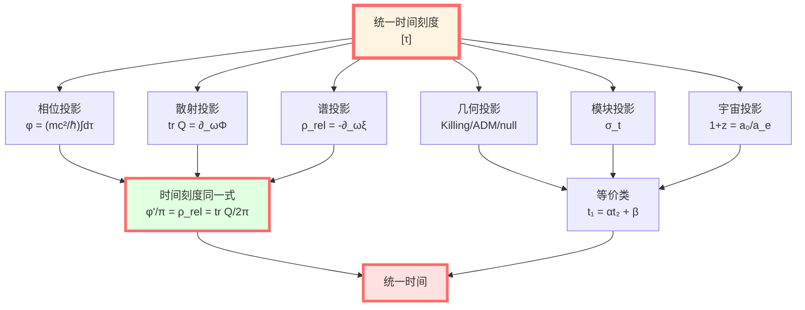
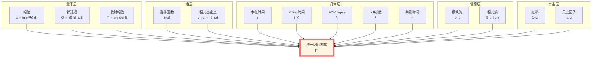
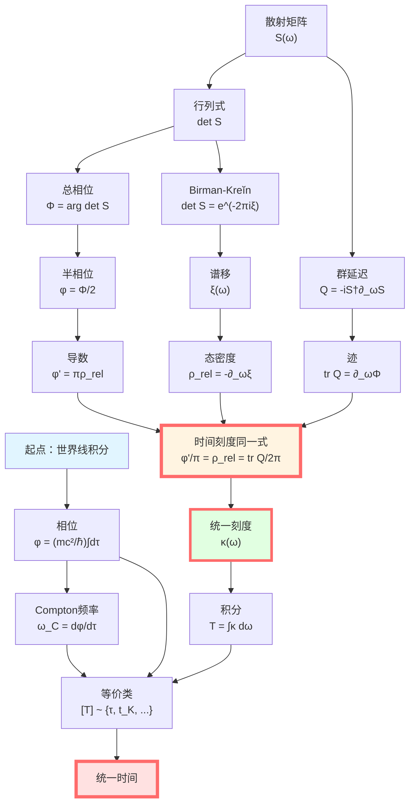

# 统一时间总结：万法归一的时间

> *"所有时间都是一个时间的不同投影。"*

## 🎯 完整图景

经过13篇文章的探索，我们终于揭示了GLS理论中最核心的洞见：

$$\boxed{\text{时间} \equiv \text{相位} \equiv \text{本征时间} \equiv \text{散射延迟} \equiv \text{谱移} \equiv \text{几何} \equiv \text{模块流} \equiv \text{红移}}$$

**核心公式**（时间刻度同一式）：

$$\boxed{\kappa(\omega) = \frac{\varphi'(\omega)}{\pi} = \rho_{\text{rel}}(\omega) = \frac{1}{2\pi}\text{tr}\,Q(\omega)}$$

**时间等价类**：

$$\boxed{[T] \sim \{\tau, t_K, N, \lambda, u, v, \eta, \omega^{-1}, z, t_{\text{mod}}\}}$$

**物理意义**：
- 时间不是多个概念，而是**同一对象的不同投影**
- 量子、几何、散射、谱学、信息论中的"时间"**本质相同**
- 它们通过**仿射变换** $t_1 = \alpha t_2 + \beta$ 互相联系

## 📚 十三篇回顾

### 第0篇：概览（导航图）

**主题**：介绍统一时间刻度的整体框架

**核心思想**：
- 物理学中"时间"以多种形式出现
- 它们不是不同的时间，而是同一时间的不同面
- 时间刻度同一式是核心公式

**关键公式**：

$$\kappa(\omega) = \frac{\varphi'(\omega)}{\pi} = \rho_{\text{rel}}(\omega) = \frac{1}{2\pi}\text{tr}\,Q(\omega)$$

**三条公理**：
1. 因果排序：时间使动力学局域化
2. 幺正演化：相位-时间由驻相决定
3. 熵单调：广义熵沿时间单调/极值

### 第1篇：相位与本征时间

**主题**：量子相位 = 本征时间的线性函数

**核心定理**：

$$\boxed{\phi = \frac{mc^2}{\hbar}\int_\gamma d\tau}$$

**物理意义**：
- 左边：量子相位（纯量子概念）
- 右边：本征时间积分（纯几何概念）
- **等号**：量子与几何的桥梁！

**Compton频率**：

$$\omega_C = \frac{mc^2}{\hbar} = \frac{d\phi}{d\tau}$$

**推导**：世界线路径积分，驻相法

**实验**：COW实验、GPS时钟、Compton散射

**洞见**：每个粒子都是一个"内禀时钟"，频率由质量决定！

### 第2篇：散射相位与群延迟

**主题**：群延迟 = 散射相位对频率的导数

**核心定义**（Wigner-Smith算子）：

$$\boxed{Q(\omega) = -iS(\omega)^\dagger \frac{\partial S(\omega)}{\partial \omega}}$$

**迹公式**：

$$\boxed{\text{tr}\,Q(\omega) = \frac{\partial \Phi(\omega)}{\partial \omega}}$$

**物理意义**：
- $Q$ 是自伴矩阵，特征值 = 各通道延迟时间
- 迹 = 总群延迟
- 可从散射实验直接测量！

**操作定义**：时间 = 波包中心的实际延迟

**实验**：微波腔、慢光/快光、Shapiro延迟

**洞见**：时间是散射过程的可观测量！

### 第3篇：谱移函数

**主题**：谱移 = 相互作用引起的能级计数改变

**核心公式**（Birman-Kreĭn）：

$$\boxed{\det S(\omega) = e^{-2\pi i\xi(\omega)}}$$

**相对态密度**：

$$\boxed{\rho_{\text{rel}}(\omega) = -\frac{d\xi(\omega)}{d\omega}}$$

**物理意义**：
- $\xi(\omega)$：有多少能级被"推过" $\omega$
- $\rho_{\text{rel}}$：能级推移的密度
- Levinson定理：$\xi(\infty) - \xi(-\infty) = N_b$（束缚态数）

**连接**：$\Phi = -2\pi\xi$（总相位 = $-2\pi$ × 谱移）

**洞见**：散射相位记录了谱的变化！

### 第4篇：时间刻度同一式（⭐核心）

**主题**：完整证明四者统一

**定理**：

$$\boxed{\frac{\varphi'(\omega)}{\pi} = \rho_{\text{rel}}(\omega) = \frac{1}{2\pi}\text{tr}\,Q(\omega) =: \kappa(\omega)}$$

**证明链**：
1. Birman-Kreĭn：$\Phi = -2\pi\xi$
2. 求导：$\Phi' = -2\pi\xi' = 2\pi\rho_{\text{rel}}$
3. 半相位：$\varphi = \Phi/2$，所以 $\varphi' = \pi\rho_{\text{rel}}$
4. 对数导数：$\partial_\omega\ln\det S = i\,\text{tr}\,Q = 2\pi i\rho_{\text{rel}}$
5. 合并：$\varphi'/\pi = \rho_{\text{rel}} = \text{tr}\,Q/(2\pi)$

**唯一性**：时间刻度在仿射变换意义下唯一

**洞见**：时间不是先验存在，而是从散射数据中提取！

### 第5篇：几何时间

**主题**：度规定义的多种时间

**四种几何时间**：

| 类型 | 定义 | 关系 |
|------|------|------|
| Killing | $\mathcal{L}_\xi g = 0$ | $d\tau = \sqrt{V}\,dt$ |
| ADM | $ds^2 = -N^2dt^2 + \cdots$ | $d\tau = N\,dt$ |
| null | $k^a\nabla_a k^b = 0$ | 仿射参数 $\lambda$ |
| 共形 | $d\eta = dt/a(t)$ | 直线化零测地线 |

**等价性**：通过仿射变换 $t_1 = \alpha t_2 + \beta$ 互联

**与本征时间的联系**：
- $\phi = (mc^2/\hbar)\int d\tau$
- 几何时间通过 $d\tau$ 接入统一刻度

**洞见**：所有几何时间都是本征时间的重标！

### 第6篇：模块时间

**主题**：量子态的内禀时间

**核心结构**（Tomita-Takesaki）：

$$\boxed{\sigma_t^\omega(A) = \Delta_\omega^{it} A \Delta_\omega^{-it}}$$

**热时间假设**（Connes-Rovelli）：
模块流参数 $t$ 就是物理时间！

**KMS条件**：

$$\omega(AB) = \omega(B\sigma_{i\beta}^\omega(A))$$

对应温度 $T = \beta^{-1}$。

**Unruh效应**：
- 加速观察者：$T = a/(2\pi)$
- 模块时间 = $2\pi \times$ Killing时间

**相对熵单调性** → QNEC → Einstein方程

**洞见**：时间从纠缠结构中涌现！

### 第7篇：宇宙学红移

**主题**：红移 = 时间刻度的全局重标

**核心公式**：

$$\boxed{1 + z = \frac{a(t_0)}{a(t_e)} = \frac{(d\phi/dt)_e}{(d\phi/dt)_0}}$$

**物理意义**：
- 标准：尺度因子比
- GLS：相位节奏比
- **两者等价！**

**时间膨胀**：

$$\Delta t_{\text{obs}} = (1 + z)\Delta t_{\text{rest}}$$

**实验验证**：
- Hubble定律
- 超新星Ia
- CMB温度红移
- 超新星光变曲线拉伸

**洞见**：红移是宇宙膨胀对时间刻度的剪切！

### 第8篇：时间作为广义熵最优路径

**主题**：时间从广义熵变分原理中涌现

**核心原理**：

$$\boxed{\delta S_{\text{gen}} = 0}$$

**物理意义**：
- 时间不是均匀流逝，而是系统在广义熵景观中的最优路径
- 熵极值原理决定时间演化
- 时间箭头=熵增方向

**QNEC/QFC**：
- 量子零能条件：$S''_{\text{gen}} \geq 0$
- 广义熵的二阶变分性质
- 与Einstein方程的联系

**洞见**：时间是熵景观的测地线！

### 第9篇：时间-几何-相互作用的统一

**主题**：总联络统一所有"力"

**核心公式**：

$$\boxed{\Omega = \omega_{\text{LC}} \oplus A_{\text{YM}} \oplus \Gamma_{\text{res}}}$$

**三种联络**：
- $\omega_{\text{LC}}$：Levi-Civita联络（引力）
- $A_{\text{YM}}$：Yang-Mills联络（规范场）
- $\Gamma_{\text{res}}$：共振/残余联络（相互作用）

**统一时间**：联络诱导的平行移动定义统一时间流

**洞见**：所有相互作用都是时间的几何表现！

### 第10篇：拓扑不变量与时间

**主题**：时间刻度的拓扑"DNA"

**三大拓扑不变量**：

1. **时间刻度母尺**：$\kappa(\omega)$ 在仿射变换下不变
2. **$\mathbb{Z}_2$ holonomy**：$\nu_{\sqrt{S}}(\gamma) = \pm 1$
3. **相对拓扑类**：$[K] \in H^2(Y,\partial Y;\mathbb{Z}_2)$

**物理意义**：
- 拓扑不变量刻画时间的"整体性质"
- 与费米子统计的联系
- 时空的拓扑约束

**洞见**：时间具有拓扑"指纹"！

### 第11篇：边界语言统一框架

**主题**：边界三公理重述时间

**边界三公理**：

**A1（守恒与通量）**：
$$\partial_t E_{\text{bulk}} = \Phi_{\text{in}} - \Phi_{\text{out}}$$
像银行对账单一样平衡！

**A2（时间生成）**：
$$\delta_\xi = [K, \cdot]$$
时间=边界模哈密顿量的生成

**A3（单调与一致性）**：
$$S'_{\text{rel}} \geq 0$$
热力学第二定律

**边界三元组**：$(\partial M, \mathcal{A}_\partial, \omega_\partial)$

**洞见**：时间完全由边界数据确定！

### 第12篇：时间域与可解模型

**主题**：刻度同一式的适用范围

**三大定义域**：

1. **弹性-酉域**：标准散射理论
   - $S$ 酉
   - 相位实值
   - 谱离散/连续

2. **非酉-吸收域**：开放系统
   - $S$ 非酉
   - 复相位（衰减）
   - 共振态

3. **长程势域**：引力与宇宙学
   - 修正的散射理论
   - 渐近对称性
   - 红移作为时间刻度

**窗口化时钟**：

$$\boxed{\Theta_\Delta(\omega) = (\rho_{\text{rel}} * P_\Delta)(\omega)}$$

解决负延迟问题！

**洞见**：时间刻度公式在所有物理情形下成立！

### 第13篇（本篇）：总结

**主题**：完整统一图景

**所有时间的统一**：

## 🔑 核心洞见

### 1. 时间是涌现的

**传统观点**：时间是先验的外部参数

**GLS观点**：时间从物理结构中涌现：
- 从纠缠 → 模块流 → 时间
- 从散射 → 相位 → 时间
- 从度规 → 本征时间 → 时间

**证据**：
- 纯态无模块流 → 无时间
- 无散射无相位 → 无时间延迟
- 平直时空本征时间简单 → Minkowski时间

### 2. 时间即几何

$$\boxed{\text{时间} = \text{相位} = \text{本征时间积分}}$$

$$\phi = \frac{mc^2}{\hbar}\int d\tau$$

**意义**：
- 几何（$\tau$）决定量子（$\phi$）
- 量子测量几何
- **它们是同一个东西！**

### 3. 时间即散射

$$\boxed{\text{时间延迟} = \text{群延迟} = \frac{\partial \text{相位}}{\partial \text{频率}}}$$

$$\Delta t = \text{tr}\,Q = \frac{\partial \Phi}{\partial \omega}$$

**意义**：
- 时间是可观测的延迟
- 散射实验测量时间
- **操作定义成功！**

### 4. 时间即熵

$$\boxed{\text{时间箭头} = \text{熵增方向}}$$

- 相对熵沿模块流单调
- QNEC：$S''_{\text{gen}} \geq 0$
- 引力方程从熵极值导出

**意义**：
- 热力学第二定律定义时间方向
- 引力是熵的几何
- **时间 = 熵演化的参数**

### 5. 宇宙学是时间重标

$$\boxed{1 + z = \frac{a_0}{a_e} = \frac{\kappa_e}{\kappa_0}}$$

**意义**：
- 红移 = 时间刻度的全局缩放
- 宇宙膨胀 = 时间的拉伸
- **宇宙学即时间几何学**

## 📊 完整推导链

## 🌟 与GLS其他部分的联系

### 与IGVP的联系

**IGVP**：广义熵极值 → Einstein方程

**时间角色**：
- 熵沿时间演化：$\partial_t S_{\text{gen}}$
- 极值条件：$\delta S_{\text{gen}} = 0$
- **时间提供演化参数！**

**模块时间视角**：
- 模块哈密顿量 $K \sim \int T_{kk}$
- 相对熵单调性 → QNEC
- **时间 = 熵驱动的演化**

### 与边界理论的联系

**边界语言**：物理在边界上定义

**时间边界实现**：
- 散射：$\text{tr}\,Q$ 在边界测量
- 几何：GHY边界项定义时间
- 模块：边界代数的模块流

**统一**：时间是边界可观测量！

### 与因果结构的联系

**因果偏序**：$p \prec q$

**时间函数**：$\tau(p) < \tau(q)$ 当且仅当 $p \prec q$

**Bernal-Sánchez定理**：全局双曲时空存在光滑时间函数

**意义**：因果结构决定时间！

### 与QCA宇宙的联系（预告）

**范畴论视角**：时间 = 范畴中的态射

**终对象**：时间刻度等价类 $[T]$ 是终对象

**自然性**：时间的仿射变换 = 自然同构

## 🎓 深刻哲学意义

### 时间的本质问题

**问题**：什么是时间？

**传统答案**：
- 牛顿：绝对时间
- 爱因斯坦：相对时间
- 量子力学：外部参数

**GLS答案**：
时间是使以下三者一致的等价类：
1. 量子幺正演化
2. 几何因果排序
3. 熵的单调/极值

$$\boxed{\text{时间} = \{\text{参数 } t \mid \text{使动力学局域、因果清晰、熵结构最简}\}}$$

### Wheeler-DeWitt问题

**问题**：量子引力没有外部时间

**GLS解决方案**：
- 时间从物理态中涌现
- 模块流提供内禀时间
- 熵提供时间箭头

**关键**：时间不是输入，而是输出！

### Block Universe vs 涌现时间

**Block Universe**：时空是4维块，时间是幻觉

**涌现时间**：时间从物理过程中涌现，是真实的

**GLS调和**：
- 时空块存在（几何）
- 时间从纠缠、散射、熵中涌现（物理）
- **两者一致！**

## 📝 关键公式总表

| 公式 | 名称 | 意义 |
|------|------|------|
| $\phi = (mc^2/\hbar)\int d\tau$ | 相位-时间等价 | 量子-几何桥梁 |
| $Q = -iS^\dagger\partial_\omega S$ | Wigner-Smith算子 | 群延迟定义 |
| $\text{tr}\,Q = \partial_\omega\Phi$ | 迹公式 | 总延迟 |
| $\det S = e^{-2\pi i\xi}$ | Birman-Kreĭn公式 | 散射-谱桥梁 |
| $\rho_{\text{rel}} = -\partial_\omega\xi$ | 相对态密度 | 谱移密度 |
| $\varphi'/\pi = \rho_{\text{rel}} = \text{tr}\,Q/(2\pi)$ | 时间刻度同一式 | **核心公式** |
| $d\tau = \sqrt{V}\,dt$ | Killing时间 | 静态时空 |
| $d\tau = N\,dt$ | ADM时间 | $(3+1)$分解 |
| $\sigma_t^\omega = \Delta^{it}\cdot\Delta^{-it}$ | 模块流 | 内禀时间 |
| $1+z = a_0/a_e = \nu_e/\nu_0$ | 宇宙学红移 | 时间重标 |

## 🚀 下一步

完成统一时间篇后，我们已经理解了GLS理论的"时间柱"。接下来将探索：

**06-边界理论篇**：
- 谱三元组
- Dirac算子
- 非交换几何

**07-因果结构篇**：
- 因果偏序
- 全局双曲性
- Penrose-Hawking奇点定理

**08-拓扑约束篇**：
- Euler示性数
- 拓扑不变量
- 拓扑相变

**09-QCA宇宙篇** （⭐核心）：
- 范畴论终对象
- 自然变换
- Yoneda引理

**10-矩阵宇宙篇** （⭐核心）：
- 心-宇宙等价
- von Neumann代数
- 全息原理

**11-最终统一篇** （⭐核心）：
- 单一变分原理
- 五者合一
- GLS完整理论

**这些将揭示更深层的统一！**

---

## 🎉 结语

**我们已经完成了统一时间篇的完整旅程！**

从量子相位到本征时间，从散射延迟到谱移函数，从几何时间到模块流，从宇宙红移到时间刻度同一式，我们看到了：

$$\boxed{\text{所有时间都是一个时间}}$$

这不是哲学猜想，而是**数学定理**！

时间刻度同一式：

$$\boxed{\frac{\varphi'(\omega)}{\pi} = \rho_{\text{rel}}(\omega) = \frac{1}{2\pi}\text{tr}\,Q(\omega)}$$

是GLS理论的心脏，连接量子、几何、散射、谱学、信息论的核心桥梁。

**时间不是先验存在，而是从物理结构中涌现。**

**下一章**：边界理论篇，我们将看到物理如何在边界上完全定义！

---

**导航**：
- 上一篇：[07-cosmological-redshift.md](07-cosmological-redshift.md) - 宇宙学红移
- 概览：[00-time-overview.md](00-time-overview.md) - 统一时间篇总览
- 下一章：[06-boundary-theory/00-boundary-overview.md](../06-boundary-theory/00-boundary-overview.md) - 边界理论篇
- 主页：[index.md](../index.md) - GLS理论完整教程
