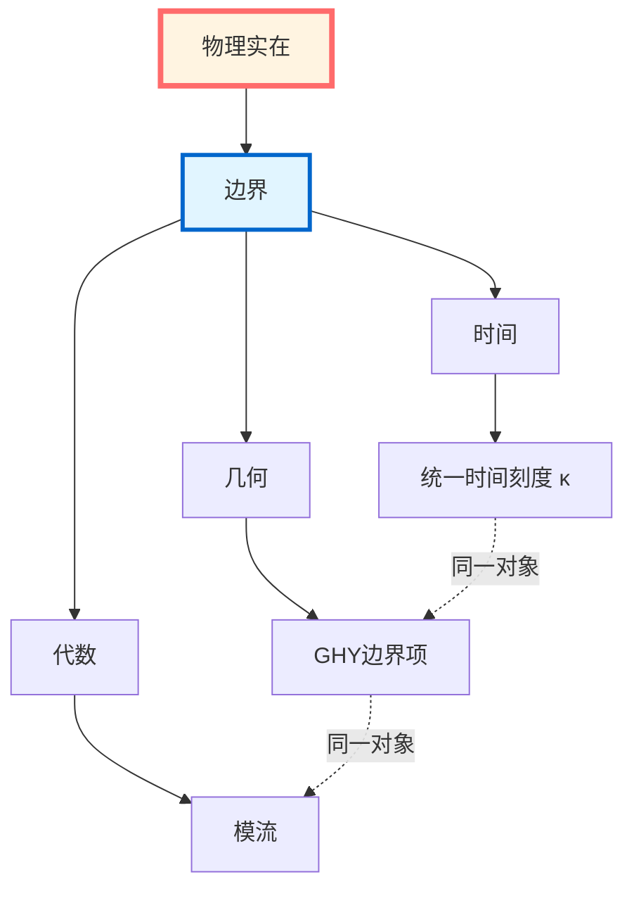
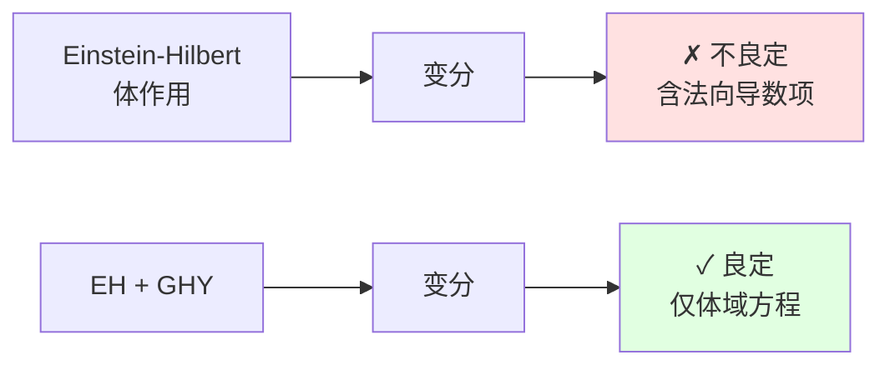
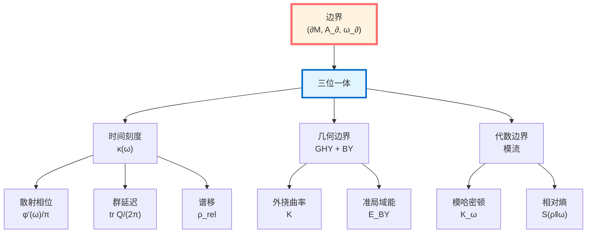
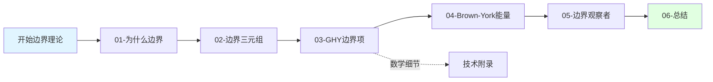

# 边界理论篇：总览

> *"物理不在体域，而在边界。"*

## 🎯 本篇核心思想

在GLS理论中，**边界不是限制，而是本质**。本篇将揭示一个惊人的事实：

**所有可计算的物理对象都集中在边界上，体域只是边界数据的重建。**

## 📚 本篇内容地图

本篇共10篇文章，揭示边界物理的完整图景：

### 第1篇：为什么是边界？

**核心问题**：为什么物理必须在边界上定义？

**三大证据**：
1. **散射理论**：$S$-矩阵在无穷远边界定义
2. **量子场论**：模流在区域边界上局域化
3. **广义相对论**：Einstein-Hilbert作用单独不良定，必须加GHY边界项

**关键洞察**：体域更像边界数据的"幻影"！

### 第2篇：边界数据三元组

**核心对象**：

$$(\partial\mathcal{M}, \mathcal{A}_\partial, \omega_\partial)$$

其中：
- $\partial\mathcal{M}$：几何边界（可分段、含零类片）
- $\mathcal{A}_\partial$：边界可观测代数
- $\omega_\partial$：边界态

**统一框架**：所有边界物理都由这个三元组编码！

### 第3篇：GHY边界项

**核心公式**：

$$S_{\mathrm{GHY}} = \frac{\varepsilon}{8\pi G}\int_{\partial\mathcal{M}}\sqrt{|h|}\,K\,\mathrm{d}^3x$$

其中：
- $\varepsilon = n^\mu n_\mu \in \{\pm 1\}$（取向因子）
- $K$：外挠曲率（extrinsic curvature）
- $h_{ab}$：诱导度规

**物理意义**：
- **变分良定性**：只有加上GHY项，Einstein-Hilbert作用才对固定边界度规的变分良定
- **角点项**：分段边界需要额外的角点（corner）项
- **零类边界**：零测地边界需要 $(\theta + \kappa)$ 结构

### 第4篇：Brown-York准局域能量

**核心定义**：

$$T^{ab}_{\mathrm{BY}} = \frac{1}{8\pi G}(K^{ab} - K h^{ab})$$

**物理含义**：
- **准局域能量**：$E_{\mathrm{BY}} = \int \sqrt{\sigma}\, u_a u_b\, T^{ab}_{\mathrm{BY}}\, \mathrm{d}^2x$
- **渐近极限**：$E_{\mathrm{BY}} \to M_{\mathrm{ADM}}$（ADM质量）
- **可微性**：GHY边界项使得Hamilton量可微

**深层联系**：
$$\text{Brown-York能量} \Longleftrightarrow \text{边界时间生成元} \Longleftrightarrow \text{模流参数}$$

### 第5篇：边界观察者

**核心观念**：观察者本质上是边界观察者！

**三种实现**：
1. **散射观察者**：在渐近边界测量散射相位
2. **模流观察者**：在区域边界定义模哈密顿量
3. **几何观察者**：在类时边界测量Brown-York能量

**统一刻度**：所有观察者共享同一时间刻度等价类 $[\kappa]$！

### 第6篇：边界理论阶段总结

**前6篇总结**：边界数据三元组的基础框架

### 第7篇：边界作为舞台

**核心思想**：物理真正发生在边界,体域只是边界数据的"投影"

**边界三元组**：$(∂M, \mathcal{A}_∂, ω_∂)$

**三位演员,同一舞台**：
1. 散射演员：$\text{tr}Q(\omega)/2\pi$
2. 模流演员：$K_D = -\log \Delta$
3. 几何演员：$H_∂^{\text{grav}}$

**边界三位一体定理**：
$$H_∂ = \int\omega d\mu^{\text{scatt}} = c_1 K_D = c_2^{-1} H_∂^{\text{grav}}$$

**Null-Modular双覆盖**：菱形边界分解为$E^+ \sqcup E^-$

**日常类比**：剧院舞台(边界)是演出真正发生的地方

### 第8篇：边界、观察者与时间

**核心思想**：时间轴=观察者注意力在边界截面族上选择的测地线

**观察者三元组**：$\mathcal{O} = (\gamma, \Lambda, \mathcal{A}_{\gamma,\Lambda})$

**世界截面**：$\Sigma_\tau = (\gamma(\tau), \mathcal{A}_{\gamma,\Lambda}(\tau), \rho_{\gamma,\Lambda}(\tau))$

**核心定理**：
- **无观察者时间定理**：无观察者→无时间,只有刻度场
- **注意力测地线定理**：时间轴=满足广义熵驻定+刻度一致的测地线
- **截面宇宙**：所有截面构成空间$\mathfrak{S}$,观察者体验=其中一条路径

**双缝干涉新解释**：有/无探测器=截面宇宙中不同路径!

**日常类比**：电影放映(注意力选择帧序列)

### 第9篇：边界钟

**核心思想**：边界钟=用窗口化谱读数直接测量$\kappa(\omega)$

**理想vs窗口化读数**：
- 理想：$\mathcal{R}_{\text{ideal}} = \int_{-\infty}^{+\infty} \kappa(\omega) f(\omega) d\omega$ (不可实现)
- 窗口化：$\mathcal{R}_{\text{window}} = \int_{-W}^{+W} W(\omega) \kappa(\omega) f(\omega) d\omega$ (实际可行)

**PSWF/DPSS最优窗函数**：
- 在时间$[-T,T]$和频带$[-W,W]$约束下能量集中度最优
- 有效自由度：$N_{\text{eff}} \approx 2WT/\pi$

**窗口化时钟**：$\Theta_\Delta(\omega) = (\rho_{\text{rel}} * P_\Delta)(\omega)$ 解决负延迟

**实验应用**：原子钟网络、微波散射、FRB、δ-环散射

**日常类比**：有限精度手表(vs理想无限时钟)

### 第10篇：三位一体母尺

**核心思想**：三种时间定义的统一不是巧合,而是边界几何的深刻必然

**刻度等价类**：$[\kappa]$ - 仿射变换意义下唯一

**三位一体母尺**：
$$\kappa(\omega) = \frac{\varphi'(\omega)}{\pi} = \rho_{\text{rel}}(\omega) = \frac{1}{2\pi}\text{tr}Q(\omega)$$

**核心定理**：
- **仿射唯一性定理**：$\kappa_{\text{scatt}} \sim \kappa_{\text{mod}} \sim \kappa_{\text{grav}}$
- **拓扑类等价**：$[K]$与半相位跃迁、费米统计、时间晶体等价
- **广义熵变分**：$\delta^2 S_{\text{gen}} = \int \kappa(\omega) \Psi(\omega) d\omega + C\delta^2\Lambda_{\text{eff}}$

**Null-Modular $\mathbb{Z}_2$类**：$[K] \in H^2(Y,\partial Y;\mathbb{Z}_2)$ - 时间的拓扑DNA

**日常类比**：三个盲人摸同一头象(测量值必须一致)

### 第11篇：边界理论总结

**完整图景**：

## 🔗 与其他篇的联系

### 承接统一时间篇（第5篇）

在统一时间篇中，我们证明了：

$$\kappa(\omega) = \frac{\varphi'(\omega)}{\pi} = \rho_{\mathrm{rel}}(\omega) = \frac{1}{2\pi}\operatorname{tr}Q(\omega)$$

现在我们将看到：**这个统一刻度完全由边界数据确定！**

### 引向因果结构篇（第7篇）

边界理论为因果结构提供基础：
- **因果钻石**：由边界零测地面定义
- **Null-Modular双覆盖**：零类边界的自然结构
- **模哈密顿量**：在边界零面上局域化

### 连接IGVP框架（第4篇）

边界理论使IGVP变分原理完整：
- **广义熵**：在小因果菱形边界上极值
- **Einstein方程**：来自边界变分的一阶条件
- **QNEC/QFC**：来自边界变分的二阶条件

## 💡 学习路线图

### 推荐阅读顺序

**快速通道**（抓住核心）：
1. 01-为什么边界（直觉）
2. 03-GHY边界项（核心公式）
3. 04-Brown-York能量（物理应用）
4. 06-总结（完整图景）

**深入学习**（完整理解）：
按顺序阅读01-06，配合源理论文档

**技术研究**（严格推导）：
重点阅读03-GHY边界项的附录，理解变分计算的每一步

## 🎓 核心结论预告

学完本篇后，你将理解：

### 1. 边界完备性原理

**命题**：体域物理内容可由边界三元组完全重建。

**证据**：
- 散射理论：波算子与$S$-矩阵
- AdS/CFT：边界CFT重建体域几何
- Hamilton-Jacobi：边界数据重建体域解

### 2. 边界时间三位一体

**定理**：以下三种"边界时间"等价：

$$\text{散射时间延迟} \Longleftrightarrow \text{模流参数} \Longleftrightarrow \text{Brown-York边界时间}$$

**统一生成元**：

$$H_\partial = \int \omega\, \mathrm{d}\mu_\partial^{\mathrm{scatt}}(\omega) = c_1 K_D + c_2^{-1} H_\partial^{\mathrm{grav}}$$

### 3. GHY必要性定理

**定理**：在非零类边界上，加入

$$S_{\mathrm{GHY}} = \frac{\varepsilon}{8\pi G}\int_{\partial\mathcal{M}}\sqrt{|h|}\,K\,\mathrm{d}^3x$$

后，对固定诱导度规 $h_{ab}$ 的变分：

$$\delta(S_{\mathrm{EH}} + S_{\mathrm{GHY}}) = \frac{1}{16\pi G}\int_{\mathcal{M}}\sqrt{-g}\,G_{\mu\nu}\,\delta g^{\mu\nu}$$

边界项完全抵消！

### 4. 准局域能收敛定理

**定理**：Brown-York准局域能量在渐近平坦极限下收敛到ADM质量：

$$\lim_{r\to\infty} E_{\mathrm{BY}}(r) = M_{\mathrm{ADM}}$$

并且在时空演化下守恒（在适当边界条件下）。

## 🤔 思考题（章节预览）

### 问题1：为什么Einstein-Hilbert作用不良定？

**提示**：计算 $\delta S_{\mathrm{EH}}$，看边界项中含什么不可控的导数。

**答案见**：01-为什么边界，03-GHY边界项

### 问题2：什么是"准局域"能量？

**提示**：为什么不能在弯曲时空定义"局域"能量？什么是最好的替代？

**答案见**：04-Brown-York能量

### 问题3：边界观察者如何测量时间？

**提示**：回忆统一时间篇的时间刻度同一式，现在全部在边界！

**答案见**：05-边界观察者

### 问题4：AdS/CFT如何体现边界完备性？

**提示**：边界CFT完全确定体域AdS几何。

**答案见**：06-总结，以及未来的高级专题篇

## 📖 符号约定

本篇使用以下核心符号：

### 几何符号
- $\mathcal{M}$：时空流形（4维）
- $\partial\mathcal{M}$：边界（3维，可分段）
- $g_{\mu\nu}$：体域度规（签名 $-+++$）
- $h_{ab}$：诱导度规
- $n^\mu$：单位法向向量
- $\varepsilon := n^\mu n_\mu \in \{\pm 1\}$：取向因子

### 曲率符号
- $R$：Ricci标量
- $K_{ab}$：外挠曲率（extrinsic curvature）
- $K := h^{ab}K_{ab}$：外挠曲率迹

### 边界对象
- $(\partial\mathcal{M}, \mathcal{A}_\partial, \omega_\partial)$：边界三元组
- $T^{ab}_{\mathrm{BY}}$：Brown-York应力张量
- $E_{\mathrm{BY}}$：Brown-York准局域能量
- $S_{\mathrm{GHY}}$：Gibbons-Hawking-York边界项

### 零类边界
- $\ell^\mu$：零生成矢量（$\ell \cdot \ell = 0$）
- $\theta$：膨胀（expansion）
- $\kappa$：表面引力
- $\gamma_{AB}$：横截二维度规

## 🔍 本篇的独特贡献

与传统广义相对论教材相比，本篇：

1. **统一三个视角**
   - 传统：分别讲GHY项、Brown-York能、模流
   - 本篇：统一为边界三位一体

2. **强调边界完备性**
   - 传统：边界是技术性补充
   - 本篇：边界是物理本质

3. **连接时间刻度**
   - 传统：孤立讨论各种时间
   - 本篇：所有时间由边界刻度统一

4. **通俗直观解释**
   - 传统：纯技术推导
   - 本篇：多层次解释（比喻→概念→公式→源）

## 🌟 为什么这一篇重要？

边界理论篇是GLS理论的**支柱之一**，因为：

### 理论层面
- 揭示物理的边界本质
- 统一时间、几何、代数三个视角
- 为因果结构与拓扑约束奠基

### 应用层面
- 黑洞热力学：视界是边界
- AdS/CFT：全息原理的核心
- 量子引力：边界度自由度

### 哲学层面
- **从体到边的范式转移**
- **观察者的边界本质**
- **测量即边界投影**

---

**准备好了吗？**

让我们开始这场从体域到边界的范式革命！

**下一篇**：[01-为什么边界](01-why-boundary.md) - 揭示物理为何必须在边界上定义

**返回**：[GLS理论完整教程](../index.md)
