```mermaid
graph TB
    PHYS["Physical Reality"] --> BOUND["Boundary"]
    BOUND --> TIME["Time"]
    BOUND --> GEO["Geometry"]
    BOUND --> ALG["Algebra"]

    TIME --> KAPPA["Unified Time Scale κ"]
    GEO --> GHY["GHY Boundary Term"]
    ALG --> MOD["Modular Flow"]

    KAPPA -.->|"Same Object"| GHY
    GHY -.->|"Same Object"| MOD

    style PHYS fill:#fff4e1,stroke:#ff6b6b,stroke-width:4px
    style BOUND fill:#e1f5ff,stroke:#0066cc,stroke-width:3px
```

# Boundary Theory: Overview

> *"Physics is not in the bulk, but on the boundary."*

## 🎯 Core Ideas of This Chapter

In GLS theory, **boundary is not a limitation, but essence**. This chapter will reveal an astonishing fact:

**All computable physical objects concentrate on the boundary, the bulk is just reconstruction of boundary data.**

## 📚 Chapter Content Map

This chapter consists of 10 articles, revealing the complete picture of boundary physics:

### Article 1: Why Boundary?

**Core Question**: Why must physics be defined on the boundary?

**Three Major Evidences**:
1. **Scattering Theory**: $S$-matrix defined at asymptotic boundary
2. **Quantum Field Theory**: Modular flow localized on region boundary
3. **General Relativity**: Einstein-Hilbert action alone ill-defined, must add GHY boundary term

**Key Insight**: Bulk is more like a "phantom" of boundary data!

### Article 2: Boundary Data Triplet

**Core Object**:

$$(\partial\mathcal{M}, \mathcal{A}_\partial, \omega_\partial)$$

where:
- $\partial\mathcal{M}$: Geometric boundary (can be piecewise, contains null pieces)
- $\mathcal{A}_\partial$: Boundary observable algebra
- $\omega_\partial$: Boundary state

**Unified Framework**: All boundary physics encoded by this triplet!

### Article 3: GHY Boundary Term

**Core Formula**:

$$S_{\mathrm{GHY}} = \frac{\varepsilon}{8\pi G}\int_{\partial\mathcal{M}}\sqrt{|h|}\,K\,\mathrm{d}^3x$$

where:
- $\varepsilon = n^\mu n_\mu \in \{\pm 1\}$ (orientation factor)
- $K$: Extrinsic curvature
- $h_{ab}$: Induced metric

**Physical Meaning**:
- **Variational Well-Definedness**: Only with GHY term, Einstein-Hilbert action is well-defined for variations fixing boundary metric
- **Corner Terms**: Piecewise boundaries need additional corner terms
- **Null Boundaries**: Null geodesic boundaries need $(\theta + \kappa)$ structure

### Article 4: Brown-York Quasi-Local Energy

**Core Definition**:

$$T^{ab}_{\mathrm{BY}} = \frac{1}{8\pi G}(K^{ab} - K h^{ab})$$

**Physical Meaning**:
- **Quasi-Local Energy**: $E_{\mathrm{BY}} = \int \sqrt{\sigma}\, u_a u_b\, T^{ab}_{\mathrm{BY}}\, \mathrm{d}^2x$
- **Asymptotic Limit**: $E_{\mathrm{BY}} \to M_{\mathrm{ADM}}$ (ADM mass)
- **Differentiability**: GHY boundary term makes Hamiltonian differentiable

**Deep Connection**:
$$\text{Brown-York Energy} \Longleftrightarrow \text{Boundary Time Generator} \Longleftrightarrow \text{Modular Flow Parameter}$$

### Article 5: Boundary Observer

**Core Concept**: Observer is essentially a boundary observer!

**Three Realizations**:
1. **Scattering Observer**: Measures scattering phase at asymptotic boundary
2. **Modular Flow Observer**: Defines modular Hamiltonian on region boundary
3. **Geometric Observer**: Measures Brown-York energy on timelike boundary

**Unified Scale**: All observers share the same time scale equivalence class $[\kappa]$!

### Article 6: Boundary Theory Mid-Summary

**Summary of First 6 Articles**: Basic framework of boundary data triplet

### Article 7: Boundary as Stage

**Core Idea**: Physics truly happens on boundary, bulk is just "projection" of boundary data

**Boundary Triplet**: $(∂M, \mathcal{A}_∂, ω_∂)$

**Three Actors, Same Stage**:
1. Scattering Actor: $\text{tr}Q(\omega)/2\pi$
2. Modular Flow Actor: $K_D = -\log \Delta$
3. Geometric Actor: $H_∂^{\text{grav}}$

**Boundary Trinity Theorem**:
$$H_∂ = \int\omega d\mu^{\text{scatt}} = c_1 K_D = c_2^{-1} H_∂^{\text{grav}}$$

**Null-Modular Double Cover**: Diamond boundary decomposes as $E^+ \sqcup E^-$

**Daily Analogy**: Theater stage (boundary) is where performance truly happens

### Article 8: Boundary, Observer, and Time

**Core Idea**: Time axis = geodesic chosen by observer attention on boundary section family

**Observer Triplet**: $\mathcal{O} = (\gamma, \Lambda, \mathcal{A}_{\gamma,\Lambda})$

**World Section**: $\Sigma_\tau = (\gamma(\tau), \mathcal{A}_{\gamma,\Lambda}(\tau), \rho_{\gamma,\Lambda}(\tau))$

**Core Theorems**:
- **No-Observer Time Theorem**: No observer → No time, only scale field
- **Attention Geodesic Theorem**: Time axis = geodesic satisfying generalized entropy stationary + scale consistency
- **Section Universe**: All sections form space $\mathfrak{S}$, observer experience = a path in it

**New Interpretation of Double-Slit Interference**: With/without detector = different paths in section universe!

**Daily Analogy**: Film projection (attention selects frame sequence)

### Article 9: Boundary Clock

**Core Idea**: Boundary clock = directly measure $\kappa(\omega)$ using windowed spectral readings

**Ideal vs Windowed Reading**:
- Ideal: $\mathcal{R}_{\text{ideal}} = \int_{-\infty}^{+\infty} \kappa(\omega) f(\omega) d\omega$ (impossible)
- Windowed: $\mathcal{R}_{\text{window}} = \int_{-W}^{+W} W(\omega) \kappa(\omega) f(\omega) d\omega$ (practically feasible)

**PSWF/DPSS Optimal Window Functions**:
- Optimal energy concentration under constraints of time $[-T,T]$ and frequency band $[-W,W]$
- Effective degrees of freedom: $N_{\text{eff}} \approx 2WT/\pi$

**Windowed Clock**: $\Theta_\Delta(\omega) = (\rho_{\text{rel}} * P_\Delta)(\omega)$ solves negative delay

**Experimental Applications**: Atomic clock networks, microwave scattering, FRB, δ-ring scattering

**Daily Analogy**: Finite precision watch (vs ideal infinite clock)

### Article 10: Trinity Master Scale

**Core Idea**: Unification of three time definitions is not coincidence, but profound necessity of boundary geometry

**Scale Equivalence Class**: $[\kappa]$ - unique under affine transformation

**Trinity Master Scale**:
$$\kappa(\omega) = \frac{\varphi'(\omega)}{\pi} = \rho_{\text{rel}}(\omega) = \frac{1}{2\pi}\text{tr}Q(\omega)$$

**Core Theorems**:
- **Affine Uniqueness Theorem**: $\kappa_{\text{scatt}} \sim \kappa_{\text{mod}} \sim \kappa_{\text{grav}}$
- **Topological Class Equivalence**: $[K]$ equivalent to half-phase transition, fermion statistics, time crystal
- **Generalized Entropy Variation**: $\delta^2 S_{\text{gen}} = \int \kappa(\omega) \Psi(\omega) d\omega + C\delta^2\Lambda_{\text{eff}}$

**Null-Modular $\mathbb{Z}_2$ Class**: $[K] \in H^2(Y,\partial Y;\mathbb{Z}_2)$ - topological DNA of time

**Daily Analogy**: Three blind men touching the same elephant (measured values must agree)

### Article 11: Boundary Theory Summary

**Complete Picture**:

```mermaid
graph TB
    BOUNDARY["Boundary<br/>(∂M, A_∂, ω_∂)"] --> THREE["Trinity"]

    THREE --> TIME["Time Scale<br/>κ(ω)"]
    THREE --> GEO["Geometric Boundary<br/>GHY + BY"]
    THREE --> ALG["Algebraic Boundary<br/>Modular Flow"]

    TIME --> SCATTER["Scattering Phase<br/>φ'(ω)/π"]
    TIME --> WIGNER["Group Delay<br/>tr Q/(2π)"]
    TIME --> SPEC["Spectral Shift<br/>ρ_rel"]

    GEO --> K["Extrinsic Curvature<br/>K"]
    GEO --> ENERGY["Quasi-Local Energy<br/>E_BY"]

    ALG --> MOD["Modular Hamiltonian<br/>K_ω"]
    ALG --> ENT["Relative Entropy<br/>S(ρ‖ω)"]

    style BOUNDARY fill:#fff4e1,stroke:#ff6b6b,stroke-width:4px
    style THREE fill:#e1f5ff,stroke:#0066cc,stroke-width:3px
```

## 🔗 Connections with Other Chapters

### Following Unified Time Chapter (Chapter 5)

In Unified Time chapter, we proved:

$$\kappa(\omega) = \frac{\varphi'(\omega)}{\pi} = \rho_{\mathrm{rel}}(\omega) = \frac{1}{2\pi}\operatorname{tr}Q(\omega)$$

Now we will see: **This unified scale is completely determined by boundary data!**

### Leading to Causal Structure Chapter (Chapter 7)

Boundary theory provides foundation for causal structure:
- **Causal Diamond**: Defined by boundary null surfaces
- **Null-Modular Double Cover**: Natural structure of null boundaries
- **Modular Hamiltonian**: Localized on boundary null surfaces

### Connecting IGVP Framework (Chapter 4)

Boundary theory completes IGVP variational principle:
- **Generalized Entropy**: Extremum on small causal diamond boundary
- **Einstein Equation**: First-order condition from boundary variation
- **QNEC/QFC**: Second-order conditions from boundary variation

## 💡 Learning Roadmap

### Recommended Reading Order

**Quick Path** (grasp core):
1. 01-Why Boundary (intuition)
2. 03-GHY Boundary Term (core formula)
3. 04-Brown-York Energy (physical application)
4. 06-Summary (complete picture)

**Deep Learning** (complete understanding):
Read 01-06 in order, with source theory documents

**Technical Research** (rigorous derivation):
Focus on appendix of 03-GHY Boundary Term, understand every step of variational calculation

## 🎓 Core Conclusions Preview

After completing this chapter, you will understand:

### 1. Boundary Completeness Principle

**Proposition**: Bulk physics content can be completely reconstructed from boundary triplet.

**Evidence**:
- Scattering theory: Wave operators and $S$-matrix
- AdS/CFT: Boundary CFT reconstructs bulk geometry
- Hamilton-Jacobi: Boundary data reconstructs bulk solution

### 2. Boundary Time Trinity

**Theorem**: The following three "boundary times" are equivalent:

$$\text{Scattering Time Delay} \Longleftrightarrow \text{Modular Flow Parameter} \Longleftrightarrow \text{Brown-York Boundary Time}$$

**Unified Generator**:

$$H_\partial = \int \omega\, \mathrm{d}\mu_\partial^{\mathrm{scatt}}(\omega) = c_1 K_D + c_2^{-1} H_\partial^{\mathrm{grav}}$$

### 3. GHY Necessity Theorem

**Theorem**: On non-null boundaries, after adding

$$S_{\mathrm{GHY}} = \frac{\varepsilon}{8\pi G}\int_{\partial\mathcal{M}}\sqrt{|h|}\,K\,\mathrm{d}^3x$$

for variations fixing induced metric $h_{ab}$:

$$\delta(S_{\mathrm{EH}} + S_{\mathrm{GHY}}) = \frac{1}{16\pi G}\int_{\mathcal{M}}\sqrt{-g}\,G_{\mu\nu}\,\delta g^{\mu\nu}$$

Boundary terms completely cancel!

### 4. Quasi-Local Energy Convergence Theorem

**Theorem**: Brown-York quasi-local energy converges to ADM mass in asymptotically flat limit:

$$\lim_{r\to\infty} E_{\mathrm{BY}}(r) = M_{\mathrm{ADM}}$$

And is conserved under spacetime evolution (under appropriate boundary conditions).

## 🤔 Thinking Questions (Chapter Preview)

### Question 1: Why is Einstein-Hilbert Action Ill-Defined?

**Hint**: Calculate $\delta S_{\mathrm{EH}}$, see what uncontrollable derivatives appear in boundary terms.

**Answer in**: 01-Why Boundary, 03-GHY Boundary Term

### Question 2: What is "Quasi-Local" Energy?

**Hint**: Why can't we define "local" energy in curved spacetime? What is the best alternative?

**Answer in**: 04-Brown-York Energy

### Question 3: How Do Boundary Observers Measure Time?

**Hint**: Recall time scale identity from Unified Time chapter, now all on boundary!

**Answer in**: 05-Boundary Observer

### Question 4: How Does AdS/CFT Reflect Boundary Completeness?

**Hint**: Boundary CFT completely determines bulk AdS geometry.

**Answer in**: 06-Summary, and future advanced topics chapters

## 📖 Notation Conventions

This chapter uses the following core symbols:

### Geometric Symbols
- $\mathcal{M}$: Spacetime manifold (4-dimensional)
- $\partial\mathcal{M}$: Boundary (3-dimensional, can be piecewise)
- $g_{\mu\nu}$: Bulk metric (signature $-+++$)
- $h_{ab}$: Induced metric
- $n^\mu$: Unit normal vector
- $\varepsilon := n^\mu n_\mu \in \{\pm 1\}$: Orientation factor

### Curvature Symbols
- $R$: Ricci scalar
- $K_{ab}$: Extrinsic curvature
- $K := h^{ab}K_{ab}$: Trace of extrinsic curvature

### Boundary Objects
- $(\partial\mathcal{M}, \mathcal{A}_\partial, \omega_\partial)$: Boundary triplet
- $T^{ab}_{\mathrm{BY}}$: Brown-York stress tensor
- $E_{\mathrm{BY}}$: Brown-York quasi-local energy
- $S_{\mathrm{GHY}}$: Gibbons-Hawking-York boundary term

### Null Boundaries
- $\ell^\mu$: Null generator vector ($\ell \cdot \ell = 0$)
- $\theta$: Expansion
- $\kappa$: Surface gravity
- $\gamma_{AB}$: Transverse two-dimensional metric

## 🔍 Unique Contributions of This Chapter

Compared to traditional general relativity textbooks, this chapter:

1. **Unifies Three Perspectives**
   - Traditional: Separately discuss GHY term, Brown-York energy, modular flow
   - This chapter: Unified as boundary trinity

2. **Emphasizes Boundary Completeness**
   - Traditional: Boundary is technical supplement
   - This chapter: Boundary is physical essence

3. **Connects Time Scale**
   - Traditional: Isolated discussion of various times
   - This chapter: All times unified by boundary scale

4. **Intuitive Explanations**
   - Traditional: Pure technical derivation
   - This chapter: Multi-level explanations (analogy → concept → formula → source)

## 🌟 Why Is This Chapter Important?

Boundary Theory is one of the **pillars** of GLS theory, because:

### Theoretical Level
- Reveals boundary essence of physics
- Unifies three perspectives: time, geometry, algebra
- Provides foundation for causal structure and topological constraints

### Application Level
- Black hole thermodynamics: Horizon is boundary
- AdS/CFT: Core of holographic principle
- Quantum gravity: Boundary degrees of freedom

### Philosophical Level
- **Paradigm shift from bulk to boundary**
- **Boundary essence of observer**
- **Measurement as boundary projection**

---

**Ready?**

Let's begin this paradigm revolution from bulk to boundary!

**Next Article**: [01-Why Boundary](01-why-boundary.md) - Revealing why physics must be defined on boundary

**Return**: [GLS Theory Complete Tutorial](../index.md)
